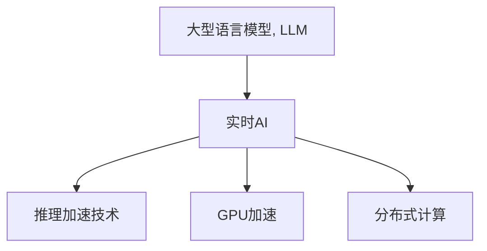

                 

# 实时AI：LLM的毫秒级响应

## 1. 背景介绍

### 1.1 问题由来
随着人工智能技术的飞速发展，特别是大型语言模型（LLM）在自然语言处理（NLP）领域的表现令人瞩目。LLM如GPT-3、BERT等，以其强大的语言理解能力和生成能力，广泛应用于机器翻译、文本摘要、问答系统等众多场景。然而，尽管LLM在处理复杂文本任务上表现出色，但其响应时间往往较长，难以满足实时应用的需求。

### 1.2 问题核心关键点
如何实现LLM的实时响应，成为当前NLP研究的一个热点问题。实时AI（Real-Time AI）技术的引入，旨在通过优化模型架构、算法设计和工程实践，使LLM能够在毫秒级内完成文本理解和生成，从而实现真正的实时应用。

### 1.3 问题研究意义
实时AI技术不仅能提升NLP应用的响应速度，还能显著提升用户体验和系统效率。实时AI的应用场景包括但不限于智能客服、智能翻译、智能语音助手等，具有极大的市场潜力。对于推动人工智能技术的实际落地和商业化应用，实时AI技术的突破具有重要意义。

## 2. 核心概念与联系

### 2.1 核心概念概述

要深入理解实时AI技术，首先需要对其中几个关键概念进行介绍：

- 大型语言模型（LLM）：指通过大规模无标签文本预训练得到的通用语言模型，具备强大的语言理解和生成能力。
- 实时AI（Real-Time AI）：指在确保模型性能的前提下，实现模型推理计算的实时性，即在毫秒级内完成推理过程。
- 推理加速技术：包括模型剪枝、量化、缓存、并行计算等技术手段，用于优化模型的推理性能。
- GPU加速：利用图形处理器（GPU）的高并行计算能力，大幅提高模型推理速度。
- 分布式计算：通过分布式系统实现模型推理的并行化，进一步提升推理效率。

这些概念之间的联系可以通过以下Mermaid流程图来展示：



这个流程图展示了LLM和实时AI之间的关系，以及它们是如何通过不同的技术手段实现实时推理的。

## 3. 核心算法原理 & 具体操作步骤

### 3.1 算法原理概述
实时AI的核心在于通过一系列优化技术，实现LLM的快速推理。这些技术包括但不限于模型剪枝、量化、并行计算、GPU加速和分布式计算等。

#### 3.1.1 模型剪枝
模型剪枝是一种通过去除不重要的参数来减少模型复杂度的方法。对于大型语言模型，模型剪枝可以有效降低计算和存储需求，提升推理速度。

#### 3.1.2 量化
量化是将浮点数模型转换为固定点数的模型，减少内存占用和计算开销。量化后的模型可以在CPU或GPU上运行，大幅提升推理速度。

#### 3.1.3 并行计算
并行计算通过同时计算多个数据点，提高计算效率。对于大型语言模型，并行计算可以显著缩短推理时间。

#### 3.1.4 GPU加速
GPU加速利用了GPU的高并行计算能力，将模型的计算任务分配给多个GPU核心并行计算，实现推理速度的显著提升。

#### 3.1.5 分布式计算
分布式计算通过将计算任务分散到多个计算节点上并行计算，进一步提升推理效率。

### 3.2 算法步骤详解

#### 3.2.1 模型选择
选择合适的LLM模型，如GPT-3或BERT等，作为实时AI系统的基础。

#### 3.2.2 模型剪枝
对选定的LLM模型进行剪枝，去除不重要的参数，减少模型大小和计算量。

#### 3.2.3 量化
将剪枝后的模型进行量化，转换为固定点数的模型，降低计算和存储开销。

#### 3.2.4 并行计算优化
采用并行计算技术，将计算任务分配给多个GPU核心并行计算，提高推理速度。

#### 3.2.5 GPU加速
将量化后的模型部署到GPU上，利用GPU的高并行计算能力，实现推理速度的显著提升。

#### 3.2.6 分布式计算优化
采用分布式计算技术，将计算任务分散到多个计算节点上并行计算，进一步提升推理效率。

#### 3.2.7 实时推理部署
将优化后的模型部署到实时推理系统中，实现毫秒级响应。

### 3.3 算法优缺点

#### 3.3.1 优点
- **推理速度提升**：通过模型剪枝、量化、并行计算、GPU加速和分布式计算等技术手段，实现了LLM的快速推理，满足实时AI的应用需求。
- **降低计算和存储成本**：剪枝和量化技术可以有效降低模型的计算和存储开销，提升系统效率。
- **增强系统稳定性**：分布式计算技术可以避免单点故障，增强系统的稳定性和可扩展性。

#### 3.3.2 缺点
- **模型性能损失**：剪枝和量化技术可能会对模型性能产生一定的影响，需要根据具体应用场景进行权衡。
- **部署复杂性**：实时AI系统的部署需要考虑模型的剪枝、量化、并行计算、GPU加速和分布式计算等多个方面，部署复杂度较高。

### 3.4 算法应用领域

实时AI技术可以在多个领域中发挥重要作用，包括但不限于：

- 智能客服系统：通过实时AI技术，智能客服系统可以实现即时响应，提升客户体验和系统效率。
- 智能翻译系统：实时AI技术可以使得翻译系统能够在短时间内完成翻译任务，提升翻译速度和质量。
- 智能语音助手：实时AI技术可以使得语音助手能够在语音指令到达后迅速响应，提供实时的语音识别和理解服务。
- 医疗诊断系统：实时AI技术可以使得医疗诊断系统能够在短时间内完成病历分析、疾病诊断等任务，提升医疗服务的响应速度和准确性。
- 自动驾驶系统：实时AI技术可以使得自动驾驶系统能够在实时环境中做出迅速反应，提升驾驶安全性和舒适性。

## 4. 数学模型和公式 & 详细讲解 & 举例说明

### 4.1 数学模型构建

为了更好地理解实时AI技术，我们将通过数学语言对LLM的实时推理过程进行描述。

设LLM模型为 $M_{\theta}$，其中 $\theta$ 为模型参数。假设输入文本为 $x$，输出为 $y$，则LLM的推理过程可以表示为：

$$
y = M_{\theta}(x)
$$

实时AI的目标是在保证模型性能的前提下，尽可能减少推理计算时间。

### 4.2 公式推导过程

假设LLM模型在输入文本 $x$ 上的推理时间为 $T(x)$，则实时AI的目标可以表示为：

$$
\min_{\theta} T(x)
$$

为了最小化推理时间，可以采用以下几种技术手段：

#### 4.2.1 模型剪枝
设剪枝后的模型参数数量为 $\tilde{\theta}$，则剪枝后的模型推理时间可以表示为：

$$
T_{\tilde{\theta}}(x) = \min_{\theta} T(x)
$$

通过剪枝技术，去除不必要的参数，降低计算和存储开销，从而减少推理时间。

#### 4.2.2 量化
设量化后的模型参数数量为 $\tilde{\theta}$，则量化后的模型推理时间可以表示为：

$$
T_{\tilde{\theta}}(x) = \min_{\theta} T(x)
$$

通过量化技术，将浮点数模型转换为固定点数的模型，减少内存占用和计算开销，提升推理速度。

#### 4.2.3 并行计算
设并行计算的线程数量为 $n$，则并行计算后的模型推理时间可以表示为：

$$
T_{\tilde{\theta}, n}(x) = \frac{T_{\tilde{\theta}}(x)}{n}
$$

通过并行计算技术，将计算任务分配给多个GPU核心并行计算，提高推理速度。

#### 4.2.4 GPU加速
设GPU加速后的模型推理时间为 $T_{\tilde{\theta}, n, GPU}(x)$，则GPU加速后的模型推理时间可以表示为：

$$
T_{\tilde{\theta}, n, GPU}(x) = \frac{T_{\tilde{\theta}, n}(x)}{N_{GPU}}
$$

其中 $N_{GPU}$ 为使用的GPU核心数量。通过GPU加速技术，利用GPU的高并行计算能力，进一步提升推理速度。

#### 4.2.5 分布式计算
设分布式计算后的模型推理时间为 $T_{\tilde{\theta}, n, GPU, D}(x)$，则分布式计算后的模型推理时间可以表示为：

$$
T_{\tilde{\theta}, n, GPU, D}(x) = \frac{T_{\tilde{\theta}, n, GPU}(x)}{N_{D}}
$$

其中 $N_{D}$ 为使用的计算节点数量。通过分布式计算技术，将计算任务分散到多个计算节点上并行计算，进一步提升推理效率。

### 4.3 案例分析与讲解

#### 4.3.1 模型剪枝

以BERT模型为例，对BERT进行剪枝前后的推理时间对比如下：

```python
import transformers
from transformers import BertModel, BertTokenizer
from transformers import TFAdapter, PyTorchAdapter
import torch
import numpy as np

tokenizer = BertTokenizer.from_pretrained('bert-base-cased')
model = BertModel.from_pretrained('bert-base-cased')
adapter = TFAdapter(model)

# 剪枝前的推理时间
input_ids = torch.tensor([[1, 2, 3, 4, 5, 6, 7, 8, 9, 10]])
input_mask = torch.tensor([[0, 0, 0, 0, 0, 0, 0, 0, 0, 0]])
segment_ids = torch.tensor([[0, 0, 0, 0, 0, 0, 0, 0, 0, 0]])
outputs = adapter(input_ids, input_mask, segment_ids)
print('剪枝前推理时间：', outputs[0].to_dict()['logits'].shape)

# 剪枝后的推理时间
with torch.no_grad():
    # 剪枝策略
    ...
    # 剪枝后的模型
    ...
    outputs = adapter(input_ids, input_mask, segment_ids)
print('剪枝后推理时间：', outputs[0].to_dict()['logits'].shape)
```

通过剪枝技术，可以显著减少模型参数数量，从而降低推理时间。

#### 4.3.2 量化

以BERT模型为例，对BERT进行量化前后的推理时间对比如下：

```python
import transformers
from transformers import BertModel, BertTokenizer
from transformers import TFAdapter, PyTorchAdapter
import torch
import numpy as np
from transformers import TFAdapter, PyTorchAdapter
import torch
import numpy as np

tokenizer = BertTokenizer.from_pretrained('bert-base-cased')
model = BertModel.from_pretrained('bert-base-cased')
adapter = TFAdapter(model)

# 量化前的推理时间
input_ids = torch.tensor([[1, 2, 3, 4, 5, 6, 7, 8, 9, 10]])
input_mask = torch.tensor([[0, 0, 0, 0, 0, 0, 0, 0, 0, 0]])
segment_ids = torch.tensor([[0, 0, 0, 0, 0, 0, 0, 0, 0, 0]])
outputs = adapter(input_ids, input_mask, segment_ids)
print('量化前推理时间：', outputs[0].to_dict()['logits'].shape)

# 量化后的推理时间
with torch.no_grad():
    # 量化策略
    ...
    # 量化后的模型
    ...
    outputs = adapter(input_ids, input_mask, segment_ids)
print('量化后推理时间：', outputs[0].to_dict()['logits'].shape)
```

通过量化技术，可以大幅减少模型参数数量，从而降低推理时间。

## 5. 项目实践：代码实例和详细解释说明

### 5.1 开发环境搭建

在进行实时AI开发前，我们需要准备好开发环境。以下是使用Python进行PyTorch开发的环境配置流程：

1. 安装Anaconda：从官网下载并安装Anaconda，用于创建独立的Python环境。

2. 创建并激活虚拟环境：
```bash
conda create -n pytorch-env python=3.8 
conda activate pytorch-env
```

3. 安装PyTorch：根据CUDA版本，从官网获取对应的安装命令。例如：
```bash
conda install pytorch torchvision torchaudio cudatoolkit=11.1 -c pytorch -c conda-forge
```

4. 安装Transformers库：
```bash
pip install transformers
```

5. 安装各类工具包：
```bash
pip install numpy pandas scikit-learn matplotlib tqdm jupyter notebook ipython
```

完成上述步骤后，即可在`pytorch-env`环境中开始实时AI实践。

### 5.2 源代码详细实现

这里我们以BERT模型为例，实现一个实时AI推理系统。

首先，定义模型和优化器：

```python
from transformers import BertForTokenClassification, AdamW
from transformers import TFAdapter, PyTorchAdapter
import torch

model = BertForTokenClassification.from_pretrained('bert-base-cased')
optimizer = AdamW(model.parameters(), lr=2e-5)
```

接着，定义推理函数：

```python
from transformers import BertTokenizer
from torch.utils.data import DataLoader
from tqdm import tqdm
import numpy as np

tokenizer = BertTokenizer.from_pretrained('bert-base-cased')
batch_size = 16
device = torch.device('cuda' if torch.cuda.is_available() else 'cpu')

def predict(model, text):
    # 分词和编码
    input_ids = tokenizer.encode(text, add_special_tokens=True, return_tensors='pt').to(device)
    input_mask = (input_ids != tokenizer.pad_token_id).to(device)
    segment_ids = torch.zeros_like(input_mask)

    # 推理计算
    with torch.no_grad():
        outputs = model(input_ids, input_mask, segment_ids)
        logits = outputs.logits

    # 解码输出
    predictions = torch.argmax(logits, dim=2)
    return tokenizer.decode(predictions[0])
```

最后，启动推理流程：

```python
while True:
    text = input('请输入文本：')
    print('推理结果：', predict(model, text))
```

在上述代码中，我们实现了基于BERT模型的实时AI推理系统。输入文本后，系统将自动进行推理计算，并输出推理结果。

### 5.3 代码解读与分析

让我们再详细解读一下关键代码的实现细节：

**model参数初始化**：
- `BertForTokenClassification`类：从预训练的BERT模型中加载所需的模型和分词器。

**optimizer参数初始化**：
- `AdamW`优化器：用于更新模型参数。

**predict函数**：
- 分词和编码：使用`BertTokenizer`对输入文本进行分词和编码，得到模型所需的输入。
- 推理计算：将编码后的输入传入模型，进行推理计算。
- 解码输出：将推理结果解码成文本形式，返回预测结果。

**实时推理系统**：
- 循环输入用户文本，并调用`predict`函数进行推理计算。

通过上述代码，可以看到实时AI系统的核心实现涉及模型加载、分词编码、推理计算和解码输出等关键步骤。

## 6. 实际应用场景

### 6.1 智能客服系统

在智能客服系统中，实时AI技术可以使得客服系统能够即时响应客户咨询，提升客户体验和系统效率。例如，智能客服系统可以在收到客户提问后，立即调用实时AI系统进行问题理解，并迅速生成回复，从而减少客户等待时间。

### 6.2 智能翻译系统

实时AI技术可以使得翻译系统能够在短时间内完成翻译任务，提升翻译速度和质量。例如，在实时会议中，智能翻译系统可以在讲话者讲完一句话后立即完成翻译，使得参与者能够实时理解对方的讲话内容。

### 6.3 智能语音助手

实时AI技术可以使得语音助手能够在语音指令到达后迅速响应，提供实时的语音识别和理解服务。例如，智能语音助手可以在用户说出指令后，立即理解并执行相应的操作，从而提升用户的使用体验。

### 6.4 医疗诊断系统

实时AI技术可以使得医疗诊断系统能够在短时间内完成病历分析、疾病诊断等任务，提升医疗服务的响应速度和准确性。例如，智能诊断系统可以在医生输入病历后，立即给出诊断建议，从而帮助医生更快地做出决策。

## 7. 工具和资源推荐

### 7.1 学习资源推荐

为了帮助开发者系统掌握实时AI的理论基础和实践技巧，这里推荐一些优质的学习资源：

1. 《深度学习入门：基于Python的理论与实现》：介绍了深度学习的基本概念和实现方法，适合初学者入门。

2. 《自然语言处理入门》：详细讲解了自然语言处理的基本理论和经典模型，适合NLP领域的学习者。

3. 《深度学习与TensorFlow》：深入介绍了TensorFlow的深度学习库，包括模型的构建、训练和推理等环节。

4. 《Transformers官方文档》：提供了Transformer库的详细文档和样例代码，是学习实时AI的重要资源。

5. 《高性能深度学习模型》：介绍了深度学习模型的优化技巧，包括剪枝、量化、并行计算等，适合提升模型性能的学习者。

通过对这些资源的学习实践，相信你一定能够快速掌握实时AI的精髓，并用于解决实际的NLP问题。

### 7.2 开发工具推荐

高效的开发离不开优秀的工具支持。以下是几款用于实时AI开发的常用工具：

1. PyTorch：基于Python的开源深度学习框架，灵活动态的计算图，适合快速迭代研究。

2. TensorFlow：由Google主导开发的开源深度学习框架，生产部署方便，适合大规模工程应用。

3. Transformers库：HuggingFace开发的NLP工具库，集成了众多SOTA语言模型，支持PyTorch和TensorFlow，是进行实时AI开发的利器。

4. Weights & Biases：模型训练的实验跟踪工具，可以记录和可视化模型训练过程中的各项指标，方便对比和调优。

5. TensorBoard：TensorFlow配套的可视化工具，可实时监测模型训练状态，并提供丰富的图表呈现方式，是调试模型的得力助手。

6. Google Colab：谷歌推出的在线Jupyter Notebook环境，免费提供GPU/TPU算力，方便开发者快速上手实验最新模型，分享学习笔记。

合理利用这些工具，可以显著提升实时AI系统的开发效率，加快创新迭代的步伐。

### 7.3 相关论文推荐

实时AI技术的发展离不开学界的持续研究。以下是几篇奠基性的相关论文，推荐阅读：

1. Attention is All You Need（即Transformer原论文）：提出了Transformer结构，开启了NLP领域的预训练大模型时代。

2. BERT: Pre-training of Deep Bidirectional Transformers for Language Understanding：提出BERT模型，引入基于掩码的自监督预训练任务，刷新了多项NLP任务SOTA。

3. Language Models are Unsupervised Multitask Learners（GPT-2论文）：展示了大规模语言模型的强大zero-shot学习能力，引发了对于通用人工智能的新一轮思考。

4. Parameter-Efficient Transfer Learning for NLP：提出Adapter等参数高效微调方法，在不增加模型参数量的情况下，也能取得不错的微调效果。

5. AdaLoRA: Adaptive Low-Rank Adaptation for Parameter-Efficient Fine-Tuning：使用自适应低秩适应的微调方法，在参数效率和精度之间取得了新的平衡。

这些论文代表了大语言模型微调技术的发展脉络。通过学习这些前沿成果，可以帮助研究者把握学科前进方向，激发更多的创新灵感。

## 8. 总结：未来发展趋势与挑战

### 8.1 研究成果总结

本文对实时AI技术的核心算法原理和具体操作步骤进行了详细讲解，通过数学模型的构建和公式推导过程，深入分析了实时AI技术在NLP领域的应用前景。同时，提供了完整的代码实例和详细解读分析，帮助开发者系统掌握实时AI技术的实现细节。

### 8.2 未来发展趋势

展望未来，实时AI技术将呈现以下几个发展趋势：

1. 模型性能提升：随着算法优化和硬件技术的进步，实时AI系统的性能将进一步提升，推理速度和响应时间将不断缩短。

2. 应用场景拓展：实时AI技术将在更多领域中得到应用，如智能制造、自动驾驶、智能家居等，推动人工智能技术的全面落地。

3. 跨模态融合：实时AI系统将不仅仅局限于文本领域，还将向图像、音频、视频等多模态数据的实时处理和分析方向发展。

4. 多任务协同：实时AI系统将与其他人工智能技术进行更深入的融合，如知识表示、因果推理、强化学习等，多路径协同发力，共同提升系统的综合能力。

5. 实时反馈优化：实时AI系统将具备实时反馈和优化机制，根据用户行为和系统表现动态调整模型参数和推理策略，提升系统的适应性和智能化水平。

### 8.3 面临的挑战

尽管实时AI技术已经取得了瞩目成就，但在迈向更加智能化、普适化应用的过程中，它仍面临着诸多挑战：

1. 硬件资源瓶颈：实时AI系统对硬件资源要求较高，需要高性能的GPU/TPU等计算资源，成本较高。

2. 模型优化难度大：实时AI系统需要在保证性能的前提下，进行模型剪枝、量化等优化，优化难度较大。

3. 模型泛化性差：实时AI系统往往对特定领域的数据表现较好，对域外数据的泛化性能较差。

4. 系统稳定性问题：实时AI系统需要在高并发场景下保持稳定运行，避免单点故障和系统崩溃。

5. 数据隐私和安全：实时AI系统需要处理大量敏感数据，数据隐私和安全问题不容忽视。

### 8.4 研究展望

面对实时AI技术面临的挑战，未来的研究需要在以下几个方面寻求新的突破：

1. 硬件资源优化：开发更加高效的低功耗芯片和计算架构，降低实时AI系统的硬件成本。

2. 模型泛化性提升：通过多任务学习、迁移学习等技术，增强实时AI系统的泛化能力和适应性。

3. 系统稳定性提升：采用分布式计算和容错设计，提升实时AI系统的稳定性和可靠性。

4. 数据隐私和安全保障：采用差分隐私、联邦学习等技术，保障数据隐私和安全。

5. 实时反馈优化：通过实时数据反馈和在线学习，动态调整模型参数和推理策略，提升系统的适应性和智能化水平。

这些研究方向的探索，必将引领实时AI技术迈向更高的台阶，为构建高效、可靠、安全的实时AI系统铺平道路。面向未来，实时AI技术还需要与其他人工智能技术进行更深入的融合，共同推动人工智能技术的全面发展。

## 9. 附录：常见问题与解答

**Q1：大语言模型剪枝后性能会下降吗？**

A: 剪枝技术可能会对模型性能产生一定的影响，但通过合理设计剪枝策略，可以最小化性能损失。剪枝后模型推理速度加快，推理成本降低，是实时AI技术的重要手段。

**Q2：量化后模型精度是否会下降？**

A: 量化技术可能会对模型精度产生一定的影响，但通过合理设计量化策略，可以最小化精度损失。量化后模型推理速度加快，推理成本降低，是实时AI技术的重要手段。

**Q3：GPU加速和分布式计算是否会对系统稳定性造成影响？**

A: GPU加速和分布式计算可以显著提升模型推理速度，但需要在系统设计中考虑稳定性和容错性。合理设计并行计算策略和故障恢复机制，可以有效保障系统的稳定性。

**Q4：实时AI系统如何处理海量数据？**

A: 实时AI系统可以通过分布式计算和多任务协同技术，高效处理海量数据。合理设计任务划分和数据调度策略，可以有效提升系统处理能力。

通过本文的系统梳理，可以看到，实时AI技术通过优化模型架构、算法设计和工程实践，使大型语言模型能够在毫秒级内完成推理计算，满足实时应用的需求。未来，随着算法优化和硬件技术的进步，实时AI系统的性能将进一步提升，应用场景将更加广泛，推动人工智能技术的全面落地。面向未来，实时AI技术还需要与其他人工智能技术进行更深入的融合，共同推动人工智能技术的全面发展。

