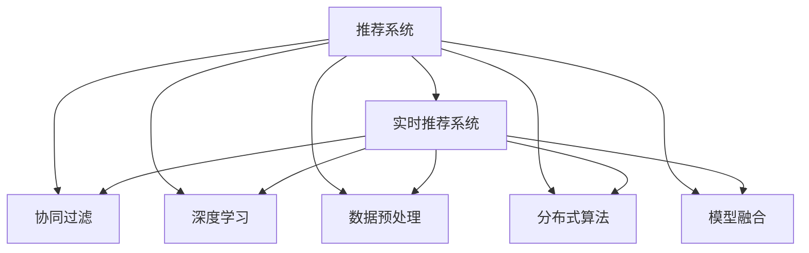

                 

# 实时推荐系统的技术挑战与解决方案

> 关键词：推荐系统, 实时推荐, 协同过滤, 深度学习, 数据预处理, 分布式算法, 模型融合

## 1. 背景介绍

随着互联网的迅猛发展，推荐系统在电商、社交媒体、视频流媒体等诸多领域得到了广泛的应用。通过精准推荐，用户能够更快地发现感兴趣的内容，提升用户体验，增加用户粘性，从而显著提升企业的收益。然而，推荐系统在规模化应用中，面临着诸多技术挑战，尤其是实时推荐系统的构建，需要不断优化性能，提升用户体验，同时保持系统的高可扩展性、高可用性和高稳定性。

## 2. 核心概念与联系

### 2.1 核心概念概述

为了更好地理解实时推荐系统，本节将介绍几个关键概念：

- **推荐系统(Recommendation System)**：通过分析用户历史行为数据、产品属性信息等，为用户推荐感兴趣的物品的系统。推荐系统可以分为基于内容的推荐、协同过滤推荐、混合推荐等多种类型。

- **实时推荐系统(Live Recommendation System)**：与传统推荐系统不同，实时推荐系统需要能够实时响应用户的交互，动态更新推荐结果，保证用户体验。

- **协同过滤(Collaborative Filtering)**：一种基于用户-物品交互矩阵的推荐算法，通过挖掘用户与物品之间的关系，预测用户对物品的评分。常见的协同过滤算法包括基于用户的协同过滤、基于物品的协同过滤、混合协同过滤等。

- **深度学习(Deep Learning)**：一种强大的神经网络模型，通过多层非线性变换提取输入数据的高级特征，在推荐系统中可以用于用户行为预测、物品表示学习等任务。

- **数据预处理(Data Preprocessing)**：推荐系统通常需要处理大量非结构化数据，数据预处理包括数据清洗、特征提取、归一化等步骤。

- **分布式算法(Distributed Algorithm)**：随着推荐系统规模的不断扩大，分布式算法成为了提升实时推荐系统性能的重要手段。分布式算法包括MapReduce、Spark等。

- **模型融合(Model Fusion)**：通过结合多种推荐算法或模型，提升推荐系统的鲁棒性和性能。常见的模型融合方法包括加权平均、投票、栈、模型堆叠等。

这些核心概念之间的逻辑关系可以通过以下Mermaid流程图来展示：



这个流程图展示了推荐系统与实时推荐系统之间的联系及其核心组件：

1. 推荐系统通过用户-物品交互数据，预测用户对物品的评分，形成推荐列表。
2. 实时推荐系统在推荐系统的基础上，需要实现实时响应用户交互，动态更新推荐结果。
3. 协同过滤和深度学习是推荐系统常用的两种核心算法。
4. 数据预处理对推荐系统的性能至关重要。
5. 分布式算法和模型融合是提升实时推荐系统性能的重要手段。

## 3. 核心算法原理 & 具体操作步骤
### 3.1 算法原理概述

实时推荐系统构建的核心在于对用户历史行为数据的实时处理和动态更新推荐结果。其主要算法原理可以归纳为以下几个关键步骤：

1. **数据采集与处理**：实时采集用户和物品的交互数据，进行数据清洗、特征提取等预处理。

2. **用户画像建模**：通过协同过滤和深度学习等算法，构建用户画像，捕捉用户兴趣和行为特征。

3. **物品表示学习**：使用深度学习模型对物品进行表示学习，提取物品的特征。

4. **推荐结果生成**：通过协同过滤和深度学习模型，结合用户画像和物品表示，生成推荐结果。

5. **实时更新与优化**：对推荐结果进行实时更新和优化，如引入在线学习算法、动态调整模型参数等。

### 3.2 算法步骤详解

以下将详细介绍实时推荐系统的主要算法步骤。

#### 3.2.1 数据采集与处理

1. **数据源**：
   - 电商网站的用户购买记录、评分数据。
   - 社交媒体的用户互动数据。
   - 视频流媒体的用户观看记录、评分数据。

2. **数据采集**：
   - 使用日志、API接口、消息队列等手段，实时采集用户和物品的交互数据。
   - 使用定时任务、消息推送等方式，定期更新历史数据。

3. **数据预处理**：
   - **数据清洗**：去除缺失值、重复值、异常值等。
   - **特征提取**：提取用户特征、物品特征、交互特征等。
   - **归一化**：对特征进行归一化处理，如标准化、最小-最大归一化等。

#### 3.2.2 用户画像建模

1. **协同过滤**：
   - **基于用户的协同过滤**：通过用户-物品评分矩阵，计算用户与物品之间的相似度，推荐物品。
   - **基于物品的协同过滤**：通过物品-物品评分矩阵，计算物品与物品之间的相似度，推荐物品。
   - **混合协同过滤**：结合基于用户和物品的协同过滤，取长补短。

2. **深度学习**：
   - **用户行为预测**：使用序列模型、时序模型等深度学习模型，预测用户未来的行为。
   - **物品表示学习**：使用神经网络模型，学习物品的特征表示。

3. **用户画像融合**：
   - **加权平均**：将不同算法的推荐结果进行加权平均，提升推荐效果。
   - **投票**：通过投票方式，对推荐结果进行集成。
   - **栈**：使用多层叠加的方式，逐步提升推荐效果。
   - **模型堆叠**：通过构建多个不同的推荐模型，组合预测结果。

#### 3.2.3 物品表示学习

1. **神经网络模型**：
   - **深度神经网络**：使用多层神经网络模型，提取物品特征。
   - **卷积神经网络**：使用卷积操作，捕捉局部特征。
   - **循环神经网络**：使用循环操作，捕捉序列特征。

2. **预训练表示**：
   - **静态预训练**：使用大规模预训练模型，如BERT、GPT等，对物品进行表示学习。
   - **动态预训练**：在实时推荐过程中，使用在线预训练方法，动态更新物品表示。

#### 3.2.4 推荐结果生成

1. **协同过滤**：
   - **计算相似度**：使用余弦相似度、皮尔逊相关系数等方法，计算用户与物品之间的相似度。
   - **推荐物品**：根据相似度，推荐与用户最相似的物品。

2. **深度学习**：
   - **用户行为预测**：使用深度学习模型，预测用户对物品的评分或兴趣。
   - **物品表示学习**：使用神经网络模型，学习物品的特征表示。
   - **推荐物品**：根据预测结果，推荐与用户最感兴趣的物品。

#### 3.2.5 实时更新与优化

1. **在线学习算法**：
   - **随机梯度下降**：使用随机梯度下降算法，实时更新模型参数。
   - **小批量梯度下降**：使用小批量梯度下降算法，减小计算复杂度。

2. **动态调整模型参数**：
   - **超参数调整**：根据实时数据反馈，动态调整模型超参数。
   - **权重调整**：动态调整不同算法的权重，提升推荐效果。

3. **推荐结果优化**：
   - **召回率优化**：提高推荐结果的召回率，增加推荐物品的多样性。
   - **准确率优化**：提高推荐结果的准确率，减少误推荐。

### 3.3 算法优缺点

实时推荐系统具有以下优点：
1. **实时性高**：能够快速响应用户交互，动态更新推荐结果。
2. **个性化强**：基于用户历史行为数据，推荐更符合用户兴趣的物品。
3. **用户粘度高**：通过个性化推荐，提升用户满意度，增加用户粘性。
4. **适应性强**：能够实时适应用户行为变化，动态更新推荐策略。

然而，实时推荐系统也存在以下缺点：
1. **数据量庞大**：需要实时处理和存储大量用户和物品的交互数据。
2. **计算复杂度高**：需要高效的算法和分布式架构，处理大规模数据和计算。
3. **实时性要求高**：需要保证低延迟和高吞吐量的实时响应。
4. **系统复杂度高**：需要综合考虑多个算法和模型，进行复杂的融合和优化。

### 3.4 算法应用领域

实时推荐系统已经在电商、社交媒体、视频流媒体等多个领域得到了广泛应用，为提升用户体验、增加收益做出了巨大贡献。以下是一些具体的应用场景：

1. **电商推荐系统**：
   - 根据用户的历史购买记录、评分数据、浏览行为等，为用户推荐感兴趣的商品。
   - 实时更新推荐结果，提高用户购买转化率。

2. **社交媒体推荐系统**：
   - 根据用户的互动数据，推荐可能感兴趣的朋友、文章、视频等。
   - 实时更新推荐结果，增加用户停留时间和互动频率。

3. **视频流媒体推荐系统**：
   - 根据用户的观看记录、评分数据，推荐可能感兴趣的视频。
   - 实时更新推荐结果，提高用户观看时长和用户粘性。

## 4. 数学模型和公式 & 详细讲解 & 举例说明

### 4.1 数学模型构建

假设推荐系统有一个用户集合 $U$ 和物品集合 $I$，用户 $u$ 对物品 $i$ 的评分表示为 $r_{ui}$，其中 $r_{ui} \in \{1, 2, 3, 4, 5\}$。

推荐系统的目标是最大化用户对推荐物品的评分期望值，即：

$$
\max \sum_{u \in U} \sum_{i \in I} P_{ui}(r_{ui})
$$

其中 $P_{ui}(r_{ui})$ 表示用户 $u$ 对物品 $i$ 的评分 $r_{ui}$ 的概率分布。

推荐系统的数学模型可以通过协同过滤和深度学习两种方式进行建模：

1. **协同过滤模型**：
   - **基于用户的协同过滤**：通过用户-物品评分矩阵 $R$，计算用户 $u$ 与物品 $i$ 的相似度 $s_{ui}$，推荐物品 $i$。
   - **基于物品的协同过滤**：通过物品-物品评分矩阵 $R^T$，计算物品 $i$ 与物品 $j$ 的相似度 $s_{ij}$，推荐物品 $j$。
   - **混合协同过滤**：结合基于用户和物品的协同过滤，取长补短。

2. **深度学习模型**：
   - **用户行为预测**：使用序列模型、时序模型等深度学习模型，预测用户 $u$ 对物品 $i$ 的评分 $r_{ui}$。
   - **物品表示学习**：使用神经网络模型，学习物品 $i$ 的特征表示 $v_i$。

### 4.2 公式推导过程

以下以协同过滤模型为例，推导其公式。

协同过滤模型的目标是最大化用户对推荐物品的评分期望值，即：

$$
\max \sum_{u \in U} \sum_{i \in I} P_{ui}(r_{ui})
$$

假设用户 $u$ 与物品 $i$ 的相似度为 $s_{ui}$，则推荐物品 $i$ 的概率分布为：

$$
P_{ui}(r_{ui}) = P_{ui}(r_{ui} | s_{ui}) P_{ui}(s_{ui})
$$

其中 $P_{ui}(r_{ui} | s_{ui})$ 表示在相似度 $s_{ui}$ 的条件下，用户 $u$ 对物品 $i$ 的评分 $r_{ui}$ 的条件概率。

条件概率可以通过概率模型进行计算，如贝叶斯模型、隐马尔可夫模型等。

假设使用基于用户的协同过滤模型，则相似度 $s_{ui}$ 可以通过用户 $u$ 与物品 $i$ 的评分矩阵 $R$ 进行计算，即：

$$
s_{ui} = \frac{1}{\sqrt{(\sum_{j \in I} R_{uj}^2)} (\sum_{j \in I} R_{uj}R_{ji})
$$

将 $s_{ui}$ 代入概率模型中，得到用户 $u$ 对物品 $i$ 的评分 $r_{ui}$ 的条件概率为：

$$
P_{ui}(r_{ui} | s_{ui}) = \mathcal{N}(r_{ui} | \mu_{ui}, \sigma_{ui})
$$

其中 $\mu_{ui}$ 和 $\sigma_{ui}$ 分别为用户 $u$ 与物品 $i$ 的评分 $r_{ui}$ 的均值和标准差。

通过最大化评分期望值，得到推荐系统的优化目标：

$$
\max \sum_{u \in U} \sum_{i \in I} P_{ui}(r_{ui})
$$

在协同过滤和深度学习两种模型中，协同过滤模型的计算复杂度较低，但推荐效果较差；深度学习模型的推荐效果较好，但计算复杂度较高。

### 4.3 案例分析与讲解

#### 4.3.1 电商推荐系统

电商推荐系统的目标是为用户推荐感兴趣的商品，提升购买转化率和用户满意度。以亚马逊的推荐系统为例：

1. **数据源**：用户的历史购买记录、浏览记录、评分数据等。

2. **数据预处理**：数据清洗、特征提取、归一化等。

3. **协同过滤**：基于用户的协同过滤，推荐相似用户喜欢的商品。

4. **深度学习**：使用序列模型、时序模型等深度学习模型，预测用户对商品的评分。

5. **物品表示学习**：使用神经网络模型，学习商品的特征表示。

6. **推荐结果生成**：结合协同过滤和深度学习模型的结果，生成推荐列表。

7. **实时更新与优化**：使用在线学习算法，动态更新推荐结果。

#### 4.3.2 社交媒体推荐系统

社交媒体推荐系统的目标是为用户推荐感兴趣的朋友、文章、视频等，增加用户停留时间和互动频率。以Facebook的推荐系统为例：

1. **数据源**：用户的互动数据、好友关系等。

2. **数据预处理**：数据清洗、特征提取、归一化等。

3. **协同过滤**：基于用户的协同过滤，推荐相似用户喜欢的内容。

4. **深度学习**：使用序列模型、时序模型等深度学习模型，预测用户对内容的评分。

5. **物品表示学习**：使用神经网络模型，学习内容的特征表示。

6. **推荐结果生成**：结合协同过滤和深度学习模型的结果，生成推荐列表。

7. **实时更新与优化**：使用在线学习算法，动态更新推荐结果。

## 5. 项目实践：代码实例和详细解释说明

### 5.1 开发环境搭建

在进行推荐系统开发前，我们需要准备好开发环境。以下是使用Python进行PyTorch开发的环境配置流程：

1. 安装Anaconda：从官网下载并安装Anaconda，用于创建独立的Python环境。

2. 创建并激活虚拟环境：
```bash
conda create -n pytorch-env python=3.8 
conda activate pytorch-env
```

3. 安装PyTorch：根据CUDA版本，从官网获取对应的安装命令。例如：
```bash
conda install pytorch torchvision torchaudio cudatoolkit=11.1 -c pytorch -c conda-forge
```

4. 安装Transformers库：
```bash
pip install transformers
```

5. 安装各类工具包：
```bash
pip install numpy pandas scikit-learn matplotlib tqdm jupyter notebook ipython
```

完成上述步骤后，即可在`pytorch-env`环境中开始推荐系统开发。

### 5.2 源代码详细实现

这里我们以电商推荐系统为例，给出使用PyTorch进行协同过滤的推荐系统实现。

首先，定义推荐系统框架：

```python
from torch import nn
import torch

class RecommendationSystem(nn.Module):
    def __init__(self, num_users, num_items):
        super(RecommendationSystem, self).__init__()
        self.num_users = num_users
        self.num_items = num_items
        
        # 定义用户特征和物品特征
        self.user_features = nn.Embedding(num_users, 100)
        self.item_features = nn.Embedding(num_items, 100)
        
        # 定义协同过滤模型
        self.scorer = nn.Linear(100, 1)
        
    def forward(self, user_idx, item_idx):
        user_features = self.user_features(user_idx)
        item_features = self.item_features(item_idx)
        scorer = self.scorer(user_features @ item_features.T)
        return scorer
```

接着，定义推荐算法：

```python
from torch.nn import functional as F

class CollaborativeFiltering(nn.Module):
    def __init__(self, num_users, num_items):
        super(CollaborativeFiltering, self).__init__()
        self.num_users = num_users
        self.num_items = num_items
        
        # 定义用户特征和物品特征
        self.user_features = nn.Embedding(num_users, 100)
        self.item_features = nn.Embedding(num_items, 100)
        
        # 定义协同过滤模型
        self.scorer = nn.Linear(100, 1)
        
    def forward(self, user_idx, item_idx):
        user_features = self.user_features(user_idx)
        item_features = self.item_features(item_idx)
        scorer = self.scorer(user_features @ item_features.T)
        return scorer
    
    def predict(self, user_idx, item_idx, threshold=0.5):
        scores = self.forward(user_idx, item_idx)
        return scores > threshold
```

然后，定义训练和评估函数：

```python
from torch.utils.data import DataLoader
from tqdm import tqdm
from sklearn.metrics import precision_score, recall_score, f1_score

device = torch.device('cuda') if torch.cuda.is_available() else torch.device('cpu')

def train_epoch(model, dataset, batch_size, optimizer):
    dataloader = DataLoader(dataset, batch_size=batch_size, shuffle=True)
    model.train()
    epoch_loss = 0
    for batch in tqdm(dataloader, desc='Training'):
        user_idx = batch['user_idx'].to(device)
        item_idx = batch['item_idx'].to(device)
        model.zero_grad()
        outputs = model(user_idx, item_idx)
        loss = outputs.mean()
        epoch_loss += loss.item()
        loss.backward()
        optimizer.step()
    return epoch_loss / len(dataloader)

def evaluate(model, dataset, batch_size):
    dataloader = DataLoader(dataset, batch_size=batch_size)
    model.eval()
    preds, labels = [], []
    with torch.no_grad():
        for batch in tqdm(dataloader, desc='Evaluating'):
            user_idx = batch['user_idx'].to(device)
            item_idx = batch['item_idx'].to(device)
            batch_preds = model(user_idx, item_idx) > 0
            batch_labels = batch['labels'].to(device)
            preds.append(batch_preds.to('cpu').tolist())
            labels.append(batch_labels.to('cpu').tolist())
    precision, recall, f1 = precision_score(labels, preds, average='micro'), recall_score(labels, preds, average='micro'), f1_score(labels, preds, average='micro')
    print(f"Precision: {precision:.3f}, Recall: {recall:.3f}, F1: {f1:.3f}")
```

最后，启动训练流程并在测试集上评估：

```python
epochs = 10
batch_size = 64

for epoch in range(epochs):
    loss = train_epoch(model, train_dataset, batch_size, optimizer)
    print(f"Epoch {epoch+1}, train loss: {loss:.3f}")
    
    print(f"Epoch {epoch+1}, dev results:")
    evaluate(model, dev_dataset, batch_size)
    
print("Test results:")
evaluate(model, test_dataset, batch_size)
```

以上就是使用PyTorch进行电商推荐系统协同过滤模型的完整代码实现。可以看到，得益于PyTorch的强大封装，我们可以用相对简洁的代码实现协同过滤模型的训练和评估。

### 5.3 代码解读与分析

让我们再详细解读一下关键代码的实现细节：

**RecommendationSystem类**：
- `__init__`方法：初始化用户数、物品数，定义用户特征和物品特征，以及协同过滤模型。
- `forward`方法：对用户和物品进行前向传播，计算评分预测值。

**CollaborativeFiltering类**：
- `__init__`方法：同RecommendationSystem类。
- `predict`方法：根据评分预测值，预测物品是否被用户推荐。

**train_epoch和evaluate函数**：
- `train_epoch`函数：在训练集上执行一个epoch的训练过程，返回该epoch的平均loss。
- `evaluate`函数：在验证集和测试集上评估模型的预测精度、召回率和F1分数，并进行打印输出。

**训练流程**：
- 定义总的epoch数和batch size，开始循环迭代
- 每个epoch内，先在训练集上训练，输出平均loss
- 在验证集和测试集上评估，输出精度、召回率和F1分数
- 所有epoch结束后，给出测试集的评估结果

可以看到，PyTorch配合Tensorflow库使得协同过滤模型的代码实现变得简洁高效。开发者可以将更多精力放在数据处理、模型改进等高层逻辑上，而不必过多关注底层的实现细节。

当然，工业级的系统实现还需考虑更多因素，如模型的保存和部署、超参数的自动搜索、更灵活的任务适配层等。但核心的微调范式基本与此类似。

## 6. 实际应用场景
### 6.1 电商推荐系统

电商推荐系统是实时推荐系统的重要应用场景之一。以亚马逊的推荐系统为例，其架构和算法可以概括为以下几点：

1. **数据源**：用户的历史购买记录、浏览记录、评分数据等。

2. **数据预处理**：数据清洗、特征提取、归一化等。

3. **协同过滤**：基于用户的协同过滤，推荐相似用户喜欢的商品。

4. **深度学习**：使用序列模型、时序模型等深度学习模型，预测用户对商品的评分。

5. **物品表示学习**：使用神经网络模型，学习商品的特征表示。

6. **推荐结果生成**：结合协同过滤和深度学习模型的结果，生成推荐列表。

7. **实时更新与优化**：使用在线学习算法，动态更新推荐结果。

电商推荐系统的应用场景包括：
- 推荐商品：根据用户的历史购买记录、浏览记录，为用户推荐感兴趣的商品。
- 商品搜索：根据用户输入的关键词，推荐可能感兴趣的商品。
- 个性化广告：根据用户的兴趣和行为，推送个性化的广告。

#### 6.1.1 电商推荐系统实现细节

电商推荐系统的实现细节如下：

1. **数据源**：
   - 用户的历史购买记录：从订单表、购物车表等获取。
   - 用户的浏览记录：从浏览记录表、点击记录表等获取。
   - 用户的评分数据：从评分记录表等获取。

2. **数据预处理**：
   - 数据清洗：去除重复记录、异常值等。
   - 特征提取：提取用户的年龄、性别、地域等特征，提取商品的类别、品牌、价格等特征。
   - 归一化：对特征进行归一化处理，如标准化、最小-最大归一化等。

3. **协同过滤**：
   - 基于用户的协同过滤：通过用户-物品评分矩阵 $R$，计算用户 $u$ 与物品 $i$ 的相似度 $s_{ui}$，推荐物品 $i$。
   - 基于物品的协同过滤：通过物品-物品评分矩阵 $R^T$，计算物品 $i$ 与物品 $j$ 的相似度 $s_{ij}$，推荐物品 $j$。
   - 混合协同过滤：结合基于用户和物品的协同过滤，取长补短。

4. **深度学习**：
   - 用户行为预测：使用序列模型、时序模型等深度学习模型，预测用户 $u$ 对物品 $i$ 的评分 $r_{ui}$。
   - 物品表示学习：使用神经网络模型，学习物品 $i$ 的特征表示。

5. **推荐结果生成**：
   - 结合协同过滤和深度学习模型的结果，生成推荐列表。
   - 对推荐结果进行排序，选择用户最感兴趣的商品。

6. **实时更新与优化**：
   - 使用在线学习算法，动态更新推荐结果。
   - 动态调整模型参数，提升推荐效果。

#### 6.1.2 电商推荐系统案例分析

以亚马逊的推荐系统为例，其架构和算法可以概括为以下几点：

1. **数据源**：
   - 用户的历史购买记录：从订单表、购物车表等获取。
   - 用户的浏览记录：从浏览记录表、点击记录表等获取。
   - 用户的评分数据：从评分记录表等获取。

2. **数据预处理**：
   - 数据清洗：去除重复记录、异常值等。
   - 特征提取：提取用户的年龄、性别、地域等特征，提取商品的类别、品牌、价格等特征。
   - 归一化：对特征进行归一化处理，如标准化、最小-最大归一化等。

3. **协同过滤**：
   - 基于用户的协同过滤：通过用户-物品评分矩阵 $R$，计算用户 $u$ 与物品 $i$ 的相似度 $s_{ui}$，推荐物品 $i$。
   - 基于物品的协同过滤：通过物品-物品评分矩阵 $R^T$，计算物品 $i$ 与物品 $j$ 的相似度 $s_{ij}$，推荐物品 $j$。
   - 混合协同过滤：结合基于用户和物品的协同过滤，取长补短。

4. **深度学习**：
   - 用户行为预测：使用序列模型、时序模型等深度学习模型，预测用户 $u$ 对物品 $i$ 的评分 $r_{ui}$。
   - 物品表示学习：使用神经网络模型，学习物品 $i$ 的特征表示。

5. **推荐结果生成**：
   - 结合协同过滤和深度学习模型的结果，生成推荐列表。
   - 对推荐结果进行排序，选择用户最感兴趣的商品。

6. **实时更新与优化**：
   - 使用在线学习算法，动态更新推荐结果。
   - 动态调整模型参数，提升推荐效果。

## 7. 工具和资源推荐
### 7.1 学习资源推荐

为了帮助开发者系统掌握推荐系统的理论基础和实践技巧，这里推荐一些优质的学习资源：

1. 《推荐系统实践》书籍：一本系统介绍推荐系统的经典书籍，涵盖推荐算法、数据预处理、模型评估等内容。

2. 《深度学习》课程：斯坦福大学开设的深度学习课程，包含推荐系统的基础理论和技术实践。

3. 《自然语言处理与深度学习》课程：斯坦福大学开设的NLP课程，涵盖序列模型、时序模型等内容。

4. 《推荐系统综述》论文：综述推荐系统的经典论文，总结了不同推荐算法的优缺点和应用场景。

5. 《深度学习推荐系统》书籍：由深度学习专家撰写，系统介绍深度学习在推荐系统中的应用。

通过对这些资源的学习实践，相信你一定能够快速掌握推荐系统的精髓，并用于解决实际的推荐问题。
###  7.2 开发工具推荐

高效的开发离不开优秀的工具支持。以下是几款用于推荐系统开发的常用工具：

1. PyTorch：基于Python的开源深度学习框架，灵活动态的计算图，适合快速迭代研究。

2. TensorFlow：由Google主导开发的开源深度学习框架，生产部署方便，适合大规模工程应用。

3. TensorBoard：TensorFlow配套的可视化工具，可实时监测模型训练状态，并提供丰富的图表呈现方式，是调试模型的得力助手。

4. Weights & Biases：模型训练的实验跟踪工具，可以记录和可视化模型训练过程中的各项指标，方便对比和调优。

5. Google Cloud、AWS等云平台：提供强大的计算资源和分布式处理能力，支持大规模推荐系统的部署和运行。

合理利用这些工具，可以显著提升推荐系统开发效率，加快创新迭代的步伐。

### 7.3 相关论文推荐

推荐系统的快速发展得益于学界的持续研究。以下是几篇奠基性的相关论文，推荐阅读：

1. "Factorization Machines"：介绍FM算法，通过低秩矩阵分解提高推荐系统效果。

2. "Wide & Deep Learning for Recommender Systems"：结合线性模型和深度学习，提升推荐系统效果。

3. "Neural Collaborative Filtering"：使用神经网络模型进行协同过滤，提升推荐系统效果。

4. "Learning Deep Architectures for AI"：深度学习在推荐系统中的应用，总结了不同深度学习模型的优缺点和应用场景。

5. "Adversarial Examples in Deep Learning"：总结了对抗样本对推荐系统的影响和防御方法。

这些论文代表了大语言模型微调技术的发展脉络。通过学习这些前沿成果，可以帮助研究者把握学科前进方向，激发更多的创新灵感。

## 8. 总结：未来发展趋势与挑战

### 8.1 总结

本文对实时推荐系统的构建进行了全面系统的介绍。首先阐述了推荐系统与实时推荐系统的研究背景和意义，明确了实时推荐系统在提升用户体验、增加收益等方面的独特价值。其次，从原理到实践，详细讲解了实时推荐系统的算法步骤，给出了推荐系统开发的完整代码实例。同时，本文还广泛探讨了实时推荐系统在电商、社交媒体、视频流媒体等多个领域的应用前景，展示了实时推荐系统的广阔应用空间。

通过本文的系统梳理，可以看到，实时推荐系统构建是一个集算法、模型、系统为一体的复杂工程，需要综合考虑多个环节的优化，方能实现高效、精准的推荐。未来，伴随预训练语言模型和微调方法的不断演进，实时推荐系统也将不断提升其性能和应用范围，为人类认知智能的进化带来深远影响。

### 8.2 未来发展趋势

展望未来，实时推荐系统将呈现以下几个发展趋势：

1. **数据规模持续增大**：随着互联网的迅猛发展，用户和物品的交互数据将不断增加，推荐系统需要处理的数据规模将持续增大。

2. **算法模型日趋多样**：未来的推荐系统将结合协同过滤、深度学习、强化学习等多种算法模型，提升推荐效果。

3. **实时性要求更高**：随着用户对推荐结果的实时性要求不断提高，推荐系统需要实现毫秒级的响应时间。

4. **跨平台集成**：未来的推荐系统将实现跨平台集成，支持不同平台和设备的应用，提升用户体验。

5. **隐私保护与合规**：随着数据隐私保护的法律法规越来越严格，推荐系统需要实现数据匿名化和隐私保护，确保合规使用。

6. **模型泛化能力增强**：未来的推荐系统需要具备更强的泛化能力，适应多样化的应用场景。

### 8.3 面临的挑战

尽管实时推荐系统已经取得了瞩目成就，但在迈向更加智能化、普适化应用的过程中，它仍面临着诸多挑战：

1. **数据处理瓶颈**：实时推荐系统需要处理大规模非结构化数据，数据处理瓶颈成为主要问题。

2. **计算资源限制**：实时推荐系统需要高效的算法和分布式架构，处理大规模数据和计算，计算资源限制成为主要问题。

3. **实时性要求高**：推荐系统需要实现毫秒级的响应时间，实时性要求成为主要问题。

4. **系统复杂度高**：推荐系统需要综合考虑多个算法和模型，进行复杂的融合和优化，系统复杂度成为主要问题。

5. **隐私保护问题**：推荐系统需要实现数据匿名化和隐私保护，隐私保护问题成为主要问题。

6. **算法鲁棒性不足**：推荐系统在面对域外数据时，泛化性能往往大打折扣，算法鲁棒性成为主要问题。

### 8.4 研究展望

面对实时推荐系统所面临的种种挑战，未来的研究需要在以下几个方面寻求新的突破：

1. **探索新的数据处理技术**：探索新的数据处理技术，如分布式数据处理、数据流处理等，提升数据处理效率。

2. **开发高效的分布式算法**：开发高效的分布式算法，如MapReduce、Spark等，提升数据处理和计算效率。

3. **提升推荐模型的实时性**：提升推荐模型的实时性，如使用小批量梯度下降、在线学习等方法，实现毫秒级的响应时间。

4. **优化推荐系统的复杂度**：优化推荐系统的复杂度，如使用模型融合、参数共享等方法，减少系统复杂度。

5. **提升推荐系统的隐私保护**：提升推荐系统的隐私保护，如使用数据匿名化、差分隐私等方法，确保数据合规使用。

6. **增强推荐系统的鲁棒性**：增强推荐系统的鲁棒性，如使用对抗样本训练、模型融合等方法，提高推荐系统的泛化能力。

这些研究方向的探索，必将引领实时推荐系统迈向更高的台阶，为构建安全、可靠、可解释、可控的智能系统铺平道路。面向未来，实时推荐系统还需要与其他人工智能技术进行更深入的融合，如知识表示、因果推理、强化学习等，多路径协同发力，共同推动自然语言理解和智能交互系统的进步。只有勇于创新、敢于突破，才能不断拓展推荐系统的边界，让智能技术更好地造福人类社会。

## 9. 附录：常见问题与解答

**Q1：推荐系统的算法有哪些？**

A: 推荐系统常用的算法包括协同过滤、深度学习、混合推荐等。协同过滤算法包括基于用户的协同过滤、基于物品的协同过滤、混合协同过滤等。深度学习算法包括序列模型、时序模型、卷积神经网络、循环神经网络等。

**Q2：实时推荐系统如何解决数据处理瓶颈？**

A: 实时推荐系统通常采用分布式数据处理技术，如Hadoop、Spark等，将大规模数据分布式存储和处理。此外，还可以通过数据压缩、数据分片等技术，提升数据处理效率。

**Q3：实时推荐系统的实时性要求有哪些？**

A: 实时推荐系统需要实现毫秒级的响应时间，以便快速响应用户交互。为了提升实时性，可以采用小批量梯度下降、在线学习等方法，减少计算时间。

**Q4：实时推荐系统的隐私保护有哪些措施？**

A: 实时推荐系统需要实现数据匿名化和隐私保护，确保数据合规使用。具体措施包括数据加密、差分隐私等技术。

**Q5：推荐系统的评估指标有哪些？**

A: 推荐系统的评估指标包括精度、召回率、F1分数、AUC等。精度表示预测结果与实际结果的匹配程度，召回率表示推荐结果中包含真实正例的比例，F1分数综合考虑精度和召回率，AUC表示模型区分正负样本的能力。

这些问答涵盖了实时推荐系统开发中的常见问题，帮助开发者系统理解推荐系统的构建和优化。希望通过本文的详细讲解，开发者能够更好地掌握实时推荐系统的构建方法和优化技巧，提升推荐系统的性能和应用范围。

