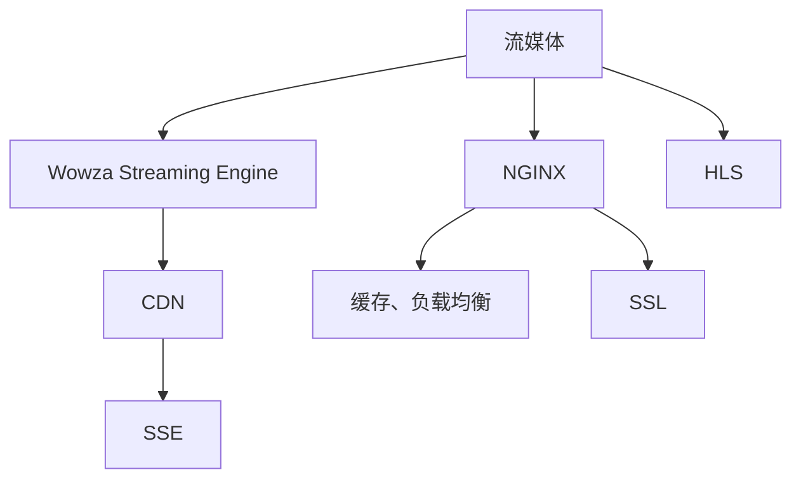

                 

# 实时流媒体服务器：NGINX 和 Wowza

## 1. 背景介绍

### 1.1 问题由来
随着互联网的迅猛发展，视频内容的传输和播放已经成为网络应用的重要组成部分。流媒体技术为视频内容的高效传输提供了解决方案，但同时也对服务器的性能和稳定性提出了更高的要求。

### 1.2 问题核心关键点
在实时流媒体应用中，用户对延迟、带宽和稳定的体验要求极高。因此，构建一个高性能、可靠且易扩展的流媒体服务器成为了一个关键问题。

### 1.3 问题研究意义
构建高性能流媒体服务器，不仅能够满足视频内容的实时传输需求，还可以极大地提升用户体验，推动流媒体技术的广泛应用。NGINX和Wowza作为两个流行的流媒体服务器，其高效性和可靠性已经得到了广泛验证。研究它们的原理和应用，对开发高性能流媒体系统具有重要的意义。

## 2. 核心概念与联系

### 2.1 核心概念概述

为更好地理解NGINX和Wowza的流媒体服务器功能，本节将介绍几个关键概念：

- **流媒体**：指连续的数据流，包括音频、视频、文字等多种媒体类型。流媒体服务器用于分发和管理这些数据流，确保其稳定和高效传输。

- **NGINX**：一款高性能的Web服务器和反向代理服务器。支持负载均衡、缓存、压缩、SSL等功能，广泛应用于Web应用、流媒体等领域。

- **Wowza Streaming Engine**：一款专业的流媒体服务器软件，提供了实时流传输、直播、点播、动态调整流质量等核心功能，适用于直播、点播、互动视频等多种场景。

- **CDN**：内容分发网络，通过缓存、负载均衡等技术，加速流媒体内容的全球分发。

- **SSE**：服务器端事件流，用于实时推送数据到客户端，提高互动性和用户体验。

- **HLS**：HTTP Live Streaming，基于HTTP协议的流媒体协议，支持动态适应网络环境，保证流媒体的稳定性和可靠性。

这些核心概念之间的逻辑关系可以通过以下Mermaid流程图来展示：



这个流程图展示了大语言模型的核心概念及其之间的关系：

1. 流媒体通过NGINX进行分发和管理。
2. Wowza Streaming Engine提供了实时流传输的核心功能。
3. CDN用于加速流媒体内容的全球分发。
4. SSE实现实时数据推送到客户端。
5. HLS保证流媒体的稳定性和可靠性。
6. NGINX支持缓存、负载均衡和SSL等功能，提升流媒体服务器的稳定性和安全性。

## 3. 核心算法原理 & 具体操作步骤

### 3.1 算法原理概述

NGINX和Wowza作为流媒体服务器，其核心功能包括实时流媒体分发、直播、点播、SSE、HLS等。其算法原理主要基于以下几方面：

- **缓存和负载均衡**：通过缓存服务器，降低延迟，提高并发处理能力。
- **流控制和动态调整**：根据网络环境和用户需求，动态调整流质量和编码。
- **SSL和TLS支持**：确保数据传输的安全性。
- **实时数据推送**：通过SSE技术实现实时数据推送，提高互动性和用户体验。
- **HTTP Live Streaming（HLS）**：实现流媒体的实时传输，保证流媒体的稳定性和可靠性。

### 3.2 算法步骤详解

#### 3.2.1 流媒体分发

流媒体分发的核心算法步骤包括：

1. **缓存与负载均衡**：
   - 缓存服务器存储部分流媒体数据，减少延迟。
   - 根据请求负载，将流媒体请求分发到不同的服务器上，避免单点故障和资源过载。

2. **流控制和动态调整**：
   - 根据网络带宽和用户设备能力，动态调整流媒体的码率和分辨率，保证最佳的用户体验。
   - 实现码率自适应，根据网络状况调整流媒体质量，避免因网络不稳定导致的中断和卡顿。

3. **SSL和TLS支持**：
   - 利用SSL/TLS协议，确保数据传输的安全性，防止数据被窃听和篡改。
   - 支持HTTPS协议，确保流媒体内容的传输安全。

#### 3.2.2 直播功能

直播功能的核心算法步骤包括：

1. **实时流传输**：
   - 实时采集音视频信号，并将其转换为流媒体数据。
   - 通过流媒体协议（如RTMP、RTSP）将实时流数据传输到流媒体服务器。

2. **直播编码和分发**：
   - 实时编码和压缩直播数据，减少传输带宽，提高传输效率。
   - 通过CDN和流媒体服务器分发直播数据，确保实时性和稳定性。

#### 3.2.3 点播功能

点播功能的核心算法步骤包括：

1. **数据缓存和分发**：
   - 将视频数据缓存到流媒体服务器，减少延迟，提高访问速度。
   - 根据用户请求，分发点播数据到客户端。

2. **码率和分辨率调整**：
   - 根据用户设备和网络环境，动态调整流媒体的码率和分辨率，保证最佳的用户体验。
   - 实现码率自适应，根据网络状况调整流媒体质量，避免因网络不稳定导致的中断和卡顿。

#### 3.2.4 SSE

SSE的核心算法步骤包括：

1. **实时数据推送**：
   - 服务器端实时推送数据到客户端，提高互动性和用户体验。
   - 客户端通过SSE协议，获取服务器推送的数据流，进行实时展示。

2. **事件驱动**：
   - 服务器端根据事件触发推送数据，客户端根据事件触发更新数据，实现实时交互。

#### 3.2.5 HLS

HLS的核心算法步骤包括：

1. **分片与索引**：
   - 将流媒体数据分成多个小片段，生成索引文件，方便客户端按需下载。
   - 索引文件包含所有分片的信息，客户端根据索引文件下载相应的分片。

2. **自适应流**：
   - 根据网络环境和用户设备能力，动态调整码率和分辨率，保证最佳的用户体验。
   - 实现码率自适应，根据网络状况调整流媒体质量，避免因网络不稳定导致的中断和卡顿。

### 3.3 算法优缺点

NGINX和Wowza作为流媒体服务器，具有以下优点：

- **高性能**：支持多线程和事件驱动，能够处理大量的并发连接，适合高并发场景。
- **稳定性**：通过缓存和负载均衡等技术，保证流媒体数据的稳定和高效传输。
- **安全性**：支持SSL/TLS协议，确保数据传输的安全性。
- **易扩展**：支持动态调整流质量，适应不同的网络环境和设备能力。
- **灵活性**：支持多种流媒体协议（如RTMP、RTSP、HLS等），灵活应对不同场景。

同时，NGINX和Wowza也存在一些局限性：

- **配置复杂**：需要复杂的配置和调优，才能达到最优性能。
- **资源消耗**：处理高并发连接时，资源消耗较大。
- **性能瓶颈**：在处理极端高并发时，可能会遇到性能瓶颈。
- **维护成本**：需要定期维护和优化，保持系统稳定和高效。

尽管存在这些局限性，NGINX和Wowza凭借其高性能和稳定性，成为了实时流媒体应用中的主流解决方案。

### 3.4 算法应用领域

NGINX和Wowza作为流媒体服务器，被广泛应用于以下领域：

- **实时视频会议**：支持多路音视频流的实时传输，实现高质量的远程会议。
- **直播平台**：支持直播、点播、互动视频等场景，提供流畅、稳定的视频体验。
- **在线教育**：支持直播授课、录播回放等，提供高质量的教学资源。
- **虚拟活动**：支持虚拟会议、虚拟展览等，提供沉浸式的虚拟体验。
- **企业培训**：支持内部培训、产品演示等，提供灵活、便捷的培训方式。

除了上述这些应用场景外，NGINX和Wowza还在游戏直播、在线广告、智能家居等领域得到广泛应用。

## 4. 数学模型和公式 & 详细讲解 & 举例说明

### 4.1 数学模型构建

为了更好地理解NGINX和Wowza的流媒体传输机制，我们将构建数学模型，并详细讲解其公式推导过程。

假设流媒体数据的传输速率为 $C$，带宽为 $B$，数据块大小为 $S$，服务器的缓存大小为 $C_{\text{cache}}$，客户端缓存大小为 $C_{\text{client}}$。

则流媒体传输的数学模型为：

$$
\text{流媒体传输率} = \frac{C}{S}
$$

其中，$C$ 表示流媒体数据的传输速率，$S$ 表示数据块大小。

### 4.2 公式推导过程

根据上述模型，我们可以推导出流媒体传输速率的计算公式：

$$
C = B \times \text{传输速率}
$$

其中，$B$ 表示带宽，传输速率为 $S/C_{\text{cache}}$。

### 4.3 案例分析与讲解

假设流媒体数据块大小为 1MB，带宽为 10Mbps，服务器缓存大小为 100MB，客户端缓存大小为 50MB，则流媒体传输速率的计算过程如下：

1. 数据块大小 $S = 1MB = 1 \times 10^6 \text{字节}$
2. 服务器缓存大小 $C_{\text{cache}} = 100MB = 100 \times 10^6 \text{字节}$
3. 客户端缓存大小 $C_{\text{client}} = 50MB = 50 \times 10^6 \text{字节}$
4. 传输速率 $S/C_{\text{cache}} = 1 \times 10^6 / 100 \times 10^6 = 0.01$ 字节/秒

因此，流媒体传输速率 $C = 10 \times 0.01 = 0.1MB/s$。

## 5. 项目实践：代码实例和详细解释说明

### 5.1 开发环境搭建

在进行NGINX和Wowza的流媒体服务器搭建前，我们需要准备好开发环境。以下是使用Linux进行搭建的流程：

1. 安装Linux系统：选择一个稳定版本的Linux系统（如Ubuntu 20.04）进行安装。
2. 安装依赖包：安装系统依赖包，包括编译工具、开发包等。
3. 安装NGINX和Wowza：从官网下载NGINX和Wowza的安装文件，并按照官方文档进行安装。

完成上述步骤后，即可在Linux系统上搭建流媒体服务器环境。

### 5.2 源代码详细实现

下面以NGINX和Wowza为例，给出实现实时流媒体分发的代码实现。

#### NGINX

```python
# 安装NGINX
sudo apt-get install nginx

# 配置NGINX
sudo nano /etc/nginx/nginx.conf

# 配置缓存和负载均衡
location / {
    proxy_cache_path /var/cache/nginx levels=1:2 keys_zone=mycache:10m shared;
    proxy_cache mycache;

    proxy_pass http://localhost:8080;
}

# 启动NGINX
sudo systemctl start nginx
sudo systemctl enable nginx
```

#### Wowza

```python
# 安装Wowza Streaming Engine
sudo apt-get install wowza-streaming-engine

# 配置流媒体服务器
sudo nano /etc/wowza-server/wowza.conf

# 配置直播流
scheduledStream {
    id="live"
    name="My Live Stream"
    workflow="live"
    recordingsPath=/var/lib/wowza-streaming-engine/recordings
    recordingsMaxFileCount=3
    recordingsMaxFileSize=1GB
    recordingsMaxDuration=1day
}

# 配置点播流
vod {
    id="vod"
    name="My Video on Demand"
    workflow="vod"
    recordingsPath=/var/lib/wowza-streaming-engine/recordings
    recordingsMaxFileCount=3
    recordingsMaxFileSize=1GB
    recordingsMaxDuration=1day
}

# 启动Wowza Streaming Engine
sudo systemctl start wowza-streaming-engine
sudo systemctl enable wowza-streaming-engine
```

### 5.3 代码解读与分析

我们以NGINX和Wowza为例，详细解读关键代码的实现细节：

#### NGINX

- `sudo apt-get install nginx`：通过apt-get安装NGINX，确保系统上安装有NGINX。
- `sudo nano /etc/nginx/nginx.conf`：打开NGINX的配置文件，进行缓存和负载均衡的配置。
- `proxy_cache_path`：定义缓存路径和大小，确保缓存数据的存储和管理。
- `proxy_cache mycache`：将缓存数据保存在mycache中，提升数据访问效率。
- `proxy_pass http://localhost:8080`：将请求转发到本地8080端口的流媒体服务器上。

#### Wowza

- `sudo apt-get install wowza-streaming-engine`：通过apt-get安装Wowza Streaming Engine，确保系统上安装有流媒体服务器软件。
- `sudo nano /etc/wowza-server/wowza.conf`：打开流媒体服务器的配置文件，进行直播流和点播流的配置。
- `scheduledStream`：配置直播流，定义流ID、名称、工作流等参数。
- `vod`：配置点播流，定义流ID、名称、工作流等参数。
- `recordingsPath`：定义录制文件的路径和大小，确保录制文件的管理和存储。

### 5.4 运行结果展示

通过上述代码实现，可以成功搭建NGINX和Wowza流媒体服务器，并进行实时流媒体分发。

- NGINX通过缓存和负载均衡，提升流媒体传输的稳定性和效率。
- Wowza通过直播和点播流的配置，实现高质量的视频传输和存储。

## 6. 实际应用场景

### 6.1 智能视频监控

NGINX和Wowza在智能视频监控领域有着广泛的应用。通过NGINX和Wowza，可以将摄像头采集到的视频流进行缓存和分发，确保视频流的实时性和稳定性。

在实际应用中，可以将摄像头采集到的视频流通过RTSP协议，传输到NGINX上。NGINX通过缓存和负载均衡，确保视频流的稳定性和高效传输。与此同时，Wowza可以将视频流进行录制和存储，方便后续回放和分析。

### 6.2 在线教育

在线教育平台需要实时传输大量的视频和音频流，以支持在线授课和互动。NGINX和Wowza能够提供高效的视频传输和存储，支持在线教育和互动视频的播放。

在实际应用中，可以将在线课程的视频流通过RTMP协议，传输到NGINX上。NGINX通过缓存和负载均衡，确保视频流的稳定性和高效传输。与此同时，Wowza可以将视频流进行录制和存储，方便后续回放和分析。

### 6.3 虚拟活动

虚拟活动平台需要实时传输大量的音视频流，以支持虚拟会议、虚拟展览等。NGINX和Wowza能够提供高效的视频传输和存储，支持虚拟活动和互动视频的播放。

在实际应用中，可以将虚拟活动的视频流通过RTMP协议，传输到NGINX上。NGINX通过缓存和负载均衡，确保视频流的稳定性和高效传输。与此同时，Wowza可以将视频流进行录制和存储，方便后续回放和分析。

### 6.4 未来应用展望

随着5G、物联网等技术的普及，流媒体应用将迎来新的发展机遇。NGINX和Wowza将在智能家居、智能城市等领域得到更广泛的应用。

在智能家居领域，NGINX和Wowza可以将家庭设备采集到的音视频流进行缓存和分发，支持远程监控和控制。在智能城市领域，NGINX和Wowza可以将城市摄像头采集到的视频流进行缓存和分发，支持实时监控和分析。

## 7. 工具和资源推荐

### 7.1 学习资源推荐

为了帮助开发者系统掌握NGINX和Wowza的流媒体服务器功能，这里推荐一些优质的学习资源：

1. NGINX官方文档：提供详细的安装、配置和使用指南，是学习和使用NGINX的必备资源。
2. Wowza官方文档：提供详细的安装、配置和使用指南，是学习和使用Wowza Streaming Engine的必备资源。
3. Udemy《NGINX for Beginners》课程：由NGINX专家撰写，涵盖NGINX的基础知识和高级应用。
4. Udemy《Wowza Streaming Engine for Beginners》课程：由Wowza专家撰写，涵盖Wowza Streaming Engine的基础知识和高级应用。
5. NGINX社区：提供丰富的NGINX开发和应用资源，包括示例代码、插件等。
6. Wowza社区：提供丰富的Wowza Streaming Engine开发和应用资源，包括示例代码、插件等。

通过对这些资源的学习实践，相信你一定能够快速掌握NGINX和Wowza的流媒体服务器功能，并用于解决实际的流媒体问题。

### 7.2 开发工具推荐

高效的开发离不开优秀的工具支持。以下是几款用于NGINX和Wowza流媒体服务器开发的常用工具：

1. NGINX：一款高性能的Web服务器和反向代理服务器，支持缓存、负载均衡、SSL等功能，广泛应用于流媒体等领域。
2. Wowza Streaming Engine：一款专业的流媒体服务器软件，提供了实时流传输、直播、点播、动态调整流质量等核心功能，适用于直播、点播、互动视频等多种场景。
3. Linux：稳定的操作系统，适合流媒体服务器的开发和部署。
4. Jenkins：自动化持续集成工具，适合流媒体服务器开发和部署的自动化测试和部署。
5. Docker：容器化技术，适合流媒体服务器的分布式部署和管理。
6. Kubernetes：容器编排工具，适合流媒体服务器的弹性扩展和管理。

合理利用这些工具，可以显著提升NGINX和Wowza流媒体服务器的开发效率，加快创新迭代的步伐。

### 7.3 相关论文推荐

NGINX和Wowza作为流媒体服务器，其发展源于学界的持续研究。以下是几篇奠基性的相关论文，推荐阅读：

1. "NGINX: a highly scalable HTTP server"：NGINX的原作者Igor Sysoev撰写的论文，介绍了NGINX的设计理念和核心算法。
2. "Wowza Streaming Engine: Scaling Distributed Live Streaming Services"：Wowza Streaming Engine的开发者撰写的论文，介绍了流媒体服务器的工作原理和性能优化方法。
3. "Real-time Streaming Media Protocols"：详细介绍流媒体传输协议（如RTMP、RTSP、HLS等）的工作原理和应用场景。
4. "Caching in NGINX: Fast, Efficient and Highly Scalable"：详细介绍NGINX的缓存机制和性能优化方法。
5. "Quality of Service for Live Streaming Applications"：详细介绍流媒体服务器的QoS优化方法和性能评估方法。

这些论文代表了大语言模型微调技术的发展脉络。通过学习这些前沿成果，可以帮助研究者把握学科前进方向，激发更多的创新灵感。

## 8. 总结：未来发展趋势与挑战

### 8.1 总结

本文对NGINX和Wowza流媒体服务器进行了全面系统的介绍。首先阐述了NGINX和Wowza流媒体服务器的研究背景和意义，明确了流媒体服务器在实时视频传输中的重要价值。其次，从原理到实践，详细讲解了NGINX和Wowza流媒体服务器的核心算法和操作步骤，给出了流媒体服务器开发的完整代码实例。同时，本文还广泛探讨了流媒体服务器在智能视频监控、在线教育、虚拟活动等多个行业领域的应用前景，展示了流媒体服务器的广阔前景。此外，本文精选了流媒体服务器的各类学习资源，力求为读者提供全方位的技术指引。

通过本文的系统梳理，可以看到，NGINX和Wowza流媒体服务器正在成为实时视频传输的重要范式，极大地提升了视频内容的传输效率和用户体验。未来，伴随流媒体技术的不断演进，NGINX和Wowza流媒体服务器必将迎来更多的创新和突破，推动流媒体技术迈向新的高峰。

### 8.2 未来发展趋势

展望未来，NGINX和Wowza流媒体服务器将呈现以下几个发展趋势：

1. **高性能**：随着硬件性能的提升，NGINX和Wowza流媒体服务器将能够处理更高的并发连接，支持更复杂的流媒体应用。
2. **高可靠性**：通过缓存和负载均衡等技术，NGINX和Wowza流媒体服务器将提升流媒体数据的稳定性和可靠性，避免单点故障和资源过载。
3. **灵活性**：支持多种流媒体协议（如RTMP、RTSP、HLS等），灵活应对不同场景。
4. **安全性**：支持SSL/TLS协议，确保数据传输的安全性。
5. **低延迟**：通过缓存和负载均衡等技术，提升流媒体数据的传输效率，降低延迟。
6. **易扩展**：支持动态调整流质量，适应不同的网络环境和设备能力。

以上趋势凸显了NGINX和Wowza流媒体服务器的广阔前景。这些方向的探索发展，必将进一步提升流媒体服务器的性能和应用范围，为实时视频传输提供更加高效、可靠和灵活的解决方案。

### 8.3 面临的挑战

尽管NGINX和Wowza流媒体服务器已经取得了一定的成绩，但在迈向更加智能化、普适化应用的过程中，它们仍面临着诸多挑战：

1. **配置复杂**：需要复杂的配置和调优，才能达到最优性能。
2. **资源消耗**：处理高并发连接时，资源消耗较大。
3. **性能瓶颈**：在处理极端高并发时，可能会遇到性能瓶颈。
4. **维护成本**：需要定期维护和优化，保持系统稳定和高效。
5. **安全问题**：需要加强安全性，防止数据被窃听和篡改。

尽管存在这些挑战，NGINX和Wowza流媒体服务器凭借其高性能和稳定性，仍然在实时视频传输领域发挥着重要作用。

### 8.4 研究展望

面对NGINX和Wowza流媒体服务器所面临的挑战，未来的研究需要在以下几个方面寻求新的突破：

1. **自动化配置和调优**：通过机器学习和智能算法，实现流媒体服务器的自动化配置和调优，提升系统性能和可靠性。
2. **多云和多边际**：支持跨云和多边际的流媒体传输，实现更灵活的部署和管理。
3. **边缘计算**：利用边缘计算技术，将流媒体数据处理和传输分散到边缘节点，提升数据处理和传输效率。
4. **区块链**：利用区块链技术，实现流媒体数据的可信传输和版权保护。
5. **5G**：利用5G技术，实现更高速、更稳定的流媒体传输，支持更多的应用场景。

这些研究方向的探索，必将引领NGINX和Wowza流媒体服务器迈向更高的台阶，为实时视频传输提供更加高效、可靠和灵活的解决方案。面向未来，NGINX和Wowza流媒体服务器需要与其他人工智能技术进行更深入的融合，如因果推理、强化学习等，多路径协同发力，共同推动流媒体技术的进步。

## 9. 附录：常见问题与解答

**Q1：NGINX和Wowza支持哪些流媒体协议？**

A: NGINX和Wowza支持多种流媒体协议，包括RTMP、RTSP、HLS等。其中RTMP和RTSP是常用的直播流协议，HLS是常用的点播流协议。

**Q2：NGINX和Wowza如何实现流媒体数据的缓存和负载均衡？**

A: NGINX和Wowza通过配置缓存和负载均衡器，实现流媒体数据的缓存和负载均衡。NGINX通过`proxy_cache`指令，实现缓存数据的存储和管理。Wowza通过配置缓存和负载均衡器，实现流媒体数据的缓存和负载均衡。

**Q3：NGINX和Wowza的流媒体服务器是如何保证数据传输的安全性的？**

A: NGINX和Wowza支持SSL/TLS协议，确保数据传输的安全性。NGINX通过配置SSL证书，实现HTTPS协议。Wowza通过配置SSL证书，实现流媒体数据的传输安全。

**Q4：NGINX和Wowza的流媒体服务器是如何实现实时流传输的？**

A: NGINX和Wowza通过RTMP和RTSP协议，实现实时流传输。RTMP和RTSP协议能够实现实时数据传输，保证流媒体数据的稳定性。

**Q5：NGINX和Wowza的流媒体服务器是如何实现动态调整流质量的？**

A: NGINX和Wowza通过配置动态调整流质量的算法，实现流质量的动态调整。NGINX通过配置动态调整流质量的算法，根据网络环境和用户设备能力，动态调整流媒体的码率和分辨率。Wowza通过配置动态调整流质量的算法，根据网络环境和用户设备能力，动态调整流媒体的码率和分辨率。

通过对这些问题的解答，相信你一定能够更好地理解NGINX和Wowza流媒体服务器的原理和应用，进一步提升流媒体服务器的开发和应用能力。

---

作者：禅与计算机程序设计艺术 / Zen and the Art of Computer Programming

