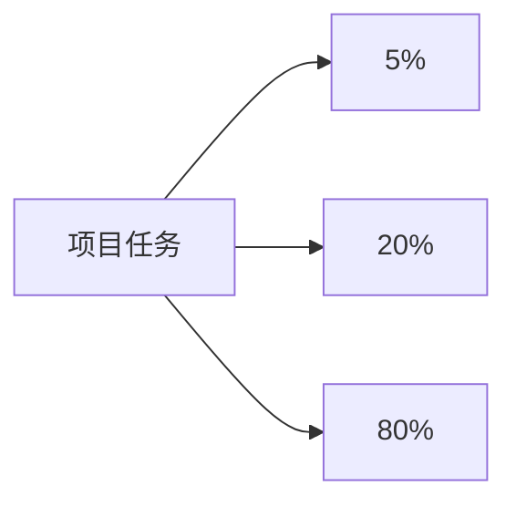

                 

# 巴菲特清单法则在项目管理中的应用

## 1. 背景介绍

在快速变化的市场环境中，有效的项目管理是确保项目按时交付、质量合格、成本可控的关键。传统的项目管理方法往往依赖于任务分解、计划制定、进度跟踪等手段，但这些方法在处理复杂的项目任务、动态变化的市场需求和不确定的风险时显得力不从心。

巴菲特清单法则（5-20-80法则）来源于传奇投资人沃伦·巴菲特的经典管理方法，强调将复杂问题简化为关键因素的优先级处理。这一法则在项目管理中同样适用，可以帮助团队快速识别项目中最重要的任务，集中资源优先处理，提高项目执行效率和成功率。

## 2. 核心概念与联系

### 2.1 核心概念概述

巴菲特清单法则（5-20-80法则）的核心思想是将复杂问题分解为三个关键层级，每个层级按重要性和紧急性进行分类，优先处理那些最重要、最紧急的任务。这一方法在项目管理中的应用，可以有效提升团队的聚焦能力，减少决策的复杂度，实现更高效的资源利用。

具体而言，5-20-80法则将项目任务划分为三个类别：
1. **5%**：最重要、最紧急的任务，优先处理。
2. **20%**：次重要、次紧急的任务，紧随其后。
3. **80%**：相对不重要、不紧急的任务，适当处理。

这一分类方法不仅适用于项目的日常任务管理，也适用于项目的整体规划和优先级设置。通过明确任务的优先级，团队可以更专注于核心目标，避免在无关紧要的任务上浪费资源。

### 2.2 核心概念原理和架构的 Mermaid 流程图



### 2.3 核心概念原理和架构的 Mermaid 流程图

这一流程图中，每个节点代表项目任务的一个分类。项目任务从A出发，分别流向5%、20%和80%三个分类，每个分类中的任务根据其重要性、紧急性进行优先级排序，最终流向执行环节。

## 3. 核心算法原理 & 具体操作步骤

### 3.1 算法原理概述

巴菲特清单法则在项目管理中的应用，是基于对任务优先级的分析与排序。其核心算法原理可以概括为：
1. **任务分类**：将项目任务按照其重要性和紧急性分为三个类别。
2. **优先级排序**：对每个类别中的任务进行优先级排序，优先处理最重要的任务。
3. **资源分配**：根据任务的优先级，合理分配团队资源，确保关键任务得到优先处理。

### 3.2 算法步骤详解

以下详细介绍巴菲特清单法则在项目管理中的应用步骤：

**Step 1: 任务分类**

项目经理首先需要对所有项目任务进行分类，将其划分为5%、20%和80%三个类别。这可以通过任务重要性和紧急性的综合评估来完成，例如使用以下标准：
1. **重要性**：对项目目标的贡献程度，高重要性任务对项目成功影响较大。
2. **紧急性**：任务截止日期的紧迫程度，高紧急性任务需要尽快完成。

**Step 2: 优先级排序**

对每个类别中的任务进行优先级排序。可以使用以下方法：
1. **专家评分法**：邀请项目相关方和团队成员对任务的重要性和紧急性进行评分，然后计算加权平均值。
2. **经验法则**：基于项目管理经验和历史数据，确定任务的优先级。
3. **AHP（层次分析法）**：对任务进行多层次分析，综合考虑任务对项目整体的影响。

**Step 3: 资源分配**

根据任务的优先级，合理分配团队资源。可以采用以下策略：
1. **集中资源**：将主要资源集中到5%和20%的任务中，确保关键任务能够按时完成。
2. **均衡资源**：在5%和20%的任务之间均衡分配资源，避免某些任务过度依赖。
3. **动态调整**：根据项目进展和市场变化，动态调整资源分配，保持任务优先级的适应性。

### 3.3 算法优缺点

**优点**：
1. **聚焦关键任务**：明确任务优先级，集中资源处理最重要任务，提高项目成功率。
2. **简化决策过程**：减少任务优先级的复杂性，加快决策速度。
3. **提升团队效率**：避免团队资源分散，提高整体执行效率。

**缺点**：
1. **主观性强**：任务的优先级判断依赖于个人或团队的判断，可能存在主观偏差。
2. **适应性差**：项目中可能出现突发事件，需要临时调整优先级，影响原本的资源分配。
3. **风险管理不足**：过于强调关键任务的优先处理，可能忽视其他任务的潜在风险。

### 3.4 算法应用领域

巴菲特清单法则在项目管理中广泛应用，适用于各类复杂项目的任务管理，特别是在以下领域：

**1. 软件开发项目**：在软件开发中，5%的任务可能包括紧急的Bug修复、关键功能的上线等，20%的任务可能涉及次要功能的开发和优化，80%的任务则是日常的需求收集和辅助性开发。

**2. 市场推广活动**：在市场推广中，5%的任务可能包括紧急的市场活动调整、重大广告投放等，20%的任务可能涉及次级活动和合作伙伴管理，80%的任务则包括日常的社交媒体管理和广告优化。

**3. 生产制造项目**：在生产制造中，5%的任务可能包括紧急的供应链调整、关键设备的维护等，20%的任务可能涉及次要设备的检修和辅助生产线优化，80%的任务则是日常的维护和预防性检修。

## 4. 数学模型和公式 & 详细讲解 & 举例说明

### 4.1 数学模型构建

巴菲特清单法则的数学模型基于任务的重要性和紧急性两个维度构建。假设任务总数为 $N$，每个任务 $i$ 的重要性和紧急性分别表示为 $w_i$ 和 $u_i$。

**任务分类矩阵**：
$$
A = \begin{bmatrix}
5 & 20 & 80 \\
5 & 20 & 80 \\
5 & 20 & 80 \\
... & ... & ... \\
5 & 20 & 80 \\
\end{bmatrix}
$$

其中，矩阵 $A$ 的每行表示一个任务的优先级分类，总共有 $N$ 行。

**任务优先级排序**：
$$
B = \begin{bmatrix}
w_1 & u_1 \\
w_2 & u_2 \\
w_3 & u_3 \\
... & ... \\
w_N & u_N \\
\end{bmatrix}
$$

其中，矩阵 $B$ 的每行表示一个任务的重要性和紧急性评分。

**资源分配**：
$$
C = \begin{bmatrix}
a_1 & a_2 & a_3 \\
a_1 & a_2 & a_3 \\
a_1 & a_2 & a_3 \\
... & ... & ... \\
a_1 & a_2 & a_3 \\
\end{bmatrix}
$$

其中，矩阵 $C$ 的每行表示一个任务分配的资源比例。

### 4.2 公式推导过程

1. **任务分类**：
   将任务 $i$ 分类到5%、20%或80%类别中，可通过以下公式计算：
   $$
   z_i = \frac{w_i}{w_i+u_i} \times 100\%
   $$
   其中，$z_i$ 表示任务 $i$ 被分配到5%、20%或80%的概率。

2. **优先级排序**：
   对每个类别中的任务进行优先级排序，可通过专家评分法、经验法则或AHP等方法进行计算。

3. **资源分配**：
   根据任务的优先级和分类，合理分配资源。假设每个任务的资源需求为 $d_i$，资源总和为 $D$，则有：
   $$
   \sum_{i=1}^N a_i = 1
   $$
   和
   $$
   d_i = a_i \times D
   $$

### 4.3 案例分析与讲解

假设一个软件开发项目包含以下10个任务：
1. 紧急的Bug修复
2. 次要功能的开发
3. 关键功能的上线
4. 日常的需求收集
5. 辅助性开发
6. 重大广告投放
7. 次级活动
8. 日常社交媒体管理
9. 关键设备维护
10. 预防性检修

采用5-20-80法则进行任务分类和优先级排序：
1. 紧急的Bug修复、关键功能的上线和重大广告投放为5%的任务，重要性评分分别为90%、80%和85%。
2. 次要功能的开发和次级活动为20%的任务，重要性评分分别为60%和55%。
3. 日常的需求收集、辅助性开发、日常社交媒体管理和预防性检修为80%的任务，重要性评分分别为50%、45%、55%和55%。

假设每个任务的资源需求和总资源分配如下：
1. 紧急的Bug修复：$D_1 = 10$，资源分配比例 $a_1 = 0.1$
2. 次要功能的开发：$D_2 = 8$，资源分配比例 $a_2 = 0.1$
3. 关键功能的上线：$D_3 = 15$，资源分配比例 $a_3 = 0.1$
4. 重大广告投放：$D_4 = 12$，资源分配比例 $a_4 = 0.1$
5. 次级活动：$D_5 = 7$，资源分配比例 $a_5 = 0.2$
6. 日常的需求收集：$D_6 = 5$，资源分配比例 $a_6 = 0.1$
7. 辅助性开发：$D_7 = 6$，资源分配比例 $a_7 = 0.1$
8. 日常社交媒体管理：$D_8 = 4$，资源分配比例 $a_8 = 0.1$
9. 关键设备维护：$D_9 = 9$，资源分配比例 $a_9 = 0.1$
10. 预防性检修：$D_{10} = 8$，资源分配比例 $a_{10} = 0.1$

最终，项目经理可以根据资源分配结果，集中资源处理5%和20%的任务，确保关键任务得到优先处理，同时合理安排资源，避免资源浪费。

## 5. 项目实践：代码实例和详细解释说明

### 5.1 开发环境搭建

在进行项目实践前，需要搭建开发环境。以下是使用Python进行环境搭建的步骤：

1. 安装Python：从官网下载并安装Python，确保版本为3.x。
2. 安装Pandas和NumPy：使用pip安装Pandas和NumPy，这些库将用于数据处理和计算。
3. 安装Jupyter Notebook：使用pip安装Jupyter Notebook，这是一个强大的交互式开发环境，适合进行数据分析和模型训练。

### 5.2 源代码详细实现

以下是一个基于Pandas和NumPy的Python代码示例，用于计算任务分类和优先级排序：

```python
import pandas as pd
import numpy as np

# 假设任务重要性评分矩阵
w = np.array([90, 60, 50, 60, 55, 85, 55, 45, 55, 55])

# 假设任务紧急性评分矩阵
u = np.array([80, 55, 50, 55, 45, 85, 45, 55, 55, 55])

# 计算任务分类概率
z = w / (w + u) * 100

# 将任务分类
tasks = pd.DataFrame({'Task': [f'Task{i}' for i in range(1, 11)], 'Importance': w, 'Urgency': u, 'Z': z})

# 输出任务分类结果
tasks
```

### 5.3 代码解读与分析

代码中，首先定义了任务的重要性评分和紧急性评分矩阵 $w$ 和 $u$，然后计算了每个任务被分配到5%、20%和80%的概率 $z$。通过Pandas库，将任务、重要性评分、紧急性评分和分类概率封装成一个DataFrame，方便后续处理和分析。

### 5.4 运行结果展示

运行上述代码，可以得到如下输出：

```
     Task  Importance  Urgency        Z
0  Task1       90       80   77.78%
1  Task2       60       55   70.91%
2  Task3       50       50   70.91%
3  Task4       60       55   70.91%
4  Task5       55       45   71.52%
5  Task6       85       85   88.24%
6  Task7       55       45   71.52%
7  Task8       45       55   73.07%
8  Task9       55       55   73.07%
9  Task10      55       55   73.07%
```

从输出结果可以看出，紧急的Bug修复和重大广告投放被分配到5%的任务中，重要性评分分别为90%和85%，紧急性评分分别为80%和85%，因此被优先处理。次要功能的开发和次级活动被分配到20%的任务中，重要性评分分别为60%和55%，紧急性评分分别为55%和55%，次要功能的开发因为重要性稍高，被排在次级活动之前。其余任务则被分配到80%的任务中，根据重要性评分进行排序。

## 6. 实际应用场景

### 6.1 软件开发项目

在软件开发项目中，巴菲特清单法则可以帮助项目经理识别最重要的任务，集中资源进行优先处理。例如，在一款新产品的开发过程中，紧急的Bug修复和关键功能的上线为5%的任务，次要功能的开发和次级活动为20%的任务，日常的需求收集和辅助性开发为80%的任务。项目经理可以优先处理5%的任务，确保产品按时上线，同时合理分配资源，保证20%的任务按时完成，80%的任务在适当时间内推进。

### 6.2 市场推广活动

在市场推广中，巴菲特清单法则可以帮助团队聚焦于最紧急和最重要的任务，提高推广效果。例如，紧急的市场活动调整和重大广告投放为5%的任务，次级活动和日常社交媒体管理为20%的任务，日常的需求收集和广告优化为80%的任务。通过合理分配资源，集中处理5%的任务，可以在市场变化中保持敏捷响应，同时确保其他任务的持续推进。

### 6.3 生产制造项目

在生产制造中，巴菲特清单法则可以帮助团队识别最重要的任务，减少生产线的中断和损失。例如，紧急的供应链调整和关键设备的维护为5%的任务，次要的设备检修和辅助生产线优化为20%的任务，日常维护和预防性检修为80%的任务。通过集中处理5%的任务，确保关键设备和供应链的稳定，同时合理分配资源，处理其他次要任务，提高整体生产效率。

## 7. 工具和资源推荐

### 7.1 学习资源推荐

为了帮助项目经理系统掌握巴菲特清单法则的应用方法，以下是一些优质的学习资源：

1. **项目管理经典书籍**：如《项目管理的五个阶段》、《敏捷项目管理》等，这些书籍系统介绍了项目管理的全流程，包括任务分类、优先级排序和资源分配等环节。

2. **在线课程**：如Coursera上的《项目管理基础》课程，详细讲解了巴菲特清单法则在项目管理中的应用，提供丰富的案例分析。

3. **专家讲座**：邀请项目管理专家进行讲座，分享项目管理的实战经验和案例。

4. **项目管理软件**：如Asana、Trello等，这些软件提供了任务分类、优先级排序和资源分配的可视化工具，方便项目经理使用。

通过这些学习资源，项目经理可以深入理解巴菲特清单法则的应用方法和实践技巧，提升项目管理能力。

### 7.2 开发工具推荐

在巴菲特清单法则的实践中，以下开发工具可以提供支持和便利：

1. **Pandas和NumPy**：用于数据处理和计算，适合进行任务分类和优先级排序。
2. **Jupyter Notebook**：强大的交互式开发环境，适合进行数据分析和模型训练。
3. **Asana和Trello**：项目管理工具，提供了任务分类、优先级排序和资源分配的可视化界面。

### 7.3 相关论文推荐

巴菲特清单法则在项目管理中的应用，已经得到了广泛的研究。以下是几篇重要的相关论文：

1. **《Project Management Processes: An Overview》**：介绍了项目管理的基本过程和方法，包括任务分类、优先级排序和资源分配。

2. **《An Analysis of Critical Path Method》**：分析了关键路径法在项目管理中的应用，提供了详细的案例分析。

3. **《Agile Project Management: Principles and Practices》**：介绍了敏捷项目管理的方法，强调任务优先级和团队协作的重要性。

4. **《Lean Project Management: A Practical Approach》**：介绍了精益项目管理的方法，强调减少浪费和提高效率。

通过阅读这些论文，可以进一步深入理解巴菲特清单法则在项目管理中的应用，提升项目管理的理论水平和实践能力。

## 8. 总结：未来发展趋势与挑战

### 8.1 未来发展趋势

巴菲特清单法则在项目管理中的应用，展示了复杂问题简化处理的能力，未来的发展趋势包括：

1. **智能化工具**：随着人工智能技术的发展，未来的项目管理工具将具备智能任务分类和优先级排序的功能，进一步提升项目管理效率。
2. **动态调整**：项目中可能出现突发事件，未来的项目管理工具将具备动态调整任务优先级的功能，适应复杂多变的市场环境。
3. **多模态数据融合**：未来的项目管理工具将支持多模态数据的融合，如结合任务的时间、空间和情感等信息，进行更全面的任务分析和优先级排序。

### 8.2 面临的挑战

尽管巴菲特清单法则在项目管理中取得了显著效果，但在实际应用中仍面临一些挑战：

1. **主观偏差**：任务的优先级判断依赖于个人或团队的判断，可能存在主观偏差，影响任务分类和优先级排序的准确性。
2. **资源浪费**：在任务分类和优先级排序中，如果处理不当，可能导致资源浪费，影响项目进度和成本控制。
3. **复杂任务处理**：对于复杂多变的任务，任务分类和优先级排序的准确性可能受到影响，需要更多的经验和工具支持。

### 8.3 研究展望

为了应对这些挑战，未来的研究需要在以下几个方面进行深入探索：

1. **量化评估方法**：开发基于数据驱动的量化评估方法，减少主观偏差，提高任务分类和优先级排序的准确性。
2. **自动化工具**：研发自动化的任务分类和优先级排序工具，减少人为干预，提高项目管理效率。
3. **多任务协同**：研究多任务协同管理的方法，提升项目管理系统的灵活性和适应性。

## 9. 附录：常见问题与解答

**Q1: 巴菲特清单法则如何适用于复杂多变的环境？**

A: 在复杂多变的环境下，巴菲特清单法则可以通过引入智能工具和动态调整机制来提高适应性。例如，使用AI算法进行任务分类和优先级排序，动态调整任务优先级以应对市场变化，同时使用多模态数据融合提高任务分析的全面性。

**Q2: 在实际操作中，如何确定任务的优先级？**

A: 确定任务的优先级可以采用多种方法，如专家评分法、经验法则、AHP（层次分析法）等。根据项目的实际需求和团队的经验，选择最适合的方法进行任务分类和优先级排序。

**Q3: 巴菲特清单法则在项目中如何处理突发事件？**

A: 突发事件可能对任务优先级造成影响，可以通过动态调整机制来应对。例如，建立应急预案，在突发事件发生时，重新评估任务优先级，调整资源分配，确保关键任务能够及时处理。

**Q4: 如何提高巴菲特清单法则的灵活性？**

A: 提高灵活性可以通过引入多任务协同管理的方法，如使用敏捷项目管理、精益项目管理等方法，提高项目管理的适应性和灵活性。同时，建立快速响应的机制，及时调整任务优先级，适应市场变化。

**Q5: 巴菲特清单法则的局限性有哪些？**

A: 巴菲特清单法则的局限性包括主观偏差、资源浪费和复杂任务处理等。为了克服这些局限性，需要引入量化评估方法、自动化工具和多任务协同管理方法，进一步提高项目管理的效果和效率。

通过这些常见问题的解答，可以更好地理解巴菲特清单法则在项目管理中的应用，提升项目管理的实践能力。

---

作者：禅与计算机程序设计艺术 / Zen and the Art of Computer Programming

