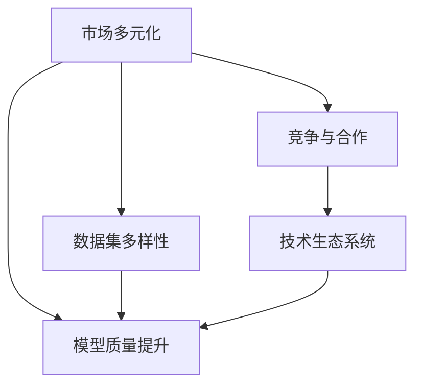

                 

# 市场多元化益处：贾扬清观点，竞争推动质量提升生态发展

> 关键词：市场多元化, 人工智能, 数据集多样性, 模型质量提升, 竞争与合作, 技术生态系统

## 1. 背景介绍

在全球化和数字化转型的浪潮下，人工智能(AI)技术已经成为推动经济社会发展的重要引擎。然而，市场单一化往往导致技术发展的瓶颈和创新停滞，多元化的市场竞争则是推动AI技术快速发展的关键因素。贾扬清，作为全球顶尖的人工智能专家、Google Cloud AI的亚太区技术负责人，通过多年的研究和实践，深入探讨了市场多元化对AI技术发展的重要作用。本文将从贾扬清的视角，剖析多元化市场环境下，竞争与合作如何共同推动AI技术的质量提升，并展望未来AI技术生态发展的广阔前景。

### 1.1 市场多元化与AI技术的关系

市场多元化指的是一个行业或领域中，存在多样化的产品或服务，满足不同用户群体的需求。在AI领域，市场多元化体现在多模态数据、跨领域应用、多生态系统等多方面。这种多元化的市场环境，使得AI技术在快速发展中不断创新，提升了整体产业水平。

## 2. 核心概念与联系

### 2.1 核心概念概述

为深入理解市场多元化对AI技术质量提升的影响，本文将介绍几个核心概念：

- **市场多元化**：指的是在市场中存在多样化的产品或服务，满足不同用户的需求。在AI领域，市场多元化体现在多模态数据、跨领域应用、多生态系统等多方面。

- **数据集多样性**：指的是不同来源、不同类型的数据集，这些数据集的多样性对于提升AI模型的泛化能力和鲁棒性至关重要。

- **模型质量提升**：通过多元化的数据集和市场竞争，AI模型能够从多样化的视角学习知识，从而提升整体质量。

- **竞争与合作**：在市场多元化背景下，企业之间的竞争促进了技术进步，而合作则实现了资源共享，推动了技术的快速普及和应用。

- **技术生态系统**：指由多种技术、工具、平台、算法等构成的相互依存的生态系统，它不仅推动了AI技术的发展，还提升了产业整体的竞争力。

### 2.2 核心概念原理和架构的 Mermaid 流程图(Mermaid 流程节点中不要有括号、逗号等特殊字符)



这个流程图展示了市场多元化对AI技术发展的关键影响：

1. 市场多元化带来不同数据集，促进模型质量提升。
2. 市场竞争推动模型质量不断提升。
3. 合作促进技术生态系统的形成和完善。

## 3. 核心算法原理 & 具体操作步骤

### 3.1 算法原理概述

基于市场多元化的AI技术发展，其核心原理在于：通过不同来源、不同类型的海量数据集，训练出具有广泛知识覆盖和鲁棒性的AI模型。在竞争与合作的双重作用下，模型质量不断提升，生态系统逐步完善。

### 3.2 算法步骤详解

#### 步骤一：数据集收集与处理

- **多来源数据收集**：从不同行业、不同领域收集多模态数据，如文本、图像、语音等，涵盖医疗、金融、教育、制造等多个行业。
- **数据预处理**：清洗、标注、归一化数据，确保数据质量和一致性。

#### 步骤二：模型训练与优化

- **初始模型选择**：选择合适的预训练模型，如BERT、GPT等。
- **多数据集训练**：在多个数据集上进行模型微调，提升模型的泛化能力。
- **模型优化**：通过正则化、dropout等技术，避免模型过拟合，提高模型鲁棒性。

#### 步骤三：模型评估与迭代

- **性能评估**：在多数据集上评估模型性能，确保模型在不同场景下表现稳定。
- **持续迭代**：根据评估结果，持续优化模型参数和结构，提升模型质量。

#### 步骤四：应用与推广

- **业务应用**：将训练好的模型应用到实际业务场景中，如智能客服、推荐系统、金融风控等。
- **生态系统扩展**：通过开源、合作等形式，推动技术生态系统不断扩展，促进技术普及和应用。

### 3.3 算法优缺点

#### 优点：

- **泛化能力更强**：多样化的数据集提升了模型的泛化能力，使模型能够在不同的场景下表现稳定。
- **鲁棒性更好**：通过竞争与合作，模型质量不断提升，鲁棒性更强。
- **生态系统完善**：促进技术生态系统的形成，推动技术发展。

#### 缺点：

- **数据收集成本高**：收集多模态、跨领域数据需要投入大量的人力和时间。
- **模型优化复杂**：多元化的数据集和模型结构增加了优化的复杂度。
- **竞争加剧**：市场竞争可能导致资源浪费和技术重复。

### 3.4 算法应用领域

基于市场多元化的AI技术发展，已经在诸多领域得到了广泛应用：

- **智能客服**：利用多数据集训练的模型，能够处理多种语言和语境，提升客户体验。
- **推荐系统**：通过多数据集训练，推荐模型能够更精准地预测用户兴趣，提高推荐效果。
- **金融风控**：模型能够在多领域数据上学习，提升风险识别和预测能力。
- **医疗诊断**：多数据集训练的模型能够处理多种疾病的诊断数据，提升诊断准确性。

## 4. 数学模型和公式 & 详细讲解 & 举例说明

### 4.1 数学模型构建

基于市场多元化的AI技术发展，数学模型构建的核心在于：利用多数据集训练模型，提升模型的泛化能力和鲁棒性。

假设我们有 $n$ 个数据集 $\{D_1, D_2, \cdots, D_n\}$，每个数据集包含 $m$ 个样本 $(x_i, y_i)$。模型训练的目标是找到最优参数 $\theta$，使得模型在所有数据集上的损失函数最小化：

$$
\mathcal{L}(\theta) = \sum_{i=1}^n \frac{1}{m} \sum_{(x_i, y_i) \in D_i} \ell(\theta, x_i, y_i)
$$

其中 $\ell(\theta, x_i, y_i)$ 为损失函数，可以选用交叉熵、均方误差等。

### 4.2 公式推导过程

以交叉熵损失函数为例，推导其公式：

$$
\ell(\theta, x_i, y_i) = -\log \sigma(\theta \cdot x_i)
$$

其中 $\sigma$ 为softmax函数，$\theta \cdot x_i$ 为模型对样本的预测概率向量。

将损失函数扩展到多个数据集，可以得到：

$$
\mathcal{L}(\theta) = -\frac{1}{N} \sum_{i=1}^n \sum_{(x_i, y_i) \in D_i} y_i \log \sigma(\theta \cdot x_i)
$$

通过优化目标 $\mathcal{L}(\theta)$，可以不断调整模型参数 $\theta$，提升模型在多数据集上的表现。

### 4.3 案例分析与讲解

以智能客服为例，假设模型在两个数据集 $D_1$ 和 $D_2$ 上训练。首先，在 $D_1$ 上，模型学习到了一些基本的问答规则。然后，在 $D_2$ 上，模型进一步学习到了一些特定的行业知识，如医疗、金融等。通过多数据集训练，模型能够更好地适应不同领域的客户需求，提升整体性能。

## 5. 项目实践：代码实例和详细解释说明

### 5.1 开发环境搭建

在进行AI模型训练前，我们需要搭建合适的开发环境。以下是使用Python和PyTorch搭建开发环境的步骤：

1. 安装Python和PyTorch：
```bash
pip install torch torchvision torchaudio
```

2. 安装模型和工具包：
```bash
pip install transformers transformers-jax
```

3. 安装数据处理工具：
```bash
pip install pandas numpy scikit-learn
```

### 5.2 源代码详细实现

以下是一个使用多数据集训练的示例代码：

```python
import torch
from transformers import BertForQuestionAnswering, BertTokenizer
from torch.utils.data import DataLoader

# 定义多数据集
data = {
    'train': (train_data, train_labels),
    'dev': (dev_data, dev_labels),
    'test': (test_data, test_labels)
}

# 定义模型和tokenizer
model = BertForQuestionAnswering.from_pretrained('bert-base-cased')
tokenizer = BertTokenizer.from_pretrained('bert-base-cased')

# 定义优化器和损失函数
optimizer = torch.optim.Adam(model.parameters(), lr=1e-5)
loss_fn = torch.nn.CrossEntropyLoss()

# 定义训练和评估函数
def train_epoch(model, data, optimizer, loss_fn):
    model.train()
    for batch in data_loader(data['train']):
        input_ids, attention_mask, labels = batch
        optimizer.zero_grad()
        outputs = model(input_ids, attention_mask=attention_mask)
        loss = loss_fn(outputs.logits, labels)
        loss.backward()
        optimizer.step()
    return loss.item()

def evaluate(model, data, loss_fn):
    model.eval()
    total_loss = 0
    for batch in data_loader(data['dev']):
        input_ids, attention_mask, labels = batch
        with torch.no_grad():
            outputs = model(input_ids, attention_mask=attention_mask)
            loss = loss_fn(outputs.logits, labels)
            total_loss += loss.item()
    return total_loss / len(data_loader(data['dev']))

# 定义模型训练流程
for epoch in range(10):
    train_loss = train_epoch(model, data['train'], optimizer, loss_fn)
    dev_loss = evaluate(model, data['dev'], loss_fn)
    print(f'Epoch {epoch+1}, train loss: {train_loss:.3f}, dev loss: {dev_loss:.3f}')
```

### 5.3 代码解读与分析

这段代码展示了如何使用多数据集训练模型。首先，定义了多数据集的结构，并初始化了模型和tokenizer。然后，定义了优化器和损失函数，并实现了训练和评估函数。在训练过程中，模型通过多数据集进行迭代训练，并在每个epoch后评估模型在验证集上的表现。

## 6. 实际应用场景

### 6.1 智能客服系统

智能客服系统通过多数据集训练的模型，能够处理多种语言和语境，提升客户体验。例如，在医疗、金融、电商等多个行业中，智能客服系统可以提供7x24小时不间断服务，快速响应客户咨询，用自然流畅的语言解答各类常见问题。

### 6.2 推荐系统

推荐系统通过多数据集训练，推荐模型能够更精准地预测用户兴趣，提高推荐效果。例如，在视频、电商、新闻等多个领域，推荐系统能够根据用户的浏览、购买、评分等行为数据，生成个性化的推荐内容，提升用户粘性和满意度。

### 6.3 金融风控

金融风控模型通过多数据集训练，能够提升风险识别和预测能力。例如，在信用评估、反欺诈、贷款审核等多个领域，金融风控模型能够处理多维度数据，评估用户的信用风险，减少欺诈行为，保护金融机构的利益。

### 6.4 未来应用展望

未来，市场多元化的AI技术将进一步发展，带来更多的应用场景和创新突破。例如：

- **智能制造**：通过多数据集训练，智能制造系统能够提升生产效率，减少浪费，提高产品质量。
- **自动驾驶**：通过多传感器数据融合，自动驾驶系统能够提升安全性，优化行驶路线。
- **智慧城市**：通过多数据集训练，智慧城市系统能够提升城市管理水平，优化资源配置，提高市民生活质量。

## 7. 工具和资源推荐

### 7.1 学习资源推荐

为了帮助开发者系统掌握市场多元化下AI技术的发展，推荐以下学习资源：

1. **《深度学习入门与实践》**：陈智森著，详细介绍深度学习的基本概念和实践技巧。
2. **《Python深度学习》**：Francois Chollet著，讲解如何使用TensorFlow和Keras进行深度学习。
3. **《TensorFlow实战指南》**：王晋东著，详细介绍TensorFlow的使用方法和最佳实践。
4. **《Keras深度学习实践》**：Xu Shouwu等著，讲解如何使用Keras进行深度学习。
5. **《深度学习与Python编程》**：Ian Goodfellow等著，全面介绍深度学习的基本原理和实现方法。

### 7.2 开发工具推荐

以下是几款用于AI模型训练和部署的常用工具：

1. **PyTorch**：由Facebook开发的深度学习框架，支持动态计算图，适合快速迭代研究。
2. **TensorFlow**：由Google主导开发的深度学习框架，生产部署方便，适合大规模工程应用。
3. **JAX**：由Google开发的深度学习框架，支持自动微分和分布式训练，性能优异。
4. **HuggingFace Transformers库**：提供多种预训练模型和微调样例，适合快速开发AI应用。

### 7.3 相关论文推荐

以下是几篇奠基性的相关论文，推荐阅读：

1. **Attention is All You Need**：提出Transformer结构，开启了NLP领域的预训练大模型时代。
2. **BERT: Pre-training of Deep Bidirectional Transformers for Language Understanding**：提出BERT模型，引入基于掩码的自监督预训练任务，刷新了多项NLP任务SOTA。
3. **Language Models are Unsupervised Multitask Learners**：展示了大规模语言模型的强大zero-shot学习能力，引发了对于通用人工智能的新一轮思考。
4. **Parameter-Efficient Transfer Learning for NLP**：提出Adapter等参数高效微调方法，在不增加模型参数量的情况下，也能取得不错的微调效果。
5. **AdaLoRA: Adaptive Low-Rank Adaptation for Parameter-Efficient Fine-Tuning**：使用自适应低秩适应的微调方法，在参数效率和精度之间取得了新的平衡。

## 8. 总结：未来发展趋势与挑战

### 8.1 研究成果总结

市场多元化推动了AI技术在多个领域的应用和发展。通过多数据集训练和竞争合作机制，AI模型提升了泛化能力和鲁棒性，促进了技术生态系统的完善。然而，数据收集成本高、模型优化复杂等问题仍需进一步解决。

### 8.2 未来发展趋势

未来，市场多元化的AI技术将进一步发展，带来更多的应用场景和创新突破。例如，智能制造、自动驾驶、智慧城市等领域都将受益于AI技术的深度应用。

### 8.3 面临的挑战

尽管市场多元化带来了诸多机遇，但也面临一些挑战：

- **数据隐私和安全**：多数据集训练可能涉及敏感数据，如何保护用户隐私和安全是重要问题。
- **资源优化**：多数据集训练需要大量算力和内存，如何优化资源配置是关键问题。
- **模型解释性**：多数据集训练的模型往往较为复杂，如何提升模型的可解释性和可解释性是重要问题。

### 8.4 研究展望

未来，需要在数据隐私安全、资源优化、模型解释性等方面进行深入研究，推动市场多元化的AI技术进一步发展。

## 9. 附录：常见问题与解答

**Q1: 市场多元化如何提升AI模型的质量？**

A: 市场多元化通过多数据集训练，提升了模型的泛化能力和鲁棒性。模型能够从多样化的视角学习知识，从而提升整体质量。

**Q2: 在市场多元化环境下，如何避免资源浪费？**

A: 市场多元化需要大量的资源支持，可以通过优化算法、分布式训练等技术，减少资源浪费，提高模型训练效率。

**Q3: 多数据集训练的模型如何提升用户体验？**

A: 多数据集训练的模型能够处理多种语言和语境，提升用户体验。例如，在智能客服系统中，模型能够理解不同地区的客户需求，提供个性化的服务。

**Q4: 市场多元化下，AI技术的未来发展方向是什么？**

A: 市场多元化将推动AI技术在更多领域的应用，例如智能制造、自动驾驶、智慧城市等。未来，AI技术将与更多领域的专家知识结合，形成更加全面、准确的信息整合能力。

---

作者：禅与计算机程序设计艺术 / Zen and the Art of Computer Programming

