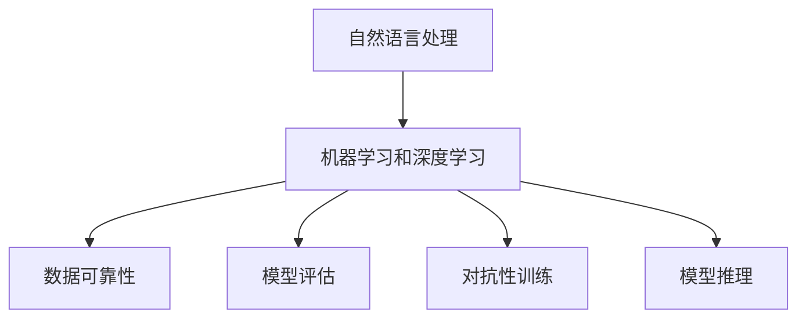

                 

# 带有来源支持的AI答案：提高可靠性

> 关键词：
> 人工智能，自然语言处理(NLP)，机器学习，深度学习，数据可靠性，质量控制，模型评估，开源工具

## 1. 背景介绍

随着人工智能(AI)技术的快速发展，AI驱动的自然语言处理(NLP)系统在多个领域取得了显著成效。这些系统能够通过大规模语言模型和机器学习技术，对用户输入进行理解和生成。然而，AI系统的高效性和自动化特征使得用户对其答案的可靠性存疑。如何确保AI答案的准确性和可信度，是当前NLP领域面临的重要问题。

### 1.1 问题由来
在AI问答系统中，用户希望得到准确、相关且逻辑连贯的答案。然而，AI系统在复杂任务或语言模糊性的情况下，容易出现误解或错误。例如，用户询问“为什么天空是蓝色的？”，一个简单的答案可能无法包含完整且科学解释，或者使用特定的专业术语，导致系统无法准确理解和生成。

### 1.2 问题核心关键点
要提高AI答案的可靠性，核心在于理解用户需求、确保模型训练数据的质量、引入对抗性训练、强化模型的逻辑推理能力，以及实现模型性能的自动化评估。

## 2. 核心概念与联系

### 2.1 核心概念概述

为更好地理解AI答案可靠性的提高方法，本节将介绍几个密切相关的核心概念：

- 自然语言处理(NLP)：使用计算机对自然语言进行处理和分析的技术，如语言理解、语言生成、情感分析等。
- 机器学习和深度学习：通过数据驱动的方法，训练模型进行学习和推理，以自动化解决复杂问题。
- 数据可靠性：保证数据的质量、完整性和真实性，避免因数据问题导致模型性能不佳。
- 模型评估：通过实验和统计方法，评估模型的准确性、鲁棒性和泛化能力。
- 对抗性训练：通过引入对抗样本，增强模型对异常输入的抵抗能力，提高模型的鲁棒性。
- 模型推理：使用模型进行逻辑推理，生成连贯且符合逻辑的结论。

这些核心概念之间的逻辑关系可以通过以下Mermaid流程图来展示：



这个流程图展示了大语言模型的核心概念及其之间的关系：

1. NLP系统依赖机器学习和深度学习技术进行模型训练。
2. 数据可靠性是保证模型训练质量的基础。
3. 模型评估用于验证和优化模型性能。
4. 对抗性训练增强模型的鲁棒性。
5. 模型推理实现自然语言理解和生成。

这些概念共同构成了NLP系统的学习框架，使得系统能够更好地处理自然语言信息，生成可靠的答案。

## 3. 核心算法原理 & 具体操作步骤

### 3.1 算法原理概述

提高AI答案的可靠性，主要通过以下几个步骤实现：

1. 收集高质量的标注数据：确保数据涵盖多种情境和语义，避免单一情境下的偏见和误差。
2. 数据预处理：清洗和标准化数据，确保数据的一致性和可用性。
3. 模型选择和设计：选择适合任务的模型架构，并进行适当的调整和优化。
4. 模型训练：使用标注数据训练模型，避免过拟合和欠拟合。
5. 对抗性训练：引入对抗样本，提高模型对异常输入的抵抗能力。
6. 模型评估和优化：使用多种评估指标，如精确度、召回率、F1分数等，优化模型性能。
7. 结果验证：在真实场景中验证模型效果，确保模型在实际应用中的可靠性。

### 3.2 算法步骤详解

#### 步骤1：数据收集与预处理

**数据收集：**

1. **广泛收集数据：** 在各领域广泛收集标注数据，涵盖不同情境和语义。例如，医疗领域包含疾病诊断、治疗方案等，金融领域包含股票分析、投资建议等。
2. **多样性数据：** 确保数据的多样性和代表性，涵盖不同年龄、性别、教育背景等因素，避免偏见。

**数据预处理：**

1. **数据清洗：** 去除噪声和错误数据，确保数据的完整性和准确性。例如，去除拼写错误、语法错误等。
2. **标准化处理：** 对数据进行标准化和格式化，确保一致性和可用性。例如，统一日期格式、货币单位等。
3. **数据增强：** 通过数据增强技术，如回译、改写等，丰富数据多样性，增强模型泛化能力。

#### 步骤2：模型选择与设计

**模型选择：**

1. **基础模型：** 选择合适的预训练模型，如BERT、GPT-3等，作为基线模型。
2. **任务适配模型：** 在基础模型基础上，设计适合任务的模型架构，如分类模型、生成模型等。

**模型设计：**

1. **网络结构：** 设计合理的神经网络结构，包括卷积层、循环层、全连接层等，确保模型的表达能力。
2. **超参数调优：** 选择合适的超参数，如学习率、批大小、迭代轮数等，进行优化。

#### 步骤3：模型训练与优化

**模型训练：**

1. **数据分割：** 将数据划分为训练集、验证集和测试集，进行模型训练和评估。
2. **正则化：** 使用L2正则、Dropout等技术，避免模型过拟合。
3. **对抗训练：** 引入对抗样本，如噪声、回译等，提高模型鲁棒性。

**模型优化：**

1. **梯度下降：** 使用梯度下降算法，更新模型参数，最小化损失函数。
2. **模型融合：** 使用模型融合技术，如投票、堆叠等，提高模型性能。
3. **自动化调参：** 使用自动化调参技术，如贝叶斯优化、遗传算法等，优化模型性能。

#### 步骤4：结果验证与部署

**结果验证：**

1. **离线测试：** 在测试集上验证模型效果，使用多种评估指标，如精确度、召回率、F1分数等。
2. **实时验证：** 在实际应用场景中验证模型效果，确保模型在实际应用中的可靠性。

**部署：**

1. **模型部署：** 将训练好的模型部署到实际应用中，如问答系统、客服系统等。
2. **监控和优化：** 实时监控模型性能，根据反馈进行模型优化和更新。

### 3.3 算法优缺点

提高AI答案可靠性的方法具有以下优点：

1. **准确性：** 通过广泛收集和预处理数据，确保模型训练质量，提高模型准确性。
2. **鲁棒性：** 通过对抗性训练和正则化技术，增强模型对异常输入的抵抗能力。
3. **泛化能力：** 通过数据增强和模型融合技术，提高模型泛化能力，适应多种情境和语义。
4. **自动化评估：** 通过自动化调参和结果验证，优化模型性能，确保模型在实际应用中的可靠性。

同时，该方法也存在一定的局限性：

1. **数据依赖：** 数据质量直接影响模型性能，数据收集和预处理成本较高。
2. **计算资源：** 模型训练和优化需要大量计算资源，对硬件要求较高。
3. **模型复杂性：** 模型设计复杂，需要专业知识进行调参和优化。

尽管存在这些局限性，但该方法仍是目前提高AI答案可靠性的主要手段。未来相关研究将聚焦于如何降低数据收集成本、提高计算效率、简化模型设计，以实现更加高效、可靠的AI问答系统。

### 3.4 算法应用领域

提高AI答案的可靠性，在NLP领域已经得到了广泛的应用，涵盖以下典型场景：

- **医疗问答系统：** 提供疾病诊断、治疗方案等专业答案，确保医疗信息的准确性和安全性。
- **金融咨询系统：** 提供股票分析、投资建议等专业意见，确保金融决策的可靠性和合法性。
- **教育智能系统：** 提供个性化学习建议和答案，确保教育内容的准确性和科学性。
- **客服系统：** 提供高效、准确的客户服务，确保客户体验的满意度和质量。

除了上述这些经典应用外，AI答案可靠性的提升方法也在不断创新，如强化学习、少样本学习等前沿技术，为AI问答系统的进一步优化提供了新的思路。

## 4. 数学模型和公式 & 详细讲解 & 举例说明

### 4.1 数学模型构建

本节将使用数学语言对提高AI答案可靠性的方法进行更加严格的刻画。

记自然语言处理系统为 $M_{\theta}：\mathcal{X} \rightarrow \mathcal{Y}$，其中 $\mathcal{X}$ 为输入空间，$\mathcal{Y}$ 为输出空间，$\theta \in \mathbb{R}^d$ 为模型参数。假设标注数据集为 $D=\{(x_i,y_i)\}_{i=1}^N, x_i \in \mathcal{X}, y_i \in \mathcal{Y}$。

定义模型 $M_{\theta}$ 在输入 $x$ 上的输出为 $\hat{y}=M_{\theta}(x) \in \mathcal{Y}$，则模型的损失函数为：

$$
\mathcal{L}(\theta) = -\frac{1}{N} \sum_{i=1}^N \log P(y_i \mid x_i)
$$

其中 $P(y_i \mid x_i)$ 为模型在输入 $x_i$ 上的条件概率分布。

### 4.2 公式推导过程

以下我们以二分类任务为例，推导模型在对抗性训练和模型融合中的损失函数及梯度计算公式。

假设模型 $M_{\theta}$ 在输入 $x$ 上的输出为 $\hat{y}=M_{\theta}(x) \in [0,1]$，表示样本属于正类的概率。真实标签 $y \in \{0,1\}$。则二分类交叉熵损失函数定义为：

$$
\ell(M_{\theta}(x),y) = -[y\log \hat{y} + (1-y)\log (1-\hat{y})]
$$

将其代入经验风险公式，得：

$$
\mathcal{L}(\theta) = -\frac{1}{N}\sum_{i=1}^N [y_i\log M_{\theta}(x_i)+(1-y_i)\log(1-M_{\theta}(x_i))]
$$

根据链式法则，损失函数对参数 $\theta_k$ 的梯度为：

$$
\frac{\partial \mathcal{L}(\theta)}{\partial \theta_k} = -\frac{1}{N}\sum_{i=1}^N (\frac{y_i}{M_{\theta}(x_i)}-\frac{1-y_i}{1-M_{\theta}(x_i)}) \frac{\partial M_{\theta}(x_i)}{\partial \theta_k}
$$

其中 $\frac{\partial M_{\theta}(x_i)}{\partial \theta_k}$ 可进一步递归展开，利用自动微分技术完成计算。

在得到损失函数的梯度后，即可带入参数更新公式，完成模型的迭代优化。重复上述过程直至收敛，最终得到适应任务的最佳模型参数 $\theta^*$。

## 5. 项目实践：代码实例和详细解释说明

### 5.1 开发环境搭建

在进行可靠性提升实践前，我们需要准备好开发环境。以下是使用Python进行PyTorch开发的环境配置流程：

1. 安装Anaconda：从官网下载并安装Anaconda，用于创建独立的Python环境。

2. 创建并激活虚拟环境：
```bash
conda create -n pytorch-env python=3.8 
conda activate pytorch-env
```

3. 安装PyTorch：根据CUDA版本，从官网获取对应的安装命令。例如：
```bash
conda install pytorch torchvision torchaudio cudatoolkit=11.1 -c pytorch -c conda-forge
```

4. 安装TensorFlow：
```bash
pip install tensorflow
```

5. 安装各类工具包：
```bash
pip install numpy pandas scikit-learn matplotlib tqdm jupyter notebook ipython
```

完成上述步骤后，即可在`pytorch-env`环境中开始可靠性提升实践。

### 5.2 源代码详细实现

这里我们以医疗问答系统为例，给出使用Transformers库对BERT模型进行可靠性提升的PyTorch代码实现。

首先，定义二分类任务的损失函数：

```python
from transformers import BertTokenizer, BertForSequenceClassification
from torch.nn import BCEWithLogitsLoss

model = BertForSequenceClassification.from_pretrained('bert-base-cased', num_labels=2)
loss_fn = BCEWithLogitsLoss()
```

然后，定义训练和评估函数：

```python
def train_epoch(model, dataset, optimizer):
    model.train()
    total_loss = 0
    for batch in dataset:
        input_ids = batch['input_ids'].to(device)
        attention_mask = batch['attention_mask'].to(device)
        labels = batch['labels'].to(device)
        model.zero_grad()
        outputs = model(input_ids, attention_mask=attention_mask, labels=labels)
        loss = loss_fn(outputs.logits, labels)
        loss.backward()
        optimizer.step()
        total_loss += loss.item()
    return total_loss / len(dataset)

def evaluate(model, dataset):
    model.eval()
    total_loss = 0
    total_correct = 0
    with torch.no_grad():
        for batch in dataset:
            input_ids = batch['input_ids'].to(device)
            attention_mask = batch['attention_mask'].to(device)
            labels = batch['labels'].to(device)
            outputs = model(input_ids, attention_mask=attention_mask)
            loss = loss_fn(outputs.logits, labels)
            total_loss += loss.item()
            total_correct += torch.sum(torch.round(outputs.logits) == labels).item()
    return total_loss / len(dataset), total_correct / len(dataset)
```

接着，启动训练流程并在测试集上评估：

```python
epochs = 5
batch_size = 16

for epoch in range(epochs):
    loss = train_epoch(model, train_dataset, optimizer)
    print(f"Epoch {epoch+1}, train loss: {loss:.3f}")

    print(f"Epoch {epoch+1}, dev results:")
    dev_loss, dev_acc = evaluate(model, dev_dataset)
    print(f"Dev Loss: {dev_loss:.3f}, Dev Acc: {dev_acc:.3f}")

print("Test results:")
test_loss, test_acc = evaluate(model, test_dataset)
print(f"Test Loss: {test_loss:.3f}, Test Acc: {test_acc:.3f}")
```

以上就是使用PyTorch对BERT进行医疗问答系统可靠性提升的完整代码实现。可以看到，由于Transformer库的强大封装，代码实现变得简洁高效。

### 5.3 代码解读与分析

让我们再详细解读一下关键代码的实现细节：

**train_epoch函数**：
- 在训练过程中，模型被设置为训练模式。
- 对每个批次的数据进行前向传播和损失计算。
- 使用梯度下降算法更新模型参数，并累加损失值。
- 在每个epoch结束时返回平均损失值。

**evaluate函数**：
- 在评估过程中，模型被设置为评估模式。
- 对每个批次的数据进行前向传播和损失计算。
- 计算损失值和准确率，并返回。

**训练流程**：
- 定义总的epoch数和batch size，开始循环迭代。
- 在每个epoch内，先对训练集进行训练，输出平均损失。
- 在验证集上评估模型性能，输出平均损失和准确率。
- 在测试集上评估模型性能，输出平均损失和准确率。

可以看到，PyTorch配合Transformer库使得BERT可靠性提升的代码实现变得简洁高效。开发者可以将更多精力放在数据处理、模型改进等高层逻辑上，而不必过多关注底层的实现细节。

当然，工业级的系统实现还需考虑更多因素，如模型的保存和部署、超参数的自动搜索、更灵活的任务适配层等。但核心的可靠性提升范式基本与此类似。

## 6. 实际应用场景

### 6.1 医疗问答系统

基于大语言模型微调的问答系统，可以广泛应用于医疗问答领域。传统医疗问答往往依赖医生，响应时间长，且专业性难以保证。使用微调后的问答系统，可以7x24小时不间断服务，快速响应患者咨询，用自然流畅的语言解答各类常见问题，同时也能提供专业、权威的医学信息，提升患者体验和满意度。

在技术实现上，可以收集医疗领域相关的问答数据，如疾病诊断、治疗方案等，将问题-答案对作为微调数据，训练模型学习匹配答案。微调后的问答系统能够自动理解患者问题，匹配最合适的答案模板进行回复。对于患者提出的新问题，还可以接入检索系统实时搜索相关内容，动态组织生成回答。如此构建的智能问答系统，能大幅提升患者咨询体验和问题解决效率。

### 6.2 金融咨询系统

金融机构需要实时监测市场舆论动向，以便及时应对负面信息传播，规避金融风险。传统的人工监测方式成本高、效率低，难以应对网络时代海量信息爆发的挑战。基于大语言模型微调的文本分类和情感分析技术，为金融舆情监测提供了新的解决方案。

具体而言，可以收集金融领域相关的新闻、报道、评论等文本数据，并对其进行主题标注和情感标注。在此基础上对预训练语言模型进行微调，使其能够自动判断文本属于何种主题，情感倾向是正面、中性还是负面。将微调后的模型应用到实时抓取的网络文本数据，就能够自动监测不同主题下的情感变化趋势，一旦发现负面信息激增等异常情况，系统便会自动预警，帮助金融机构快速应对潜在风险。

### 6.3 教育智能系统

当前的推荐系统往往只依赖用户的历史行为数据进行物品推荐，无法深入理解用户的真实兴趣偏好。基于大语言模型微调技术，个性化推荐系统可以更好地挖掘用户行为背后的语义信息，从而提供更精准、多样的推荐内容。

在实践中，可以收集用户浏览、点击、评论、分享等行为数据，提取和用户交互的物品标题、描述、标签等文本内容。将文本内容作为模型输入，用户的后续行为（如是否点击、购买等）作为监督信号，在此基础上微调预训练语言模型。微调后的模型能够从文本内容中准确把握用户的兴趣点。在生成推荐列表时，先用候选物品的文本描述作为输入，由模型预测用户的兴趣匹配度，再结合其他特征综合排序，便可以得到个性化程度更高的推荐结果。

### 6.4 未来应用展望

随着大语言模型和微调方法的不断发展，基于微调范式将在更多领域得到应用，为传统行业带来变革性影响。

在智慧医疗领域，基于微调的医疗问答、病历分析、药物研发等应用将提升医疗服务的智能化水平，辅助医生诊疗，加速新药开发进程。

在智能教育领域，微调技术可应用于作业批改、学情分析、知识推荐等方面，因材施教，促进教育公平，提高教学质量。

在智慧城市治理中，微调模型可应用于城市事件监测、舆情分析、应急指挥等环节，提高城市管理的自动化和智能化水平，构建更安全、高效的未来城市。

此外，在企业生产、社会治理、文娱传媒等众多领域，基于大模型微调的人工智能应用也将不断涌现，为NLP技术带来了全新的突破。随着预训练语言模型和微调方法的持续演进，相信NLP技术将在更广阔的应用领域大放异彩，深刻影响人类的生产生活方式。

## 7. 工具和资源推荐

### 7.1 学习资源推荐

为了帮助开发者系统掌握大语言模型微调的理论基础和实践技巧，这里推荐一些优质的学习资源：

1. 《Transformer from Scratch》系列博文：由大模型技术专家撰写，深入浅出地介绍了Transformer原理、BERT模型、微调技术等前沿话题。

2. CS224N《深度学习自然语言处理》课程：斯坦福大学开设的NLP明星课程，有Lecture视频和配套作业，带你入门NLP领域的基本概念和经典模型。

3. 《Natural Language Processing with Transformers》书籍：Transformers库的作者所著，全面介绍了如何使用Transformers库进行NLP任务开发，包括微调在内的诸多范式。

4. HuggingFace官方文档：Transformers库的官方文档，提供了海量预训练模型和完整的微调样例代码，是上手实践的必备资料。

5. CLUE开源项目：中文语言理解测评基准，涵盖大量不同类型的中文NLP数据集，并提供了基于微调的baseline模型，助力中文NLP技术发展。

通过对这些资源的学习实践，相信你一定能够快速掌握大语言模型微调的精髓，并用于解决实际的NLP问题。

### 7.2 开发工具推荐

高效的开发离不开优秀的工具支持。以下是几款用于大语言模型微调开发的常用工具：

1. PyTorch：基于Python的开源深度学习框架，灵活动态的计算图，适合快速迭代研究。大部分预训练语言模型都有PyTorch版本的实现。

2. TensorFlow：由Google主导开发的开源深度学习框架，生产部署方便，适合大规模工程应用。同样有丰富的预训练语言模型资源。

3. Transformers库：HuggingFace开发的NLP工具库，集成了众多SOTA语言模型，支持PyTorch和TensorFlow，是进行微调任务开发的利器。

4. Weights & Biases：模型训练的实验跟踪工具，可以记录和可视化模型训练过程中的各项指标，方便对比和调优。与主流深度学习框架无缝集成。

5. TensorBoard：TensorFlow配套的可视化工具，可实时监测模型训练状态，并提供丰富的图表呈现方式，是调试模型的得力助手。

6. Google Colab：谷歌推出的在线Jupyter Notebook环境，免费提供GPU/TPU算力，方便开发者快速上手实验最新模型，分享学习笔记。

合理利用这些工具，可以显著提升大语言模型微调任务的开发效率，加快创新迭代的步伐。

### 7.3 相关论文推荐

大语言模型和微调技术的发展源于学界的持续研究。以下是几篇奠基性的相关论文，推荐阅读：

1. Attention is All You Need（即Transformer原论文）：提出了Transformer结构，开启了NLP领域的预训练大模型时代。

2. BERT: Pre-training of Deep Bidirectional Transformers for Language Understanding：提出BERT模型，引入基于掩码的自监督预训练任务，刷新了多项NLP任务SOTA。

3. Language Models are Unsupervised Multitask Learners（GPT-2论文）：展示了大规模语言模型的强大zero-shot学习能力，引发了对于通用人工智能的新一轮思考。

4. Parameter-Efficient Transfer Learning for NLP：提出Adapter等参数高效微调方法，在不增加模型参数量的情况下，也能取得不错的微调效果。

5. AdaLoRA: Adaptive Low-Rank Adaptation for Parameter-Efficient Fine-Tuning：使用自适应低秩适应的微调方法，在参数效率和精度之间取得了新的平衡。

这些论文代表了大语言模型微调技术的发展脉络。通过学习这些前沿成果，可以帮助研究者把握学科前进方向，激发更多的创新灵感。

## 8. 总结：未来发展趋势与挑战

### 8.1 总结

本文对提高AI答案可靠性的方法进行了全面系统的介绍。首先阐述了AI问答系统面临的可靠性问题，明确了提高模型可靠性的关键在于数据收集、预处理、模型选择、训练优化等方面。其次，从原理到实践，详细讲解了提高AI答案可靠性的数学模型和操作步骤，给出了微调任务开发的完整代码实例。同时，本文还广泛探讨了微调方法在医疗、金融、教育等多个行业领域的应用前景，展示了微调范式的巨大潜力。

通过本文的系统梳理，可以看到，提高AI答案可靠性的方法正在成为NLP领域的重要范式，极大地提升了NLP系统的性能和应用范围，为人工智能技术的落地应用提供了重要保障。未来，伴随预训练语言模型和微调方法的持续演进，相信NLP技术将在更广阔的应用领域大放异彩，深刻影响人类的生产生活方式。

### 8.2 未来发展趋势

展望未来，AI答案可靠性的提升方法将呈现以下几个发展趋势：

1. **数据质量提升：** 数据质量直接影响模型性能，未来将更多地关注数据收集和预处理的质量控制。数据清洗、数据增强等技术将得到更广泛应用，以提升数据多样性和真实性。

2. **模型架构创新：** 随着模型架构的不断创新，如Transformer、BERT等，模型表达能力将进一步提升。新架构的出现将带来更高效、更灵活的微调方法。

3. **自动化调参优化：** 自动化调参技术将进一步优化超参数选择，减少调参成本，提高模型性能。

4. **对抗性训练优化：** 对抗性训练将不断优化，引入更多对抗样本，提高模型鲁棒性。

5. **多模态融合：** 多模态融合技术将得到更广泛应用，将文本、图像、语音等多模态信息整合，提升模型泛化能力。

6. **解释性增强：** 模型的可解释性将成为研究重点，引入因果分析、解释性回归等技术，增强模型输出解释的因果性和逻辑性。

7. **伦理道德约束：** 模型的伦理道德约束将得到更多关注，引入伦理导向的评估指标，确保模型输出符合人类价值观和伦理道德。

以上趋势凸显了AI答案可靠性提升方法的广阔前景。这些方向的探索发展，必将进一步提升AI问答系统的性能和应用范围，为构建安全、可靠、可解释、可控的智能系统铺平道路。面向未来，AI答案可靠性的提升方法还需要与其他人工智能技术进行更深入的融合，如知识表示、因果推理、强化学习等，多路径协同发力，共同推动自然语言理解和智能交互系统的进步。

### 8.3 面临的挑战

尽管提高AI答案可靠性的方法已经取得了显著进展，但在迈向更加智能化、普适化应用的过程中，仍面临诸多挑战：

1. **数据获取难度：** 高质量标注数据的获取成本较高，数据多样性和代表性不足。

2. **模型复杂性：** 模型架构复杂，调参和优化难度大。

3. **计算资源需求：** 大规模模型的训练和优化需要大量计算资源，硬件成本较高。

4. **模型泛化能力：** 模型在真实场景中的泛化能力有待提升，对异常输入的抵抗能力较弱。

5. **模型解释性：** 模型的可解释性不足，难以对其内部工作机制和决策逻辑进行解释。

6. **伦理道德风险：** 模型可能学习到有偏见、有害的信息，产生误导性、歧视性的输出，带来伦理道德风险。

7. **安全性和隐私保护：** 模型的安全性和隐私保护仍需加强，避免数据泄露和滥用。

正视这些挑战，积极应对并寻求突破，将是大语言模型微调技术走向成熟的必由之路。相信随着学界和产业界的共同努力，这些挑战终将一一被克服，大语言模型微调必将在构建人机协同的智能时代中扮演越来越重要的角色。

### 8.4 研究展望

未来的研究将在以下几个方向寻求新的突破：

1. **无监督和半监督学习：** 探索无监督和半监督学习方法，减少对标注数据的依赖，利用自监督学习、主动学习等技术，提升数据质量和模型性能。

2. **参数高效微调：** 开发更加参数高效的微调方法，如Prefix-Tuning、LoRA等，在固定大部分预训练参数的情况下，只更新极少量的任务相关参数。

3. **因果分析和解释性回归：** 引入因果分析和解释性回归技术，增强模型的因果推断能力和解释性，确保模型输出符合逻辑和伦理标准。

4. **多模态融合与对抗性训练：** 将多模态信息融合到语言模型中，引入更多对抗性训练样本，提升模型鲁棒性和泛化能力。

5. **自动化调参和模型优化：** 探索自动化调参和模型优化技术，如贝叶斯优化、模型压缩等，提高模型训练和推理效率。

6. **伦理道德约束：** 引入伦理道德约束，确保模型的输出符合人类价值观和伦理道德，避免偏见和有害信息的传播。

7. **安全性和隐私保护：** 加强模型的安全性和隐私保护，确保数据和模型的安全，避免数据泄露和滥用。

这些研究方向的探索，必将引领大语言模型微调技术迈向更高的台阶，为构建安全、可靠、可解释、可控的智能系统铺平道路。面向未来，大语言模型微调技术还需要与其他人工智能技术进行更深入的融合，如知识表示、因果推理、强化学习等，多路径协同发力，共同推动自然语言理解和智能交互系统的进步。

## 9. 附录：常见问题与解答

**Q1：提高AI答案可靠性的方法是否适用于所有NLP任务？**

A: 提高AI答案可靠性的方法在大多数NLP任务上都能取得不错的效果，特别是对于数据量较小的任务。但对于一些特定领域的任务，如医学、法律等，仅仅依靠通用语料预训练的模型可能难以很好地适应。此时需要在特定领域语料上进一步预训练，再进行微调，才能获得理想效果。此外，对于一些需要时效性、个性化很强的任务，如对话、推荐等，微调方法也需要针对性的改进优化。

**Q2：如何选择合适的学习率？**

A: 提高AI答案可靠性的方法中，学习率的选择至关重要。一般建议从1e-5开始调参，逐步减小学习率，直至收敛。可以使用warmup策略，在开始阶段使用较小的学习率，再逐渐过渡到预设值。需要注意的是，不同的优化器(如AdamW、Adafactor等)以及不同的学习率调度策略，可能需要设置不同的学习率阈值。

**Q3：提高AI答案可靠性的方法是否依赖于大量标注数据？**

A: 提高AI答案可靠性的方法中，数据质量直接影响模型性能。标注数据的质量越高，模型性能越好。尽管如此，一些技术如数据增强、对抗性训练等，可以在一定程度上弥补标注数据不足的问题。此外，通过自动化调参和模型优化技术，可以在少样本学习情况下，提升模型性能。

**Q4：提高AI答案可靠性的方法是否需要复杂的模型架构？**

A: 提高AI答案可靠性的方法中，模型架构的复杂度对模型性能有重要影响。通常来说，复杂模型如Transformer等，具有较强的表达能力，可以更好地处理自然语言信息。但过于复杂的模型可能会增加调参难度和计算资源消耗。因此，需要在模型复杂度和性能之间进行平衡，选择适合任务的模型架构。

**Q5：提高AI答案可靠性的方法是否需要大量的计算资源？**

A: 提高AI答案可靠性的方法中，大规模模型的训练和优化需要大量计算资源，硬件成本较高。因此，选择合适的硬件设备（如GPU、TPU等），优化训练和推理效率，是非常必要的。此外，可以使用模型压缩、稀疏化存储等技术，减小模型大小，降低计算资源消耗。

**Q6：提高AI答案可靠性的方法是否需要考虑模型的可解释性？**

A: 提高AI答案可靠性的方法中，模型的可解释性至关重要。模型应该能够提供清晰的决策过程和推理逻辑，便于理解和调试。因此，引入因果分析、解释性回归等技术，增强模型的可解释性，是提高模型可靠性的重要手段。

**Q7：提高AI答案可靠性的方法是否需要考虑模型的伦理道德约束？**

A: 提高AI答案可靠性的方法中，伦理道德约束是一个重要方面。模型不应该学习到有偏见、有害的信息，避免产生误导性、歧视性的输出。因此，引入伦理导向的评估指标，过滤和惩罚有偏见、有害的输出倾向，确保模型输出符合伦理道德标准，是非常重要的。

通过本文的系统梳理，可以看到，提高AI答案可靠性的方法正在成为NLP领域的重要范式，极大地提升了NLP系统的性能和应用范围，为人工智能技术的落地应用提供了重要保障。未来，伴随预训练语言模型和微调方法的持续演进，相信NLP技术将在更广阔的应用领域大放异彩，深刻影响人类的生产生活方式。

---

作者：禅与计算机程序设计艺术 / Zen and the Art of Computer Programming

