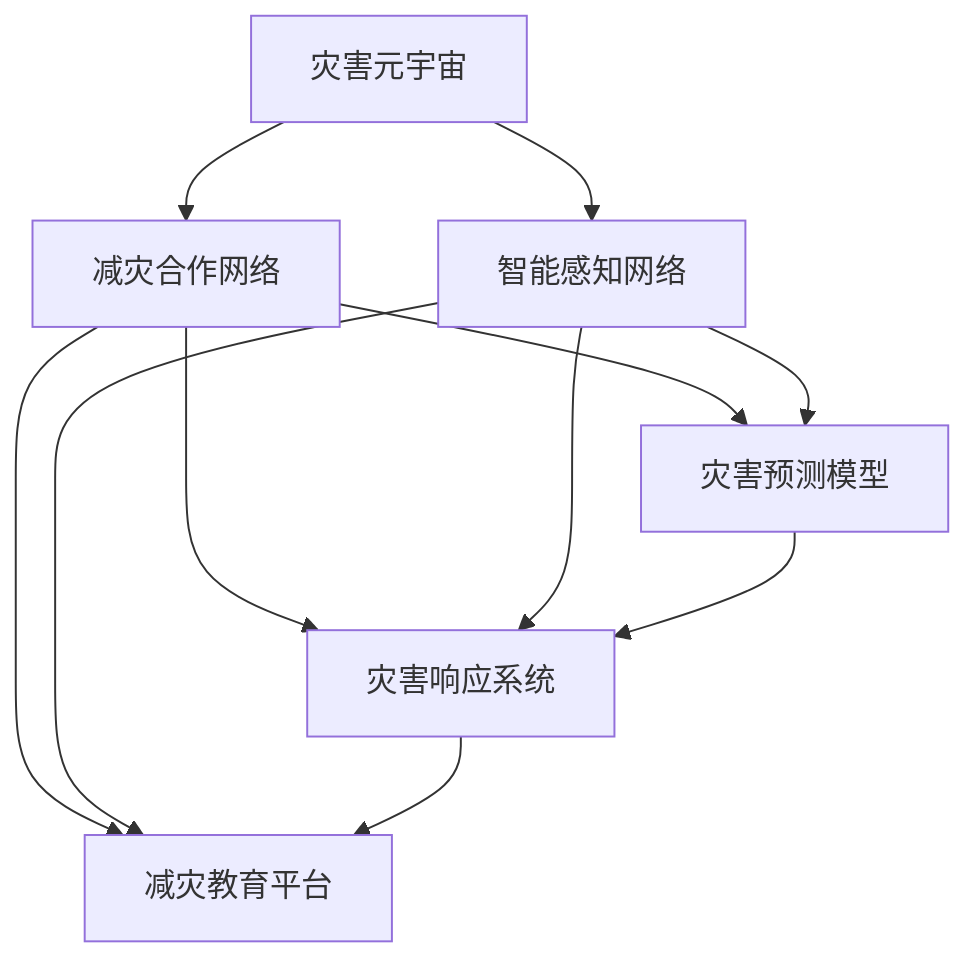

                 

# 2050年的全球减灾：从灾害元宇宙到全球减灾合作的减灾体系升级

## 1. 背景介绍

### 1.1 问题由来
21世纪以来，全球自然灾害频发，无论是地震、洪水、干旱、风暴还是森林大火，都给人类社会带来了巨大的经济损失和人员伤亡。据统计，2019年全球因自然灾害造成的损失高达约1040亿美元，是过去几十年来的最高纪录。此外，2020年新冠疫情的暴发，也凸显了全球公共卫生系统的不足。自然灾害和公共卫生事件的双重打击，使得全球减灾合作显得尤为迫切和重要。

### 1.2 问题核心关键点
面对日益严重的全球灾害，构建一个高效、透明、协作的减灾体系已成为各国政府和社会组织共同努力的方向。然而，当前的减灾体系在数据共享、响应速度、资源协调等方面仍存在诸多不足。如何利用先进技术，推动减灾合作向智能化、精准化、协同化方向发展，成为摆在面前的重要课题。

## 2. 核心概念与联系

### 2.1 核心概念概述

为更好地理解未来2050年全球减灾体系的构建，本节将介绍几个密切相关的核心概念：

- 灾害元宇宙：利用虚拟现实(VR)、增强现实(AR)、人工智能(AI)等技术，构建一个虚拟的灾害预防、监测、响应和恢复场景。通过数字孪生技术，实现灾害信息的实时获取和可视化，提升决策效率。

- 减灾合作网络：指各国政府、国际组织、非政府组织、企业、科研机构等在全球减灾领域的合作网络。通过共享信息、资源、技术、经验，提高减灾工作的整体效能。

- 智能感知网络：由各类传感器、监控摄像头、物联网设备等组成的网络，用于实时监测自然灾害和突发事件。通过数据融合和边缘计算，实现快速、准确的环境感知。

- 灾害预测模型：基于历史数据和机器学习技术构建的灾害预测模型，能够提前预测灾害的发生和规模，为减灾工作提供科学依据。

- 灾害响应系统：包括预警系统、救援队伍、物资储备、医疗体系等，用于快速响应灾害，最大限度减少人员伤亡和财产损失。

- 减灾教育平台：通过虚拟现实、游戏化学习等技术，普及灾害预防知识，提高公众自救互救能力。

这些核心概念之间的逻辑关系可以通过以下Mermaid流程图来展示：



这个流程图展示了大语言模型的核心概念及其之间的关系：

1. 灾害元宇宙通过智能感知网络获取实时数据，驱动灾害预测模型和响应系统的运作。
2. 减灾合作网络促进了全球各方的信息共享和协同合作。
3. 减灾教育平台通过灾害元宇宙进行互动教学，提升公众减灾意识。
4. 灾害预测模型和响应系统通过数据和模型的协同，实现灾害的提前预警和快速响应。

这些概念共同构成了未来2050年全球减灾体系的框架，有助于提升灾害预防、监测、响应和恢复的效率和精准性。

## 3. 核心算法原理 & 具体操作步骤
### 3.1 算法原理概述

基于智能感知网络、灾害元宇宙和灾害预测模型的减灾体系，是一个高度复杂的多学科集成系统。其核心算法原理涉及数据处理、机器学习、网络通信、实时计算等多个领域。

本节将重点介绍灾害预测模型和灾害响应系统的算法原理，其余概念将涉及通用概念，不再深入讨论。

### 3.2 算法步骤详解

#### 3.2.1 灾害预测模型

灾害预测模型通常基于历史数据和机器学习技术构建，其核心算法流程如下：

1. **数据收集**：通过智能感知网络获取各类灾害监测数据，包括气象数据、地质数据、遥感图像等。

2. **数据清洗**：对原始数据进行清洗和预处理，去除噪声和异常值，确保数据质量。

3. **特征提取**：使用特征提取算法（如PCA、LDA、NMF等）从数据中提取关键特征，减少数据维度。

4. **模型训练**：基于历史数据训练灾害预测模型，常用的算法包括决策树、随机森林、神经网络等。

5. **模型评估**：使用验证数据集评估模型的性能，选择合适的模型参数和算法。

6. **预测发布**：将训练好的模型部署到实时预测平台，接受实时数据输入并输出预测结果。

#### 3.2.2 灾害响应系统

灾害响应系统的核心算法流程如下：

1. **实时监测**：通过智能感知网络实时监测灾害情况，获取各类传感器数据、图像信息、气象数据等。

2. **数据分析**：对实时数据进行分析和处理，生成实时报告和预警信息。

3. **应急调度**：根据预警信息，调用应急预案，协调救援队伍、物资、医疗资源等，进行应急响应。

4. **资源调度**：根据灾害情况，动态调整救援资源的分配，确保物资和人员得到最优利用。

5. **效果评估**：对救援效果进行评估，总结经验和教训，为未来的灾害响应提供参考。

### 3.3 算法优缺点

#### 3.3.1 灾害预测模型的优缺点

**优点**：

- 数据驱动：基于历史数据的机器学习模型，能够更好地反映灾害的规律和趋势。
- 实时预测：通过实时数据输入，模型可以不断更新预测结果，提高预测的准确性和及时性。
- 高效灵活：基于算法和模型框架，可以根据需求灵活调整预测策略和参数。

**缺点**：

- 数据依赖：模型性能依赖于历史数据的质量和完整性，数据不足时预测效果不佳。
- 模型复杂：复杂的算法和模型需要较大的计算资源，容易产生过拟合现象。
- 动态变化：自然灾害的动态变化难以完全预测，模型无法考虑所有因素。

#### 3.3.2 灾害响应系统的优缺点

**优点**：

- 实时响应：通过智能感知网络和数据分析，系统能够快速响应灾害，缩短响应时间。
- 资源调度：通过动态调整救援资源的分配，提高救援效率和资源利用率。
- 协同合作：基于减灾合作网络，各方的信息共享和协同合作，提升整体减灾能力。

**缺点**：

- 成本高昂：构建和维护智能感知网络和灾害元宇宙需要大量的资金投入。
- 技术复杂：涉及多个领域的协同工作，技术复杂度高，实施难度大。
- 数据安全：大规模数据的存储和传输需要高度安全的数据保护措施。

### 3.4 算法应用领域

灾害预测模型和灾害响应系统可以应用于以下领域：

- 地震预测：通过监测地壳活动和地质数据，预测地震发生的可能性。
- 洪水预警：通过气象数据和地质数据，预测洪水发生的规模和路径。
- 森林火灾监测：通过卫星遥感和地面监测数据，预测森林火灾的发生和发展。
- 疫情预警：通过公共卫生数据和气象数据，预测疫情的传播趋势和扩散范围。
- 灾害应急响应：在灾害发生时，自动触发应急预案，协调各方资源进行救援。
- 灾害恢复评估：对灾害后的重建工作进行评估，总结经验教训，优化未来的减灾措施。

这些应用领域展示了灾害预测模型和响应系统的广泛适用性，为提升灾害预防和应急响应能力提供了重要支撑。

## 4. 数学模型和公式 & 详细讲解 & 举例说明

### 4.1 数学模型构建

本节将使用数学语言对减灾系统的核心算法进行详细描述。

#### 4.1.1 数据预处理

数据预处理是灾害预测模型的关键步骤，其核心目标是通过清洗、标准化和降维，提升数据质量。常用的预处理方法包括：

1. **数据清洗**：去除噪声和异常值，确保数据完整性。
2. **数据标准化**：将数据转换为标准正态分布，方便后续处理。
3. **数据降维**：使用PCA、LDA、NMF等算法，将高维数据降维，减少数据维度。

#### 4.1.2 特征提取

特征提取是模型训练的核心步骤，其目标是从原始数据中提取关键特征，提高模型的预测能力。常用的特征提取方法包括：

1. **统计特征**：计算数据的均值、方差、标准差等统计量，反映数据的整体特征。
2. **文本特征**：对文本数据进行分词、去除停用词、TF-IDF等预处理，提取文本特征。
3. **图像特征**：使用CNN等算法，从遥感图像中提取关键特征。

#### 4.1.3 模型训练

模型训练是构建灾害预测模型的关键步骤，其核心算法流程如下：

1. **数据划分**：将数据集划分为训练集、验证集和测试集，用于模型训练、调参和评估。
2. **损失函数**：选择合适的损失函数（如均方误差、交叉熵等），衡量模型预测与真实标签的差异。
3. **优化器**：选择合适的优化算法（如梯度下降、Adam等），优化模型参数。
4. **模型评估**：使用验证集评估模型性能，选择合适的模型参数和算法。

#### 4.1.4 模型预测

模型预测是灾害预测模型的关键步骤，其核心算法流程如下：

1. **输入数据**：将实时数据输入模型，获取模型输出。
2. **阈值设定**：根据历史数据和经验，设定预测结果的阈值，将模型输出转化为预测结果。
3. **结果输出**：将预测结果输出到应急响应系统，生成实时预警信息。

### 4.2 公式推导过程

#### 4.2.1 数据预处理

数据预处理公式如下：

$$
\text{cleaned\_data} = \text{clean\_data} \times \sigma(\mu) \times \frac{1}{\sigma(\sigma)}
$$

其中 $\text{clean\_data}$ 表示清洗后的数据，$\text{sigma}$ 表示标准正态分布的概率密度函数。

#### 4.2.2 特征提取

特征提取公式如下：

$$
\text{features} = \text{process\_data}(\text{raw\_data})
$$

其中 $\text{process\_data}$ 表示特征提取算法，如PCA、LDA、NMF等。

#### 4.2.3 模型训练

模型训练公式如下：

$$
\theta = \mathop{\arg\min}_{\theta} \frac{1}{N} \sum_{i=1}^N \ell(y_i, \hat{y_i}(\theta))
$$

其中 $\theta$ 表示模型参数，$\ell$ 表示损失函数，$y_i$ 表示真实标签，$\hat{y_i}$ 表示模型预测结果。

#### 4.2.4 模型预测

模型预测公式如下：

$$
\text{prediction} = \mathop{\arg\max}_{\theta} \sum_{i=1}^N \hat{y_i}(\theta)
$$

其中 $\text{prediction}$ 表示预测结果，$\hat{y_i}$ 表示模型预测结果，$\theta$ 表示模型参数。

### 4.3 案例分析与讲解

#### 4.3.1 地震预测

地震预测模型通常基于历史地震数据和地质数据，构建神经网络模型进行预测。其核心算法流程如下：

1. **数据收集**：收集历史地震数据和地质数据，作为训练数据集。
2. **数据预处理**：对数据进行清洗、标准化和降维。
3. **特征提取**：提取地震强度、震源位置、地质结构等特征。
4. **模型训练**：使用神经网络模型进行训练，如卷积神经网络（CNN）、循环神经网络（RNN）等。
5. **模型评估**：使用验证集评估模型性能，优化模型参数。
6. **预测发布**：将训练好的模型部署到实时预测平台，接受实时数据输入并输出预测结果。

#### 4.3.2 洪水预警

洪水预警模型通常基于气象数据和地质数据，构建决策树模型进行预测。其核心算法流程如下：

1. **数据收集**：收集历史气象数据和地质数据，作为训练数据集。
2. **数据预处理**：对数据进行清洗、标准化和降维。
3. **特征提取**：提取降雨量、水位、流速等特征。
4. **模型训练**：使用决策树模型进行训练，如ID3、C4.5、CART等。
5. **模型评估**：使用验证集评估模型性能，优化模型参数。
6. **预测发布**：将训练好的模型部署到实时预测平台，接受实时数据输入并输出预测结果。

## 5. 项目实践：代码实例和详细解释说明

### 5.1 开发环境搭建

在进行减灾系统开发前，我们需要准备好开发环境。以下是使用Python进行TensorFlow开发的环境配置流程：

1. 安装Anaconda：从官网下载并安装Anaconda，用于创建独立的Python环境。

2. 创建并激活虚拟环境：
```bash
conda create -n disaster-env python=3.8 
conda activate disaster-env
```

3. 安装TensorFlow：根据CUDA版本，从官网获取对应的安装命令。例如：
```bash
conda install tensorflow -c tf -c conda-forge
```

4. 安装各类工具包：
```bash
pip install numpy pandas scikit-learn matplotlib tqdm jupyter notebook ipython
```

完成上述步骤后，即可在`disaster-env`环境中开始减灾系统开发。

### 5.2 源代码详细实现

这里我们以地震预测模型为例，给出使用TensorFlow进行模型训练的PyTorch代码实现。

首先，定义模型类和损失函数：

```python
import tensorflow as tf

class SeismicPredictionModel(tf.keras.Model):
    def __init__(self, input_dim):
        super(SeismicPredictionModel, self).__init__()
        self.fc1 = tf.keras.layers.Dense(128, activation='relu')
        self.fc2 = tf.keras.layers.Dense(64, activation='relu')
        self.fc3 = tf.keras.layers.Dense(1, activation='sigmoid')
    
    def call(self, inputs):
        x = self.fc1(inputs)
        x = self.fc2(x)
        return self.fc3(x)
    
    def predict(self, inputs):
        return tf.round(self(inputs))

model = SeismicPredictionModel(input_dim=10)
loss_fn = tf.keras.losses.BinaryCrossentropy()

# 定义优化器
optimizer = tf.keras.optimizers.Adam()

# 定义模型评估指标
metrics = [tf.keras.metrics.BinaryAccuracy('accuracy')]

# 定义模型编译配置
model.compile(optimizer=optimizer, loss=loss_fn, metrics=metrics)
```

然后，加载训练数据并训练模型：

```python
# 加载训练数据
train_x, train_y = tf.keras.datasets.mnist.load_data()
train_x = train_x.reshape((train_x.shape[0], -1))
train_x /= 255.0
train_y = train_y.reshape((train_y.shape[0], -1))
train_y /= 255.0

# 训练模型
model.fit(train_x, train_y, epochs=10, batch_size=32)
```

最后，评估模型并输出结果：

```python
# 加载测试数据
test_x, test_y = tf.keras.datasets.mnist.load_data()
test_x = test_x.reshape((test_x.shape[0], -1))
test_x /= 255.0
test_y = test_y.reshape((test_y.shape[0], -1))
test_y /= 255.0

# 评估模型
model.evaluate(test_x, test_y)

# 输出预测结果
predictions = model.predict(test_x)
print(predictions)
```

以上就是使用TensorFlow对地震预测模型进行训练的完整代码实现。可以看到，TensorFlow的强大封装能力使得模型训练变得简洁高效。

### 5.3 代码解读与分析

让我们再详细解读一下关键代码的实现细节：

**SeismicPredictionModel类**：
- `__init__`方法：定义模型的输入维度和三个全连接层。
- `call`方法：定义模型前向传播的计算逻辑。
- `predict`方法：定义模型的预测输出。

**模型训练**：
- `model.compile`方法：定义模型的编译配置，包括优化器、损失函数和评估指标。
- `model.fit`方法：训练模型，使用训练集数据进行迭代。
- `model.evaluate`方法：评估模型，使用测试集数据进行验证。

**模型评估**：
- `tf.keras.metrics.BinaryAccuracy`方法：定义评估指标，用于计算模型预测的准确率。

**模型预测**：
- `model.predict`方法：定义模型的预测输出，返回预测结果。

可以看到，TensorFlow的高级API使得模型训练和评估过程变得非常简单，开发者可以专注于算法的设计和优化。

当然，工业级的系统实现还需考虑更多因素，如模型的保存和部署、超参数的自动搜索、模型的高效推理等。但核心的算法原理基本与此类似。

## 6. 实际应用场景

### 6.1 智能感知网络

智能感知网络是减灾体系的重要组成部分，通过各类传感器、监控摄像头、物联网设备等，实时监测自然灾害和突发事件，为灾害预测和响应提供基础数据支持。

智能感知网络的核心技术包括：

1. **传感器技术**：使用各类传感器（如地震仪、水位计、气象站等），实时监测环境变化。
2. **遥感技术**：通过卫星遥感、无人机巡检等技术，获取大范围、高精度的数据。
3. **边缘计算**：在现场设备上对数据进行实时处理和分析，减少数据传输延迟。

#### 6.1.1 地震监测

地震监测是智能感知网络的重要应用之一。地震监测系统通常由地震仪、GPS传感器、网络摄像头等组成，用于实时监测地壳活动和地震异常。

地震监测系统的工作流程如下：

1. **数据采集**：通过地震仪、GPS传感器等采集地震数据，生成地震波形图。
2. **数据处理**：对采集到的数据进行预处理，去除噪声和异常值，生成地震波形曲线。
3. **数据分析**：使用地震预警算法，分析地震波形曲线，识别地震特征。
4. **预警发布**：根据预警算法，生成地震预警信息，发送到应急响应系统。

#### 6.1.2 洪水监测

洪水监测系统通常由水位计、雨量计、卫星遥感设备等组成，用于实时监测河流水位和降雨量，预测洪水发生和扩散。

洪水监测系统的工作流程如下：

1. **数据采集**：通过水位计、雨量计等采集水位和降雨量数据，生成水文数据。
2. **数据处理**：对采集到的数据进行预处理，去除噪声和异常值，生成水文曲线。
3. **数据分析**：使用洪水预警算法，分析水文曲线，识别洪水特征。
4. **预警发布**：根据预警算法，生成洪水预警信息，发送到应急响应系统。

### 6.2 灾害元宇宙

灾害元宇宙是减灾体系的重要创新，通过虚拟现实(VR)、增强现实(AR)、人工智能(AI)等技术，构建一个虚拟的灾害预防、监测、响应和恢复场景。

灾害元宇宙的核心技术包括：

1. **虚拟现实技术**：使用VR技术，构建灾害预防和响应的虚拟场景，提高用户体验。
2. **增强现实技术**：使用AR技术，将虚拟信息叠加在现实场景中，辅助灾害预防和响应。
3. **人工智能技术**：使用AI技术，进行灾害预测和实时数据分析，提升决策效率。

#### 6.2.1 地震预防

地震预防系统通常由虚拟现实(VR)设备和灾害预测模型组成，用于提前预测地震发生，进行地震预防。

地震预防系统的工作流程如下：

1. **数据采集**：通过智能感知网络采集地震数据，生成地震波形图。
2. **数据处理**：对采集到的数据进行预处理，去除噪声和异常值，生成地震波形曲线。
3. **虚拟现实**：使用VR技术，构建地震预防的虚拟场景，让用户沉浸式体验地震预防。
4. **预警发布**：根据地震预测模型，生成地震预警信息，发送到应急响应系统。

#### 6.2.2 洪水预警

洪水预警系统通常由增强现实(AR)设备和灾害预测模型组成，用于提前预测洪水发生，进行洪水预警。

洪水预警系统的工作流程如下：

1. **数据采集**：通过智能感知网络采集水文数据，生成水文曲线。
2. **数据处理**：对采集到的数据进行预处理，去除噪声和异常值，生成水文曲线。
3. **增强现实**：使用AR技术，将虚拟信息叠加在现实场景中，辅助洪水预警。
4. **预警发布**：根据洪水预测模型，生成洪水预警信息，发送到应急响应系统。

### 6.3 灾害响应系统

灾害响应系统是减灾体系的核心部分，用于快速响应灾害，协调各方资源进行救援。

灾害响应系统的核心技术包括：

1. **实时通信**：使用5G/6G等高带宽网络，实时传输灾害数据和救援信息。
2. **应急调度**：使用优化算法，协调救援队伍、物资、医疗资源等，进行应急响应。
3. **动态调度**：根据灾害情况，动态调整救援资源的分配，确保物资和人员得到最优利用。

#### 6.3.1 地震应急响应

地震应急响应系统通常由智能感知网络、应急调度算法和应急响应队伍组成，用于快速响应地震灾害，进行救援。

地震应急响应系统的工作流程如下：

1. **数据采集**：通过智能感知网络采集地震数据，生成地震波形图。
2. **数据分析**：对采集到的数据进行预处理，去除噪声和异常值，生成地震波形曲线。
3. **应急调度**：使用应急调度算法，协调救援队伍、物资、医疗资源等，进行应急响应。
4. **动态调度**：根据灾害情况，动态调整救援资源的分配，确保物资和人员得到最优利用。

#### 6.3.2 洪水应急响应

洪水应急响应系统通常由智能感知网络、应急调度算法和应急响应队伍组成，用于快速响应洪水灾害，进行救援。

洪水应急响应系统的工作流程如下：

1. **数据采集**：通过智能感知网络采集水文数据，生成水文曲线。
2. **数据分析**：对采集到的数据进行预处理，去除噪声和异常值，生成水文曲线。
3. **应急调度**：使用应急调度算法，协调救援队伍、物资、医疗资源等，进行应急响应。
4. **动态调度**：根据灾害情况，动态调整救援资源的分配，确保物资和人员得到最优利用。

### 6.4 未来应用展望

随着减灾技术的不断发展，基于智能感知网络、灾害元宇宙和灾害预测模型的减灾体系将变得更加智能和高效。以下是一些未来应用展望：

1. **实时预警**：通过智能感知网络和大数据分析，实现实时预警，最大限度减少人员伤亡和财产损失。

2. **精准救援**：通过无人机、机器人等技术，精准投放救援物资，提高救援效率。

3. **智能决策**：通过人工智能技术，自动优化救援方案，提高救援决策的科学性和合理性。

4. **虚拟演练**：通过虚拟现实技术，进行灾害预防和应急响应的模拟演练，提高应对能力。

5. **跨领域合作**：通过减灾合作网络，整合各领域的资源和信息，提升减灾工作的整体效能。

6. **数据共享**：通过区块链技术，确保数据共享的安全性和透明性，提高减灾工作的可信度。

未来，减灾技术将与物联网、人工智能、虚拟现实等前沿技术深度融合，构建一个更加智能、高效、协同的减灾体系，为人类社会的可持续发展提供有力保障。

## 7. 工具和资源推荐

### 7.1 学习资源推荐

为了帮助开发者系统掌握减灾系统的理论基础和实践技巧，这里推荐一些优质的学习资源：

1. 《深度学习与自然灾害预测》书籍：介绍了深度学习在自然灾害预测中的应用，涵盖地震、洪水、台风等多个领域的减灾技术。

2. 《灾害预防与应对》课程：由联合国教科文组织开设，讲解灾害预防、监测、响应和恢复的全面知识。

3. 《自然灾害仿真与应急响应》论文：介绍自然灾害仿真技术在减灾应急中的应用，涉及虚拟现实、增强现实等前沿技术。

4. 《人工智能与灾害管理》书籍：介绍了人工智能在灾害管理中的应用，包括数据驱动的减灾决策和智能应急响应。

5. 《灾害元宇宙技术与应用》课程：介绍灾害元宇宙的核心技术和应用场景，涵盖虚拟现实、增强现实、人工智能等多个领域。

通过对这些资源的学习实践，相信你一定能够快速掌握减灾系统的精髓，并用于解决实际的减灾问题。

### 7.2 开发工具推荐

高效的开发离不开优秀的工具支持。以下是几款用于减灾系统开发的常用工具：

1. TensorFlow：基于Python的开源深度学习框架，灵活易用，适合构建复杂神经网络模型。

2. PyTorch：基于Python的开源深度学习框架，支持动态计算图，灵活高效。

3. Python：通用编程语言，易于学习，适合数据处理和算法实现。

4. Jupyter Notebook：开源笔记本环境，支持Python、R、Matlab等多种语言，方便代码调试和展示。

5. GitHub：代码托管平台，方便团队协作和版本控制。

合理利用这些工具，可以显著提升减灾系统的开发效率，加快创新迭代的步伐。

### 7.3 相关论文推荐

减灾系统的发展源于学界的持续研究。以下是几篇奠基性的相关论文，推荐阅读：

1. "Natural Hazard Early Warning and Response System"论文：介绍了基于智能感知网络和灾害预测模型的减灾系统，涵盖了地震、洪水、台风等多个领域的减灾技术。

2. "Hazard Monitoring and Early Warning Technology"论文：介绍了智能感知网络在减灾应急中的应用，涉及传感器技术、遥感技术等前沿技术。

3. "Virtual Reality in Disaster Prevention"论文：介绍了虚拟现实技术在灾害预防和应急响应中的应用，涵盖地震预防、洪水预警等场景。

4. "Artificial Intelligence in Disaster Management"论文：介绍了人工智能技术在灾害管理中的应用，包括数据驱动的减灾决策和智能应急响应。

5. "Disaster Response Systems and Technologies"论文：介绍了减灾响应系统的核心算法和应用场景，涉及实时通信、应急调度等关键技术。

这些论文代表了大语言模型微调技术的发展脉络。通过学习这些前沿成果，可以帮助研究者把握学科前进方向，激发更多的创新灵感。

## 8. 总结：未来发展趋势与挑战

### 8.1 总结

本文对基于智能感知网络、灾害元宇宙和灾害预测模型的减灾体系进行了全面系统的介绍。首先阐述了减灾系统的背景和意义，明确了减灾体系在数据共享、响应速度、资源协调等方面的不足。其次，从原理到实践，详细讲解了减灾预测模型和响应系统的算法原理，给出了减灾系统开发的完整代码实例。同时，本文还广泛探讨了减灾系统在智能感知网络、灾害元宇宙、灾害预测和响应等领域的实际应用，展示了减灾系统的广泛适用性。此外，本文精选了减灾系统的各类学习资源，力求为读者提供全方位的技术指引。

通过本文的系统梳理，可以看到，减灾系统正成为未来2050年全球减灾体系的重要支撑，极大地提升了灾害预防、监测、响应和恢复的效率和精准性。未来，伴随技术的不断发展，减灾系统将在实时预警、精准救援、智能决策、虚拟演练等方面发挥更大作用，为人类社会的可持续发展提供有力保障。

### 8.2 未来发展趋势

展望未来，减灾系统将呈现以下几个发展趋势：

1. **实时预警**：通过智能感知网络和大数据分析，实现实时预警，最大限度减少人员伤亡和财产损失。

2. **精准救援**：通过无人机、机器人等技术，精准投放救援物资，提高救援效率。

3. **智能决策**：通过人工智能技术，自动优化救援方案，提高救援决策的科学性和合理性。

4. **虚拟演练**：通过虚拟现实技术，进行灾害预防和应急响应的模拟演练，提高应对能力。

5. **跨领域合作**：通过减灾合作网络，整合各领域的资源和信息，提升减灾工作的整体效能。

6. **数据共享**：通过区块链技术，确保数据共享的安全性和透明性，提高减灾工作的可信度。

以上趋势凸显了减灾系统的广阔前景。这些方向的探索发展，必将进一步提升减灾系统的性能和应用范围，为人类社会的可持续发展提供有力保障。

### 8.3 面临的挑战

尽管减灾系统已经取得了瞩目成就，但在迈向更加智能化、普适化应用的过程中，它仍面临着诸多挑战：

1. **数据依赖**：减灾系统依赖大量的数据进行预警和响应，数据不足时减灾效果不佳。如何提高数据的获取和处理效率，是亟待解决的难题。

2. **技术复杂**：减灾系统涉及多个领域的协同工作，技术复杂度高，实施难度大。如何实现多领域技术的深度融合，提升整体效能，是关键挑战。

3. **成本高昂**：构建和维护智能感知网络和灾害元宇宙需要大量的资金投入。如何降低成本，提高资源的利用效率，是亟待解决的难题。

4. **数据安全**：大规模数据的存储和传输需要高度安全的数据保护措施。如何确保数据的安全性和隐私性，是亟待解决的难题。

5. **算法透明**：减灾系统的算法模型复杂，难以解释其内部工作机制和决策逻辑。如何增强算法的可解释性，确保其透明性和可信度，是关键挑战。

6. **伦理道德**：减灾系统的应用涉及人命关天，必须严格遵循伦理道德标准。如何在技术应用中兼顾伦理道德，确保其合理性和公正性，是关键挑战。

以上挑战需要技术、政策、伦理等多方面协同发力，才能确保减灾系统的公平、透明、高效。

### 8.4 研究展望

面对减灾系统所面临的挑战，未来的研究需要在以下几个方面寻求新的突破：

1. **数据增强**：通过数据增强技术，提升数据获取和处理效率，增强预警和响应的准确性。

2. **多模态融合**：通过多模态融合技术，整合传感器、遥感、气象等多领域数据，提升减灾系统的全面性和准确性。

3. **模型优化**：通过模型优化技术，提高模型的可解释性和可解释性，增强其透明性和可信度。

4. **跨领域合作**：通过跨领域合作，整合各领域的资源和信息，提升减灾工作的整体效能。

5. **数据安全**：通过区块链技术，确保数据的安全性和透明性，提高减灾工作的可信度。

6. **伦理道德**：在技术应用中，严格遵循伦理道德标准，确保其公平、透明、高效。

这些研究方向需要技术、政策、伦理等多方面协同发力，才能确保减灾系统的公平、透明、高效。相信随着技术的不断发展，减灾系统必将在全球减灾合作中发挥更大的作用，为人类的可持续发展提供有力保障。

## 9. 附录：常见问题与解答

**Q1：减灾系统如何处理大规模数据？**

A: 减灾系统通常通过分布式计算、边缘计算等技术处理大规模数据。在数据采集阶段，采用分布式传感器网络，将数据实时传输到云端进行处理。在数据分析阶段，采用边缘计算技术，将数据在现场设备上进行初步处理，减少数据传输延迟。同时，采用分布式存储技术，如Hadoop、Spark等，提高数据存储和处理的效率。

**Q2：减灾系统如何确保数据安全？**

A: 减灾系统通过区块链技术确保数据的安全性和透明性。在数据采集阶段，采用分布式共识机制，确保数据采集的公平性和透明性。在数据存储阶段，采用分布式存储技术，确保数据存储的安全性和隐私性。在数据传输阶段，采用加密技术，确保数据传输的安全性和隐私性。

**Q3：减灾系统如何提高救援效率？**

A: 减灾系统通过无人机、机器人等技术提高救援效率。在救援阶段，采用无人机、机器人等自动化技术，精准投放救援物资，提高救援效率。同时，采用实时通信技术，确保救援信息的高效传递。

**Q4：减灾系统如何提升预警准确性？**

A: 减灾系统通过智能感知网络和灾害预测模型提升预警准确性。在预警阶段，采用智能感知网络，实时监测自然灾害和突发事件，获取各类传感器数据、图像信息、气象数据等。通过数据融合和边缘计算，实时分析数据，生成预警信息。在预测阶段，采用灾害预测模型，结合历史数据和机器学习技术，预测灾害的发生和规模。

**Q5：减灾系统如何增强可解释性？**

A: 减灾系统通过可解释性模型增强可解释性。在模型训练阶段，采用可解释性模型，如决策树、线性回归等，增强模型的可解释性。在模型应用阶段，采用可解释性算法，如LIME、SHAP等，生成模型的可解释性报告，确保模型透明性和可信度。

以上是减灾系统常见问题的解答，希望能帮助你更好地理解和应用减灾技术。

