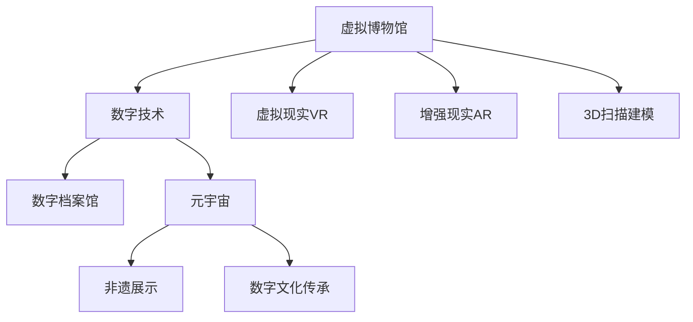

                 

# 2050年的数字文化：从虚拟博物馆到元宇宙非遗展示的数字文化传承

> 关键词：元宇宙,非遗展示,数字文化传承,虚拟博物馆,数字技术

## 1. 背景介绍

### 1.1 问题由来
随着信息技术的高速发展，数字技术已经深刻改变了我们的生活。从在线购物到在线教育，从远程办公到虚拟旅游，数字技术无处不在。然而，在数字化浪潮中，我们的文化遗产保护与传承也面临着前所未有的挑战。

首先，由于城市化进程的加速，许多历史建筑和文物古迹面临拆除的风险。其次，文化传承往往依赖于口耳相传，容易随着时代的变迁而消亡。此外，全球化趋势导致地方特色文化的衰退，很多传统手工艺和文化习俗逐渐被遗忘。

### 1.2 问题核心关键点
为了应对这些挑战，人们开始探索利用数字技术保护和传承文化遗产的新路径。其中，虚拟博物馆、数字档案馆、元宇宙非遗展示等数字文化项目成为了重要探索方向。这些项目利用高精度的3D扫描、数字建模、虚拟现实、增强现实等技术，让文化资源以数字化的形式得以永存，并打破时空限制，实现跨地域、跨时代的文化交流。

## 2. 核心概念与联系

### 2.1 核心概念概述

为更好地理解元宇宙非遗展示等数字文化项目的实现原理和技术栈，本节将介绍几个核心概念及其相互联系：

- **虚拟博物馆**：指通过数字技术对真实博物馆进行虚拟重建，用户可以在虚拟空间中自由探索、互动体验，感受博物馆的魅力。
- **数字档案馆**：利用数字技术将纸质档案、古籍、照片等转换为数字格式，便于存储、检索、展示。
- **元宇宙**：一个虚拟与现实交织的全新数字空间，用户可以在其中创建、互动、社交、工作等，实现全新的生活和工作方式。
- **非遗展示**：指利用数字技术将非物质文化遗产(Non-Material Intangible Cultural Heritage, NICH)数字化展示，让更多人了解和传承。
- **数字文化传承**：通过数字技术实现文化资源的数字化保护、共享和传承，让文化遗产活起来。

这些概念之间的逻辑关系可以通过以下Mermaid流程图来展示：



这个流程图展示了虚拟博物馆、数字档案馆、元宇宙非遗展示等数字文化项目的实现路径：

1. 虚拟博物馆通过3D扫描建模、虚拟现实和增强现实等技术实现。
2. 数字档案馆利用数字技术将纸质档案、古籍、照片等转换为数字格式。
3. 元宇宙为非遗展示提供了一个全新的平台，可以实现虚拟化展示。
4. 数字文化传承依赖于虚拟博物馆、数字档案馆、元宇宙非遗展示等项目的实现，让文化遗产得以永存。

## 3. 核心算法原理 & 具体操作步骤
### 3.1 算法原理概述

元宇宙非遗展示等数字文化项目涉及到多个学科和技术的综合应用，包括但不限于3D扫描、建模、虚拟现实、增强现实、计算机图形学、人工智能等。以下将重点介绍虚拟博物馆和元宇宙非遗展示的核心算法原理和具体操作步骤。

### 3.2 算法步骤详解

**虚拟博物馆的实现步骤**：

1. **3D扫描建模**：
   - 使用高精度激光扫描设备对博物馆展品进行扫描，生成点云数据。
   - 对点云数据进行滤波、分割、拼接，生成完整的3D模型。
   - 对3D模型进行细节修正和纹理贴图，生成高精度的模型。

2. **虚拟现实(VR)和增强现实(AR)**：
   - 在虚拟现实中，利用Unity或Unreal Engine等引擎，构建虚拟博物馆环境，实现360度自由漫游。
   - 在增强现实中，将虚拟模型与真实场景叠加，使用AR技术实现互动展示。

3. **用户交互设计**：
   - 设计合理的用户交互界面，如触摸屏、手势控制等，增强用户体验。
   - 添加互动元素，如点击展品展示详细信息、视频播放、虚拟导览等。

4. **数据存储与传输**：
   - 将3D模型和VR/AR应用压缩打包，存储在云端服务器中。
   - 利用5G等高速网络技术，实现低延迟、高带宽的数据传输。

**元宇宙非遗展示的实现步骤**：

1. **非遗数字化**：
   - 使用高分辨率相机、3D扫描仪等设备，对非遗物品进行数字化采集。
   - 对数字化数据进行处理，包括去噪、归一化、压缩等。

2. **数字模型构建**：
   - 将数字化数据转化为数字模型，使用3D建模软件进行修正和优化。
   - 添加纹理、光照、材质等，提高模型的真实感。

3. **虚拟环境构建**：
   - 在元宇宙平台（如Decentraland、Sandbox等）上创建虚拟世界。
   - 添加虚拟展馆、非遗展示区、互动元素等。

4. **用户交互设计**：
   - 设计友好的用户界面，支持用户登录、浏览、交互。
   - 添加互动元素，如点击展示详细信息、虚拟体验、交互式教学等。

5. **数据存储与传输**：
   - 将数字模型和虚拟环境打包，存储在分布式服务器中。
   - 利用区块链技术，实现数据的去中心化和不可篡改性。

### 3.3 算法优缺点

虚拟博物馆和元宇宙非遗展示等数字文化项目具有以下优点：

1. **高保真度**：数字化技术可以精确还原文物细节，保留真实展品的原貌。
2. **高互动性**：利用VR/AR技术，用户可以进行互动体验，增强沉浸感。
3. **全球共享**：数字化资源可以随时随地访问，打破地域限制。
4. **高效传播**：通过数字化展示，非遗文化可以跨越国界，传播给全球观众。
5. **长期保存**：数字化技术可以无限期保存文物信息，防止自然损坏。

同时，这些项目也存在以下缺点：

1. **高成本**：数字化采集、建模、存储和传输都需要高昂的成本。
2. **技术复杂性**：涉及多种技术栈，开发和维护难度较大。
3. **版权问题**：数字化文物可能涉及版权问题，需要与原版权方协商解决。
4. **用户接受度**：部分用户对新技术的接受度较低，需要加强宣传教育。

### 3.4 算法应用领域

虚拟博物馆和元宇宙非遗展示等数字文化项目已经在多个领域得到应用，包括但不限于：

1. **文化遗产保护**：数字化采集和存储文物，保护历史文化遗产。
2. **教育培训**：利用虚拟博物馆进行在线教育，增强学生的学习体验。
3. **文化交流**：通过虚拟博物馆和元宇宙平台，实现全球文化交流和合作。
4. **旅游观光**：虚拟博物馆和元宇宙非遗展示成为新型的旅游项目，吸引游客。
5. **历史研究**：利用数字化文物进行历史研究和分析，探索历史真相。

此外，数字化技术还广泛应用于医疗、艺术、工业、农业等多个领域，推动了各行各业的数字化转型。

## 4. 数学模型和公式 & 详细讲解 & 举例说明

### 4.1 数学模型构建

为便于数学建模，本节将虚拟博物馆的3D建模和虚拟现实(VR)、增强现实(AR)等核心算法进行形式化描述。

设虚拟博物馆展品的三维点云数据为$\mathcal{P}$，展品的3D模型为$\mathcal{M}$。利用3D扫描设备，从展品表面采集的点云数据可以表示为：

$$
\mathcal{P} = \{(x_i, y_i, z_i, t_i)\}_{i=1}^N
$$

其中，$(x_i, y_i, z_i)$ 表示第$i$个点的三维坐标，$t_i$ 表示对应点的时间戳。

对于3D模型的构建，可以利用三角剖分法，将点云数据转化为三角网格模型：

$$
\mathcal{M} = \{\triangle_i\}_{i=1}^M
$$

其中，$\triangle_i$ 表示第$i$个三角网格。

### 4.2 公式推导过程

**3D建模过程**：

1. **点云预处理**：
   - 对点云数据进行去噪、滤波、归一化等预处理，去除异常点和噪声点。
   - 使用点云分割算法（如Voronoi图、RANSAC等），将点云数据分割成多个区域。
   - 对分割区域进行拼接，得到完整的3D模型。

2. **三角剖分**：
   - 对拼接后的3D模型进行三角剖分，生成三角网格。
   - 利用Delaunay三角剖分算法，生成最优三角网格。

3. **纹理映射**：
   - 对三角网格进行纹理贴图，生成高精度的3D模型。
   - 利用图像处理技术，对纹理进行压缩和优化。

**虚拟现实(VR)过程**：

1. **虚拟场景构建**：
   - 在虚拟现实平台（如Unity、Unreal Engine等）上，构建虚拟博物馆场景。
   - 添加虚拟展品、背景、灯光等，实现逼真场景。

2. **用户交互设计**：
   - 设计用户交互界面，如触摸屏、手势控制等。
   - 实现用户交互逻辑，如点击展品展示详细信息、视频播放等。

3. **渲染优化**：
   - 对虚拟场景进行渲染优化，提高渲染效率。
   - 利用实时渲染技术，实现低延迟的虚拟体验。

**增强现实(AR)过程**：

1. **环境识别**：
   - 使用摄像头和传感器，对真实环境进行识别和定位。
   - 利用SLAM算法，实时计算用户位置和姿态。

2. **虚拟展示**：
   - 将虚拟展品叠加到真实场景中，实现增强现实展示。
   - 利用AR技术，实现虚拟展品与真实环境的互动。

### 4.3 案例分析与讲解

**案例一：虚拟故宫博物馆**

故宫博物院利用3D扫描技术，对文物展品进行数字化采集，生成高精度的3D模型。利用Unity平台，构建了虚拟故宫博物馆，用户可以通过VR头盔自由漫游，点击展品展示详细信息。该项目在用户中反响热烈，吸引了大量访客。

**案例二：元宇宙非遗展示**

中国国家博物馆利用AR技术，在元宇宙平台Sandbox上创建了虚拟非遗展示区。用户可以通过手机或VR头盔，交互式地体验非遗文化。该项目获得了国家文化部门的高度评价，为文化遗产保护和传承提供了新的方向。

## 5. 项目实践：代码实例和详细解释说明

### 5.1 开发环境搭建

在进行虚拟博物馆和元宇宙非遗展示的开发前，我们需要准备好开发环境。以下是使用Python进行Unity3D开发的环境配置流程：

1. **安装Unity3D**：从官网下载并安装Unity3D，选择匹配操作系统的版本。
2. **安装Visual Studio**：从官网下载并安装Visual Studio，用于开发C#脚本。
3. **安装C#插件**：在Unity3D中安装UnityAR和UnityVR等C#插件，支持AR和VR开发。
4. **安装Python环境**：在开发环境中安装Python，用于处理图像和3D数据。
5. **安装相关库**：在Python环境中安装OpenCV、NumPy、Pillow等库，用于图像处理。

完成上述步骤后，即可在Unity3D中开发虚拟博物馆和元宇宙非遗展示项目。

### 5.2 源代码详细实现

下面我们以虚拟故宫博物馆为例，给出使用Unity3D和C#进行虚拟博物馆开发的代码实现。

首先，定义3D模型加载和渲染函数：

```csharp
using UnityEngine;
using System.Collections;

public class ModelLoader : MonoBehaviour
{
    public GameObject modelPrefab;
    public GameObject modelRoot;
    
    void Start()
    {
        for (int i = 0; i < modelPrefab.transform.childCount; i++)
        {
            var obj = Instantiate(modelPrefab, modelRoot.transform).transform;
            obj.name = "Model" + i;
            obj.transform.position = new Vector3(
                Random.Range(-5, 5),
                Random.Range(-5, 5),
                Random.Range(-5, 5)
            );
        }
    }
}
```

然后，定义用户交互逻辑函数：

```csharp
using UnityEngine;
using UnityEngine.XR;
using UnityEngine.XR.ARFoundation;
using UnityEngine.XR.ARSubsystems;

public class UserInteraction : MonoBehaviour
{
    public GameObject modelPrefab;
    public GameObject modelRoot;
    public ARSessionOrigin arOrigin;
    
    void Update()
    {
        if (ARCameraSubsystem.IsPluggedIn)
        {
            XRSessionState state = ARCameraSubsystem.confi`
    ```

