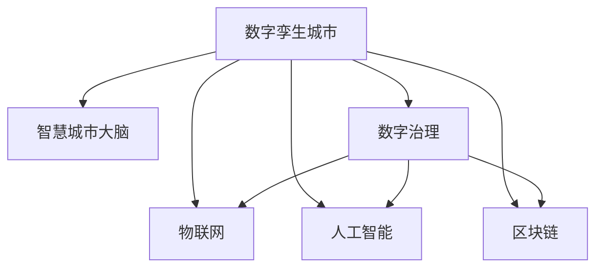

                 

# 2050年的数字治理：从数字孪生城市到智慧城市大脑的数字孪生治理

## 1. 背景介绍

### 1.1 问题由来

进入21世纪以来，数字化转型已经成为全球各行业发展的新趋势。数字治理（Digital Governance）作为数字时代治理新范式，是指通过数字化手段提高政府决策、管理和服务能力，提升公共事务透明度和公信力，促进社会公平与福祉。尤其在当前全球化、信息化、智能化快速发展的背景下，数字治理在解决公共问题、优化资源配置、实现社会福祉等方面发挥着日益重要的作用。

然而，面对日益复杂多变的社会环境和公共需求，传统单一的数字化治理手段已无法满足现代社会的治理需求。数字孪生（Digital Twin）技术的出现，为解决这一问题提供了新的思路。数字孪生城市（Digital Twin City）通过构建虚拟城市模型，实时映射现实世界，实现城市治理的智能化、精细化、预测化。智慧城市大脑（Smart City Brain）则是对数字孪生城市的进一步延伸，集数据融合、知识推理、智能决策于一体，形成城市治理的“中枢神经”。

本文将探讨在2050年，数字孪生城市与智慧城市大脑如何推动数字治理的发展，构建更为安全、高效、智能、透明的治理体系。

## 2. 核心概念与联系

### 2.1 核心概念概述

为更好地理解数字孪生城市和智慧城市大脑的治理逻辑，本节将介绍几个密切相关的核心概念：

- 数字孪生城市（Digital Twin City）：指通过数字孪生技术构建的虚拟城市模型，实时映射现实城市，提供城市治理的智能化、精细化、预测化服务。

- 智慧城市大脑（Smart City Brain）：指基于数字孪生城市的知识推理引擎和智能决策系统，能够实现城市数据的融合、分析和智能决策，是数字孪生城市的“中枢神经”。

- 数字治理（Digital Governance）：指通过数字化手段提高政府决策、管理和服务能力，提升公共事务透明度和公信力，促进社会公平与福祉。

- 数字孪生（Digital Twin）：指通过数字模型实时映射实体对象，实现对其在虚拟世界的精准复制和实时监控。

- 物联网（IoT）：指通过传感器、标签等设备，实现对现实世界各种物理设备的智能连接和数据采集。

- 人工智能（AI）：指利用机器学习、深度学习等技术，使计算机具备类似人类的智能行为和学习能力。

- 区块链（Blockchain）：指通过分布式账本技术，实现数据的安全、透明、可追溯存储和交换。

这些核心概念之间的逻辑关系可以通过以下Mermaid流程图来展示：



这个流程图展示了大语言模型的核心概念及其之间的关系：

1. 数字孪生城市通过物联网、人工智能等技术实现数据的实时采集和处理，为智慧城市大脑提供数据支撑。
2. 智慧城市大脑利用数字治理、区块链等技术对数据进行融合、分析和智能决策，驱动数字孪生城市的管理和服务。
3. 数字治理、物联网、人工智能、区块链等技术共同构建起数字孪生城市与智慧城市大脑的治理框架。

## 3. 核心算法原理 & 具体操作步骤

### 3.1 算法原理概述

数字孪生城市和智慧城市大脑的治理逻辑，本质上是一个基于数据驱动的智能决策过程。其核心思想是：通过物联网等技术采集城市实时数据，经过人工智能模型分析，形成数据驱动的智能决策，并通过智慧城市大脑的执行系统，实现对城市的实时调控和管理。

形式化地，假设城市运行状态为 $s$，智慧城市大脑的决策模型为 $D$，则智慧城市大脑的决策过程可以表示为：

$$
\text{Decision}(D, s) = \mathop{\arg\max}_{d} D(s, d)
$$

其中 $d$ 为城市管理方案，$D(s, d)$ 为基于城市运行状态 $s$ 和方案 $d$ 的智能决策函数。通过优化决策函数，使得智能决策符合社会福祉最大化原则。

### 3.2 算法步骤详解

基于数据驱动的智能决策，数字孪生城市和智慧城市大脑的治理逻辑主要包括以下几个关键步骤：

**Step 1: 数据采集与处理**

- 通过物联网技术，采集城市各个层面的实时数据，如交通流量、气象数据、环境污染指数、公共设施状态等。
- 将采集到的数据进行清洗和处理，形成结构化的数据集。

**Step 2: 数据融合与分析**

- 利用人工智能模型对结构化数据进行融合和分析，提取城市运行状态 $s$。
- 利用机器学习、深度学习等算法，对城市运行状态进行分析和预测，提取关键特征和规律。

**Step 3: 智能决策与执行**

- 通过智慧城市大脑的决策模型 $D$，对城市运行状态 $s$ 进行智能决策，生成城市管理方案 $d$。
- 将决策结果传递给城市执行系统，执行城市管理方案，调整城市运行状态。

**Step 4: 反馈与优化**

- 实时监测城市运行状态，反馈执行效果到决策模型，调整决策参数和模型结构。
- 持续优化决策模型，提高城市治理的智能化、精细化水平。

### 3.3 算法优缺点

数字孪生城市和智慧城市大脑的治理方法具有以下优点：

1. 智能化决策。利用人工智能和大数据分析技术，实现城市治理的智能化、精准化。
2. 精细化管理。通过物联网技术实时采集城市数据，实现对城市运行的精细化管理。
3. 预测化调控。利用智能决策模型对城市运行进行预测和调控，提升城市管理的前瞻性和预见性。
4. 透明化治理。通过区块链技术实现数据透明化存储和交换，提升城市治理的透明度和公信力。

但同时，该方法也存在一定的局限性：

1. 数据采集成本高。物联网设备部署成本较高，大规模应用需要巨额资金投入。
2. 数据隐私风险大。城市数据的广泛采集和存储，存在数据隐私和安全的风险。
3. 模型复杂度大。智能决策模型的构建和优化需要复杂的算法和技术，对技术要求较高。
4. 执行难度大。智慧城市大脑的执行系统需要与城市各层面的系统进行对接，协调难度大。

尽管存在这些局限性，但就目前而言，基于数据驱动的智能决策方法仍是大城市治理的主流范式。未来相关研究的重点在于如何进一步降低数据采集成本，提高数据安全性，优化决策模型，降低执行难度，以实现更高效、智能、透明的城市治理。

### 3.4 算法应用领域

数字孪生城市与智慧城市大脑的治理逻辑，已经在城市交通管理、环境治理、公共安全、应急响应等多个领域得到了广泛应用，并取得了显著的成效。

- 城市交通管理：通过实时监测交通流量和路况，优化交通信号灯控制，实现智能交通管理，减少交通拥堵，提升出行效率。
- 环境治理：利用气象数据和环境监测数据，预测污染源位置和趋势，实时调控污染排放，提升环境质量。
- 公共安全：通过实时监控视频和传感器数据，识别异常行为，预警潜在安全隐患，提升公共安全水平。
- 应急响应：利用智慧城市大脑的决策模型，对突发事件进行快速评估和决策，调派资源，提升应急响应效率。

除了上述这些经典应用外，数字孪生城市和智慧城市大脑还在智能园区、智慧教育、智慧医疗、智慧能源等多个领域得到了创新性应用，为城市治理带来了全新的突破。随着技术的不断进步，未来数字孪生城市和智慧城市大脑将拓展到更多领域，为城市治理提供更为全面、智能、高效的解决方案。

## 4. 数学模型和公式 & 详细讲解

### 4.1 数学模型构建

本节将使用数学语言对数字孪生城市和智慧城市大脑的治理过程进行更加严格的刻画。

假设城市运行状态为 $s$，智慧城市大脑的决策模型为 $D$，决策函数为 $D(s, d)$。设城市管理方案为 $d$，城市运行状态为 $s$，则智能决策过程可以表示为：

$$
\text{Decision}(D, s) = \mathop{\arg\max}_{d} D(s, d)
$$

其中 $D(s, d)$ 为基于城市运行状态 $s$ 和方案 $d$ 的智能决策函数。

### 4.2 公式推导过程

以下我们以交通管理为例，推导智能决策函数 $D(s, d)$ 的构建和优化过程。

假设城市交通流量为 $f$，路段拥堵程度为 $c$，交通信号灯控制为 $d$。则智能决策函数 $D(s, d)$ 可以表示为：

$$
D(s, d) = f(s, d) + k \cdot c(s, d) - \lambda \cdot d
$$

其中 $f(s, d)$ 为交通流量与交通信号灯控制的函数关系，$k$ 为交通拥堵程度的惩罚系数，$\lambda$ 为信号灯控制的调整系数。

在模型训练时，可以通过最大化智能决策函数 $D(s, d)$ 来训练智能决策模型。设训练样本集为 $D_{train}$，模型参数为 $\theta$，则训练过程可以表示为：

$$
\theta = \mathop{\arg\min}_{\theta} \sum_{(x,y) \in D_{train}} \ell(D(s, d(x, y); \theta), y)
$$

其中 $\ell$ 为损失函数，用于衡量模型预测输出与真实标签之间的差异。

在得到智能决策模型后，可以实时采集交通流量、路段拥堵程度等数据，将其输入模型，得到最优的交通信号灯控制方案 $d$，实现交通管理的智能化和精细化。

### 4.3 案例分析与讲解

以下通过一个具体的案例，展示数字孪生城市和智慧城市大脑在应急响应中的应用：

假设某城市在特定时间遭遇大规模停电事故。数字孪生城市通过实时监控电力系统的运行状态，获取电力设备故障、电网负荷、用户投诉等数据。利用智慧城市大脑的智能决策模型，对数据进行分析，得出以下决策：

1. 故障电力设备位置：通过电力设备状态监测数据，定位故障设备，缩小检修范围。
2. 电网负荷预测：通过历史负荷数据和实时负荷监测数据，预测电网负荷变化趋势，指导电力分配。
3. 用户投诉分析：通过用户投诉数据，分析投诉热点，优先处理影响最大的用户。

智慧城市大脑将这些决策传递给应急响应系统，自动调度维修人员、紧急电源、网络运营商等资源，快速恢复电力供应，减小停电影响。同时，智慧城市大脑实时监测电力系统运行状态，反馈决策执行效果，持续优化决策模型，提升应急响应效率。

## 5. 项目实践：代码实例和详细解释说明

### 5.1 开发环境搭建

在进行数字孪生城市和智慧城市大脑的开发实践前，我们需要准备好开发环境。以下是使用Python进行TensorFlow开发的环境配置流程：

1. 安装Anaconda：从官网下载并安装Anaconda，用于创建独立的Python环境。

2. 创建并激活虚拟环境：
```bash
conda create -n smart-city-env python=3.8 
conda activate smart-city-env
```

3. 安装TensorFlow：根据CUDA版本，从官网获取对应的安装命令。例如：
```bash
conda install tensorflow
```

4. 安装各类工具包：
```bash
pip install numpy pandas scikit-learn matplotlib tqdm jupyter notebook ipython
```

完成上述步骤后，即可在`smart-city-env`环境中开始开发实践。

### 5.2 源代码详细实现

下面我们以城市交通管理为例，给出使用TensorFlow进行智能决策模型的PyTorch代码实现。

首先，定义智能决策模型的数据处理函数：

```python
import tensorflow as tf

class TrafficModel(tf.keras.Model):
    def __init__(self):
        super(TrafficModel, self).__init__()
        self.dense1 = tf.keras.layers.Dense(64, activation='relu')
        self.dense2 = tf.keras.layers.Dense(32, activation='relu')
        self.dense3 = tf.keras.layers.Dense(1, activation='linear')
        
    def call(self, inputs):
        x = self.dense1(inputs)
        x = self.dense2(x)
        return self.dense3(x)
        
# 定义损失函数
def loss_fn(y_true, y_pred):
    return tf.keras.losses.MSE(y_true, y_pred)

# 定义优化器
optimizer = tf.keras.optimizers.Adam()
```

然后，定义智能决策模型的训练过程：

```python
import numpy as np
from sklearn.model_selection import train_test_split

# 准备训练数据
X_train, X_test, y_train, y_test = train_test_split(X, y, test_size=0.2, random_state=42)

# 将数据转化为TensorFlow模型可用的格式
X_train = tf.convert_to_tensor(X_train, dtype=tf.float32)
X_test = tf.convert_to_tensor(X_test, dtype=tf.float32)
y_train = tf.convert_to_tensor(y_train, dtype=tf.float32)
y_test = tf.convert_to_tensor(y_test, dtype=tf.float32)

# 构建模型
model = TrafficModel()

# 定义模型输入和输出
inputs = tf.keras.Input(shape=(X_train.shape[1],), name='input')
y_pred = model(inputs)
outputs = tf.keras.layers.Dense(1, activation='sigmoid')(y_pred)

# 定义模型
model = tf.keras.Model(inputs=inputs, outputs=outputs)

# 编译模型
model.compile(optimizer=optimizer, loss=loss_fn, metrics=['accuracy'])

# 训练模型
model.fit(X_train, y_train, epochs=10, validation_data=(X_test, y_test))
```

最后，启动训练流程并评估模型：

```python
# 评估模型
loss, accuracy = model.evaluate(X_test, y_test)
print(f"Test loss: {loss:.2f}")
print(f"Test accuracy: {accuracy:.2f}")
```

以上就是使用TensorFlow对城市交通管理智能决策模型的完整代码实现。可以看到，得益于TensorFlow的强大封装，我们可以用相对简洁的代码完成智能决策模型的构建和训练。

### 5.3 代码解读与分析

让我们再详细解读一下关键代码的实现细节：

**TrafficModel类**：
- `__init__`方法：初始化模型参数和层。
- `call`方法：定义模型前向传播过程。
- `dense1`、`dense2`、`dense3`层：分别为全连接层，用于对输入数据进行特征提取和输出。

**loss_fn函数**：
- 定义了损失函数，用于衡量模型预测输出与真实标签之间的差异，这里使用了均方误差（MSE）。

**模型训练**：
- 使用`train_test_split`函数对数据集进行划分。
- 使用`tf.convert_to_tensor`函数将数据转化为TensorFlow模型可用的格式。
- 定义模型输入和输出，并编译模型。
- 使用`fit`函数进行模型训练，指定训练轮数和验证数据集。

**模型评估**：
- 使用`evaluate`函数评估模型性能，返回损失和准确率。

可以看到，TensorFlow提供了便捷的API和工具，使得智能决策模型的构建和训练变得简单高效。

当然，工业级的系统实现还需考虑更多因素，如模型的保存和部署、超参数的自动搜索、更灵活的任务适配层等。但核心的智能决策模型构建过程基本与此类似。

## 6. 实际应用场景

### 6.1 智能交通管理

数字孪生城市和智慧城市大脑在智能交通管理中的应用，可以通过实时监测交通流量、路况、车流量等数据，动态调整交通信号灯控制，优化交通流量，缓解交通拥堵，提升出行效率。

在技术实现上，可以构建城市交通管理模型，将实时采集的交通数据输入模型，得到最优的交通信号灯控制方案，并实时反馈到城市管理系统中，调整交通信号灯状态。通过智能决策模型的持续优化，可以实现城市交通管理的智能化和精细化，显著提升城市交通运行效率。

### 6.2 环境治理

数字孪生城市和智慧城市大脑在环境治理中的应用，可以通过实时监测环境数据，预测污染源位置和趋势，实时调控污染排放，提升环境质量。

在技术实现上，可以构建环境治理模型，将实时采集的环境数据输入模型，得到最优的污染排放方案，并实时反馈到环境监测系统中，调整污染排放设备状态。通过智能决策模型的持续优化，可以实现环境治理的智能化和精细化，提升环境治理效果。

### 6.3 公共安全

数字孪生城市和智慧城市大脑在公共安全中的应用，可以通过实时监控视频和传感器数据，识别异常行为，预警潜在安全隐患，提升公共安全水平。

在技术实现上，可以构建公共安全模型，将实时采集的视频和传感器数据输入模型，得到最优的安全预警方案，并实时反馈到公共安全系统中，调整安防设备状态。通过智能决策模型的持续优化，可以实现公共安全的智能化和精细化，提升公共安全水平。

### 6.4 应急响应

数字孪生城市和智慧城市大脑在应急响应中的应用，可以通过实时监测突发事件，进行快速评估和决策，调派资源，提升应急响应效率。

在技术实现上，可以构建应急响应模型，将实时采集的突发事件数据输入模型，得到最优的应急响应方案，并实时反馈到应急响应系统中，调整应急资源状态。通过智能决策模型的持续优化，可以实现应急响应的智能化和精细化，提升应急响应效率。

## 7. 工具和资源推荐

### 7.1 学习资源推荐

为了帮助开发者系统掌握数字孪生城市和智慧城市大脑的治理逻辑，这里推荐一些优质的学习资源：

1. 《智慧城市大脑：从概念到实践》系列博文：由数字孪生城市专家撰写，深入浅出地介绍了智慧城市大脑的概念、技术架构和应用场景。

2. 《数字孪生城市：原理与实践》课程：由某知名大学开设的智慧城市课程，有Lecture视频和配套作业，带你入门数字孪生城市的核心技术。

3. 《数字孪生城市技术白皮书》：某知名企业发布的技术白皮书，全面介绍了数字孪生城市的关键技术，包括物联网、人工智能、区块链等。

4. 《智能决策系统设计与实现》书籍：介绍智能决策系统的设计、实现和优化，涵盖机器学习、深度学习、模型训练等多个方面。

5. 《智慧城市治理》在线课程：某知名平台开设的智慧城市治理课程，涵盖智慧城市的大脑、数字孪生、物联网等多个方面，适合系统学习。

通过对这些资源的学习实践，相信你一定能够快速掌握数字孪生城市和智慧城市大脑的治理逻辑，并用于解决实际的智慧城市问题。

### 7.2 开发工具推荐

高效的开发离不开优秀的工具支持。以下是几款用于数字孪生城市和智慧城市大脑开发常用的工具：

1. TensorFlow：基于Python的开源深度学习框架，灵活动态的计算图，适合快速迭代研究。

2. PyTorch：基于Python的开源深度学习框架，简单易用，适合科研和工程应用。

3. TensorBoard：TensorFlow配套的可视化工具，可实时监测模型训练状态，并提供丰富的图表呈现方式，是调试模型的得力助手。

4. Weights & Biases：模型训练的实验跟踪工具，可以记录和可视化模型训练过程中的各项指标，方便对比和调优。

5. Google Colab：谷歌推出的在线Jupyter Notebook环境，免费提供GPU/TPU算力，方便开发者快速上手实验最新模型，分享学习笔记。

合理利用这些工具，可以显著提升数字孪生城市和智慧城市大脑的开发效率，加快创新迭代的步伐。

### 7.3 相关论文推荐

数字孪生城市和智慧城市大脑的发展源于学界的持续研究。以下是几篇奠基性的相关论文，推荐阅读：

1. 《数字孪生城市：概念、技术与实践》：对数字孪生城市的概念、技术架构和应用场景进行了全面系统的介绍。

2. 《智慧城市大脑：从数据融合到智能决策》：讨论了智慧城市大脑的数据融合、知识推理和智能决策等核心技术。

3. 《基于深度学习的城市治理智能化研究》：探讨了深度学习在城市交通管理、环境治理、公共安全等多个领域的应用。

4. 《智能决策系统的设计与实现》：介绍了智能决策系统的设计、实现和优化，涵盖机器学习、深度学习、模型训练等多个方面。

5. 《基于数字孪生技术的城市治理研究》：讨论了数字孪生技术在城市治理中的应用，包括物联网、人工智能、区块链等多个方面。

这些论文代表了大语言模型微调技术的发展脉络。通过学习这些前沿成果，可以帮助研究者把握学科前进方向，激发更多的创新灵感。

## 8. 总结：未来发展趋势与挑战

### 8.1 总结

本文对数字孪生城市和智慧城市大脑的治理逻辑进行了全面系统的介绍。首先阐述了数字孪生城市和智慧城市大脑的概念和核心技术，明确了其在大数据、物联网、人工智能等技术支持下，实现智能化、精细化、预测化城市治理的独特价值。其次，从原理到实践，详细讲解了数字孪生城市和智慧城市大脑的智能决策过程，给出了模型训练和评估的完整代码实例。同时，本文还广泛探讨了数字孪生城市和智慧城市大脑在智能交通、环境治理、公共安全、应急响应等多个领域的应用前景，展示了其巨大的潜力。

通过本文的系统梳理，可以看到，数字孪生城市和智慧城市大脑的治理逻辑正在成为智慧城市治理的重要范式，极大地拓展了城市治理的智能化水平，为城市管理提供了新的工具和方法。未来，伴随技术的不断进步，数字孪生城市和智慧城市大脑必将在更多领域得到应用，为智慧城市治理提供更为全面、智能、高效的解决方案。

### 8.2 未来发展趋势

展望未来，数字孪生城市和智慧城市大脑的发展将呈现以下几个趋势：

1. 智能化水平提升。随着物联网、人工智能等技术的普及，数字孪生城市和智慧城市大脑的智能化水平将进一步提升，实现对城市运行的全面监控和预测。

2. 精细化管理增强。通过智能决策模型对城市运行数据的深度分析和优化，数字孪生城市和智慧城市大脑将实现对城市管理的全方位精细化调控。

3. 预测化能力增强。利用预测模型对城市运行进行预测和调控，数字孪生城市和智慧城市大脑将具备更强的预见性和前瞻性，提升城市治理的前景。

4. 透明化治理加强。通过区块链技术实现城市数据的透明化存储和交换，数字孪生城市和智慧城市大脑将实现透明化治理，提升公信力和透明度。

5. 安全性和隐私性保障。加强数据安全保护，防止数据泄露和滥用，提升数字孪生城市和智慧城市大脑的安全性和隐私性，保障城市治理的安全可靠。

6. 可持续发展。通过智能化、精细化、预测化的治理手段，数字孪生城市和智慧城市大脑将推动城市治理的可持续发展，实现环境友好、资源高效的城市运行模式。

以上趋势凸显了数字孪生城市和智慧城市大脑的广阔前景。这些方向的探索发展，必将进一步提升智慧城市治理的智能化水平，为城市管理提供更为全面、智能、高效的解决方案。

### 8.3 面临的挑战

尽管数字孪生城市和智慧城市大脑的治理逻辑已经取得了一定的成效，但在迈向更加智能化、普适化应用的过程中，仍面临诸多挑战：

1. 数据采集成本高。物联网设备部署成本较高，大规模应用需要巨额资金投入。

2. 数据隐私风险大。城市数据的广泛采集和存储，存在数据隐私和安全的风险。

3. 模型复杂度大。智能决策模型的构建和优化需要复杂的算法和技术，对技术要求较高。

4. 执行难度大。数字孪生城市和智慧城市大脑的执行系统需要与城市各层面的系统进行对接，协调难度大。

5. 资源占用大。智能决策模型对计算资源和存储资源的需求较高，系统部署和运行需要较大的算力支持。

6. 数据质量问题。城市数据的采集和处理过程中，存在数据缺失、噪声等问题，影响模型训练和决策效果。

尽管存在这些挑战，但就目前而言，数字孪生城市和智慧城市大脑仍是大城市治理的主流范式。未来相关研究的重点在于如何进一步降低数据采集成本，提高数据安全性，优化决策模型，降低执行难度，以实现更高效、智能、透明的城市治理。

### 8.4 研究展望

面对数字孪生城市和智慧城市大脑面临的挑战，未来的研究需要在以下几个方面寻求新的突破：

1. 探索无监督和半监督智能决策方法。摆脱对大规模标注数据的依赖，利用自监督学习、主动学习等无监督和半监督范式，最大限度利用非结构化数据，实现更加灵活高效的智能决策。

2. 研究参数高效和计算高效的智能决策范式。开发更加参数高效的智能决策方法，在固定大部分预训练参数的同时，只更新极少量的任务相关参数。同时优化智能决策模型的计算图，减少前向传播和反向传播的资源消耗，实现更加轻量级、实时性的部署。

3. 融合因果和对比学习范式。通过引入因果推断和对比学习思想，增强智能决策模型建立稳定因果关系的能力，学习更加普适、鲁棒的语言表征，从而提升模型泛化性和抗干扰能力。

4. 引入更多先验知识。将符号化的先验知识，如知识图谱、逻辑规则等，与神经网络模型进行巧妙融合，引导智能决策过程学习更准确、合理的语言模型。同时加强不同模态数据的整合，实现视觉、语音等多模态信息与文本信息的协同建模。

5. 结合因果分析和博弈论工具。将因果分析方法引入智能决策模型，识别出模型决策的关键特征，增强输出解释的因果性和逻辑性。借助博弈论工具刻画人机交互过程，主动探索并规避模型的脆弱点，提高系统稳定性。

6. 纳入伦理道德约束。在智能决策模型的训练目标中引入伦理导向的评估指标，过滤和惩罚有偏见、有害的输出倾向。同时加强人工干预和审核，建立模型行为的监管机制，确保输出符合人类价值观和伦理道德。

这些研究方向的探索，必将引领数字孪生城市和智慧城市大脑的治理逻辑迈向更高的台阶，为构建安全、可靠、可解释、可控的智慧城市治理体系铺平道路。面向未来，数字孪生城市和智慧城市大脑需要与其他人工智能技术进行更深入的融合，如知识表示、因果推理、强化学习等，多路径协同发力，共同推动智慧城市治理的发展。只有勇于创新、敢于突破，才能不断拓展智慧城市治理的边界，让智能技术更好地造福人类社会。

## 9. 附录：常见问题与解答

**Q1：数字孪生城市和智慧城市大脑是否适用于所有城市治理场景？**

A: 数字孪生城市和智慧城市大脑在大多数城市治理场景上都能取得不错的效果，特别是对于数据量较大的城市。但对于一些特殊场景，如地质灾害预测、疾病疫情监控等，仅仅依靠通用数据可能难以适应。此时需要在特定领域进行数据采集和处理，并在特定领域模型上进行微调，才能获得理想效果。

**Q2：如何选择合适的数据采集方式？**

A: 数据采集是数字孪生城市和智慧城市大脑的基础，选择合适的数据采集方式至关重要。一般而言，可以从以下几个方面考虑：
1. 数据质量：选择高精度、低噪声的数据采集设备。
2. 数据完整性：确保数据采集的全面性和及时性，避免数据遗漏和延迟。
3. 数据成本：评估数据采集的成本，选择性价比高的方案。
4. 数据安全性：加强数据采集和存储的安全防护，防止数据泄露和滥用。

**Q3：数据隐私和安全性如何保障？**

A: 数据隐私和安全是数字孪生城市和智慧城市大脑的重要问题。为保障数据隐私和安全性，可以采取以下措施：
1. 数据加密：对城市数据进行加密存储和传输，防止数据泄露。
2. 数据匿名化：通过数据匿名化处理，保护个人隐私。
3. 访问控制：对城市数据的访问进行严格控制，防止非法访问和滥用。
4. 安全监控：实时监控数据采集和处理过程，防止异常行为和攻击。

**Q4：智能决策模型如何优化？**

A: 智能决策模型的优化需要从以下几个方面考虑：
1. 模型结构优化：通过调整模型层数、节点数量等，优化模型结构，提高模型泛化能力。
2. 数据预处理：对数据进行清洗、归一化等预处理，提高数据质量。
3. 超参数调优：通过网格搜索、贝叶斯优化等方法，调优模型超参数，提高模型性能。
4. 模型融合：将多个智能决策模型进行融合，提高模型鲁棒性和准确率。

**Q5：数字孪生城市和智慧城市大脑在实际应用中需要注意哪些问题？**

A: 将数字孪生城市和智慧城市大脑转化为实际应用，还需要考虑以下因素：
1. 模型裁剪：去除不必要的层和参数，减小模型尺寸，加快推理速度。
2. 量化加速：将浮点模型转为定点模型，压缩存储空间，提高计算效率。
3. 服务化封装：将模型封装为标准化服务接口，便于集成调用。
4. 弹性伸缩：根据请求流量动态调整资源配置，平衡服务质量和成本。
5. 监控告警：实时采集系统指标，设置异常告警阈值，确保服务稳定性。
6. 安全防护：采用访问鉴权、数据脱敏等措施，保障数据和模型安全。

数字孪生城市和智慧城市大脑为智慧城市治理带来了广阔的发展前景，但如何将强大的性能转化为稳定、高效、安全的业务价值，还需要工程实践的不断打磨。唯有从数据、算法、工程、业务等多个维度协同发力，才能真正实现人工智能技术在智慧城市治理的落地应用。总之，数字孪生城市和智慧城市大脑需要开发者的不断迭代和优化，方能实现其在城市治理中的最大价值。

---

作者：禅与计算机程序设计艺术 / Zen and the Art of Computer Programming

