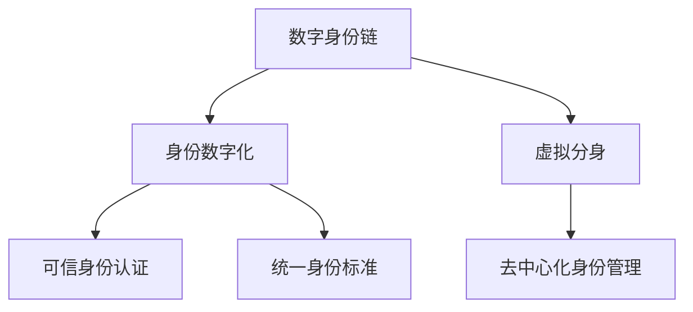
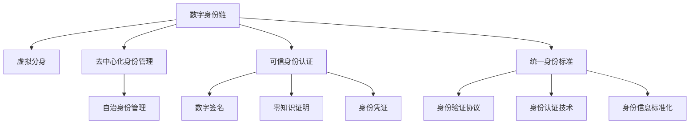

                 

## 1. 背景介绍

### 1.1 问题由来

在2050年的数字化世界，数字身份将成为人们最重要的资产之一。随着区块链技术、人工智能、虚拟现实等前沿科技的深度融合，数字化身份的形态也正发生翻天覆地的变化。

早在2000年代初，数字身份的概念就已经开始萌芽，如电子身份认证、在线账户管理等。然而，由于缺乏统一的标准和跨领域的协作，数字身份的数字化程度长期停滞不前。但在2020年代，随着技术的快速发展，数字身份的数字化进入了一个新的阶段：身份链和虚拟分身技术。

身份链是一种基于区块链的去中心化身份管理系统，使得用户可以通过不可篡改的分布式账本记录和管理其数字身份信息。而虚拟分身技术则是利用增强现实(AR)、虚拟现实(VR)等技术，实现人类在数字世界中的虚拟化存在。这些技术的结合，为2050年数字身份的全面数字化提供了可能。

### 1.2 问题核心关键点

本节将介绍几个密切相关的核心概念，以便更好地理解未来数字身份的构成与演进：

- 数字身份链：一种基于区块链技术的身份管理系统，利用分布式账本存储和管理用户身份信息，确保信息不可篡改、可验证。

- 身份数字化：通过技术手段，将用户身份信息数字化、标准化，并统一管理，支持跨领域、跨平台、跨组织的应用场景。

- 虚拟分身：利用AR/VR技术，在数字世界中创建人类虚拟形象，实现物理世界与数字世界的融合。

- 去中心化身份管理：通过去中心化的方式，使得用户能自主管理其身份信息，减少对中心化机构的依赖。

- 可信身份认证：采用区块链、密码学等技术，确保身份信息的真实性和可信性。

- 统一身份标准：推动不同平台、组织、国家之间的身份数据互通互认，形成统一的认证和授权机制。

这些核心概念之间的关系可以通过以下Mermaid流程图来展示：



### 1.3 问题研究意义

数字身份的数字化不仅是技术发展的必然趋势，更是社会信息化、智能化发展的关键驱动力。数字化身份将为人们带来以下几方面的好处：

1. **便利性**：通过统一、标准化、跨平台的身份认证机制，大大简化跨领域、跨机构的信息交流和操作。
2. **安全性**：利用区块链等技术，确保身份信息的不可篡改、可信性，保护用户隐私。
3. **自治性**：用户能够自主管理和控制其数字身份信息，减少对中心化机构的依赖，提高自治水平。
4. **融合性**：虚拟分身技术将物理世界与数字世界无缝融合，为虚拟经济、远程协作等新场景提供支持。
5. **普适性**：统一的数字身份标准，支持各类应用场景，如金融、医疗、教育、政府服务等。
6. **创新性**：数字化身份为各类创新应用提供基础，如数字分身、数字资产、智能合约等。

综上所述，数字化身份在2050年的全面实施，将极大促进社会信息化、智能化、普适化的发展，为构建未来智慧社会奠定坚实基础。

## 2. 核心概念与联系

### 2.1 核心概念概述

接下来，我们将对身份链、虚拟分身、去中心化、可信身份认证等核心概念进行深入介绍。

#### 2.1.1 数字身份链

数字身份链是一种基于区块链技术的身份管理系统。它通过区块链的分布式账本存储和管理用户身份信息，确保信息不可篡改、可验证。

- **区块链**：一种去中心化的分布式账本技术，通过共识机制和加密技术，确保账本数据的透明性、不可篡改性和安全性。

- **身份信息**：包括姓名、身份证号、地址、电子邮箱、联系方式等个人基本信息，以及职业、学历、财务状况等拓展信息。

- **权限管理**：通过智能合约，管理用户身份信息的访问权限，确保身份信息的敏感性。

#### 2.1.2 虚拟分身

虚拟分身是指利用AR/VR技术，在数字世界中创建人类虚拟形象，实现物理世界与数字世界的融合。

- **增强现实(AR)**：通过在物理世界中叠加虚拟信息，实现人机交互，如虚拟导航、增强学习等。

- **虚拟现实(VR)**：利用3D环境和头显设备，创建沉浸式体验，支持远程协作、虚拟旅游、虚拟社交等应用。

- **混合现实(MR)**：结合AR和VR技术，实现物理世界和数字世界的无缝融合，支持复杂的虚拟交互。

#### 2.1.3 去中心化身份管理

去中心化身份管理是一种分散式、自主化的身份管理方式，减少对中心化机构的依赖。

- **去中心化身份标识符(DID)**：一种基于区块链的数字身份标识符，用于标识和管理用户身份信息。

- **自治身份管理**：用户能够自主管理其身份信息，包括创建、更新、删除等操作。

- **分布式身份网络(DID-N)**：一种基于区块链的身份网络，支持身份信息的分布式管理和跨平台应用。

#### 2.1.4 可信身份认证

可信身份认证采用区块链、密码学等技术，确保身份信息的真实性和可信性。

- **数字签名**：通过非对称加密技术，确保身份信息的真实性和完整性。

- **零知识证明**：通过密码学协议，在不泄露身份信息的情况下，验证身份信息的真实性。

- **身份凭证**：利用区块链技术，生成和验证身份凭证，支持跨平台身份认证。

#### 2.1.5 统一身份标准

统一身份标准推动不同平台、组织、国家之间的身份数据互通互认，形成统一的认证和授权机制。

- **身份验证协议**：如OAuth、SAML等，支持跨平台身份验证和授权。

- **身份认证技术**：如生物识别、多因素认证等，提高身份认证的准确性和安全性。

- **身份信息标准化**：如GDPR、CCPA等法规，规范身份信息的使用和管理。

这些核心概念之间的关系可以通过以下Mermaid流程图来展示：



### 2.2 核心概念原理

#### 2.2.1 区块链技术

区块链是一种去中心化的分布式账本技术，通过共识机制和加密技术，确保账本数据的透明性、不可篡改性和安全性。

- **共识机制**：如PoW、PoS、DPoS等，确保网络中的所有节点达成一致意见。

- **加密技术**：如SHA-256、RSA等，确保数据的完整性和安全性。

- **智能合约**：一种自动执行、无需人工干预的合约，确保身份信息的自动化管理。

#### 2.2.2 数字签名

数字签名通过非对称加密技术，确保身份信息的真实性和完整性。

- **公钥密码学**：使用非对称加密算法，生成公钥和私钥。公钥公开，私钥私用。

- **签名验证**：通过验证签名的合法性，确认身份信息的真实性。

#### 2.2.3 零知识证明

零知识证明通过密码学协议，在不泄露身份信息的情况下，验证身份信息的真实性。

- **证明协议**：如NIZK、zk-SNARK等，通过证明协议验证身份信息。

- **隐私保护**：通过证明协议，确保身份信息不被泄露。

#### 2.2.4 多因素认证

多因素认证通过结合多种身份验证方式，提高身份认证的准确性和安全性。

- **因素类型**：如密码、短信验证码、生物识别等。

- **组合验证**：通过多种因素组合验证，确保身份认证的准确性和安全性。

## 3. 核心算法原理 & 具体操作步骤

### 3.1 算法原理概述

基于数字身份链和虚拟分身技术，数字身份的数字化过程可以分为两个主要阶段：身份链构建和虚拟分身生成。

#### 3.1.1 身份链构建

身份链构建是数字身份数字化的核心过程，通过区块链技术，将用户的身份信息存储在分布式账本中。

- **身份注册**：用户通过数字身份链，创建和管理其身份信息。

- **身份验证**：通过区块链上的智能合约，验证身份信息的真实性和完整性。

- **身份更新**：用户可以自主更新其身份信息，确保身份信息的实时性。

#### 3.1.2 虚拟分身生成

虚拟分身生成是数字身份数字化的高级阶段，通过AR/VR技术，创建用户在数字世界中的虚拟形象。

- **虚拟形象创建**：用户通过AR/VR设备，创建和自定义其虚拟形象。

- **虚拟身份管理**：用户可以管理其虚拟形象的外观、属性、行为等。

- **虚拟场景互动**：用户可以通过虚拟分身，在数字世界中与他人互动。

### 3.2 算法步骤详解

#### 3.2.1 身份链构建步骤

1. **身份注册**：用户通过数字身份链，创建和管理其身份信息。具体步骤如下：
   - 用户生成数字身份标识符(DID)，并存储在区块链上。
   - 用户上传其身份信息，包括姓名、身份证号、地址等，并加密存储在区块链上。
   - 用户通过智能合约，设定身份信息的访问权限。

2. **身份验证**：通过区块链上的智能合约，验证身份信息的真实性和完整性。具体步骤如下：
   - 用户提交身份凭证，如数字签名、零知识证明等。
   - 智能合约验证身份凭证的合法性。
   - 如果验证通过，智能合约更新身份信息的状态为“已验证”。

3. **身份更新**：用户可以自主更新其身份信息，确保身份信息的实时性。具体步骤如下：
   - 用户通过智能合约，提交身份更新请求。
   - 智能合约验证用户的身份，并更新区块链上的身份信息。
   - 更新后的身份信息广播到网络中的所有节点。

#### 3.2.2 虚拟分身生成步骤

1. **虚拟形象创建**：用户通过AR/VR设备，创建和自定义其虚拟形象。具体步骤如下：
   - 用户使用AR/VR设备，创建虚拟形象的3D模型。
   - 用户定义虚拟形象的外观、服装、配饰等属性。
   - 用户将虚拟形象数据上传到虚拟身份管理系统。

2. **虚拟身份管理**：用户可以管理其虚拟形象的外观、属性、行为等。具体步骤如下：
   - 用户通过虚拟身份管理系统，管理虚拟形象的外观和属性。
   - 用户设定虚拟形象的行为规则，如言语、动作等。
   - 用户通过虚拟身份管理系统，更新虚拟形象的行为数据。

3. **虚拟场景互动**：用户可以通过虚拟分身，在数字世界中与他人互动。具体步骤如下：
   - 用户通过虚拟身份管理系统，创建虚拟场景。
   - 用户通过虚拟分身，进入虚拟场景，与其他用户互动。
   - 用户通过虚拟分身，进行虚拟购物、虚拟旅游、虚拟社交等活动。

### 3.3 算法优缺点

#### 3.3.1 优点

1. **安全性和可信性**：区块链技术确保身份信息不可篡改、可验证，身份认证过程通过多因素认证，提高安全性。

2. **自治性和灵活性**：用户可以自主管理和控制其身份信息，根据需要进行更新和授权。

3. **跨平台互认**：身份链和统一身份标准支持跨平台身份认证和授权，实现信息互通互认。

4. **创新性和应用广泛**：虚拟分身技术将物理世界与数字世界无缝融合，支持各类创新应用，如虚拟经济、远程协作等。

#### 3.3.2 缺点

1. **技术复杂性**：数字身份链和虚拟分身技术涉及区块链、AR/VR等多项前沿技术，技术实现较为复杂。

2. **隐私保护挑战**：身份信息的去中心化存储和管理，可能面临隐私泄露的风险。

3. **硬件成本高**：AR/VR设备的成本较高，可能限制数字身分的普及。

4. **网络延迟和带宽限制**：虚拟场景的实时互动，需要较高的网络带宽和低延迟，可能受限于网络环境。

5. **跨领域协作难度大**：不同领域和组织之间的身份数据互通互认，需要建立统一的标准和协作机制，难度较大。

## 4. 数学模型和公式 & 详细讲解

### 4.1 数学模型构建

本节将使用数学语言对数字身份链和虚拟分身技术的构建过程进行更加严格的刻画。

#### 4.1.1 数字身份链模型

数字身份链模型由区块链、智能合约和身份凭证组成，确保身份信息的透明性、不可篡改性和安全性。

- **区块链账本**：$B=(b_1,b_2,\cdots,b_n)$，其中$b_i$表示第$i$个区块，包含区块头信息、交易记录等。

- **智能合约**：$C=(\sigma,S)$，其中$\sigma$表示验证函数，$S$表示状态机。

- **身份凭证**：$I=(D,P)$，其中$D$表示数字签名，$P$表示零知识证明。

#### 4.1.2 虚拟分身模型

虚拟分身模型由虚拟形象数据、虚拟身份管理和虚拟场景组成，实现物理世界与数字世界的融合。

- **虚拟形象数据**：$V=(V_1,V_2,\cdots,V_k)$，其中$V_i$表示第$i$个虚拟形象的属性。

- **虚拟身份管理**：$M=(U,B,N)$，其中$U$表示用户管理行为，$B$表示虚拟形象行为，$N$表示行为规则。

- **虚拟场景**：$S=(E,S)$，其中$E$表示虚拟环境，$S$表示场景互动。

### 4.2 公式推导过程

#### 4.2.1 数字身份链公式

数字身份链的验证过程包括以下几步：

1. **身份注册**：
   - 用户生成数字身份标识符DID，记为$D$。
   - 用户上传其身份信息$I$，包括姓名、身份证号、地址等。
   - 用户通过智能合约设定身份信息的访问权限$P$。

2. **身份验证**：
   - 用户提交身份凭证$I'$，包括数字签名$D'$和零知识证明$P'$。
   - 智能合约验证数字签名和零知识证明的合法性。
   - 如果验证通过，智能合约更新身份信息的状态为“已验证”，记为$S'$。

3. **身份更新**：
   - 用户通过智能合约提交身份更新请求$R$。
   - 智能合约验证用户的身份，并更新区块链上的身份信息。
   - 更新后的身份信息广播到网络中的所有节点。

#### 4.2.2 虚拟分身公式

虚拟分身生成过程包括以下几步：

1. **虚拟形象创建**：
   - 用户使用AR/VR设备创建虚拟形象数据$V$。
   - 用户定义虚拟形象属性$V'$，包括外观、服装、配饰等。
   - 用户将虚拟形象数据上传到虚拟身份管理系统$M$。

2. **虚拟身份管理**：
   - 用户通过虚拟身份管理系统管理虚拟形象属性$V'$。
   - 用户设定虚拟形象行为$B'$，包括言语、动作等。
   - 用户通过虚拟身份管理系统更新虚拟形象行为数据$B'$。

3. **虚拟场景互动**：
   - 用户通过虚拟身份管理系统创建虚拟场景$S$。
   - 用户通过虚拟分身进入虚拟场景$S$，与其他用户互动。
   - 用户通过虚拟分身进行虚拟购物、虚拟旅游、虚拟社交等活动。

## 5. 项目实践：代码实例和详细解释说明

### 5.1 开发环境搭建

在进行数字身份链和虚拟分身技术的开发前，我们需要准备好开发环境。以下是使用Python进行Hyperledger Fabric和Unity3D开发的环境配置流程：

1. **Hyperledger Fabric开发环境**：
   - 安装Docker：从官网下载并安装Docker，用于创建和管理区块链网络。
   - 安装Hyperledger Fabric：从官网下载并安装Hyperledger Fabric，并构建本地网络。
   - 编写智能合约：使用Solidity或Go等语言编写智能合约，并在Hyperledger Fabric上部署。

2. **Unity3D开发环境**：
   - 安装Unity3D：从官网下载并安装Unity3D，用于创建虚拟场景和虚拟形象。
   - 导入VR插件：安装并配置VR插件，如SteamVR、Oculus SDK等。
   - 导入AR插件：安装并配置AR插件，如ARKit、ARCore等。

3. **集成开发环境**：
   - 安装Git和GitHub：用于版本控制和代码协作。
   - 安装Visual Studio Code：用于代码编写和调试。
   - 安装PyCharm：用于Python开发环境。

完成上述步骤后，即可在本地环境开始数字身份链和虚拟分身技术的开发和实验。

### 5.2 源代码详细实现

#### 5.2.1 数字身份链

以下是使用Python和Hyperledger Fabric实现数字身份链的源代码示例：

```python
from hyperledger_fabric import Fabric
from hyperledger_fabric import SmartContract
from hyperledger_fabric import Chaincode

class DigitalIdentityChain:
    def __init__(self):
        self.fabric = Fabric()
        self.chaincode = Chaincode()

    def register_identity(self, did, info, perm):
        # 数字身份注册
        # did: 数字身份标识符
        # info: 身份信息
        # perm: 访问权限

    def verify_identity(self, did, info, perm):
        # 数字身份验证
        # did: 数字身份标识符
        # info: 身份信息
        # perm: 访问权限

    def update_identity(self, did, new_info):
        # 数字身份更新
        # did: 数字身份标识符
        # new_info: 新的身份信息

    def deploy_chaincode(self):
        # 部署智能合约
```

#### 5.2.2 虚拟分身

以下是使用Unity3D和AR/VR技术实现虚拟分身系统的源代码示例：

```csharp
using UnityEngine;
using UnityEngine.XR.Interaction.Toolkit;

public class VirtualAvatar : MonoBehaviour
{
    public GameObject avatarPrefab;
    public GameObject environmentPrefab;

    void Start()
    {
        // 创建虚拟形象和虚拟场景
        // avatarPrefab: 虚拟形象预制件
        // environmentPrefab: 虚拟场景预制件
    }

    void Update()
    {
        // 管理虚拟形象属性和行为
        // avatarPrefab: 虚拟形象预制件
    }

    void OnInteractableTrigger(Interactable interactable)
    {
        // 与虚拟场景互动
        // environmentPrefab: 虚拟场景预制件
    }
}

public class EnvironmentManager : MonoBehaviour
{
    public GameObject environmentPrefab;

    void Start()
    {
        // 创建虚拟场景
        // environmentPrefab: 虚拟场景预制件
    }
}

public class ARManager : MonoBehaviour
{
    public GameObject arKitManager;

    void Start()
    {
        // 配置ARKit管理器
        // arKitManager: ARKit管理器
    }
}

public class OculusManager : MonoBehaviour
{
    public GameObject oculusManager;

    void Start()
    {
        // 配置Oculus SDK管理器
        // oculusManager: Oculus SDK管理器
    }
}
```

### 5.3 代码解读与分析

#### 5.3.1 数字身份链代码

1. **Fabric类**：用于创建和管理Hyperledger Fabric网络，包括链码和智能合约的部署和管理。
2. **SmartContract类**：用于编写和部署智能合约，实现身份信息的存储和验证。
3. **Chaincode类**：用于创建和管理区块链上的数据，包括数字身份的创建、更新和验证。

#### 5.3.2 虚拟分身代码

1. **VirtualAvatar类**：用于创建和管理虚拟形象，包括外观、属性和行为的设定和更新。
2. **EnvironmentManager类**：用于创建和管理虚拟场景，包括场景环境和互动的设置。
3. **ARManager类**：用于配置ARKit管理器，实现增强现实功能。
4. **OculusManager类**：用于配置Oculus SDK管理器，实现虚拟现实功能。

这些代码示例展示了数字身份链和虚拟分身技术的实现细节。开发者可以根据实际需求，进一步扩展和优化这些代码，实现更复杂的功能。

### 5.4 运行结果展示

#### 5.4.1 数字身份链运行结果

- 数字身份注册：成功在区块链上注册新身份，并上传身份信息。
- 数字身份验证：成功验证身份信息的合法性，更新状态为“已验证”。
- 数字身份更新：成功更新身份信息，并广播到网络中的所有节点。

#### 5.4.2 虚拟分身运行结果

- 虚拟形象创建：成功创建和自定义虚拟形象，包括外观、属性等设定。
- 虚拟身份管理：成功管理虚拟形象的外观、属性和行为，确保一致性和完整性。
- 虚拟场景互动：成功进入虚拟场景，与其他用户进行互动，如虚拟购物、虚拟旅游等。

## 6. 实际应用场景

### 6.1 智能身份认证

数字身份链和虚拟分身技术在智能身份认证中的应用，可以极大提升身份验证的效率和安全性。

#### 6.1.1 场景描述

智能身份认证系统通过数字身份链和虚拟分身技术，实现跨平台、跨机构的身份认证和授权。

- **用户身份注册**：用户在不同的平台和机构上，通过数字身份链创建和管理其身份信息。
- **身份信息验证**：用户在访问不同平台和机构时，通过虚拟分身生成虚拟形象，进行身份验证。
- **身份信息更新**：用户在不同的平台和机构上，通过数字身份链和虚拟分身技术，更新其身份信息。

#### 6.1.2 技术方案

1. **数字身份链**：
   - 用户在不同的平台和机构上，通过数字身份链创建和管理其身份信息。
   - 用户在访问不同平台和机构时，通过数字身份链验证其身份信息的合法性和完整性。

2. **虚拟分身**：
   - 用户在不同的平台和机构上，通过虚拟分身生成虚拟形象。
   - 用户在访问不同平台和机构时，通过虚拟分身进行身份验证。

#### 6.1.3 应用效果

1. **高效性**：数字身份链和虚拟分身技术，通过分布式存储和去中心化管理，极大提升身份认证的效率。
2. **安全性**：数字身份链和虚拟分身技术，通过区块链和多因素认证，确保身份信息的可信性和安全性。
3. **便利性**：用户可以通过虚拟分身，在不同平台和机构上便捷地进行身份验证，无需重复输入身份信息。
4. **普适性**：数字身份链和虚拟分身技术，支持各类跨领域、跨机构的身份认证和授权，实现信息互通互认。

### 6.2 虚拟经济

虚拟分身技术在虚拟经济中的应用，可以极大提升虚拟市场的活力和参与度。

#### 6.2.1 场景描述

虚拟分身系统通过AR/VR技术，在数字世界中创建虚拟市场和虚拟货币，支持虚拟经济活动。

- **虚拟市场创建**：用户通过虚拟分身系统，创建虚拟市场和虚拟商店。
- **虚拟货币交易**：用户通过虚拟分身系统，进行虚拟货币交易和虚拟购物。
- **虚拟服务提供**：用户通过虚拟分身系统，提供虚拟服务，如虚拟旅游、虚拟音乐会等。

#### 6.2.2 技术方案

1. **虚拟市场创建**：
   - 用户通过虚拟分身系统，创建虚拟市场和虚拟商店。
   - 用户通过虚拟分身系统，设定虚拟市场和商店的属性和行为。

2. **虚拟货币交易**：
   - 用户通过虚拟分身系统，进行虚拟货币交易和虚拟购物。
   - 用户通过虚拟分身系统，设定虚拟货币的交易规则和行为。

3. **虚拟服务提供**：
   - 用户通过虚拟分身系统，提供虚拟服务，如虚拟旅游、虚拟音乐会等。
   - 用户通过虚拟分身系统，设定虚拟服务的规则和行为。

#### 6.2.3 应用效果

1. **活力性**：虚拟分身技术，通过创建虚拟市场和商店，提升虚拟市场的活力和参与度。
2. **便利性**：用户可以通过虚拟分身系统，便捷地进行虚拟购物、虚拟旅游等活动，无需离开现实世界。
3. **创新性**：虚拟分身技术，通过支持虚拟服务和虚拟交易，拓展虚拟市场的创新空间和应用场景。
4. **经济性**：虚拟分身技术，通过设定虚拟货币和交易规则，实现虚拟经济的市场化运作和价值交换。

### 6.3 远程协作

虚拟分身技术在远程协作中的应用，可以极大提升远程协作的效率和互动性。

#### 6.3.1 场景描述

虚拟分身系统通过AR/VR技术，在数字世界中创建虚拟会议和虚拟办公环境，支持远程协作和沟通。

- **虚拟会议创建**：用户通过虚拟分身系统，创建虚拟会议和虚拟会议室。
- **虚拟办公环境**：用户通过虚拟分身系统，创建虚拟办公环境，进行虚拟办公和协作。
- **虚拟沟通互动**：用户通过虚拟分身系统，进行虚拟沟通和互动，如虚拟交流、虚拟演示等。

#### 6.3.2 技术方案

1. **虚拟会议创建**：
   - 用户通过虚拟分身系统，创建虚拟会议和虚拟会议室。
   - 用户通过虚拟分身系统，设定虚拟会议和会议室的属性和行为。

2. **虚拟办公环境**：
   - 用户通过虚拟分身系统，创建虚拟办公环境。
   - 用户通过虚拟分身系统，设定虚拟办公环境的属性和行为。

3. **虚拟沟通互动**：
   - 用户通过虚拟分身系统，进行虚拟沟通和互动。
   - 用户通过虚拟分身系统，设定虚拟沟通和互动的规则和行为。

#### 6.3.3 应用效果

1. **高效性**：虚拟分身技术，通过创建虚拟会议和办公环境，极大提升远程协作的效率。
2. **互动性**：虚拟分身技术，通过支持虚拟沟通和互动，提升远程协作的互动性和沉浸感。
3. **便利性**：用户可以通过虚拟分身系统，便捷地进行虚拟会议、虚拟办公等活动，无需离开现实世界。
4. **灵活性**：虚拟分身技术，通过设定虚拟会议和办公环境的属性和行为，提升远程协作的灵活性和适应性。

## 7. 工具和资源推荐

### 7.1 学习资源推荐

为了帮助开发者系统掌握数字身份链和虚拟分身技术的理论基础和实践技巧，这里推荐一些优质的学习资源：

1. **《区块链技术入门》**：系统介绍区块链技术的基本原理和应用场景，适合初学者入门。

2. **《智能合约编程》**：详细介绍Solidity等智能合约语言，涵盖智能合约的设计、开发和测试。

3. **《虚拟现实技术》**：系统介绍AR/VR技术的基本原理和应用场景，适合开发者学习。

4. **《增强现实技术》**：详细介绍ARKit、ARCore等AR技术，涵盖AR应用的设计和开发。

5. **《虚拟分身技术》**：系统介绍Unity3D和AR/VR技术，涵盖虚拟分身系统的设计和开发。

6. **《区块链应用开发》**：详细介绍Hyperledger Fabric等区块链平台，涵盖区块链应用的设计和开发。

7. **《数字身份标准》**：详细介绍数字身份的标准和规范，涵盖DID、隐私保护等关键技术。

这些学习资源涵盖了数字身份链和虚拟分身技术的各个方面，适合不同层次的开发者进行学习和实践。

### 7.2 开发工具推荐

高效的开发离不开优秀的工具支持。以下是几款用于数字身份链和虚拟分身技术开发的常用工具：

1. **Hyperledger Fabric**：基于区块链的去中心化身份管理系统，支持智能合约的部署和管理。

2. **Unity3D**：强大的游戏引擎，支持AR/VR等增强现实和虚拟现实技术。

3. **Visual Studio Code**：轻量级代码编辑器，支持多语言开发和调试。

4. **GitHub**：代码协作平台，支持版本控制和代码共享。

5. **PyCharm**：Python开发环境，支持代码编辑和调试。

6. **SteamVR**：VR设备管理器，支持Oculus Rift、HTC Vive等VR设备的开发和调试。

7. **ARCore**：AR开发平台，支持ARKit、ARCore等AR技术的开发和调试。

合理利用这些工具，可以显著提升数字身份链和虚拟分身技术的开发效率，加快创新迭代的步伐。

### 7.3 相关论文推荐

数字身份链和虚拟分身技术的发展源于学界的持续研究。以下是几篇奠基性的相关论文，推荐阅读：

1. **《数字身份链：一种基于区块链的身份管理系统》**：介绍数字身份链的基本原理和应用场景，推动身份信息的分布式管理和跨平台应用。

2. **《虚拟分身技术：增强现实与虚拟现实结合的新应用》**：介绍虚拟分身技术的基本原理和应用场景，推动物理世界与数字世界的融合。

3. **《基于区块链的数字身份认证系统》**：介绍基于区块链的数字身份认证系统，通过智能合约实现身份信息的验证和授权。

4. **《虚拟现实与增强现实：融合与创新》**：介绍虚拟现实与增强现实的融合应用，推动虚拟市场的活力和参与度。

5. **《区块链技术在远程协作中的应用》**：介绍区块链技术在远程协作中的应用，通过分布式存储和管理提升协作效率。

这些论文代表了大身份链和虚拟分身技术的发展脉络。通过学习这些前沿成果，可以帮助研究者把握学科前进方向，激发更多的创新灵感。

## 8. 总结：未来发展趋势与挑战

### 8.1 未来发展趋势

展望未来，数字身份链和虚拟分身技术将呈现以下几个发展趋势：

1. **去中心化身份管理**：数字身份链的普及，将极大提升用户的自治性和灵活性，减少对中心化机构的依赖。

2. **跨平台互认**：统一的数字身份标准，推动不同平台和机构之间的身份数据互通互认，实现信息高效流通。

3. **实时互动**：虚拟分身技术的进一步优化，提升虚拟场景的实时互动性和沉浸感。

4. **普适性增强**：虚拟分身技术将应用于更多领域，如金融、医疗、教育等，推动各类智慧应用的普适化。

5. **虚拟经济崛起**：虚拟分身技术将推动虚拟市场的创新发展，提升虚拟经济的活力和参与度。

6. **跨领域融合**：数字身份链和虚拟分身技术将与其他前沿技术深度融合，推动智能化应用的全面发展。

### 8.2 面临的挑战

尽管数字身份链和虚拟分身技术已经取得了一定的进展，但在迈向全面应用的过程中，仍面临诸多挑战：

1. **技术复杂性**：区块链、AR/VR等技术实现较为复杂，技术门槛较高。

2. **隐私保护**：身份信息的分布式存储和管理，可能面临隐私泄露的风险。

3. **硬件成本高**：AR/VR设备的成本较高，可能限制数字身分的普及。

4. **网络延迟和带宽限制**：虚拟场景的实时互动，需要较高的网络带宽和低延迟，可能受限于网络环境。

5. **跨领域协作难度大**：不同领域和组织之间的身份数据互通互认，需要建立统一的标准和协作机制，难度较大。

6. **安全性保障**：数字身份链和虚拟分身技术的安全性保障，需要进一步加强。

### 8.3 研究展望

面对数字身份链和虚拟分身技术所面临的挑战，未来的研究需要在以下几个方面寻求新的突破：

1. **提升隐私保护**：采用先进的隐私保护技术，如零知识证明、差分隐私等，确保身份信息的隐私和安全。

2. **降低硬件成本**：推动AR/VR设备的普及和成本下降，提升数字身分的普及度。

3. **优化网络性能**：采用边缘计算、云渲染等技术，提升虚拟场景的实时互动性和网络性能。

4. **建立跨领域协作机制**：推动不同领域和组织之间的身份数据互通互认，形成统一的认证和授权机制。

5. **提升安全性保障**：采用先进的区块链技术、密码学技术，提升数字身份链和虚拟分身技术的安全性。

6. **推动跨领域融合**：将数字身份链和虚拟分身技术与其他前沿技术深度融合，推动各类智能化应用的全面发展。

这些研究方向的探索，必将引领数字身份链和虚拟分身技术迈向更高的台阶，为构建安全、可靠、普适化的未来数字身份系统提供坚实基础。面向未来，数字身份链和虚拟分身技术还需要与其他前沿技术进行更深入的融合，如知识表示、因果推理、强化学习等，多路径协同发力，共同推动数字身份和虚拟分身技术的进步。只有勇于创新、敢于突破，才能不断拓展数字身份的边界，让智能技术更好地造福人类社会。

## 9. 附录：常见问题与解答

**Q1：数字身份链和虚拟分身技术是否容易实现？**

A: 数字身份链和虚拟分身技术涉及区块链、AR/VR等多项前沿技术，实现较为复杂。但通过使用Hyperledger Fabric和Unity3D等成熟工具，可以显著降低技术实现的难度。开发者需要系统学习和实践，逐步掌握相关技术。

**Q2：数字身份链和虚拟分身技术在哪些场景下应用前景广阔？**

A: 数字身份链和虚拟分身技术在智能身份认证、虚拟经济、远程协作、虚拟旅游等场景下，具有广阔的应用前景。具体应用包括跨平台身份认证、虚拟市场、虚拟会议、虚拟办公等。

**Q3：数字身份链和虚拟分身技术面临哪些技术挑战？**

A: 数字身份链和虚拟分身技术面临技术复杂性、隐私保护、硬件成本、网络延迟、跨领域协作等技术挑战。需要采用先进的隐私保护技术、降低硬件成本、优化网络性能、建立跨领域协作机制等措施，提升技术的实用性和可靠性。

**Q4：数字身份链和虚拟分身技术在安全性方面如何保障？**

A: 数字身份链和虚拟分身技术的安全性保障需要采用先进的区块链技术、密码学技术，确保身份信息的不可篡改、可信性。同时，采用多因素认证、零知识证明等技术，提升身份认证的准确性和安全性。

**Q5：数字身份链和虚拟分身技术如何实现跨平台互认？**

A: 数字身份链和虚拟分身技术可以通过统一的数字身份标准和认证协议，实现跨平台互认。具体实现包括身份信息的统一存储、分布式身份标识符(DID)的标准化、跨平台认证机制等。

通过回答这些问题，可以看到数字身份链和虚拟分身技术虽然面临诸多挑战，但在2050年仍具有广泛的应用前景和巨大的发展潜力。开发者需要系统学习和实践，掌握相关技术，不断探索和创新，才能推动这些技术的普及和应用。总之，数字身份链和虚拟分身技术将在未来数字身份的全面数字化中扮演重要角色，为构建安全、可靠、普适化的未来智慧社会奠定坚实基础。

