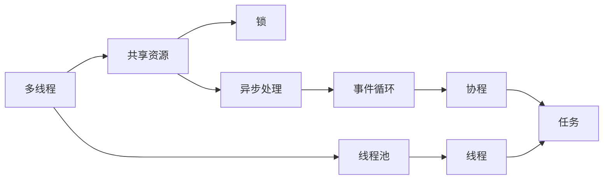

                 

# 并发编程：多线程与异步处理

> 关键词：并发编程,多线程,异步处理,锁,线程池,事件循环,协程,IO密集型,计算密集型

## 1. 背景介绍

随着多核处理器和分布式计算的普及，并发编程成为现代软件开发中的一项基本技能。在多线程与异步处理技术的加持下，系统可以并行地执行多个任务，显著提升性能和资源利用率。然而，并发编程也带来了一系列复杂问题，如线程安全、死锁、上下文切换等，需要开发者深入理解并合理设计。本文将详细介绍多线程与异步处理的核心概念和实践方法，帮助读者全面掌握并发编程的技术要点。

## 2. 核心概念与联系

### 2.1 核心概念概述

- **多线程（Multi-Threading）**：在同一进程内部创建多个线程，这些线程共享进程的资源，同时独立执行不同的任务。多线程可以并行处理计算密集型任务，提高程序性能。

- **异步处理（Asynchronous Processing）**：在单线程或单进程中，通过事件循环和回调函数等方式，非阻塞地执行多个异步任务。异步处理适用于I/O密集型任务，减少系统等待时间。

- **锁（Lock）**：用于控制线程对共享资源的访问权限，防止多线程同时修改共享数据导致的竞态条件和数据不一致问题。

- **线程池（Thread Pool）**：预先创建一组线程，等待任务到来时分配执行，避免频繁创建和销毁线程带来的性能开销。

- **事件循环（Event Loop）**：异步处理的基石，用于调度任务的执行，将I/O和计算任务分离开来。

- **协程（Coroutine）**：通过语言级别的函数调用实现线程级别的切换，能够灵活地管理执行上下文，减少上下文切换开销。

这些核心概念共同构成了现代并发编程的基础框架，在多线程与异步处理的实践中，开发者需要灵活组合使用这些技术，以实现高效的并发执行。

### 2.2 核心概念原理和架构的 Mermaid 流程图



这个流程图展示了多线程与异步处理的基本架构：

- 多线程通过共享资源进行协作，锁用于保护共享资源的访问。
- 异步处理通过事件循环调度任务，协程用于高效地管理任务执行上下文。
- 线程池预先创建线程，减少创建和销毁线程的开销。

## 3. 核心算法原理 & 具体操作步骤

### 3.1 算法原理概述

并发编程的核心理念是并行执行多个任务，以提高系统性能和资源利用率。多线程和异步处理是实现并发编程的主要手段，分别适用于不同的任务场景：

- 多线程适用于计算密集型任务，通过并行执行多个计算任务，提高系统的整体吞吐量。
- 异步处理适用于I/O密集型任务，通过非阻塞地执行I/O操作，减少系统等待时间。

并发编程的算法设计需要考虑线程安全、资源分配和调度等关键问题，以确保系统的高效稳定运行。

### 3.2 算法步骤详解

#### 3.2.1 多线程的实现步骤

1. **创建线程**：通过调用操作系统提供的线程创建函数，创建新线程。

2. **分配任务**：将任务分配给线程执行，通常通过函数参数或共享数据结构传递。

3. **执行任务**：线程执行分配的任务，共享数据结构可以用于线程间通信和共享数据。

4. **同步和同步机制**：使用锁等同步机制，防止多线程同时修改共享数据，确保数据的一致性和线程安全性。

#### 3.2.2 异步处理的实现步骤

1. **注册任务**：将任务注册到事件循环，指定回调函数处理任务结果。

2. **执行任务**：事件循环调度任务执行，通过回调函数处理任务结果。

3. **异步回调**：回调函数在任务执行完成后被调用，处理任务结果。

4. **并发和阻塞处理**：异步处理可以并行执行多个任务，减少系统等待时间，提高并发性能。

### 3.3 算法优缺点

#### 3.3.1 多线程的优点

1. **性能提升**：多线程通过并行执行计算任务，显著提升系统性能。

2. **灵活性**：多线程可以在不同的任务场景中灵活应用，支持复杂的任务处理。

3. **资源复用**：多个线程共享进程资源，减少资源分配和释放的开销。

#### 3.3.2 多线程的缺点

1. **线程安全问题**：多线程共享数据时，需要考虑线程安全和竞态条件问题。

2. **上下文切换开销**：线程上下文切换开销较大，可能影响系统性能。

3. **复杂性**：多线程编程复杂，需要考虑线程安全、资源竞争等问题。

#### 3.3.3 异步处理的优点

1. **并发性**：异步处理通过非阻塞地执行I/O操作，提高系统的并发性能。

2. **资源利用**：异步处理适用于I/O密集型任务，避免系统等待I/O操作，提高资源利用率。

3. **易扩展性**：异步处理可以动态添加和删除任务，易于扩展和维护。

#### 3.3.4 异步处理的缺点

1. **回调地狱**：回调函数的嵌套可能导致“回调地狱”，难以维护和调试。

2. **复杂性**：异步编程复杂，需要理解事件循环和回调机制。

3. **错误处理**：异步任务可能引发异常，需要额外的错误处理机制。

### 3.4 算法应用领域

多线程与异步处理技术广泛应用于现代软件开发中，覆盖了众多领域：

- **Web应用**：通过多线程和异步处理，提升Web应用的性能和响应速度。

- **数据库访问**：使用多线程和异步处理访问数据库，提高数据读写效率。

- **网络通信**：通过多线程和异步处理实现网络通信，提升网络应用的性能。

- **实时系统**：使用多线程和异步处理实现实时数据处理和通信，满足低延迟要求。

- **桌面应用**：通过多线程和异步处理提升桌面应用的响应速度和性能。

## 4. 数学模型和公式 & 详细讲解 & 举例说明

### 4.1 数学模型构建

并发编程的数学模型通常基于以下概念：

- **线程安全（Thread-Safety）**：定义一个算法或数据结构是否能够保证在多个线程同时访问时，不发生数据竞争或竞态条件。

- **锁（Lock）**：定义一个锁机制，用于控制线程对共享资源的访问权限，确保数据的一致性和线程安全性。

- **同步（Synchronization）**：定义同步机制，用于处理多线程之间的协作和通信。

### 4.2 公式推导过程

#### 4.2.1 锁机制的推导

定义一个互斥锁（Mutex），用于控制对共享资源的访问：

$$
\text{Mutex} = \{ \text{Lock}, \text{Unlock} \}
$$

其中：

- **Lock**：加锁操作，阻塞当前线程，直到锁被释放。
- **Unlock**：解锁操作，释放锁，允许其他线程访问共享资源。

定义一个读写锁（Read-Write Lock），用于控制读写操作的互斥性：

$$
\text{RWLock} = \{ \text{RLock}, \text{RLock}, \text{WLock}, \text{WUnlock} \}
$$

其中：

- **RLock**：读锁操作，允许多个线程同时读取共享资源。
- **WLock**：写锁操作，阻塞所有读线程和写线程，直到写操作完成。

#### 4.2.2 同步机制的推导

定义一个信号量（Semaphore），用于控制线程对共享资源的访问权限：

$$
\text{Semaphore} = \{ \text{Wait}, \text{Signal} \}
$$

其中：

- **Wait**：等待信号量，直到信号量大于0。
- **Signal**：信号操作，递增信号量，释放等待线程。

定义一个条件变量（Condition Variable），用于处理线程之间的通信和同步：

$$
\text{Condition Variable} = \{ \text{Wait}, \text{Signal} \}
$$

其中：

- **Wait**：等待条件变量，直到条件满足。
- **Signal**：通知条件变量，唤醒等待线程。

### 4.3 案例分析与讲解

#### 4.3.1 线程安全的数据结构

一个线程安全的数据结构必须满足以下条件：

- **原子性**：数据结构的操作必须是原子性的，避免多个线程同时修改共享数据。

- **可见性**：修改操作必须对所有线程可见，避免线程间的可见性问题。

- **有序性**：修改操作必须保证有序性，避免竞态条件和数据不一致问题。

常见线程安全的数据结构包括：

- **原子变量（Atomic Variable）**：如AtomicInteger、AtomicBoolean等，保证操作原子性。

- **线程安全容器（Thread-Safe Container）**：如ConcurrentHashMap、ConcurrentLinkedQueue等，保证线程安全性。

#### 4.3.2 并发队列（Concurrent Queue）

定义一个并发队列，用于处理多个线程之间的数据传输：

$$
\text{Concurrent Queue} = \{ \text{Enqueue}, \text{Dequeue} \}
$$

其中：

- **Enqueue**：入队操作，将数据添加到队列尾部。
- **Dequeue**：出队操作，从队列头部取出数据。

常见的并发队列包括：

- **LinkedBlockingQueue**：基于链表实现的阻塞队列，支持多个线程同时入队和出队。

- **ArrayBlockingQueue**：基于数组实现的阻塞队列，支持多个线程同时入队和出队。

#### 4.3.3 线程池（Thread Pool）

定义一个线程池，用于管理多个线程的创建和销毁：

$$
\text{Thread Pool} = \{ \text{Create}, \text{Shutdown}, \text{Submit} \}
$$

其中：

- **Create**：创建线程池，指定线程数和任务队列。
- **Shutdown**：关闭线程池，等待所有任务完成。
- **Submit**：提交任务到线程池，由线程池分配线程执行。

常见的线程池包括：

- **Executors**：Java提供的线程池框架，支持多种线程池策略。

- **ThreadPoolExecutor**：Java实现的线程池，支持自定义线程数和任务队列。

## 5. 项目实践：代码实例和详细解释说明

### 5.1 开发环境搭建

在多线程与异步处理的实践中，通常使用Java和Python作为开发语言。以下是使用Java和Python搭建开发环境的步骤：

#### 5.1.1 Java开发环境搭建

1. **安装JDK**：从Oracle官网下载并安装Java Development Kit（JDK），建议使用JDK 11或以上版本。

2. **安装IDE**：推荐使用IntelliJ IDEA或Eclipse作为开发工具。

3. **配置Maven或Gradle**：通过Maven或Gradle管理项目依赖和构建工具。

4. **配置Git**：通过Git进行版本控制，使用GitHub或GitLab托管代码。

#### 5.1.2 Python开发环境搭建

1. **安装Python**：从Python官网下载并安装Python解释器，建议安装最新版本。

2. **安装IDE**：推荐使用PyCharm或Visual Studio Code作为开发工具。

3. **安装依赖库**：使用pip安装所需的依赖库，如threading、asyncio等。

4. **配置Git**：通过Git进行版本控制，使用GitHub或GitLab托管代码。

### 5.2 源代码详细实现

#### 5.2.1 Java多线程实现

以下是一个Java多线程的示例代码，用于实现多线程并发计算：

```java
import java.util.concurrent.*;

public class MultiThreadExample {
    public static void main(String[] args) throws Exception {
        int nThreads = 4;
        int nTasks = 10;

        ExecutorService executor = Executors.newFixedThreadPool(nThreads);
        CompletionService<Integer> completionService = new ExecutorCompletionService<>(executor);

        for (int i = 0; i < nTasks; i++) {
            final int task = i;
            completionService.submit(() -> {
                return task * 2;
            });
        }

        int[] results = new int[nTasks];
        for (int i = 0; i < nTasks; i++) {
            Future<Integer> future = completionService.take();
            results[i] = future.get();
        }

        executor.shutdown();
        executor.awaitTermination(1, TimeUnit.MINUTES);

        System.out.println(Arrays.toString(results));
    }
}
```

该示例使用线程池和CompletionService实现多线程并发计算，同时通过awaitTermination等待所有线程执行完成，确保结果的正确性。

#### 5.2.2 Python异步处理实现

以下是一个Python异步处理的示例代码，用于实现异步HTTP请求：

```python
import asyncio
import aiohttp

async def fetch(url):
    async with aiohttp.ClientSession() as session:
        async with session.get(url) as response:
            return await response.text()

async def main():
    tasks = [fetch(url) for url in urls]
    results = await asyncio.gather(*tasks)
    print(results)

if __name__ == "__main__":
    urls = ["http://example.com", "http://example.org"]
    asyncio.run(main())
```

该示例使用asyncio实现异步HTTP请求，通过gather函数并行执行多个请求，确保结果的正确性。

### 5.3 代码解读与分析

#### 5.3.1 Java多线程实现

- **线程池创建**：使用Executors.newFixedThreadPool创建固定线程数的线程池，指定线程数和任务队列。

- **任务提交**：使用CompletionService提交多个计算任务，使用future获取每个任务的结果。

- **线程管理**：使用executor.shutdown和executor.awaitTermination等待所有线程执行完成，确保结果的正确性。

#### 5.3.2 Python异步处理实现

- **异步请求创建**：使用asyncio创建一个异步客户端，使用ClientSession管理连接。

- **异步请求执行**：使用session.get方法异步发送HTTP请求，使用await获取响应结果。

- **并行处理**：使用asyncio.gather函数并行执行多个异步请求，确保结果的正确性。

## 6. 实际应用场景

### 6.1 Web应用

在Web应用中，多线程与异步处理用于提升响应速度和并发性能。以下是几个典型的应用场景：

- **Web服务器**：使用多线程处理连接请求，提升Web服务器的并发性能。

- **数据库访问**：使用多线程和异步处理访问数据库，提高数据读写效率。

- **缓存管理**：使用多线程和异步处理管理缓存，提升系统性能和响应速度。

### 6.2 数据库访问

数据库操作通常是I/O密集型任务，多线程与异步处理可以显著提升数据库访问的性能。以下是几个典型的应用场景：

- **数据读写**：使用多线程和异步处理进行数据读写操作，提高数据库的并发性能。

- **事务处理**：使用多线程和异步处理管理事务，避免锁竞争和死锁问题。

- **数据缓存**：使用多线程和异步处理管理缓存，提升系统性能和响应速度。

### 6.3 网络通信

网络通信通常是I/O密集型任务，异步处理可以显著提升系统性能。以下是几个典型的应用场景：

- **Web Socket**：使用异步处理实现Web Socket通信，提升Web应用的用户体验。

- **网络爬虫**：使用异步处理进行网络爬虫，提高爬虫的效率和稳定性。

- **API调用**：使用异步处理调用API，提升系统响应速度和并发性能。

## 7. 工具和资源推荐

### 7.1 学习资源推荐

为了帮助开发者系统掌握多线程与异步处理的核心技术，以下是一些优质的学习资源：

1. **《Java并发编程实战》**：由Brian Goetz等作者编写，深入浅出地介绍了Java并发编程的基本概念和实践方法。

2. **《Python协程编程实战》**：由Real Python团队编写，全面介绍了Python协程的基本概念和实践方法。

3. **《深入理解Java并发编程》**：由Henry Wong编写，详细讲解了Java并发编程的核心技术，包括锁、线程池、条件变量等。

4. **《异步编程实战》**：由Donald E. Knuth编写，介绍了异步编程的基本概念和实现方法，涵盖Java、Python等多种编程语言。

5. **《多线程编程与并发控制》**：由Gary Pollice编写，讲解了多线程编程和并发控制的核心技术，包括锁、条件变量、线程池等。

通过对这些资源的学习实践，相信你一定能够全面掌握多线程与异步处理的核心技术，并用于解决实际的并发问题。

### 7.2 开发工具推荐

高效的开发离不开优秀的工具支持。以下是几款用于多线程与异步处理开发的常用工具：

1. **IntelliJ IDEA**：Java开发的主流IDE，支持多线程和异步处理调试，提供了丰富的代码分析和代码补全功能。

2. **PyCharm**：Python开发的主流IDE，支持异步处理调试，提供了丰富的代码分析和代码补全功能。

3. **Eclipse**：Java开发的主流IDE，支持多线程和异步处理调试，提供了丰富的代码分析和代码补全功能。

4. **Visual Studio Code**：Python和JavaScript开发的常用IDE，支持异步处理调试，提供了丰富的代码分析和代码补全功能。

5. **ThreadPoolExecutor**：Java实现的线程池，支持自定义线程数和任务队列。

6. **asyncio**：Python的异步编程框架，支持异步处理和高性能网络通信。

合理利用这些工具，可以显著提升多线程与异步处理的开发效率，加快创新迭代的步伐。

### 7.3 相关论文推荐

多线程与异步处理技术的发展源于学界的持续研究。以下是几篇奠基性的相关论文，推荐阅读：

1. **《Concurrent Programming in Java》**：由Doug Lea编写，介绍了Java并发编程的核心技术和实现方法。

2. **《A Language Model for Concurrent Low-Level Programming》**：由Andrew Lumsdaine和Mike Hicks编写，提出了一种支持并发编程的低级编程模型。

3. **《Asynchronous Programming in Java》**：由Doug Lea编写，介绍了Java异步编程的核心技术和实现方法。

4. **《Multithreaded Programming: Concepts and Practice》**：由John C. Martel编写，讲解了多线程编程和并发控制的核心技术。

5. **《Growing Threads: The Design of a Multithreaded Program》**：由Doug Lea编写，讲解了多线程编程的核心技术和实现方法。

这些论文代表了大并发编程技术的发展脉络。通过学习这些前沿成果，可以帮助研究者把握学科前进方向，激发更多的创新灵感。

## 8. 总结：未来发展趋势与挑战

### 8.1 研究成果总结

本文对多线程与异步处理的核心概念和实践方法进行了全面系统的介绍。首先阐述了多线程与异步处理的研究背景和意义，明确了并发编程在现代软件开发中的重要性。其次，从原理到实践，详细讲解了多线程和异步处理的数学模型和算法设计，给出了多线程与异步处理的全套代码实例。同时，本文还广泛探讨了多线程与异步处理在Web应用、数据库访问、网络通信等多个领域的应用前景，展示了并发编程的巨大潜力。此外，本文精选了多线程与异步处理技术的各类学习资源，力求为读者提供全方位的技术指引。

通过本文的系统梳理，可以看到，多线程与异步处理技术已经成为现代软件开发的重要基础，极大地提升了系统性能和资源利用率。未来，伴随并发编程技术的不断演进，系统将更加智能化、普适化，为各行各业带来变革性影响。

### 8.2 未来发展趋势

展望未来，多线程与异步处理技术将呈现以下几个发展趋势：

1. **高性能并发框架**：随着多核处理器和分布式计算的普及，高性能并发框架将成为开发者的必备工具，如Reactor、Netty等。

2. **微服务架构**：多线程与异步处理技术是微服务架构的重要组成部分，通过异步处理和事件驱动的方式，提升微服务系统的性能和扩展性。

3. **云原生技术**：多线程与异步处理技术将与云原生技术深度融合，提升云原生系统的性能和可扩展性。

4. **分布式计算**：多线程与异步处理技术将应用于大规模分布式计算，提升分布式系统的性能和稳定性。

5. **边缘计算**：多线程与异步处理技术将应用于边缘计算，提升边缘计算系统的性能和响应速度。

这些趋势凸显了多线程与异步处理技术的广阔前景。这些方向的探索发展，必将进一步提升并发编程的性能和可扩展性，为系统的高效稳定运行提供坚实基础。

### 8.3 面临的挑战

尽管多线程与异步处理技术已经取得了瞩目成就，但在迈向更加智能化、普适化应用的过程中，它仍面临着诸多挑战：

1. **性能瓶颈**：多线程和异步处理需要优化线程池和事件循环的配置，以避免上下文切换和资源竞争带来的性能开销。

2. **复杂性**：多线程和异步处理的编程复杂，需要考虑线程安全、锁机制、同步机制等关键问题，增加了开发难度。

3. **错误处理**：多线程和异步处理可能导致回调地狱和死锁等问题，需要额外的错误处理机制，保证系统的稳定性和可靠性。

4. **可维护性**：多线程和异步处理的代码复杂，增加了系统的维护难度，需要良好的设计和文档。

5. **跨平台支持**：多线程和异步处理的实现平台差异较大，需要跨平台优化，确保系统在各种平台上都能稳定运行。

正视多线程与异步处理面临的这些挑战，积极应对并寻求突破，将使并发编程技术更加成熟，为系统的高效稳定运行提供坚实保障。相信随着学界和产业界的共同努力，这些挑战终将一一被克服，多线程与异步处理技术必将在构建高性能、高可扩展性、高可靠性的系统中共放异彩。

### 8.4 研究展望

面对多线程与异步处理所面临的种种挑战，未来的研究需要在以下几个方面寻求新的突破：

1. **并发模型优化**：研究新的并发模型，如基于流式的编程模型，提高系统的并发性能和可扩展性。

2. **资源优化**：研究资源优化技术，如线程池、事件循环的优化，提升系统的资源利用率。

3. **可扩展性增强**：研究可扩展性技术，如微服务架构、云原生技术，提升系统的可扩展性。

4. **编程复杂性降低**：研究编程复杂性降低技术，如代码分析工具、代码补全工具，提升系统的可维护性。

5. **跨平台支持**：研究跨平台优化技术，如跨平台编程模型、跨平台框架，提升系统的跨平台兼容性。

这些研究方向的探索，必将引领多线程与异步处理技术迈向更高的台阶，为构建高性能、高可扩展性、高可靠性的系统铺平道路。面向未来，多线程与异步处理技术还需要与其他人工智能技术进行更深入的融合，如知识表示、因果推理、强化学习等，多路径协同发力，共同推动并发编程技术的进步。只有勇于创新、敢于突破，才能不断拓展并发编程的边界，让系统更加智能化、普适化。

## 9. 附录：常见问题与解答

**Q1：多线程和异步处理有何区别？**

A: 多线程和异步处理是两种不同的并发编程技术，主要区别在于任务执行方式：

- **多线程**：在同一进程内创建多个线程，多个线程共享进程资源，并行执行计算任务。多线程适用于计算密集型任务，提高系统性能。

- **异步处理**：在同一进程或单线程中，通过事件循环和回调函数等方式，非阻塞地执行多个异步任务。异步处理适用于I/O密集型任务，减少系统等待时间。

**Q2：如何避免线程安全问题？**

A: 线程安全问题通常发生在多个线程同时修改共享数据时。以下是一些避免线程安全问题的方法：

- **互斥锁**：使用互斥锁（Mutex）控制多个线程对共享资源的访问权限，确保数据的一致性和线程安全性。

- **读写锁**：使用读写锁（Read-Write Lock）控制多个线程对共享资源的读写访问权限，允许多个线程同时读取共享资源，避免读写竞争。

- **原子变量**：使用原子变量（Atomic Variable）进行原子性操作，避免多个线程同时修改共享数据。

- **线程安全容器**：使用线程安全容器（Thread-Safe Container）进行线程安全的数据访问，确保数据的一致性和线程安全性。

**Q3：如何优化线程池的性能？**

A: 线程池的性能优化需要考虑线程数和任务队列的大小，以下是一些优化方法：

- **固定线程数**：根据系统负载和任务类型，选择合适的线程数，避免线程创建和销毁的开销。

- **任务队列大小**：根据任务队列的大小，优化任务提交和等待的时间，减少线程上下文切换的开销。

- **任务队列类型**：选择合适的任务队列类型，如FIFO、LRU等，提高任务处理的效率和公平性。

- **任务提交方式**：使用CompletableFuture或Future submit方法提交任务，提高任务处理的效率和可扩展性。

**Q4：如何处理异步回调地狱问题？**

A: 异步回调地狱问题通常发生在多个异步任务嵌套调用时，以下是一些处理异步回调地狱的方法：

- **事件循环优化**：使用事件循环优化工具，如asyncio，提高异步任务的并发性能，减少回调嵌套。

- **异步函数**：使用异步函数（Async Function）进行任务串行执行，避免回调嵌套。

- **协程**：使用协程（Coroutine）进行任务并行执行，避免回调嵌套。

- **Future和CompletableFuture**：使用Future和CompletableFuture进行任务异步执行，避免回调嵌套。

**Q5：如何提升异步处理的高并发性能？**

A: 异步处理的高并发性能通常需要优化事件循环和任务调度，以下是一些提升异步处理高并发性能的方法：

- **事件循环优化**：使用异步处理框架，如Node.js、Python asyncio，提高异步任务的并发性能。

- **协程优化**：使用协程进行任务串行执行，避免回调嵌套，提高异步任务的并发性能。

- **并发调度**：使用并发调度技术，如轮询调度、时间片轮转等，提高异步任务的并发性能。

- **任务队列优化**：使用线程安全的任务队列，避免任务等待和竞争，提高异步任务的并发性能。

这些常见问题与解答的探讨，帮助读者全面理解多线程与异步处理的核心概念和实践方法，为解决实际的并发问题提供坚实基础。

---

作者：禅与计算机程序设计艺术 / Zen and the Art of Computer Programming

