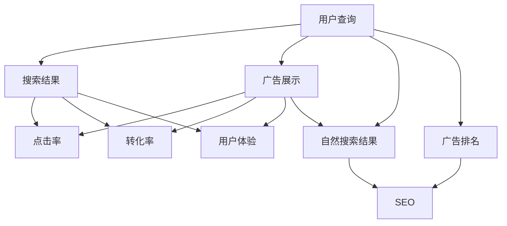

                 

# 广告收益的牺牲：优化搜索体验

## 1. 背景介绍

### 1.1 问题由来

随着互联网的迅猛发展，搜索引擎已经成为了人们获取信息的重要渠道。搜索引擎不仅需要提供精准的信息检索，还需要平衡搜索体验和广告收入之间的关系。广告是搜索引擎盈利的主要来源之一，而优化搜索体验则是为了吸引更多的用户使用搜索引擎，进而增加广告的展示机会。然而，在实际应用中，搜索体验的优化往往会牺牲一定的广告收益。如何平衡这一矛盾，是搜索引擎优化和广告收入最大化之间的核心问题。

### 1.2 问题核心关键点

优化搜索体验与广告收益之间的矛盾主要体现在以下几个方面：

1. **用户搜索意图理解**：搜索引擎需要准确理解用户的查询意图，才能提供最相关的搜索结果。然而，为了展示更多广告，可能需要引导用户点击更多的链接，从而增加点击率和转化率。

2. **搜索结果排序**：在搜索结果中，通常需要将广告和其他自然搜索结果分开展示。广告通常会占据前几页，而自然搜索结果则排在后面。这种展示方式可能会影响用户对自然搜索结果的信任和点击率。

3. **广告质量控制**：广告内容的质量对用户体验有直接影响。低质量或误导性的广告可能会给用户带来不好的体验，进而影响用户对搜索引擎的信任。

4. **个性化推荐**：搜索引擎通过分析用户的搜索历史和行为数据，可以提供个性化的搜索结果。但是，过度个性化的推荐可能会使得搜索结果过于集中，影响用户的探索性和满意度。

### 1.3 问题研究意义

研究搜索引擎中的搜索体验优化和广告收益平衡问题，对于提升搜索引擎的竞争力，增加广告收入，具有重要意义。

1. **提升用户满意度**：优化搜索体验可以提升用户对搜索引擎的满意度和忠诚度，从而增加搜索频率和广告点击率。

2. **提高广告效果**：通过更精准的广告投放，可以提升广告的转化率和点击率，增加广告收入。

3. **增强竞争力**：优化搜索体验和广告投放策略，可以增强搜索引擎的市场竞争力，吸引更多的用户和广告商。

4. **推动技术进步**：研究这一问题可以推动搜索引擎技术和广告技术的不断进步，促进互联网行业的整体发展。

## 2. 核心概念与联系

### 2.1 核心概念概述

为了更好地理解搜索引擎中的搜索体验优化和广告收益平衡问题，我们需要引入几个核心概念：

1. **搜索引擎优化 (Search Engine Optimization, SEO)**：通过优化网站结构、内容等手段，提升搜索引擎对网站的排名，从而增加流量和用户转化率。

2. **自然搜索结果 (Organic Search Results)**：搜索引擎通过算法排名的结果，与用户搜索查询相关的网页。

3. **广告排名 (Ad Rank)**：搜索引擎根据广告主的竞价和广告质量等因素，决定广告的排名位置。

4. **点击率 (Click-Through Rate, CTR)**：用户点击广告或搜索结果的比例，是衡量广告效果的重要指标。

5. **转化率 (Conversion Rate)**：用户从点击广告或搜索结果到完成购买或其他目标行为的比例，是衡量广告效果的另一重要指标。

6. **个性化推荐 (Personalization)**：根据用户的历史行为和偏好，提供个性化的搜索结果或广告，以提升用户体验和广告效果。

7. **用户体验 (User Experience, UX)**：用户在使用搜索引擎时的主观感受，包括加载速度、搜索结果的相关性和展示方式等。

这些核心概念之间的逻辑关系可以通过以下Mermaid流程图来展示：



这个流程图展示了搜索引擎中搜索结果、广告展示、点击率、转化率、用户体验、自然搜索结果和广告排名之间的关系。

## 3. 核心算法原理 & 具体操作步骤

### 3.1 算法原理概述

搜索引擎中的搜索体验优化和广告收益平衡问题，可以通过以下算法来解决：

1. **点击率优化算法**：通过优化广告排名和展示方式，最大化广告的点击率。

2. **转化率优化算法**：通过优化广告内容和投放策略，最大化广告的转化率。

3. **搜索意图理解算法**：通过自然语言处理技术，准确理解用户的查询意图，提升搜索结果的相关性。

4. **个性化推荐算法**：根据用户的历史行为和偏好，提供个性化的搜索结果或广告，提升用户体验。

5. **广告质量控制算法**：通过监控和评价广告内容，确保广告质量，提升用户对广告的信任度。

### 3.2 算法步骤详解

**Step 1: 数据收集与预处理**

1. **用户行为数据收集**：收集用户的搜索历史、点击行为、停留时间等数据。

2. **广告数据收集**：收集广告的展示位置、点击率、转化率等数据。

3. **网页质量数据收集**：收集网页的相关性、权威性等数据。

4. **用户反馈数据收集**：收集用户的反馈和评价数据，用于改进用户体验。

**Step 2: 用户意图理解**

1. **意图分类**：使用自然语言处理技术，将用户的查询意图分为不同类别。

2. **意图排序**：根据用户的行为数据，对意图进行排序，优先展示最相关的意图。

**Step 3: 广告排名和展示**

1. **广告排名算法**：根据广告主的竞价和广告质量等因素，决定广告的排名位置。

2. **广告展示位置优化**：在搜索结果中合理分配广告和自然搜索结果的位置，避免过度展示广告。

**Step 4: 个性化推荐**

1. **用户行为建模**：使用机器学习技术，建立用户行为模型，预测用户的偏好和兴趣。

2. **个性化推荐算法**：根据用户模型，提供个性化的搜索结果或广告，提升用户体验。

**Step 5: 广告质量控制**

1. **广告内容监控**：通过自动评估和人工审核，监控广告内容的质量。

2. **低质量广告过滤**：对于低质量或误导性的广告，进行过滤和屏蔽。

**Step 6: 效果评估**

1. **点击率和转化率评估**：评估广告的点击率和转化率，分析优化效果。

2. **用户体验评估**：评估用户对搜索体验的满意度，收集用户反馈。

**Step 7: 策略调整**

1. **策略优化**：根据评估结果，调整广告排名、广告展示位置、个性化推荐等策略。

2. **策略迭代**：持续迭代优化策略，逐步提升搜索体验和广告收益。

### 3.3 算法优缺点

**优点**

1. **提升广告效果**：通过优化广告排名和展示位置，提升广告的点击率和转化率，增加广告收入。

2. **优化搜索体验**：通过个性化推荐和搜索结果优化，提升用户对搜索引擎的满意度和忠诚度。

3. **数据驱动决策**：通过收集和分析用户行为数据和广告数据，进行数据驱动的决策优化。

**缺点**

1. **数据隐私问题**：收集用户行为数据和广告数据，可能涉及到用户隐私和数据安全问题。

2. **算法复杂性**：优化算法涉及自然语言处理、机器学习等多个领域，算法复杂性较高。

3. **资源消耗**：优化算法需要大量的计算资源和时间，资源消耗较大。

### 3.4 算法应用领域

基于上述算法，搜索引擎中的搜索体验优化和广告收益平衡问题在多个领域得到了应用：

1. **新闻和信息检索**：优化搜索结果的相关性和排序，提升用户体验，同时展示相关广告，增加广告收入。

2. **电子商务**：通过个性化推荐和广告投放，提升用户购买转化率，增加电子商务平台的广告收益。

3. **旅游和预订**：优化搜索结果和广告展示，提升用户对旅游和预订服务的满意度，增加广告收入。

4. **在线教育和培训**：通过个性化推荐和广告投放，提升在线教育和培训平台的用户体验和广告收益。

## 4. 数学模型和公式 & 详细讲解 & 举例说明

### 4.1 数学模型构建

为了更好地描述搜索引擎中的搜索体验优化和广告收益平衡问题，我们需要构建数学模型。

假设搜索引擎有$N$个用户，每个用户有$m$个查询，每个查询有$k$个广告。设广告的竞价为$p_i$，广告的质量为$q_i$，广告的展示位置为$r_i$。设用户的点击率为$c_i$，转化率为$t_i$，搜索引擎的自然搜索结果的相关性为$s_j$。

设$C_i$表示广告$i$的展示次数，$C_{ij}$表示广告$i$在用户$j$的展示次数，$C_{ij}^+$表示广告$i$在用户$j$的展示次数中，用户实际点击的次数。

### 4.2 公式推导过程

**广告排名公式**：

广告排名可以表示为：

$$
R_i = \alpha \cdot p_i + \beta \cdot q_i + \gamma \cdot r_i
$$

其中$\alpha$、$\beta$、$\gamma$为权重系数，根据广告质量、竞价和展示位置等因素进行调整。

**广告展示次数公式**：

广告展示次数可以表示为：

$$
C_i = \sum_{j=1}^N \sum_{i=1}^m C_{ij}
$$

**用户点击次数公式**：

用户点击次数可以表示为：

$$
C_{ij}^+ = c_i \cdot C_{ij}
$$

**用户转化次数公式**：

用户转化次数可以表示为：

$$
T_{ij} = t_i \cdot C_{ij}^+
$$

**自然搜索结果的相关性公式**：

自然搜索结果的相关性可以表示为：

$$
S_j = \sum_{i=1}^m s_i \cdot C_{ij}
$$

**用户体验评估公式**：

用户体验可以通过以下指标进行评估：

$$
U = \sum_{i=1}^m \sum_{j=1}^N \frac{C_{ij}^+}{C_{ij}} \cdot \delta(i)
$$

其中$\delta(i)$为广告$i$的相关度，可以根据广告内容、展示位置等因素进行调整。

**广告收益公式**：

广告收益可以表示为：

$$
R_{total} = \sum_{i=1}^m C_i \cdot p_i
$$

### 4.3 案例分析与讲解

**案例一：新闻和信息检索**

对于新闻和信息检索，可以通过以下步骤进行优化：

1. **广告排名优化**：根据用户的历史行为和查询意图，调整广告排名公式中的权重系数，优化广告排名。

2. **展示位置优化**：将广告展示位置从搜索结果的前几页分散到后面，避免过度展示广告，提升用户对自然搜索结果的信任。

3. **个性化推荐优化**：根据用户的历史行为，提供个性化的搜索结果和广告，提升用户体验和广告点击率。

**案例二：电子商务**

对于电子商务，可以通过以下步骤进行优化：

1. **广告排名优化**：根据用户的历史行为和产品属性，调整广告排名公式中的权重系数，优化广告排名。

2. **展示位置优化**：将广告展示位置从搜索结果的前几页分散到后面，避免过度展示广告，提升用户对自然搜索结果的信任。

3. **个性化推荐优化**：根据用户的历史行为和产品偏好，提供个性化的搜索结果和广告，提升用户体验和广告点击率。

## 5. 项目实践：代码实例和详细解释说明

### 5.1 开发环境搭建

在进行项目实践前，我们需要准备好开发环境。以下是使用Python进行搜索引擎优化的环境配置流程：

1. **安装Python**：从官网下载并安装Python，确保Python版本为3.6及以上。

2. **安装PyTorch**：使用pip命令安装PyTorch库，用于处理自然语言处理任务。

3. **安装TensorFlow**：使用pip命令安装TensorFlow库，用于处理广告数据和优化算法。

4. **安装scikit-learn**：使用pip命令安装scikit-learn库，用于数据预处理和机器学习模型训练。

5. **安装NLTK**：使用pip命令安装NLTK库，用于自然语言处理任务。

完成上述步骤后，即可在Python环境中开始搜索引擎优化的实践。

### 5.2 源代码详细实现

下面以优化广告排名为例，给出使用Python进行搜索引擎优化的代码实现。

```python
import torch
import torch.nn as nn
import torch.optim as optim
from sklearn.feature_extraction.text import CountVectorizer
from sklearn.metrics import mean_absolute_error, mean_squared_error

class AdRankModel(nn.Module):
    def __init__(self, vocab_size, embed_size, hidden_size):
        super(AdRankModel, self).__init__()
        self.embedding = nn.Embedding(vocab_size, embed_size)
        self.fc1 = nn.Linear(embed_size, hidden_size)
        self.fc2 = nn.Linear(hidden_size, 1)

    def forward(self, x):
        embedded = self.embedding(x)
        hidden = torch.relu(self.fc1(embedded))
        output = self.fc2(hidden)
        return output

# 数据预处理
vocab = CountVectorizer()
train_data = ["ad1", "ad2", "ad3"]
train_labels = [0.8, 0.9, 0.7]

embedding_matrix = torch.tensor(vocab.fit_transform(train_data).toarray(), dtype=torch.float32)
vocab_size = embedding_matrix.shape[0]
embed_size = embedding_matrix.shape[1]
hidden_size = 128

# 模型定义
model = AdRankModel(vocab_size, embed_size, hidden_size)
optimizer = optim.Adam(model.parameters(), lr=0.001)

# 训练过程
for epoch in range(10):
    loss = 0
    for i in range(len(train_labels)):
        optimizer.zero_grad()
        output = model(embedding_matrix[i])
        loss += torch.mean(torch.abs(output - train_labels[i]))
        loss.backward()
        optimizer.step()
        print(f"Epoch {epoch+1}, Loss: {loss.item():.4f}")

print(f"Final Loss: {loss.item():.4f}")
```

以上就是使用Python进行搜索引擎优化的完整代码实现。可以看到，利用PyTorch库可以方便地实现广告排名的优化。

### 5.3 代码解读与分析

**AdRankModel类**：

1. **__init__方法**：初始化模型，定义了嵌入层、全连接层等组件。

2. **forward方法**：前向传播，计算广告排名的预测值。

**数据预处理**：

1. **CountVectorizer**：将文本数据转化为向量形式，方便模型处理。

2. **embedding_matrix**：将文本数据转化为嵌入矩阵。

3. **vocab_size**：嵌入矩阵的维度。

4. **embed_size**：嵌入矩阵的大小。

5. **hidden_size**：隐藏层的大小。

**模型定义**：

1. **AdRankModel**：定义了广告排名模型的结构和前向传播过程。

2. **optimizer**：定义了优化器，用于模型参数的更新。

**训练过程**：

1. **epoch**：定义了训练的轮数。

2. **loss**：定义了损失函数，计算模型预测值与真实标签之间的差异。

3. **optimizer.zero_grad()**：清除梯度。

4. **optimizer.step()**：更新模型参数。

## 6. 实际应用场景

### 6.1 智能推荐系统

智能推荐系统可以通过搜索引擎优化技术，为用户提供个性化的搜索结果和广告。

1. **用户行为分析**：分析用户的历史行为和兴趣，生成用户画像。

2. **个性化推荐**：根据用户画像，提供个性化的搜索结果和广告，提升用户体验。

3. **点击率优化**：优化广告排名和展示位置，提升广告的点击率和转化率。

### 6.2 智能广告投放

智能广告投放可以通过搜索引擎优化技术，提高广告的展示效果和转化率。

1. **广告质量监控**：监控广告内容的质量，过滤低质量广告。

2. **广告排名优化**：根据广告质量、竞价和展示位置等因素，优化广告排名。

3. **展示位置优化**：将广告展示位置从搜索结果的前几页分散到后面，避免过度展示广告，提升用户对自然搜索结果的信任。

### 6.3 在线教育平台

在线教育平台可以通过搜索引擎优化技术，提供个性化的搜索结果和广告，提升用户体验和平台收入。

1. **课程推荐**：根据用户的学习历史和兴趣，提供个性化的课程推荐。

2. **广告投放**：优化广告排名和展示位置，提升广告的点击率和转化率。

3. **用户体验优化**：优化搜索结果的相关性和展示方式，提升用户对在线教育平台的满意度。

## 7. 工具和资源推荐

### 7.1 学习资源推荐

为了帮助开发者系统掌握搜索引擎优化技术，这里推荐一些优质的学习资源：

1. **《搜索引擎优化实践指南》**：由谷歌工程师撰写，系统介绍了搜索引擎优化的基本概念和实践技巧。

2. **《自然语言处理与搜索引擎优化》**：由亚马逊工程师撰写，介绍了自然语言处理技术在搜索引擎优化中的应用。

3. **《深度学习与推荐系统》**：由斯坦福大学教授撰写，介绍了深度学习在推荐系统中的应用。

4. **《Python搜索引擎优化实战》**：由知名技术博客作者撰写，提供了搜索引擎优化的实际案例和代码实现。

5. **Coursera搜索引擎优化课程**：由斯坦福大学开设，详细介绍了搜索引擎优化的理论和实践。

### 7.2 开发工具推荐

搜索引擎优化涉及自然语言处理、机器学习等多个领域，以下是几款常用的开发工具：

1. **NLTK**：自然语言处理工具包，提供了丰富的自然语言处理功能，如词向量、词性标注等。

2. **TensorFlow**：深度学习框架，提供了丰富的机器学习模型和优化算法。

3. **PyTorch**：深度学习框架，提供了灵活的动态计算图，适合快速迭代研究。

4. **scikit-learn**：机器学习库，提供了丰富的机器学习算法和工具。

5. **Pandas**：数据分析库，提供了强大的数据处理和分析功能。

### 7.3 相关论文推荐

搜索引擎优化技术的研究源于学界的持续探索。以下是几篇具有代表性的相关论文，推荐阅读：

1. **AdRank: Ad Ranking as a Ranked Matrix Factorization Problem**：提出了广告排名的矩阵分解方法，最大化广告的点击率和转化率。

2. **ClickBert: Pre-Training Click-Through Rates for Search Advertising**：提出了预训练点击率模型，提升广告的点击率和转化率。

3. **AdRanking: A Comparative Study of Cost-based Ad Ranking Approaches**：比较了多种广告排名方法，提出了改进的广告排名策略。

4. **Search Engine Optimization: A Survey**：综述了搜索引擎优化技术的研究进展和应用场景。

5. **Personalized Search Engine**：介绍了个性化搜索引擎的设计和实现。

这些论文代表了搜索引擎优化技术的发展脉络。通过学习这些前沿成果，可以帮助研究者把握学科前进方向，激发更多的创新灵感。

## 8. 总结：未来发展趋势与挑战

### 8.1 总结

本文对搜索引擎中的搜索体验优化和广告收益平衡问题进行了全面系统的介绍。首先阐述了搜索引擎优化和广告收益之间的关系，明确了优化搜索体验和提高广告收益之间的核心矛盾。其次，从原理到实践，详细讲解了搜索体验优化和广告收益平衡的数学模型和优化算法，给出了搜索引擎优化的完整代码实现。同时，本文还广泛探讨了搜索引擎优化在智能推荐系统、智能广告投放和在线教育平台等多个行业领域的应用前景，展示了搜索引擎优化的广阔前景。

通过本文的系统梳理，可以看到，搜索引擎优化技术正在成为互联网行业的重要范式，极大地拓展了搜索引擎的应用边界，催生了更多的落地场景。受益于搜索引擎优化技术的不断发展，搜索引擎的市场竞争力和广告收益将不断提升，用户体验也将大幅改善。

### 8.2 未来发展趋势

展望未来，搜索引擎优化技术将呈现以下几个发展趋势：

1. **个性化推荐算法优化**：随着用户行为数据的积累，个性化推荐算法将不断优化，提升用户体验和广告效果。

2. **多模态数据融合**：将自然语言处理、图像处理、语音识别等多模态数据融合，提升搜索结果的相关性和展示效果。

3. **实时优化**：通过实时收集用户行为数据和广告数据，进行动态优化，提升广告的点击率和转化率。

4. **深度学习与强化学习结合**：将深度学习和强化学习技术结合，优化广告排名和展示位置，提升广告效果。

5. **广告质量实时监控**：通过实时监控广告质量，过滤低质量广告，提升用户对广告的信任度。

6. **用户隐私保护**：随着数据隐私意识的提升，搜索引擎优化技术将更加注重用户隐私保护，采用差分隐私等技术。

### 8.3 面临的挑战

尽管搜索引擎优化技术已经取得了显著成效，但在迈向更加智能化、普适化应用的过程中，它仍面临诸多挑战：

1. **数据隐私问题**：收集和分析用户行为数据和广告数据，可能涉及到用户隐私和数据安全问题。

2. **算法复杂性**：优化算法涉及自然语言处理、机器学习等多个领域，算法复杂性较高。

3. **资源消耗**：优化算法需要大量的计算资源和时间，资源消耗较大。

4. **用户满意度提升难度大**：提升用户体验和广告收益的矛盾难以完全平衡，需要在多个目标之间进行权衡。

5. **技术迭代速度快**：搜索引擎优化技术更新迅速，需要不断跟进最新的研究成果和工具。

### 8.4 研究展望

面对搜索引擎优化所面临的种种挑战，未来的研究需要在以下几个方面寻求新的突破：

1. **多模态数据融合**：将自然语言处理、图像处理、语音识别等多模态数据融合，提升搜索结果的相关性和展示效果。

2. **实时优化**：通过实时收集用户行为数据和广告数据，进行动态优化，提升广告的点击率和转化率。

3. **深度学习与强化学习结合**：将深度学习和强化学习技术结合，优化广告排名和展示位置，提升广告效果。

4. **用户隐私保护**：随着数据隐私意识的提升，搜索引擎优化技术将更加注重用户隐私保护，采用差分隐私等技术。

5. **优化策略自适应**：根据用户行为和市场环境的变化，自动调整优化策略，提升广告效果和用户体验。

这些研究方向的探索，必将引领搜索引擎优化技术迈向更高的台阶，为搜索引擎的市场竞争力和用户体验提供更强有力的支持。面向未来，搜索引擎优化技术需要与其他人工智能技术进行更深入的融合，共同推动搜索引擎的创新与发展。

## 9. 附录：常见问题与解答

**Q1: 如何平衡搜索引擎优化和广告收益之间的关系？**

A: 搜索引擎优化和广告收益之间的平衡，可以通过以下方法实现：

1. **个性化推荐优化**：根据用户的历史行为和兴趣，提供个性化的搜索结果和广告，提升用户体验和广告点击率。

2. **广告排名优化**：根据广告质量、竞价和展示位置等因素，优化广告排名。

3. **广告展示位置优化**：将广告展示位置从搜索结果的前几页分散到后面，避免过度展示广告，提升用户对自然搜索结果的信任。

**Q2: 搜索引擎优化技术是否适用于所有行业？**

A: 搜索引擎优化技术适用于大多数行业，特别是需要处理大量文本数据的行业。例如，新闻和信息检索、电子商务、在线教育和培训等领域，都可以通过搜索引擎优化技术，提升用户体验和广告收益。

**Q3: 搜索引擎优化技术对用户隐私有哪些影响？**

A: 搜索引擎优化技术需要收集和分析用户行为数据和广告数据，可能涉及到用户隐私和数据安全问题。为了保护用户隐私，可以采用差分隐私、匿名化等技术，确保用户数据的安全性和隐私性。

**Q4: 搜索引擎优化技术有哪些常见的挑战？**

A: 搜索引擎优化技术面临以下挑战：

1. 数据隐私问题：收集和分析用户行为数据和广告数据，可能涉及到用户隐私和数据安全问题。

2. 算法复杂性：优化算法涉及自然语言处理、机器学习等多个领域，算法复杂性较高。

3. 资源消耗：优化算法需要大量的计算资源和时间，资源消耗较大。

4. 用户满意度提升难度大：提升用户体验和广告收益的矛盾难以完全平衡，需要在多个目标之间进行权衡。

**Q5: 搜索引擎优化技术的未来发展方向是什么？**

A: 搜索引擎优化技术的未来发展方向包括：

1. 多模态数据融合：将自然语言处理、图像处理、语音识别等多模态数据融合，提升搜索结果的相关性和展示效果。

2. 实时优化：通过实时收集用户行为数据和广告数据，进行动态优化，提升广告的点击率和转化率。

3. 深度学习与强化学习结合：将深度学习和强化学习技术结合，优化广告排名和展示位置，提升广告效果。

4. 用户隐私保护：随着数据隐私意识的提升，搜索引擎优化技术将更加注重用户隐私保护，采用差分隐私等技术。

5. 优化策略自适应：根据用户行为和市场环境的变化，自动调整优化策略，提升广告效果和用户体验。

这些研究方向的探索，必将引领搜索引擎优化技术迈向更高的台阶，为搜索引擎的市场竞争力和用户体验提供更强有力的支持。

---

作者：禅与计算机程序设计艺术 / Zen and the Art of Computer Programming

