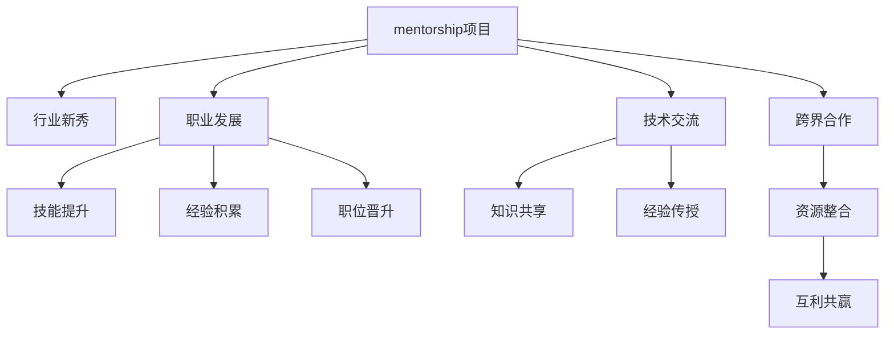

                 

# 建立个人品牌mentorship项目：培养行业新秀

> 关键词：mentorship项目, 行业新秀, 职业发展, 技术交流, 跨界合作

## 1. 背景介绍

### 1.1 问题由来
在快速变化的科技行业中，个人品牌和个人影响力的建设成为职业发展中的重要一环。特别是对于行业新秀而言，如何在激烈的竞争中脱颖而出，快速获得行业认可，并形成自己的技术影响力，是一个值得深思的问题。近年来，随着知识共享和社区建设的兴起，许多专业人士开始尝试通过mentorship项目来培养下一代行业新秀。

### 1.2 问题核心关键点
一个成功的mentorship项目，需要关注以下几个核心关键点：

1. **目标明确**：确保每个参与者都清楚项目的最终目标和期望达成的效果。
2. **匹配合适**：选择合适的mentor和被mentor，确保双方的能力和需求匹配。
3. **深度交流**：建立频繁而深入的交流机制，使双方都能从中获得成长。
4. **持续评估**：定期评估项目进展和效果，确保项目按计划推进。
5. **成果共享**：鼓励知识共享和成果展示，使被mentor能将所学应用到实际工作中。
6. **互惠共赢**：双方都应从项目中获得利益，实现共赢。

### 1.3 问题研究意义
建立个人品牌的mentorship项目，对于行业新秀的职业发展和整个行业的知识传递具有重要意义：

1. **加速成长**：通过经验丰富的mentor的指导，被mentor可以更快地掌握行业知识和技能，提升工作效率和创新能力。
2. **扩大影响**：建立个人品牌不仅能提升个人影响力，还能推动技术知识和行业见解的传播，促进行业共同进步。
3. **增强竞争力**：行业新秀通过项目积累的经验和成果，可以在职业竞争中脱颖而出，获得更多发展机会。
4. **资源整合**：通过项目的平台效应，将多方资源和信息整合，形成行业共同体。
5. **实现共赢**：项目不仅是单向的传授和接收，更是双向的互利共赢，使双方都能从中获益。

## 2. 核心概念与联系

### 2.1 核心概念概述

为更好地理解个人品牌mentorship项目，本节将介绍几个密切相关的核心概念：

- **mentorship项目**：一种通过有经验的mentor与新入职的被mentor建立长期合作关系，提升后者职业技能和职业素养的项目。
- **行业新秀**：指刚刚进入行业领域，具有较强潜力但经验相对不足的专业人士。
- **职业发展**：个人在职业生涯中的成长和进步，包括技能提升、经验积累、职位晋升等。
- **技术交流**：专业人士之间分享技术知识、经验和方法的互动过程。
- **跨界合作**：不同专业领域之间的知识交流和合作，实现资源共享和互利共赢。

这些核心概念之间的逻辑关系可以通过以下Mermaid流程图来展示：



这个流程图展示了几类核心概念及其之间的关系：

1. mentorship项目是连接行业新秀与经验丰富的mentor的桥梁。
2. mentoring不仅促进行业新秀的职业发展，还能加强技术交流和跨界合作。
3. 通过技能提升、经验积累和职位晋升，行业新秀实现职业成长。
4. 知识共享和经验传授是mentorship项目的重要环节。
5. 跨界合作和资源整合，使项目具备更强的平台效应和行业影响力。

这些概念共同构成了个人品牌mentorship项目的理论框架，为其成功实施提供了指导。

## 3. 核心算法原理 & 具体操作步骤
### 3.1 算法原理概述

个人品牌mentorship项目的实施，遵循一定的算法原理和操作步骤。其主要思想是通过有经验的mentor对行业新秀进行持续的指导和支持，帮助其提升职业技能和职业素养，形成独特的个人品牌。

算法原理包括以下几个关键步骤：

1. **需求匹配**：根据行业新秀的背景和目标，选择合适的mentor。
2. **设定目标**：明确项目目标和期望达成的效果，确保双方有共同的期待。
3. **制定计划**：制定详细的项目计划，包括交流频率、评估周期等。
4. **深度交流**：建立频繁而深入的交流机制，确保双方都能从中获得成长。
5. **持续评估**：定期评估项目进展和效果，确保项目按计划推进。
6. **成果展示**：鼓励知识共享和成果展示，使被mentor能将所学应用到实际工作中。
7. **项目总结**：项目结束后，总结经验教训，为未来的项目提供参考。

### 3.2 算法步骤详解

以下是个人品牌mentorship项目的详细操作步骤：

**Step 1: 准备阶段**
1. **明确项目目标**：项目发起人或团队应明确项目的总体目标，如提升新秀技能、扩大影响力等。
2. **梳理需求**：与行业新秀进行沟通，了解其职业目标、技能缺口和发展需求。
3. **招募mentor**：根据新秀的需求，选择合适的mentor，确保其有相关经验和知识储备。

**Step 2: 匹配阶段**
1. **初步匹配**：通过简历筛选、技能评估等方式，初步匹配新秀和可能的mentor。
2. **面试评估**：组织面试或试工，进一步评估双方的匹配度。
3. **正式配对**：确定最终匹配结果，签订 mentoring 协议。

**Step 3: 实施阶段**
1. **设定具体目标**：根据项目目标，设定具体的里程碑和子目标。
2. **制定详细计划**：制定周度或月度的交流计划，明确每次交流的内容和形式。
3. **建立沟通机制**：建立定期的沟通渠道，如周会、月报、一对一交流等。
4. **实施交流**：按照计划，组织双方的交流和互动，确保内容丰富和形式多样。
5. **提供资源支持**：提供行业资源、培训机会、书籍等，辅助新秀学习和成长。
6. **反馈和改进**：定期收集反馈，对交流内容、计划等进行评估和改进。

**Step 4: 评估阶段**
1. **中期评估**：在项目中期，对进展进行评估，调整计划。
2. **成果展示**：通过报告、分享会等方式，展示新秀的学习成果和项目成效。
3. **终结评估**：项目结束时，对新秀的进步和项目效果进行全面评估。

**Step 5: 总结阶段**
1. **总结经验**：总结项目中的成功经验和不足之处。
2. **撰写报告**：撰写项目总结报告，分享给团队和行业同仁。
3. **持续改进**：根据总结经验，改进未来的项目设计和管理。

### 3.3 算法优缺点

个人品牌mentorship项目具有以下优点：

1. **提升效率**：行业新秀通过有经验的mentor的指导，能快速掌握行业知识和技能，提升工作效率。
2. **拓宽视野**：与mentor的交流能拓展新秀的视野，了解行业最新趋势和技术。
3. **增强自信**：在mentor的鼓励和指导下，新秀能更快建立职业信心，提升自我效能感。
4. **促进合作**：项目不仅促进了技术交流，还能推动跨界合作，整合多方资源。
5. **实现共赢**：双方都能从项目中获益，mentor能分享知识，被mentor能成长进步。

同时，该项目也存在一些局限性：

1. **依赖性强**：项目的效果很大程度上依赖于合适的mentor和被mentor的配合。
2. **时间成本高**：项目需要较长的时间投入，且需频繁进行深入交流。
3. **资源需求高**：需要投入较多的行业资源和组织支持，确保项目的顺利实施。
4. **可控性差**：项目效果受多种因素影响，如双方的合作意愿、时间安排等。
5. **隐私问题**：涉及个人隐私和商业机密，需严格保护和保密。

尽管存在这些局限性，但就目前而言，个人品牌mentorship项目仍是大企业和高水平专业组织培养新秀的重要手段。未来相关研究的重点在于如何进一步优化匹配机制、提升交流效率、降低时间成本等，以进一步提升项目的成功率和影响力。

### 3.4 算法应用领域

个人品牌mentorship项目在多个领域得到了广泛应用，例如：

- **企业内部**：通过项目培养新入职员工，提升其职业技能和适应能力，快速融入团队。
- **学术机构**：在研究生和博士生的培养中，引入mentorship机制，加速学术研究和技术积累。
- **开源社区**：帮助新手掌握开源项目的技术和流程，提升社区贡献和影响力。
- **非营利组织**：通过项目培养志愿者，提升其专业技能，推动组织目标的实现。
- **职业发展平台**：如LinkedIn、GitHub等，通过项目促进行业新秀的职业发展和技术交流。

除了上述这些常见领域，个人品牌mentorship项目还可以应用于各种行业和组织，帮助行业新秀在各自领域内取得更好的职业发展。

## 4. 数学模型和公式 & 详细讲解 & 举例说明

### 4.1 数学模型构建

假设有一群行业新秀 $N$ 和一组可能的mentor $M$，我们需要通过数学模型来描述 mentoring 项目的实施和效果。

- **参与者选择**：新秀 $N$ 中的 $n_i$ 被配对给mentor $M$ 中的 $m_j$。
- **技能提升**：新秀的技能提升速度为 $k_i$，即每年提升 $k_i$ 点。
- **交流频率**：每次交流的频率为 $f_{ij}$，即每月交流 $f_{ij}$ 次。
- **效果评估**：项目的最终效果为 $E_{ij}$，即新秀在 $m_j$ 的指导下，技能提升的程度。
- **项目周期**：项目周期为 $T$，即总时长。

数学模型构建如下：

$$
E_{ij} = k_i \times f_{ij} \times T
$$

其中，$E_{ij}$ 表示新秀 $i$ 在 $m_j$ 指导下技能提升的程度，$k_i$ 表示新秀 $i$ 的初始技能水平，$f_{ij}$ 表示每次交流的频率，$T$ 表示项目的总时长。

### 4.2 公式推导过程

设 $k_{avg}$ 为所有新秀的平均技能提升速度，$f_{avg}$ 为所有交流的平均频率，$T_{avg}$ 为所有项目的平均周期，则项目的平均效果为：

$$
E_{avg} = k_{avg} \times f_{avg} \times T_{avg}
$$

根据上述公式，可以计算出项目整体的效果，帮助项目发起人评估项目实施的可行性。

### 4.3 案例分析与讲解

假设某企业计划通过 mentoring 项目提升新入职的工程师团队的技能。企业收集了新秀的技能数据，选择了若干经验丰富的高级工程师作为 mentors。

首先，通过技能评估确定每位新秀的技能水平 $k_i$。然后，选择最佳配对的 mentor $m_j$，并根据交流频率 $f_{ij}$ 和项目周期 $T$ 计算每位新秀的预期技能提升 $E_{ij}$。

最后，企业通过项目评估，比较实际效果与预期效果的偏差，调整配对策略和交流计划，确保项目目标的实现。

## 5. 项目实践：代码实例和详细解释说明

### 5.1 开发环境搭建

在进行 mentoring 项目实践前，我们需要准备好开发环境。以下是使用Python进行开发的环境配置流程：

1. 安装Anaconda：从官网下载并安装Anaconda，用于创建独立的Python环境。

2. 创建并激活虚拟环境：
```bash
conda create -n mentoring-env python=3.8 
conda activate mentoring-env
```

3. 安装必要的Python库：
```bash
pip install pandas numpy matplotlib numpydoc
```

4. 安装Jupyter Notebook：
```bash
conda install jupyter notebook
```

完成上述步骤后，即可在`mentoring-env`环境中开始项目实践。

### 5.2 源代码详细实现

下面以一个简单的 mentoring 项目为例，给出Python代码实现。

```python
import pandas as pd

# 定义数据
data = pd.DataFrame({
    'new_scout': ['Alice', 'Bob', 'Charlie', 'David', 'Eve'],
    'skill_level': [1, 2, 3, 4, 5],
    'matchmentor': ['John', 'Lisa', 'Marnie', 'Nathan', 'Oscar'],
    'frequency': [2, 3, 4, 3, 2],
    'period': [6, 12, 9, 6, 12]
})

# 计算技能提升
def calculate_skill_upgrade(df):
    upgrade_rate = df['skill_level'].mean() * df['frequency'].mean() * df['period'].mean()
    return upgrade_rate

# 输出结果
skill_upgrade_rate = calculate_skill_upgrade(data)
print(f"Overall skill upgrade rate: {skill_upgrade_rate}")
```

在这个简单的例子中，我们通过Pandas库定义了一个包含新秀、技能水平、mentor、交流频率和项目周期的数据表。然后，通过计算公式计算出整体技能提升率，并输出结果。

### 5.3 代码解读与分析

在上述代码中，我们主要使用了Pandas库来进行数据的处理和计算。首先，我们定义了一个包含新秀、技能水平、mentor、交流频率和项目周期的数据表。然后，我们定义了一个函数`calculate_skill_upgrade`，用于计算整体技能提升率。

在函数中，我们使用了公式`k_{avg} \times f_{avg} \times T_{avg}`来计算技能提升率。这里，`k_{avg}`表示所有新秀的平均技能提升速度，`f_{avg}`表示所有交流的平均频率，`T_{avg}`表示所有项目的平均周期。

最后，我们通过调用`calculate_skill_upgrade`函数，计算出整体技能提升率，并输出结果。

## 6. 实际应用场景

### 6.1 企业内部

在企业内部，通过 mentoring 项目可以培养新入职的员工，提升其职业技能和适应能力。项目可以帮助新员工快速融入团队，了解公司文化和业务流程，提高工作效率。

具体应用包括：
- 人力资源部门可以设计多个 mentoring 项目，针对不同层级的员工，进行技能提升。
- 高级员工可以作为 mentor，分享自己的经验和技术，帮助新员工快速成长。
- 公司可以定期评估项目的实施效果，根据反馈不断优化项目设计。

### 6.2 学术机构

在学术机构中，通过 mentoring 项目可以加速研究生的学习和研究，提升其学术成果和专业技能。项目可以帮助学生掌握前沿技术，拓展研究视野，提升学术影响力。

具体应用包括：
- 导师可以根据学生的研究方向和需求，选择合适的 mentor，进行个性化的指导。
- 学生可以通过与 mentor 的交流，获取最新的学术资源和技术支持。
- 学术机构可以定期组织研讨会和学术交流，促进学生和 mentor 的互动和合作。

### 6.3 开源社区

在开源社区中，通过 mentoring 项目可以帮助新手掌握开源项目的技术和流程，提升其社区贡献和技术能力。项目可以帮助新手更快地融入社区，了解项目的文化和规范，提高代码质量。

具体应用包括：
- 社区管理者可以设计多个 mentoring 项目，针对不同领域和级别的新手，进行技能培训。
- 经验丰富的开发者可以作为 mentor，分享项目开发的经验和技术，帮助新手解决问题。
- 社区可以定期评估项目的实施效果，根据反馈不断优化项目设计。

### 6.4 非营利组织

在非营利组织中，通过 mentoring 项目可以培养志愿者，提升其专业技能和组织效能，推动组织目标的实现。项目可以帮助志愿者掌握组织的工作流程和规范，提高工作效率。

具体应用包括：
- 组织管理者可以设计多个 mentoring 项目，针对不同领域的志愿者，进行技能培训。
- 经验丰富的志愿者可以作为 mentor，分享自己的工作经验和组织知识，帮助新手成长。
- 组织可以定期评估项目的实施效果，根据反馈不断优化项目设计。

## 7. 工具和资源推荐

### 7.1 学习资源推荐

为了帮助开发者系统掌握 mentoring 项目的理论基础和实践技巧，这里推荐一些优质的学习资源：

1. 《The Mentorship Effect》系列书籍：由知名mentorship专家撰写，全面介绍了 mentoring 项目的实施方法和效果评估。

2. Coursera的《Mentoring》课程：由宾夕法尼亚大学开设，涵盖 mentoring 项目的基本概念和实施策略。

3. LinkedIn Learning的《Becoming a Mentor》课程：由职业导师和HR专家讲解，提供实际的 mentoring 指导技巧和经验分享。

4. MindTools的《Mentoring Guide》文章：提供了丰富的 mentoring 实践案例和工具，帮助项目发起人设计和管理项目。

5. Harvard Business Review的《Effective Mentorship》文章：讨论了 mentoring 项目的最佳实践和关键要素，供项目发起人参考。

通过对这些资源的学习实践，相信你一定能够快速掌握 mentoring 项目的精髓，并用于解决实际的职业发展问题。

### 7.2 开发工具推荐

高效的开发离不开优秀的工具支持。以下是几款用于 mentoring 项目开发的常用工具：

1. Trello：项目管理工具，帮助团队组织和跟踪项目进度。
2. Slack：即时通讯工具，提供高效的沟通和协作平台。
3. Zoom：视频会议工具，支持远程交流和互动。
4. Google Drive：云存储工具，方便文件共享和版本控制。
5. GitHub：代码托管工具，支持版本控制和代码协作。
6. Google Forms：问卷调查工具，收集参与者的反馈和数据。

合理利用这些工具，可以显著提升 mentoring 项目的开发效率，加快创新迭代的步伐。

### 7.3 相关论文推荐

mentoring 技术的发展源于学界的持续研究。以下是几篇奠基性的相关论文，推荐阅读：

1. “The Mentorship Effect: How To Harness The Power Of Mentoring”：讨论了 mentoring 项目对个人和组织的影响，提供了丰富的案例和数据支持。

2. “The Impact Of Mentoring On Organizational Commitment”：研究了 mentoring 项目对员工忠诚度和组织承诺的影响，提出了有效的实施策略。

3. “The Role Of Mentorship In Leadership Development”：探讨了 mentoring 项目在领导力培养中的作用，分析了项目的设计和评估方法。

4. “The Effectiveness Of Mentorship Programs In Non-Profit Organizations”：评估了非营利组织中的 mentoring 项目效果，提出了改进建议。

5. “The Role Of Mentorship In Academic Success”：研究了 mentoring 项目对学生学术成果和职业发展的影响，提供了实际案例和数据。

这些论文代表了大 mentoring 项目的发展脉络。通过学习这些前沿成果，可以帮助研究者把握学科前进方向，激发更多的创新灵感。

## 8. 总结：未来发展趋势与挑战

### 8.1 总结

本文对个人品牌mentorship项目的实施进行了全面系统的介绍。首先阐述了 mentoring 项目的背景和意义，明确了项目的目标和核心关键点。其次，从原理到实践，详细讲解了项目的数学模型和操作步骤，给出了项目开发的完整代码实例。同时，本文还广泛探讨了 mentoring 项目在企业、学术、社区和非营利组织等不同领域的应用前景，展示了项目的巨大潜力。此外，本文精选了项目的各类学习资源，力求为读者提供全方位的技术指引。

通过本文的系统梳理，可以看到，个人品牌 mentoring 项目在培养行业新秀的职业发展和技术提升方面，具有重要的价值。该项目不仅促进了知识共享和技能提升，还能推动跨界合作和资源整合，提升组织和社区的整体效能。未来，随着 mentoring 项目在更多领域的应用，相信其影响力将进一步扩大，为人类社会的进步贡献更多力量。

### 8.2 未来发展趋势

展望未来，个人品牌 mentoring 项目将呈现以下几个发展趋势：

1. **技术化管理**：随着项目管理工具和数据分析工具的不断发展，项目的实施将更加技术化和规范化。
2. **智能化匹配**：通过人工智能和大数据技术，优化 mentor 和被 mentors 的匹配机制，提升匹配的精准度和效率。
3. **跨领域融合**：项目将更多地跨越专业领域，促进不同行业之间的知识交流和合作。
4. **全球化扩展**：随着互联网和远程通讯技术的发展， mentoring 项目将逐步走向全球化，服务更多地区和组织。
5. **个性化定制**：根据参与者的不同需求和背景，提供个性化的 mentorship 方案，实现更高效的指导和支持。
6. **持续改进**：通过不断的评估和优化，提升项目的实施效果，满足不断变化的需求。

以上趋势凸显了个人品牌 mentoring 项目的广阔前景。这些方向的探索发展，必将进一步提升项目的成功率和影响力，推动行业新秀的快速成长和职业发展。

### 8.3 面临的挑战

尽管个人品牌 mentoring 项目在培养行业新秀方面已经取得了显著成效，但在迈向更加智能化、普适化应用的过程中，它仍面临着诸多挑战：

1. **匹配难度大**：找到合适的 mentor 和被 mentor 需要耗费大量时间和精力，且效果难以保障。
2. **时间成本高**：项目需要较长的时间投入，且需频繁进行深入交流，对双方的工作和生活都可能带来不便。
3. **效果难以量化**：项目的实施效果受多种因素影响，难以通过数据进行客观评估。
4. **资源整合难**：需要多方协调和整合资源，确保项目的顺利实施。
5. **隐私和合规问题**：涉及个人隐私和数据保护，需严格遵守相关法律法规。
6. **文化差异**：不同国家和文化背景的参与者，对 mentoring 的接受度和期望不同，需进行文化适应性设计。

正视 mentoring 面临的这些挑战，积极应对并寻求突破，将是大企业和高水平专业组织培养新秀的重要手段。相信随着学界和产业界的共同努力，这些挑战终将一一被克服， mentoring 项目必将在构建人机协同的智能时代中扮演越来越重要的角色。

### 8.4 研究展望

面对个人品牌 mentoring 项目所面临的种种挑战，未来的研究需要在以下几个方面寻求新的突破：

1. **自动化匹配**：通过机器学习和大数据分析，自动匹配 mentor 和被 mentor，减少人为干预和资源浪费。
2. **智能化指导**：结合人工智能和大数据技术，提供智能化的 mentorship 指导，提升指导的精准度和效果。
3. **跨文化融合**：开发跨文化适应性 mentoring 项目，帮助不同文化背景的参与者进行有效沟通和交流。
4. **持续学习平台**：建立持续学习和知识共享平台，促进参与者之间的互动和合作。
5. **评估与反馈机制**：设计全面的评估和反馈机制，定期评估项目的实施效果，根据反馈不断优化项目设计。

这些研究方向的研究成果，将进一步提升 mentoring 项目的成功率和影响力，推动行业新秀的快速成长和职业发展。面向未来， mentoring 项目需要不断创新和优化，才能在复杂的职业环境中取得更好的效果，实现互利共赢的目标。

## 9. 附录：常见问题与解答

**Q1：个人品牌 mentoring 项目如何设计匹配机制？**

A: 匹配机制是 mentoring 项目成功的关键。设计匹配机制时，需要考虑以下几个因素：

1. **技能和经验匹配**：确保 mentor 和被 mentors 的技能和经验相匹配，能进行有效的指导和交流。
2. **文化契合度**：考虑双方的文化背景和价值观，选择文化契合度高的参与者进行匹配。
3. **目标一致性**：确保 mentor 和被 mentors 的目标和期望一致，能共同推进项目。
4. **资源可用性**：考虑双方的时间、精力和资源，选择合适的匹配周期和频率。
5. **动态调整**：根据项目的进展和反馈，及时调整匹配策略，确保项目的顺利实施。

通过综合考虑这些因素，可以设计出高效的匹配机制，提升 mentoring 项目的成功率和效果。

**Q2：如何评估 mentoring 项目的实施效果？**

A: 评估 mentoring 项目的实施效果是项目成功的重要保障。可以采用以下几种方法：

1. **反馈问卷**：设计问卷，收集 mentor 和被 mentors 的反馈意见，评估项目的实施效果。
2. **技能评估**：通过测试和评估，测量参与者技能提升的程度。
3. **项目成果**：评估项目实施期间的成果，如代码提交、论文发表等。
4. **绩效指标**：通过关键绩效指标（KPI），如项目目标达成率、参与者满意度等，评估项目的实施效果。
5. **定期评估**：定期进行评估和回顾，总结经验和教训，不断优化项目设计。

通过多角度的评估方法，可以全面了解 mentoring 项目的实施效果，确保项目目标的实现。

**Q3：如何提升 mentoring 项目的效果？**

A: 提升 mentoring 项目的效果可以从以下几个方面入手：

1. **优化匹配机制**：通过自动化匹配和智能化指导，提升 mentor 和被 mentors 的匹配度和指导效果。
2. **强化交流机制**：建立高频次的交流机制，确保双方的互动和合作。
3. **提供多样化资源**：提供丰富的学习资源和工具，支持 mentorship 的实施。
4. **设计清晰的评估机制**：设计全面的评估和反馈机制，及时总结和改进项目。
5. **持续学习和改进**：定期组织培训和学习活动，提升参与者的知识和技能。

通过这些措施，可以进一步提升 mentoring 项目的效果，实现更高效的指导和支持。

**Q4：个人品牌 mentoring 项目在实施过程中需要注意哪些问题？**

A: 个人品牌 mentoring 项目在实施过程中，需要注意以下问题：

1. **沟通机制**：建立高效的沟通机制，确保 mentor 和被 mentors 的互动和交流。
2. **时间管理**：合理安排双方的时间和精力，确保项目的顺利实施。
3. **资源支持**：提供必要的资源支持，如学习材料、工具和平台等。
4. **评估和反馈**：定期评估项目进展，收集反馈信息，进行优化和改进。
5. **文化适应性**：考虑不同文化背景的参与者，进行文化适应性设计。
6. **保密和安全**：保护参与者的隐私和数据安全，遵守相关法律法规。

通过综合考虑这些问题，可以确保 mentoring 项目的顺利实施，提升项目的效果和参与者的满意度。

**Q5：如何设计高效的 mentoring 项目？**

A: 设计高效的 mentoring 项目可以从以下几个方面入手：

1. **明确项目目标**：明确项目的总体目标和期望效果，确保项目方向明确。
2. **需求调研**：了解参与者的需求和背景，设计个性化的 mentorship 方案。
3. **选择合适的 mentor**：根据参与者的需求，选择合适的 mentor，确保其能力和经验匹配。
4. **制定详细计划**：制定周密的项目计划，明确交流频率和内容。
5. **提供多样化资源**：提供丰富的学习资源和工具，支持 mentorship 的实施。
6. **设计评估和反馈机制**：设计全面的评估和反馈机制，及时总结和改进项目。

通过这些措施，可以设计出高效的 mentoring 项目，提升参与者的技能和职业素养，实现互利共赢的目标。

---

作者：禅与计算机程序设计艺术 / Zen and the Art of Computer Programming

