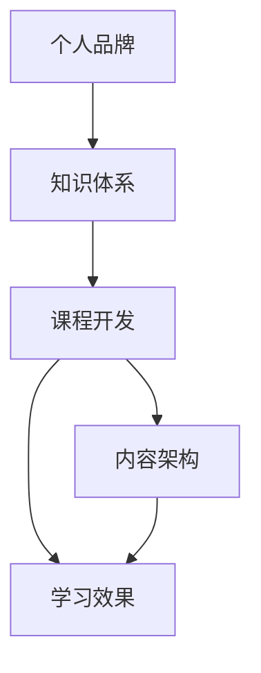

                 

# 开发个人品牌课程：系统化你的知识体系

> 关键词：个人品牌,知识体系,课程开发,内容架构,学习效果

## 1. 背景介绍

在当今快速发展的信息技术时代，个人品牌已成为个体在职业和社交环境中获取竞争优势的关键。无论是IT技术专家、企业高管还是创业者，强大的个人品牌能显著提升自身影响力，拓展更多职业机会。然而，要建立一个系统化、差异化的个人品牌，不仅仅需要技术和市场洞察力，更需要系统化的知识体系和方法论。本文将深入探讨如何开发个人品牌课程，通过系统化知识体系，打造有深度、有广度、有创新力的个人品牌。

## 2. 核心概念与联系

### 2.1 核心概念概述

构建个人品牌课程的核心概念主要包括：

- **个人品牌**：个体在专业领域内树立的形象、声誉和认可度，体现其专业能力和独特价值。
- **知识体系**：将知识进行分类、组织和链接，构建起系统的知识结构，方便检索和使用。
- **课程开发**：通过精心设计课程内容、教学方法和评估标准，系统化传授知识，提升学习效果。
- **内容架构**：课程内容的组织和布局，包括模块划分、章节编排、案例分析等。
- **学习效果**：课程设计的最终目标，即学生能掌握核心知识、提升技能、形成持续学习的动力。

这些概念之间紧密联系，共同构成了个人品牌课程的开发框架。

### 2.2 核心概念原理和架构的 Mermaid 流程图



这个流程图展示了个体品牌建设与课程开发的关系。个体品牌构建首先需要系统的知识体系支撑，通过课程开发，将知识体系转化为易于传授和学习的课程内容，最终提升学习效果，形成良性循环。

## 3. 核心算法原理 & 具体操作步骤

### 3.1 算法原理概述

开发个人品牌课程的核心算法原理可以概括为以下几个步骤：

1. **需求分析**：了解目标学习者的需求、背景和目标，确定课程的知识深度和广度。
2. **内容策划**：根据需求分析结果，策划课程内容，包括基础知识、进阶技能、实践案例等。
3. **结构设计**：设计课程结构，包括模块划分、章节编排、教学方法等，确保内容的连贯性和逻辑性。
4. **效果评估**：设定评估标准，通过测试、作业、反馈等手段，持续评估学习效果，迭代改进课程内容。

### 3.2 算法步骤详解

1. **需求分析**
   - **目标受众分析**：调研目标受众的基本情况，如年龄、职业、背景、学习动机等。
   - **需求收集**：通过问卷调查、访谈等方式，收集学习者对课程的需求和期望。
   - **市场调研**：分析当前市场上的同类课程，找出优点和不足，明确课程差异化优势。

2. **内容策划**
   - **内容规划**：确定课程的目标和主题，列出需要教授的核心知识点和技能点。
   - **资源整合**：搜集并整合相关教学资源，如教材、视频、练习题等，确保内容的丰富性和多样性。
   - **内容创新**：引入最新技术、案例分析、行业趋势等内容，提升课程的实用性和前沿性。

3. **结构设计**
   - **模块划分**：将课程内容划分为若干模块，每个模块聚焦一个核心主题或技能。
   - **章节编排**：在每个模块下编排具体的章节和子模块，确保内容的系统性和连贯性。
   - **教学方法**：选择适合的教学方法，如讲授、案例分析、项目实践等，提升教学效果。

4. **效果评估**
   - **评估标准设定**：明确课程的评估标准，包括知识掌握程度、技能应用能力、创新思维等。
   - **测试设计**：设计不同类型的测试题，如选择题、开放题、项目作业等，全面评估学习效果。
   - **反馈收集与改进**：通过学习者反馈、教师评语等方式，收集课程效果反馈，持续优化课程内容。

### 3.3 算法优缺点

#### 优点
- **系统化教学**：通过系统化的课程设计，确保学习者掌握全面的知识体系和技能。
- **目标导向**：明确课程目标和评估标准，帮助学习者有针对性地学习，提升学习效果。
- **内容丰富**：融合最新技术和行业案例，使课程内容更具实用性和前沿性。

#### 缺点
- **设计复杂**：课程开发涉及多方面需求和资源的整合，设计复杂。
- **需要持续优化**：课程内容和教学方法需要根据反馈和市场变化进行迭代和优化。

### 3.4 算法应用领域

个人品牌课程开发适用于多种场景，包括但不限于：

- **IT技术培训**：针对软件开发、数据科学、人工智能等IT领域，系统化传授知识和技能。
- **企业管理培训**：涵盖领导力、项目管理、战略规划等企业管理的多个方面。
- **创业者教育**：从市场分析、产品开发到营销策略，全面提升创业者的综合能力。
- **个人兴趣拓展**：通过编程、设计、艺术等领域的课程，提升个人兴趣和综合素质。

## 4. 数学模型和公式 & 详细讲解 & 举例说明

### 4.1 数学模型构建

个人品牌课程的开发可以抽象为数学模型：

$$
C = F(S, T, E)
$$

其中：
- $C$ 表示课程内容（Curriculum Content）。
- $S$ 表示学习者需求（Student Demand）。
- $T$ 表示教学资源（Teaching Resources）。
- $E$ 表示评估标准（Evaluation Standards）。

### 4.2 公式推导过程

通过上述数学模型，我们可以推导出课程开发的基本步骤：

1. **需求分析**：根据市场和受众需求，定义 $S$。
2. **内容策划**：根据需求，定义 $S$ 和 $T$，整合资源。
3. **结构设计**：对 $C$ 进行模块划分和章节编排，形成 $C$ 的逻辑结构。
4. **效果评估**：根据 $C$ 设计评估标准 $E$，并不断迭代优化。

### 4.3 案例分析与讲解

假设我们要开发一门针对初学者的Python编程课程。通过需求分析，我们发现目标受众为IT初学者，希望掌握Python基础知识和实际应用能力。

1. **需求分析**：
   - **学习者背景**：无编程基础，希望快速上手Python。
   - **目标受众**：IT初学者，希望提升编程技能，应用于实际项目。
   - **市场需求**：市场上有大量Python课程，但适合初学者的优质课程相对较少。

2. **内容策划**：
   - **内容规划**：包含基础语法、数据结构、面向对象编程、函数式编程、实际项目应用等。
   - **资源整合**：整合Python官方文档、PEP标准、在线视频、练习题等资源。
   - **内容创新**：引入Python在数据分析、机器学习、网络爬虫等领域的实际应用案例。

3. **结构设计**：
   - **模块划分**：分为基础篇、进阶篇和项目实战篇。
   - **章节编排**：基础篇包含基础语法、数据结构、面向对象编程；进阶篇包含函数式编程、设计模式；项目实战篇包含数据分析、机器学习、网络爬虫等。
   - **教学方法**：采用视频讲解、编程练习、项目实战等多种教学方法。

4. **效果评估**：
   - **评估标准**：知识掌握程度、项目实践能力、创新思维等。
   - **测试设计**：选择选择题、编程题、项目作业等不同类型的测试题。
   - **反馈收集与改进**：通过学习者反馈、教师评语等方式，持续优化课程内容。

## 5. 项目实践：代码实例和详细解释说明

### 5.1 开发环境搭建

- **编程语言**：Python 3.x
- **IDE选择**：Visual Studio Code、PyCharm等

安装Python和相关依赖包，配置开发环境：

1. 安装Python：
```bash
sudo apt-get update
sudo apt-get install python3
```

2. 安装依赖包：
```bash
pip install numpy pandas scikit-learn matplotlib
```

3. 配置IDE：
   - **Visual Studio Code**：安装Python插件和相关扩展。
   - **PyCharm**：创建虚拟环境，安装Python包。

### 5.2 源代码详细实现

以下是一个简单的Python课程结构设计的代码实现：

```python
# 课程结构设计类
class CourseStructure:
    def __init__(self, name, modules):
        self.name = name
        self.modules = modules
    
    def add_module(self, module_name, chapters):
        self.modules[module_name] = chapters
    
    def print_structure(self):
        print(f"Course: {self.name}")
        for module, chapters in self.modules.items():
            print(f"Module: {module}")
            for chapter in chapters:
                print(f"Chapter: {chapter}")

# 创建课程结构
course = CourseStructure("Python编程入门", {
    "基础篇": ["基础语法", "数据结构", "面向对象编程"],
    "进阶篇": ["函数式编程", "设计模式"],
    "项目实战篇": ["数据分析", "机器学习", "网络爬虫"]
})

# 打印课程结构
course.print_structure()
```

### 5.3 代码解读与分析

- **课程结构类定义**：定义了课程结构的类，包含课程名称和模块划分。
- **模块添加方法**：通过 `add_module` 方法，向课程结构中添加模块和章节。
- **打印方法**：通过 `print_structure` 方法，输出课程结构。

### 5.4 运行结果展示

```bash
Course: Python编程入门
Module: 基础篇
Chapter: 基础语法
Chapter: 数据结构
Chapter: 面向对象编程
Module: 进阶篇
Chapter: 函数式编程
Chapter: 设计模式
Module: 项目实战篇
Chapter: 数据分析
Chapter: 机器学习
Chapter: 网络爬虫
```

## 6. 实际应用场景

### 6.1 企业培训

在企业内部，利用个人品牌课程进行员工培训，可以显著提升团队整体素质和竞争力。例如，某科技公司通过开发并实施Python编程课程，使员工从零开始掌握Python，并应用于实际项目中，大大提高了公司技术水平和创新能力。

### 6.2 在线教育

在线教育平台可以通过个人品牌课程，吸引更多学习者，提升平台品牌影响力。例如，Coursera和Udacity等平台，推出了多个高品质的个人品牌课程，通过系统化教学和互动式学习，帮助学习者全面提升技能，实现职业转型。

### 6.3 个人兴趣拓展

个人兴趣拓展课程，如编程、设计、艺术等，能帮助个人全面发展，提升综合素质。例如，某开发者通过参加Python编程课程，不仅提升了自己的技术能力，还拓展了在数据分析、机器学习等领域的兴趣和应用场景。

### 6.4 未来应用展望

未来，个人品牌课程将继续深化应用，体现在以下几个方面：

- **多样化内容**：课程内容将更加多样化，涵盖更多的技术和行业领域。
- **互动式学习**：采用在线互动、实时反馈等方式，提升学习效果。
- **个性化推荐**：根据学习者的背景和兴趣，推荐个性化的课程内容。
- **跨平台支持**：课程内容可以在多个平台（如PC、手机、平板等）上访问和使用。

## 7. 工具和资源推荐

### 7.1 学习资源推荐

1. **Coursera、Udacity等在线教育平台**：提供丰富的课程资源，涵盖各个领域的个人品牌课程。
2. **Udemy**：提供多种技术领域的课程，便于快速入门和学习。
3. **edX**：提供高质量的课程内容，涵盖各个学科和行业。

### 7.2 开发工具推荐

1. **Visual Studio Code**：轻量级、高效、可扩展的IDE，适合个人品牌课程的开发。
2. **PyCharm**：强大的Python IDE，支持虚拟环境、调试、版本控制等。
3. **Git**：版本控制系统，方便团队协作和代码管理。

### 7.3 相关论文推荐

1. **《Effective Course Design: A Research-Based Approach》**：探讨课程设计的理论和实践方法，适合课程开发者阅读。
2. **《Designing Instruction for Learning: A Taxonomy of Interactive Learning Experiences》**：介绍教学设计的基本原则和方法，提供系统化课程开发的指导。
3. **《A Comprehensive Guide to Developing Online Courses》**：涵盖在线课程开发的各个环节，包括需求分析、内容设计、技术实现等。

## 8. 总结：未来发展趋势与挑战

### 8.1 研究成果总结

通过上述探讨，我们了解到开发个人品牌课程的重要性，并掌握了系统化知识体系的方法论。个人品牌课程的开发不仅能提升个人素质和职业竞争力，还能为组织和行业的发展注入新的活力。

### 8.2 未来发展趋势

未来，个人品牌课程的发展将呈现以下趋势：

- **内容迭代**：课程内容将不断更新，引入最新的技术和行业知识。
- **多渠道分发**：课程内容可以在多个平台和设备上访问，提升用户体验。
- **社区互动**：通过在线社区和互动学习，提升学习效果和社交价值。

### 8.3 面临的挑战

尽管个人品牌课程开发前景广阔，但仍面临以下挑战：

- **资源投入**：课程开发需要大量时间和资源，特别是优质教学资源和内容。
- **市场需求匹配**：课程内容和市场需求的匹配需要持续研究和调整。
- **学习效果评估**：如何全面、客观地评估学习效果，提升课程质量和用户满意度。

### 8.4 研究展望

未来的个人品牌课程开发研究，需要在以下几个方面进行深入探索：

- **技术支持**：开发更多的技术工具和平台，支持课程内容的制作和分发。
- **个性化学习**：利用人工智能和大数据技术，实现个性化推荐和学习路径优化。
- **社会影响评估**：评估课程对个人和社会的长期影响，确保其积极性和可持续性。

## 9. 附录：常见问题与解答

**Q1: 个人品牌课程开发需要哪些资源？**

A: 个人品牌课程开发需要以下资源：
1. 时间：课程开发需要大量的时间和精力。
2. 知识：课程开发者需要掌握系统化知识体系和教学方法。
3. 技术：需要掌握编程语言、IDE、Git等技术工具。
4. 教学资源：搜集和整合相关教学资源，如教材、视频、练习题等。

**Q2: 如何评估个人品牌课程的效果？**

A: 个人品牌课程效果的评估可以从以下几个方面进行：
1. 学习者反馈：通过问卷调查、访谈等方式，收集学习者的反馈和建议。
2. 测试结果：设计不同类型的测试题，如选择题、编程题、项目作业等，评估学习者的知识掌握程度。
3. 项目实践：通过项目实战，评估学习者将所学知识应用于实际项目的能力。
4. 持续学习：评估学习者是否持续参与后续课程和进阶学习。

**Q3: 如何设计互动式学习体验？**

A: 设计互动式学习体验可以从以下几个方面进行：
1. 在线互动：采用在线讨论、实时答疑等方式，增加学习者之间的互动和交流。
2. 小组学习：分组进行项目合作，提升团队协作和沟通能力。
3. 实验和模拟：通过编程实验、模拟场景等方式，增强学习者的动手能力和应用能力。

**Q4: 如何利用人工智能技术提升课程效果？**

A: 利用人工智能技术可以提升课程效果的几个方面：
1. 个性化推荐：通过数据分析，推荐个性化的学习内容和路径。
2. 自动化评估：使用AI工具自动评估学习者的测试结果和作业质量。
3. 智能答疑：通过AI问答系统，实时解答学习者的疑问。
4. 学习路径优化：利用AI技术优化学习路径，提升学习效率和效果。

**Q5: 如何平衡课程的深度和广度？**

A: 平衡课程的深度和广度需要考虑以下几个方面：
1. 目标受众：根据学习者的背景和目标，确定课程的深度和广度。
2. 内容层次：设计合理的课程层次结构，基础篇重点介绍基础知识，进阶篇深入讲解复杂技术，实战篇应用实际项目。
3. 时间和资源：合理安排课程时间和资源，确保课程内容的有效传递。

---

作者：禅与计算机程序设计艺术 / Zen and the Art of Computer Programming

