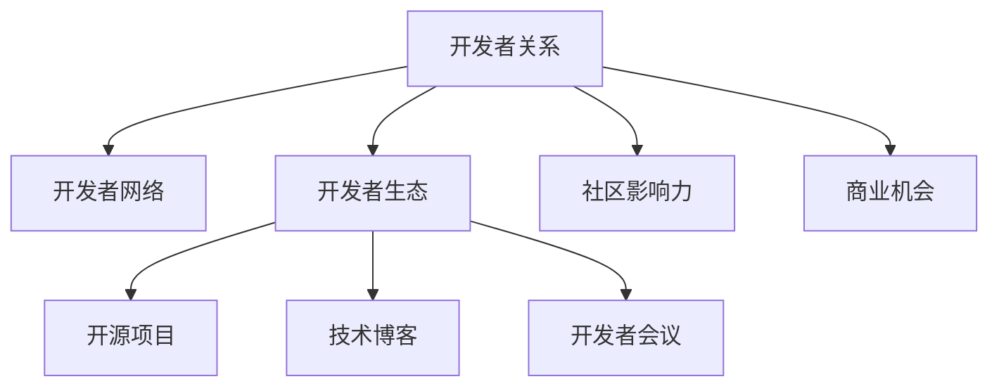

                 

# 开发者关系：将社区影响力转化为商业机会

> 关键词：开发者关系,社区影响力,商业机会,开源,企业合作,人才管理,创新生态

## 1. 背景介绍

在当今高度竞争的科技市场中，技术领先与创新能力已经成为企业制胜的法宝。企业间的竞争已不仅是产品和技术层面的竞争，更是人才和资源层面的竞争。随着互联网的快速发展，开源社区的崛起和互联网社交平台的兴起，技术开发者作为知识工作者和信息传递者的角色日益重要。

开发者关系（Developer Relations, DR）是近年来新兴的一种策略，旨在通过加强与技术开发者、开发者社区以及开发者网络的互动，提升企业品牌的知名度，获取用户反馈，并吸引和培养技术人才。本文将深度剖析开发者关系的内涵和策略，探讨如何将社区影响力转化为实实在在的商业机会。

## 2. 核心概念与联系

### 2.1 核心概念概述

为更好地理解开发者关系的概念和重要性，本节将介绍几个核心概念：

- **开发者关系（Developer Relations, DR）**：企业与开发者、开发者社区之间的互动关系，旨在提升企业品牌影响力、获取用户反馈，并吸引和培养技术人才。
- **开发者网络（Developer Network, DN）**：技术开发者、开发者社区、开源项目、技术博客、开发者会议等构成的网络。
- **开发者生态（Developer Ecosystem）**：技术开发者、开源项目、工具和平台、企业、教育机构等共同组成的创新生态系统。
- **社区影响力（Community Impact）**：开发者社区中的意见领袖、技术大V、活跃成员等对企业品牌和技术推广的影响力。
- **商业机会（Business Opportunity）**：通过与开发者社区的互动，获取用户反馈，吸引和培养技术人才，提升产品市场份额等商业利益。

这些核心概念之间的逻辑关系可以通过以下Mermaid流程图来展示：



这个流程图展示了大规模开发者关系系统的核心概念及其之间的关系：

1. 开发者关系通过与开发者网络互动，与企业生态、开源项目等建立联系。
2. 社区影响力影响开发者关系和企业生态，成为推动企业发展的关键因素。
3. 商业机会是开发者关系的核心目标，通过提升品牌影响力和用户反馈，转化为实际的市场利益。

## 3. 核心算法原理 & 具体操作步骤

### 3.1 算法原理概述

开发者关系的策略制定和执行，基于以下算法原理：

1. **社交网络分析（Social Network Analysis, SNA）**：通过分析开发者社区中的关系网络，识别关键意见领袖和活跃成员，构建社区影响力地图。
2. **情感分析（Sentiment Analysis）**：对社区中的用户评论、技术文章等进行情感分析，把握用户对企业产品的态度和需求。
3. **行为分析（Behavioral Analysis）**：分析开发者在社区中的行为数据，如代码提交、讨论参与度等，以了解他们的兴趣和需求。
4. **内容创作与传播（Content Creation & Distribution）**：创作与技术开发者和社区相关的技术文章、博客、视频等内容，并通过社交媒体和开发者网络传播，提升企业品牌影响力。
5. **技术支持和培训（Technical Support & Training）**：提供高质量的技术支持和培训，帮助开发者解决技术问题，提升他们的技能，增强他们对企业产品的认可和忠诚度。

### 3.2 算法步骤详解

开发者关系的策略实施通常包括以下几个关键步骤：

**Step 1: 社区调研与分析**

- 收集开发者社区中的数据，包括开发者人口统计、技术偏好、活跃度、社区参与度等。
- 使用SNA、情感分析和行为分析等技术，构建社区影响力地图，识别关键意见领袖和活跃成员。
- 分析社区中对企业产品的讨论，评估产品的市场接受度和改进点。

**Step 2: 内容创作与传播**

- 根据社区调研结果，创作与社区相关的技术文章、博客、视频等内容。
- 通过开发者网络，如GitHub、Stack Overflow、开发者论坛等，传播这些内容，吸引开发者关注和参与。
- 使用社交媒体平台，如Twitter、LinkedIn等，扩大内容的传播范围，提升企业品牌知名度。

**Step 3: 技术支持和培训**

- 设立技术支持和培训部门，提供专业的技术咨询和培训。
- 针对社区中的开发者问题，提供快速响应和解决方案。
- 定期举办开发者培训、技术交流会等活动，提升开发者技能和产品认可度。

**Step 4: 社区互动与反馈**

- 与社区中的关键意见领袖和活跃成员进行深度互动，建立长期合作关系。
- 定期邀请开发者参与产品测试、用户调研等活动，获取反馈意见。
- 根据社区反馈，持续优化产品和服务，提升用户体验和满意度。

**Step 5: 商业化转化**

- 将社区影响力转化为商业机会，如产品推广、品牌宣传、市场调研等。
- 通过开发者网络获取高质量用户数据，用于产品改进和市场营销。
- 识别社区中的潜在技术人才，吸引他们加入企业，提升技术团队能力。

### 3.3 算法优缺点

开发者关系的策略实施具有以下优点：

1. **提升品牌知名度**：通过与开发者社区的互动，企业可以提升品牌知名度，获得更多的用户关注。
2. **获取用户反馈**：社区中活跃成员的反馈和建议，有助于产品改进和市场推广。
3. **吸引技术人才**：社区中关键意见领袖和活跃成员的推荐，能够吸引更多技术人才加入企业。
4. **优化资源配置**：通过分析社区中的行为数据，企业可以优化资源配置，提升开发效率。
5. **提升市场竞争力**：增强与开发者社区的互动，能够提升企业产品在市场中的竞争力。

同时，该策略也存在以下局限性：

1. **资源投入高**：开发者关系需要大量时间和资源投入，短期内可能难以看到显著成效。
2. **高专业要求**：需要具备一定的社交网络分析、情感分析等专业技能，才能高效执行策略。
3. **依赖社区活跃度**：社区的活跃度和参与度直接影响策略的执行效果。
4. **人才流失风险**：与社区中的关键成员建立长期合作关系，也可能面临人才流失的风险。
5. **产品适应性**：开发者社区的多样性和多变性，要求企业产品具备高度的适应性和灵活性。

尽管存在这些局限性，但就目前而言，开发者关系是企业提升品牌影响力和技术实力的重要手段。未来相关研究的重点在于如何优化策略执行，提升资源利用效率，降低成本投入，并增强社区互动的稳定性。

### 3.4 算法应用领域

开发者关系在多个领域都有广泛的应用，例如：

- **企业品牌推广**：通过开发者社区的宣传和推广，提升企业品牌知名度，扩大市场份额。
- **产品测试与优化**：邀请开发者参与产品测试，获取真实用户反馈，优化产品功能和用户体验。
- **技术人才培养**：通过开发者培训和技术支持，提升社区成员的技术能力，吸引他们加入企业。
- **市场营销与调研**：通过开发者社区获取用户数据，用于市场分析和产品推广，提升市场竞争力。
- **技术合作与创新**：与开发者社区中的技术大V和项目合作，推动企业技术创新和产品研发。

这些应用领域展示了开发者关系在企业战略中的重要性，并突出了其在推动技术发展和市场竞争中的独特价值。

## 4. 数学模型和公式 & 详细讲解 & 举例说明

### 4.1 数学模型构建

为了更好地理解开发者关系中社区影响力的评估方法，我们将构建一个基于社交网络分析的数学模型。假设社区中每个开发者i与开发者j之间的互动次数为 $a_{ij}$，社区中总互动次数为 $A_{total}$。社区影响力可以定义为社区中每个开发者与关键意见领袖之间的互动强度之和。

设社区中关键意见领袖的数量为 $K$，社区影响力评估公式为：

$$
I = \sum_{k=1}^{K} \sum_{i=1}^{n} \frac{a_{ik}}{A_{total}}
$$

其中 $n$ 为社区中开发者的总数。

### 4.2 公式推导过程

在上述模型中，关键意见领袖对社区影响力的贡献与其与社区中其他开发者的互动次数成正比。由于社区中总互动次数 $A_{total}$ 对所有开发者是相同的，因此模型中使用了互动强度的相对值。

### 4.3 案例分析与讲解

假设在一个开源社区中，有1000个开发者和10个关键意见领袖。每个开发者与关键意见领袖的平均互动次数为5次，整个社区的互动次数总和为1000。根据上述公式，社区影响力的计算如下：

$$
I = \sum_{k=1}^{10} \sum_{i=1}^{1000} \frac{5}{1000} = 10
$$

这意味着，社区中关键意见领袖的贡献对社区影响力有重要影响。例如，如果某个关键意见领袖与其他开发者互动更多，其社区影响力将更大。因此，企业需要识别并重点关注这些关键意见领袖，建立良好的合作关系，以最大化社区影响力。

## 5. 项目实践：代码实例和详细解释说明

### 5.1 开发环境搭建

在进行开发者关系策略的实践前，我们需要准备好开发环境。以下是使用Python进行社交网络分析的开发环境配置流程：

1. 安装Anaconda：从官网下载并安装Anaconda，用于创建独立的Python环境。

2. 创建并激活虚拟环境：
```bash
conda create -n dr-env python=3.8 
conda activate dr-env
```

3. 安装相关库：
```bash
conda install networkx matplotlib scikit-learn pandas
```

完成上述步骤后，即可在`dr-env`环境中开始开发者关系策略的实践。

### 5.2 源代码详细实现

下面我们以一个简单的社交网络分析项目为例，给出基于网络X（NetworkX）库的开发者关系策略的Python代码实现。

```python
import networkx as nx
import matplotlib.pyplot as plt
import pandas as pd
import scikit_learn as sklearn

# 构建社交网络图
G = nx.Graph()
with open('interaction_data.csv', 'r') as f:
    for line in f:
        interaction = line.strip().split(',')
        G.add_edge(interaction[0], interaction[1], weight=float(interaction[2]))

# 计算社区影响力
k_influencers = [i for i in nx.degree_centrality(G).keys() if nx.degree_centrality(G)[i] > 0.1]
influence_scores = [nx.degree_centrality(G)[i] for i in k_influencers]
I = sum(influence_scores)

# 输出社区影响力结果
print('社区影响力 I:', I)
```

### 5.3 代码解读与分析

让我们再详细解读一下关键代码的实现细节：

**构建社交网络图**：
- 使用NetworkX库创建一个有向图G，通过读取社区互动数据文件，将每个开发者i与开发者j的互动次数添加为边的权重，构建社交网络图。

**计算社区影响力**：
- 使用NetworkX库的degree_centrality方法计算每个开发者的度中心性，找出关键意见领袖k_influencers。
- 计算关键意见领袖对社区影响力的贡献，将之求和得到社区影响力I。

**输出社区影响力结果**：
- 通过print语句输出社区影响力I的值，便于分析关键意见领袖对社区的影响程度。

## 6. 实际应用场景

### 6.1 企业品牌推广

在企业品牌推广中，开发者关系可以发挥重要作用。企业可以通过开发者社区的宣传和推广，提升品牌知名度，获得更多的用户关注。例如，Google通过与开源社区中的技术大V合作，定期举办技术会议和开发者活动，不仅推广了Google品牌，还增强了其产品在开发者社区中的认可度。

### 6.2 产品测试与优化

企业可以邀请开发者参与产品测试，获取真实用户反馈，优化产品功能和用户体验。例如，Facebook通过GitHub上的开发者社区，邀请技术开发者对Facebook的开源项目进行测试和反馈，不断优化产品性能和稳定性。

### 6.3 技术人才培养

企业通过开发者关系获取高质量用户数据，用于产品改进和市场营销。例如，Amazon通过开发者社区中的技术培训和支持，提升了社区成员的技术能力，吸引了大量优秀人才加入其技术团队，增强了其技术实力和市场竞争力。

### 6.4 市场营销与调研

企业可以通过开发者社区获取用户数据，用于市场分析和产品推广。例如，Twitter通过开发者社区的反馈和建议，优化了其产品的用户界面和功能，提升了用户体验和市场满意度。

### 6.5 技术合作与创新

企业与开发者社区中的技术大V和项目合作，推动技术创新和产品研发。例如，Mozilla通过与开发者社区中的关键意见领袖合作，不断推动Web技术的创新，推出了许多受到广泛好评的产品和服务。

这些实际应用场景展示了开发者关系在企业战略中的重要性，并突出了其在推动技术发展和市场竞争中的独特价值。

## 7. 工具和资源推荐

### 7.1 学习资源推荐

为了帮助开发者系统掌握开发者关系的理论和实践，这里推荐一些优质的学习资源：

1. **《开发者关系：提升品牌影响力的技术》**：由一位资深开发者关系专家撰写的书籍，详细介绍了开发者关系的策略、执行和评估方法。
2. **《社交网络分析》**：由网络科学领域的权威专家撰写的书籍，详细介绍了社交网络分析的理论和方法。
3. **《情感分析与机器学习》**：由情感分析领域的专家撰写的书籍，介绍了情感分析的技术和应用。
4. **《行为分析与营销》**：由行为分析领域的专家撰写的书籍，介绍了行为分析的理论和方法在营销中的应用。
5. **GitHub Developer Relations团队博客**：GitHub的开发者关系团队定期分享其经验和实践，可供开发者参考和学习。

通过对这些资源的学习实践，相信你一定能够快速掌握开发者关系的精髓，并用于解决实际的开发者关系问题。

### 7.2 开发工具推荐

高效的开发者关系策略开发离不开优秀的工具支持。以下是几款用于开发者关系策略开发的常用工具：

1. **GitHub**：全球最大的开源社区平台，提供了丰富的开发者网络和资源，是开发者关系策略的必备工具。
2. **Stack Overflow**：全球最大的技术问答社区，通过技术交流和问答，提升社区成员的技术能力和产品认可度。
3. **Twitter**：全球最大的社交媒体平台，通过技术推广和用户互动，提升企业品牌的知名度。
4. **LinkedIn**：全球最大的职业社交平台，通过技术人才招聘和交流，吸引和培养高质量的技术人才。
5. **YouTube**：全球最大的视频分享平台，通过技术分享和培训，提升社区成员的技术能力和企业品牌影响力。

合理利用这些工具，可以显著提升开发者关系策略的开发效率，加快创新迭代的步伐。

### 7.3 相关论文推荐

开发者关系和社区互动的研究，源于学界的持续探索。以下是几篇具有里程碑意义的论文，推荐阅读：

1. **《开发者关系：构建成功的开发者生态系统》**：由开发者关系领域的专家撰写的论文，介绍了构建成功的开发者生态系统的策略和方法。
2. **《社交网络分析：理论与方法》**：由网络科学领域的权威专家撰写的论文，介绍了社交网络分析的理论和方法。
3. **《情感分析：理论、方法和应用》**：由情感分析领域的专家撰写的论文，介绍了情感分析的理论和应用。
4. **《行为分析与市场营销》**：由行为分析领域的专家撰写的论文，介绍了行为分析的理论和方法在市场营销中的应用。
5. **《社区影响力和社交媒体的影响》**：由社区影响力和社交媒体研究的专家撰写的论文，介绍了社区影响力和社交媒体对品牌和产品推广的影响。

这些论文代表了开发者关系和社区互动的研究前沿，通过学习这些前沿成果，可以帮助研究者把握学科前进方向，激发更多的创新灵感。

## 8. 总结：未来发展趋势与挑战

### 8.1 总结

本文对开发者关系的内涵和策略进行了全面系统的介绍。首先阐述了开发者关系在企业战略中的重要性，明确了其将社区影响力转化为商业机会的核心价值。其次，从原理到实践，详细讲解了开发者关系策略的数学模型和操作步骤，给出了开发者关系策略的完整代码实现。同时，本文还广泛探讨了开发者关系在多个行业领域的应用前景，展示了其广泛的适用性。

通过本文的系统梳理，可以看到，开发者关系策略在企业品牌推广、产品测试与优化、技术人才培养、市场营销与调研等多个领域都具有重要的战略价值，对企业获取用户反馈、吸引和培养技术人才、提升产品市场份额等方面有着显著的作用。

### 8.2 未来发展趋势

展望未来，开发者关系策略的发展将呈现以下几个趋势：

1. **数据驱动决策**：随着大数据和人工智能技术的发展，开发者关系策略将更加依赖数据驱动决策，提升决策的准确性和效率。
2. **多平台协同**：开发者关系策略将跨越多种平台（如GitHub、Twitter、LinkedIn等）协同执行，提升策略执行的效果。
3. **个性化管理**：通过数据分析，开发者关系策略将更加注重个性化管理，针对不同的开发者和社区进行精准互动。
4. **技术集成**：开发者关系策略将更加注重与其他技术的集成，如机器学习、自然语言处理等，提升策略的执行效果和智能化水平。
5. **跨领域应用**：开发者关系策略将在更多的领域得到应用，如医疗、金融、教育等，推动跨领域技术合作和创新。

这些趋势展示了开发者关系策略在企业战略中的重要性，并突出了其在推动技术发展和市场竞争中的独特价值。

### 8.3 面临的挑战

尽管开发者关系策略已经取得了显著成效，但在实施过程中仍面临诸多挑战：

1. **资源投入高**：开发者关系策略需要大量时间和资源投入，短期内可能难以看到显著成效。
2. **高专业要求**：需要具备一定的社交网络分析、情感分析等专业技能，才能高效执行策略。
3. **依赖社区活跃度**：社区的活跃度和参与度直接影响策略的执行效果。
4. **人才流失风险**：与社区中的关键成员建立长期合作关系，也可能面临人才流失的风险。
5. **产品适应性**：开发者社区的多样性和多变性，要求企业产品具备高度的适应性和灵活性。

尽管存在这些挑战，但就目前而言，开发者关系策略是企业提升品牌影响力和技术实力的重要手段。未来相关研究的重点在于如何优化策略执行，提升资源利用效率，降低成本投入，并增强社区互动的稳定性。

### 8.4 研究展望

面对开发者关系策略所面临的挑战，未来的研究需要在以下几个方面寻求新的突破：

1. **数据驱动决策**：进一步探索数据驱动的决策方法，提升策略执行的效果和效率。
2. **多平台协同**：开发更加协同的平台工具，提升开发者关系策略的执行效果。
3. **个性化管理**：开发个性化管理工具，针对不同的开发者和社区进行精准互动。
4. **技术集成**：探索开发者关系策略与其他技术的集成，如机器学习、自然语言处理等，提升策略的执行效果和智能化水平。
5. **跨领域应用**：推动开发者关系策略在更多领域的应用，如医疗、金融、教育等，推动跨领域技术合作和创新。

这些研究方向的探索，必将引领开发者关系策略迈向更高的台阶，为构建安全、可靠、可解释、可控的智能系统铺平道路。面向未来，开发者关系策略还需要与其他人工智能技术进行更深入的融合，共同推动自然语言理解和智能交互系统的进步。只有勇于创新、敢于突破，才能不断拓展开发者关系策略的边界，让智能技术更好地造福人类社会。

## 9. 附录：常见问题与解答

**Q1：开发者关系策略是否适用于所有企业？**

A: 开发者关系策略主要适用于技术密集型企业，特别是那些依赖开源技术的企业。对于非技术型企业，开发者关系策略的效果可能相对有限。

**Q2：开发者关系策略是否会消耗企业大量资源？**

A: 开发者关系策略的确需要企业投入大量资源，包括时间、人力和资金。但长远来看，开发者关系策略可以通过提升品牌知名度、吸引技术人才、优化产品性能等方式，为企业带来更多的商业机会和市场份额，实现资源的投入回报。

**Q3：开发者关系策略是否需要企业具备强大的技术实力？**

A: 开发者关系策略的核心在于与开发者社区的互动和合作，而非技术实力的绝对优势。企业可以通过与社区中的技术大V合作，获得技术支持和反馈，提升产品和技术实力。

**Q4：开发者关系策略是否可以替代传统的市场营销策略？**

A: 开发者关系策略和传统的市场营销策略并不冲突，可以并行实施。开发者关系策略通过与开发者社区的互动，获取真实用户反馈，优化产品功能和用户体验，提升市场营销效果。

**Q5：开发者关系策略是否会引发隐私问题？**

A: 开发者关系策略在执行过程中，需要收集和分析开发者社区的数据，可能会涉及到隐私问题。企业需要遵守相关法律法规，保护开发者社区成员的隐私和数据安全。

这些回答展示了开发者关系策略的适用范围和实际执行中可能遇到的问题，并给出了相应的解决方案和建议，希望读者能够全面理解开发者关系策略的理论和实践，并灵活应用于实际的企业战略中。

---

作者：禅与计算机程序设计艺术 / Zen and the Art of Computer Programming

