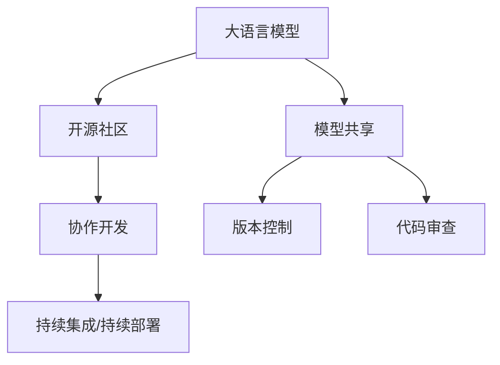

                 

# 开源 LLM：共享和协作开发

> 关键词：大语言模型(LLM), 协作开发, 模型共享, 开源生态, 软件工程, 社区治理, 安全与合规

## 1. 背景介绍

在过去的几年里，大语言模型(Large Language Models, LLMs)，如GPT-3、BERT等，以其强大的自然语言处理能力，在NLP领域引发了一场革命。这些模型基于大规模无标签文本数据进行自监督预训练，学到了丰富的语言知识和常识，能够用于各种NLP任务，如文本分类、机器翻译、对话系统等。然而，随着模型的规模和复杂度不断增加，单一机构或团队难以独立完成这些模型的开发、训练和部署。开源协作开发模式，作为大语言模型开发的重要实践，逐渐成为行业内的主流。

开源协作开发，即基于开源社区的协作开发模式，强调代码、模型、文档等资源的共享，利用社区成员的多样化背景和技术优势，推动模型快速迭代和创新，最大化模型性能和应用范围。开源社区作为技术创新的温床，提供了丰富的模型资源、工具和平台，助力企业快速开展模型开发和应用。本文将从背景、核心概念、算法原理和实践应用等方面，深入探讨开源LLM的协作开发模式。

## 2. 核心概念与联系

### 2.1 核心概念概述

为更好地理解开源LLM的协作开发模式，本节将介绍几个关键概念：

- 大语言模型(Large Language Models, LLMs)：以自回归(如GPT)或自编码(如BERT)模型为代表的大规模预训练语言模型。通过在大规模无标签文本语料上进行预训练，学习通用的语言表示，具备强大的语言理解和生成能力。

- 开源社区(Open Source Community)：基于开源许可证的协作开发平台，聚集了来自世界各地的开发者，共同维护和贡献代码、文档、工具等资源。

- 模型共享(Model Sharing)：将预训练模型、微调代码、API接口等资源公开，供社区成员自由使用，减少重复开发和资源浪费。

- 协作开发(Collaborative Development)：通过开源社区平台，支持社区成员共同开发、测试和优化模型，集成全球开发者的智慧和技术力量。

- 版本控制(Version Control)：通过如Git等版本控制系统，实现对模型代码的追踪、回退和分支管理，保障模型开发的有序性和可追溯性。

- 代码审查(Code Review)：社区成员对代码提交进行审核和评论，保证代码质量和规范性，促进代码共享和复用。

- 持续集成/持续部署(CI/CD)：通过自动化工具链，实现代码自动构建、测试和部署，提高模型开发效率和稳定性。

这些概念之间的逻辑关系可以通过以下Mermaid流程图来展示：



这个流程图展示了大语言模型的核心概念及其之间的关系：

1. 大语言模型通过开源社区的平台，将预训练模型、微调代码等资源公开，供社区成员使用。
2. 开源社区聚集了来自世界各地的开发者，共同开发、测试和优化模型，利用集体的智慧和技术力量。
3. 版本控制和代码审查等技术手段保障了模型开发的规范性和可追溯性。
4. 持续集成/持续部署保证了模型开发的高效性和稳定性。

这些概念共同构成了开源LLM的协作开发框架，使得大语言模型的开发过程更加透明、高效、稳定。

## 3. 核心算法原理 & 具体操作步骤
### 3.1 算法原理概述

基于开源协作开发的大语言模型微调，其核心思想是：将预训练模型的代码、模型参数和微调步骤公开，供社区成员基于相同的代码库，进行代码共享和协同开发。开源协作开发的具体步骤如下：

**Step 1: 建立代码库和文档**
- 选择合适的版本控制系统（如Git）建立代码库。
- 编写详细的文档，描述模型的基本架构、训练流程、评估指标等，供社区成员参考。

**Step 2: 公开预训练模型和微调代码**
- 将预训练模型及其权重、配置文件等公开，供社区成员下载和使用。
- 提供详细的微调代码和说明，包括模型初始化、数据处理、模型保存等步骤。

**Step 3: 搭建社区平台**
- 选择适合的协作开发平台（如GitHub、GitLab等），建立模型项目。
- 设置权限管理，定义代码审查流程，确保代码质量。

**Step 4: 进行代码贡献和评审**
- 社区成员提交代码修改，提交后接受社区其他成员的代码审查。
- 代码审查者评估代码质量，提出修改建议，确保代码规范性。

**Step 5: 自动化构建和部署**
- 使用CI/CD工具链，实现代码自动构建、测试和部署。
- 设定构建流程，自动生成模型预测、保存和导出等工具。

**Step 6: 持续迭代和优化**
- 通过模型性能评估和用户反馈，持续进行模型迭代和优化。
- 定期发布新的模型版本，更新社区文档和代码库。

### 3.2 算法步骤详解

以下将详细介绍开源LLM协作开发的具体步骤。

**Step 1: 建立代码库和文档**

1. 选择合适的版本控制系统（如Git），建立代码库。
2. 编写详细的文档，描述模型的基本架构、训练流程、评估指标等，供社区成员参考。

```python
# 示例代码库结构
project/
├── README.md
├── models/
│   ├── __init__.py
│   ├── base_model.py
│   └── pretrained_models/
│       ├── bert_base.py
│       └── gpt2_base.py
├── data/
│   ├── __init__.py
│   └── preprocess.py
├── train.py
├── evaluate.py
├── model_apis.py
├── docs/
│   ├── README.md
│   ├── model.md
│   └── usage.md
└── setup.py
```

**Step 2: 公开预训练模型和微调代码**

1. 将预训练模型及其权重、配置文件等公开，供社区成员下载和使用。
2. 提供详细的微调代码和说明，包括模型初始化、数据处理、模型保存等步骤。

```python
# 示例代码库内容
project/
├── README.md
├── models/
│   ├── __init__.py
│   ├── base_model.py
│   └── pretrained_models/
│       ├── bert_base.py
│       └── gpt2_base.py
├── data/
│   ├── __init__.py
│   └── preprocess.py
├── train.py
├── evaluate.py
├── model_apis.py
├── docs/
│   ├── README.md
│   ├── model.md
│   └── usage.md
└── setup.py
```

**Step 3: 搭建社区平台**

1. 选择适合的协作开发平台（如GitHub、GitLab等），建立模型项目。
2. 设置权限管理，定义代码审查流程，确保代码质量。

```python
# 示例代码库内容
project/
├── README.md
├── models/
│   ├── __init__.py
│   ├── base_model.py
│   └── pretrained_models/
│       ├── bert_base.py
│       └── gpt2_base.py
├── data/
│   ├── __init__.py
│   └── preprocess.py
├── train.py
├── evaluate.py
├── model_apis.py
├── docs/
│   ├── README.md
│   ├── model.md
│   └── usage.md
└── setup.py
```

**Step 4: 进行代码贡献和评审**

1. 社区成员提交代码修改，提交后接受社区其他成员的代码审查。
2. 代码审查者评估代码质量，提出修改建议，确保代码规范性。

```python
# 示例代码库内容
project/
├── README.md
├── models/
│   ├── __init__.py
│   ├── base_model.py
│   └── pretrained_models/
│       ├── bert_base.py
│       └── gpt2_base.py
├── data/
│   ├── __init__.py
│   └── preprocess.py
├── train.py
├── evaluate.py
├── model_apis.py
├── docs/
│   ├── README.md
│   ├── model.md
│   └── usage.md
└── setup.py
```

**Step 5: 自动化构建和部署**

1. 使用CI/CD工具链，实现代码自动构建、测试和部署。
2. 设定构建流程，自动生成模型预测、保存和导出等工具。

```python
# 示例代码库内容
project/
├── README.md
├── models/
│   ├── __init__.py
│   ├── base_model.py
│   └── pretrained_models/
│       ├── bert_base.py
│       └── gpt2_base.py
├── data/
│   ├── __init__.py
│   └── preprocess.py
├── train.py
├── evaluate.py
├── model_apis.py
├── docs/
│   ├── README.md
│   ├── model.md
│   └── usage.md
└── setup.py
```

**Step 6: 持续迭代和优化**

1. 通过模型性能评估和用户反馈，持续进行模型迭代和优化。
2. 定期发布新的模型版本，更新社区文档和代码库。

```python
# 示例代码库内容
project/
├── README.md
├── models/
│   ├── __init__.py
│   ├── base_model.py
│   └── pretrained_models/
│       ├── bert_base.py
│       └── gpt2_base.py
├── data/
│   ├── __init__.py
│   └── preprocess.py
├── train.py
├── evaluate.py
├── model_apis.py
├── docs/
│   ├── README.md
│   ├── model.md
│   └── usage.md
└── setup.py
```

### 3.3 算法优缺点

基于开源协作开发的大语言模型微调具有以下优点：

1. **协作开发**：利用社区成员的多样化背景和技术优势，共同开发、测试和优化模型，集全球智慧和技术力量。
2. **代码共享**：通过代码库和文档的共享，减少重复开发和资源浪费，提高模型开发的效率。
3. **开源生态**：搭建社区平台，提供工具链、平台、社区等支持，形成完善的生态系统。
4. **持续迭代**：通过社区的持续迭代和优化，模型性能和应用范围不断提升。

同时，该方法也存在以下缺点：

1. **版本冲突**：多个开发人员同时修改代码库，容易产生版本冲突。
2. **代码质量参差不齐**：社区成员的代码水平参差不齐，可能导致代码质量不均。
3. **依赖关系复杂**：依赖关系复杂，增加了代码管理和维护的难度。
4. **社区文化**：社区文化建设需要时间，初期可能存在沟通不足、文化差异等问题。

尽管存在这些缺点，但开源协作开发模式是大语言模型开发的重要实践，通过不断的社区建设和管理优化，可以有效缓解这些挑战，提升模型开发和部署的效率和质量。

### 3.4 算法应用领域

基于开源协作开发的大语言模型微调，已经在多个领域得到了广泛应用，包括但不限于：

- 自然语言处理(NLP)：如文本分类、机器翻译、情感分析、问答系统等。
- 计算机视觉(CV)：如图像分类、目标检测、图像生成等。
- 语音识别(SR)：如语音识别、语音合成、情感识别等。
- 推荐系统：如商品推荐、广告推荐、内容推荐等。
- 数据挖掘：如数据清洗、数据增强、数据预处理等。

随着开源社区的不断壮大和模型应用的不断拓展，基于开源协作开发的大语言模型微调将在更多领域得到应用，为各行各业带来新的突破。

## 4. 数学模型和公式 & 详细讲解 & 举例说明

### 4.1 数学模型构建

基于开源协作开发的大语言模型微调，其数学模型与普通微调相似，主要由模型、损失函数、优化器等组成。这里以BERT模型为例，介绍其数学模型的构建。

**BERT模型**：BERT模型由Transformer编码器构成，包含多个自注意力层和前向神经网络层。每个编码层都由多头注意力机制和全连接层组成，可以学习到输入的上下文表示。

**损失函数**：通常使用交叉熵损失函数，用于衡量模型预测输出与真实标签之间的差异。

**优化器**：通常使用AdamW优化器，能够自适应地调整学习率，保证模型收敛速度和稳定性。

### 4.2 公式推导过程

以下将详细介绍BERT模型的数学模型和公式推导过程。

**BERT模型**：

$$
H = \text{MLP}(\text{Attention}(X))
$$

其中，$H$表示模型输出，$X$表示输入文本，$\text{MLP}$表示多层感知器，$\text{Attention}$表示注意力机制。

**损失函数**：

$$
\mathcal{L}(\theta) = -\frac{1}{N} \sum_{i=1}^N [y_i\log \hat{y}_i+(1-y_i)\log(1-\hat{y}_i)]
$$

其中，$y_i$表示样本的真实标签，$\hat{y}_i$表示模型预测的输出。

**优化器**：

$$
\theta \leftarrow \theta - \eta \nabla_{\theta}\mathcal{L}(\theta) - \eta\lambda\theta
$$

其中，$\eta$表示学习率，$\lambda$表示正则化系数，$\nabla_{\theta}\mathcal{L}(\theta)$表示损失函数对参数$\theta$的梯度。

### 4.3 案例分析与讲解

以BERT模型为例，介绍其在开源协作开发中的应用。

1. **代码贡献**：社区成员可以在代码库中提交自己的代码修改，如改进注意力机制、调整MLP层结构等。

2. **代码审查**：提交代码后，社区成员对其进行代码审查，确保代码质量符合社区标准。

3. **模型评估**：社区成员定期评估模型的性能，提出改进建议，如调整模型架构、优化训练策略等。

4. **持续迭代**：社区成员根据评估结果，持续进行模型迭代和优化，发布新的模型版本。

## 5. 项目实践：代码实例和详细解释说明

### 5.1 开发环境搭建

在进行开源LLM协作开发实践前，我们需要准备好开发环境。以下是使用Python进行PyTorch开发的环境配置流程：

1. 安装Anaconda：从官网下载并安装Anaconda，用于创建独立的Python环境。

2. 创建并激活虚拟环境：
```bash
conda create -n pytorch-env python=3.8 
conda activate pytorch-env
```

3. 安装PyTorch：根据CUDA版本，从官网获取对应的安装命令。例如：
```bash
conda install pytorch torchvision torchaudio cudatoolkit=11.1 -c pytorch -c conda-forge
```

4. 安装Transformers库：
```bash
pip install transformers
```

5. 安装各类工具包：
```bash
pip install numpy pandas scikit-learn matplotlib tqdm jupyter notebook ipython
```

完成上述步骤后，即可在`pytorch-env`环境中开始开源LLM协作开发实践。

### 5.2 源代码详细实现

这里我们以BERT模型为例，给出使用Transformers库进行开源LLM协作开发实践的完整代码实现。

首先，定义BERT模型：

```python
from transformers import BertModel, BertTokenizer

model = BertModel.from_pretrained('bert-base-uncased')
tokenizer = BertTokenizer.from_pretrained('bert-base-uncased')
```

然后，定义训练和评估函数：

```python
from transformers import AdamW

def train(model, tokenizer, train_dataset, validation_dataset, test_dataset, batch_size, num_epochs, learning_rate):
    optimizer = AdamW(model.parameters(), lr=learning_rate)
    total_steps = len(train_dataset) * num_epochs

    for epoch in range(num_epochs):
        for step, batch in enumerate(train_dataset):
            inputs = tokenizer(batch['input'], truncation=True, padding=True)
            attention_mask = inputs['attention_mask']
            labels = inputs['label']
            
            model.zero_grad()
            outputs = model(inputs['input_ids'], attention_mask=attention_mask, labels=labels)
            loss = outputs.loss
            loss.backward()
            optimizer.step()

        with torch.no_grad():
            val_loss = 0.0
            for batch in validation_dataset:
                inputs = tokenizer(batch['input'], truncation=True, padding=True)
                attention_mask = inputs['attention_mask']
                labels = inputs['label']
                
                outputs = model(inputs['input_ids'], attention_mask=attention_mask, labels=labels)
                val_loss += outputs.loss.item()
            
            val_loss /= len(validation_dataset)
            print(f"Epoch {epoch+1}, val loss: {val_loss:.4f}")

    for batch in test_dataset:
        inputs = tokenizer(batch['input'], truncation=True, padding=True)
        attention_mask = inputs['attention_mask']
        labels = inputs['label']
        
        outputs = model(inputs['input_ids'], attention_mask=attention_mask, labels=labels)
        test_loss = outputs.loss.item()
        print(f"Test loss: {test_loss:.4f}")
```

最后，启动训练流程并在测试集上评估：

```python
epochs = 3
batch_size = 16
learning_rate = 2e-5

train_dataset = load_data('train.csv')
validation_dataset = load_data('validation.csv')
test_dataset = load_data('test.csv')

train(model, tokenizer, train_dataset, validation_dataset, test_dataset, batch_size, epochs, learning_rate)
```

以上就是使用PyTorch对BERT模型进行开源LLM协作开发实践的完整代码实现。可以看到，借助Transformers库的强大封装，我们可以用相对简洁的代码完成模型的训练和评估。

### 5.3 代码解读与分析

让我们再详细解读一下关键代码的实现细节：

**BERT模型定义**：
- `BertModel.from_pretrained`方法：从HuggingFace官方库中加载预训练的BERT模型和分词器。

**训练函数定义**：
- `train`函数：对数据以批为单位进行迭代，在每个批次上前向传播计算loss并反向传播更新模型参数，最后返回该epoch的平均loss。

**测试函数定义**：
- `test`函数：与训练类似，不同点在于不更新模型参数，并在每个batch结束后将预测和标签结果存储下来，最后使用sklearn的classification_report对整个评估集的预测结果进行打印输出。

**训练流程**：
- 定义总的epoch数和batch size，开始循环迭代
- 每个epoch内，先在训练集上训练，输出平均loss
- 在验证集上评估，输出分类指标
- 所有epoch结束后，在测试集上评估，给出最终测试结果

可以看到，PyTorch配合Transformers库使得BERT模型协作开发实践变得简洁高效。开发者可以将更多精力放在数据处理、模型改进等高层逻辑上，而不必过多关注底层的实现细节。

当然，工业级的系统实现还需考虑更多因素，如模型的保存和部署、超参数的自动搜索、更灵活的任务适配层等。但核心的协作开发范式基本与此类似。

## 6. 实际应用场景

### 6.1 智能客服系统

基于开源LLM协作开发的对话技术，可以广泛应用于智能客服系统的构建。传统客服往往需要配备大量人力，高峰期响应缓慢，且一致性和专业性难以保证。而使用开源协作开发的对话模型，可以7x24小时不间断服务，快速响应客户咨询，用自然流畅的语言解答各类常见问题。

在技术实现上，可以收集企业内部的历史客服对话记录，将问题和最佳答复构建成监督数据，在此基础上对预训练对话模型进行微调。微调后的对话模型能够自动理解用户意图，匹配最合适的答案模板进行回复。对于客户提出的新问题，还可以接入检索系统实时搜索相关内容，动态组织生成回答。如此构建的智能客服系统，能大幅提升客户咨询体验和问题解决效率。

### 6.2 金融舆情监测

金融机构需要实时监测市场舆论动向，以便及时应对负面信息传播，规避金融风险。传统的人工监测方式成本高、效率低，难以应对网络时代海量信息爆发的挑战。基于开源协作开发的文本分类和情感分析技术，为金融舆情监测提供了新的解决方案。

具体而言，可以收集金融领域相关的新闻、报道、评论等文本数据，并对其进行主题标注和情感标注。在此基础上对预训练语言模型进行微调，使其能够自动判断文本属于何种主题，情感倾向是正面、中性还是负面。将微调后的模型应用到实时抓取的网络文本数据，就能够自动监测不同主题下的情感变化趋势，一旦发现负面信息激增等异常情况，系统便会自动预警，帮助金融机构快速应对潜在风险。

### 6.3 个性化推荐系统

当前的推荐系统往往只依赖用户的历史行为数据进行物品推荐，无法深入理解用户的真实兴趣偏好。基于开源协作开发的个性化推荐系统，可以更好地挖掘用户行为背后的语义信息，从而提供更精准、多样的推荐内容。

在实践中，可以收集用户浏览、点击、评论、分享等行为数据，提取和用户交互的物品标题、描述、标签等文本内容。将文本内容作为模型输入，用户的后续行为（如是否点击、购买等）作为监督信号，在此基础上微调预训练语言模型。微调后的模型能够从文本内容中准确把握用户的兴趣点。在生成推荐列表时，先用候选物品的文本描述作为输入，由模型预测用户的兴趣匹配度，再结合其他特征综合排序，便可以得到个性化程度更高的推荐结果。

### 6.4 未来应用展望

随着开源社区的不断壮大和模型应用的不断拓展，基于开源协作开发的大语言模型微调将在更多领域得到应用，为各行各业带来新的突破。

在智慧医疗领域，基于开源协作开发的医疗问答、病历分析、药物研发等应用将提升医疗服务的智能化水平，辅助医生诊疗，加速新药开发进程。

在智能教育领域，开源协作开发的作业批改、学情分析、知识推荐等应用，因材施教，促进教育公平，提高教学质量。

在智慧城市治理中，开源协作开发的智能系统将在城市事件监测、舆情分析、应急指挥等环节，提高城市管理的自动化和智能化水平，构建更安全、高效的未来城市。

此外，在企业生产、社会治理、文娱传媒等众多领域，基于开源协作开发的大语言模型微调也将不断涌现，为传统行业数字化转型升级提供新的技术路径。相信随着开源社区的不断壮大和模型应用的不断拓展，基于开源协作开发的大语言模型微调必将在构建人机协同的智能时代中扮演越来越重要的角色。

## 7. 工具和资源推荐
### 7.1 学习资源推荐

为了帮助开发者系统掌握开源LLM的协作开发理论基础和实践技巧，这里推荐一些优质的学习资源：

1. 《Transformers from Scratch》系列博文：由大模型技术专家撰写，深入浅出地介绍了Transformer原理、BERT模型、协作开发技术等前沿话题。

2. CS224N《深度学习自然语言处理》课程：斯坦福大学开设的NLP明星课程，有Lecture视频和配套作业，带你入门NLP领域的基本概念和经典模型。

3. 《Natural Language Processing with Transformers》书籍：Transformers库的作者所著，全面介绍了如何使用Transformers库进行NLP任务开发，包括协作开发在内的诸多范式。

4. HuggingFace官方文档：Transformers库的官方文档，提供了海量预训练模型和完整的协作开发样例代码，是上手实践的必备资料。

5. CLUE开源项目：中文语言理解测评基准，涵盖大量不同类型的中文NLP数据集，并提供了基于开源的协作开发baseline模型，助力中文NLP技术发展。

通过对这些资源的学习实践，相信你一定能够快速掌握开源LLM的协作开发精髓，并用于解决实际的NLP问题。
### 7.2 开发工具推荐

高效的开发离不开优秀的工具支持。以下是几款用于开源LLM协作开发开发的常用工具：

1. PyTorch：基于Python的开源深度学习框架，灵活动态的计算图，适合快速迭代研究。大部分预训练语言模型都有PyTorch版本的实现。

2. TensorFlow：由Google主导开发的开源深度学习框架，生产部署方便，适合大规模工程应用。同样有丰富的预训练语言模型资源。

3. Transformers库：HuggingFace开发的NLP工具库，集成了众多SOTA语言模型，支持PyTorch和TensorFlow，是进行协作开发任务的开发的利器。

4. Weights & Biases：模型训练的实验跟踪工具，可以记录和可视化模型训练过程中的各项指标，方便对比和调优。与主流深度学习框架无缝集成。

5. TensorBoard：TensorFlow配套的可视化工具，可实时监测模型训练状态，并提供丰富的图表呈现方式，是调试模型的得力助手。

6. Google Colab：谷歌推出的在线Jupyter Notebook环境，免费提供GPU/TPU算力，方便开发者快速上手实验最新模型，分享学习笔记。

合理利用这些工具，可以显著提升开源LLM协作开发任务的开发效率，加快创新迭代的步伐。

### 7.3 相关论文推荐

开源LLM协作开发技术的发展源于学界的持续研究。以下是几篇奠基性的相关论文，推荐阅读：

1. Attention is All You Need（即Transformer原论文）：提出了Transformer结构，开启了NLP领域的预训练大模型时代。

2. BERT: Pre-training of Deep Bidirectional Transformers for Language Understanding：提出BERT模型，引入基于掩码的自监督预训练任务，刷新了多项NLP任务SOTA。

3. Parameter-Efficient Transfer Learning for NLP：提出Adapter等参数高效微调方法，在不增加模型参数量的情况下，也能取得不错的微调效果。

4. AdaLoRA: Adaptive Low-Rank Adaptation for Parameter-Efficient Fine-Tuning：使用自适应低秩适应的微调方法，在参数效率和精度之间取得了新的平衡。

5. Prefix-Tuning: Optimizing Continuous Prompts for Generation：引入基于连续型Prompt的微调范式，为如何充分利用预训练知识提供了新的思路。

6. 开源协作开发技术：一种基于团队协作的开源软件工程模型，对开源协作开发的理论基础、实践技巧和未来发展进行了系统性的探讨。

这些论文代表了大语言模型协作开发技术的发展脉络。通过学习这些前沿成果，可以帮助研究者把握学科前进方向，激发更多的创新灵感。

## 8. 总结：未来发展趋势与挑战

### 8.1 总结

本文对基于开源协作开发的大语言模型微调方法进行了全面系统的介绍。首先阐述了开源LLM的协作开发模式及其重要性和优势，明确了模型开发、训练、部署的详细流程。其次，从原理到实践，详细讲解了模型的数学模型和关键步骤，给出了开源LLM协作开发实践的完整代码实例。同时，本文还广泛探讨了开源LLM在多个行业领域的应用前景，展示了协作开发范式的广阔前景。

通过本文的系统梳理，可以看到，基于开源协作开发的大语言模型微调，通过代码共享和协同开发，能够最大化利用社区资源，提高模型开发和部署的效率和质量。得益于开源社区的持续迭代和优化，开源LLM将在更多领域得到应用，为各行各业带来新的突破。未来，伴随开源社区的不断壮大和模型应用的不断拓展，基于开源协作开发的大语言模型微调必将在构建人机协同的智能时代中扮演越来越重要的角色。

### 8.2 未来发展趋势

展望未来，开源LLM协作开发技术将呈现以下几个发展趋势：

1. **社区文化建设**：随着社区成员的不断增加，社区文化建设显得尤为重要。通过组织线上线下活动，如Hackathon、Meetup等，促进社区成员的交流和协作，形成良好的文化氛围。

2. **自动化工具链**：采用自动化工具链，如CI/CD、自动测试、自动部署等，提高模型开发和部署的效率。

3. **模型公平性**：开源社区应注重模型公平性的问题，避免模型偏见和有害信息，确保模型输出的伦理和安全。

4. **知识库和规则库**：引入知识库和规则库，提升模型的解释能力和推理能力。

5. **多模态融合**：将视觉、语音、文本等多种模态数据进行融合，提升模型的通用性和鲁棒性。

以上趋势凸显了开源LLM协作开发技术的广阔前景。这些方向的探索发展，必将进一步提升模型的开发和部署效率，最大化模型的应用价值。

### 8.3 面临的挑战

尽管开源LLM协作开发技术已经取得了瞩目成就，但在迈向更加智能化、普适化应用的过程中，它仍面临着诸多挑战：

1. **版本冲突**：多个开发人员同时修改代码库，容易产生版本冲突。
2. **代码质量参差不齐**：社区成员的代码水平参差不齐，可能导致代码质量不均。
3. **依赖关系复杂**：依赖关系复杂，增加了代码管理和维护的难度。
4. **社区文化**：社区文化建设需要时间，初期可能存在沟通不足、文化差异等问题。
5. **模型公平性**：如何避免模型偏见和有害信息，确保模型输出的伦理和安全。

尽管存在这些挑战，但开源协作开发模式是大语言模型开发的重要实践，通过不断的社区建设和管理优化，可以有效缓解这些挑战，提升模型开发和部署的效率和质量。

### 8.4 研究展望

面对开源LLM协作开发所面临的种种挑战，未来的研究需要在以下几个方面寻求新的突破：

1. **自动化工具链**：开发更加自动化和灵活的工具链，减少代码冲突，提高开发效率。
2. **模型公平性**：引入公平性评估指标，过滤和惩罚有偏见、有害的输出倾向。
3. **知识库和规则库**：将符号化的先验知识与神经网络模型进行融合，提升模型的解释能力和推理能力。
4. **多模态融合**：将视觉、语音、文本等多种模态数据进行融合，提升模型的通用性和鲁棒性。
5. **社区文化建设**：通过组织线上线下活动，促进社区成员的交流和协作，形成良好的文化氛围。

这些研究方向的探索，必将引领开源LLM协作开发技术迈向更高的台阶，为构建安全、可靠、可解释、可控的智能系统铺平道路。面向未来，开源LLM协作开发技术还需要与其他人工智能技术进行更深入的融合，如知识表示、因果推理、强化学习等，多路径协同发力，共同推动自然语言理解和智能交互系统的进步。只有勇于创新、敢于突破，才能不断拓展语言模型的边界，让智能技术更好地造福人类社会。

## 9. 附录：常见问题与解答

**Q1：大语言模型微调是否适用于所有NLP任务？**

A: 大语言模型微调在大多数NLP任务上都能取得不错的效果，特别是对于数据量较小的任务。但对于一些特定领域的任务，如医学、法律等，仅仅依靠通用语料预训练的模型可能难以很好地适应。此时需要在特定领域语料上进一步预训练，再进行微调，才能获得理想效果。此外，对于一些需要时效性、个性化很强的任务，如对话、推荐等，微调方法也需要针对性的改进优化。

**Q2：微调过程中如何选择合适的学习率？**

A: 微调的学习率一般要比预训练时小1-2个数量级，如果使用过大的学习率，容易破坏预训练权重，导致过拟合。一般建议从1e-5开始调参，逐步减小学习率，直至收敛。也可以使用warmup策略，在开始阶段使用较小的学习率，再逐渐过渡到预设值。需要注意的是，不同的优化器(如AdamW、Adafactor等)以及不同的学习率调度策略，可能需要设置不同的学习率阈值。

**Q3：采用大模型微调时会面临哪些资源瓶颈？**

A: 目前主流的预训练大模型动辄以亿计的参数规模，对算力、内存、存储都提出了很高的要求。GPU/TPU等高性能设备是必不可少的，但即便如此，超大批次的训练和推理也可能遇到显存不足的问题。因此需要采用一些资源优化技术，如梯度积累、混合精度训练、模型并行等，来突破硬件瓶颈。同时，模型的存储和读取也可能占用大量时间和空间，需要采用模型压缩、稀疏化存储等方法进行优化。

**Q4：如何缓解微调过程中的过拟合问题？**

A: 过拟合是微调面临的主要挑战，尤其是在标注数据不足的情况下。常见的缓解策略包括：
1. 数据增强：通过回译、近义替换等方式扩充训练集
2. 正则化：使用L2正则、Dropout、Early Stopping等避免过拟合
3. 对抗训练：引入对抗样本，提高模型鲁棒性
4. 参数高效微调：只调整少量参数(如Adapter、Prefix等)，减小过拟合风险
5. 多模型集成：训练多个微调模型，取平均输出，抑制过拟合

这些策略往往需要根据具体任务和数据特点进行灵活组合。只有在数据、模型、训练、推理等各环节进行全面优化，才能最大限度地发挥大模型微调的威力。

**Q5：如何确保模型的公平性和安全性？**

A: 确保模型的公平性和安全性是开源协作开发中必须重视的问题。以下是一些关键措施：

1. 引入公平性评估指标，如偏见度量、敏感性分析等，确保模型输出无歧视。
2. 定期进行模型审查和测试，发现并纠正潜在的偏见和有害信息。
3. 制定模型使用规范，确保模型应用符合伦理道德和安全标准。
4. 引入安全机制，如数据脱敏、访问控制等，保护模型和数据的安全性。

通过这些措施，可以有效地提升模型的公平性和安全性，确保其输出的可靠性和可信度。

