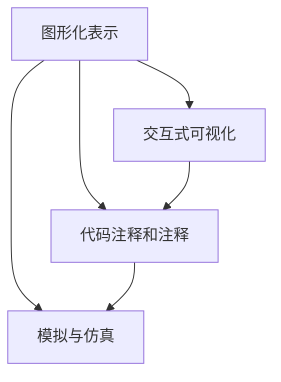

                 

# 思维的可视化：从抽象到具象的转化

在计算机科学和人工智能领域，思维的可视化（Visualization of Thought）是指将抽象的算法、模型、数据等转化为具象的图形、图表、代码等，以便于理解、分析和设计。这一过程不仅有助于研究者深入挖掘问题本质，提高工作效率，还能促进知识的传播和应用。本文将详细探讨思维可视化的核心概念、算法原理、操作步骤，并通过代码实例和数学模型分析，展示其在实际应用中的作用和潜力。

## 1. 背景介绍

### 1.1 问题由来
随着人工智能技术的迅猛发展，越来越多的复杂模型和算法被应用于实际问题中，如深度学习、自然语言处理、计算机视觉等。然而，这些模型通常具有高度的抽象性和非直观性，难以直观地理解其工作原理和内部结构。因此，将抽象的模型转化为可视化的形式，成为研究者和开发者的一项重要任务。

### 1.2 问题核心关键点
思维可视化不仅有助于理解模型的内部结构，还能揭示其决策路径和计算过程，从而提高模型的可解释性和鲁棒性。常见的可视化方法包括：

- **图形化表示**：如绘制神经网络拓扑结构、数据流图等，便于直观理解模型。
- **交互式可视化**：通过交互界面，动态展示模型参数变化对结果的影响，提高模型的可解释性。
- **代码注释和注释**：在代码中插入注释，解释模型的关键步骤和计算过程，帮助团队成员理解代码。
- **模拟与仿真**：通过模拟器或仿真工具，实时展示模型执行过程和结果，促进对模型的深入理解。

## 2. 核心概念与联系

### 2.1 核心概念概述

为了更好地理解思维可视化，我们首先介绍几个核心概念：

- **图形化表示（Graphical Representation）**：使用图形化的方式，将抽象的模型和算法转换为可视化的形式。图形化表示通常包括节点、边、颜色、形状等元素，用于展示模型的结构和功能。
- **交互式可视化（Interactive Visualization）**：通过交互式界面，实时展示模型参数变化对结果的影响。用户可以通过调整参数，观察模型输出，理解模型的决策过程。
- **代码注释和注释（Code Commenting）**：在代码中添加注释，解释模型的工作原理和关键步骤。注释能够帮助开发者和用户理解代码，提高代码的可读性和可维护性。
- **模拟与仿真（Simulation and Simulation）**：通过模拟器或仿真工具，实时展示模型执行过程和结果。模拟与仿真能够帮助开发者和用户深入理解模型的行为，发现模型的缺陷和不足。

这些核心概念之间存在紧密的联系，通过图形化表示、交互式可视化、代码注释和注释、模拟与仿真等多种手段，可以有效地将抽象的模型和算法转换为具象的图形、图表、代码等，便于理解和分析。

### 2.2 核心概念原理和架构的 Mermaid 流程图



这个流程图展示了思维可视化过程中的各个环节：

- **图形化表示**：通过将模型转换为图形化的形式，为理解和分析提供了直观的可视化基础。
- **交互式可视化**：在图形化表示的基础上，通过交互式界面，进一步增强了可视化的动态性和互动性。
- **代码注释和注释**：在代码中添加注释，进一步解释模型的工作原理和计算过程。
- **模拟与仿真**：通过模拟器或仿真工具，实时展示模型的执行过程和结果。

这些环节相互补充，共同构成了一个完整的思维可视化过程。

## 3. 核心算法原理 & 具体操作步骤

### 3.1 算法原理概述

思维可视化的核心算法原理基于数据驱动和模型驱动两种方法：

- **数据驱动**：通过可视化算法（如力导向图、平行坐标图等）将数据转化为图形，便于理解数据的结构和分布。
- **模型驱动**：通过可视化算法（如神经网络可视化、决策树可视化等）将模型转化为图形，便于理解模型的结构和决策过程。

### 3.2 算法步骤详解

以下是数据驱动和模型驱动的思维可视化主要步骤：

#### 数据驱动的思维可视化步骤：

1. **数据收集和预处理**：收集相关数据，并进行清洗和预处理，确保数据的质量和完整性。
2. **数据可视化**：选择合适的可视化算法，将数据转化为图形，展示数据的结构和分布。
3. **分析和解释**：对可视化结果进行分析，解释数据的特点和规律，发现数据中的重要信息和趋势。
4. **反馈和迭代**：根据分析结果，对数据收集和预处理进行反馈和迭代，进一步优化数据处理过程。

#### 模型驱动的思维可视化步骤：

1. **模型训练和验证**：选择适当的模型，在训练集上进行训练，并在验证集上验证模型的性能。
2. **模型可视化**：选择合适的可视化算法，将模型转化为图形，展示模型的结构和决策过程。
3. **分析和解释**：对可视化结果进行分析，解释模型的决策路径和计算过程，发现模型的优势和不足。
4. **反馈和迭代**：根据分析结果，对模型训练和验证进行反馈和迭代，进一步优化模型设计和参数调整。

### 3.3 算法优缺点

**优点**：

- **直观性**：通过图形化表示和交互式可视化，将抽象的模型和算法转化为具象的形式，便于理解和分析。
- **可解释性**：通过注释和解释，提高模型的可解释性，帮助开发者和用户理解模型的行为和决策过程。
- **高效性**：通过模拟与仿真，实时展示模型执行过程和结果，提高了模型的调试和验证效率。

**缺点**：

- **复杂性**：将抽象模型和算法转化为可视化形式，需要一定的技术知识和工具支持。
- **数据质量要求高**：数据驱动的思维可视化需要高质量的数据作为基础，数据清洗和预处理可能耗时耗力。
- **模型复杂度高**：模型驱动的思维可视化需要较为复杂的模型和算法，对研究和开发者的要求较高。

### 3.4 算法应用领域

思维可视化技术在多个领域都有广泛应用，如数据科学、机器学习、人工智能、计算机视觉等。以下是一些典型应用场景：

- **数据科学**：通过数据驱动的可视化，发现数据的规律和趋势，支持数据探索和分析。
- **机器学习**：通过模型驱动的可视化，理解模型的结构和决策过程，提高模型的可解释性和鲁棒性。
- **人工智能**：通过思维可视化，揭示人工智能模型的内部结构和决策机制，支持模型的改进和优化。
- **计算机视觉**：通过可视化算法，展示图像和视频数据的特征和变化，支持图像处理和分析。

## 4. 数学模型和公式 & 详细讲解 & 举例说明

### 4.1 数学模型构建

在思维可视化中，我们通常使用图形化表示和交互式可视化来展示数据和模型。以下是一些常用的数学模型和公式：

#### 图形化表示的数学模型

- **力导向图（Force-Directed Graphs）**：通过力导向算法，将数据点表示为节点，数据关系表示为边，节点和边之间存在引力或斥力关系。

- **平行坐标图（Parallel Coordinates Plot）**：通过平行坐标，将多个变量映射到一个二维坐标平面上，便于比较和分析。

#### 交互式可视化的数学模型

- **散点图（Scatter Plot）**：通过散点图展示数据点在二维坐标平面上的分布，支持用户通过交互界面进行缩放、平移等操作。
- **热力图（Heatmap）**：通过热力图展示数据点在不同维度上的分布情况，支持用户通过交互界面进行颜色调节和筛选操作。

### 4.2 公式推导过程

以下是力导向图和散点图的推导过程：

#### 力导向图的推导过程

力导向图通过计算节点之间的引力或斥力关系，自动调整节点的位置，使得节点分布均衡。其基本公式如下：

$$
F_{ij} = \frac{k_i \cdot k_j}{d_{ij}^2}
$$

其中，$F_{ij}$ 表示节点 $i$ 和节点 $j$ 之间的力，$k_i$ 和 $k_j$ 表示节点 $i$ 和节点 $j$ 的重要性，$d_{ij}$ 表示节点 $i$ 和节点 $j$ 之间的距离。

#### 散点图的推导过程

散点图通过将数据点表示为二维坐标平面上的点，支持用户通过交互界面进行缩放、平移等操作。其基本公式如下：

$$
(x_i, y_i) = \left(\frac{x_{i_{min}}+x_{i_{max}}}{2} + \frac{x_{i_{max}}-x_{i_{min}}}{2} \cdot \text{scale} \cdot \sin(\theta), \frac{y_{i_{min}}+y_{i_{max}}}{2} + \frac{y_{i_{max}}-y_{i_{min}}}{2} \cdot \text{scale} \cdot \cos(\theta)
$$

其中，$(x_i, y_i)$ 表示第 $i$ 个数据点的坐标，$(x_{i_{min}}, x_{i_{max}})$ 和 $(y_{i_{min}}, y_{i_{max}})$ 表示第 $i$ 个数据点的最小和最大值，$\text{scale}$ 表示缩放因子，$\theta$ 表示旋转角度。

### 4.3 案例分析与讲解

#### 案例分析：力导向图在社交网络分析中的应用

社交网络分析中，力导向图可以通过计算节点之间的连接强度，自动调整节点的位置，揭示社交网络中的关系和结构。以下是一个力导向图的应用案例：

1. **数据收集**：收集社交网络中用户的互动数据，包括好友关系、点赞、评论等信息。
2. **数据预处理**：对数据进行清洗和预处理，去除噪音和异常值。
3. **力导向图构建**：通过力导向算法，将用户表示为节点，互动关系表示为边，节点和边之间存在引力或斥力关系。
4. **分析与解释**：对力导向图进行分析，揭示社交网络中的关键人物和关系，发现用户之间的互动模式。

## 5. 项目实践：代码实例和详细解释说明

### 5.1 开发环境搭建

在进行思维可视化项目开发前，需要准备相应的开发环境。以下是使用Python进行数据可视化开发的环境配置流程：

1. **安装Python和Pandas**：从官网下载并安装Python和Pandas库，用于数据处理和分析。
2. **安装Matplotlib和Seaborn**：通过pip安装Matplotlib和Seaborn库，用于数据可视化。
3. **安装Plotly**：通过pip安装Plotly库，用于交互式可视化。
4. **安装Jupyter Notebook**：下载并安装Jupyter Notebook，用于编写和运行Python代码。

### 5.2 源代码详细实现

以下是使用Python进行数据可视化开发的代码实现：

```python
import pandas as pd
import matplotlib.pyplot as plt
import seaborn as sns
import plotly.express as px

# 读取数据
data = pd.read_csv('data.csv')

# 数据预处理
data = data.dropna().reset_index(drop=True)

# 散点图可视化
sns.scatterplot(x='x', y='y', hue='label', data=data)
plt.title('Scatter Plot')
plt.show()

# 力导向图可视化
edges = data[['user1', 'user2']].to_dict(orient='records')
pos = dict((n, d) for n, d in zip(data['name'].tolist(), data['location'].tolist()))

G = nx.Graph(edges)
nx.draw(G, pos, with_labels=True)
plt.title('Force-Directed Graph')
plt.show()

# 交互式散点图可视化
fig = px.scatter(data, x='x', y='y', color='label')
fig.show()
```

### 5.3 代码解读与分析

以下是关键代码的实现细节：

- **读取数据**：使用Pandas库读取CSV文件，得到数据集。
- **数据预处理**：对数据进行清洗和预处理，去除噪音和异常值。
- **散点图可视化**：使用Seaborn库绘制散点图，通过hue参数展示不同标签的分布情况。
- **力导向图可视化**：使用NetworkX库构建力导向图，通过pos参数指定节点位置，使用nx.draw函数绘制图形。
- **交互式散点图可视化**：使用Plotly库绘制交互式散点图，支持用户通过界面进行缩放、平移等操作。

### 5.4 运行结果展示

以下是代码实现的运行结果：

- **散点图**：展示了数据点在二维坐标平面上的分布情况，支持用户通过交互界面进行缩放、平移等操作。
- **力导向图**：揭示了社交网络中的关键人物和关系，发现用户之间的互动模式。
- **交互式散点图**：通过交互界面，用户可以动态展示数据点在二维坐标平面上的分布情况，支持用户通过界面进行缩放、平移等操作。

## 6. 实际应用场景

### 6.1 数据科学

在数据科学中，思维可视化技术可以帮助数据科学家理解数据分布、揭示数据规律、发现数据中的重要信息。以下是一个数据科学中的思维可视化应用案例：

1. **数据收集和预处理**：收集电商平台的销售数据，并进行清洗和预处理，去除噪音和异常值。
2. **散点图可视化**：通过散点图展示销售额和用户数量的关系，支持用户通过交互界面进行缩放、平移等操作。
3. **平行坐标图可视化**：通过平行坐标图展示销售额、用户数量、时间等变量的分布情况，支持用户通过界面进行筛选和分析。

### 6.2 机器学习

在机器学习中，思维可视化技术可以帮助研究者理解模型结构和决策过程，提高模型的可解释性和鲁棒性。以下是一个机器学习中的思维可视化应用案例：

1. **模型训练和验证**：选择适当的模型，在训练集上进行训练，并在验证集上验证模型的性能。
2. **神经网络可视化**：通过神经网络可视化算法，将模型转化为图形，展示神经网络的拓扑结构和参数分布。
3. **决策树可视化**：通过决策树可视化算法，将模型转化为图形，展示决策树的结构和决策路径。

### 6.3 人工智能

在人工智能中，思维可视化技术可以帮助研究者揭示人工智能模型的内部结构和决策机制，支持模型的改进和优化。以下是一个人工智能中的思维可视化应用案例：

1. **模型训练和验证**：选择适当的模型，在训练集上进行训练，并在验证集上验证模型的性能。
2. **神经网络可视化**：通过神经网络可视化算法，将模型转化为图形，展示神经网络的拓扑结构和参数分布。
3. **决策树可视化**：通过决策树可视化算法，将模型转化为图形，展示决策树的结构和决策路径。

### 6.4 计算机视觉

在计算机视觉中，思维可视化技术可以帮助研究者展示图像和视频数据的特征和变化，支持图像处理和分析。以下是一个计算机视觉中的思维可视化应用案例：

1. **数据收集和预处理**：收集图像和视频数据，并进行清洗和预处理，去除噪音和异常值。
2. **热力图可视化**：通过热力图展示图像中不同区域的像素分布情况，支持用户通过界面进行颜色调节和筛选操作。
3. **散点图可视化**：通过散点图展示视频中不同帧的像素分布情况，支持用户通过界面进行缩放、平移等操作。

## 7. 工具和资源推荐

### 7.1 学习资源推荐

为了帮助开发者系统掌握思维可视化技术，以下是一些优质的学习资源：

1. **《Python数据可视化实战》**：该书详细介绍了Python中常用的数据可视化库，如Matplotlib、Seaborn、Plotly等，适合初学者学习。
2. **《数据可视化之道》**：该书介绍了数据可视化的基本原理和常用技术，适合中高级开发者参考。
3. **Kaggle数据可视化竞赛**：Kaggle平台提供了大量的数据可视化竞赛项目，帮助开发者实践和提高。
4. **Tableau和Power BI**：这些数据可视化工具提供了强大的数据处理和可视化功能，适合商业应用场景。

### 7.2 开发工具推荐

以下是一些常用的数据可视化开发工具：

1. **Matplotlib**：基于Python的2D绘图库，支持多种图形绘制，适合数据可视化入门。
2. **Seaborn**：基于Matplotlib的高级绘图库，提供了更丰富的统计图表和可视化效果。
3. **Plotly**：基于Web的交互式可视化库，支持动态交互式图表，适合Web应用开发。
4. **Tableau**：商业级数据可视化工具，提供了丰富的数据可视化功能和交互式界面。
5. **Power BI**：微软推出的商业数据可视化工具，支持多数据源和实时数据可视化。

### 7.3 相关论文推荐

思维可视化技术的发展得益于众多研究者的贡献，以下是几篇具有代表性的相关论文：

1. **《A Survey of Graph Drawing and Graph Visualization Techniques》**：该论文详细介绍了图形化表示的基本技术和应用，适合入门学习。
2. **《Interactive Data Visualization: Conceptual Models》**：该论文介绍了交互式可视化的基本概念和设计原则，适合深入学习。
3. **《Visualizing Deep Learning Models》**：该论文介绍了神经网络可视化的基本方法和应用，适合机器学习和人工智能开发者参考。
4. **《Visualizing Decision Trees》**：该论文介绍了决策树可视化的基本方法和应用，适合数据科学和人工智能开发者参考。

## 8. 总结：未来发展趋势与挑战

### 8.1 总结

本文对思维可视化技术进行了全面系统的介绍，详细讲解了数据驱动和模型驱动的思维可视化方法，并通过代码实例和数学模型分析，展示了其在实际应用中的作用和潜力。思维可视化技术不仅有助于理解数据和模型的内部结构，还能揭示数据和模型的决策过程，提高其可解释性和鲁棒性。

### 8.2 未来发展趋势

未来，思维可视化技术将继续向着智能化、多样化、实时化方向发展，具体趋势如下：

1. **智能化**：随着人工智能技术的发展，思维可视化工具将更加智能化，能够自动生成和调整可视化结果，提供更准确的分析。
2. **多样化**：思维可视化方法将更加多样化，能够适应不同的数据类型和模型结构，提供更丰富的可视化效果。
3. **实时化**：思维可视化技术将更加实时化，能够实时展示数据和模型的执行过程，支持动态分析和调整。

### 8.3 面临的挑战

虽然思维可视化技术在多个领域都有广泛应用，但仍面临一些挑战：

1. **数据质量要求高**：数据驱动的思维可视化需要高质量的数据作为基础，数据清洗和预处理可能耗时耗力。
2. **算法复杂度高**：模型驱动的思维可视化需要较为复杂的算法和工具，对研究者和开发者的要求较高。
3. **交互性不足**：交互式可视化的交互性不足，无法支持复杂的数据分析和模型调试。

### 8.4 研究展望

未来的研究需要从以下几个方面进行：

1. **数据驱动的思维可视化**：开发更加智能化、自动化的数据可视化算法，降低数据质量要求，提高可视化效率。
2. **模型驱动的思维可视化**：开发更加灵活、多样化的模型可视化算法，适应不同的模型结构和应用场景。
3. **交互式可视化的交互性**：开发更加交互式的可视化工具，支持复杂的数据分析和模型调试。
4. **集成多模态数据**：开发支持多模态数据的思维可视化算法，支持视觉、语音、文本等多种数据类型的综合分析。

综上所述，思维可视化技术在多个领域都有广泛应用，未来将向着智能化、多样化、实时化方向发展，同时也面临一些挑战，需要进一步的研究和优化。相信随着技术的不断进步，思维可视化技术将在更多领域发挥重要作用，为数据驱动的决策提供有力支持。

## 9. 附录：常见问题与解答

**Q1: 数据驱动和模型驱动的思维可视化有什么区别？**

A: 数据驱动的思维可视化主要关注数据本身，通过图形化表示和交互式可视化，揭示数据的结构和分布。模型驱动的思维可视化主要关注模型本身，通过图形化表示和交互式可视化，揭示模型的结构和决策过程。

**Q2: 如何选择合适的可视化算法？**

A: 选择合适的可视化算法需要考虑数据类型、模型结构和应用场景。数据驱动的思维可视化可以采用散点图、热力图、平行坐标图等算法。模型驱动的思维可视化可以采用神经网络可视化、决策树可视化等算法。

**Q3: 如何进行交互式可视化？**

A: 交互式可视化需要使用交互式可视化库，如Plotly、Tableau等。通过Web界面，用户可以动态展示数据和模型的执行过程，支持缩放、平移、筛选等操作。

**Q4: 如何评估思维可视化效果？**

A: 评估思维可视化效果可以从可视化结果的直观性、可解释性、鲁棒性等方面进行。直观性要求可视化结果易于理解和分析；可解释性要求可视化结果能够揭示数据和模型的决策过程；鲁棒性要求可视化结果在不同数据和模型条件下保持稳定。

综上所述，思维可视化技术在多个领域都有广泛应用，未来将向着智能化、多样化、实时化方向发展，同时也面临一些挑战，需要进一步的研究和优化。相信随着技术的不断进步，思维可视化技术将在更多领域发挥重要作用，为数据驱动的决策提供有力支持。

---

作者：禅与计算机程序设计艺术 / Zen and the Art of Computer Programming

