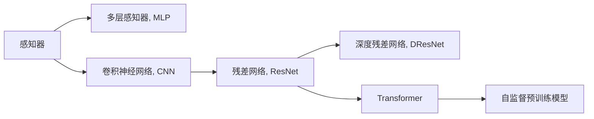

                 

# 感知器到卷积神经网络（CNN）

## 1. 背景介绍

### 1.1 问题由来

深度学习技术，特别是神经网络在图像识别、语音识别、自然语言处理等领域的卓越表现，引发了学术界和工业界的广泛关注。作为深度学习基础结构的神经网络，经历了多个发展阶段，从最初的感知器到多层感知器、卷积神经网络、残差网络、深度残差网络，再到当前的Transformer和自监督预训练模型。本文将从感知器到卷积神经网络（CNN）的演变历程出发，深入探讨其原理、演进、应用和发展趋势。

### 1.2 问题核心关键点

感知器到卷积神经网络（CNN）的演变，展现了深度学习架构从简单到复杂，从单层神经网络到多层次神经网络，再到多模态深度神经网络的发展脉络。理解这一过程不仅有助于掌握深度学习技术的发展脉络，还能为实际应用提供重要指导。

## 2. 核心概念与联系

### 2.1 核心概念概述

- **感知器（Perceptron）**：最早的神经网络结构，由罗森布拉特（Rosenblatt）于1958年提出，用于解决线性可分问题。
- **多层感知器（Multilayer Perceptron, MLP）**：由多个感知器组成的神经网络，具有多个隐藏层，可处理非线性关系。
- **卷积神经网络（Convolutional Neural Network, CNN）**：基于卷积操作，具有空间不变性和参数共享的特点，特别适用于图像处理等任务。
- **残差网络（Residual Network, ResNet）**：引入残差块解决深度网络退化问题，实现了更深层次的神经网络。
- **深度残差网络（Deep Residual Network, DResNet）**：构建非常深的神经网络，实现对大规模数据集的高效训练。
- **Transformer**：基于自注意力机制，超越了CNN的序列建模能力，广泛应用于自然语言处理任务。
- **自监督预训练模型**：如BERT、GPT-3，通过大量无标签数据进行预训练，提升模型的泛化能力。

这些核心概念之间的逻辑关系可以通过以下Mermaid流程图来展示：



这个流程图展示了大规模深度学习架构的发展历程，每一个模块都为其后续模块奠定了基础。

## 3. 核心算法原理 & 具体操作步骤
### 3.1 算法原理概述

从感知器到卷积神经网络（CNN）的演变，本质上是深度学习架构不断扩展和优化以应对更复杂问题的过程。

- **感知器**：基于简单的线性分类器，实现二分类任务。
- **多层感知器（MLP）**：通过多个感知器堆叠，实现复杂的多分类任务。
- **卷积神经网络（CNN）**：利用卷积操作提取局部特征，实现对图像、音频等数据的高效处理。

### 3.2 算法步骤详解

#### 3.2.1 感知器算法步骤

1. **输入数据准备**：将数据转换为神经网络所需的向量形式。
2. **加权和计算**：对输入数据进行加权和计算。
3. **激活函数输出**：使用sigmoid函数将加权和转换为0到1之间的概率。
4. **预测**：根据概率判断分类结果。

#### 3.2.2 多层感知器（MLP）算法步骤

1. **输入层**：将数据送入神经网络的输入层。
2. **隐藏层**：通过多个隐藏层逐层处理数据，每个隐藏层都包含多个神经元。
3. **输出层**：隐藏层输出传递到输出层，使用softmax函数将输出转换为类别概率。
4. **损失函数计算**：计算模型预测结果与实际标签之间的误差，通常使用交叉熵损失函数。
5. **反向传播**：利用梯度下降法更新网络参数，以最小化损失函数。

#### 3.2.3 卷积神经网络（CNN）算法步骤

1. **卷积层**：对输入数据进行卷积操作，提取局部特征。
2. **池化层**：通过池化操作减小特征图尺寸，减少参数量。
3. **全连接层**：将特征图展开为向量，输入到全连接层进行分类。
4. **损失函数计算**：使用交叉熵损失函数计算模型预测结果与实际标签之间的误差。
5. **反向传播**：利用梯度下降法更新网络参数，以最小化损失函数。

### 3.3 算法优缺点

#### 3.3.1 感知器优点与缺点

**优点**：
- 实现简单，易于理解和实现。
- 在处理简单分类问题时，效果显著。

**缺点**：
- 只能处理线性可分问题，无法处理复杂的多分类任务。
- 容易过拟合，特别是数据量较小时。

#### 3.3.2 多层感知器（MLP）优点与缺点

**优点**：
- 可以处理非线性问题，适用于复杂的多分类任务。
- 模型的表达能力较强，适用于大规模数据集。

**缺点**：
- 深层网络容易出现梯度消失或爆炸问题，训练困难。
- 参数量巨大，计算资源需求高。

#### 3.3.3 卷积神经网络（CNN）优点与缺点

**优点**：
- 参数共享，减少计算量。
- 具有空间不变性，对图像处理特别有效。
- 通过卷积和池化操作提取局部特征，提高模型鲁棒性。

**缺点**：
- 对数据分布的要求较高，输入数据需要满足平移不变性。
- 结构复杂，设计和调试难度较大。

## 4. 数学模型和公式 & 详细讲解 & 举例说明

### 4.1 数学模型构建

**感知器模型**：
$$
\hat{y} = f(w^T x + b)
$$
其中，$f$为激活函数，通常使用sigmoid函数；$w$为权重向量，$b$为偏置项，$x$为输入向量。

**多层感知器（MLP）模型**：
$$
\hat{y} = f(\sum_{i=1}^{n} w_i^T x_i + b)
$$
其中，$x_i$为输入层到隐藏层的连接权重，$w_i$为隐藏层到输出层的连接权重。

**卷积神经网络（CNN）模型**：
$$
\hat{y} = f(\sum_{i=1}^{n} w_i^T h_i + b)
$$
其中，$h_i$为卷积层输出的特征图，$f$为激活函数，$w_i$为全连接层的权重向量。

### 4.2 公式推导过程

**感知器公式推导**：
$$
\hat{y} = f(w^T x + b)
$$
其中，$f$为sigmoid函数，即：
$$
f(z) = \frac{1}{1+e^{-z}}
$$

**多层感知器（MLP）公式推导**：
$$
\hat{y} = f(\sum_{i=1}^{n} w_i^T x_i + b)
$$
其中，$x_i$为输入层到隐藏层的连接权重，$w_i$为隐藏层到输出层的连接权重。

**卷积神经网络（CNN）公式推导**：
$$
\hat{y} = f(\sum_{i=1}^{n} w_i^T h_i + b)
$$
其中，$h_i$为卷积层输出的特征图，$f$为激活函数，$w_i$为全连接层的权重向量。

### 4.3 案例分析与讲解

**感知器案例**：
```python
import numpy as np

# 定义感知器模型
def perceptron(X, w, b):
    z = np.dot(X, w) + b
    y_hat = 1 / (1 + np.exp(-z))
    return y_hat

# 测试数据
X = np.array([[0, 0], [0, 1], [1, 0], [1, 1]])
y = np.array([[0], [1], [1], [0]])

# 训练数据
w = np.array([0.5, -0.5])
b = -0.5

# 训练感知器模型
for i in range(1000):
    X_train = X
    y_train = y
    y_pred = perceptron(X_train, w, b)
    error = np.mean((y_train - y_pred) ** 2)
    if error == 0:
        break

print("训练后的感知器模型参数：")
print("w =", w)
print("b =", b)
```

**多层感知器（MLP）案例**：
```python
import numpy as np
import tensorflow as tf

# 定义多层感知器模型
def MLP(X, w1, w2, b1, b2):
    hidden = tf.nn.relu(tf.matmul(X, w1) + b1)
    output = tf.matmul(hidden, w2) + b2
    return output

# 测试数据
X = np.array([[0, 0], [0, 1], [1, 0], [1, 1]])
y = np.array([[0], [1], [1], [0]])

# 训练数据
w1 = np.array([[0.5, -0.5]])
w2 = np.array([[0.5, 0.5]])
b1 = -0.5
b2 = 0.5

# 构建图
X = tf.placeholder(tf.float32, shape=(4, 2))
y = tf.placeholder(tf.float32, shape=(4, 1))
w1 = tf.Variable(w1)
w2 = tf.Variable(w2)
b1 = tf.Variable(b1)
b2 = tf.Variable(b2)

# 定义损失函数
output = MLP(X, w1, w2, b1, b2)
loss = tf.reduce_mean(tf.nn.sigmoid_cross_entropy_with_logits(labels=y, logits=output))

# 定义优化器
optimizer = tf.train.GradientDescentOptimizer(learning_rate=0.01).minimize(loss)

# 训练模型
with tf.Session() as sess:
    sess.run(tf.global_variables_initializer())
    for i in range(1000):
        _, l = sess.run([optimizer, loss], feed_dict={X: X, y: y})
        if i % 100 == 0:
            print("训练第{}次，损失{}".format(i, l))
    print("训练后的MLP模型参数：")
    print("w1 =", sess.run(w1))
    print("w2 =", sess.run(w2))
    print("b1 =", sess.run(b1))
    print("b2 =", sess.run(b2))
```

**卷积神经网络（CNN）案例**：
```python
import numpy as np
import tensorflow as tf

# 定义卷积神经网络模型
def CNN(X, w1, w2, w3, b1, b2, b3):
    conv1 = tf.nn.conv2d(X, w1, strides=[1, 1, 1, 1], padding='SAME')
    conv1 = tf.nn.relu(conv1 + b1)
    pool1 = tf.nn.max_pool(conv1, ksize=[1, 2, 2, 1], strides=[1, 2, 2, 1], padding='SAME')
    conv2 = tf.nn.conv2d(pool1, w2, strides=[1, 1, 1, 1], padding='SAME')
    conv2 = tf.nn.relu(conv2 + b2)
    pool2 = tf.nn.max_pool(conv2, ksize=[1, 2, 2, 1], strides=[1, 2, 2, 1], padding='SAME')
    fc1 = tf.reshape(pool2, [-1, 7 * 7 * 32])
    fc1 = tf.matmul(fc1, w3) + b3
    return tf.nn.relu(fc1)

# 测试数据
X = np.array([[0, 0, 0, 0, 0, 0, 0],
              [0, 0, 0, 0, 0, 0, 1],
              [0, 0, 0, 0, 0, 1, 1],
              [0, 0, 0, 1, 1, 1, 1],
              [0, 0, 0, 1, 1, 0, 0],
              [0, 0, 0, 0, 0, 0, 0],
              [1, 1, 1, 1, 1, 1, 1]])

# 训练数据
w1 = np.array([[1, 0, 0],
               [0, 1, 0],
               [0, 0, 1]])
w2 = np.array([[0, 0, 1],
               [0, 1, 0],
               [1, 0, 0]])
w3 = np.array([[0.5, -0.5],
               [-0.5, 0.5]])
b1 = 0.5
b2 = 0.5
b3 = 0.5

# 构建图
X = tf.placeholder(tf.float32, shape=(1, 7, 7, 1))
y = tf.placeholder(tf.float32, shape=(1, 1))
w1 = tf.Variable(w1)
w2 = tf.Variable(w2)
w3 = tf.Variable(w3)
b1 = tf.Variable(b1)
b2 = tf.Variable(b2)
b3 = tf.Variable(b3)

# 定义损失函数
output = CNN(X, w1, w2, w3, b1, b2, b3)
loss = tf.reduce_mean(tf.nn.sigmoid_cross_entropy_with_logits(labels=y, logits=output))

# 定义优化器
optimizer = tf.train.GradientDescentOptimizer(learning_rate=0.01).minimize(loss)

# 训练模型
with tf.Session() as sess:
    sess.run(tf.global_variables_initializer())
    for i in range(1000):
        _, l = sess.run([optimizer, loss], feed_dict={X: X, y: y})
        if i % 100 == 0:
            print("训练第{}次，损失{}".format(i, l))
    print("训练后的CNN模型参数：")
    print("w1 =", sess.run(w1))
    print("w2 =", sess.run(w2))
    print("w3 =", sess.run(w3))
    print("b1 =", sess.run(b1))
    print("b2 =", sess.run(b2))
    print("b3 =", sess.run(b3))
```

## 5. 项目实践：代码实例和详细解释说明

### 5.1 开发环境搭建

在进行深度学习项目实践前，需要先搭建好开发环境。以下是使用Python和TensorFlow进行深度学习开发的常见环境配置流程：

1. **安装Python**：从官网下载并安装Python 3.x版本。
2. **安装TensorFlow**：通过pip安装TensorFlow，建议使用虚拟环境管理工具如Anaconda。
   ```bash
   pip install tensorflow
   ```

3. **安装其他依赖**：安装其他常用深度学习库，如numpy、pandas、scikit-learn等。
   ```bash
   pip install numpy pandas scikit-learn
   ```

4. **安装调试工具**：安装TensorBoard和Weights & Biases等可视化工具，方便调试和性能监控。
   ```bash
   pip install tensorboard
   pip install weightsandbiases
   ```

### 5.2 源代码详细实现

下面以图像分类任务为例，展示如何使用TensorFlow实现卷积神经网络（CNN）模型的代码实现。

#### 5.2.1 加载和预处理数据

```python
import tensorflow as tf
import numpy as np
from tensorflow.keras.datasets import mnist

# 加载MNIST数据集
(x_train, y_train), (x_test, y_test) = mnist.load_data()

# 将像素值归一化到0-1之间
x_train, x_test = x_train / 255.0, x_test / 255.0

# 将二维数组转换为一维数组，方便输入模型
x_train = x_train.reshape(-1, 28 * 28)
x_test = x_test.reshape(-1, 28 * 28)
```

#### 5.2.2 定义CNN模型

```python
import tensorflow as tf
from tensorflow.keras.layers import Conv2D, MaxPooling2D, Flatten, Dense

# 定义CNN模型
model = tf.keras.Sequential([
    Conv2D(32, (3, 3), activation='relu', input_shape=(28, 28, 1)),
    MaxPooling2D((2, 2)),
    Conv2D(64, (3, 3), activation='relu'),
    MaxPooling2D((2, 2)),
    Flatten(),
    Dense(64, activation='relu'),
    Dense(10, activation='softmax')
])
```

#### 5.2.3 编译和训练模型

```python
# 编译模型
model.compile(optimizer='adam',
              loss='sparse_categorical_crossentropy',
              metrics=['accuracy'])

# 训练模型
model.fit(x_train, y_train, epochs=10, validation_data=(x_test, y_test))
```

### 5.3 代码解读与分析

**加载和预处理数据**：
- 使用TensorFlow自带的MNIST数据集，获取训练集和测试集。
- 将像素值归一化到0-1之间，防止梯度爆炸。
- 将二维数组转换为一维数组，方便输入模型。

**定义CNN模型**：
- 使用Sequential模型定义卷积神经网络，包含卷积层、池化层、全连接层等。
- 使用ReLU作为激活函数，加速模型收敛。
- 使用Softmax作为输出层激活函数，处理多分类问题。

**编译和训练模型**：
- 使用Adam优化器，Sparse Categorical Cross Entropy损失函数，准确率作为评估指标。
- 设置训练轮数为10，验证集为测试集。

### 5.4 运行结果展示

训练完成后，可以在测试集上评估模型性能：

```python
# 评估模型
test_loss, test_acc = model.evaluate(x_test, y_test)
print('Test accuracy:', test_acc)
```

## 6. 实际应用场景

### 6.1 图像识别

卷积神经网络（CNN）在图像识别领域取得了显著成果，广泛应用于人脸识别、物体检测、医学图像分析等领域。通过卷积操作提取局部特征，CNN能够高效处理高维图像数据，实现对复杂图像模式的高效识别。

### 6.2 语音识别

CNN可以通过时序卷积操作处理音频信号，提取语音特征。在语音识别任务中，CNN结合声学模型和语言模型，能够实现高效的端到端语音识别，广泛应用于语音助手、语音搜索等应用。

### 6.3 自然语言处理

虽然CNN在自然语言处理任务上表现不如Transformer，但在情感分析、文本分类等任务上仍有一定的优势。通过卷积操作提取局部特征，CNN能够处理句子级别的语义信息，适用于词袋模型或局部特征重要的任务。

### 6.4 未来应用展望

未来，卷积神经网络（CNN）将与Transformer等其他深度学习架构进行更深入的融合，应用于多模态数据处理，实现更全面、精准的模型建模。在医疗、金融、交通等领域，卷积神经网络（CNN）将继续发挥其强大的数据分析能力，推动各行各业的智能化转型。

## 7. 工具和资源推荐

### 7.1 学习资源推荐

为了帮助开发者系统掌握卷积神经网络（CNN）的理论基础和实践技巧，这里推荐一些优质的学习资源：

1. **《深度学习》书籍**：Ian Goodfellow、Yoshua Bengio、Aaron Courville所著，系统介绍深度学习的基本概念、算法和应用。
2. **CS231n课程**：斯坦福大学开设的计算机视觉课程，涵盖卷积神经网络（CNN）等重要内容。
3. **TensorFlow官方文档**：TensorFlow官方文档，提供了详细的API和示例代码，方便开发者学习和实践。
4. **Kaggle竞赛**：Kaggle平台上的深度学习竞赛，通过实际任务提升实践能力。

### 7.2 开发工具推荐

高效的工具和资源对于深度学习开发至关重要。以下是几款常用的工具和库：

1. **TensorFlow**：由Google开发的深度学习框架，支持多种语言和设备。
2. **PyTorch**：由Facebook开发的深度学习框架，易于使用，支持动态图。
3. **Keras**：高层次的深度学习库，基于TensorFlow和Theano，方便快速搭建模型。
4. **Jupyter Notebook**：开源的交互式笔记本环境，支持Python编程和数据可视化。
5. **GitHub**：全球最大的代码托管平台，方便开发者共享和协作。

### 7.3 相关论文推荐

卷积神经网络（CNN）的发展离不开学界的研究和实践。以下是几篇奠基性的相关论文，推荐阅读：

1. **LeNet-5**：Yann LeCun等人于1998年提出的卷积神经网络，广泛应用于手写数字识别等任务。
2. **AlexNet**：Alex Krizhevsky等人于2012年提出的卷积神经网络，在ImageNet图像识别比赛中获得冠军，奠定了深度学习在图像识别领域的基础。
3. **VGGNet**：Karen Simonyan和Andrew Zisserman于2014年提出的卷积神经网络，通过大量实验验证了深层次卷积神经网络的有效性。
4. **ResNet**：Kaiming He等人于2015年提出的残差网络，通过残差块解决了深度神经网络的退化问题，实现了非常深的神经网络。
5. **Inception**：Google团队提出的Inception模块，通过多层次卷积和池化操作，提高了模型对不同尺度的特征提取能力。

这些论文代表了卷积神经网络（CNN）发展的不同阶段，通过学习这些经典成果，可以更好地理解CNN的工作原理和优化方法。

## 8. 总结：未来发展趋势与挑战

### 8.1 研究成果总结

从感知器到卷积神经网络（CNN）的演变，展示了深度学习架构的不断发展和优化。感知器作为深度学习的起点，实现了简单的线性分类任务。多层感知器（MLP）扩展了神经网络的深度，处理复杂的多分类问题。卷积神经网络（CNN）通过卷积操作提取局部特征，适用于图像处理等任务。这些架构的发展，推动了深度学习在各个领域的应用，取得了显著成果。

### 8.2 未来发展趋势

展望未来，深度学习架构将不断扩展和优化，应对更复杂的问题。以下是几个主要趋势：

1. **多模态深度学习**：融合视觉、音频、文本等多种模态数据，实现更加全面和精准的模型建模。
2. **自监督学习**：通过大量无标签数据进行预训练，提升模型的泛化能力。
3. **强化学习**：将深度学习与强化学习结合，实现更加智能的决策系统。
4. **联邦学习**：通过分布式训练，保护数据隐私的同时，实现高效的数据共享。
5. **量子计算**：结合量子计算技术，提升深度学习的计算能力。

### 8.3 面临的挑战

尽管深度学习取得了显著成果，但在实际应用中仍面临诸多挑战：

1. **计算资源消耗**：深度学习模型通常需要大量的计算资源，这对硬件和网络提出了较高的要求。
2. **数据隐私保护**：在分布式训练中，如何保护数据隐私成为关键问题。
3. **模型可解释性**：深度学习模型的决策过程通常难以解释，影响其应用范围。
4. **模型泛化能力**：模型在不同数据集上的表现差异较大，需要更多的预训练和微调工作。
5. **模型安全性**：深度学习模型可能存在漏洞，需要加强安全性和鲁棒性研究。

### 8.4 研究展望

面对这些挑战，未来需要在以下几个方面进行深入研究：

1. **高效计算技术**：探索高效的计算架构和算法，如分布式训练、混合精度计算、量子计算等。
2. **隐私保护技术**：研究隐私保护技术，如差分隐私、联邦学习等，保护数据隐私。
3. **模型可解释性**：研究可解释性技术，如知识图谱、因果推理等，提高模型的透明度。
4. **泛化能力提升**：通过更多预训练和微调实验，提升模型的泛化能力，减少对特定数据集的依赖。
5. **安全性研究**：研究深度学习模型的安全性，避免模型漏洞和攻击。

总之，从感知器到卷积神经网络（CNN）的发展历程，展示了深度学习架构的演变和优化。未来，通过不断的技术创新和应用实践，深度学习将继续推动人工智能技术的发展，为人类社会带来更广泛的应用和更深刻的变革。

## 9. 附录：常见问题与解答

**Q1: 感知器模型和多层感知器（MLP）的区别是什么？**

A: 感知器模型是基于单层线性分类器，实现二分类任务，而多层感知器（MLP）通过多个感知器堆叠，实现复杂的多分类任务。多层感知器（MLP）可以处理非线性问题，适用于复杂的多分类任务。

**Q2: 卷积神经网络（CNN）的优势是什么？**

A: 卷积神经网络（CNN）的优势在于其参数共享和空间不变性。参数共享减少了计算量，提高了模型的效率。空间不变性使得CNN能够处理图像等高维数据，提取局部特征。

**Q3: 残差网络（ResNet）和深度残差网络（DResNet）的目的是什么？**

A: 残差网络（ResNet）和深度残差网络（DResNet）的目的是解决深度神经网络的退化问题，实现非常深的神经网络。通过残差块，深度神经网络可以避免梯度消失和爆炸，训练更加稳定的模型。

**Q4: 卷积神经网络（CNN）在自然语言处理任务上的表现如何？**

A: 卷积神经网络（CNN）在自然语言处理任务上的表现不如Transformer，但在情感分析、文本分类等任务上仍有一定的优势。通过卷积操作提取局部特征，CNN能够处理句子级别的语义信息，适用于词袋模型或局部特征重要的任务。

**Q5: 卷积神经网络（CNN）的未来发展方向是什么？**

A: 卷积神经网络（CNN）的未来发展方向包括多模态深度学习、自监督学习、强化学习、联邦学习和量子计算。这些技术的发展，将进一步提升卷积神经网络（CNN）的性能和应用范围，推动人工智能技术的不断进步。

---

作者：禅与计算机程序设计艺术 / Zen and the Art of Computer Programming

