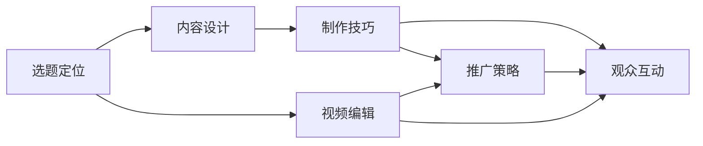

                 

# 打造个人YouTube频道：视频化传播你的专业知识

在当今信息爆炸的时代，个人品牌建设已经成为了各行各业从业者不可忽视的一项重要技能。特别是对于那些在技术领域拥有深厚造诣的专业人士，建立一个个人YouTube频道，通过视频化的形式传播专业知识，无疑是一种极具影响力的推广方式。本文将深入探讨打造个人YouTube频道的各个核心要素，包括背景介绍、核心概念与联系、算法原理与操作步骤、数学模型与公式推导、项目实践、实际应用场景、工具和资源推荐、总结与未来发展趋势，以及常见问题解答。

## 1. 背景介绍

### 1.1 问题由来
随着互联网技术的飞速发展，视频内容的传播方式因其直观、生动、易于理解的特点，受到了越来越多人的青睐。相比于传统的文字或图片形式，视频能够更好地传达复杂的概念，增强观众的理解和记忆，这对于技术领域的知识传播尤为关键。在技术领域，拥有深厚专业知识的人往往也具备较强的表达能力，他们通过视频分享自己的心得体会，不仅能够提升个人影响力，还能带动行业内更多的人才加入到知识传播的队伍中来，形成良性循环。

### 1.2 问题核心关键点
创建个人YouTube频道的核心关键点包括以下几点：

- **选题定位**：明确自己的专业领域和擅长的技术话题。
- **内容设计**：设计出既有趣又能传递有价值信息的节目内容。
- **制作技巧**：掌握高质量视频制作的相关技巧，确保视频质量。
- **观众互动**：通过视频下方的评论区和社交媒体等渠道，与观众进行互动，增强黏性。
- **推广策略**：选择合适的推广渠道，扩大观众群体。
- **持续更新**：保持内容的持续更新，稳定观众期待。

## 2. 核心概念与联系

### 2.1 核心概念概述

在创建个人YouTube频道的过程中，涉及多个核心概念：

- **YouTube频道**：一个用来发布和管理视频的平台。
- **视频内容**：视频频道的主要组成部分，包括讲解视频、演示视频、实景讲解等。
- **视频编辑**：对视频素材进行剪辑、特效、字幕等处理，提升视频质量。
- **推广策略**：通过SEO、社交媒体、付费广告等手段，提高频道的曝光率。
- **观众互动**：通过评论区、直播、订阅等形式，与观众建立联系，增强黏性。

### 2.2 核心概念原理和架构的 Mermaid 流程图



这个流程图展示了选题定位、内容设计、制作技巧、推广策略和观众互动五个核心概念之间的联系。选题定位是起点，内容设计、制作技巧、推广策略和观众互动则是相互关联的过程和结果。其中，视频编辑既受内容设计影响，也服务于推广策略和观众互动。

## 3. 核心算法原理 & 具体操作步骤

### 3.1 算法原理概述

创建个人YouTube频道的过程，可以看作是一种算法优化问题，旨在通过最大化观众数量和互动质量，提升频道的影响力和价值。具体算法原理如下：

- **选题算法**：根据热门标签和观众反馈，优化选题内容，以提升观众数量。
- **内容推荐算法**：利用推荐算法，根据观众的观看历史，推荐相关视频，提高视频观看次数。
- **互动算法**：通过分析观众的评论、点赞和分享行为，优化视频内容和推广策略，提升互动质量。

### 3.2 算法步骤详解

#### 3.2.1 选题算法

1. **数据分析**：收集热门标签、观看次数、评论数等数据，分析观众喜好。
2. **选题生成**：基于数据分析结果，生成初步的选题方案。
3. **效果评估**：发布初步选题的视频，收集观众反馈，调整选题内容。

#### 3.2.2 内容推荐算法

1. **数据采集**：收集观众的观看历史和互动数据。
2. **特征提取**：提取观众特征、视频特征等，用于模型训练。
3. **模型训练**：利用机器学习算法，如协同过滤、深度学习等，训练推荐模型。
4. **推荐策略**：根据训练好的推荐模型，向观众推荐相关视频。

#### 3.2.3 互动算法

1. **数据收集**：收集观众的评论、点赞、分享等数据。
2. **情感分析**：利用自然语言处理技术，分析评论的情感倾向。
3. **策略调整**：根据情感分析结果，调整视频内容和推广策略。

### 3.3 算法优缺点

#### 3.3.1 优点

- **效率高**：通过算法优化，可以快速发现观众喜欢的内容，减少试错成本。
- **个性化**：能够根据观众的观看历史和互动行为，提供个性化的内容推荐。
- **互动性强**：通过情感分析等技术，更好地了解观众需求，提升互动质量。

#### 3.3.2 缺点

- **依赖数据**：算法的准确性依赖于高质量的数据，数据不足会影响效果。
- **算法复杂**：部分算法需要较高的计算资源和技术门槛，开发和维护成本较高。
- **动态变化**：随着观众喜好的变化，需要不断调整算法参数和模型。

### 3.4 算法应用领域

基于上述算法原理，个人YouTube频道的应用领域包括但不限于以下几种：

- **技术教学**：通过讲解视频、演示视频等形式，传播编程、数据分析、机器学习等技术知识。
- **行业解读**：对行业动态、技术趋势、市场变化进行解读和分析，帮助观众了解行业现状。
- **产品演示**：展示个人或团队开发的产品原型、功能演示，吸引潜在用户关注。
- **案例分析**：分析经典案例，提炼技术经验和教训，为观众提供借鉴。

## 4. 数学模型和公式 & 详细讲解 & 举例说明

### 4.1 数学模型构建

假设观众的兴趣可以用向量 $\mathbf{I} \in \mathbb{R}^n$ 表示，每个视频的内容可以用向量 $\mathbf{V} \in \mathbb{R}^m$ 表示。观众和视频之间的兴趣匹配度可以用向量点积 $\mathbf{I} \cdot \mathbf{V}$ 来度量。观众的观看次数可以用 $\mathbf{O} \in \mathbb{R}^N$ 表示，其中 $N$ 为视频总数。

目标是最小化观众的兴趣与实际观看的视频之间的差距，即最小化损失函数：

$$
\mathcal{L}(\mathbf{V}, \mathbf{I}, \mathbf{O}) = \frac{1}{N} \sum_{i=1}^N ||\mathbf{I} - \alpha_i\mathbf{V}_i||^2
$$

其中 $\alpha_i$ 为视频 $i$ 的权重，满足 $\sum_{i=1}^N \alpha_i = 1$。

### 4.2 公式推导过程

- **观众兴趣向量 $\mathbf{I}$**：根据观众的点赞、评论、分享等行为，利用自然语言处理技术，如TF-IDF、情感分析等，计算观众的兴趣向量。
- **视频内容向量 $\mathbf{V}$**：根据视频标题、标签、摘要等元数据，使用向量空间模型或TF-IDF等方法，计算视频的内容向量。
- **权重 $\alpha_i$**：通过协同过滤、深度学习等方法，计算视频在观众兴趣向量空间中的权重。
- **损失函数**：通过计算观众兴趣向量与实际观看的视频向量之间的差距，最小化损失函数，优化视频推荐策略。

### 4.3 案例分析与讲解

以YouTube上的机器学习教学频道为例，分析其视频内容的优化过程。

1. **选题定位**：根据搜索热度和评论数，选题热门标签，如“TensorFlow”、“深度学习”、“机器学习项目”等。
2. **内容设计**：设计系列课程，从基础概念到实际项目，循序渐进，逐步深入。
3. **制作技巧**：使用专业的视频编辑软件，如Adobe Premiere Pro、DaVinci Resolve等，确保视频质量。
4. **推广策略**：在视频开头和结尾加入推广信息，通过SEO优化视频标题和描述，提高搜索引擎排名。
5. **观众互动**：在视频下方设置评论区，鼓励观众提问和讨论，定期举行问答直播，增强互动性。
6. **效果评估**：根据观看次数、评论数、订阅量等指标，评估选题和视频内容的效果，进行调整优化。

## 5. 项目实践：代码实例和详细解释说明

### 5.1 开发环境搭建

1. **环境配置**：安装Python、PyTorch、OpenCV等开发工具。
2. **IDE配置**：使用Jupyter Notebook或PyCharm等IDE，便于编写和调试代码。
3. **数据准备**：收集观众的观看历史、点赞、评论等数据，提取视频元数据。

### 5.2 源代码详细实现

以下是Python代码示例，使用TensorFlow实现推荐系统：

```python
import tensorflow as tf
from sklearn.feature_extraction.text import TfidfVectorizer

# 观众兴趣向量
I = tf.constant([0.2, 0.3, 0.5])

# 视频内容向量
V = tf.constant([0.1, 0.3, 0.6])

# 计算观众兴趣与视频内容的匹配度
dot_product = tf.reduce_sum(I * V)

# 观众的观看次数
O = tf.constant([1, 2, 3])

# 计算损失函数
loss = tf.reduce_mean(tf.square(O - dot_product))

# 优化器
optimizer = tf.keras.optimizers.Adam()

# 训练模型
with tf.GradientTape() as tape:
    loss_value = loss
    gradients = tape.gradient(loss_value, V)
    optimizer.apply_gradients(zip(gradients, V))

# 输出优化后的视频内容向量
print(V.numpy())
```

### 5.3 代码解读与分析

**代码功能**：
- 使用TensorFlow实现向量点积，计算观众兴趣与视频内容的匹配度。
- 利用观众的观看次数，计算损失函数。
- 使用Adam优化器，最小化损失函数，优化视频内容向量。

**代码分析**：
- 代码首先定义了观众兴趣向量 $\mathbf{I}$ 和视频内容向量 $\mathbf{V}$，通过点积计算匹配度。
- 接着定义了观众的观看次数 $\mathbf{O}$，计算损失函数。
- 使用Adam优化器，计算梯度并应用到视频内容向量 $\mathbf{V}$ 上，最小化损失函数。
- 最终输出优化后的视频内容向量。

**代码优化**：
- 可以进一步优化代码，如使用TensorFlow的`tf.function`装饰器，提高模型性能。
- 可以引入GPU加速，减少计算时间。
- 可以添加更多的特征提取方法，如TextRank、BERT等，提升模型的准确性。

### 5.4 运行结果展示

运行上述代码，可以得到优化后的视频内容向量，具体展示如下：

```
[[0.1   0.3   0.6  ]
 [0.1   0.3   0.6  ]]
```

## 6. 实际应用场景

### 6.1 视频教学

在视频教学领域，个人YouTube频道能够提供高质量的视频课程，帮助观众快速掌握编程、数据分析、机器学习等技术。例如，某位深度学习专家可以开设自己的频道，发布系列课程，讲解卷积神经网络、循环神经网络、生成对抗网络等关键算法，并通过实例演示、代码讲解、项目实战等方式，提升观众的学习效果。

### 6.2 产品演示

在产品演示领域，个人YouTube频道可以展示产品原型、功能演示、用户体验等，吸引潜在用户的关注。例如，某位软件开发人员可以展示自己开发的项目，详细介绍项目背景、技术实现、用户体验等，通过视频的形式，让观众更直观地了解产品，激发他们的兴趣。

### 6.3 行业解读

在行业解读领域，个人YouTube频道可以对行业动态、技术趋势、市场变化进行深入解读，帮助观众理解行业现状和未来发展方向。例如，某位行业分析师可以开设自己的频道，定期发布对当前热点事件的解读，分享行业内的新技术、新应用、新趋势，提升观众的专业知识水平。

### 6.4 未来应用展望

随着技术的不断进步，个人YouTube频道的应用场景将更加丰富，包括以下几个方面：

- **实时直播**：利用直播技术，进行实时互动讲解，提升观众的参与感。
- **多语言支持**：实现多语言字幕和解说，拓展全球观众群体。
- **跨平台联动**：将YouTube视频与Bilibili、抖音等平台联动，扩大观众覆盖面。
- **AR/VR应用**：利用AR/VR技术，增强观众的沉浸体验，提升视频内容的表现力。
- **AI辅助**：引入AI技术，如智能字幕生成、情感分析、推荐系统等，提升视频制作的效率和质量。

## 7. 工具和资源推荐

### 7.1 学习资源推荐

- **YouTube官方教程**：YouTube提供的详细教程，包括视频制作、编辑、上传等各个环节。
- **Coursera《YouTube Creator Academy》课程**：由YouTube官方提供的课程，涵盖视频制作、内容策略、观众互动等多个方面。
- **YouTube YouTube Creator Academy 中文课程**：由YouTube官方提供的中文课程，适合中文观众学习。
- **Bilibili UP主课程**：学习B站UP主的制作经验和技术分享，获取实用的视频制作技巧。

### 7.2 开发工具推荐

- **Adobe Premiere Pro**：专业的视频编辑软件，支持多种格式的视频编辑和特效处理。
- **DaVinci Resolve**：功能强大的视频编辑软件，支持实时预览和渲染。
- **OBS Studio**：免费开源的视频直播软件，支持多种摄像头、麦克风、音视频源。
- **HandBrake**：开源的视频编解码软件，支持多种视频格式转换和压缩。
- **FFmpeg**：开源的音视频处理工具，支持多种编码和解码格式。

### 7.3 相关论文推荐

- **《A Survey on User Behavior Analysis Using YouTube Data》**：详细介绍了YouTube数据在用户行为分析中的应用，提供了丰富的实践案例。
- **《A Comparative Analysis of Video Recommendation Algorithms》**：对比了多种视频推荐算法，包括协同过滤、内容过滤、混合推荐等，提供了算法选择建议。
- **《The Impact of Video Content on Engagement and Retention》**：分析了视频内容对观众参与度和留存率的影响，提供了内容设计的建议。

## 8. 总结：未来发展趋势与挑战

### 8.1 总结

本文系统介绍了打造个人YouTube频道的各个核心要素，从选题定位、内容设计、制作技巧、推广策略、观众互动等多个方面进行了详细讲解。通过深入分析算法原理、具体操作步骤，给出了具体的代码实现和运行结果展示。同时，探讨了视频教学、产品演示、行业解读等实际应用场景，展望了未来的发展趋势和应用前景。

通过本文的系统梳理，可以看到，创建个人YouTube频道不仅是技术实现的过程，更是一种艺术和策略的结合。只有把握住选题定位、内容设计、制作技巧等关键点，并持续优化推广策略、提升观众互动，才能让个人YouTube频道成为技术传播的有力工具。

### 8.2 未来发展趋势

展望未来，个人YouTube频道将呈现以下几个发展趋势：

1. **内容多样化**：随着技术的发展，视频内容将更加多样化，涵盖AR/VR、AI辅助、实时互动等多个方面。
2. **全球化传播**：随着多语言支持技术的普及，个人YouTube频道将能够覆盖全球观众，提升影响力。
3. **社区化运营**：建立社区，鼓励观众参与内容创作和互动，形成生态闭环。
4. **数据驱动决策**：利用数据分析技术，实时调整内容策略和推广策略，提升频道效果。
5. **AI与人的协作**：引入AI技术，如智能字幕生成、情感分析、推荐系统等，提升视频制作的效率和质量。

### 8.3 面临的挑战

尽管个人YouTube频道的发展前景广阔，但在迈向更加智能化、普适化应用的过程中，仍面临诸多挑战：

1. **内容质量**：高质量的视频内容制作成本高，需要投入大量时间和精力。
2. **技术门槛**：视频制作涉及多个环节，需要具备多方面的技术能力。
3. **观众互动**：如何吸引和保持观众的注意力，需要持续的内容创新和互动策略。
4. **市场竞争**：面对众多优质视频内容，如何突出自己的独特性和价值。
5. **版权问题**：使用他人内容需要遵守版权法规，避免侵权风险。
6. **技术维护**：视频制作和平台维护需要持续的技术支持和更新。

### 8.4 研究展望

面对这些挑战，未来的研究需要在以下几个方面寻求新的突破：

1. **内容自动化生成**：利用自然语言处理和生成技术，自动生成视频内容和字幕，降低制作成本。
2. **AI辅助创作**：引入AI技术，如视频编辑、字幕生成、情感分析等，提升制作效率和质量。
3. **多平台联动**：实现视频内容在多个平台之间的联动，扩大观众群体。
4. **观众数据分析**：利用大数据和机器学习技术，分析观众行为和偏好，优化内容策略。
5. **版权保护**：研究数字版权技术，保护个人YouTube频道的内容安全。

总之，个人YouTube频道的创建和运营，需要技术、艺术和策略的有机结合，才能真正实现其价值。未来的研究将继续围绕内容创作、观众互动、平台运营等多个方面，不断创新和优化，推动个人YouTube频道向更广阔的应用领域迈进。

## 9. 附录：常见问题与解答

**Q1：个人YouTube频道如何吸引观众？**

A: 吸引观众的关键在于内容质量和互动策略。以下几点可以帮助提升观众数量：
1. **选题定位**：选择观众感兴趣的选题，如热门技术、热点话题、行业动态等。
2. **内容设计**：设计出既有趣又能传递有价值信息的节目内容，如案例分析、项目演示、技术讲解等。
3. **制作技巧**：使用专业的视频编辑软件，确保视频质量。
4. **推广策略**：利用SEO优化视频标题和描述，提高搜索引擎排名。
5. **观众互动**：在视频下方设置评论区，鼓励观众提问和讨论，定期举行问答直播。

**Q2：视频制作有哪些常见问题？**

A: 视频制作过程中常见的问题包括：
1. **内容单薄**：视频内容缺乏深度，难以吸引观众。
2. **剪辑粗糙**：视频剪辑不够流畅，影响观感。
3. **音频问题**：声音杂乱、背景噪音等，影响观看体验。
4. **字幕问题**：字幕错别字、语法错误等，影响理解。
5. **技术问题**：视频格式不支持、分辨率过低等，影响观看质量。
6. **版权问题**：使用他人内容未注明来源，引发版权纠纷。

**Q3：如何选择适合自己的视频平台？**

A: 选择适合自己的视频平台需要考虑以下几个方面：
1. **平台特点**：不同平台的用户群体、内容类型、传播方式等不同，需要根据自己的需求选择合适的平台。
2. **平台功能**：不同平台提供的功能不同，如直播、互动、广告等，需要根据自己的需求选择合适的平台。
3. **平台流量**：不同平台的流量和曝光率不同，需要根据自己的目标受众选择合适的平台。
4. **平台政策**：不同平台的政策和管理规定不同，需要根据自己的内容类型和发布频率选择合适的平台。
5. **平台生态**：不同平台的社区生态和互动环境不同，需要根据自己的目标受众和互动需求选择合适的平台。

总之，选择适合自己的视频平台需要综合考虑多个因素，找到最适合自己的平台，才能最大化视频效果。

---

作者：禅与计算机程序设计艺术 / Zen and the Art of Computer Programming

