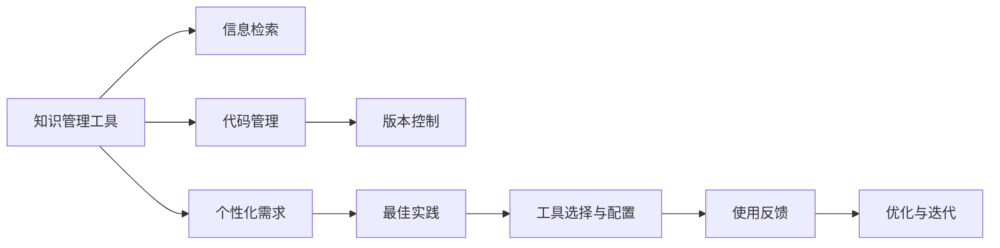

                 

# 打造个人知识管理工具:程序员实战

> 关键词：知识管理, 程序员, 信息检索, 代码管理, 工具推荐, 实践指南, 最佳实践

## 1. 背景介绍

### 1.1 问题由来

在当今这个信息爆炸的时代，无论是科研工作者还是软件开发人员，每天都需要面对大量的信息输入和输出。对于程序员来说，个人知识管理工具不仅能帮助他们高效地组织、检索和管理技术资料，还能提升代码编写和项目管理的效率。然而，如何打造一款真正适合自己的个人知识管理工具，却是一大难题。

### 1.2 问题核心关键点

- **知识管理的重要性**：知识的积累和利用是程序员成长的基石，有效的知识管理工具能显著提升个人的工作效率和学习能力。
- **个性化需求**：每个程序员的工作习惯和技能水平不同，因此，一个通用的知识管理工具很难满足所有用户的需求。
- **工具的选择与配置**：市面上有许多知识管理工具，但如何选择合适的工具，并根据个人需求进行定制化配置，是成功使用知识管理工具的关键。

### 1.3 问题研究意义

研发一款符合程序员个性化需求的个人知识管理工具，不仅可以提升个人的工作效率和学习能力，还能为其他开发人员提供参考和借鉴。此外，这种实践经验也能推动知识管理工具的持续发展和改进。

## 2. 核心概念与联系

### 2.1 核心概念概述

为了更好地理解如何打造符合程序员需求的个人知识管理工具，本节将介绍几个核心概念：

- **知识管理工具**：包括但不限于笔记软件、代码管理工具、文档编辑器、版本控制系统等，它们帮助程序员组织、检索和管理知识。
- **信息检索**：通过搜索技术，快速定位到所需信息的能力。
- **代码管理**：通过版本控制、注释、文档等手段，管理代码的变化和历史。
- **个性化需求**：基于个人的工作习惯和技能水平，定制化配置知识管理工具。
- **最佳实践**：在工具选择和使用过程中，遵循的一些标准化做法，以提升效率和效果。

这些概念之间存在密切联系，共同构成了个人知识管理工具的基础框架。

### 2.2 核心概念原理和架构的 Mermaid 流程图(Mermaid 流程节点中不要有括号、逗号等特殊字符)



这个流程图展示了个人知识管理工具的各个组成部分及其相互关系：

1. **知识管理工具**：提供存储、检索和管理知识的功能。
2. **信息检索**：通过搜索技术快速定位信息。
3. **代码管理**：管理代码的变化和历史。
4. **个性化需求**：根据个人需求定制工具。
5. **最佳实践**：提升效率和效果的标准化做法。
6. **工具选择与配置**：选择和使用工具的策略。
7. **使用反馈**：根据使用体验进行优化。
8. **优化与迭代**：不断改进和升级工具。

## 3. 核心算法原理 & 具体操作步骤

### 3.1 算法原理概述

打造个人知识管理工具的核心算法原理主要涉及以下几个方面：

- **数据结构设计**：选择合适的数据结构，如哈希表、树、图等，以高效地存储和检索信息。
- **信息检索算法**：如倒排索引、TF-IDF、基于图的检索等，确保能够快速定位到所需信息。
- **代码管理算法**：如Git版本控制、Docker容器管理等，实现代码的追踪和重现。
- **个性化推荐算法**：如协同过滤、基于内容的推荐等，根据个人兴趣和历史行为推荐相关信息。

### 3.2 算法步骤详解

打造个人知识管理工具涉及以下几个关键步骤：

**Step 1: 需求分析**

- 分析个人的工作习惯、技能水平和需求，确定知识管理工具需要支持的功能和特性。

**Step 2: 选择工具**

- 根据需求选择合适的工具，如笔记软件、代码管理工具、文档编辑器等。

**Step 3: 配置工具**

- 根据个人需求对所选工具进行配置，如自定义模板、设置快捷键、配置插件等。

**Step 4: 数据收集**

- 收集日常工作中涉及到的所有信息，如代码片段、文档、笔记等。

**Step 5: 信息整理**

- 对收集到的信息进行分类、标注和归档，建立索引体系。

**Step 6: 信息检索**

- 利用信息检索算法，快速定位到所需信息。

**Step 7: 代码管理**

- 使用版本控制工具，管理代码的变化和历史。

**Step 8: 数据分析**

- 利用数据分析工具，统计信息使用频率、代码变动频率等，发现使用模式和趋势。

**Step 9: 工具优化**

- 根据使用反馈，不断优化和调整知识管理工具的设置和功能。

### 3.3 算法优缺点

**优点**：

- 提高效率：通过高效的检索和组织机制，可以快速定位到所需信息。
- 提升学习：通过代码管理和文档编辑，能更好地记录和回顾学习过程。
- 增强协作：使用版本控制和共享功能，方便团队协作。

**缺点**：

- 初始配置复杂：需要花费一定时间对工具进行个性化配置。
- 学习曲线陡峭：需要掌握一些工具的高级功能和技巧。
- 数据隐私风险：数据存储和传输过程中可能存在隐私泄露的风险。

### 3.4 算法应用领域

个人知识管理工具的应用领域非常广泛，包括但不限于：

- **开发项目**：通过代码管理、文档编辑和版本控制，提升代码编写和项目管理效率。
- **学习研究**：通过笔记记录和信息检索，整理和回顾学习资料，提升学习效率。
- **日常工作**：通过邮件、笔记、任务管理等工具，优化日常工作流程。
- **个人博客**：通过文档编辑器和发布工具，撰写和发布技术文章。
- **技术分享**：通过协作工具和版本控制，与他人共享代码和技术文档。

## 4. 数学模型和公式 & 详细讲解 & 举例说明（备注：数学公式请使用latex格式，latex嵌入文中独立段落使用 $$，段落内使用 $)
### 4.1 数学模型构建

为了更好地理解个人知识管理工具的工作原理，本节将介绍几个常用的数学模型：

- **倒排索引模型**：将文档库中的每个单词与其出现位置记录下来，用于快速检索包含特定单词的文档。
- **TF-IDF模型**：衡量一个单词在文档中的重要性，用于文档相似度计算和信息检索。
- **Git版本控制模型**：通过版本控制技术，记录代码的变化和历史。

### 4.2 公式推导过程

**倒排索引模型**：

$$
\text{Index} = \{ (w_i, \{d_j\}_{j \in D}) \mid w_i \in W, D \subset D_{\text{docs}} \}
$$

其中 $w_i$ 表示单词，$d_j$ 表示包含该单词的文档，$D$ 表示包含单词 $w_i$ 的文档集合。

**TF-IDF模型**：

$$
\text{TF-IDF}_{d_i}(w_j) = \text{TF}_{d_i}(w_j) \times \text{IDF}(w_j)
$$

其中 $\text{TF}_{d_i}(w_j)$ 表示单词 $w_j$ 在文档 $d_i$ 中的词频，$\text{IDF}(w_j)$ 表示单词 $w_j$ 在整个文档集中的逆文档频率。

**Git版本控制模型**：

$$
\text{Commit} = (\text{ID}, \text{author}, \text{date}, \text{message}, \text{parent\_commit}, \text{parent\_hash})
$$

其中 $\text{ID}$ 表示提交的ID，$\text{author}$ 和 $\text{date}$ 表示提交者和时间，$\text{message}$ 表示提交信息，$\text{parent\_commit}$ 和 $\text{parent\_hash}$ 表示该提交的父提交信息及其哈希值。

### 4.3 案例分析与讲解

假设我们要管理一个开发项目的代码和文档。我们可以使用Git作为版本控制工具，使用Markdown作为文档格式，使用Jekyll作为博客发布工具。通过Git记录代码的变化和历史，通过Markdown编写和组织文档，通过Jekyll将文档发布到GitHub Pages上。这样可以形成一个完整的知识管理链条，提升项目管理的效率和效果。

## 5. 项目实践：代码实例和详细解释说明

### 5.1 开发环境搭建

在进行个人知识管理工具的开发和实践之前，需要搭建好开发环境。以下是使用Python和Jupyter Notebook进行知识管理工具开发的流程：

1. 安装Anaconda：从官网下载并安装Anaconda，用于创建独立的Python环境。

2. 创建并激活虚拟环境：
```bash
conda create -n knowledge-management python=3.8 
conda activate knowledge-management
```

3. 安装必要的工具包：
```bash
pip install pygitversion markupsafe jinja2 numpy pandas pyyaml
```

4. 安装Git：从官网下载并安装Git，配置Git用户信息。

### 5.2 源代码详细实现

下面以一个简单的Git版本控制工具为例，给出其代码实现：

```python
import git
import os

def get_committers(project_path):
    repo = git.Repo(project_path)
    committers = [commit.author.name for commit in repo.iter_commits()]
    return committers

def get_changed_files(project_path):
    repo = git.Repo(project_path)
    changed_files = repo.git.diff().split('\n')
    return changed_files

def get_last_commit_message(project_path):
    repo = git.Repo(project_path)
    commit_message = repo.head.commit.message
    return commit_message

def get_changed_lines(project_path):
    repo = git.Repo(project_path)
    changed_lines = repo.git.diff('--summary').split('\n')
    return changed_lines

def save_committers_to_file(project_path, output_path):
    committers = get_committers(project_path)
    with open(output_path, 'w') as f:
        f.write('\n'.join(committers))

def save_changed_files_to_file(project_path, output_path):
    changed_files = get_changed_files(project_path)
    with open(output_path, 'w') as f:
        f.write('\n'.join(changed_files))

def save_changed_lines_to_file(project_path, output_path):
    changed_lines = get_changed_lines(project_path)
    with open(output_path, 'w') as f:
        f.write('\n'.join(changed_lines))

def save_last_commit_message_to_file(project_path, output_path):
    commit_message = get_last_commit_message(project_path)
    with open(output_path, 'w') as f:
        f.write(commit_message)
```

### 5.3 代码解读与分析

这段代码实现了几个基本的功能：获取提交者、获取修改的文件、获取提交信息、获取修改的行数以及保存这些信息到文件中。

**get_committers函数**：使用Git库获取项目提交者的信息，并返回一个包含所有提交者的列表。

**get_changed_files函数**：使用Git库获取项目修改的文件列表。

**get_changed_lines函数**：使用Git库获取项目修改的行数。

**get_last_commit_message函数**：使用Git库获取项目最新的提交信息。

**save_committers_to_file、save_changed_files_to_file、save_changed_lines_to_file和save_last_commit_message_to_file函数**：将获取到的信息保存到一个文本文件中。

### 5.4 运行结果展示

通过运行上述代码，可以获取项目的提交者、修改的文件、修改的行数以及最新的提交信息，并将这些信息保存到文本文件中。这样，我们就可以通过查看这些文件，了解项目的历史变化和当前的开发状态。

## 6. 实际应用场景

### 6.1 开发项目

在开发项目中，个人知识管理工具可以大大提升代码管理和项目协作的效率。例如，通过Git版本控制工具记录代码的变化历史，可以快速定位到问题的根源。通过版本控制工具的协作功能，方便团队成员进行代码审查和合并。

### 6.2 学习研究

学习研究中，个人知识管理工具可以帮助整理和回顾学习资料。例如，使用Markdown编写笔记和文档，通过Git版本控制记录学习过程，方便日后查阅和修改。使用知识管理工具，还可以快速检索到相关的学习资料，提升学习效率。

### 6.3 日常工作

在日常工作中，个人知识管理工具可以提升邮件管理和任务管理效率。例如，通过邮件客户端的插件，可以快速检索到相关邮件。通过任务管理工具，可以记录和管理工作任务，提升工作效率。

### 6.4 未来应用展望

未来，个人知识管理工具有望在更多领域得到应用，例如医疗、法律、金融等专业领域。通过个性化的知识管理工具，可以帮助专业人士更高效地管理和利用知识，提升工作效率和决策能力。

## 7. 工具和资源推荐

### 7.1 学习资源推荐

为了帮助程序员掌握个人知识管理工具，推荐以下几个学习资源：

1. **《Git Pro: The Definitive Guide》**：详细介绍了Git版本控制工具的使用方法和最佳实践。
2. **《Markdown Essentials》**：介绍了Markdown的语法和应用场景。
3. **《Jupyter Notebooks User Guide》**：介绍了Jupyter Notebook的使用方法和高级功能。
4. **《Version Control for Version Sensitive Projects》**：介绍了如何使用版本控制工具管理项目。
5. **《Programming Euler: An Introduction to Computer Science Using Python》**：通过实际项目展示了如何使用Python进行编程和项目管理。

通过这些学习资源，程序员可以系统掌握个人知识管理工具的理论和实践技能。

### 7.2 开发工具推荐

以下是几款用于个人知识管理工具开发的常用工具：

1. **Git**：最流行的版本控制工具，支持分布式版本控制和协作功能。
2. **Markdown**：轻量级文档格式，适合编写和组织文档。
3. **Jupyter Notebook**：交互式编程环境，支持多种编程语言，适合数据科学和机器学习项目。
4. **Visual Studio Code**：轻量级代码编辑器，支持多种插件和扩展，适合多种编程语言。
5. **Atom**：可扩展的文本编辑器，支持多种主题和插件，适合代码管理和文档编辑。

这些工具各有优势，程序员可以根据自己的需求选择合适的工具进行使用。

### 7.3 相关论文推荐

个人知识管理工具的研究涉及许多前沿话题，以下是几篇奠基性的相关论文，推荐阅读：

1. **《The Evolution of Version Control Systems》**：介绍了版本控制系统的历史和发展。
2. **《Version Control with Git》**：介绍了Git版本控制工具的核心原理和使用方法。
3. **《Designing a Web-based Git Repository》**：介绍了Web-based Git仓库的设计和实现。
4. **《Markdown: The Definitive Reference》**：详细介绍了Markdown的语法和应用场景。
5. **《A Survey on Knowledge Management Systems》**：介绍了知识管理系统的发展和应用。

这些论文代表了大数据管理工具的研究方向和前沿成果，程序员可以通过学习这些论文，深入理解个人知识管理工具的理论基础和技术实现。

## 8. 总结：未来发展趋势与挑战

### 8.1 总结

本文对个人知识管理工具的开发和实践进行了全面系统的介绍。首先阐述了个人知识管理工具的重要性，明确了开发和实践的核心要点。其次，从算法原理到实际操作，详细讲解了个人知识管理工具的设计和实现过程。最后，探讨了个人知识管理工具的未来发展趋势和面临的挑战。

通过本文的系统梳理，可以看到，个人知识管理工具在提升程序员工作效率和学习能力方面具有重要价值，同时也存在一些挑战和局限性。未来，随着技术的不断进步和研究的深入，个人知识管理工具将更加智能和灵活，助力程序员更好地管理和利用知识。

### 8.2 未来发展趋势

个人知识管理工具的未来发展趋势主要包括以下几个方面：

1. **智能化**：通过AI技术，自动推荐相关资料和学习路径，提升学习效率。
2. **可视化**：通过图表和可视化工具，展示项目进展和学习成果，帮助开发者更好地理解和利用知识。
3. **跨平台**：支持多种平台和设备，方便用户在不同的环境中使用。
4. **协作化**：支持团队协作和版本控制，提升项目管理和代码协作的效率。
5. **自适应**：根据用户的习惯和偏好，自动调整工具的设置和功能。

### 8.3 面临的挑战

尽管个人知识管理工具在提升工作效率和学习能力方面具有重要价值，但在实际应用中仍面临一些挑战：

1. **数据隐私**：个人知识管理工具涉及大量的数据，如何保护用户的隐私是一个重要问题。
2. **易用性**：一些高级功能的实现可能会降低工具的易用性，需要平衡功能和易用性。
3. **跨平台兼容性**：不同平台之间的数据格式和功能差异可能会影响用户体验。
4. **维护成本**：个人知识管理工具的维护和更新需要投入大量时间和资源。
5. **安全性**：如何保证工具的安全性和稳定性，避免数据泄露和系统崩溃。

### 8.4 研究展望

未来的研究可以从以下几个方面进行：

1. **自动化推荐**：利用机器学习技术，自动推荐相关资料和学习路径，提升学习效率。
2. **跨平台集成**：将个人知识管理工具与其他应用集成，实现数据和功能的互通。
3. **数据隐私保护**：开发隐私保护技术，保护用户数据的隐私和安全。
4. **用户行为分析**：通过数据分析技术，了解用户的使用习惯和偏好，提升工具的适应性和个性化程度。
5. **社区支持**：建立社区平台，帮助用户交流和分享知识管理经验，促进工具的不断优化和升级。

这些研究方向的探索，必将推动个人知识管理工具的持续发展和优化，使其成为程序员工作中不可或缺的利器。

## 9. 附录：常见问题与解答

**Q1：个人知识管理工具是否适用于非程序员？**

A: 个人知识管理工具不仅适用于程序员，还适用于所有需要进行信息管理和检索的用户。只要掌握基本的使用方法，任何人都可以在工作中受益。

**Q2：如何选择适合自己的个人知识管理工具？**

A: 选择个人知识管理工具时，需要考虑以下几个因素：

- 功能和特性是否满足需求。
- 是否易于上手和配置。
- 是否支持多种平台和设备。
- 是否具有良好社区支持和扩展性。
- 是否具备数据隐私保护措施。

**Q3：如何配置个人知识管理工具？**

A: 配置个人知识管理工具时，需要考虑以下几个方面：

- 自定义模板和样式。
- 配置快捷键和插件。
- 设置备份和恢复策略。
- 集成第三方应用和工具。

**Q4：使用个人知识管理工具有哪些好处？**

A: 使用个人知识管理工具有以下几个好处：

- 提升信息检索效率。
- 提升学习和工作效率。
- 提升项目管理和协作效率。
- 提升代码编写和版本控制效率。
- 提升工作体验和满意度。

**Q5：个人知识管理工具的未来发展方向是什么？**

A: 个人知识管理工具的未来发展方向主要包括以下几个方面：

- 智能化推荐和决策支持。
- 跨平台集成和数据互通。
- 数据隐私保护和安全性。
- 社区支持和用户互动。
- 自动化和自动化集成。

通过不断优化和创新，个人知识管理工具将更好地满足用户需求，提升个人和团队的工作效率和学习能力。

---

作者：禅与计算机程序设计艺术 / Zen and the Art of Computer Programming

