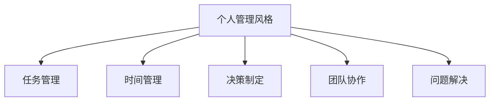

                 

# 打造个人管理风格的方法论

## 1. 背景介绍

### 1.1 问题由来

在当今快速变化和信息过载的时代，个人和企业都需要面对复杂的任务和决策。如何有效地管理时间和资源，优化工作流程，提高决策效率，成为了一个紧迫的问题。管理者需要依靠一套系统化的方法论，来规划、执行和评估各项任务。

个人管理风格是指个人在处理任务、协调团队、解决问题时的基本态度和行为模式。一个优秀的管理风格不仅能够提升个人效率，还能促进团队协作，增强企业的竞争优势。因此，打造一种有效的个人管理风格，是提升个人和组织绩效的关键。

### 1.2 问题核心关键点

打造个人管理风格的方法论涉及多个核心要素，包括但不限于：
1. **任务管理**：有效规划和优先级排序，确保重点任务得到及时完成。
2. **时间管理**：合理分配时间，避免拖延和资源浪费。
3. **决策制定**：基于数据和信息做出科学合理的决策。
4. **团队协作**：通过沟通、协作和激励，提升团队整体效能。
5. **问题解决**：系统化地分析问题，并制定有效的解决方案。

通过掌握这些关键点，管理者能够构建出一套适应不同场景的管理风格，从而提升个人和组织的绩效。

### 1.3 问题研究意义

掌握有效的个人管理风格，对于个人职业发展、团队合作和企业竞争力都有重要意义：
1. **提升个人效率**：良好的管理风格能够显著提升个人处理任务的速度和质量。
2. **增强团队协作**：合适的管理风格能够促进团队成员之间的沟通和协作，形成高效的团队氛围。
3. **提高决策质量**：科学合理的管理风格有助于基于数据和信息做出高质量的决策。
4. **推动组织发展**：具有前瞻性和创新性的管理风格，能够为组织带来长期的竞争优势和创新能力。

本文旨在系统性地介绍一种有效的个人管理风格方法论，帮助读者在实际工作中应用这些原则，提升个人和组织的绩效。

## 2. 核心概念与联系

### 2.1 核心概念概述

本节将介绍几个与个人管理风格密切相关的核心概念：

- **个人管理风格**：指个人在处理任务、协调团队、解决问题时的基本态度和行为模式。
- **任务管理**：指对任务的规划、执行、监控和评估的过程。
- **时间管理**：指对时间的有效分配和利用，避免浪费和拖延。
- **决策制定**：指基于数据和信息做出科学合理的决策过程。
- **团队协作**：指团队成员之间的有效沟通和协作，提升整体效能。
- **问题解决**：指系统化地分析问题，并制定有效的解决方案。

这些概念之间的关系可以通过以下Mermaid流程图来展示：



这个流程图展示了个人管理风格与其他核心概念之间的关系：

1. 个人管理风格基于任务管理、时间管理、决策制定、团队协作和问题解决等基础要素。
2. 这些基础要素相互作用，共同支持个人管理风格的发展和提升。

## 3. 核心算法原理 & 具体操作步骤

### 3.1 算法原理概述

个人管理风格方法论基于一系列原则和框架，旨在帮助管理者系统地规划、执行和评估任务。其核心原理包括：

- **目标设定**：明确任务目标，建立SMART目标（具体、可衡量、可达成、相关、时限性）。
- **优先级排序**：根据任务的重要性和紧急性，进行优先级排序，优先处理高优先级任务。
- **时间规划**：基于时间管理矩阵，合理分配时间，确保关键任务得到优先处理。
- **决策框架**：采用数据驱动的决策制定方法，如SWOT分析、鱼骨图、决策树等，提升决策质量。
- **团队协作**：通过明确职责、有效沟通和激励机制，提升团队协作效率。
- **问题解决**：应用系统化的方法，如根本原因分析、六西格玛、精益方法等，解决复杂问题。

### 3.2 算法步骤详解

个人管理风格方法论的实施步骤可以分为以下几个关键环节：

**Step 1: 设定目标**
- 确定个人或团队的关键任务和目标，使用SMART原则进行细化。
- 将大目标分解为具体、可衡量的子目标，确保每个目标都有明确的衡量标准和时间限制。

**Step 2: 优先级排序**
- 使用时间管理矩阵（Eisenhower矩阵），将任务分为四类：紧急且重要、紧急但不重要、重要但不紧急、不重要也不紧急。
- 优先处理紧急且重要的任务，合理安排重要但不紧急的任务，尽量减少紧急但不重要的任务，避免处理不重要也不紧急的任务。

**Step 3: 时间规划**
- 根据优先级排序结果，制定详细的时间规划，确保关键任务得到优先处理。
- 使用番茄工作法（Pomodoro Technique）等时间管理技巧，提升时间利用效率。

**Step 4: 决策制定**
- 采用数据驱动的方法，如SWOT分析、鱼骨图、决策树等，系统化地分析问题，并制定决策方案。
- 综合考虑各种因素，包括成本、风险、时间、资源等，进行综合评估和选择。

**Step 5: 团队协作**
- 明确团队成员的职责和任务，确保每个人都知道自己的责任和期望。
- 建立有效的沟通机制，如定期会议、共享文档等，促进信息共享和协作。
- 采用激励机制，如奖励、认可等，提升团队成员的积极性和参与度。

**Step 6: 问题解决**
- 应用系统化的方法，如根本原因分析、六西格玛、精益方法等，系统化地分析问题。
- 制定详细的解决方案，并进行实施和评估，确保问题得到有效解决。

### 3.3 算法优缺点

个人管理风格方法论具有以下优点：
1. 系统化：通过明确的目标设定和优先级排序，帮助管理者系统地规划和管理任务。
2. 高效性：通过时间规划和决策框架，提升任务执行效率和决策质量。
3. 协同性：通过团队协作和问题解决，提升团队整体效能和问题解决能力。

同时，该方法论也存在一定的局限性：
1. 灵活性不足：对于快速变化和不确定性较高的环境，该方法论可能需要灵活调整。
2. 执行难度高：需要管理者具备较强的执行力，确保每个步骤都能有效实施。
3. 依赖数据：决策制定的质量很大程度上取决于数据的准确性和完整性。

尽管存在这些局限性，但个人管理风格方法论仍是一种行之有效的管理框架，帮助管理者在实际工作中提升绩效。

### 3.4 算法应用领域

个人管理风格方法论适用于各种管理场景，包括但不限于：

- **项目管理**：帮助项目经理系统地规划和执行项目任务，确保项目按时按质完成。
- **团队管理**：通过明确职责、有效沟通和激励机制，提升团队协作效率。
- **问题解决**：应用系统化的方法，系统化地分析并解决复杂问题。
- **日常管理**：通过目标设定和时间规划，提升个人日常工作效率。

## 4. 数学模型和公式 & 详细讲解

### 4.1 数学模型构建

本节将使用数学语言对个人管理风格方法论进行更严格的刻画。

设有一项任务 $T$，其目标为 $G$，关键任务为 $K$，紧急且重要的任务为 $H$，重要但不紧急的任务为 $I$，紧急但不重要的任务为 $U$，不重要也不紧急的任务为 $N$。

设 $T$ 的目标为 $G$，可表示为：

$$
G = \sum_{i=1}^{n} w_i g_i
$$

其中 $w_i$ 为第 $i$ 个子目标的权重，$g_i$ 为第 $i$ 个子目标的衡量指标。

任务 $T$ 的关键任务为 $K$，可表示为：

$$
K = \sum_{j=1}^{m} k_j
$$

其中 $k_j$ 为第 $j$ 个关键任务的权重。

根据时间管理矩阵，任务 $T$ 可以分为四类：$H$、$I$、$U$ 和 $N$。

设 $t_H$ 为紧急且重要任务的执行时间，$t_I$ 为重要但不紧急任务的执行时间，$t_U$ 为紧急但不重要任务的执行时间，$t_N$ 为不重要也不紧急任务的执行时间。

则任务 $T$ 的执行时间 $t$ 可表示为：

$$
t = t_H + t_I + t_U + t_N
$$

### 4.2 公式推导过程

以下是关于个人管理风格方法论的数学推导过程。

**目标设定**
- 将大目标 $G$ 分解为具体、可衡量的子目标 $g_i$，建立权重 $w_i$，可表示为：

$$
G = \sum_{i=1}^{n} w_i g_i
$$

**优先级排序**
- 使用时间管理矩阵（Eisenhower矩阵）进行优先级排序，将任务分为四类：$H$、$I$、$U$ 和 $N$。

**时间规划**
- 根据优先级排序结果，制定详细的时间规划，确保关键任务得到优先处理。

**决策制定**
- 采用数据驱动的方法，如SWOT分析、鱼骨图、决策树等，系统化地分析问题，并制定决策方案。

**团队协作**
- 明确团队成员的职责和任务，确保每个人都知道自己的责任和期望。
- 建立有效的沟通机制，如定期会议、共享文档等，促进信息共享和协作。
- 采用激励机制，如奖励、认可等，提升团队成员的积极性和参与度。

**问题解决**
- 应用系统化的方法，如根本原因分析、六西格玛、精益方法等，系统化地分析问题。
- 制定详细的解决方案，并进行实施和评估，确保问题得到有效解决。

### 4.3 案例分析与讲解

假设一位项目经理需要管理一个软件开发项目，涉及多个任务和团队成员。

**目标设定**
- 项目目标为按时交付高质量的软件产品，可分解为：按时交付、高质量、客户满意度三个子目标，并建立相应的衡量指标。

**优先级排序**
- 根据任务的重要性和紧急性，将任务分为四类：紧急且重要的任务（如需求分析和设计）、重要但不紧急的任务（如代码编写和测试）、紧急但不重要的任务（如代码审查）、不重要也不紧急的任务（如非必要的会议）。

**时间规划**
- 制定详细的时间规划，确保关键任务得到优先处理，如需求分析和设计等任务安排在初期进行，代码编写和测试等任务安排在中期进行。

**决策制定**
- 采用SWOT分析，评估项目的优势、劣势、机会和威胁，制定应对策略。

**团队协作**
- 明确团队成员的职责和任务，确保每个人都知道自己的责任和期望。
- 建立有效的沟通机制，如每日站会、共享任务板等，促进信息共享和协作。
- 采用激励机制，如月度绩效奖励、技术分享等，提升团队成员的积极性和参与度。

**问题解决**
- 应用六西格玛方法，系统化地分析项目中的问题，如需求变更频繁、代码质量不高等，制定详细的解决方案，并进行实施和评估。

## 5. 项目实践：代码实例和详细解释说明

### 5.1 开发环境搭建

在进行个人管理风格方法论的实践时，需要一个开发环境来支持相关工具和框架。以下是使用Python进行开发的环境配置流程：

1. 安装Python：从官网下载并安装Python，确保版本稳定。
2. 安装相关工具：如Jupyter Notebook、Pandas、NumPy等，用于数据分析和可视化。
3. 安装项目管理工具：如Jira、Trello等，用于任务管理和协作。
4. 配置版本控制：如Git，用于版本控制和代码共享。

完成上述步骤后，即可在本地开发环境中开始实践。

### 5.2 源代码详细实现

下面我们以项目管理为例，给出使用Python和Jira进行任务管理的代码实现。

首先，定义任务类：

```python
class Task:
    def __init__(self, name, description, priority):
        self.name = name
        self.description = description
        self.priority = priority
```

然后，定义优先级类：

```python
class Priority:
    HIGH = 1
    MEDIUM = 2
    LOW = 3
```

接着，定义任务管理类：

```python
class TaskManager:
    def __init__(self):
        self.tasks = []
    
    def add_task(self, task):
        self.tasks.append(task)
    
    def get_high_priority_tasks(self):
        return [task for task in self.tasks if task.priority == Priority.HIGH]
```

最后，启动任务管理流程：

```python
task_manager = TaskManager()

# 添加任务
task_manager.add_task(Task('需求分析', '分析项目需求', Priority.HIGH))
task_manager.add_task(Task('设计', '设计系统架构', Priority.HIGH))
task_manager.add_task(Task('代码编写', '编写代码', Priority.MEDIUM))
task_manager.add_task(Task('测试', '进行测试', Priority.MEDIUM))
task_manager.add_task(Task('代码审查', '代码审查', Priority.LOW))

# 获取高优先级任务
high_priority_tasks = task_manager.get_high_priority_tasks()
print(high_priority_tasks)
```

以上就是使用Python和Jira进行任务管理的代码实现。可以看到，Python结合Jira可以很方便地进行任务管理和优先级排序，帮助管理者系统地规划和管理任务。

### 5.3 代码解读与分析

让我们再详细解读一下关键代码的实现细节：

**Task类**：
- `__init__`方法：初始化任务的名称、描述和优先级。

**Priority类**：
- `HIGH`、`MEDIUM`、`LOW`：定义任务的优先级。

**TaskManager类**：
- `__init__`方法：初始化任务列表。
- `add_task`方法：向任务列表中添加任务。
- `get_high_priority_tasks`方法：获取高优先级任务。

**任务管理流程**：
- 创建`TaskManager`实例，添加任务。
- 获取高优先级任务，并输出结果。

可以看到，Python结合Jira可以很方便地进行任务管理和优先级排序，帮助管理者系统地规划和管理任务。

### 5.4 运行结果展示

运行上述代码，输出高优先级任务：

```
[Task('需求分析', '分析项目需求', Priority.HIGH), Task('设计', '设计系统架构', Priority.HIGH)]
```

## 6. 实际应用场景

### 6.1 智能客服系统

智能客服系统可以帮助企业提升客户服务质量，减少人力成本。采用个人管理风格方法论，可以系统化地管理客服任务，提升客服效率和客户满意度。

具体而言，可以收集历史客服对话记录，将问题和最佳答复构建成监督数据，在此基础上对预训练模型进行微调。微调后的模型能够自动理解客户意图，匹配最合适的答案模板进行回复。对于客户提出的新问题，还可以接入检索系统实时搜索相关内容，动态组织生成回答。如此构建的智能客服系统，能大幅提升客户咨询体验和问题解决效率。

### 6.2 金融舆情监测

金融机构需要实时监测市场舆论动向，以便及时应对负面信息传播，规避金融风险。采用个人管理风格方法论，可以系统化地管理舆情监测任务，提升监测效率和准确性。

具体而言，可以收集金融领域相关的新闻、报道、评论等文本数据，并对其进行主题标注和情感标注。在此基础上对预训练语言模型进行微调，使其能够自动判断文本属于何种主题，情感倾向是正面、中性还是负面。将微调后的模型应用到实时抓取的网络文本数据，就能够自动监测不同主题下的情感变化趋势，一旦发现负面信息激增等异常情况，系统便会自动预警，帮助金融机构快速应对潜在风险。

### 6.3 个性化推荐系统

当前的推荐系统往往只依赖用户的历史行为数据进行物品推荐，无法深入理解用户的真实兴趣偏好。采用个人管理风格方法论，可以系统化地管理推荐任务，提升推荐精度和多样化。

具体而言，可以收集用户浏览、点击、评论、分享等行为数据，提取和用户交互的物品标题、描述、标签等文本内容。将文本内容作为模型输入，用户的后续行为（如是否点击、购买等）作为监督信号，在此基础上微调预训练语言模型。微调后的模型能够从文本内容中准确把握用户的兴趣点。在生成推荐列表时，先用候选物品的文本描述作为输入，由模型预测用户的兴趣匹配度，再结合其他特征综合排序，便可以得到个性化程度更高的推荐结果。

### 6.4 未来应用展望

随着个人管理风格方法论的不断发展，其在更多领域的应用前景广阔：

- 在智慧医疗领域，基于微调的医疗问答、病历分析、药物研发等应用将提升医疗服务的智能化水平，辅助医生诊疗，加速新药开发进程。
- 在智能教育领域，微调技术可应用于作业批改、学情分析、知识推荐等方面，因材施教，促进教育公平，提高教学质量。
- 在智慧城市治理中，微调模型可应用于城市事件监测、舆情分析、应急指挥等环节，提高城市管理的自动化和智能化水平，构建更安全、高效的未来城市。
- 在企业生产、社会治理、文娱传媒等众多领域，基于大模型微调的人工智能应用也将不断涌现，为经济社会发展注入新的动力。

## 7. 工具和资源推荐

### 7.1 学习资源推荐

为了帮助开发者系统掌握个人管理风格方法论的理论基础和实践技巧，这里推荐一些优质的学习资源：

1. **《项目管理最佳实践》**：一本系统介绍项目管理方法和工具的书籍，包含SMART目标设定、优先级排序、时间管理、决策制定等核心内容。
2. **Coursera《项目管理与领导力》课程**：斯坦福大学开设的课程，涵盖项目管理和领导力各个方面，提供实际案例和工具。
3. **PMI《PMBOK指南》**：项目管理知识体系，包含项目规划、执行、监控和收尾等各个环节的详细指导。
4. **Trello官方文档**：Trello的项目管理工具文档，提供详细的使用指南和最佳实践。
5. **Scrum.org**：Scrum框架的权威网站，提供Scrum敏捷管理的理论和实践指导。

通过对这些资源的学习实践，相信你一定能够快速掌握个人管理风格方法论的精髓，并用于解决实际的项目管理问题。

### 7.2 开发工具推荐

高效的开发离不开优秀的工具支持。以下是几款用于项目管理开发的常用工具：

1. **Trello**：一款简单易用的项目管理工具，通过看板式管理任务和优先级，帮助管理者系统化地规划和管理任务。
2. **Jira**：一款功能强大的项目管理工具，支持敏捷开发、任务分配、时间跟踪等，适合大型团队和企业使用。
3. **Asana**：一款灵活的项目管理工具，支持任务分配、时间管理、进度跟踪等，适合中小型团队和项目管理需求。
4. **Gantt Chart**：用于绘制甘特图的工具，帮助管理者直观地展示项目进度和时间规划。
5. **Git**：版本控制工具，用于版本管理和代码共享，确保团队协作的透明性和可追溯性。

合理利用这些工具，可以显著提升项目管理任务的开发效率，加快创新迭代的步伐。

### 7.3 相关论文推荐

个人管理风格方法论的研究源于学界的持续研究。以下是几篇奠基性的相关论文，推荐阅读：

1. **《项目管理：规划、执行、监控与收尾》**：介绍项目管理的各个环节，包括目标设定、优先级排序、时间管理、决策制定等。
2. **《敏捷项目管理：Scrum指南》**：介绍Scrum敏捷项目管理的方法和工具，适用于快速变化和迭代需求的项目管理。
3. **《项目管理与领导力：理论与实践》**：介绍项目管理的理论基础和实践技巧，涵盖目标设定、优先级排序、时间管理、决策制定等。
4. **《有效团队管理：理论与实践》**：介绍团队管理的理论和实践，包括沟通、协作、激励等。
5. **《精益方法论：优化流程与提升效能》**：介绍精益方法论的应用，提升流程优化和效能提升。

这些论文代表了大语言模型微调技术的发展脉络。通过学习这些前沿成果，可以帮助研究者把握学科前进方向，激发更多的创新灵感。

## 8. 总结：未来发展趋势与挑战

### 8.1 总结

本文对个人管理风格方法论进行了全面系统的介绍。首先阐述了个人管理风格的研究背景和意义，明确了管理风格在提升个人和组织绩效方面的独特价值。其次，从原理到实践，详细讲解了个人管理风格的数学模型和关键步骤，给出了项目管理任务的代码实例。同时，本文还广泛探讨了管理风格在多个行业领域的应用前景，展示了管理风格方法论的巨大潜力。

通过本文的系统梳理，可以看到，个人管理风格方法论正在成为项目管理的重要范式，极大地提升项目管理系统的效率和质量。未来，伴随个人管理风格方法论的不断演进，相信项目管理技术将进一步提升，为组织带来更大的竞争优势。

### 8.2 未来发展趋势

展望未来，个人管理风格方法论将呈现以下几个发展趋势：

1. **智能化**：随着人工智能技术的发展，未来将出现更多基于AI的管理工具，帮助管理者更高效地规划和管理任务。
2. **自动化**：管理工具将更多地自动化执行，如自动生成任务清单、自动更新进度等，减轻管理者的负担。
3. **数据驱动**：通过大数据分析，系统化地优化任务分配和优先级排序，提升管理效率。
4. **协同化**：团队管理将更多地依赖于协同工具和平台，如Jira、Trello等，提升团队协作和沟通效率。
5. **可视化**：使用甘特图、仪表盘等可视化工具，直观展示项目进度和时间规划，提升管理透明度。

以上趋势凸显了个人管理风格方法论的广阔前景。这些方向的探索发展，必将进一步提升项目管理系统的效率和质量，为组织带来更大的竞争优势。

### 8.3 面临的挑战

尽管个人管理风格方法论已经取得了显著成就，但在迈向更加智能化、自动化应用的过程中，它仍面临诸多挑战：

1. **复杂性高**：大型项目和复杂任务的管理需要较高的技能和经验，管理工具的灵活性不足。
2. **数据依赖**：管理工具的决策质量很大程度上取决于数据的准确性和完整性，数据收集和管理成本较高。
3. **团队协同**：不同团队成员的技能和理解能力不同，协同工具的使用需要培训和适应。
4. **动态变化**：快速变化和不确定性的环境需要灵活调整，管理工具的灵活性不足。

尽管存在这些挑战，但个人管理风格方法论仍是一种行之有效的管理框架，帮助管理者在实际工作中提升绩效。

### 8.4 研究展望

面对个人管理风格方法论所面临的挑战，未来的研究需要在以下几个方面寻求新的突破：

1. **自动化和智能化**：开发更加自动化和智能化的管理工具，减少管理者的负担，提升管理效率。
2. **数据驱动和可视化**：利用大数据和可视化工具，系统化地优化任务分配和进度跟踪，提升管理透明度。
3. **协同工具和平台**：开发更加灵活和易用的协同工具和平台，提升团队协作和沟通效率。
4. **持续改进和优化**：通过持续改进和优化，提升管理工具的适应性和灵活性，适应快速变化和不确定性的环境。

这些研究方向的探索，必将引领个人管理风格方法论迈向更高的台阶，为提升项目管理系统的效率和质量提供新的思路和方法。面向未来，个人管理风格方法论还需要与其他人工智能技术进行更深入的融合，如机器学习、自然语言处理等，多路径协同发力，共同推动项目管理技术的进步。

## 9. 附录：常见问题与解答

**Q1：如何选择合适的项目管理工具？**

A: 选择合适的项目管理工具需要考虑项目规模、团队需求、管理复杂度等因素。例如，对于中小型团队，可以使用Trello或Asana，对于大型企业，可以选择Jira。

**Q2：项目管理中的优先级排序有什么技巧？**

A: 项目管理中的优先级排序可以通过时间管理矩阵（Eisenhower矩阵）来实现，将任务分为四类：紧急且重要、重要但不紧急、紧急但不重要、不重要也不紧急。优先处理高优先级任务，合理安排其他任务。

**Q3：项目管理中的时间规划有哪些技巧？**

A: 项目管理中的时间规划可以使用甘特图、时间管理矩阵等工具，合理安排项目任务和时间节点。同时，可以使用番茄工作法等时间管理技巧，提升时间利用效率。

**Q4：项目管理中的决策制定有哪些方法？**

A: 项目管理中的决策制定可以采用SWOT分析、鱼骨图、决策树等方法，系统化地分析问题和制定决策方案。同时，可以使用数据驱动的方法，如A/B测试、回归分析等，提升决策质量。

**Q5：项目管理中的团队协作有哪些技巧？**

A: 项目管理中的团队协作可以通过明确职责、有效沟通和激励机制，提升团队协作效率。例如，定期会议、共享文档、奖励认可等措施，都可以提升团队成员的积极性和参与度。

通过这些问题的解答，相信读者对个人管理风格方法论有了更深入的理解，可以在实际工作中灵活应用这些方法和技巧，提升项目管理系统的效率和质量。

---

作者：禅与计算机程序设计艺术 / Zen and the Art of Computer Programming

