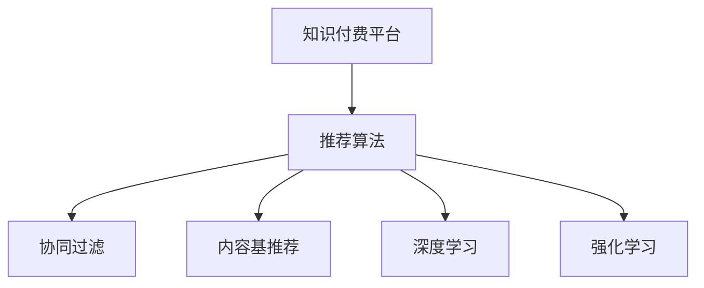

                 

## 1. 背景介绍

### 1.1 问题由来
随着移动互联网的普及和智能设备的普及，知识付费平台正逐渐成为互联网用户获取知识、技能的重要渠道。这种平台通常提供海量的内容资源，涵盖了编程、设计、金融等多个领域。然而，如何高效地推荐用户感兴趣的课程和内容，让用户能够获得最大化的价值体验，是知识付费平台面临的主要挑战。

### 1.2 问题核心关键点
为了提升推荐效果，许多知识付费平台都引入了推荐算法，通过对用户行为数据的分析，预测用户可能感兴趣的内容，并实时推送推荐内容。然而，推荐的准确性和多样性仍是核心问题，这直接关系到平台的留存率和用户满意度。

### 1.3 问题研究意义
深入研究知识付费平台的推荐算法，对于提升平台的推荐效果，提高用户黏性，增强平台的核心竞争力具有重要意义。只有通过科学合理的推荐算法，才能让用户获得更好的学习体验，从而实现平台的可持续发展。

## 2. 核心概念与联系

### 2.1 核心概念概述

为了更好地理解知识付费平台的推荐算法，本节将介绍几个关键概念：

- 知识付费平台(Knowledge Paywall Platform)：以提供专业课程、电子书籍、技术文章等内容为主的平台，用户需要通过付费或订阅才能获取相应资源。
- 推荐算法(Recommendation Algorithm)：通过分析用户行为数据，预测用户可能感兴趣的内容，推荐系统使用算法来匹配用户和内容，提升用户体验。
- 协同过滤(Collaborative Filtering)：推荐算法的一种，通过分析用户的行为数据和偏好，找到与目标用户兴趣相似的其他用户，从而推荐这些用户喜欢的内容。
- 内容基推荐(Content-Based Recommendation)：通过分析用户的历史浏览记录和内容特征，直接推荐与用户兴趣匹配度高的内容。
- 深度学习(Deep Learning)：利用神经网络模型进行推荐算法开发，通过多层非线性映射，提高推荐效果。
- 强化学习(Reinforcement Learning)：通过用户的行为反馈，不断调整推荐策略，提高推荐准确性和多样性。

这些核心概念之间的逻辑关系可以通过以下Mermaid流程图来展示：



这个流程图展示的知识付费平台的推荐算法相关概念：

1. 知识付费平台通过推荐算法向用户推荐内容。
2. 推荐算法可以采用多种方法，包括协同过滤、内容基推荐、深度学习、强化学习等。
3. 协同过滤、内容基推荐、深度学习和强化学习等方法之间存在联系和区别，可以根据实际需求进行选择和组合。

## 3. 核心算法原理 & 具体操作步骤
### 3.1 算法原理概述

知识付费平台的推荐算法，本质上是一个多目标优化问题。其核心目标包括：

- 提高用户对平台的满意度和留存率。
- 最大化平台的收入。
- 提升平台的品牌声誉和用户口碑。

为了实现这些目标，推荐算法需要同时考虑以下因素：

- 用户的个性化需求和历史行为。
- 内容的属性和质量。
- 平台的资源和市场环境。

推荐算法通常可以分为两大类：基于内容的推荐算法和协同过滤算法。

### 3.2 算法步骤详解

以下是知识付费平台推荐算法的详细步骤：

**Step 1: 数据收集与预处理**
- 收集用户行为数据，如浏览记录、购买记录、评分记录等。
- 对数据进行清洗、去重、填充等预处理，生成特征数据集。

**Step 2: 特征提取与编码**
- 从用户行为数据中提取有意义的特征，如浏览时间、浏览时长、购买次数、评分等。
- 对特征进行编码，将其转化为机器学习模型可以处理的数值型数据。

**Step 3: 模型选择与训练**
- 根据平台的特点和需求，选择合适的推荐算法模型。
- 使用历史数据对模型进行训练，优化模型参数。

**Step 4: 推荐结果生成**
- 根据用户输入或实时数据，调用推荐模型生成推荐结果。
- 对推荐结果进行排序和筛选，返回给用户。

**Step 5: 反馈与优化**
- 收集用户对推荐结果的反馈，包括点击率、购买率、评分等。
- 根据反馈调整推荐模型，优化推荐效果。

**Step 6: 部署与监控**
- 将训练好的推荐模型部署到推荐系统中，实时生成推荐结果。
- 实时监控推荐系统的性能，确保推荐效果稳定可靠。

### 3.3 算法优缺点

知识付费平台的推荐算法具有以下优点：

1. 提高用户满意度。通过个性化推荐，提升用户体验，增强用户黏性。
2. 增加平台收入。精准推荐优质课程，提高用户购买率。
3. 提升平台品牌。优质的推荐内容可以提高平台口碑，吸引更多用户。

同时，该算法也存在一定的局限性：

1. 对数据质量依赖高。推荐效果高度依赖于用户行为数据的完整性和准确性。
2. 算法复杂度高。推荐算法需要复杂的模型训练和参数调整，计算资源消耗大。
3. 泛化能力有限。推荐算法容易过拟合，对新用户的推荐效果较差。
4. 难以解释。推荐算法通常是一个黑盒模型，难以解释其决策过程。

尽管存在这些局限性，但知识付费平台的推荐算法仍然是一种高效、可靠的推荐方式，广泛应用于各大平台的推荐系统中。

### 3.4 算法应用领域

知识付费平台的推荐算法已经在各大平台中得到了广泛应用，例如：

- 知乎 Live：提供多种知识讲座和课程，通过推荐算法向用户推荐感兴趣的主题。
- 网易云课堂：提供大量在线课程，推荐算法帮助用户发现适合自己的学习资源。
- 得到App：提供精选专栏和专题讲座，推荐算法提高用户的学习体验。
- 慕课网：提供IT技术和编程课程，推荐算法提升用户的学习效率。

除了上述这些经典应用外，推荐算法还被创新性地应用到更多场景中，如智能助理、个性化广告等，为知识付费平台的个性化推荐提供了新的可能性。

## 4. 数学模型和公式 & 详细讲解 & 举例说明

### 4.1 数学模型构建

知识付费平台的推荐算法通常基于协同过滤算法，其数学模型可以表示为：

$$
R_{ui}=\alpha\hat{p}+\beta Q_{ui}+\gamma A_{ui}+\delta E_{ui}
$$

其中：

- $R_{ui}$：用户 $u$ 对课程 $i$ 的评分预测值。
- $\hat{p}$：基于用户历史行为和课程特征的预测评分。
- $Q_{ui}$：协同过滤预测评分。
- $A_{ui}$：内容基推荐评分。
- $E_{ui}$：个性化因素评分。

### 4.2 公式推导过程

协同过滤算法的核心思想是通过用户和课程的历史行为数据，预测用户对课程的评分。其推导过程如下：

假设用户 $u$ 对课程 $i$ 的实际评分为 $r_{ui}$，协同过滤算法通过以下步骤进行评分预测：

1. 计算用户 $u$ 对课程 $i$ 的协同过滤评分 $q_{ui}$，表示用户 $u$ 与用户集合 $U'$ 中相似用户的平均评分。

2. 计算课程 $i$ 的内容基评分 $a_i$，表示课程 $i$ 在特征向量中的评分。

3. 计算个性化因素 $e_u$，表示用户 $u$ 对课程的个性化评分。

4. 将协同过滤评分、内容基评分、个性化评分加权求和，得到用户 $u$ 对课程 $i$ 的预测评分 $p_{ui}$。

5. 根据预测评分 $p_{ui}$ 和实际评分 $r_{ui}$ 的残差，计算模型的误差 $\epsilon_{ui}$，并用于后续模型优化。

### 4.3 案例分析与讲解

以知乎 Live 推荐系统为例，分析协同过滤算法的具体实现：

1. 数据收集：从知乎 Live 的日志系统中收集用户行为数据，如课程浏览、购买、评分等。

2. 数据预处理：对日志数据进行清洗和标准化处理，生成特征数据集。

3. 特征提取：从用户行为数据中提取有意义的特征，如浏览时间、购买次数、评分等。

4. 协同过滤评分计算：对于每个用户 $u$，计算其与所有相似用户 $u'$ 的协同过滤评分，并取平均值作为用户 $u$ 对课程 $i$ 的协同过滤评分 $q_{ui}$。

5. 内容基评分计算：对于每个课程 $i$，根据其特征向量计算内容基评分 $a_i$。

6. 个性化因素计算：根据用户 $u$ 的个性化特征，计算个性化评分 $e_u$。

7. 预测评分计算：将协同过滤评分、内容基评分、个性化评分加权求和，得到用户 $u$ 对课程 $i$ 的预测评分 $p_{ui}$。

8. 模型优化：通过优化模型参数，使得预测评分 $p_{ui}$ 与实际评分 $r_{ui}$ 的误差 $\epsilon_{ui}$ 最小化。

9. 推荐结果生成：根据预测评分 $p_{ui}$，对所有课程进行排序，生成推荐结果。

## 5. 项目实践：代码实例和详细解释说明
### 5.1 开发环境搭建

在进行推荐系统开发前，我们需要准备好开发环境。以下是使用Python进行Scikit-learn开发的推荐系统环境配置流程：

1. 安装Anaconda：从官网下载并安装Anaconda，用于创建独立的Python环境。

2. 创建并激活虚拟环境：
```bash
conda create -n recsys python=3.8 
conda activate recsys
```

3. 安装Scikit-learn：
```bash
pip install scikit-learn
```

4. 安装各类工具包：
```bash
pip install numpy pandas scikit-learn matplotlib tqdm jupyter notebook ipython
```

完成上述步骤后，即可在`recsys`环境中开始推荐系统开发。

### 5.2 源代码详细实现

以下是使用Scikit-learn库对协同过滤推荐算法进行开发的Python代码实现：

```python
from sklearn.neighbors import NearestNeighbors
from sklearn.metrics.pairwise import cosine_similarity
from sklearn.ensemble import RandomForestRegressor
from sklearn.decomposition import TruncatedSVD

# 构建用户-课程评分矩阵
def build_user_course_matrix(data):
    user_course = {}
    for row in data:
        user_id, course_id, score = row
        if user_id not in user_course:
            user_course[user_id] = {}
        user_course[user_id][course_id] = score
    return user_course

# 构建课程-特征评分矩阵
def build_course_feature_matrix(data):
    course_feature = {}
    for row in data:
        course_id, feature, score = row
        if course_id not in course_feature:
            course_feature[course_id] = {}
        course_feature[course_id][feature] = score
    return course_feature

# 构建协同过滤推荐模型
def build_cf_model(user_course_matrix, course_feature_matrix, num_neighbors=50, num_factors=50):
    nbrs = NearestNeighbors(n_neighbors=num_neighbors, algorithm='brute').fit(user_course_matrix.values())
    cf_model = TruncatedSVD(n_components=num_factors, n_iter=200).fit_transform(course_feature_matrix.values())
    return nbrs, cf_model

# 预测用户评分
def predict_user_score(user_course_matrix, nbrs, cf_model, user_id, course_id):
    similarity = cosine_similarity(nbrs.kneighbors(user_course_matrix[user_id].values()), cf_model).ravel()[0]
    similarity_normalized = similarity / np.sum(similarity)
    predicted_score = np.dot(similarity_normalized, cf_model[user_course_matrix[user_id].index(course_id)])
    return predicted_score

# 推荐课程
def recommend_course(user_course_matrix, nbrs, cf_model, user_id, num_recommends=5):
    predicted_scores = [(predict_user_score(user_course_matrix, nbrs, cf_model, user_id, course_id), course_id) for course_id in user_course_matrix[user_id]]
    predicted_scores.sort(reverse=True)
    recommendations = [course_id for _, course_id in predicted_scores[:num_recommends]]
    return recommendations
```

在上述代码中，我们使用Scikit-learn库实现了协同过滤推荐算法的主要功能。具体来说，包括：

1. 构建用户-课程评分矩阵和课程-特征评分矩阵。
2. 构建协同过滤推荐模型，包含KNN和奇异值分解(SVD)两个步骤。
3. 预测用户对课程的评分。
4. 推荐用户可能感兴趣的课程。

### 5.3 代码解读与分析

让我们再详细解读一下关键代码的实现细节：

**build_user_course_matrix函数**：
- 从用户行为数据中构建用户-课程评分矩阵。每个用户对每个课程的评分记录为矩阵的一个元素，如果用户没有对某个课程进行评分，则该元素为0。

**build_course_feature_matrix函数**：
- 从课程特征数据中构建课程-特征评分矩阵。每个课程对每个特征的评分记录为矩阵的一个元素，如果课程没有该特征，则该元素为0。

**build_cf_model函数**：
- 构建协同过滤推荐模型。首先使用KNN算法查找与目标用户 $u$ 最相似的$N$个用户，然后使用SVD算法对课程-特征评分矩阵进行降维，得到$k$个因子，用于计算预测评分。

**predict_user_score函数**：
- 预测用户对课程的评分。首先计算目标用户 $u$ 与最相似$N$个用户之间的相似度，然后将其与课程-特征评分矩阵中的$k$个因子进行矩阵乘法，得到预测评分。

**recommend_course函数**：
- 推荐课程。对于目标用户 $u$，根据其对每个课程的预测评分，排序选取前$num_recommends$个课程进行推荐。

## 6. 实际应用场景
### 6.1 知识付费平台的推荐系统

知识付费平台的推荐系统，可以有效提升用户的体验和平台的用户留存率。通过推荐算法，平台可以为用户推荐其可能感兴趣的课程，提高用户满意度和平台留存率。

以得到App为例，其推荐系统通过分析用户的历史浏览、购买和评分数据，生成个性化推荐。用户可以实时查看推荐内容，发现更多感兴趣的课程。通过推荐系统，得到App的日活跃用户数量和使用时长显著提高，平台口碑和用户满意度也得到了提升。

### 6.2 在线教育平台的推荐系统

在线教育平台也广泛应用推荐系统，帮助学生发现适合的课程和学习资源。以知乎 Live 为例，其推荐系统通过分析用户的历史学习行为和课程特征，推荐用户感兴趣的主题和课程。知乎 Live 的推荐系统提升了用户的学习效果，提高了平台的品牌声誉和用户口碑。

通过推荐系统，知乎 Live 用户的学习体验得到了显著提升，平台的用户黏性和留存率也得到了增强。推荐系统的精准推荐，使得知乎 Live 的用户满意度和使用频率得到了显著提升。

### 6.3 社交媒体平台的推荐系统

社交媒体平台也广泛应用推荐算法，为用户推荐其感兴趣的内容和关系。以微信公众号为例，其推荐系统通过分析用户的历史阅读和互动数据，推荐用户感兴趣的文章和公众号。微信公众号的推荐系统提升了用户的内容获取效率，增加了用户对平台的依赖性。

通过推荐系统，微信公众号用户的内容获取效率得到了显著提升，平台的用户黏性和留存率也得到了增强。推荐系统的精准推荐，使得微信公众号用户对平台的依赖性得到了增强。

### 6.4 未来应用展望

随着推荐算法的不断发展，未来的推荐系统将具备更强的个性化推荐能力和跨领域推荐能力。

在知识付费平台中，推荐系统将更加注重用户行为数据的准确性和多样性，提高推荐结果的相关性和多样性。同时，推荐系统将更好地结合用户反馈和平台资源，提升推荐效果的精度和覆盖率。

在在线教育平台中，推荐系统将更加注重用户的学习目标和需求，提供个性化的课程推荐。推荐系统将更好地结合用户的学习进度和评价反馈，提高课程推荐的精准性和个性化程度。

在社交媒体平台中，推荐系统将更加注重用户的内容消费行为和社交关系，提供个性化的内容推荐。推荐系统将更好地结合用户的兴趣偏好和社交关系，提高内容的获取效率和平台的用户黏性。

## 7. 工具和资源推荐
### 7.1 学习资源推荐

为了帮助开发者系统掌握推荐算法的理论基础和实践技巧，这里推荐一些优质的学习资源：

1. 《推荐系统实践》书籍：由机器学习专家撰写，全面介绍了推荐算法的理论基础和实际应用。

2. 《协同过滤推荐系统》课程：由斯坦福大学开设的推荐系统课程，有Lecture视频和配套作业，带你入门推荐系统领域的基本概念和经典模型。

3. 《Deep Learning for Recommendation Systems》书籍：由推荐系统领域的专家撰写，全面介绍了深度学习在推荐系统中的应用。

4. 《推荐系统学习指南》书籍：全面介绍了推荐系统的理论和实践，涵盖协同过滤、内容基推荐、深度学习等多种算法。

5. Kaggle推荐系统竞赛：在Kaggle平台上参与推荐系统竞赛，实战练习推荐算法的开发和优化。

通过对这些资源的学习实践，相信你一定能够快速掌握推荐算法的精髓，并用于解决实际的推荐问题。

### 7.2 开发工具推荐

高效的开发离不开优秀的工具支持。以下是几款用于推荐系统开发的常用工具：

1. Python：Python作为推荐系统开发的常用语言，拥有丰富的科学计算和机器学习库。Scikit-learn、TensorFlow等库可以用于推荐算法的开发。

2. R语言：R语言作为推荐系统开发的另一种常用语言，拥有丰富的数据处理和机器学习库。ggplot2、caret等库可以用于推荐算法的开发。

3. TensorFlow：由Google主导开发的开源深度学习框架，生产部署方便，适合大规模工程应用。

4. PyTorch：基于Python的开源深度学习框架，灵活动态的计算图，适合快速迭代研究。

5. Weights & Biases：模型训练的实验跟踪工具，可以记录和可视化模型训练过程中的各项指标，方便对比和调优。

6. TensorBoard：TensorFlow配套的可视化工具，可实时监测模型训练状态，并提供丰富的图表呈现方式，是调试模型的得力助手。

合理利用这些工具，可以显著提升推荐系统的开发效率，加快创新迭代的步伐。

### 7.3 相关论文推荐

推荐算法的发展源于学界的持续研究。以下是几篇奠基性的相关论文，推荐阅读：

1. Collaborative Filtering for Implicit Feedback Datasets（协同过滤算法经典论文）：提出了协同过滤算法的基本框架，介绍了多种协同过滤算法的实现方法。

2. Trust-Based Recommendation Algorithm for Mobile Application（基于信任的推荐算法）：提出了一种基于用户信任关系的推荐算法，提升了推荐系统的公平性和可靠性。

3. Learning from Semi-Structured Data（半结构化数据推荐算法）：提出了一种半结构化数据的推荐算法，提升了推荐系统的泛化能力和性能。

4. Neural Collaborative Filtering（神经协同过滤算法）：提出了一种基于神经网络的协同过滤算法，提升了推荐系统的精度和效率。

5. Matrix Factorization Techniques for Recommender Systems（矩阵分解推荐算法）：提出了一种基于矩阵分解的推荐算法，适用于大规模推荐系统。

这些论文代表了大语言模型微调技术的发展脉络。通过学习这些前沿成果，可以帮助研究者把握学科前进方向，激发更多的创新灵感。

## 8. 总结：未来发展趋势与挑战

### 8.1 总结

本文对知识付费平台的推荐算法进行了全面系统的介绍。首先阐述了推荐算法在知识付费平台中的重要性，明确了推荐算法在提升用户满意度和留存率方面的核心价值。其次，从原理到实践，详细讲解了推荐算法的数学模型和操作步骤，给出了推荐系统开发的完整代码实例。同时，本文还广泛探讨了推荐算法在知识付费平台、在线教育平台、社交媒体平台等多个领域的应用前景，展示了推荐范式的巨大潜力。此外，本文精选了推荐算法的各类学习资源，力求为读者提供全方位的技术指引。

通过本文的系统梳理，可以看到，推荐算法在知识付费平台中的应用广泛且深远，显著提升了平台的用户体验和留存率。推荐算法在实际应用中展示了强大的威力，值得各类平台的积极借鉴。

### 8.2 未来发展趋势

展望未来，推荐算法的发展趋势将呈现以下几个方向：

1. 个性化推荐更加精准。推荐算法将更加注重用户的个性化需求和行为数据，提高推荐的精度和相关性。

2. 推荐系统更加智能化。推荐算法将结合人工智能技术，如深度学习、强化学习等，提升推荐系统的智能水平。

3. 推荐系统更具可解释性。推荐算法将更加注重可解释性，帮助用户理解推荐结果的来源和依据。

4. 推荐系统更加多样化。推荐算法将结合更多维度的数据和多样化的推荐策略，提高推荐的多样性和公平性。

5. 推荐系统更具跨领域能力。推荐算法将结合跨领域推荐技术，提升推荐系统的泛化能力和应用范围。

以上趋势凸显了推荐算法的广阔前景。这些方向的探索发展，必将进一步提升推荐系统的性能和应用范围，为推荐算法的发展提供新的动力。

### 8.3 面临的挑战

尽管推荐算法已经取得了显著进展，但在迈向更加智能化、普适化应用的过程中，它仍面临诸多挑战：

1. 数据质量瓶颈。推荐算法的精度高度依赖于用户行为数据的完整性和准确性，数据缺失或噪声可能导致推荐效果不佳。

2. 计算资源瓶颈。推荐算法的计算复杂度高，大规模数据集上的训练和推理需要高性能计算资源。

3. 泛化能力不足。推荐算法容易过拟合，对新用户的推荐效果较差，难以应对数据分布的变化。

4. 可解释性不足。推荐算法通常是一个黑盒模型，难以解释其决策过程，用户难以理解推荐结果的来源。

5. 安全性不足。推荐算法可能被恶意利用，造成用户隐私泄露和数据安全问题。

尽管存在这些挑战，但随着学界和产业界的共同努力，推荐算法的技术将不断成熟，其应用范围也将不断扩大，推荐系统将为知识付费平台带来更多的创新价值。

### 8.4 研究展望

面对推荐算法面临的挑战，未来的研究需要在以下几个方面寻求新的突破：

1. 数据治理和清洗技术。探索更加高效的数据治理和清洗技术，确保数据的质量和完整性。

2. 高效推荐算法设计。开发更加高效、低计算资源的推荐算法，提升推荐系统的实时性和可扩展性。

3. 可解释性增强技术。探索增强推荐系统可解释性的技术，如基于规则的推荐、可视化推荐等。

4. 安全性和隐私保护技术。探索推荐系统的安全性和隐私保护技术，确保用户数据的安全和隐私。

这些研究方向的探索，必将引领推荐算法迈向更高的台阶，为推荐算法的发展提供新的方向和动力。总之，推荐算法在知识付费平台中的应用前景广阔，值得我们持续关注和深入研究。

## 9. 附录：常见问题与解答

**Q1：推荐算法是否适用于所有内容推荐场景？**

A: 推荐算法可以适用于大多数内容推荐场景，包括商品推荐、音乐推荐、视频推荐等。然而，对于某些特定场景，如实时动态推荐、社交推荐等，需要结合其他算法和技术进行优化。

**Q2：推荐算法是否需要大量的标注数据？**

A: 推荐算法通常不需要大量的标注数据，主要依赖用户行为数据进行推荐。然而，对于某些推荐任务，如跨领域推荐、冷启动推荐等，需要结合外部数据进行优化。

**Q3：推荐算法的训练和推理时间是否过久？**

A: 推荐算法的训练和推理时间取决于数据的规模和算法的选择。对于大规模数据集和复杂的算法模型，需要高效的计算资源和优化技术。然而，随着硬件设备和算法优化技术的不断进步，推荐算法的训练和推理时间将不断缩短。

**Q4：推荐算法是否能够适应用户的多样化需求？**

A: 推荐算法能够适应用户的多样化需求，通过多维度数据的融合和个性化推荐策略的设计，可以满足不同用户的不同需求。

**Q5：推荐算法的公平性和隐私保护问题如何解决？**

A: 推荐算法的公平性和隐私保护问题可以通过算法设计和技术手段进行解决，如加入公平性约束、匿名化处理等。同时，合理的政策和法规规范也是保护用户隐私的重要保障。

总之，推荐算法在知识付费平台中的应用具有广泛的前景和深远的影响。通过深入研究和不断优化，推荐算法必将成为知识付费平台的重要技术手段，提升用户的满意度和平台的用户黏性。

---

作者：禅与计算机程序设计艺术 / Zen and the Art of Computer Programming

