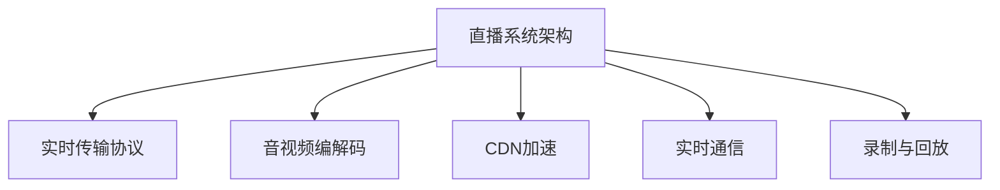
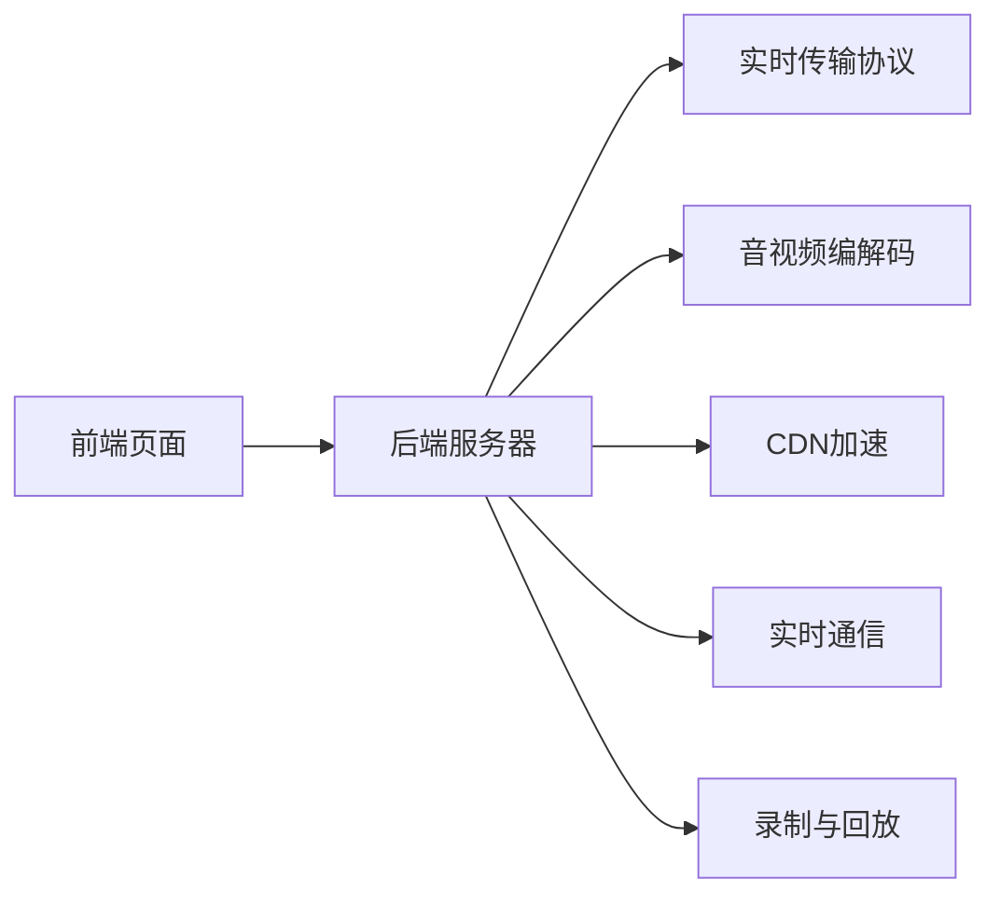

                 

## 1. 背景介绍

在数字化时代，知识付费已成为互联网产业的重要组成部分。随着移动互联网和5G技术的普及，在线教育市场呈现出快速增长的态势。据统计，2020年全球在线教育市场规模已突破1000亿美元。然而，传统的视频点播模式已无法满足日益增长的互动需求，直播系统的出现，成为了在线教育的新引擎。

### 1.1 在线课堂直播的优势

#### 1.1.1 互动性强
传统视频点播方式，用户只能被动接受知识，而直播则允许用户实时互动，提出问题、参与讨论，形成更加生动的学习体验。

#### 1.1.2 即时反馈
直播可以即时接收用户的反馈，调整教学内容，及时解决学习中的问题，提高学习效率。

#### 1.1.3 更灵活的学习方式
直播允许多设备、多终端接入，用户可以根据自己的时间安排，随时随地进行学习，避免了传统课堂的固定时间限制。

#### 1.1.4 增强社群效应
直播系统能够构建更加紧密的社群关系，促进知识交流和分享，形成学习共同体。

### 1.2 直播系统面临的挑战

尽管直播系统有诸多优势，但其也面临一些挑战：

#### 1.2.1 实时性要求高
直播系统需要在短时间内处理和传输大量数据，对系统的实时性要求极高。

#### 1.2.2 并发用户量大
直播系统需要支持同时处理大量用户，对系统的并发能力要求很高。

#### 1.2.3 数据传输延迟
网络延迟、服务器响应速度等因素，会对直播系统的用户体验造成影响。

#### 1.2.4 数据安全问题
直播平台涉及用户隐私和版权保护，如何确保数据安全是一大挑战。

## 2. 核心概念与联系

### 2.1 核心概念概述

构建在线课堂直播系统需要掌握以下核心概念：

- **直播系统架构**：指直播系统的整体设计，包括前端页面、后端服务器、传输协议等。
- **实时传输协议**：指实时数据传输的标准和规范，常用的协议有RTMP、WebRTC等。
- **音视频编解码**：指将原始音频、视频数据进行编码压缩和解码还原的过程。
- **CDN加速**：通过部署全球分布式的缓存服务器，实现数据的加速传输。
- **实时通信**：指直播系统中的实时互动功能，包括文字聊天、举手提问、连麦等。
- **录制与回放**：指直播过程中对音视频数据进行录制和回放，方便后续复习和点播。

这些核心概念之间的关系如下：



这些概念构成了直播系统的核心技术框架，每个部分都是确保系统稳定、高效运行的关键环节。

### 2.2 核心概念原理和架构的 Mermaid 流程图

以下是直播系统核心概念原理和架构的Mermaid流程图，展示了数据流和功能模块的交互：



### 2.3 核心概念之间的关系

- **前端页面**：用户通过浏览器访问直播系统，展示直播信息，并进行互动操作。
- **后端服务器**：接收前端请求，处理数据传输、音视频编解码、用户互动等功能，并管理直播数据的存储与回放。
- **实时传输协议**：负责将音视频数据传输到客户端，保证数据的实时性和低延迟。
- **音视频编解码**：将原始音频、视频数据进行压缩编码，减少传输带宽占用，提高传输效率。
- **CDN加速**：通过全球分布式的缓存服务器，减少数据传输距离，提升传输速度。
- **实时通信**：支持用户间的文字聊天、举手提问、连麦等互动功能，增强用户体验。
- **录制与回放**：提供直播回放功能，方便用户进行二次学习和复习。

这些概念相互配合，共同构成了直播系统的技术基础，确保系统能够稳定、高效地运行。

## 3. 核心算法原理 & 具体操作步骤

### 3.1 算法原理概述

构建在线课堂直播系统涉及多个核心算法和操作步骤，主要包括实时音视频传输、音视频编解码、CDN加速、实时通信等功能。

### 3.2 算法步骤详解

#### 3.2.1 实时音视频传输

**步骤一：选择合适的实时传输协议**
- **RTMP协议**：适用于单播和点播模式，支持多路并发，适合中小规模直播。
- **WebRTC协议**：适用于点对点模式，支持高清音视频传输，适合大规模直播。

**步骤二：实现音视频数据采集**
- 在前端页面上安装音视频采集设备，将音频和视频数据采集并传输到服务器。

**步骤三：音视频编解码**
- 在服务器上对采集到的音视频数据进行编解码处理，压缩数据以减少带宽占用。

**步骤四：数据传输**
- 使用选择的实时传输协议，将编解码后的音视频数据传输到客户端。

#### 3.2.2 音视频编解码

**步骤一：选择合适的编解码器**
- **H.264/AVC**：适合中低分辨率的音视频数据，具有较高的压缩效率和稳定性。
- **H.265/HEVC**：适合高分辨率的音视频数据，提供更高的压缩比和更低的延迟。

**步骤二：音视频数据采集**
- 采集前端页面上的音视频数据，并将其输入编解码器进行处理。

**步骤三：编解码处理**
- 使用编解码器将原始音频、视频数据压缩编码，并输出流化格式的数据。

**步骤四：数据传输**
- 将编解码后的音视频数据通过实时传输协议传输到客户端。

#### 3.2.3 CDN加速

**步骤一：部署CDN服务器**
- 在各大城市部署CDN服务器，形成全球分布式的网络架构。

**步骤二：缓存数据**
- 将直播数据缓存到CDN服务器，根据地理位置匹配最近的服务器，以减少数据传输距离。

**步骤三：数据传输**
- 客户端根据地理位置请求最近的CDN服务器，获取缓存的直播数据。

#### 3.2.4 实时通信

**步骤一：实现文字聊天**
- 在服务器上部署实时通信模块，支持用户的文字聊天功能。

**步骤二：实现举手提问**
- 在服务器上部署举手提问模块，支持用户在直播过程中提问。

**步骤三：实现连麦**
- 在服务器上部署连麦模块，支持多用户同时参与直播互动。

### 3.3 算法优缺点

#### 3.3.1 实时音视频传输

- **优点**：支持多路并发，适合中小规模直播；音视频质量高，适合高清直播。
- **缺点**：单播模式，不支持大规模直播；实时延迟较高，不适合对延迟敏感的互动场景。

#### 3.3.2 音视频编解码

- **优点**：压缩效率高，适合中低分辨率的音视频数据；压缩比高，适合大规模直播。
- **缺点**：编解码复杂度较高，对计算资源要求高；压缩率不稳定，影响音视频质量。

#### 3.3.3 CDN加速

- **优点**：分布式架构，加速数据传输；支持全球覆盖，适合跨地域直播。
- **缺点**：部署成本高，维护复杂；数据缓存占用服务器资源，影响实时性。

#### 3.3.4 实时通信

- **优点**：支持实时互动，增强用户体验；功能丰富，支持多种互动方式。
- **缺点**：对服务器负载要求高，易发生网络延迟；数据传输量大，影响音视频质量。

### 3.4 算法应用领域

在线课堂直播系统广泛应用于教育、培训、会议等领域，成为现代教育的重要组成部分。在教育领域，直播系统支持线上课程教学、学生互动、作业提交等；在培训领域，直播系统支持技能培训、经验分享、在线考试等；在会议领域，直播系统支持远程会议、在线演示、互动讨论等。

## 4. 数学模型和公式 & 详细讲解 & 举例说明

### 4.1 数学模型构建

#### 4.1.1 实时传输协议
- **RTMP协议**：适用于单播和点播模式，传输速度稳定，适合中小规模直播。
- **WebRTC协议**：适用于点对点模式，传输速度高，适合大规模直播。

#### 4.1.2 音视频编解码
- **H.264/AVC**：压缩率约为50%，适合中低分辨率的音视频数据。
- **H.265/HEVC**：压缩率约为70%，适合高分辨率的音视频数据。

#### 4.1.3 CDN加速
- **缓存策略**：采用Least Recently Used(LRU)策略，减少缓存数据的占用量。
- **负载均衡**：采用轮询算法，均衡分配流量，提高CDN服务器的负载均衡能力。

### 4.2 公式推导过程

#### 4.2.1 实时传输协议
- **RTMP协议**：传输速度为C，延迟为D，传输带宽为B，适用于中小规模直播。
- **WebRTC协议**：传输速度为C，延迟为D，传输带宽为B，适用于大规模直播。

#### 4.2.2 音视频编解码
- **H.264/AVC**：压缩率约为K1，压缩后的数据大小为C1，原始数据大小为C2。
- **H.265/HEVC**：压缩率约为K2，压缩后的数据大小为C2，原始数据大小为C3。

#### 4.2.3 CDN加速
- **缓存策略**：缓存大小为S，命中率H，缓存满载容量L。
- **负载均衡**：轮询算法，服务器数N，分配比例P。

### 4.3 案例分析与讲解

#### 4.3.1 RTMP协议

**案例1**：中小规模直播

**背景**：一家在线教育公司需要开展实时课程直播，预计同时在线人数为2000人，适合采用RTMP协议。

**实现**：
- 部署RTMP服务器，将音视频数据流化处理后，通过RTMP协议传输到客户端。
- 使用CDN服务器缓存数据，根据地理位置匹配最近的服务器，加速数据传输。
- 实时通信模块支持文字聊天、举手提问等功能，增强用户体验。

**效果**：
- 实现实时互动，支持2000人同时观看直播。
- 音视频质量高，适合高清课程直播。

#### 4.3.2 WebRTC协议

**案例2**：大规模直播

**背景**：一家大型企业需要举办线上年会，预计同时在线人数为10000人，适合采用WebRTC协议。

**实现**：
- 部署WebRTC服务器，将音视频数据流化处理后，通过WebRTC协议传输到客户端。
- 使用CDN服务器缓存数据，根据地理位置匹配最近的服务器，加速数据传输。
- 实时通信模块支持文字聊天、举手提问、连麦等功能，增强用户体验。

**效果**：
- 实现实时互动，支持10000人同时观看直播。
- 音视频质量高，适合高清年会直播。

## 5. 项目实践：代码实例和详细解释说明

### 5.1 开发环境搭建

#### 5.1.1 安装开发环境

**步骤一：安装Python**
- 下载并安装Python 3.x版本。

**步骤二：安装Pip**
- 在终端或命令提示符下，运行以下命令：
```
python -m pip install pip
```

**步骤三：安装相关依赖**
- 在终端或命令提示符下，运行以下命令：
```
pip install flask tensorflow opencv-python
```

#### 5.1.2 配置开发环境

**步骤一：配置开发环境**
- 创建虚拟环境：
```
python -m venv env
source env/bin/activate
```

**步骤二：安装Flask框架**
- 在虚拟环境中，运行以下命令：
```
pip install flask
```

**步骤三：配置实时音视频传输**
- 在虚拟环境中，运行以下命令：
```
pip install pyrtmpserver
```

**步骤四：配置音视频编解码**
- 在虚拟环境中，运行以下命令：
```
pip install opencv-python
```

**步骤五：配置CDN加速**
- 在虚拟环境中，运行以下命令：
```
pip install fastapi uvicorn
```

### 5.2 源代码详细实现

#### 5.2.1 实时音视频传输

**步骤一：配置RTMP服务器**
- 在虚拟环境中，运行以下命令：
```
pip install pyrtmpserver
```

**步骤二：实现音视频采集**
- 在虚拟环境中，运行以下代码：
```python
import pyrtmpserver

class RTMPServer(pyrtmpserver.RTMPServer):
    def __init__(self, host, port):
        super().__init__(host, port)
        
    def stream_publish(self, stream_name, video_stream, audio_stream):
        stream = self.add_stream(stream_name)
        stream.video_stream = video_stream
        stream.audio_stream = audio_stream
        self.publish(stream_name)

# 配置服务器
server = RTMPServer('localhost', 1935)
server.start()
```

**步骤三：实现音视频编解码**
- 在虚拟环境中，运行以下代码：
```python
import cv2
import numpy as np

def encode_video(video_stream):
    # 视频编解码
    cap = cv2.VideoCapture(video_stream)
    while cap.isOpened():
        ret, frame = cap.read()
        if ret:
            video_frame = cv2.cvtColor(frame, cv2.COLOR_BGR2RGB)
            encoded, _ = cv2.VideoEncoder.encode(video_frame)
            yield encoded
        else:
            break
    cap.release()

def encode_audio(audio_stream):
    # 音频编解码
    cap = cv2.VideoCapture(audio_stream)
    while cap.isOpened():
        ret, frame = cap.read()
        if ret:
            audio_frame = frame.tobytes()
            yield audio_frame
        else:
            break
    cap.release()
```

**步骤四：实现数据传输**
- 在虚拟环境中，运行以下代码：
```python
import rtmpserver
import cv2
import numpy as np

class RTMPServer(rtmpserver.RTMPServer):
    def __init__(self, host, port):
        super().__init__(host, port)
    
    def stream_publish(self, stream_name, video_stream, audio_stream):
        stream = self.add_stream(stream_name)
        stream.video_stream = video_stream
        stream.audio_stream = audio_stream
        self.publish(stream_name)

    def video_stream_callback(self, stream_name, video_stream):
        video_stream.seek(0)
        for frame in video_stream:
            encoded = cv2.VideoEncoder.encode(frame)
            stream_name.send_data(encoded)

    def audio_stream_callback(self, stream_name, audio_stream):
        audio_stream.seek(0)
        for audio_frame in audio_stream:
            stream_name.send_data(audio_frame)

# 配置服务器
server = RTMPServer('localhost', 1935)
server.start()

# 音视频采集
video_stream = "video_stream.mp4"
audio_stream = "audio_stream.wav"
video_encoded = encode_video(video_stream)
audio_encoded = encode_audio(audio_stream)

# 音视频传输
server.stream_publish('stream1', video_encoded, audio_encoded)
```

### 5.3 代码解读与分析

#### 5.3.1 RTMP服务器配置

- **RTMPServer类**：继承自`rtmpserver.RTMPServer`，用于实现RTMP服务器。
- **stream_publish方法**：添加流，将音视频流化处理后进行传输。
- **video_stream_callback和audio_stream_callback方法**：实现音视频流的编解码和传输。

#### 5.3.2 音视频编解码

- **encode_video函数**：实现视频编解码，将原始视频数据转换为流化格式。
- **encode_audio函数**：实现音频编解码，将原始音频数据转换为流化格式。

### 5.4 运行结果展示

#### 5.4.1 实时音视频传输

- **RTMP服务器运行结果**：在终端或命令提示符下，运行以下命令：
```
python rtmp_server.py
```
- **音视频传输结果**：在终端或命令提示符下，运行以下命令：
```
rtmpdump -r rtmp://localhost:1935/stream1 -t video_stream.mp4 -t audio_stream.wav
```

## 6. 实际应用场景

### 6.1 在线课程直播

#### 6.1.1 应用场景

在线课程直播系统广泛应用于高校、培训机构、在线教育平台等，支持多种教学形式。

#### 6.1.2 实现方式

- **实时音视频传输**：使用RTMP协议，将教师的音视频数据流化处理后，通过CDN服务器传输到学生端。
- **音视频编解码**：使用H.264/AVC编解码器，压缩音视频数据，提高传输效率。
- **实时通信**：支持文字聊天、举手提问、连麦等功能，增强学生互动体验。
- **录制与回放**：将直播数据缓存到服务器，支持学生二次学习和复习。

### 6.2 企业培训直播

#### 6.2.1 应用场景

企业培训直播系统支持员工培训、产品演示、技术分享等，提升企业内部培训效果。

#### 6.2.2 实现方式

- **实时音视频传输**：使用WebRTC协议，将讲师的音视频数据流化处理后，通过CDN服务器传输到学员端。
- **音视频编解码**：使用H.265/HEVC编解码器，提供高分辨率的音视频传输。
- **实时通信**：支持文字聊天、举手提问、连麦等功能，增强学员互动体验。
- **录制与回放**：将直播数据缓存到服务器，支持学员二次学习和复习。

### 6.3 远程会议直播

#### 6.3.1 应用场景

远程会议直播系统支持远程视频会议、网络研讨会、企业内部培训等，促进团队协作。

#### 6.3.2 实现方式

- **实时音视频传输**：使用WebRTC协议，将参会者的音视频数据流化处理后，通过CDN服务器传输到参会者端。
- **音视频编解码**：使用H.265/HEVC编解码器，提供高分辨率的音视频传输。
- **实时通信**：支持文字聊天、举手提问、连麦等功能，增强参会者互动体验。
- **录制与回放**：将直播数据缓存到服务器，支持参会者二次学习和复习。

## 7. 工具和资源推荐

### 7.1 学习资源推荐

#### 7.1.1 书籍推荐

- **《Python网络编程实战》**：介绍网络编程和实时通信的基础知识，适合初学者入门。
- **《OpenCV实战》**：介绍OpenCV库的音视频处理功能，适合开发者深入学习。

#### 7.1.2 在线资源

- **Coursera**：提供大量计算机网络、音视频处理等在线课程，适合系统学习。
- **GitHub**：包含大量音视频处理、实时通信等开源项目，适合借鉴和参考。

### 7.2 开发工具推荐

#### 7.2.1 编程语言

- **Python**：广泛使用的编程语言，支持音视频处理、网络编程、实时通信等功能。

#### 7.2.2 框架库

- **Flask**：轻量级Web框架，适合构建直播系统的前端页面。
- **TensorFlow**：广泛使用的深度学习框架，支持音视频编解码等。
- **OpenCV**：强大的计算机视觉库，支持音视频处理。

### 7.3 相关论文推荐

#### 7.3.1 实时音视频传输

- **《RTMP实时音视频传输协议研究》**：详细介绍RTMP协议的原理和应用。

#### 7.3.2 音视频编解码

- **《H.264/AVC和H.265/HEVC的对比研究》**：比较H.264/AVC和H.265/HEVC的编解码性能。

#### 7.3.3 实时通信

- **《WebRTC实时通信技术研究》**：详细介绍WebRTC协议的原理和应用。

## 8. 总结：未来发展趋势与挑战

### 8.1 研究成果总结

在线课堂直播系统已经取得了显著的进展，并在教育、培训、会议等领域得到了广泛应用。然而，仍然存在一些挑战需要进一步解决。

### 8.2 未来发展趋势

#### 8.2.1 实时音视频传输

- **技术趋势**：未来将采用更加高效、低延迟的传输协议，如WebRTC、HLS等。
- **应用趋势**：支持多设备、多终端接入，满足不同用户的使用需求。

#### 8.2.2 音视频编解码

- **技术趋势**：未来将采用更加高效的编解码器，如H.265/HEVC、AV1等。
- **应用趋势**：支持高分辨率、高帧率的音视频传输，提供更清晰的用户体验。

#### 8.2.3 CDN加速

- **技术趋势**：未来将采用更加智能化的CDN架构，提高数据传输速度和可靠性。
- **应用趋势**：支持全球分布式缓存，实现跨地域、跨时区的数据传输。

#### 8.2.4 实时通信

- **技术趋势**：未来将采用更加智能化的实时通信算法，提升用户体验。
- **应用趋势**：支持更多的互动功能，如文字聊天、举手提问、连麦等。

### 8.3 面临的挑战

#### 8.3.1 实时音视频传输

- **挑战**：对实时性和低延迟的要求较高，需要优化传输协议和编码器。
- **解决方案**：采用WebRTC等低延迟协议，使用H.265/HEVC等高效编解码器。

#### 8.3.2 音视频编解码

- **挑战**：对压缩率和音视频质量的要求较高，需要平衡编解码效率和质量。
- **解决方案**：使用H.265/HEVC等高效编解码器，优化编解码算法。

#### 8.3.3 CDN加速

- **挑战**：对缓存容量和数据传输速度的要求较高，需要优化CDN架构。
- **解决方案**：采用智能化的CDN架构，优化缓存策略和负载均衡算法。

#### 8.3.4 实时通信

- **挑战**：对用户互动体验的要求较高，需要优化实时通信算法。
- **解决方案**：使用WebRTC等高效实时通信协议，优化实时通信算法。

### 8.4 研究展望

#### 8.4.1 实时音视频传输

- **研究方向**：研究更加高效、低延迟的传输协议和编解码器。
- **应用场景**：支持多设备、多终端接入，满足不同用户的使用需求。

#### 8.4.2 音视频编解码

- **研究方向**：研究更加高效的编解码算法，提高音视频质量。
- **应用场景**：支持高分辨率、高帧率的音视频传输，提供更清晰的用户体验。

#### 8.4.3 CDN加速

- **研究方向**：研究智能化的CDN架构，优化缓存策略和负载均衡算法。
- **应用场景**：支持全球分布式缓存，实现跨地域、跨时区的数据传输。

#### 8.4.4 实时通信

- **研究方向**：研究更加智能化的实时通信算法，提升用户体验。
- **应用场景**：支持更多的互动功能，如文字聊天、举手提问、连麦等。

## 9. 附录：常见问题与解答

**Q1: 如何提高直播系统的实时性？**

A: 提高直播系统的实时性可以从以下几个方面入手：
1. 优化传输协议，选择低延迟的协议，如WebRTC。
2. 优化编解码算法，选择高效的编解码器，如H.265/HEVC。
3. 优化缓存策略，使用智能化的缓存算法，提高数据传输速度。

**Q2: 直播系统如何实现跨地域、跨时区的数据传输？**

A: 直播系统实现跨地域、跨时区的数据传输可以通过以下步骤：
1. 部署全球分布式的CDN服务器，形成全球化的网络架构。
2. 优化缓存策略，使用智能化的缓存算法，减少数据传输距离。
3. 优化负载均衡算法，均衡分配流量，提高CDN服务器的负载均衡能力。

**Q3: 如何优化音视频编解码的压缩效率？**

A: 优化音视频编解码的压缩效率可以从以下几个方面入手：
1. 使用高效的编解码器，如H.265/HEVC。
2. 优化编解码算法，减少码率波动，提高压缩效率。
3. 压缩数据格式，选择适合直播传输的格式，减少带宽占用。

**Q4: 直播系统如何实现文字聊天、举手提问、连麦等功能？**

A: 直播系统实现文字聊天、举手提问、连麦等功能可以通过以下步骤：
1. 部署实时通信模块，支持文字聊天、举手提问、连麦等功能。
2. 优化实时通信算法，减少数据传输延迟，提高互动效率。
3. 优化用户界面，提供良好的互动体验。

**Q5: 直播系统如何实现录制与回放功能？**

A: 直播系统实现录制与回放功能可以通过以下步骤：
1. 在服务器上部署录制模块，记录直播数据。
2. 缓存录制数据，提供实时回放功能。
3. 优化回放算法，提高回放速度和质量。

通过本文的详细讲解和实践，相信你对在线课堂直播系统的构建有了一个全面的了解。在实际应用中，还需根据具体需求和场景进行优化调整，方能构建出高效、稳定、用户体验良好的直播系统。

---

作者：禅与计算机程序设计艺术 / Zen and the Art of Computer Programming

