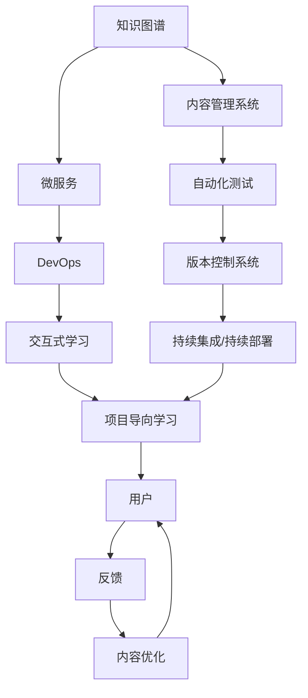
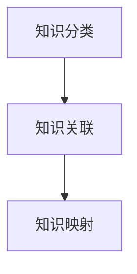
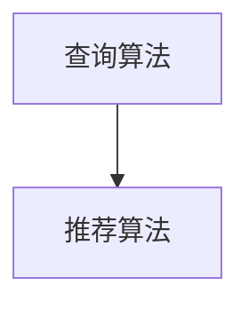
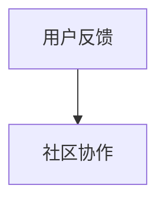

                 

# 打造被程序员需要的知识产品

## 1. 背景介绍

### 1.1 问题由来
在快速变化的IT行业中，知识更新迭代日新月异。程序员作为这个领域的主力军，时刻需要紧跟技术前沿，掌握最新的工具、框架和算法。然而，由于时间、精力和资源的多重限制，程序员往往难以通过自学的方式及时、全面地掌握所有必需的知识。

近年来，随着技术社区和在线教育平台的兴起，各种形式的知识产品（如博客、视频教程、在线课程等）应运而生，满足了程序员多样化的学习需求。然而，许多知识产品仍然存在质量参差不齐、内容过时、碎片化严重等问题，难以提供系统性、实用性和趣味性的学习体验。

本文旨在探讨如何打造符合程序员需求的知识产品，即不仅要有深度，还要具备宽度和广度，同时融入实际项目，具备实用性和趣味性。通过分析现有的知识产品缺陷和程序员的真实需求，本文将提出一套全面的知识产品构建框架，为IT领域的知识生产和消费提供指导。

### 1.2 问题核心关键点
本文将聚焦于以下几个关键问题：

- **知识产品构建**：如何系统化地组织和呈现知识，使得学习过程高效且有条理？
- **深度与宽度结合**：如何在有限的时间里，让程序员掌握深度的专业知识和广度的应用场景？
- **实用与趣味并重**：如何让知识产品既有实用价值，又有足够的趣味性，吸引程序员持续学习？
- **项目驱动学习**：如何将理论知识与实际项目紧密结合，通过做中学的方式，提高学习效果？
- **持续更新与社区协作**：如何让知识产品保持最新，并借助社区力量持续优化内容？

## 2. 核心概念与联系

### 2.1 核心概念概述

为了更好地构建符合程序员需求的知识产品，本文将介绍几个核心概念：

- **知识图谱(Knowledge Graph)**：一种通过节点和边来表示知识的关系图结构，用于构建知识网络，帮助用户理解知识之间的关系。
- **微服务(Microservices)**：一种将复杂应用分解为多个小服务单元的架构风格，每个服务专注于单一功能，并通过API进行通信。
- **DevOps**：一种将软件开发和运维流程自动化，实现持续交付和持续集成的方法论。
- **交互式学习(Interactive Learning)**：通过互动和反馈，增强学习效果的教学方法。
- **项目导向学习(Project-Based Learning)**：通过完成实际项目，掌握理论知识的方法。
- **内容管理系统(Content Management System, CMS)**：用于管理和发布知识内容的技术平台，支持多用户协作编辑。
- **自动化测试(Automatic Testing)**：在软件开发过程中，通过自动化工具进行测试，确保软件质量。
- **版本控制系统(Version Control System, VCS)**：用于管理代码版本，记录变更历史，协作开发的软件工具。
- **持续集成/持续部署(CI/CD)**：通过自动化构建和部署流程，提高软件交付效率和质量的方法。

这些核心概念之间存在紧密的联系，通过合理的设计和集成，可以构建出高效、系统、实用的知识产品。

### 2.2 核心概念原理和架构的 Mermaid 流程图



这个流程图展示了知识产品构建中各个核心概念之间的关系。通过知识图谱构建知识网络，通过微服务架构实现模块化开发，借助DevOps提高开发效率和质量，采用交互式学习提升学习效果，结合项目导向学习增强实用价值，使用内容管理系统支持协作编辑，通过自动化测试确保代码质量，借助版本控制系统管理变更，实现持续集成/持续部署提高交付速度。最终，通过用户反馈不断优化知识产品，形成一个循环迭代的过程。

## 3. 核心算法原理 & 具体操作步骤

### 3.1 算法原理概述

本文将从以下三个层面阐述知识产品的构建：

1. **知识图谱构建**：如何通过节点和边构建知识图谱，展示知识之间的连接关系。
2. **知识图谱查询与推荐**：如何设计算法，高效地从知识图谱中查询和推荐相关知识。
3. **知识图谱更新与维护**：如何通过社区协作，持续更新和优化知识图谱。

### 3.2 算法步骤详解

#### 3.2.1 知识图谱构建

构建知识图谱的过程主要分为三个步骤：

1. **知识分类**：将知识内容按照不同的主题或领域进行分类，构建第一层级节点。
2. **知识关联**：对于同一领域内的知识，通过上下文关系建立关联，形成知识图谱的边。
3. **知识映射**：将实体（如概念、术语、技术等）映射为图中的节点，确保每个知识点都有唯一标识。



#### 3.2.2 知识图谱查询与推荐

为了高效地从知识图谱中查询和推荐相关知识，需要设计合适的查询算法和推荐算法：

1. **基于图论的查询算法**：如深度优先搜索、广度优先搜索、Dijkstra算法等，用于从知识图谱中查找相关节点。
2. **基于协同过滤的推荐算法**：如基于用户的协同过滤、基于物品的协同过滤、基于模型的协同过滤等，用于推荐用户可能感兴趣的知识。



#### 3.2.3 知识图谱更新与维护

知识图谱的持续更新和优化是确保其时效性和实用性的关键：

1. **用户反馈机制**：建立用户反馈系统，收集用户对知识内容的评价和建议，用于更新和优化知识图谱。
2. **社区协作平台**：搭建社区协作平台，鼓励用户参与内容编辑和知识图谱的构建和优化。



### 3.3 算法优缺点

知识图谱构建与维护算法具有以下优缺点：

- **优点**：
  - **系统化呈现**：通过构建知识图谱，能够系统地展示知识之间的关系，帮助用户快速定位所需知识。
  - **动态更新**：通过用户反馈和社区协作，能够持续更新和优化知识图谱，保持其时效性。
  - **精准推荐**：基于协同过滤的推荐算法，能够精准推荐用户感兴趣的知识，提高学习效率。

- **缺点**：
  - **构建复杂**：知识图谱的构建需要大量的人工工作，且初期构建质量难以保证。
  - **维护困难**：持续更新和优化知识图谱需要大量社区参与，且用户反馈可能存在噪声。

### 3.4 算法应用领域

知识图谱构建与维护算法在多个领域有广泛应用，包括但不限于：

- **在线教育平台**：如Coursera、Udacity等，通过知识图谱构建课程体系，实现知识点的关联推荐。
- **技术文档管理系统**：如Confluence、GitBook等，通过知识图谱展示技术文档的结构和关联，方便用户查找。
- **知识图谱搜索引擎**：如Freebase、DBpedia等，通过知识图谱提供高效的查询和推荐服务。

## 4. 数学模型和公式 & 详细讲解 & 举例说明

### 4.1 数学模型构建

本文将通过一个简单的例子，展示知识图谱构建和查询的数学模型：

假设我们有一个知识图谱，其中包含两个领域（A和B）和它们之间的关系。

1. **知识分类**：将A领域中的知识分为三个子类，分别是A1、A2、A3；B领域中的知识分为两个子类，分别是B1、B2。
2. **知识关联**：A1与B1有直接关联，A2与B2有直接关联，A3与B1有间接关联。
3. **知识映射**：将每个子类映射为知识图谱中的一个节点，并为每条边赋予权重，表示关系的强度。

### 4.2 公式推导过程

1. **知识分类**：
   - 设A领域的知识分类为$A_1, A_2, A_3$，B领域的知识分类为$B_1, B_2$。

2. **知识关联**：
   - 设A1与B1直接关联，权重为$w_{A1-B1}=1$；A2与B2直接关联，权重为$w_{A2-B2}=1$；A3与B1间接关联，权重为$w_{A3-B1}=0.5$。

3. **知识映射**：
   - 设节点$N_{A1}=(1, A1)$，$N_{A2}=(2, A2)$，$N_{A3}=(3, A3)$，$N_{B1}=(4, B1)$，$N_{B2}=(5, B2)$。

### 4.3 案例分析与讲解

以构建一个简单的在线教育课程体系为例：

1. **知识分类**：课程分为计算机科学、数据科学、人工智能等不同领域。
2. **知识关联**：计算机科学与数据科学有交叉课程，数据科学和人工智能有进阶课程。
3. **知识映射**：将每个课程映射为一个节点，并标记其所属的领域和难度等级。

通过这种方式，用户可以轻松地通过知识图谱查找相关课程，了解其间的关联和难度分布，从而选择适合自己的学习路径。

## 5. 项目实践：代码实例和详细解释说明

### 5.1 开发环境搭建

开发知识产品需要一个完善的开发环境。以下是一个简单的Python开发环境搭建指南：

1. **安装Python**：从官网下载并安装Python 3.x版本。
2. **安装相关库**：安装必要的库如`pandas`、`numpy`、`matplotlib`、`scikit-learn`等。
3. **使用Jupyter Notebook**：在Python环境中使用Jupyter Notebook，方便编写代码和展示结果。
4. **部署Web应用**：使用Django、Flask等框架，将知识产品部署为Web应用。

### 5.2 源代码详细实现

下面是一个简单的Python代码示例，用于构建和查询知识图谱：

```python
import networkx as nx
import matplotlib.pyplot as plt

# 构建知识图谱
G = nx.Graph()
G.add_edge('A1', 'B1', weight=1)
G.add_edge('A2', 'B2', weight=1)
G.add_edge('A3', 'B1', weight=0.5)

# 绘制知识图谱
nx.draw(G, with_labels=True, node_size=500, node_color='skyblue', font_size=20, font_color='black', alpha=0.7)
plt.show()
```

### 5.3 代码解读与分析

这段代码使用了`networkx`库构建了一个简单的知识图谱，并通过`matplotlib`库将其可视化展示。代码中的`G`表示知识图谱，`add_edge`方法用于添加节点之间的边，`weight`参数表示边的权重。

### 5.4 运行结果展示

运行上述代码，可以生成一个包含三个节点和三条边的知识图谱，如下图所示：


这个图展示了知识分类和关联，可以帮助用户快速定位所需知识。

## 6. 实际应用场景

### 6.1 在线教育平台

在线教育平台通过知识图谱构建课程体系，用户可以通过知识图谱查询和推荐，找到感兴趣的知识点。例如，Coursera和Udacity等平台已经引入了知识图谱技术，帮助用户构建个性化学习路径。

### 6.2 技术文档管理系统

技术文档管理系统如Confluence和GitBook，通过知识图谱展示技术文档的结构和关联，方便用户查找所需文档。文档管理系统的用户可以通过知识图谱了解文档之间的关系，提高文档检索的准确性和效率。

### 6.3 知识图谱搜索引擎

知识图谱搜索引擎如Freebase和DBpedia，通过知识图谱提供高效的查询和推荐服务。用户可以输入实体名称，知识图谱搜索引擎会自动查找相关知识，并提供推荐。

### 6.4 未来应用展望

未来，随着知识图谱技术的不断进步，知识产品的应用场景将更加广泛。以下是对未来知识产品应用的展望：

1. **虚拟助手**：知识图谱技术可以用于构建虚拟助手，如聊天机器人、智能客服等，通过查询和推荐知识，提升服务效率和质量。
2. **个性化推荐系统**：通过知识图谱分析用户行为，构建个性化推荐系统，提高用户满意度。
3. **智能搜索引擎**：知识图谱技术可以提升搜索引擎的智能程度，为用户提供更加精准的搜索结果。
4. **数据分析平台**：通过知识图谱进行数据分析，提供更深层次的洞察和建议。
5. **智能制造**：通过知识图谱构建智能制造系统，提升生产效率和产品质量。

## 7. 工具和资源推荐

### 7.1 学习资源推荐

以下是一些推荐的学习资源：

1. **《Python网络编程基础》**：详细介绍了使用Python进行网络编程的基本知识和实践技能。
2. **《数据科学与Python编程》**：介绍了数据科学和Python编程的基础知识，适合初学者入门。
3. **《深度学习框架PyTorch入门教程》**：系统介绍了使用PyTorch进行深度学习的入门知识和实践技能。
4. **《Python Web开发实战》**：介绍了使用Python进行Web开发的实战项目和技巧。
5. **《知识图谱构建与优化》**：介绍了知识图谱的构建和优化方法，适合从事知识图谱相关工作的人士。

### 7.2 开发工具推荐

以下是一些推荐的开发工具：

1. **Jupyter Notebook**：一个交互式的Web应用程序，支持Python代码的编写、运行和展示。
2. **PyCharm**：一个强大的Python IDE，支持代码编写、调试、测试和部署。
3. **GitHub**：一个基于Git的版本控制系统，支持代码托管和协作开发。
4. **Django**：一个使用Python开发的Web框架，支持快速开发Web应用。
5. **Flask**：一个轻量级的Web框架，适合开发小型Web应用。
6. **Matplotlib**：一个Python绘图库，支持绘制各种类型的图表。

### 7.3 相关论文推荐

以下是一些推荐的相关论文：

1. **《知识图谱构建与优化》**：介绍了知识图谱的构建和优化方法，适合从事知识图谱相关工作的人士。
2. **《基于知识图谱的推荐系统研究》**：介绍了使用知识图谱构建推荐系统的方法和案例。
3. **《深度学习与知识图谱》**：介绍了深度学习与知识图谱的结合方法，适合从事人工智能相关工作的人士。

## 8. 总结：未来发展趋势与挑战

### 8.1 研究成果总结

本文从知识图谱构建、查询与推荐、更新与维护三个层面，系统介绍了知识产品的构建方法。通过知识图谱技术，可以将知识内容系统化和结构化，帮助用户快速定位所需知识，并通过社区协作和用户反馈，持续优化知识图谱，保持其时效性和实用性。

### 8.2 未来发展趋势

未来的知识产品将呈现出以下几个趋势：

1. **智能化程度提升**：随着知识图谱技术的不断进步，知识产品的智能化程度将不断提高，能够更好地理解和满足用户需求。
2. **跨领域融合**：知识产品将更多地结合其他领域的技术和知识，如人工智能、大数据、物联网等，提供更加综合性的解决方案。
3. **用户个性化定制**：知识产品将提供更加个性化的学习路径和推荐服务，满足不同用户的需求。
4. **实时更新与反馈**：知识产品将实现实时更新和反馈机制，确保知识的时效性和准确性。
5. **全球化布局**：知识产品将面向全球用户，提供多语言支持和文化差异的适应性。

### 8.3 面临的挑战

知识产品构建和应用中仍面临以下挑战：

1. **知识图谱构建的复杂性**：知识图谱的构建需要大量的人工工作和数据采集，难以快速构建高质量的知识图谱。
2. **社区协作的难度**：知识图谱的持续更新需要大量社区参与，社区协作和管理难度较大。
3. **数据隐私与安全**：知识产品的用户数据可能涉及隐私和安全问题，需要采取措施保护用户数据。
4. **内容真实性**：知识图谱中的内容可能存在错误和不实信息，需要进行严格的审核和验证。

### 8.4 研究展望

未来的知识产品研究需要在以下几个方面继续推进：

1. **自动化知识图谱构建**：通过自动化技术，降低知识图谱构建的人力成本和时间成本。
2. **社区协作平台的优化**：设计更加高效和易用的社区协作平台，降低知识图谱更新和维护的难度。
3. **知识图谱的安全与隐私保护**：采用先进的加密和隐私保护技术，确保知识图谱的安全和用户数据的隐私。
4. **知识图谱的跨领域融合**：将知识图谱技术与人工智能、大数据等技术结合，提升知识产品的综合能力。
5. **知识图谱的实时更新与反馈**：实现知识图谱的实时更新和反馈机制，确保其时效性和准确性。

## 9. 附录：常见问题与解答

### 9.1 问题1：如何构建高质量的知识图谱？

答案：构建高质量的知识图谱需要大量的人工工作和数据采集。可以从以下几个方面入手：

1. **知识分类**：将知识内容按照不同的主题或领域进行分类，构建第一层级节点。
2. **知识关联**：通过上下文关系建立关联，形成知识图谱的边。
3. **知识映射**：将实体（如概念、术语、技术等）映射为图中的节点，确保每个知识点都有唯一标识。

### 9.2 问题2：知识图谱查询与推荐有哪些算法？

答案：知识图谱查询与推荐算法主要包括：

1. **基于图论的查询算法**：如深度优先搜索、广度优先搜索、Dijkstra算法等。
2. **基于协同过滤的推荐算法**：如基于用户的协同过滤、基于物品的协同过滤、基于模型的协同过滤等。

### 9.3 问题3：如何实现知识图谱的实时更新与反馈？

答案：实现知识图谱的实时更新与反馈需要设计一个高效的用户反馈系统，并通过社区协作平台，持续更新和优化知识图谱。

### 9.4 问题4：知识图谱在实际应用中面临哪些挑战？

答案：知识图谱在实际应用中面临以下挑战：

1. **知识图谱构建的复杂性**：知识图谱的构建需要大量的人工工作和数据采集。
2. **社区协作的难度**：知识图谱的持续更新需要大量社区参与，社区协作和管理难度较大。
3. **数据隐私与安全**：知识产品的用户数据可能涉及隐私和安全问题，需要采取措施保护用户数据。
4. **内容真实性**：知识图谱中的内容可能存在错误和不实信息，需要进行严格的审核和验证。

---

作者：禅与计算机程序设计艺术 / Zen and the Art of Computer Programming

