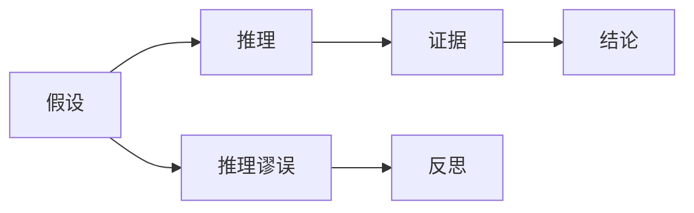
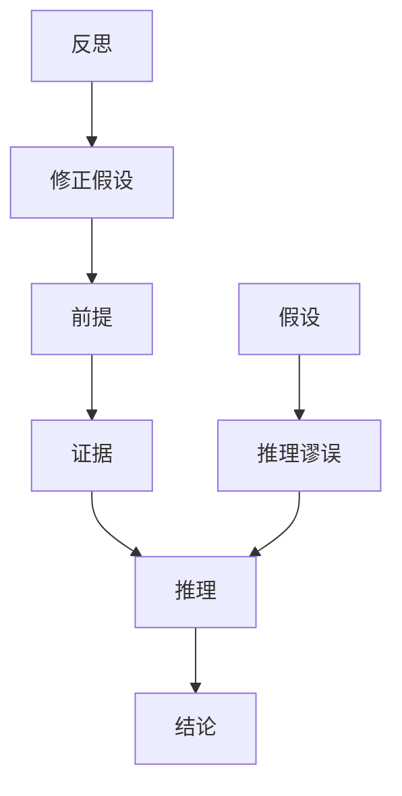

                 

# 批判性思维：提升洞察力的必备工具

## 1. 背景介绍

在信息技术迅猛发展的今天，数据和算法的结合为各行各业带来了前所未有的机遇与挑战。人工智能（AI）技术的应用日益深入，从自动驾驶、智能推荐到医疗诊断，无处不在。然而，技术的飞速发展也伴随着信息的爆炸，如何在海量数据中提取有效信息，做出正确判断，成为了一个重要议题。在此背景下，批判性思维（Critical Thinking）的培养与提升显得尤为重要。批判性思维是指通过一系列的分析、判断、评估等活动，对问题进行深入理解并得出合理结论的能力。本文旨在探讨批判性思维的核心概念及其在大数据和人工智能时代的应用，为读者提供系统化的理解框架和实践指导。

## 2. 核心概念与联系

### 2.1 核心概念概述

批判性思维的核心包含多个关键概念，这些概念构成了提升洞察力的基石。

- **假设（Assumption）**：预设的前提或基础信念，影响思维的逻辑路径和判断结果。
- **推理（Reasoning）**：通过逻辑推理从前提到结论的过程。
- **证据（Evidence）**：支撑结论的有效信息。
- **推理谬误（Fallacy）**：常见的逻辑错误，干扰推理过程。
- **反思（Reflection）**：对思维过程的自我检查和批判。

这些概念之间的关系可以通过以下Mermaid流程图来展示：



从图中可以看出，假设是推理和证据的基础，推理谬误会影响推理的准确性，反思则是保证推理正确性的关键环节。

### 2.2 核心概念原理和架构的 Mermaid 流程图



## 3. 核心算法原理 & 具体操作步骤

### 3.1 算法原理概述

批判性思维的算法原理可概括为**假设检验**（Hypothesis Testing）。其基本思想是通过假设-推理-验证的循环，逐步逼近问题的本质和正确结论。核心步骤如下：

1. **设定假设**：根据已有信息设定一个初步假设。
2. **收集证据**：寻找能够支持或反对假设的证据。
3. **推理验证**：基于证据进行逻辑推理，验证假设的正确性。
4. **反思修正**：对推理过程进行反思，发现推理谬误，修正假设。

### 3.2 算法步骤详解

#### 3.2.1 设定假设

假设应简洁明了，具有可验证性。例如，对于某电商平台用户留存率下降问题，假设可能是“竞争对手的促销活动影响了用户留存”。

#### 3.2.2 收集证据

证据应具有代表性，包括：
- **数据统计**：通过数据分析，寻找与假设相关的指标变化。
- **用户反馈**：收集用户评论、投诉等，了解用户真实感受。
- **市场信息**：了解竞争对手的市场动向，判断其是否对自身用户留存产生影响。

#### 3.2.3 推理验证

推理应遵循逻辑规则，避免推理谬误。常用的逻辑推理包括：
- **因果关系推理**：分析变量间因果关系，推断原因。
- **归纳推理**：从特定案例推广至一般规律。
- **演绎推理**：从一般原理推导出特定结论。

#### 3.2.4 反思修正

反思应客观公正，不偏不倚。反思的主要目的是发现并纠正推理谬误，常见的推理谬误包括：
- **偷换概念**：假设与推理过程中的概念不一致。
- **循环论证**：用结论证明假设，形成逻辑闭环。
- **以偏概全**：用局部数据代表整体，得出不准确结论。

### 3.3 算法优缺点

#### 3.3.1 优点

1. **逻辑严谨**：基于证据和逻辑推理，结论具有较强的说服力。
2. **灵活性高**：可针对不同问题设定不同假设，适应性强。
3. **易于理解**：推理过程透明，结论易于他人理解。

#### 3.3.2 缺点

1. **依赖证据质量**：假设和推理的准确性高度依赖于证据的有效性。
2. **推理谬误风险**：推理过程中可能出现各种逻辑谬误，影响结论可靠性。
3. **反思难度大**：反思和修正假设需要较强的逻辑思维能力和自省能力。

### 3.4 算法应用领域

批判性思维在大数据和人工智能领域具有广泛应用，特别是在数据驱动决策、智能推荐、自然语言处理等方面。具体应用包括：

- **数据驱动决策**：基于数据统计和推理，优化商业决策。
- **智能推荐系统**：通过用户行为数据分析，推荐符合用户兴趣的商品或内容。
- **自然语言处理**：通过文本分析，提升文本分类、情感分析、机器翻译等任务性能。

## 4. 数学模型和公式 & 详细讲解 & 举例说明

### 4.1 数学模型构建

批判性思维的数学模型可概括为**假设检验模型**，形式化描述为：
$$
H_0: \text{假设} \\
H_1: \text{对立假设} \\
D: \text{数据} \\
E: \text{证据} \\
P(D|H_0, E): \text{在假设H_0下，观察到数据D的概率} \\
P(D|H_1, E): \text{在对立假设H_1下，观察到数据D的概率} \\
$$

假设检验的目标是：在给定证据E和数据D的情况下，判断假设H_0是否成立。

### 4.2 公式推导过程

以一个简单的假设检验为例：假设H_0为“某药品对特定疾病有效”，H_1为“某药品对特定疾病无效”。已知某制药公司进行了100例临床试验，其中80例患者病情好转，20例无变化。设P(H_0)为0.8，P(H_1)为0.2。设P(D|H_0)为0.8，P(D|H_1)为0.2。根据贝叶斯公式，可以得到：
$$
P(H_0|D) = \frac{P(H_0)P(D|H_0)}{P(H_0)P(D|H_0) + P(H_1)P(D|H_1)} \\
P(H_1|D) = 1 - P(H_0|D)
$$

### 4.3 案例分析与讲解

假设某电商平台用户留存率下降，初步假设为“竞争对手的促销活动影响了用户留存”。通过以下步骤进行分析：

1. **收集数据**：
   - 电商平台的月活跃用户数（MAU）。
   - 竞争对手的促销活动时间表。
   - 用户评论和反馈数据。

2. **设定假设**：
   - H_0：竞争对手的促销活动不影响用户留存。
   - H_1：竞争对手的促销活动影响用户留存。

3. **推理验证**：
   - 分析月活跃用户数数据，查看促销活动前后是否存在显著变化。
   - 使用A/B测试等方法，验证促销活动对用户行为的影响。

4. **反思修正**：
   - 反思是否存在逻辑谬误，如用局部数据代表整体。
   - 修正假设，考虑促销活动外的其他影响因素，如季节性、市场变化等。

## 5. 项目实践：代码实例和详细解释说明

### 5.1 开发环境搭建

批判性思维的实践依赖于数据的获取和分析，因此，开发环境搭建主要涉及数据收集和处理工具。常用的工具包括：

- **Python**：数据分析和机器学习的主要语言，常用的数据处理库有Pandas、NumPy等。
- **R**：统计分析的重要工具，适合处理复杂的数据集和进行高级统计分析。
- **SQL**：数据库查询语言，适用于结构化数据处理。

### 5.2 源代码详细实现

以下是一个使用Python进行假设检验的代码实例，分析某电商平台用户留存率下降问题：

```python
import pandas as pd
import numpy as np
from scipy.stats import ttest_ind

# 数据处理
data = pd.read_csv('user_retention.csv')
data = data.groupby(['date', 'group']).agg({'user_count': 'sum'}).reset_index()

# 数据描述
print(data.describe())

# 假设检验
group1 = data[data['group'] == 'A']
group2 = data[data['group'] == 'B']
t_stat, p_val = ttest_ind(group1['user_count'], group2['user_count'], equal_var=False)
print(f'T统计量: {t_stat:.3f}, P值: {p_val:.4f}')

# 结果分析
if p_val < 0.05:
    print('假设H_0被拒绝，证据支持H_1')
else:
    print('假设H_0不能被拒绝，证据不支持H_1')
```

### 5.3 代码解读与分析

代码中，首先通过Pandas库加载数据，然后进行分组和聚合统计。接着，使用ttest_ind函数进行两组数据之间的t检验，最后根据P值判断假设是否成立。

### 5.4 运行结果展示

运行代码后，将得到t统计量和P值，根据P值判断假设是否成立。如果P值小于0.05，拒绝原假设H_0，认为两组数据有显著差异。

## 6. 实际应用场景

批判性思维在大数据和人工智能领域有广泛应用，特别是在以下场景：

### 6.1 数据驱动决策

在商业决策中，基于数据分析和推理，优化产品策略和市场布局。例如，通过分析用户行为数据，判断市场需求变化，优化产品功能。

### 6.2 智能推荐系统

通过用户行为数据分析，推荐符合用户兴趣的商品或内容。例如，通过分析用户点击、购买历史，推荐相关商品。

### 6.3 自然语言处理

通过文本分析，提升文本分类、情感分析、机器翻译等任务性能。例如，通过分析用户评论，进行情感分析，优化产品设计。

### 6.4 未来应用展望

未来，批判性思维在数据驱动决策、智能推荐、自然语言处理等领域将发挥更大作用。通过提升数据和算法的透明性和可解释性，更好地服务于业务需求和用户。

## 7. 工具和资源推荐

### 7.1 学习资源推荐

为了帮助读者系统掌握批判性思维的理论基础和实践技巧，推荐以下学习资源：

1. **《批判性思维》**：一本系统介绍批判性思维理论和方法的经典著作。
2. **Coursera课程**：《批判性思维与问题解决》，由密歇根大学提供，适合系统学习批判性思维的理论和应用。
3. **Khan Academy**：提供批判性思维的在线课程，适合初学者和进阶学习者。

### 7.2 开发工具推荐

常用的开发工具包括：

1. **Python**：数据分析和机器学习的主要语言。
2. **R**：统计分析的重要工具。
3. **SQL**：数据库查询语言。
4. **Jupyter Notebook**：交互式编程环境，适合数据探索和分析。
5. **MATLAB**：数值计算和数据分析的重要工具。

### 7.3 相关论文推荐

批判性思维在大数据和人工智能领域的研究方兴未艾，以下几篇论文值得关注：

1. **《大数据驱动的决策制定》**：探讨如何在大数据背景下进行数据驱动决策。
2. **《智能推荐系统》**：介绍智能推荐系统的原理和应用。
3. **《自然语言处理中的批判性思维》**：探讨批判性思维在自然语言处理中的应用。

## 8. 总结：未来发展趋势与挑战

### 8.1 研究成果总结

批判性思维在数据驱动决策、智能推荐、自然语言处理等领域具有广泛应用，提升数据分析和推理的准确性，优化业务决策和产品设计。

### 8.2 未来发展趋势

未来，批判性思维在数据驱动决策、智能推荐、自然语言处理等领域将发挥更大作用。通过提升数据和算法的透明性和可解释性，更好地服务于业务需求和用户。

### 8.3 面临的挑战

尽管批判性思维在数据分析和推理中具有重要作用，但在实际应用中仍面临以下挑战：

1. **数据质量**：数据质量直接影响分析结果，数据的缺失、噪声等问题需要引起重视。
2. **算法复杂性**：算法复杂度增加，推理过程更加复杂，需要更强的高阶思维能力。
3. **业务理解**：批判性思维的应用需要深入理解业务需求和市场动态，难度较大。

### 8.4 研究展望

未来的研究需要在以下方面寻求突破：

1. **提高数据质量**：通过数据清洗、数据增强等方法，提升数据质量。
2. **简化算法**：开发更简单、易懂的算法，降低推理复杂度。
3. **增强业务理解**：加强与业务团队的沟通，提升对业务需求的理解。

## 9. 附录：常见问题与解答

**Q1: 如何提高数据分析和推理的准确性？**

A: 通过批判性思维的假设检验方法，设定合理的假设，收集充分证据，遵循逻辑推理，逐步逼近问题的本质和正确结论。

**Q2: 批判性思维在数据分析中的应用案例有哪些？**

A: 数据驱动决策、智能推荐系统、自然语言处理等。例如，通过分析用户行为数据，优化产品策略和推荐系统。

**Q3: 批判性思维与人工智能的关系是什么？**

A: 批判性思维是人工智能的基础，通过数据驱动和逻辑推理，优化人工智能的决策和推理能力。

**Q4: 批判性思维有哪些应用领域？**

A: 数据分析、数据驱动决策、智能推荐、自然语言处理等。

---

作者：禅与计算机程序设计艺术 / Zen and the Art of Computer Programming

