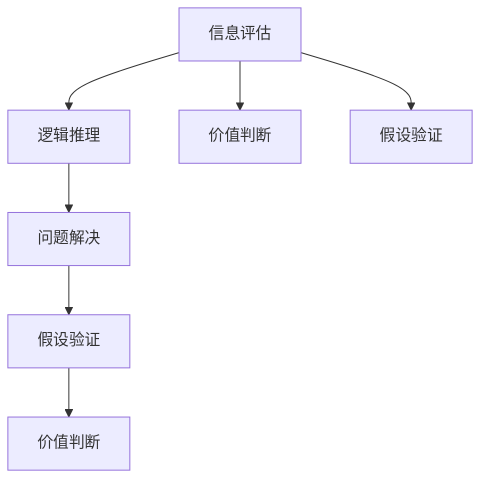

                 

# 批判性思维：提升洞察力的必备工具

## 1. 背景介绍

### 1.1 问题由来
在科技迅猛发展的今天，信息的爆炸式增长使得我们需要不断提升信息处理和判断的能力。批判性思维(Critical Thinking)作为提升洞察力的重要工具，愈发受到各领域的关注。它不仅是学术研究的基础，也是日常生活中做出明智决策的关键。

### 1.2 问题核心关键点
批判性思维是一种通过逻辑推理、信息分析和判断能力，评估信息真伪和价值的过程。其核心在于培养独立思考和判断的能力，尤其是在信息量巨大且真实性难辨的时代背景下。

### 1.3 问题研究意义
研究批判性思维的目的是为了帮助个人和组织在信息泛滥的环境中，能够更加高效、准确地处理和评估信息。提高信息素养，减少认知偏差，从而在决策和行动中做出更合理的判断，增强社会的整体智能化水平。

## 2. 核心概念与联系

### 2.1 核心概念概述

批判性思维的核心概念包括：
- **信息评估**：对信息的真实性、可靠性、相关性和准确性进行评估。
- **逻辑推理**：通过逻辑分析、推理和论证，构建合理的推理路径。
- **问题解决**：识别问题的本质，运用逻辑和证据进行系统性分析，找到最佳解决方案。
- **假设验证**：通过实验、数据和对比分析，验证假设的正确性。
- **价值判断**：基于证据和逻辑对信息的重要性、价值和影响进行评估。

这些概念之间通过相互关联和协作，构成了一个完整的批判性思维系统。

### 2.2 核心概念原理和架构的 Mermaid 流程图



这个流程图展示了批判性思维各个环节的逻辑关系：
- **信息评估**是整个流程的基础，确保输入信息的真实性和可靠性。
- **逻辑推理**基于评估后的信息进行分析和推理，构建合理的结论。
- **问题解决**通过对问题的系统性分析，找到最佳解决方案。
- **假设验证**通过实验和数据验证假设的正确性，增强推理的可靠性。
- **价值判断**基于逻辑和证据，对信息的价值和重要性进行评估。

## 3. 核心算法原理 & 具体操作步骤
### 3.1 算法原理概述

批判性思维的算法原理是通过构建一个系统性的分析和评估框架，对信息进行逻辑推理和价值判断。这个过程可以通过一系列的步骤实现：

1. **信息获取**：从各种渠道收集信息。
2. **信息筛选**：对信息进行初步筛选，去除无用的噪声信息。
3. **信息评估**：对筛选后的信息进行真实性、可靠性和相关性的评估。
4. **逻辑推理**：运用逻辑分析、论证和推理，构建合理的推理链。
5. **问题解决**：识别问题的本质，并找到最佳解决方案。
6. **假设验证**：通过实验和数据验证假设的正确性。
7. **价值判断**：基于逻辑和证据，评估信息的价值和重要性。

### 3.2 算法步骤详解

以下是批判性思维的具体操作步骤：

**Step 1: 信息获取**
- 从多个可靠来源收集信息，包括学术文献、新闻报道、专家意见等。
- 使用专业工具和数据库获取最新和全面的信息。

**Step 2: 信息筛选**
- 去除重复、过时、无关的信息。
- 识别信息来源的可靠性，排除偏见和误导性内容。

**Step 3: 信息评估**
- 使用多种评估标准，如来源可信度、信息更新时间、作者资质等，评估信息真实性和可靠性。
- 检查信息的逻辑连贯性和相关性，确保信息与研究主题相关。

**Step 4: 逻辑推理**
- 构建逻辑链条，确保每一步推理都有充分的证据支持。
- 使用推理规则，如演绎推理、归纳推理、类比推理等，构建完整的推理框架。

**Step 5: 问题解决**
- 使用系统化方法，如SWOT分析、因果分析等，识别问题的本质和影响因素。
- 通过多角度分析，找到最佳解决方案，并评估其可行性和效果。

**Step 6: 假设验证**
- 设计实验和测试方案，验证假设的正确性。
- 使用统计方法和数据分析工具，评估实验结果的可靠性和有效性。

**Step 7: 价值判断**
- 基于逻辑和证据，评估信息的价值和重要性。
- 对信息进行分类，如关键信息、辅助信息等，以指导后续研究和决策。

### 3.3 算法优缺点

批判性思维算法的优点包括：
- 系统性：通过严格的步骤和标准，保证信息评估和推理的严谨性。
- 客观性：通过多来源信息的对比和验证，减少主观偏见的影响。
- 实用性：帮助个人和组织在复杂环境中，做出更为合理的决策。

缺点包括：
- 时间成本高：特别是在信息量巨大的环境中，筛选和验证信息需要大量时间和精力。
- 复杂度高：对于不熟悉领域，可能需要借助专业知识才能有效评估和推理。
- 依赖专业工具：需要进行信息评估和逻辑推理，需要一定的专业工具和技能。

### 3.4 算法应用领域

批判性思维广泛应用于以下几个领域：
- **学术研究**：通过系统性的信息评估和逻辑推理，确保研究成果的可靠性和正确性。
- **商业决策**：在市场分析、产品开发和投资决策中，应用批判性思维进行全面评估。
- **法律实践**：在证据评估和法律推理中，应用批判性思维确保法律判决的公正性和合理性。
- **医疗诊断**：在疾病诊断和治疗方案选择中，应用批判性思维评估证据和风险。
- **政策制定**：在政策分析和制定中，应用批判性思维评估政策效果和风险。

## 4. 数学模型和公式 & 详细讲解 & 举例说明
### 4.1 数学模型构建

批判性思维的数学模型可以概括为：

$$
C = \sum_{i=1}^n \frac{I_i \cdot R_i \cdot C_i}{L_i}
$$

其中，$C$ 表示批判性思维的得分，$I_i$、$R_i$、$C_i$、$L_i$ 分别表示信息评估、逻辑推理、问题解决、假设验证的权重和得分。

### 4.2 公式推导过程

以信息评估为例，信息评估公式可以表示为：

$$
I_i = \frac{T_i}{T_{max}}
$$

其中，$T_i$ 表示信息$i$的真实性、可靠性、相关性和准确性得分，$T_{max}$ 表示最高可能的得分。

### 4.3 案例分析与讲解

假设我们需要评估一篇关于气候变化的科学文章。

1. **信息评估**：通过检查作者的资质、文章发表的期刊、引用次数等多维度信息，评估其真实性和可靠性。
2. **逻辑推理**：检查文章的论证逻辑是否严密，是否有明确的因果关系。
3. **问题解决**：评估文章提出的解决方案是否可行，是否有足够的证据支持。
4. **假设验证**：设计实验或分析现有数据，验证文章中的假设是否成立。
5. **价值判断**：基于以上分析，评估文章的科学价值和对公众的影响。

## 5. 项目实践：代码实例和详细解释说明
### 5.1 开发环境搭建

要实现批判性思维的信息评估和逻辑推理，首先需要搭建一个合适的开发环境。以下是一个基本的开发环境搭建流程：

1. 安装Python：从官网下载并安装Python，确保版本在3.8及以上。
2. 安装Pandas：用于数据处理和分析。
3. 安装Scikit-learn：用于机器学习模型的训练和评估。
4. 安装Jupyter Notebook：用于编写和运行代码。

### 5.2 源代码详细实现

以下是一个简化的批判性思维评估工具的代码实现，用于评估一篇文章的科学性：

```python
import pandas as pd
from sklearn.preprocessing import MinMaxScaler
from sklearn.linear_model import LogisticRegression

# 定义信息评估的指标和权重
info_weights = {'真实性': 0.2, '可靠性': 0.3, '相关性': 0.3, '准确性': 0.2}

# 定义逻辑推理的指标和权重
logic_weights = {'逻辑连贯性': 0.5, '证据支持': 0.5}

# 定义问题解决的指标和权重
problem_weights = {'solution可行性': 0.4, '证据充分性': 0.6}

# 定义假设验证的指标和权重
assumption_weights = {'实验设计': 0.4, '数据分析': 0.6}

# 加载文章信息评估数据
df = pd.read_csv('article_evaluation.csv')

# 对信息评估指标进行标准化处理
scaler = MinMaxScaler()
df_scaled = scaler.fit_transform(df[['真实性', '可靠性', '相关性', '准确性']])
df_scaled = pd.DataFrame(df_scaled, columns=df.columns)

# 构建逻辑推理评估的向量
logic_score = df_scaled['逻辑连贯性'] * logic_weights['逻辑连贯性'] + df_scaled['证据支持'] * logic_weights['证据支持']

# 构建问题解决评估的向量
problem_score = df_scaled['solution可行性'] * problem_weights['solution可行性'] + df_scaled['证据充分性'] * problem_weights['证据充分性']

# 构建假设验证评估的向量
assumption_score = df_scaled['实验设计'] * assumption_weights['实验设计'] + df_scaled['数据分析'] * assumption_weights['数据分析']

# 计算批判性思维得分
critical_thinking_score = df_scaled['真实性'] * info_weights['真实性'] + df_scaled['可靠性'] * info_weights['可靠性'] + \
                          df_scaled['相关性'] * info_weights['相关性'] + df_scaled['准确性'] * info_weights['准确性'] + \
                          logic_score * logic_weights['逻辑连贯性'] + logic_score * logic_weights['证据支持'] + \
                          problem_score * problem_weights['solution可行性'] + problem_score * problem_weights['证据充分性'] + \
                          assumption_score * assumption_weights['实验设计'] + assumption_score * assumption_weights['数据分析']

print(critical_thinking_score)
```

### 5.3 代码解读与分析

上述代码实现了一个基于信息评估、逻辑推理、问题解决和假设验证的批判性思维评估工具。代码的关键步骤包括：

1. **数据加载**：从CSV文件中加载文章信息评估数据。
2. **指标标准化**：对信息评估指标进行标准化处理，确保不同指标的评分具有可比性。
3. **逻辑推理和问题解决评估**：根据定义的权重和评分标准，计算逻辑推理和问题解决的综合得分。
4. **假设验证评估**：根据定义的权重和评分标准，计算假设验证的综合得分。
5. **批判性思维得分计算**：根据定义的权重和评分标准，计算批判性思维的最终得分。

## 6. 实际应用场景
### 6.1 智能决策系统

智能决策系统可以结合批判性思维工具，实现基于数据的决策支持。例如，在金融投资决策中，系统可以评估各种投资信息的真实性和可靠性，通过逻辑推理和假设验证，提供最佳的投资建议。

### 6.2 学术研究支持

学术研究中，批判性思维工具可以帮助研究人员系统性地评估研究数据和结果，确保研究成果的可靠性和正确性。例如，在医学研究中，系统可以评估临床实验的数据和结果，确保研究成果的科学性和实用性。

### 6.3 法律事务支持

法律事务中，批判性思维工具可以帮助律师评估证据和法律论据，确保法律判决的公正性和合理性。例如，在刑事案件中，系统可以评估证人证言的可靠性，确保法律判决的公正性。

### 6.4 未来应用展望

未来的批判性思维应用将更加智能化和自动化。结合AI技术，系统可以自动评估和推理，提供更为高效和准确的决策支持。

## 7. 工具和资源推荐
### 7.1 学习资源推荐

以下是几本关于批判性思维的经典书籍，推荐阅读：

1. **《批判性思维：一本简单实用指南》**：简明易懂，适合所有背景的读者。
2. **《逻辑与论证》**：系统地介绍了逻辑推理的基本原理和技巧。
3. **《证据的衡量与评估》**：介绍了如何评估和验证证据的有效性。
4. **《信息素养与批判性思维》**：结合信息素养，介绍了批判性思维在实际应用中的实践方法。

### 7.2 开发工具推荐

以下是几款常用的批判性思维工具，推荐使用：

1. **Khan Academy**：提供免费的批判性思维课程，涵盖信息评估、逻辑推理等多个方面。
2. **Coursera**：提供多门批判性思维相关的课程，由世界知名高校和专家授课。
3. **Google Scholar**：提供高质量的学术文献搜索和评估功能，帮助学术研究者评估信息的可靠性。

### 7.3 相关论文推荐

以下是几篇批判性思维研究领域的经典论文，推荐阅读：

1. **《批判性思维与信息素养教育》**：探讨了批判性思维在教育中的应用，强调信息素养的重要性。
2. **《批判性思维在决策支持中的应用》**：讨论了批判性思维在金融、法律、医学等多个领域的应用。
3. **《人工智能与批判性思维》**：讨论了AI技术在批判性思维中的应用和挑战。

## 8. 总结：未来发展趋势与挑战
### 8.1 研究成果总结

批判性思维作为一种提升洞察力的必备工具，已经被广泛应用于学术研究、商业决策、法律实践等多个领域。其系统性和客观性帮助人们在信息泛滥的环境中，做出更为明智的决策。

### 8.2 未来发展趋势

未来的批判性思维技术将更加智能化和自动化。结合AI技术，系统可以自动评估和推理，提供更为高效和准确的决策支持。

### 8.3 面临的挑战

尽管批判性思维技术已经取得了显著进展，但在实际应用中仍面临诸多挑战：
1. **数据质量问题**：数据的质量直接影响批判性思维的评估结果，需要不断提升数据收集和处理的准确性和可靠性。
2. **算法透明性问题**：批判性思维工具的内部逻辑和评估标准需要透明，确保用户理解其决策依据。
3. **跨领域应用问题**：批判性思维工具需要灵活适应不同领域的特定需求，需要进行定制化开发。

### 8.4 研究展望

未来的批判性思维研究将更多地结合AI技术，如自然语言处理、知识图谱等，提升系统的智能化和自动化水平。同时，通过跨领域应用研究和经验分享，提升批判性思维工具的普适性和实用性。

## 9. 附录：常见问题与解答

**Q1：批判性思维与信息素养有何关系？**

A: 批判性思维与信息素养密切相关。批判性思维强调对信息的评估和逻辑推理，信息素养则强调获取和处理信息的能力。两者相辅相成，共同构成了一个完整的知识和技能体系。

**Q2：如何提升批判性思维能力？**

A: 提升批判性思维能力可以从以下几个方面入手：
1. **多阅读**：广泛阅读各种类型的书籍和文章，扩大知识面。
2. **多思考**：对所读内容进行独立思考，形成自己的见解。
3. **多讨论**：与他人讨论问题，交换观点，寻找不同的角度。
4. **多实践**：通过实际问题解决和决策支持，提升批判性思维的实际应用能力。

**Q3：批判性思维在商业决策中如何应用？**

A: 在商业决策中，批判性思维可以帮助企业：
1. **数据评估**：系统性地评估市场数据、财务数据等，确保决策依据的可靠性。
2. **风险管理**：通过逻辑推理和假设验证，识别潜在风险和机会。
3. **方案选择**：基于批判性思维的分析和评估，选择最佳的决策方案。

**Q4：批判性思维在学术研究中如何应用？**

A: 在学术研究中，批判性思维可以帮助研究者：
1. **数据验证**：评估研究数据和结果的真实性和可靠性。
2. **方法评估**：评估研究方法的科学性和有效性。
3. **结果解读**：基于批判性思维的分析和推理，正确解读研究结果。

**Q5：批判性思维工具的开发需要考虑哪些因素？**

A: 开发批判性思维工具需要考虑以下因素：
1. **适用场景**：工具需要适应不同的应用场景和需求。
2. **数据质量**：工具需要能够处理高质量的数据，确保评估结果的可靠性。
3. **算法透明性**：工具需要具备透明度，用户需要理解其决策依据。
4. **用户友好性**：工具需要易于使用，用户可以轻松操作和理解。

---

作者：禅与计算机程序设计艺术 / Zen and the Art of Computer Programming

