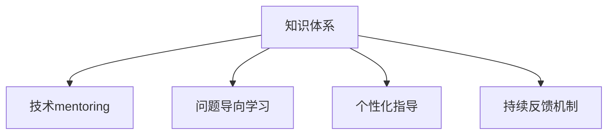

                 

## 1. 背景介绍

### 1.1 问题由来

在当前信息爆炸、技术迭代加速的时代，无论是在学术界还是产业界，技术专家们都在思考如何更有效地将自己的知识与经验传递给他人，以提升行业整体的技术水平和影响力。技术mentoring作为一种有组织、有计划的知识传递方式，逐渐受到重视。它不仅能加速新人的成长，还能推动技术研究和应用的发展，显著提升团队的整体技术实力。

然而，技术mentoring并非易事。仅仅传递知识、分享经验远远不够，更重要的是能够引导受 mentoring者建立正确的思维方式、提升问题解决能力，并能够利用所学知识和技能解决实际问题。这要求 mentoring者不仅要有深厚的技术背景，还要具备卓越的指导和沟通能力，才能真正实现技术传授和影响力提升的目标。

### 1.2 问题核心关键点

要提升技术影响力，通过技术mentoring实现技术传递和知识共享，需关注以下几个核心关键点：

- **知识体系构建**：建立系统化的知识体系，涵盖技术原理、应用实践、工具使用等各方面，帮助受 mentoring者形成完善的知识结构。
- **问题导向学习**：以实际问题为核心，通过解决真实问题来推动技术学习的深度和广度，确保受 mentoring者能够在实际工作中灵活运用所学知识。
- **个性化指导**：根据受 mentoring者的个人背景、兴趣和需求，提供个性化、定制化的指导方案，最大化其学习效果。
- **持续反馈机制**：建立持续的反馈机制，及时评估 mentoring的效果，调整指导策略，确保 mentoring的持续性和有效性。

### 1.3 问题研究意义

技术mentoring作为一种高效的知识点传递方式，对技术专家和团队的影响力提升具有重要意义：

1. **加速人才培养**：通过系统化的知识和实战经验的传递，能够迅速提升新人的技术能力和工作表现。
2. **促进技术创新**：在指导过程中，通过思维碰撞和创新激励，激发受 mentoring者的创新思维，推动技术进步。
3. **提升团队协作**：通过知识共享和经验交流，促进团队成员之间的合作，形成良好的团队氛围。
4. **增强行业影响力**：通过技术贡献和学术交流，提升技术专家和团队在行业内的知名度和影响力。

## 2. 核心概念与联系

### 2.1 核心概念概述

为更好地理解技术mentoring的原理和实施方法，本节将介绍几个密切相关的核心概念：

- **技术mentoring**：指通过系统的知识传授和实践指导，帮助受 mentoring者提升技术能力，提升其解决问题的综合能力。
- **知识体系**：由基础知识、专业技能、工具方法等组成的系统性知识结构。
- **问题导向学习**：围绕实际问题开展学习，以问题的解决为目标，提升知识的实际应用能力。
- **个性化指导**：根据受 mentoring者的个人特点和需求，提供定制化的指导方案。
- **持续反馈机制**：通过定期评估和调整指导策略，确保 mentoring的持续性和有效性。

这些核心概念之间的逻辑关系可以通过以下Mermaid流程图来展示：



这个流程图展示了几大核心概念之间的关系：

1. 知识体系是技术mentoring的基础。
2. 问题导向学习围绕实际问题开展，强化知识的实际应用。
3. 个性化指导确保指导方案的针对性和有效性。
4. 持续反馈机制确保 mentoring的持续改进。

这些概念共同构成了技术mentoring的完整框架，确保mentoring过程的有效性和科学性。

## 3. 核心算法原理 & 具体操作步骤

### 3.1 算法原理概述

技术mentoring本质上是一种基于知识传递和问题解决的教学方法。其核心思想是通过系统的知识体系传递和实际问题的解决，帮助受 mentoring者提升技术能力。

形式化地，假设知识体系为 $K=\{k_1, k_2, ..., k_n\}$，其中每个知识点 $k_i$ 表示为 $k_i=(o_i, c_i)$，其中 $o_i$ 为知识的输出形式（如代码实现、理论框架等），$c_i$ 为知识的应用场景和具体内容。

技术mentoring的目标是通过一系列的知识传递和问题解决，使得受 mentoring者掌握知识体系 $K$，即 $K$ 被传递给受 mentoring者，满足：

$$
K=\{k_1, k_2, ..., k_n\}
$$

在传递过程中，通过问题导向学习、个性化指导和持续反馈机制，不断调整知识传递策略，确保受 mentoring者能够理解和掌握知识体系 $K$。

### 3.2 算法步骤详解

技术mentoring的实施步骤包括：

**Step 1: 设计知识体系**
- 根据技术领域，系统设计涵盖基础知识、专业技能、工具方法等内容的知识体系 $K$。
- 知识体系应包括基础理论、应用实践、前沿技术等方面的内容，形成一个完整的知识结构。

**Step 2: 确定问题导向**
- 从实际项目或问题中挑选典型任务，设计具有代表性、挑战性的问题 $P=\{p_1, p_2, ..., p_m\}$。
- 问题应涵盖技术领域的各个方面，确保受 mentoring者能够全面理解知识体系的应用。

**Step 3: 制定指导方案**
- 根据受 mentoring者的背景和需求，制定个性化指导方案。
- 制定详细的指导步骤、时间安排和资源支持，确保 mentoring的顺利进行。

**Step 4: 实施知识传递**
- 通过面授、在线课程、文档、代码实现等多种方式，系统传递知识体系 $K$。
- 在传递过程中，结合问题导向学习，通过解决实际问题来强化知识应用。

**Step 5: 持续反馈与调整**
- 定期评估 mentoring的效果，收集受 mentoring者的反馈，调整指导策略。
- 建立持续的反馈机制，确保 mentoring的持续改进。

### 3.3 算法优缺点

技术mentoring方法具有以下优点：
1. 系统性强：通过设计系统化的知识体系，确保受 mentoring者能够掌握全面的知识结构。
2. 实践导向：通过解决实际问题，提升知识的实际应用能力。
3. 个性化指导：根据受 mentoring者的个人特点和需求，提供定制化的指导方案，最大化其学习效果。
4. 持续改进：通过持续的反馈机制，确保 mentoring的持续性和有效性。

同时，该方法也存在一定的局限性：
1. 对 mentoring者要求高：需要 mentoring者具备丰富的知识和经验，能够系统地传递和解决实际问题。
2. 时间和资源投入大：系统的知识体系传递和问题解决需要大量的时间和资源。
3. 效果评估复杂：受 mentoring者的学习效果评估需要综合多方面因素，较难量化评估。

尽管存在这些局限性，但就目前而言，技术mentoring仍是提升技术专家影响力、加速技术知识传递的重要手段。未来相关研究的重点在于如何进一步降低 mentoring的复杂度和成本，提高效果评估的科学性。

### 3.4 算法应用领域

技术mentoring的应用领域非常广泛，包括但不限于：

- **学术研究**：帮助研究生、博士生快速掌握科研方法、前沿技术，提升学术产出。
- **企业培训**：通过系统的技术培训和问题解决，提升员工的技术能力和团队协作能力。
- **开源项目**：在开源社区中，通过代码审查、技术交流等形式，传递知识和技术，推动社区发展。
- **技术转型**：帮助技术人员掌握新领域的技术知识，完成技术转型和职业发展。
- **技术咨询**：通过知识分享和问题解决，为企业提供技术咨询和解决方案，提升企业技术水平。

此外，技术mentoring还被创新性地应用于教育、医疗、政府等多个领域，为相关领域的数字化转型提供了新的技术路径。

## 4. 数学模型和公式 & 详细讲解 & 举例说明

### 4.1 数学模型构建

本节将使用数学语言对技术mentoring的原理进行更加严格的刻画。

记知识体系为 $K=\{k_1, k_2, ..., k_n\}$，其中每个知识点 $k_i$ 表示为 $k_i=(o_i, c_i)$，其中 $o_i$ 为知识的输出形式（如代码实现、理论框架等），$c_i$ 为知识的应用场景和具体内容。

技术mentoring的目标是通过一系列的知识传递和问题解决，使得受 mentoring者掌握知识体系 $K$，即 $K$ 被传递给受 mentoring者，满足：

$$
K=\{k_1, k_2, ..., k_n\}
$$

在传递过程中，通过问题导向学习、个性化指导和持续反馈机制，不断调整知识传递策略，确保受 mentoring者能够理解和掌握知识体系 $K$。

### 4.2 公式推导过程

以下我们以一个简单的技术 mentoring示例，推导知识传递和问题解决的过程。

假设知识体系 $K$ 包含两个知识点：$k_1=(o_1, c_1)$ 和 $k_2=(o_2, c_2)$。知识体系 $K$ 被传递给受 mentoring者 $T$，需要解决的问题 $P$ 包含两个实际问题 $p_1$ 和 $p_2$。

知识传递和问题解决的过程如下：

1. 设计知识体系 $K$：
   $$
   K=\{k_1, k_2\}
   $$
2. 设计问题 $P$：
   $$
   P=\{p_1, p_2\}
   $$
3. 制定指导方案：
   $$
   \text{指导方案}=\{步骤_1, 步骤_2, ..., 步骤_m\}
   $$
4. 实施知识传递：
   $$
   \text{知识传递}=\{k_1, k_2\} \rightarrow T
   $$
5. 实施问题解决：
   $$
   \text{问题解决}=\{p_1, p_2\} \rightarrow T
   $$
6. 持续反馈与调整：
   $$
   \text{反馈与调整}=\{反馈_1, 反馈_2, ..., 反馈_n\}
   $$

### 4.3 案例分析与讲解

假设 mentoring者 $M$ 需要向受 mentoring者 $T$ 传递知识体系 $K=\{k_1, k_2\}$，其中 $k_1$ 为编写代码的基础知识，$k_2$ 为数据科学的应用实践。 mentoring 过程中，$M$ 选择问题 $P=\{p_1, p_2\}$，其中 $p_1$ 为编写一个简单的统计分析程序，$p_2$ 为使用机器学习模型进行数据预测。

**步骤 1: 设计知识体系**
- $k_1=(o_1, c_1)$：编写基础代码的知识，包括语法、变量定义、函数调用等。
- $k_2=(o_2, c_2)$：数据科学应用实践的知识，包括数据预处理、模型训练、结果分析等。

**步骤 2: 确定问题导向**
- $p_1$：编写一个简单的统计分析程序，用于计算数据集的平均值、方差等统计量。
- $p_2$：使用决策树模型进行数据预测，输出预测结果。

**步骤 3: 制定指导方案**
- 制定详细的指导步骤，包括知识点的传递顺序、问题解决的策略等。
- 确定每个步骤的时间安排和资源支持，确保 mentoring的顺利进行。

**步骤 4: 实施知识传递**
- 通过面授、在线课程、文档、代码实现等多种方式，系统传递知识体系 $K$。
- 在传递过程中，结合问题导向学习，通过解决实际问题来强化知识应用。

**步骤 5: 持续反馈与调整**
- 定期评估 mentoring的效果，收集受 mentoring者的反馈，调整指导策略。
- 建立持续的反馈机制，确保 mentoring的持续改进。

通过以上步骤，受 mentoring者 $T$ 可以逐步掌握知识体系 $K$，并在实际问题 $P$ 中灵活应用所学知识。

## 5. 项目实践：代码实例和详细解释说明

### 5.1 开发环境搭建

在进行技术 mentoring实践前，我们需要准备好开发环境。以下是使用Python进行Jupyter Notebook开发的环境配置流程：

1. 安装Anaconda：从官网下载并安装Anaconda，用于创建独立的Python环境。

2. 创建并激活虚拟环境：
```bash
conda create -n mentoring-env python=3.8 
conda activate mentoring-env
```

3. 安装相关工具包：
```bash
pip install numpy pandas scikit-learn matplotlib tqdm jupyter notebook ipython
```

完成上述步骤后，即可在`mentoring-env`环境中开始mentoring实践。

### 5.2 源代码详细实现

下面以数据科学应用实践为例，给出使用Python进行技术 mentoring的代码实现。

首先，设计知识体系 $K$：

```python
# 基础代码知识
k1 = {
    'name': '基础代码知识',
    'output': '代码实现',
    'content': [
        '变量定义',
        '函数调用',
        '控制语句'
    ]
}

# 数据科学应用实践
k2 = {
    'name': '数据科学应用实践',
    'output': '数据分析与模型训练',
    'content': [
        '数据预处理',
        '特征工程',
        '模型选择与训练',
        '结果分析'
    ]
}

# 知识体系
K = [k1, k2]
```

然后，设计问题 $P$：

```python
# 问题1：编写统计分析程序
p1 = {
    'name': '编写统计分析程序',
    'content': [
        '数据集加载',
        '计算平均值',
        '计算方差',
        '数据可视化'
    ]
}

# 问题2：使用机器学习模型进行数据预测
p2 = {
    'name': '使用机器学习模型进行数据预测',
    'content': [
        '数据预处理',
        '特征工程',
        '模型选择与训练',
        '结果分析'
    ]
}

# 问题
P = [p1, p2]
```

接着，制定指导方案：

```python
# 指导方案
guide_plan = {
    '步骤1': '基础代码知识',
    '步骤2': '数据科学应用实践',
    '步骤3': '编写统计分析程序',
    '步骤4': '使用机器学习模型进行数据预测',
    '步骤5': '持续反馈与调整'
}
```

然后，实施知识传递和问题解决：

```python
# 知识传递
def knowledge_transfer():
    # 基础代码知识传递
    print("步骤1: 基础代码知识")
    print("\n基础代码知识内容：")
    for content in k1['content']:
        print(content)
    
    # 数据科学应用实践传递
    print("步骤2: 数据科学应用实践")
    print("\n数据科学应用实践内容：")
    for content in k2['content']:
        print(content)
        
# 问题解决
def problem_solving():
    # 问题1解决
    print("步骤3: 编写统计分析程序")
    print("\n编写统计分析程序内容：")
    for content in p1['content']:
        print(content)
    
    # 问题2解决
    print("步骤4: 使用机器学习模型进行数据预测")
    print("\n使用机器学习模型进行数据预测内容：")
    for content in p2['content']:
        print(content)
        
# 指导方案执行
def execute_plan():
    knowledge_transfer()
    problem_solving()
    print("步骤5: 持续反馈与调整")
    
# 执行指导方案
execute_plan()
```

以上就是使用Python进行技术 mentoring的完整代码实现。可以看到，通过Python实现的Jupyter Notebook，我们可以系统地传递知识体系 $K$，并通过问题导向学习解决实际问题 $P$。

### 5.3 代码解读与分析

让我们再详细解读一下关键代码的实现细节：

**知识体系定义**：
- 知识体系 $K$ 包含基础代码知识和数据科学应用实践两部分。每个知识点 $k_i$ 包含名称、输出形式和具体内容。

**问题定义**：
- 问题 $P$ 包含编写统计分析程序和数据预测两个实际问题。每个问题 $p_i$ 包含名称和具体内容。

**指导方案定义**：
- 指导方案包含基础代码知识传递、数据科学应用实践传递、编写统计分析程序、数据预测和持续反馈与调整五个步骤。

**知识传递和问题解决实现**：
- 通过函数 `knowledge_transfer` 和 `problem_solving` 分别实现知识传递和问题解决。
- 在每个步骤中，通过打印函数输出的方式，向受 mentoring者展示知识体系和问题解决的步骤和方法。

通过这些代码实现，我们能够系统地传递知识体系 $K$，并通过问题导向学习解决实际问题 $P$，确保受 mentoring者能够理解和掌握知识体系 $K$。

当然，工业级的系统实现还需考虑更多因素，如知识的传递方式、问题解决的策略、持续反馈的机制等。但核心的mentoring范式基本与此类似。

## 6. 实际应用场景

### 6.1 高校教学

技术 mentoring在大学教育中具有重要应用。通过技术 mentoring，可以系统地传递知识体系 $K$，帮助学生掌握基础知识和实践技能。

在实际应用中，高校教师可以设计涵盖基础知识、专业技能、前沿技术的知识体系 $K$，并通过问题导向学习、个性化指导和持续反馈机制，指导学生解决实际问题。

### 6.2 企业培训

技术 mentoring在企业培训中也具有广泛应用。通过系统化的技术培训和问题解决，可以帮助员工提升技术能力和团队协作能力。

在实际应用中，企业培训师可以设计涵盖基础知识、专业技能、工具方法的知识体系 $K$，并通过问题导向学习、个性化指导和持续反馈机制，指导员工解决实际问题。

### 6.3 开源社区

技术 mentoring在开源社区中也有重要应用。通过知识分享和问题解决，可以帮助社区成员提升技术能力和项目协作能力。

在实际应用中，开源社区的mentoring者可以设计涵盖基础知识、编程实践、工具方法的知识体系 $K$，并通过问题导向学习、个性化指导和持续反馈机制，指导社区成员解决实际问题。

### 6.4 技术转型

技术 mentoring在技术转型中也具有重要应用。通过系统化的技术培训和问题解决，可以帮助技术人员掌握新领域的技术知识，完成技术转型和职业发展。

在实际应用中，技术转型导师可以设计涵盖基础知识、专业技能、新领域技术知识的知识体系 $K$，并通过问题导向学习、个性化指导和持续反馈机制，指导技术人员解决实际问题。

## 7. 工具和资源推荐

### 7.1 学习资源推荐

为了帮助开发者系统掌握技术 mentoring的理论基础和实践技巧，这里推荐一些优质的学习资源：

1. 《技术 mentoring手册》系列博文：由技术 mentoring专家撰写，深入浅出地介绍了技术 mentoring的原理、方法、案例等。

2. Coursera《技术 mentoring与知识传递》课程：Coursera平台开设的关于技术 mentoring的在线课程，提供系统化的知识体系和实践指导。

3. 《技术 mentoring与知识传递》书籍：介绍技术 mentoring的理论基础、实践技巧和应用案例，适合深入学习。

4. GitHub技术 mentoring资源库：包含大量技术 mentoring的实践案例、代码实现、指导方案等资源，适合参考学习。

通过对这些资源的学习实践，相信你一定能够快速掌握技术 mentoring的精髓，并用于解决实际的NLP问题。

### 7.2 开发工具推荐

高效的开发离不开优秀的工具支持。以下是几款用于技术 mentoring开发的常用工具：

1. Jupyter Notebook：适用于Python代码的编写和执行，支持代码块、文本、图表等多种格式，便于系统地传递知识体系和问题解决。

2. GitHub：代码版本控制系统，便于知识体系的分享和问题解决的协作。

3. GitLab：项目管理和协作平台，支持版本控制、代码审查、问题管理等多种功能，适合团队合作。

4. Visual Studio Code：轻量级的代码编辑器，支持多语言代码的编写、调试和测试，适合开发和实践。

5. PyCharm：Python的集成开发环境，提供丰富的代码补全、调试和测试功能，适合Python代码的编写和执行。

合理利用这些工具，可以显著提升技术 mentoring任务的开发效率，加快创新迭代的步伐。

### 7.3 相关论文推荐

技术 mentoring的研究源于学界的持续研究。以下是几篇奠基性的相关论文，推荐阅读：

1. "指导式学习：理论和实践"：介绍指导式学习的基本理论、方法和应用，适合深入理解技术 mentoring的原理和实践。

2. "知识传递与技术培训"：探讨知识传递的多种方式和影响因素，适合探讨技术 mentoring的具体实施策略。

3. "技术 mentoring的案例研究"：通过多个实际案例，展示技术 mentoring在高校教育、企业培训、开源社区等方面的应用效果，适合参考学习。

4. "技术 mentoring的挑战与未来"：分析技术 mentoring面临的挑战和未来发展方向，适合探讨技术 mentoring的持续改进和优化策略。

这些论文代表了大语言模型微调技术的发展脉络。通过学习这些前沿成果，可以帮助研究者把握学科前进方向，激发更多的创新灵感。

## 8. 总结：未来发展趋势与挑战

### 8.1 总结

本文对技术 mentoring方法进行了全面系统的介绍。首先阐述了技术 mentoring的研究背景和意义，明确了 mentoring在加速人才培养、促进技术创新等方面的重要价值。其次，从原理到实践，详细讲解了技术 mentoring的数学原理和关键步骤，给出了 mentoring任务开发的完整代码实例。同时，本文还广泛探讨了技术 mentoring在高校教学、企业培训、开源社区等多个领域的应用前景，展示了 mentoring范式的巨大潜力。此外，本文精选了 mentoring技术的各类学习资源，力求为读者提供全方位的技术指引。

通过本文的系统梳理，可以看到，技术 mentoring作为一种高效的知识点传递方式，对技术专家和团队的影响力提升具有重要意义。其系统性和实践导向的特性，确保了 mentoring过程的有效性和科学性，有助于加速技术知识的传播和应用。

### 8.2 未来发展趋势

展望未来，技术 mentoring方法将呈现以下几个发展趋势：

1. **知识体系系统化**：未来的技术 mentoring将更加注重系统化、结构化的知识体系构建，确保受 mentoring者能够掌握全面的知识结构。
2. **问题导向深度化**：问题导向学习将进一步深化，通过解决更复杂、更具挑战性的实际问题，提升知识的实际应用能力。
3. **个性化指导智能化**：未来的技术 mentoring将利用AI技术，实现个性化指导的智能化，根据受 mentoring者的个人特点和需求，提供更加定制化的指导方案。
4. **持续反馈实时化**：未来的技术 mentoring将建立实时化的反馈机制，通过实时评估和调整指导策略，确保 mentoring的持续改进。
5. **技术融合多样化**：未来的技术 mentoring将与更多技术融合，如机器学习、自然语言处理等，提升指导过程的智能化和自动化。

这些趋势凸显了技术 mentoring方法的广阔前景，有助于加速技术知识传递和应用，推动技术研究和应用的发展。

### 8.3 面临的挑战

尽管技术 mentoring方法已经取得了显著成效，但在迈向更加智能化、普适化应用的过程中，仍面临诸多挑战：

1. **知识传递效率**：系统化的知识体系传递和问题解决需要大量时间和资源，如何高效传递知识体系，仍是一个难题。
2. **个性化指导难度**：如何根据受 mentoring者的个人特点和需求，提供定制化的指导方案，是一个具有挑战性的问题。
3. **反馈机制复杂性**：持续的反馈机制需要综合多方面因素，难以量化评估，建立科学的反馈机制仍需努力。
4. **技术适应性**：技术 mentoring需要与具体的技术领域相结合，如何适应不同领域的技术特点，是一个需要深入探索的问题。

尽管存在这些挑战，但技术 mentoring作为一种高效的知识点传递方式，仍具有广阔的应用前景。未来相关研究需要在提高知识传递效率、优化个性化指导、简化反馈机制等方面寻求新的突破。

### 8.4 研究展望

面对技术 mentoring所面临的种种挑战，未来的研究需要在以下几个方面寻求新的突破：

1. **知识体系设计自动化**：利用AI技术，自动设计系统化的知识体系，减少人工设计和维护的成本。
2. **个性化指导智能化**：利用机器学习等技术，实现个性化指导的智能化，根据受 mentoring者的个人特点和需求，提供更加定制化的指导方案。
3. **反馈机制自动化**：利用数据分析和机器学习技术，建立自动化的反馈机制，实现实时化的反馈和调整。
4. **技术融合多样化**：将技术 mentoring与其他技术融合，如机器学习、自然语言处理等，提升指导过程的智能化和自动化。

这些研究方向的探索，必将引领技术 mentoring技术迈向更高的台阶，为构建安全、可靠、可解释、可控的智能系统铺平道路。面向未来，技术 mentoring技术还需要与其他人工智能技术进行更深入的融合，多路径协同发力，共同推动自然语言理解和智能交互系统的进步。只有勇于创新、敢于突破，才能不断拓展技术 mentoring的边界，让技术知识传递和应用更加高效和智能化。

## 9. 附录：常见问题与解答

**Q1：技术 mentoring是否适用于所有技术领域？**

A: 技术 mentoring方法适用于大多数技术领域，尤其是在知识密集型领域，如数据科学、人工智能等。但对于一些操作性强、技术门槛较低的领域，可能需要更多的实践操作而非系统化知识传递。

**Q2：技术 mentoring与传统的培训方式有何不同？**

A: 技术 mentoring与传统的培训方式相比，更加注重知识体系的系统性、问题导向的实践性和个性化的指导性。它通过系统化的知识传递和实际问题的解决，帮助受 mentoring者建立完整的知识结构，提升解决问题的能力。

**Q3：如何衡量技术 mentoring的效果？**

A: 技术 mentoring的效果可以通过受 mentoring者在知识掌握度、问题解决能力、项目应用能力等方面的提升进行评估。可以通过问卷调查、项目评审、技能测试等方式，综合评估 mentoring的效果。

**Q4：技术 mentoring对受 mentoring者的个人背景和需求有何要求？**

A: 技术 mentoring需要受 mentoring者具备一定的技术基础和主动学习的能力。同时，通过了解受 mentoring者的个人背景和需求，制定个性化的指导方案，才能最大化其学习效果。

**Q5：如何平衡技术 mentoring的系统和实践导向？**

A: 在技术 mentoring中，需要根据具体的技术领域和受 mentoring者的特点，平衡系统化知识和实践导向。对于知识密集型领域，可以侧重于系统化知识的传递；对于操作性强、技术门槛较低的领域，可以更多地注重实践操作的指导。

这些问题的解答，展示了技术 mentoring的广泛适用性和多样化的实施策略，为技术专家和团队提供了有价值的指导。通过不断探索和优化，技术 mentoring必将在未来技术传播和应用中发挥更大的作用，提升整个行业的影响力和技术水平。

---

作者：禅与计算机程序设计艺术 / Zen and the Art of Computer Programming

