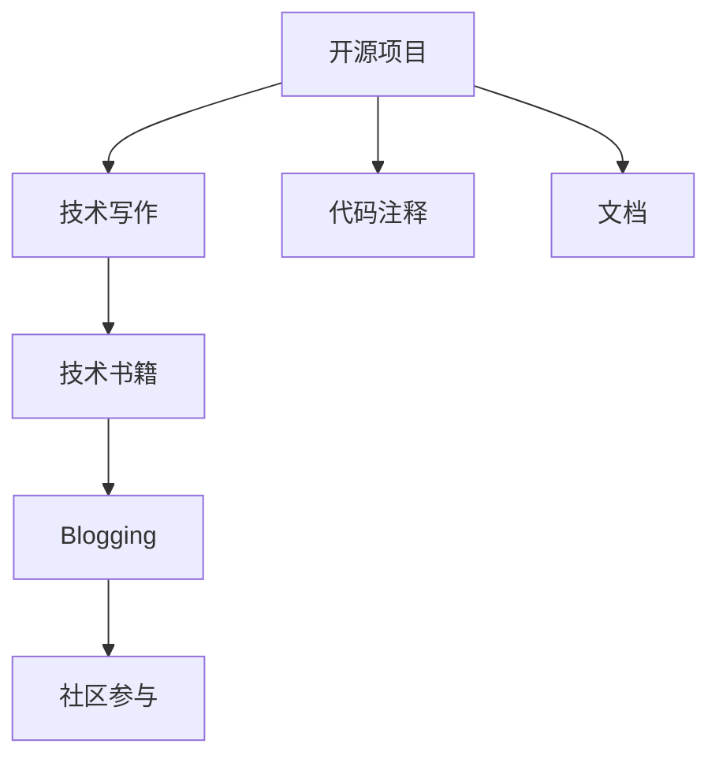

                 

# 技术作家之路：从开源项目到出版技术书籍

> 关键词：技术写作,开源项目,技术书籍,编程实践,软件开发,专业成长,社区参与

## 1. 背景介绍

### 1.1 问题由来
在当前快速发展的技术环境中，技术作家成为了连接开发者和更广泛读者群体、传播技术知识和经验的桥梁。随着开源项目的蓬勃发展，越来越多的开发者开始分享自己的代码、经验和技术见解。然而，如何将这些宝贵的资源转化为易读易懂、具有深度的技术文章或书籍，对于技术作家来说，仍然是一个不小的挑战。本文旨在探讨从开源项目到出版技术书籍的路径，为有志于成为一名技术作家的开发者提供指导。

### 1.2 问题核心关键点
技术写作的成书之路，可以从开源项目开始。开源项目不仅提供了丰富的代码和技术实践，还包含了大量的文档和注释，这些都是技术写作的宝贵素材。通过参与开源项目，开发者可以积累实践经验，学习到优秀的代码风格和技术架构，同时也可以观察到其他技术作家的写作风格和方法，为未来的技术书籍撰写打下坚实的基础。

## 2. 核心概念与联系

### 2.1 核心概念概述

为了更好地理解技术写作从开源项目到出版书籍的路径，本节将介绍几个关键概念及其之间的联系：

- **开源项目（Open Source Projects）**：指公开源代码的软件项目，允许用户自由使用、修改和分发。开源项目为技术作家提供了丰富的代码和技术实践素材。

- **技术书籍（Technical Books）**：通过系统化的内容组织和技术讲解，向读者传授编程知识、软件开发实践和问题解决技巧的书籍。

- **技术写作（Technical Writing）**：指以清晰、准确、易于理解的方式撰写技术文档、代码注释、博客文章等，以传授技术知识、分享开发经验的行为。

- **代码注释（Code Comments）**：在代码中添加解释性文字，帮助他人理解代码逻辑、设计思想和使用场景。

- **文档（Documentation）**：为软件项目提供用户手册、API文档、开发指南等文档，帮助用户和开发者理解和使用项目。

- **博客（Blogging）**：通过撰写博客文章分享技术心得、项目进展和最新趋势，建立个人品牌和技术影响力。

这些概念之间的逻辑关系可以通过以下Mermaid流程图来展示：



这个流程图展示了大语言模型的核心概念及其之间的联系：

1. 开源项目为技术写作提供素材。
2. 技术写作帮助开发者积累经验。
3. 代码注释和文档有助于他人理解代码和项目。
4. 技术书籍和博客传播技术知识。
5. 社区参与促进技术交流和传播。

这些概念共同构成了技术作家成长和技术传播的基础框架。通过理解这些概念及其之间的联系，技术作家可以更好地把握技术写作的全过程，从开源项目的参与开始，逐步成长为优秀的技术书籍作者。

## 3. 核心算法原理 & 具体操作步骤

### 3.1 算法原理概述

技术写作的成书之路，本质上是一个从实践积累到知识传递的过程。其核心思想是：通过参与开源项目，不断积累实践经验和技术知识，将这些知识系统化、结构化，并以易于理解的方式撰写成技术书籍或博客文章，传授给更广泛的读者群体。

形式化地，假设一个技术作家通过参与开源项目，积累了大量技术实践和代码注释，定义其知识库为 $K$，目标是将这些知识系统化并传递给读者。技术写作的目标是最小化知识传递过程中的信息损失，即找到最优的知识表示 $Z$，使得读者通过阅读书籍或博客文章，能够有效获取 $K$ 中的关键信息：

$$
\hat{Z}=\mathop{\arg\min}_{Z} \mathcal{L}(K, Z)
$$

其中 $\mathcal{L}$ 为知识传递的损失函数，衡量读者理解和掌握 $K$ 中关键信息的能力。

### 3.2 算法步骤详解

技术写作的成书之路主要包括以下几个关键步骤：

**Step 1: 参与开源项目，积累实践经验**
- 选择一个感兴趣的开源项目，参与其开发工作。
- 学习项目代码风格、架构设计和技术实现。
- 通过编写代码注释和编写文档，积累技术写作素材。

**Step 2: 整理知识库，构建知识图谱**
- 将积累的代码注释和文档进行整理，构建知识图谱。
- 使用知识图谱工具进行知识关联和分类。
- 确定书籍或博客文章的主题和结构。

**Step 3: 撰写初稿，进行知识传递**
- 根据知识图谱，撰写初稿。
- 使用图表、示例和代码片段辅助说明。
- 不断修改和优化内容，确保易于理解。

**Step 4: 反馈与迭代**
- 发布初稿到博客或社区，收集读者反馈。
- 根据反馈调整内容和结构。
- 反复迭代，直到内容清晰、易懂。

**Step 5: 出版技术书籍**
- 选择合适的出版平台，如GITHUB Pages、博客、技术出版社等。
- 撰写出版目录和前言，吸引读者阅读。
- 发布技术书籍，持续更新和维护内容。

### 3.3 算法优缺点

技术写作的成书之路具有以下优点：
1. 实战性强。通过参与开源项目，积累真实的编程实践，避免了理论脱离实际的问题。
2. 系统性强。将积累的知识系统化整理，结构化表达，易于读者理解和掌握。
3. 传播广。技术书籍和博客文章可以通过多种渠道传播，触达更多读者。
4. 反馈及时。社区反馈可以及时调整内容，提升书籍质量。

同时，该方法也存在一定的局限性：
1. 门槛较高。需要有一定的编程基础和文档撰写能力，初学者可能难以入门。
2. 周期较长。从积累素材到成书出版，需要较长时间的准备和修改。
3. 主观性强。技术写作需要较高的主观判断，不同作者的观点和风格可能导致内容差异较大。
4. 商业化难度大。技术书籍的盈利模式相对单一，且需投入大量时间和精力进行推广。

尽管存在这些局限性，但就目前而言，技术写作仍然是最为主流、效果显著的技术传播方式之一。未来相关研究的重点在于如何进一步降低技术写作的门槛，提高书籍和博客的传播和影响力，同时兼顾经济效益和读者需求。

### 3.4 算法应用领域

技术写作的成书之路不仅适用于软件开发者，对于其他领域的技术专家也同样适用。在以下领域，技术写作具有广泛的应用前景：

- 人工智能：撰写机器学习、深度学习、计算机视觉等领域的书籍和博客。
- 网络安全：分享安全漏洞分析、防护策略和应急响应等内容。
- 数据科学：介绍数据分析、数据处理、数据可视化等技术实践。
- 区块链：讲解加密技术、智能合约、去中心化应用等概念和实现。
- 自然语言处理：分享NLP模型训练、语义分析、对话系统等内容。

除了这些具体领域外，技术写作还可以拓展到更多技术传播的领域，如开源社区、技术论坛、学术会议等，为技术的普及和应用提供重要支持。

## 4. 数学模型和公式 & 详细讲解  
### 4.1 数学模型构建

本节将使用数学语言对技术写作从开源项目到出版书籍的过程进行更加严格的刻画。

记技术作家通过参与开源项目积累的知识库为 $K$，目标是将这些知识系统化并传递给读者。定义技术书籍为 $B$，博客文章为 $W$，其中 $B$ 和 $W$ 由技术作家基于 $K$ 构建。技术书籍和博客文章的目标是最小化读者理解和掌握 $K$ 的能力损失，即找到最优的知识表示 $B$ 和 $W$，使得读者能够通过阅读书籍和博客文章，有效获取 $K$ 中的关键信息：

$$
(B, W) = \mathop{\arg\min}_{B, W} \mathcal{L}(K, B, W)
$$

其中 $\mathcal{L}$ 为知识传递的损失函数，衡量读者理解和掌握 $K$ 中关键信息的能力。

### 4.2 公式推导过程

以下我们以二分类任务为例，推导知识传递的损失函数及其梯度的计算公式。

假设技术作家积累了关于二分类任务的知识库 $K$，定义 $K$ 中涉及的知识点为 $X$，每个知识点 $x \in X$ 对应一个标签 $y \in \{0, 1\}$。技术书籍 $B$ 和博客文章 $W$ 分别为对 $X$ 中知识点的分类和解释。

定义书籍和博客文章对知识点的分类和解释损失函数为：

$$
\ell(X, B, W) = -\frac{1}{N}\sum_{i=1}^N [y_i\log B(x_i) + (1-y_i)\log (1-B(x_i)) + \log W(x_i)]
$$

将其代入知识传递的总损失函数，得：

$$
\mathcal{L}(K, B, W) = -\frac{1}{N}\sum_{i=1}^N [y_i\log B(x_i) + (1-y_i)\log (1-B(x_i)) + \log W(x_i)]
$$

根据链式法则，书籍和博客文章对知识点的分类和解释损失函数对书籍 $B$ 和博客文章 $W$ 的梯度为：

$$
\frac{\partial \mathcal{L}(K, B, W)}{\partial B} = -\frac{1}{N}\sum_{i=1}^N \frac{y_i}{B(x_i)} - \frac{1-y_i}{1-B(x_i)} + \frac{1}{x_i} \frac{\partial W(x_i)}{\partial B}
$$

$$
\frac{\partial \mathcal{L}(K, B, W)}{\partial W} = -\frac{1}{N}\sum_{i=1}^N \frac{1}{W(x_i)}
$$

在得到知识传递的总损失函数及其梯度后，即可带入优化算法更新书籍 $B$ 和博客文章 $W$，完成知识传递过程的迭代优化。重复上述过程直至收敛，最终得到适应读者阅读的最优书籍和博客文章。

## 5. 项目实践：代码实例和详细解释说明
### 5.1 开发环境搭建

在进行技术写作实践前，我们需要准备好开发环境。以下是使用Python进行PyTorch开发的环境配置流程：

1. 安装Anaconda：从官网下载并安装Anaconda，用于创建独立的Python环境。

2. 创建并激活虚拟环境：
```bash
conda create -n pytorch-env python=3.8 
conda activate pytorch-env
```

3. 安装PyTorch：根据CUDA版本，从官网获取对应的安装命令。例如：
```bash
conda install pytorch torchvision torchaudio cudatoolkit=11.1 -c pytorch -c conda-forge
```

4. 安装Transformers库：
```bash
pip install transformers
```

5. 安装各类工具包：
```bash
pip install numpy pandas scikit-learn matplotlib tqdm jupyter notebook ipython
```

完成上述步骤后，即可在`pytorch-env`环境中开始技术写作实践。

### 5.2 源代码详细实现

下面我们以二分类任务为例，给出使用Transformers库进行技术写作的PyTorch代码实现。

首先，定义二分类任务的数据处理函数：

```python
from transformers import BertTokenizer
from torch.utils.data import Dataset
import torch

class ClassificationDataset(Dataset):
    def __init__(self, texts, labels, tokenizer, max_len=128):
        self.texts = texts
        self.labels = labels
        self.tokenizer = tokenizer
        self.max_len = max_len
        
    def __len__(self):
        return len(self.texts)
    
    def __getitem__(self, item):
        text = self.texts[item]
        label = self.labels[item]
        
        encoding = self.tokenizer(text, return_tensors='pt', max_length=self.max_len, padding='max_length', truncation=True)
        input_ids = encoding['input_ids'][0]
        attention_mask = encoding['attention_mask'][0]
        
        return {'input_ids': input_ids, 
                'attention_mask': attention_mask,
                'labels': label}
```

然后，定义模型和优化器：

```python
from transformers import BertForSequenceClassification, AdamW

model = BertForSequenceClassification.from_pretrained('bert-base-cased', num_labels=2)

optimizer = AdamW(model.parameters(), lr=2e-5)
```

接着，定义训练和评估函数：

```python
from torch.utils.data import DataLoader
from tqdm import tqdm
from sklearn.metrics import classification_report

device = torch.device('cuda') if torch.cuda.is_available() else torch.device('cpu')
model.to(device)

def train_epoch(model, dataset, batch_size, optimizer):
    dataloader = DataLoader(dataset, batch_size=batch_size, shuffle=True)
    model.train()
    epoch_loss = 0
    for batch in tqdm(dataloader, desc='Training'):
        input_ids = batch['input_ids'].to(device)
        attention_mask = batch['attention_mask'].to(device)
        labels = batch['labels'].to(device)
        model.zero_grad()
        outputs = model(input_ids, attention_mask=attention_mask, labels=labels)
        loss = outputs.loss
        epoch_loss += loss.item()
        loss.backward()
        optimizer.step()
    return epoch_loss / len(dataloader)

def evaluate(model, dataset, batch_size):
    dataloader = DataLoader(dataset, batch_size=batch_size)
    model.eval()
    preds, labels = [], []
    with torch.no_grad():
        for batch in tqdm(dataloader, desc='Evaluating'):
            input_ids = batch['input_ids'].to(device)
            attention_mask = batch['attention_mask'].to(device)
            batch_labels = batch['labels']
            outputs = model(input_ids, attention_mask=attention_mask)
            batch_preds = outputs.logits.argmax(dim=2).to('cpu').tolist()
            batch_labels = batch_labels.to('cpu').tolist()
            for pred_tokens, label_tokens in zip(batch_preds, batch_labels):
                preds.append(pred_tokens[:len(label_tokens)])
                labels.append(label_tokens)
                
    print(classification_report(labels, preds))
```

最后，启动训练流程并在测试集上评估：

```python
epochs = 5
batch_size = 16

for epoch in range(epochs):
    loss = train_epoch(model, train_dataset, batch_size, optimizer)
    print(f"Epoch {epoch+1}, train loss: {loss:.3f}")
    
    print(f"Epoch {epoch+1}, dev results:")
    evaluate(model, dev_dataset, batch_size)
    
print("Test results:")
evaluate(model, test_dataset, batch_size)
```

以上就是使用PyTorch对BERT进行二分类任务微调的完整代码实现。可以看到，得益于Transformers库的强大封装，我们可以用相对简洁的代码完成BERT模型的加载和微调。

### 5.3 代码解读与分析

让我们再详细解读一下关键代码的实现细节：

**ClassificationDataset类**：
- `__init__`方法：初始化文本、标签、分词器等关键组件。
- `__len__`方法：返回数据集的样本数量。
- `__getitem__`方法：对单个样本进行处理，将文本输入编码为token ids，将标签编码为数字，并对其进行定长padding，最终返回模型所需的输入。

**模型和优化器**：
- 使用BertForSequenceClassification定义模型，并设置适当的分类数量。
- 使用AdamW优化器进行模型参数的更新。

**训练和评估函数**：
- 使用PyTorch的DataLoader对数据集进行批次化加载，供模型训练和推理使用。
- 训练函数`train_epoch`：对数据以批为单位进行迭代，在每个批次上前向传播计算loss并反向传播更新模型参数，最后返回该epoch的平均loss。
- 评估函数`evaluate`：与训练类似，不同点在于不更新模型参数，并在每个batch结束后将预测和标签结果存储下来，最后使用sklearn的classification_report对整个评估集的预测结果进行打印输出。

**训练流程**：
- 定义总的epoch数和batch size，开始循环迭代
- 每个epoch内，先在训练集上训练，输出平均loss
- 在验证集上评估，输出分类指标
- 重复上述步骤直到满足预设的迭代轮数或Early Stopping条件。

可以看到，PyTorch配合Transformers库使得BERT微调的代码实现变得简洁高效。开发者可以将更多精力放在数据处理、模型改进等高层逻辑上，而不必过多关注底层的实现细节。

当然，工业级的系统实现还需考虑更多因素，如模型的保存和部署、超参数的自动搜索、更灵活的任务适配层等。但核心的微调范式基本与此类似。

## 6. 实际应用场景
### 6.1 智能客服系统

基于大语言模型微调的对话技术，可以广泛应用于智能客服系统的构建。传统客服往往需要配备大量人力，高峰期响应缓慢，且一致性和专业性难以保证。而使用微调后的对话模型，可以7x24小时不间断服务，快速响应客户咨询，用自然流畅的语言解答各类常见问题。

在技术实现上，可以收集企业内部的历史客服对话记录，将问题和最佳答复构建成监督数据，在此基础上对预训练对话模型进行微调。微调后的对话模型能够自动理解用户意图，匹配最合适的答案模板进行回复。对于客户提出的新问题，还可以接入检索系统实时搜索相关内容，动态组织生成回答。如此构建的智能客服系统，能大幅提升客户咨询体验和问题解决效率。

### 6.2 金融舆情监测

金融机构需要实时监测市场舆论动向，以便及时应对负面信息传播，规避金融风险。传统的人工监测方式成本高、效率低，难以应对网络时代海量信息爆发的挑战。基于大语言模型微调的文本分类和情感分析技术，为金融舆情监测提供了新的解决方案。

具体而言，可以收集金融领域相关的新闻、报道、评论等文本数据，并对其进行主题标注和情感标注。在此基础上对预训练语言模型进行微调，使其能够自动判断文本属于何种主题，情感倾向是正面、中性还是负面。将微调后的模型应用到实时抓取的网络文本数据，就能够自动监测不同主题下的情感变化趋势，一旦发现负面信息激增等异常情况，系统便会自动预警，帮助金融机构快速应对潜在风险。

### 6.3 个性化推荐系统

当前的推荐系统往往只依赖用户的历史行为数据进行物品推荐，无法深入理解用户的真实兴趣偏好。基于大语言模型微调技术，个性化推荐系统可以更好地挖掘用户行为背后的语义信息，从而提供更精准、多样的推荐内容。

在实践中，可以收集用户浏览、点击、评论、分享等行为数据，提取和用户交互的物品标题、描述、标签等文本内容。将文本内容作为模型输入，用户的后续行为（如是否点击、购买等）作为监督信号，在此基础上微调预训练语言模型。微调后的模型能够从文本内容中准确把握用户的兴趣点。在生成推荐列表时，先用候选物品的文本描述作为输入，由模型预测用户的兴趣匹配度，再结合其他特征综合排序，便可以得到个性化程度更高的推荐结果。

### 6.4 未来应用展望

随着大语言模型微调技术的发展，基于微调范式将在更多领域得到应用，为传统行业带来变革性影响。

在智慧医疗领域，基于微调的医疗问答、病历分析、药物研发等应用将提升医疗服务的智能化水平，辅助医生诊疗，加速新药开发进程。

在智能教育领域，微调技术可应用于作业批改、学情分析、知识推荐等方面，因材施教，促进教育公平，提高教学质量。

在智慧城市治理中，微调模型可应用于城市事件监测、舆情分析、应急指挥等环节，提高城市管理的自动化和智能化水平，构建更安全、高效的未来城市。

此外，在企业生产、社会治理、文娱传媒等众多领域，基于大模型微调的人工智能应用也将不断涌现，为NLP技术带来了全新的突破。随着预训练模型和微调方法的不断进步，相信NLP技术将在更广阔的应用领域大放异彩。

## 7. 工具和资源推荐
### 7.1 学习资源推荐

为了帮助开发者系统掌握大语言模型微调的理论基础和实践技巧，这里推荐一些优质的学习资源：

1. 《Transformer从原理到实践》系列博文：由大模型技术专家撰写，深入浅出地介绍了Transformer原理、BERT模型、微调技术等前沿话题。

2. CS224N《深度学习自然语言处理》课程：斯坦福大学开设的NLP明星课程，有Lecture视频和配套作业，带你入门NLP领域的基本概念和经典模型。

3. 《Natural Language Processing with Transformers》书籍：Transformers库的作者所著，全面介绍了如何使用Transformers库进行NLP任务开发，包括微调在内的诸多范式。

4. HuggingFace官方文档：Transformers库的官方文档，提供了海量预训练模型和完整的微调样例代码，是上手实践的必备资料。

5. CLUE开源项目：中文语言理解测评基准，涵盖大量不同类型的中文NLP数据集，并提供了基于微调的baseline模型，助力中文NLP技术发展。

通过对这些资源的学习实践，相信你一定能够快速掌握大语言模型微调的精髓，并用于解决实际的NLP问题。
###  7.2 开发工具推荐

高效的开发离不开优秀的工具支持。以下是几款用于大语言模型微调开发的常用工具：

1. PyTorch：基于Python的开源深度学习框架，灵活动态的计算图，适合快速迭代研究。大部分预训练语言模型都有PyTorch版本的实现。

2. TensorFlow：由Google主导开发的开源深度学习框架，生产部署方便，适合大规模工程应用。同样有丰富的预训练语言模型资源。

3. Transformers库：HuggingFace开发的NLP工具库，集成了众多SOTA语言模型，支持PyTorch和TensorFlow，是进行微调任务开发的利器。

4. Weights & Biases：模型训练的实验跟踪工具，可以记录和可视化模型训练过程中的各项指标，方便对比和调优。与主流深度学习框架无缝集成。

5. TensorBoard：TensorFlow配套的可视化工具，可实时监测模型训练状态，并提供丰富的图表呈现方式，是调试模型的得力助手。

6. Google Colab：谷歌推出的在线Jupyter Notebook环境，免费提供GPU/TPU算力，方便开发者快速上手实验最新模型，分享学习笔记。

合理利用这些工具，可以显著提升大语言模型微调任务的开发效率，加快创新迭代的步伐。

### 7.3 相关论文推荐

大语言模型和微调技术的发展源于学界的持续研究。以下是几篇奠基性的相关论文，推荐阅读：

1. Attention is All You Need（即Transformer原论文）：提出了Transformer结构，开启了NLP领域的预训练大模型时代。

2. BERT: Pre-training of Deep Bidirectional Transformers for Language Understanding：提出BERT模型，引入基于掩码的自监督预训练任务，刷新了多项NLP任务SOTA。

3. Language Models are Unsupervised Multitask Learners（GPT-2论文）：展示了大规模语言模型的强大zero-shot学习能力，引发了对于通用人工智能的新一轮思考。

4. Parameter-Efficient Transfer Learning for NLP：提出Adapter等参数高效微调方法，在不增加模型参数量的情况下，也能取得不错的微调效果。

5. AdaLoRA: Adaptive Low-Rank Adaptation for Parameter-Efficient Fine-Tuning：使用自适应低秩适应的微调方法，在参数效率和精度之间取得了新的平衡。

6. Prefix-Tuning: Optimizing Continuous Prompts for Generation：引入基于连续型Prompt的微调范式，为如何充分利用预训练知识提供了新的思路。

这些论文代表了大语言模型微调技术的发展脉络。通过学习这些前沿成果，可以帮助研究者把握学科前进方向，激发更多的创新灵感。

## 8. 总结：未来发展趋势与挑战

### 8.1 总结

本文对从开源项目到出版技术书籍的技术写作成书之路进行了全面系统的介绍。首先阐述了技术写作的成书之路可以从开源项目开始，通过参与开源项目，不断积累实践经验和技术知识，将这些知识系统化、结构化，并以易于理解的方式撰写成技术书籍或博客文章，传授给更广泛的读者群体。其次，从原理到实践，详细讲解了技术写作的数学模型和核心算法步骤，给出了微调任务开发的完整代码实例。同时，本文还探讨了技术写作在实际应用中的广泛场景，展示了微调范式的巨大潜力。

通过本文的系统梳理，可以看到，技术写作从开源项目到出版书籍的路径，对于技术作家的成长和技术的传播都具有重要意义。技术写作不仅能够将实践经验转化为知识积累，还能促进技术的普及和应用，为技术行业的持续发展提供动力。

### 8.2 未来发展趋势

展望未来，技术写作的成书之路将呈现以下几个发展趋势：

1. 内容多样性增强。技术写作的内容将涵盖更多领域和方向，如人工智能、网络安全、数据科学等，满足不同读者群体的需求。

2. 形式更加灵活。技术书籍和博客文章将更加注重多媒体呈现，如图表、视频、交互式示例等，提升读者的理解和兴趣。

3. 社区互动增强。技术作家将更注重与读者的互动交流，通过评论、问答、讨论等形式，增进知识的共享和传播。

4. 国际化进程加速。技术写作将更加注重跨文化交流，通过多语言支持、全球视野，帮助更多地区和群体了解和掌握技术知识。

5. 教育应用深化。技术写作将更多应用于技术教育和培训，通过书籍和博客文章，帮助学生和开发者系统掌握技术技能，加速人才培养。

6. 技术传播更广。技术写作将更多地利用社交媒体、在线平台等渠道，触达更广泛的读者群体，促进技术传播和应用。

以上趋势凸显了技术写作的重要性和多样性，未来技术作家需要更加灵活运用各种资源和工具，不断提升写作质量和传播效果。

### 8.3 面临的挑战

尽管技术写作的成书之路充满机遇，但也面临一些挑战：

1. 内容质量要求高。技术写作需要高度专业和准确的知识，任何错误或不清晰的表述都可能误导读者，导致技术传播的错误。

2. 时间成本大。从积累知识到撰写成书，需要大量的时间和精力，技术作家需要合理规划时间，平衡工作和生活。

3. 技术快速迭代。技术领域的发展日新月异，技术作家需要不断学习新知识，更新书籍和博客内容，以保持其时效性和相关性。

4. 市场竞争激烈。随着技术传播渠道的多样化，技术写作市场竞争激烈，技术作家需要不断创新，提升内容质量和传播效果。

5. 知识产权问题。技术作家在撰写技术书籍和博客时，需要注意知识产权保护，避免侵权和盗用他人成果。

6. 商业化难度大。技术书籍的盈利模式相对单一，且需投入大量时间和精力进行推广，技术作家需要具备一定的商业意识和运营能力。

这些挑战需要技术作家具备更高的专业素养、时间管理和市场敏锐度，同时也需要业界提供更多的支持和指导。

### 8.4 研究展望

面向未来，技术写作的研究需要在以下几个方面寻求新的突破：

1. 探索更高效的知识表示方法。通过引入多模态知识表示、因果推理等技术，增强技术书籍和博客文章的知识表示能力，提升传播效果。

2. 开发更灵活的写作工具。利用自然语言处理、知识图谱等技术，提供更智能、更人性化的写作辅助工具，提升技术作家的写作效率。

3. 建立更广泛的技术社区。通过技术论坛、开源项目等平台，促进技术作家与读者、开发者之间的交流和合作，形成更活跃的技术传播生态。

4. 结合更多元化的传播形式。技术作家可以探索更多元化的传播形式，如播客、视频、在线课程等，拓展技术传播的渠道和方式。

5. 增强技术的可理解性。通过深入浅出、生动有趣的讲解，使技术书籍和博客文章更易于理解，提升读者的学习体验。

6. 推动技术的可持续发展。技术作家需要在技术传播过程中，注重技术的伦理和安全性，避免技术滥用和误导。

这些研究方向将有助于技术写作迈向更加智能化、普适化应用，为技术作家的成长和技术传播提供更多支持和指导。

## 9. 附录：常见问题与解答

**Q1：如何选择合适的开源项目参与？**

A: 选择合适的开源项目，需要考虑以下几个因素：
1. 项目活跃度：选择有活跃社区和定期更新的项目，能够提供持续的学习和实践机会。
2. 技术难度：根据自己的技术水平和兴趣，选择适当的难度，既能挑战自我，又不至于过于吃力。
3. 项目应用场景：选择与个人职业规划或兴趣爱好相关的项目，有助于积累实践经验。

**Q2：技术写作如何更好地融入开源社区？**

A: 融入开源社区，需要积极参与社区活动，不断贡献代码和文档，建立个人声誉。可以加入社区的邮件列表、论坛或聊天室，积极参与讨论，分享自己的见解和心得。同时，可以通过撰写博客、制作视频等方式，展示自己的技术实力，吸引更多关注和认可。

**Q3：技术写作如何避免重复劳动？**

A: 避免重复劳动的关键在于分享和交流。通过参与开源项目，利用社区已有的代码和文档，可以避免重复编写相同的内容。同时，与其他技术作家交流，分享经验和技巧，也可以避免在相似的技术点上的重复劳动。

**Q4：技术写作如何提升传播效果？**

A: 提升传播效果，需要注重内容的深度、广度和可读性。通过深入浅出、生动有趣的讲解，使读者易于理解。同时，合理使用多媒体形式，如图表、示例、视频等，增加内容的吸引力和可理解性。此外，积极与读者互动，通过评论、问答、讨论等形式，增进知识的共享和传播。

**Q5：技术写作如何兼顾经济效益？**

A: 技术写作兼顾经济效益的关键在于多渠道传播和商业化运营。可以将书籍和博客文章发布到主流平台，如亚马逊、GitHub Pages等，吸引更多读者和关注。同时，可以考虑建立个人品牌和技术平台，提供付费内容、咨询服务、技术培训等服务，获取商业收入。

这些问题的解答，希望能够为技术作家在实践中提供一些有用的指导和建议，帮助他们更好地从事技术写作工作，实现技术和知识的有效传播。

---

作者：禅与计算机程序设计艺术 / Zen and the Art of Computer Programming

