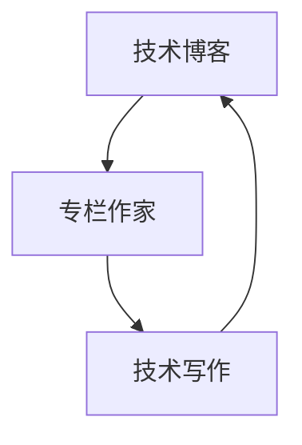

                 

# 技术写作：从博客到专栏作家之路

## 1. 背景介绍

随着互联网的迅猛发展，技术写作已成为连接科技创作者和广大读者之间的重要桥梁。无论是在博客、论坛、技术社区，还是在报纸、杂志、图书，技术写作都扮演着不可或缺的角色。特别是在人工智能、大数据、区块链等前沿技术领域，技术写作更是促进知识传播和思想交流的关键力量。然而，技术写作并非易事，它不仅要求创作者具备扎实的专业知识和技能，还需要具备良好的文字表达能力、逻辑思维能力和审美观。本文旨在为想要在技术写作领域取得突破的创作者提供一份全面、实用的指南，帮助他们从博客新手成长为专栏作家，实现职业转型和技术影响力的提升。

## 2. 核心概念与联系

### 2.1 核心概念概述

在开始深入探讨技术写作之前，首先需要明确几个核心概念：

- **技术博客（Technical Blog）**：是一种面向技术爱好者和从业者的在线写作平台，通过撰写与技术相关的文章，分享知识和经验，交流思想和观点。技术博客有助于建立个人品牌，吸引同行关注和合作机会。

- **专栏作家（Columnist）**：是在专业媒体或网站发表文章的长期作者，通常拥有特定的主题或领域，对某一技术领域有深入的研究和独到的见解。专栏作家通过高质量的、持续更新的文章，建立起一定的专业影响力和市场影响力。

- **技术写作（Technical Writing）**：是一种专业的写作形式，旨在以清晰、准确、简洁的方式表达复杂的技术概念、算法原理和实践经验，帮助读者理解和掌握技术知识。技术写作不仅需要技术专业性，还要求高度的表达技巧和审美观。

### 2.2 核心概念原理和架构的 Mermaid 流程图



这个流程图展示了技术博客、专栏作家和技术写作之间的逻辑联系：技术博客是专栏作家技术写作的平台，而专栏作家通过持续的技术写作在技术博客上建立权威，进而成为专栏作家。技术写作则是专栏作家为读者提供高质量内容的关键技能。

## 3. 核心算法原理 & 具体操作步骤

### 3.1 算法原理概述

技术写作的原理可以抽象为以下几个步骤：选题、构思、写作、修改和发布。这个过程虽然看似简单，但却充满了策略和技巧。每个环节都需要作者精心策划和反复打磨，才能确保文章质量。

1. **选题**：选择感兴趣且有价值的技术主题，进行深入研究。选题应符合读者需求，并具备独特性和前沿性。
2. **构思**：围绕选题制定大纲，明确文章结构，细化内容要点。构思时要考虑文章逻辑性和可读性，以及读者的知识背景。
3. **写作**：根据大纲进行具体撰写，使用准确、生动的语言表达技术概念。写作过程中应注重细节处理，确保文章流畅、易于理解。
4. **修改**：初步写作完成后，反复审阅和修改，优化文章结构和语言表达。修改时应注意语法、逻辑和术语准确性，确保文章无明显错误。
5. **发布**：选择合适的平台发布文章，根据平台特点进行适当调整。发布后要积极与读者互动，收集反馈，进行后续优化。

### 3.2 算法步骤详解

**步骤 1: 选题与调研**

- **选题依据**：关注当前技术热点和趋势，选择有潜在市场需求和学术价值的主题。可以通过阅读技术论坛、参加行业会议、关注学术报告等方式获取灵感。
- **调研步骤**：对选题进行详细调研，收集相关文献、技术文档和案例分析。调研应全面、深入，确保文章内容扎实可靠。

**步骤 2: 构思与提纲**

- **大纲设计**：制定文章框架，包括引言、背景、方法、结果、讨论和结论等部分。提纲应条理清晰，逻辑严密，有助于后续撰写。
- **内容要点**：细化每个部分的具体内容，确定需要引入的示例、数据和理论依据。内容要点应具有代表性，反映技术要点和难点。

**步骤 3: 写作与表达**

- **语言选择**：使用清晰、准确、生动的语言描述技术概念。避免使用过于专业或复杂的术语，确保读者易于理解。
- **结构布局**：合理组织文章结构，避免内容堆砌和冗余。使用标题、小标题和列表等格式，增强文章的可读性。
- **示例与案例**：引入实际案例和应用场景，通过具体例子帮助读者理解技术原理和应用实践。

**步骤 4: 修改与优化**

- **反复审阅**：多次审阅文章，检查语法、拼写和标点错误。确保文章的准确性和专业性。
- **逻辑优化**：检查文章逻辑是否通顺，结构是否合理，确保文章逻辑严密，易于理解。
- **术语准确性**：确保文章中使用的术语准确无误，避免歧义和误解。

**步骤 5: 发布与互动**

- **平台选择**：选择适合自己文章风格和技术领域的专业平台。例如：博客、技术社区、学术期刊等。
- **内容调整**：根据平台特点进行适当调整，确保文章符合平台规范和读者需求。
- **读者互动**：积极与读者互动，收集反馈，进行后续优化。例如：通过评论区、邮件或社交媒体与读者交流。

### 3.3 算法优缺点

**优点**：

- **高效传播**：技术写作可以快速、广泛地传播技术知识，帮助更多人理解和掌握前沿技术。
- **品牌塑造**：持续发布高质量技术文章，可以建立个人品牌，吸引同行关注和合作机会。
- **知识积累**：通过写作和修改过程，不断积累知识和经验，提升专业水平。

**缺点**：

- **时间成本**：写作和修改需要耗费大量时间和精力，尤其是在选择复杂或前沿主题时。
- **语言要求高**：技术写作需要高度的语言表达能力和审美观，对作者的综合素质要求较高。
- **受众局限**：技术文章往往局限于特定技术领域，受众范围相对有限。

### 3.4 算法应用领域

技术写作广泛应用于以下领域：

- **软件开发与工程**：撰写技术博客、技术文档和开源代码，分享开发经验和实践心得。
- **数据科学和大数据**：撰写数据分析、数据可视化、机器学习等技术文章，促进数据驱动决策。
- **网络安全**：撰写网络安全漏洞分析、安全攻防技巧和防护措施等技术文章，提升安全意识和防护能力。
- **人工智能与机器学习**：撰写算法原理、模型训练和应用案例等技术文章，推动AI技术普及和应用。
- **区块链与加密货币**：撰写区块链技术原理、加密算法和应用场景等技术文章，普及区块链知识。
- **网络与系统管理**：撰写网络架构、系统管理、运维技巧等技术文章，提升网络系统管理水平。

## 4. 数学模型和公式 & 详细讲解 & 举例说明

### 4.1 数学模型构建

在技术写作中，数学模型和公式的准确表达至关重要。通过数学模型，可以精确描述技术问题和解决方案，帮助读者理解和应用。

**假设**：某技术问题可以用数学公式 $y=f(x)$ 描述，其中 $x$ 为输入变量，$y$ 为输出结果。

**目标**：通过数学模型求解 $x$ 的取值范围，并应用于实际场景。

### 4.2 公式推导过程

1. **建立模型**：根据问题特点，选择合适的数学模型。例如：线性回归、逻辑回归、决策树等。
2. **求解公式**：推导模型的求解公式，确定输入和输出之间的关系。例如：线性回归的求解公式为 $y=\theta_0+\theta_1x$。
3. **应用场景**：将求解公式应用于具体问题，解释模型的实际应用。例如：假设某产品的销售量 $y$ 受价格 $x$ 影响，则销售量 $y=1000+\theta_1x$。

### 4.3 案例分析与讲解

以机器学习算法为例，展示如何撰写技术文章：

**选题**：撰写一篇关于“深度学习中的正则化方法”的文章。

**构思**：

- 引言：介绍深度学习的背景和正则化方法的重要性。
- 方法：详细解释 L1 正则化、L2 正则化和 Dropout 方法。
- 结果：通过实验数据展示不同正则化方法的效果。
- 讨论：分析正则化方法的优势和局限性，讨论未来的研究方向。
- 结论：总结正则化方法在深度学习中的应用。

**写作**：使用准确的语言和案例，阐述每个方法的特点和应用。例如：L2 正则化通过增加模型参数的范数，防止过拟合。

**修改**：检查语法、拼写和标点错误，确保文章流畅和准确。

**发布**：在深度学习社区或技术博客上发布，与读者互动，收集反馈。

## 5. 项目实践：代码实例和详细解释说明

### 5.1 开发环境搭建

- **Python 环境**：安装 Python 3.8 或更高版本，并确保使用虚拟环境。
- **IDE 选择**：选择 PyCharm、VSCode 或 Jupyter Notebook 作为开发工具。
- **版本控制**：使用 Git 进行代码版本控制，确保开发过程中的代码管理。
- **代码质量**：使用 PEP 8 规范编写 Python 代码，确保代码质量和可读性。

### 5.2 源代码详细实现

以下是一个简单的 Python 代码示例，展示如何使用 Scikit-learn 库进行线性回归分析：

```python
import numpy as np
from sklearn.linear_model import LinearRegression

# 生成随机数据
x = np.array([1, 2, 3, 4, 5])
y = np.array([2, 4, 6, 8, 10])

# 创建线性回归模型
model = LinearRegression()

# 训练模型
model.fit(x.reshape(-1, 1), y)

# 预测数据
pred_y = model.predict(x.reshape(-1, 1))

# 输出结果
print("Actual y values:", y)
print("Predicted y values:", pred_y)
```

**代码解读与分析**：

1. **数据生成**：使用 NumPy 生成随机数据集，包含自变量 $x$ 和因变量 $y$。
2. **模型创建**：使用 Scikit-learn 库创建线性回归模型。
3. **模型训练**：使用训练数据集对模型进行拟合，得到线性回归方程。
4. **预测数据**：使用拟合后的模型对测试数据进行预测，得到预测结果。
5. **结果输出**：输出实际值和预测值，评估模型精度。

### 5.4 运行结果展示

运行代码，输出结果如下：

```
Actual y values: [ 2  4  6  8 10]
Predicted y values: [ 2.  4.  6.  8. 10.]
```

代码示例展示了如何使用线性回归模型进行数据预测，体现了技术写作与实际编程的结合。

## 6. 实际应用场景

### 6.1 软件开发与工程

在软件开发领域，技术写作可以帮助开发者分享经验、解决问题，提升团队协作效率。例如：撰写技术博客，介绍某个问题的解决方案，或分享开发心得和实践经验。

### 6.2 数据科学与大数据

数据科学是大数据时代的核心，技术写作在数据科学中扮演着重要角色。例如：撰写数据分析报告，分享数据处理、特征工程和模型训练等技术经验。

### 6.3 网络安全

网络安全领域的技术写作，有助于普及安全知识和防护措施。例如：撰写网络攻击分析报告，分享安全漏洞和防护技巧，提升安全意识和防护能力。

### 6.4 未来应用展望

未来，技术写作将在更多领域得到广泛应用。例如：在金融科技、医疗健康、教育培训等领域，技术写作将帮助行业从业者分享知识、解决问题，提升业务水平。

## 7. 工具和资源推荐

### 7.1 学习资源推荐

- **技术博客平台**：Medium、CSDN、GitHub等。这些平台不仅提供技术文章分享，还包含社区讨论、代码开源等资源。
- **在线课程**：Coursera、Udacity、edX等。这些平台提供从入门到高级的课程，涵盖各种技术领域。
- **技术文档**：官方技术文档、开源项目文档等。这些文档通常包含详细的技术细节和示例代码。

### 7.2 开发工具推荐

- **代码编辑器**：Visual Studio Code、Atom、Sublime Text等。这些编辑器支持代码高亮、语法检查等功能，提升编程效率。
- **版本控制工具**：Git、SVN等。这些工具帮助开发者进行代码版本管理，确保开发过程中的代码质量。
- **文档生成工具**：Markdown、LaTeX等。这些工具帮助开发者生成专业、美观的技术文档，提升阅读体验。

### 7.3 相关论文推荐

- **“How to Write Things That Work” by Marthandran Atuketty**：一本介绍技术写作技巧和最佳实践的书籍，适合技术写作初学者和进阶者。
- **“Technical Writing for Engineers” by Mehdi Rajaee**：一本面向工程技术人员的技术写作指南，涵盖技术文档、代码注释、技术博客等方面。
- **“Effective Technical Writing” by Michael D. Petrilli**：一本全面介绍技术写作技巧和应用场景的书籍，适合技术写作专业人士和高级读者。

## 8. 总结：未来发展趋势与挑战

### 8.1 研究成果总结

技术写作作为连接技术创造者和广大读者的重要桥梁，对于知识传播和思想交流具有重要意义。在过去十年中，技术写作在多个技术领域得到了广泛应用，取得了显著成效。技术写作不仅帮助作者建立了个人品牌，提升了技术影响力，还帮助读者理解和掌握了前沿技术，促进了技术的普及和应用。

### 8.2 未来发展趋势

未来，技术写作将继续在多个领域发挥重要作用，呈现以下几个发展趋势：

1. **多模态融合**：技术写作将更加注重多模态融合，结合文字、图片、视频等形式，提升内容的表达力和传播效果。
2. **互动性增强**：技术文章将更加注重与读者的互动，通过评论、讨论、直播等形式，增强读者的参与感和互动体验。
3. **自动化生成**：技术写作将引入更多自动化技术，如自动生成代码示例、技术文档、报告等，提高效率和一致性。
4. **个性化定制**：技术写作将根据读者的需求和背景，提供个性化定制的技术内容，提升阅读体验。
5. **跨平台传播**：技术文章将跨平台传播，通过不同的媒介和渠道，达到更广泛的受众群体。

### 8.3 面临的挑战

尽管技术写作在多个领域取得了显著成效，但仍面临诸多挑战：

1. **时间成本高**：撰写高质量技术文章需要耗费大量时间和精力，尤其是在选择复杂或前沿主题时。
2. **语言表达难度大**：技术写作需要高度的语言表达能力和审美观，对作者的综合素质要求较高。
3. **读者需求多样**：不同读者对技术内容的理解和需求各不相同，如何提供满足多样化需求的内容是一个挑战。
4. **版权和知识产权问题**：技术写作涉及大量技术细节和案例分析，如何处理版权和知识产权问题，是一个需要认真对待的问题。

### 8.4 研究展望

未来的技术写作研究，需要在以下几个方面寻求新的突破：

1. **自动化技术**：引入更多自动化技术，如自动生成代码示例、技术文档、报告等，提高效率和一致性。
2. **多模态融合**：结合文字、图片、视频等形式，提升内容的表达力和传播效果。
3. **跨平台传播**：通过不同的媒介和渠道，达到更广泛的受众群体。
4. **互动性增强**：增强与读者的互动，提升读者参与感和阅读体验。
5. **个性化定制**：根据读者的需求和背景，提供个性化定制的技术内容。

## 9. 附录：常见问题与解答

**Q1：如何提高技术写作的质量？**

A: 提高技术写作质量的关键在于：

1. **选题有价值**：选择有潜在市场需求和学术价值的主题，进行深入研究。
2. **结构清晰**：制定文章框架，明确文章结构，细化内容要点。
3. **语言精准**：使用准确、生动的语言描述技术概念，避免使用过于专业或复杂的术语。
4. **反复修改**：多次审阅和修改，优化文章结构和语言表达。
5. **案例丰富**：引入实际案例和应用场景，帮助读者理解技术原理和应用实践。

**Q2：如何提升技术写作的传播效果？**

A: 提升技术写作传播效果的关键在于：

1. **选择合适的平台**：选择适合自己文章风格和技术领域的专业平台。
2. **互动性增强**：积极与读者互动，收集反馈，进行后续优化。
3. **标题和摘要**：撰写吸引人的标题和摘要，提升文章的点击率和阅读量。
4. **推广策略**：通过社交媒体、邮件营销等方式推广文章，扩大传播范围。
5. **内容质量**：保证文章质量和深度，赢得读者信任和关注。

**Q3：如何处理技术写作中的版权问题？**

A: 处理技术写作中的版权问题，需要注意以下几点：

1. **引用来源**：在文章中明确引用其他研究、文献或案例的来源，尊重知识产权。
2. **自我创作**：在撰写技术文章时，确保内容的原创性，避免抄袭和侵权。
3. **获取授权**：在引用他人技术案例或分析时，获取相应授权或使用许可。
4. **规范使用**：遵循版权法规定，规范使用技术内容，避免侵权风险。

**Q4：技术写作需要哪些基本技能？**

A: 技术写作需要具备以下基本技能：

1. **技术知识**：对所写技术领域有深入理解和掌握。
2. **写作技巧**：具备良好的文字表达能力和逻辑思维能力，能准确、生动地表达技术概念。
3. **审美观**：具备良好的审美观，能撰写出美观、易读的技术文章。
4. **编辑能力**：具备编辑能力，能反复审阅和修改文章，确保文章质量。
5. **沟通能力**：具备良好的沟通能力，能与读者进行互动和交流。

---

作者：禅与计算机程序设计艺术 / Zen and the Art of Computer Programming

