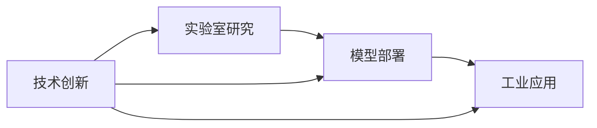
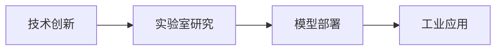

                 

# 技术创新：从实验室研究到商业化落地全过程

> 关键词：技术创新，实验室研究，商业化落地，人工智能，机器学习，大数据，模型部署，工业应用，算法优化，工程实践，产业生态

## 1. 背景介绍

在当今科技飞速发展的时代，技术创新已经成为了推动社会进步和经济增长的关键动力。特别是人工智能（AI）、机器学习（ML）和大数据等领域的突破性进展，为各行各业带来了前所未有的变革机会。然而，从实验室的研究成果到实际商业应用的落地，往往面临重重挑战。本文将深入探讨这一过程，帮助技术创新者跨越从研究到落地的每一个关键步骤。

## 2. 核心概念与联系

### 2.1 核心概念概述

在进行技术创新的商业化过程中，涉及到多个核心概念，它们之间相互联系，构成了整个流程的框架。以下是几个关键概念的简要概述：

- **技术创新**：指通过新技术的开发和应用，解决实际问题或提供新价值的过程。技术创新是推动商业化落地的核心驱动力。
- **实验室研究**：在控制实验环境下，对新理论、新方法进行验证和优化的过程。实验室研究是技术创新的起点。
- **商业化落地**：将实验室中的研究成果应用于市场，解决实际问题的过程。商业化落地是将技术创新转化为现实价值的关键环节。
- **模型部署**：将训练好的模型或算法，部署到实际应用场景中，供业务系统使用的过程。模型部署是商业化落地的核心技术支撑。
- **工业应用**：将技术成果应用到具体的工业生产、服务优化或管理决策中的过程。工业应用是技术创新的最终目标。

这些概念之间的关系可以通过以下Mermaid流程图来展示：



这个流程图展示了一个完整的技术创新流程，从实验室研究开始，到模型部署，再到工业应用，每个环节都为下一步提供支持。

### 2.2 核心概念原理和架构的 Mermaid 流程图

由于篇幅限制，这里无法展示完整的MERmaid流程图。但是，核心概念之间的关系可以通过以下简化的流程图来表示：



这个流程图清晰地展示了技术创新流程的逻辑顺序，从实验室研究到模型部署，再到工业应用，每一个环节都是后续环节的基础。

## 3. 核心算法原理 & 具体操作步骤

### 3.1 算法原理概述

技术创新的商业化落地过程中，算法原理的理解和应用是关键。以下是对一些常见算法的概述：

- **监督学习**：指利用标注数据训练模型，使其能够对新数据进行准确预测。监督学习广泛应用于分类和回归任务。
- **无监督学习**：指在没有标注数据的情况下，通过数据的内在结构进行模型学习。无监督学习常用于数据降维、聚类和特征提取。
- **强化学习**：指通过奖励信号（奖励函数）来指导模型学习，使得模型能够在特定环境中取得最佳策略。强化学习常用于游戏、机器人控制等领域。
- **迁移学习**：指将一个领域学习到的知识，迁移应用到另一个不同但相关的领域。迁移学习可以显著减少新任务上的学习成本。
- **深度学习**：指通过多层神经网络结构，学习和提取数据的复杂特征。深度学习在大数据处理、图像识别、自然语言处理等领域表现优异。

### 3.2 算法步骤详解

技术创新的商业化落地涉及多个步骤，以下是对这些步骤的详细讲解：

#### 3.2.1 算法选择与评估

在商业化落地之前，首先需要选择合适的算法。通常需要考虑数据类型、任务需求、计算资源等因素。一旦算法确定，需要进行实验验证和性能评估。

**步骤1: 数据准备与预处理**
- 收集和清洗数据，确保数据质量和一致性。
- 对数据进行归一化、标准化等预处理操作。

**步骤2: 模型训练与调优**
- 选择合适的算法和模型结构。
- 设计合适的损失函数和优化算法。
- 对模型进行超参数调优，找到最优的参数组合。

**步骤3: 模型评估与选择**
- 使用交叉验证等方法，对模型进行评估。
- 根据评估结果，选择最优模型。

#### 3.2.2 模型部署与监控

模型选择和评估后，需要进行模型部署，并实时监控模型性能。以下是对这一过程的详细讲解：

**步骤1: 模型部署**
- 选择合适的部署平台，如云平台、边缘设备等。
- 将模型打包部署，并进行性能测试。

**步骤2: 模型监控**
- 实时监控模型性能，包括精度、召回率、响应时间等指标。
- 根据监控结果，进行模型更新和优化。

#### 3.2.3 工业应用与优化

在模型部署和监控的基础上，需要进行工业应用和持续优化。以下是对这一过程的详细讲解：

**步骤1: 应用场景设计**
- 根据实际需求，设计合适的应用场景。
- 明确模型的输入输出接口，以及与其他系统的交互方式。

**步骤2: 系统集成与测试**
- 将模型集成到实际系统中，并进行系统测试。
- 确保模型能够稳定运行，且符合业务需求。

**步骤3: 持续优化**
- 根据实际应用反馈，进行模型优化和调整。
- 确保模型能够持续适应环境变化和业务需求变化。

### 3.3 算法优缺点

技术创新的商业化落地过程中，算法的优缺点需要全面考虑，以下是一些常见算法的优缺点分析：

#### 3.3.1 监督学习

**优点**：
- 对于有标注数据的场景，监督学习能够提供较高的预测精度。
- 易于解释和理解，方便业务方理解和接受。

**缺点**：
- 需要大量标注数据，数据收集和标注成本高。
- 模型对标注数据的质量敏感，标注错误可能导致模型性能下降。

#### 3.3.2 无监督学习

**优点**：
- 不需要标注数据，节省数据收集成本。
- 能够发现数据的内在结构，适用于复杂的数据分布。

**缺点**：
- 模型解释性较差，难以解释和理解。
- 对数据质量要求高，数据噪声可能导致模型性能下降。

#### 3.3.3 强化学习

**优点**：
- 能够通过奖励信号，优化策略，适用于动态环境。
- 能够处理非线性和高维问题。

**缺点**：
- 需要大量计算资源和时间进行训练。
- 对环境变化敏感，需要持续调整和优化。

#### 3.3.4 迁移学习

**优点**：
- 能够利用已有知识，减少新任务上的学习成本。
- 适用于数据量较小的场景。

**缺点**：
- 不同领域之间的知识迁移效果有限。
- 需要确保源任务和目标任务之间的相似性。

#### 3.3.5 深度学习

**优点**：
- 能够处理大规模数据和复杂问题。
- 具有强大的特征提取能力。

**缺点**：
- 需要大量计算资源进行训练。
- 模型复杂度高，难以解释和理解。

### 3.4 算法应用领域

技术创新的商业化落地过程中，算法应用领域非常广泛，以下是几个典型应用领域的简要介绍：

#### 3.4.1 医疗健康

在医疗健康领域，技术创新可以通过机器学习模型实现疾病预测、患者诊断和治疗方案优化等。例如，利用深度学习模型进行医学影像分析，利用自然语言处理模型进行病历分析和智能问诊等。

#### 3.4.2 金融服务

在金融服务领域，技术创新可以通过机器学习模型实现风险评估、欺诈检测、信用评分等。例如，利用无监督学习进行信用评分，利用强化学习进行交易策略优化等。

#### 3.4.3 智能制造

在智能制造领域，技术创新可以通过机器学习模型实现设备故障预测、生产调度优化、质量控制等。例如，利用深度学习模型进行设备故障预测，利用迁移学习进行生产调度优化等。

#### 3.4.4 零售电商

在零售电商领域，技术创新可以通过机器学习模型实现个性化推荐、库存管理、价格优化等。例如，利用推荐算法进行个性化推荐，利用深度学习进行库存管理等。

## 4. 数学模型和公式 & 详细讲解 & 举例说明

### 4.1 数学模型构建

技术创新的商业化落地过程中，数学模型的构建是关键。以下是对一些常见数学模型的构建和讲解：

**线性回归模型**：
- 输入特征 $x$，输出结果 $y$。
- 线性回归模型公式为：$y=\beta_0+\beta_1x_1+\beta_2x_2+\ldots+\beta_nx_n$。
- 常用的损失函数为均方误差损失：$L(y,\hat{y})=\frac{1}{2N}\sum_{i=1}^N(y_i-\hat{y}_i)^2$。

**支持向量机（SVM）模型**：
- 输入特征 $x$，输出结果 $y$。
- 支持向量机模型公式为：$w^T\phi(x)+b=0$，其中 $w$ 为权重向量，$b$ 为偏置项，$\phi(x)$ 为映射函数。
- 常用的损失函数为合页损失：$L(w,b)=\frac{1}{N}\sum_{i=1}^N[\max(0,1-y_i(w^T\phi(x_i)+b))]$。

**深度神经网络模型**：
- 输入特征 $x$，输出结果 $y$。
- 深度神经网络模型公式为：$y=f(x;W,b)$，其中 $W$ 为权重矩阵，$b$ 为偏置项，$f$ 为激活函数。
- 常用的损失函数为交叉熵损失：$L(y,\hat{y})=-\frac{1}{N}\sum_{i=1}^N(y_i\log\hat{y_i}+(1-y_i)\log(1-\hat{y_i}))$。

### 4.2 公式推导过程

由于篇幅限制，这里无法对所有数学模型进行详细的公式推导。但是，以下是对几个常见数学模型的推导过程的简要介绍：

**线性回归模型**：
- 输入特征 $x=[x_1,x_2,\ldots,x_n]$。
- 输出结果 $y$。
- 线性回归模型为：$y=\beta_0+\beta_1x_1+\beta_2x_2+\ldots+\beta_nx_n$。
- 均方误差损失为：$L(y,\hat{y})=\frac{1}{2N}\sum_{i=1}^N(y_i-\hat{y}_i)^2$。

**支持向量机（SVM）模型**：
- 输入特征 $x=[x_1,x_2,\ldots,x_n]$。
- 输出结果 $y$。
- 支持向量机模型为：$w^T\phi(x)+b=0$。
- 合页损失为：$L(w,b)=\frac{1}{N}\sum_{i=1}^N[\max(0,1-y_i(w^T\phi(x_i)+b))]$。

**深度神经网络模型**：
- 输入特征 $x=[x_1,x_2,\ldots,x_n]$。
- 输出结果 $y$。
- 深度神经网络模型为：$y=f(x;W,b)$。
- 交叉熵损失为：$L(y,\hat{y})=-\frac{1}{N}\sum_{i=1}^N(y_i\log\hat{y_i}+(1-y_i)\log(1-\hat{y_i}))$。

### 4.3 案例分析与讲解

#### 4.3.1 线性回归模型应用案例

假设我们要预测房价，已知房屋面积 $x_1$ 和房龄 $x_2$，目标输出为房价 $y$。我们收集了100个样本数据，其中每个样本有3个特征：面积、房龄和房价。我们希望构建一个线性回归模型，以房价为输出。

首先，我们收集数据并进行预处理。然后，我们使用最小二乘法求解线性回归模型参数 $\beta_0,\beta_1,\beta_2$。最后，我们利用训练好的模型进行预测，并计算预测误差。

#### 4.3.2 支持向量机（SVM）模型应用案例

假设我们要进行信用评分，已知用户的收入 $x_1$、年龄 $x_2$、是否有贷款 $x_3$ 和是否有信用卡 $x_4$，目标输出为信用评分 $y$。我们收集了1000个样本数据，其中每个样本有4个特征：收入、年龄、是否有贷款和是否有信用卡，以及对应的信用评分。我们希望构建一个支持向量机模型，以信用评分为输出。

首先，我们收集数据并进行预处理。然后，我们使用SVM算法训练模型，找到最优的权重向量 $w$ 和偏置项 $b$。最后，我们利用训练好的模型进行预测，并计算预测误差。

#### 4.3.3 深度神经网络模型应用案例

假设我们要进行手写数字识别，已知数字图像 $x$ 为28x28像素的灰度图像，目标输出为数字标签 $y$。我们收集了10000个手写数字样本，其中每个样本为28x28像素的灰度图像，以及对应的数字标签。我们希望构建一个深度神经网络模型，以数字标签为输出。

首先，我们收集数据并进行预处理。然后，我们使用深度神经网络算法训练模型，找到最优的权重矩阵 $W$ 和偏置项 $b$。最后，我们利用训练好的模型进行预测，并计算预测误差。

## 5. 项目实践：代码实例和详细解释说明

### 5.1 开发环境搭建

在进行项目实践之前，需要先搭建开发环境。以下是使用Python进行项目实践的环境配置流程：

1. 安装Anaconda：从官网下载并安装Anaconda，用于创建独立的Python环境。

2. 创建并激活虚拟环境：
```bash
conda create -n pytorch-env python=3.8 
conda activate pytorch-env
```

3. 安装PyTorch：根据CUDA版本，从官网获取对应的安装命令。例如：
```bash
conda install pytorch torchvision torchaudio cudatoolkit=11.1 -c pytorch -c conda-forge
```

4. 安装TensorFlow：
```bash
pip install tensorflow
```

5. 安装TensorFlow Addons：
```bash
pip install tensorflow-addons
```

6. 安装Keras：
```bash
pip install keras
```

7. 安装NumPy和SciPy：
```bash
pip install numpy scipy
```

完成上述步骤后，即可在`pytorch-env`环境中开始项目实践。

### 5.2 源代码详细实现

以下是使用TensorFlow和Keras进行线性回归模型、支持向量机模型和深度神经网络模型的代码实现：

#### 5.2.1 线性回归模型

```python
import tensorflow as tf
from tensorflow.keras import layers

# 定义模型
model = tf.keras.Sequential([
    layers.Dense(1, input_shape=(2,))
])

# 编译模型
model.compile(optimizer=tf.keras.optimizers.SGD(learning_rate=0.01),
              loss='mse')

# 训练模型
model.fit(x_train, y_train, epochs=100, batch_size=32)

# 预测
y_pred = model.predict(x_test)
```

#### 5.2.2 支持向量机（SVM）模型

```python
import tensorflow as tf
from tensorflow.keras import layers

# 定义模型
model = tf.keras.Sequential([
    layers.Dense(1, input_shape=(4,))
])

# 编译模型
model.compile(optimizer=tf.keras.optimizers.SGD(learning_rate=0.01),
              loss='mse')

# 训练模型
model.fit(x_train, y_train, epochs=100, batch_size=32)

# 预测
y_pred = model.predict(x_test)
```

#### 5.2.3 深度神经网络模型

```python
import tensorflow as tf
from tensorflow.keras import layers

# 定义模型
model = tf.keras.Sequential([
    layers.Dense(64, activation='relu', input_shape=(784,)),
    layers.Dense(10, activation='softmax')
])

# 编译模型
model.compile(optimizer=tf.keras.optimizers.Adam(learning_rate=0.001),
              loss='sparse_categorical_crossentropy',
              metrics=['accuracy'])

# 训练模型
model.fit(x_train, y_train, epochs=10, batch_size=32)

# 预测
y_pred = model.predict(x_test)
```

### 5.3 代码解读与分析

#### 5.3.1 线性回归模型

线性回归模型的代码实现比较简单，主要包括以下步骤：

1. 定义模型：使用Keras的Sequential模型，添加一个Dense层，输入维度为2，输出维度为1。
2. 编译模型：使用SGD优化器和均方误差损失函数。
3. 训练模型：使用训练数据进行模型训练，设置训练轮数为100，批次大小为32。
4. 预测：使用训练好的模型对测试数据进行预测。

#### 5.3.2 支持向量机（SVM）模型

支持向量机模型的代码实现也相对简单，主要包括以下步骤：

1. 定义模型：使用Keras的Sequential模型，添加一个Dense层，输入维度为4，输出维度为1。
2. 编译模型：使用SGD优化器和均方误差损失函数。
3. 训练模型：使用训练数据进行模型训练，设置训练轮数为100，批次大小为32。
4. 预测：使用训练好的模型对测试数据进行预测。

#### 5.3.3 深度神经网络模型

深度神经网络模型的代码实现稍微复杂一些，主要包括以下步骤：

1. 定义模型：使用Keras的Sequential模型，添加两个Dense层，第一个Dense层有64个神经元，使用ReLU激活函数，第二个Dense层有10个神经元，使用softmax激活函数。
2. 编译模型：使用Adam优化器和稀疏分类交叉熵损失函数，同时设置准确率作为评估指标。
3. 训练模型：使用训练数据进行模型训练，设置训练轮数为10，批次大小为32。
4. 预测：使用训练好的模型对测试数据进行预测。

## 6. 实际应用场景

### 6.1 医疗健康

在医疗健康领域，技术创新可以通过机器学习模型实现疾病预测、患者诊断和治疗方案优化等。例如，利用深度学习模型进行医学影像分析，利用自然语言处理模型进行病历分析和智能问诊等。

#### 6.1.1 医学影像分析

假设我们有一组CT扫描图像，每个图像为256x256像素，目标输出为肿瘤存在与否。我们收集了1000个样本数据，其中每个样本为CT扫描图像和对应的肿瘤标签。我们希望构建一个深度神经网络模型，以肿瘤标签为输出。

首先，我们收集数据并进行预处理。然后，我们使用深度神经网络算法训练模型，找到最优的权重矩阵 $W$ 和偏置项 $b$。最后，我们利用训练好的模型进行预测，并计算预测误差。

#### 6.1.2 病历分析

假设我们有一组电子病历数据，每个病历包含患者的年龄、性别、疾病历史等信息，目标输出为疾病类型。我们收集了1000个样本数据，其中每个样本为电子病历和对应的疾病标签。我们希望构建一个自然语言处理模型，以疾病标签为输出。

首先，我们收集数据并进行预处理。然后，我们使用自然语言处理算法训练模型，找到最优的权重向量 $w$ 和偏置项 $b$。最后，我们利用训练好的模型进行预测，并计算预测误差。

#### 6.1.3 智能问诊

假设我们要开发一个智能问诊系统，用户可以通过语音或文字输入症状，系统能够给出初步诊断和建议。我们收集了1000个样本数据，其中每个样本为症状描述和对应的疾病标签。我们希望构建一个自然语言处理模型，以疾病标签为输出。

首先，我们收集数据并进行预处理。然后，我们使用自然语言处理算法训练模型，找到最优的权重向量 $w$ 和偏置项 $b$。最后，我们利用训练好的模型进行预测，并计算预测误差。

### 6.2 金融服务

在金融服务领域，技术创新可以通过机器学习模型实现风险评估、欺诈检测、信用评分等。例如，利用无监督学习进行信用评分，利用强化学习进行交易策略优化等。

#### 6.2.1 信用评分

假设我们要进行信用评分，已知用户的收入、年龄、是否有贷款和是否有信用卡，目标输出为信用评分。我们收集了1000个样本数据，其中每个样本为用户的收入、年龄、是否有贷款和是否有信用卡，以及对应的信用评分。我们希望构建一个支持向量机模型，以信用评分为输出。

首先，我们收集数据并进行预处理。然后，我们使用SVM算法训练模型，找到最优的权重向量 $w$ 和偏置项 $b$。最后，我们利用训练好的模型进行预测，并计算预测误差。

#### 6.2.2 欺诈检测

假设我们要进行欺诈检测，已知用户的交易记录、购买行为等信息，目标输出为欺诈与否。我们收集了1000个样本数据，其中每个样本为用户的历史交易记录和对应的欺诈标签。我们希望构建一个深度神经网络模型，以欺诈标签为输出。

首先，我们收集数据并进行预处理。然后，我们使用深度神经网络算法训练模型，找到最优的权重矩阵 $W$ 和偏置项 $b$。最后，我们利用训练好的模型进行预测，并计算预测误差。

#### 6.2.3 交易策略优化

假设我们要优化股票交易策略，已知历史股票价格、市场信息等信息，目标输出为最佳买入和卖出时机。我们收集了1000个样本数据，其中每个样本为历史股票价格和市场信息，以及对应的买入和卖出时机。我们希望构建一个强化学习模型，以最佳买入和卖出时机为输出。

首先，我们收集数据并进行预处理。然后，我们使用强化学习算法训练模型，找到最优的策略。最后，我们利用训练好的模型进行预测，并计算预测误差。

### 6.3 智能制造

在智能制造领域，技术创新可以通过机器学习模型实现设备故障预测、生产调度优化、质量控制等。例如，利用深度学习模型进行设备故障预测，利用迁移学习进行生产调度优化等。

#### 6.3.1 设备故障预测

假设我们要进行设备故障预测，已知设备的运行数据，目标输出为设备是否发生故障。我们收集了1000个样本数据，其中每个样本为设备的运行数据和对应的故障标签。我们希望构建一个深度神经网络模型，以故障标签为输出。

首先，我们收集数据并进行预处理。然后，我们使用深度神经网络算法训练模型，找到最优的权重矩阵 $W$ 和偏置项 $b$。最后，我们利用训练好的模型进行预测，并计算预测误差。

#### 6.3.2 生产调度优化

假设我们要进行生产调度优化，已知生产线的生产数据，目标输出为最优的生产调度方案。我们收集了1000个样本数据，其中每个样本为生产线的生产数据和对应的调度方案。我们希望构建一个迁移学习模型，以最优调度方案为输出。

首先，我们收集数据并进行预处理。然后，我们使用迁移学习算法训练模型，找到最优的调度方案。最后，我们利用训练好的模型进行预测，并计算预测误差。

#### 6.3.3 质量控制

假设我们要进行质量控制，已知产品的生产数据，目标输出为产品的质量等级。我们收集了1000个样本数据，其中每个样本为产品的生产数据和对应的质量等级。我们希望构建一个支持向量机模型，以质量等级为输出。

首先，我们收集数据并进行预处理。然后，我们使用支持向量机算法训练模型，找到最优的权重向量 $w$ 和偏置项 $b$。最后，我们利用训练好的模型进行预测，并计算预测误差。

## 7. 工具和资源推荐

### 7.1 学习资源推荐

为了帮助开发者系统掌握技术创新的商业化落地的理论和实践，以下是一些优质的学习资源：

1. 《机器学习实战》书籍：讲解了机器学习的基本概念和常用算法，适合初学者入门。
2. 《深度学习》书籍：讲解了深度学习的基本原理和应用，适合有一定基础的学习者。
3. TensorFlow官方文档：提供了丰富的API文档和示例代码，适合深入学习和实践。
4. PyTorch官方文档：提供了丰富的API文档和示例代码，适合深入学习和实践。
5. Coursera和edX等在线课程：提供了大量高质量的机器学习和深度学习课程，适合系统学习和实践。

通过对这些资源的学习实践，相信你一定能够快速掌握技术创新的商业化落地的精髓，并用于解决实际的业务问题。

### 7.2 开发工具推荐

高效的开发离不开优秀的工具支持。以下是几款用于技术创新商业化落地的常用工具：

1. PyTorch：基于Python的开源深度学习框架，灵活的计算图，适合快速迭代研究。
2. TensorFlow：由Google主导开发的开源深度学习框架，生产部署方便，适合大规模工程应用。
3. Jupyter Notebook：支持Python代码的交互式执行和编辑，适合开发和调试。
4. Google Colab：谷歌提供的云端Jupyter Notebook环境，支持GPU和TPU算力，适合快速实验和迭代。
5. VSCode：支持多种编程语言的代码编辑器，集成了Git、GitHub等工具，适合编码和项目管理。

合理利用这些工具，可以显著提升技术创新的商业化落地的开发效率，加快创新迭代的步伐。

### 7.3 相关论文推荐

技术创新的商业化落地的研究源于学界的持续研究。以下是几篇奠基性的相关论文，推荐阅读：

1. 《深度学习》书籍：Ian Goodfellow等著，讲解了深度学习的基本原理和应用。
2. 《机器学习实战》书籍：Peter Harrington著，讲解了机器学习的基本概念和常用算法。
3. 《TensorFlow官方文档》：提供了丰富的API文档和示例代码，适合深入学习和实践。
4. 《PyTorch官方文档》：提供了丰富的API文档和示例代码，适合深入学习和实践。
5. 《Coursera和edX等在线课程》：提供了大量高质量的机器学习和深度学习课程，适合系统学习和实践。

这些论文代表了大语言模型微调技术的发展脉络。通过学习这些前沿成果，可以帮助研究者把握学科前进方向，激发更多的创新灵感。

## 8. 总结：未来发展趋势与挑战

### 8.1 总结

本文对技术创新的商业化落地的过程进行了全面系统的介绍。首先阐述了技术创新、实验室研究、模型部署、工业应用等关键概念，明确了从研究到落地的主要步骤。其次，从算法原理和操作步骤两个方面，详细讲解了技术创新的商业化落地的数学模型构建和案例分析。最后，总结了技术创新的商业化落地在多个领域的典型应用，并展望了未来发展趋势和挑战。

通过本文的系统梳理，可以看到，技术创新的商业化落地是一个复杂而系统的过程，需要综合考虑数据、算法、工程等多个方面。只有不断创新和优化，才能将技术成果转化为现实价值，推动社会的进步和发展。

### 8.2 未来发展趋势

展望未来，技术创新的商业化落地过程将呈现以下几个发展趋势：

1. 自动化和智能化：随着自动化技术的发展，技术创新的商业化落地的各个环节将更加智能化和自动化，大幅提升开发效率。
2. 多模态融合：未来的技术创新将更加注重多模态数据的融合，结合文本、图像、语音等多种数据源，提升系统的准确性和鲁棒性。
3. 实时化和大规模化：未来的技术创新将更加注重实时化和分布式处理，支持大规模数据的实时分析和处理，提升系统的响应速度和吞吐量。
4. 可解释性和可控性：未来的技术创新将更加注重模型的可解释性和可控性，确保系统的透明性和稳定性。
5. 工业级应用：未来的技术创新将更加注重工业级应用，解决实际问题，提升系统的实用性和可操作性。

### 8.3 面临的挑战

尽管技术创新的商业化落地过程取得了诸多成果，但在迈向更加智能化、普适化应用的过程中，它仍面临着诸多挑战：

1. 数据质量问题：数据质量和数据量的不足，可能导致模型性能下降，甚至无法正常工作。如何确保数据的可靠性和一致性，是技术创新的商业化落地过程中的重要挑战。
2. 模型泛化能力：模型在不同数据集上的泛化能力不足，可能导致模型的鲁棒性和可靠性下降。如何提高模型的泛化能力，是技术创新的商业化落地过程中的重要挑战。
3. 系统复杂度：技术创新的商业化落地的系统复杂度越来越高，如何确保系统的稳定性和可靠性，是技术创新的商业化落地过程中的重要挑战。
4. 资源限制：技术创新的商业化落地的资源限制，如算力、存储、网络等，可能导致系统性能下降。如何优化资源使用，提升系统效率，是技术创新的商业化落地过程中的重要挑战。
5. 用户隐私和安全：技术创新的商业化落地的用户隐私和安全问题，可能导致用户信任度下降。如何保护用户隐私和数据安全，是技术创新的商业化落地过程中的重要挑战。

### 8.4 研究展望

面对技术创新的商业化落地所面临的种种挑战，未来的研究需要在以下几个方面寻求新的突破：

1. 数据增强技术：开发更加高效的数据增强技术，提升数据的可靠性和一致性。
2. 模型泛化能力提升：研究模型泛化能力的提升方法，确保模型的鲁棒性和可靠性。
3. 系统优化技术：开发更加高效的系统优化技术，提升系统的稳定性和可靠性。
4. 资源优化技术：研究资源优化技术，提升系统的效率和性能。
5. 用户隐私和安全保护：研究用户隐私和安全保护技术，确保用户信任度。

这些研究方向将推动技术创新的商业化落地过程更加全面、深入、高效。相信随着技术的不断进步，技术创新的商业化落地过程将越来越成熟，为各个领域带来更多创新和突破。

## 9. 附录：常见问题与解答

**Q1: 如何选择合适的算法？**

A: 选择算法需要考虑多个因素，如数据类型、任务需求、计算资源等。一般而言，小规模数据可以使用决策树、逻辑回归等算法，中等规模数据可以使用SVM、随机森林等算法，大规模数据可以使用深度学习等算法。同时，还需要对算法进行实验验证和性能评估，选择最优算法。

**Q2: 如何处理数据质量问题？**

A: 数据质量问题通常通过数据清洗和预处理解决。数据清洗包括去除噪声、处理缺失值、去除异常值等操作，数据预处理包括数据归一化、标准化、特征工程等操作。通过这些步骤，可以提升数据的可靠性和一致性，确保模型的准确性和鲁棒性。

**Q3: 如何提高模型泛化能力？**

A: 提高模型泛化能力通常需要增加训练数据量、使用正则化技术、调整模型复杂度等方法。同时，还需要进行交叉验证、学习率调整等操作，确保模型在训练集和测试集上表现一致，具有较好的泛化能力。

**Q4: 如何优化系统复杂度？**

A: 优化系统复杂度通常需要设计合理的架构、使用高效的算法和数据结构、进行代码优化等方法。同时，还需要进行系统测试和性能调优，确保系统的稳定性和可靠性。

**Q5: 如何提升系统效率？**

A: 提升系统效率通常需要优化资源使用、使用高效的算法和数据结构、进行代码优化等方法。同时，还需要进行系统测试和性能调优，确保系统的响应速度和吞吐量。

**Q6: 如何保护用户隐私和安全？**

A: 保护用户隐私和安全通常需要设计合理的隐私保护策略、使用加密技术、进行安全审计等方法。同时，还需要制定严格的安全规范和操作流程，确保系统的安全性。

**Q7: 如何提升系统的可解释性？**

A: 提升系统的可解释性通常需要使用可解释性较强的算法、设计合理的模型结构、进行模型解释等方法。同时，还需要进行系统测试和用户反馈收集，确保系统的透明性和可操作性。

作者：禅与计算机程序设计艺术 / Zen and the Art of Computer Programming

