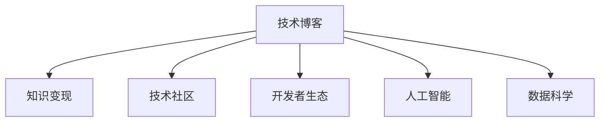

                 

# 技术博客：知识变现的途径

> 关键词：知识变现, 技术博客, 技术分享, 开源社区, 开发者生态, 人工智能, 数据科学

## 1. 背景介绍

在数字化时代的浪潮中，知识变现已成为各行各业的重要议题。对于开发者和技术从业者来说，如何将自身的技术知识转化为实际的经济价值，成为了一个值得深入探讨的话题。在这一背景下，技术博客作为知识共享和变现的重要载体，扮演着越来越重要的角色。本文将从技术博客的角度，探讨如何高效地将知识变现，帮助技术从业者实现从技术积累到经济收益的跨越。

### 1.1 问题由来

随着互联网技术的发展和普及，越来越多的技术从业者通过博客、视频、开源项目等方式分享自己的技术知识和经验。这些分享不仅有助于知识传播，也开辟了新的知识变现途径。然而，由于技术博客的数量庞大且内容质量参差不齐，技术从业者如何高效地将知识变现，成为了一个亟待解决的问题。

### 1.2 问题核心关键点

技术博客的知识变现主要依赖于以下几个关键点：

- **内容质量**：高质量、系统化的内容是吸引用户和实现变现的基础。
- **读者互动**：与读者积极互动，建立社区，提高内容粘性。
- **商业化策略**：通过广告、付费订阅、知识付费等商业化手段，实现经济收益。
- **品牌影响力**：建立个人品牌，通过品牌效应吸引更多用户和流量。

本文将从这些关键点出发，深入探讨技术博客的知识变现途径。

## 2. 核心概念与联系

### 2.1 核心概念概述

为更好地理解技术博客的知识变现过程，本节将介绍几个密切相关的核心概念：

- **技术博客**：以技术分享为主要内容的博客，通常包含编程技巧、算法实现、开发经验等内容。
- **知识变现**：将个人或组织的技术知识转化为经济收益的过程，包括广告、赞助、付费内容等形式。
- **技术社区**：围绕特定技术主题聚集的技术爱好者、开发者和专家，通过交流互动分享知识和经验。
- **开发者生态**：由开发者、技术社区、开源项目、教育培训等多个要素组成的生态系统。
- **人工智能(AI)**：通过计算机模拟人类智能活动，实现语音识别、图像识别、自然语言处理等应用的技术领域。
- **数据科学(Data Science)**：通过数据处理、分析、建模等技术，从数据中提取有价值信息的方法和工具。

这些核心概念之间的逻辑关系可以通过以下Mermaid流程图来展示：



这个流程图展示了一系列紧密联系的概念：

1. **技术博客**：作为知识分享和传播的载体，是知识变现的基础。
2. **知识变现**：通过博客内容变现，实现经济收益，激励更多高质量内容的产出。
3. **技术社区**：构建技术交流平台，增强读者互动，提高内容粘性。
4. **开发者生态**：形成一个完整的技术生态，促进知识的流通和应用。
5. **人工智能与数据科学**：提供技术变现的手段和内容，如算法实现、数据处理等。

## 3. 核心算法原理 & 具体操作步骤

### 3.1 算法原理概述

技术博客的知识变现过程，本质上是一个基于内容的商业化过程。其核心思想是通过高质量、有价值的内容吸引读者，并通过各种商业化手段实现变现。

具体来说，技术博客的知识变现过程包括内容生产、读者互动和商业化变现三个阶段：

1. **内容生产**：通过撰写高质量的技术文章，分享专业知识，建立读者信任和忠诚度。
2. **读者互动**：通过评论、邮件、社群等形式，与读者建立互动，收集反馈，优化内容。
3. **商业化变现**：通过广告、付费订阅、知识付费等手段，实现内容的经济收益。

这一过程可以通过以下步骤实现：

1. **内容规划与创作**：根据读者需求和市场趋势，规划博客内容主题和形式。
2. **发布与推广**：通过社交媒体、SEO优化等手段，推广博客内容，吸引更多读者。
3. **读者互动与反馈**：积极与读者互动，收集反馈，优化内容质量。
4. **商业化变现**：根据读者反馈和市场需求，选择适合的商业化策略。

### 3.2 算法步骤详解

技术博客的知识变现步骤可以分为以下几个关键环节：

**Step 1: 内容规划与创作**

- **市场调研**：分析目标读者群体，了解他们的兴趣和需求。
- **内容规划**：制定博客主题和发布计划，明确博客的定位和风格。
- **内容创作**：撰写高质量的技术文章，确保内容的准确性和实用性。
- **SEO优化**：对博客内容进行SEO优化，提升搜索引擎排名，吸引更多读者。

**Step 2: 发布与推广**

- **平台选择**：选择合适的博客平台，如WordPress、Medium等。
- **发布策略**：制定发布策略，定期更新内容，保持读者粘性。
- **推广手段**：利用社交媒体、技术社区、电子邮件等多种渠道推广博客内容。
- **互动维护**：积极与读者互动，回复评论和邮件，增强读者忠诚度。

**Step 3: 商业化变现**

- **广告收入**：通过广告平台，如Google AdSense、WordPress广告等，实现广告变现。
- **付费订阅**：提供付费内容，如深度文章、电子书等，提升内容价值。
- **知识付费**：开设付费课程、技术咨询等增值服务，实现知识变现。

### 3.3 算法优缺点

技术博客的知识变现方法具有以下优点：

- **成本低**：技术博客的运营成本相对较低，主要依赖于时间和精力投入。
- **变现多样**：通过多种商业化手段，可以实现多元化的经济收益。
- **用户粘性强**：高质量内容和高频互动能够增强读者粘性，形成稳定的读者群体。

同时，该方法也存在一些局限性：

- **内容质量依赖**：高质量内容的制作和维护需要大量的时间和精力。
- **市场竞争激烈**：技术博客数量众多，如何脱颖而出是一大挑战。
- **商业化风险**：商业化策略不当，可能导致读者流失，影响内容变现效果。

### 3.4 算法应用领域

技术博客的知识变现方法已经在开源社区、技术教育、技术咨询等多个领域得到了广泛应用，具体如下：

- **开源社区**：通过博客分享开源项目和开发经验，吸引贡献者和赞助商。
- **技术教育**：开设技术博客，提供教程、实战案例等，吸引技术学习者和学生。
- **技术咨询**：通过博客解答技术问题，提供付费技术咨询和培训服务。
- **技术产品推广**：利用博客推广技术产品，吸引潜在客户和用户。

## 4. 数学模型和公式 & 详细讲解 & 举例说明

### 4.1 数学模型构建

为了更好地理解技术博客的知识变现过程，我们可以通过一个简单的数学模型来建模。假设博客的总访问量为 $N$，每次点击带来的广告收入为 $R$，读者订阅费用为 $S$，知识付费收入为 $P$，则总变现收入 $I$ 可以表示为：

$$
I = N \times R + S \times T + P \times F
$$

其中 $T$ 为订阅用户数，$F$ 为付费文章数。

### 4.2 公式推导过程

根据上述模型，我们可以进一步推导出每次访问的平均变现收入 $I_a$：

$$
I_a = \frac{I}{N} = R + S \times \frac{T}{N} + P \times \frac{F}{N}
$$

每次访问的平均变现收入受读者互动和付费内容的影响较大，因此优化这两个环节是提升变现效果的关键。

### 4.3 案例分析与讲解

假设某技术博客的总访问量为 $N=10,000$，每次点击带来的广告收入为 $R=0.01$ 元，读者订阅费用为 $S=9.9$ 元/月，平均每篇文章的付费阅读费用为 $P=0.99$ 元，每月发布 $T=100$ 篇文章，付费文章数为 $F=10$ 篇，则每月变现收入 $I$ 为：

$$
I = 10,000 \times 0.01 + 9.9 \times 100 + 0.99 \times 10 = 1100
$$

每次访问的平均变现收入 $I_a$ 为：

$$
I_a = \frac{1100}{10,000} = 0.11
$$

从上述案例可以看出，付费订阅和付费文章对变现收入的贡献较大，因此提升内容质量和读者粘性，开发优质付费内容，是提升博客变现效果的关键。

## 5. 项目实践：代码实例和详细解释说明

### 5.1 开发环境搭建

在进行技术博客的知识变现实践前，我们需要准备好开发环境。以下是使用WordPress搭建技术博客的步骤：

1. **安装WordPress**：
   - 选择WordPress官网下载最新稳定版本。
   - 解压到服务器或本地主机，进入安装页面。
   - 配置数据库信息，输入管理员邮箱、密码等信息。
   - 等待安装完成，跳转到登录页面。

2. **安装主题和插件**：
   - 在WordPress后台，选择所需主题和插件，并安装激活。
   - 建议安装SEO插件（如Yoast SEO），提升博客搜索引擎排名。

3. **配置SEO和隐私保护**：
   - 在WordPress后台，进行搜索引擎优化（SEO）配置。
   - 设置隐私保护，确保读者个人信息安全。

4. **部署代码托管服务**：
   - 选择GitHub、GitLab等代码托管服务。
   - 上传博客代码，进行版本控制。

完成上述步骤后，即可在WordPress平台上搭建起一个基本的技术博客。

### 5.2 源代码详细实现

下面我们以创建一个简单的技术博客为例，给出WordPress代码实现的详细步骤：

1. **创建博客文章**：
   - 在WordPress后台，点击“发布”按钮，进入文章编辑页面。
   - 输入博客文章的标题和内容，设置分类、标签等元数据。
   - 使用Markdown格式编辑文章内容，如：
     ```
     <h1>标题</h1>
     <p>内容...</p>
     ```
   - 预览并发布文章。

2. **配置SEO优化**：
   - 在WordPress后台，进入SEO插件设置页。
   - 设置关键词、描述、标题等SEO属性。
   - 添加Meta标签，如`<meta name="keywords" content="关键词">`。

3. **配置广告与付费内容**：
   - 在WordPress后台，进入广告设置页。
   - 选择广告类型（如横幅广告、文字广告），设置广告位置和收入。
   - 在文章中添加付费内容插件（如WP Pro），设置付费阅读价格。

4. **利用GitHub进行代码托管**：
   - 在GitHub上创建仓库，上传博客代码。
   - 配置代码库的权限和协作选项。
   - 通过Git命令（如`git clone`）将代码克隆到本地或服务器。

### 5.3 代码解读与分析

让我们再详细解读一下关键代码的实现细节：

**博客文章创建**：
- 利用WordPress后台的文章编辑功能，创建并发布博客文章。
- 文章编辑页面包含标题、内容、分类、标签等元数据，以及Markdown编辑工具。

**SEO优化配置**：
- 利用Yoast SEO等插件，设置关键词、描述、标题等SEO属性。
- 添加Meta标签，提升博客在搜索引擎中的排名。

**广告配置**：
- 在WordPress后台，选择广告类型和收入方式。
- 通过广告插件（如AdSense、GDN）添加横幅广告、文字广告等。

**付费内容配置**：
- 在文章中添加付费阅读插件（如WP Pro、Proteus），设置付费阅读价格。
- 利用插件自动处理付费内容，生成支付链接和页面。

**代码托管**：
- 在GitHub上创建仓库，上传博客代码。
- 通过Git命令进行代码库的管理和协作，确保代码版本控制和安全。

以上步骤展示了如何使用WordPress平台搭建技术博客，并通过广告、付费内容等方式实现知识变现。

### 5.4 运行结果展示

完成上述步骤后，博客将可以在线运行，读者可以通过阅读博客文章、订阅和付费阅读等方式获得知识价值。以下是一些展示效果：

1. **博客首页展示**：
   - 读者可以看到最新文章的标题和摘要。
   - 点击文章标题，进入详细阅读页面。

2. **文章详细阅读**：
   - 读者可以看到文章的详细内容，设置评论和分享。
   - 对于付费文章，读者需要支付费用后才能访问。

3. **广告展示效果**：
   - 读者浏览文章时，可以看到广告位中的横幅或文字广告。
   - 广告位的收入将直接进入博客运营账户。

4. **付费内容展示**：
   - 读者可以看到付费文章的提示，点击按钮进入付费阅读页面。
   - 付费页面展示文章的摘要和支付链接，读者支付后进入阅读页面。

通过上述步骤和展示效果，读者可以直观感受到技术博客的知识变现过程。

## 6. 实际应用场景

### 6.1 开源社区

开源社区是一个以技术分享和协作为主导的平台，技术博客在开源社区中扮演着重要角色。通过博客分享项目进展、开发经验、技术讨论等内容，可以吸引贡献者和赞助商，形成良性互动的社区生态。

**案例**：
- GitHub的官方博客“GitHub Dev Blog”，分享GitHub的最新动态、技术实现和社区活动，吸引开发者贡献和赞助。

### 6.2 技术教育

技术教育是技术博客变现的重要领域，通过博客分享教程、实战案例、在线课程等内容，可以吸引技术学习者和学生，提供系统化的学习资源。

**案例**：
- Udacity的博客“Udacity”，分享Udacity的技术课程、项目案例和行业洞察，吸引学生和专业人士。

### 6.3 技术咨询

技术咨询是技术博客变现的另一个重要途径，通过博客解答技术问题、提供付费技术咨询和培训服务，可以为企业提供有价值的解决方案。

**案例**：
- IT咨询公司提供博客“XXIT咨询博客”，分享IT咨询的行业趋势、技术解决方案和案例分析，吸引企业客户。

### 6.4 未来应用展望

随着技术博客的不断发展，其知识变现方式也在不断演进。未来，技术博客的知识变现将呈现出以下趋势：

1. **内容多元化**：除了技术文章，视频、音频等多样化内容也将成为变现手段。
2. **社区化运营**：构建社区，增强读者互动，提升用户粘性，实现社区变现。
3. **知识付费市场**：知识付费市场逐渐成熟，付费订阅、在线课程等变现形式将更加普及。
4. **AI与数据科学应用**：通过AI和大数据分析，精准推荐内容，提高内容曝光率和变现效率。
5. **跨平台变现**：利用多种平台（如微信公众号、知识付费平台）实现多元化变现。

## 7. 工具和资源推荐

### 7.1 学习资源推荐

为了帮助开发者和技术从业者系统掌握技术博客的知识变现技巧，以下是一些优质的学习资源：

1. **《如何写博客：成为技术博主的秘密》**：详细介绍如何写博客、内容规划、SEO优化等技巧，适合技术博客入门学习。
2. **Udemy《技术博客课程》**：提供从内容创作到商业化变现的全套课程，适合有一定基础的技术从业者。
3. **Coursera《内容营销与博客经营》**：系统讲解内容营销和博客经营的知识，提升博客的变现能力。
4. **Medium博客社区**：全球最大的技术博客平台，汇聚了大量优秀的技术文章和社区资源，适合学习借鉴。
5. **掘金技术博客**：国内领先的科技媒体平台，提供丰富的技术文章、课程和资讯，适合中文技术博客学习。

### 7.2 开发工具推荐

高效的开发离不开优秀的工具支持。以下是几款用于技术博客开发和变现的常用工具：

1. **WordPress**：全球最流行的博客平台，支持SEO优化、广告管理、付费内容等功能。
2. **Medium**：全球最大的技术博客平台，提供丰富的博客模板和插件，方便技术分享和变现。
3. **Udemy**：全球最大的在线教育平台，提供技术课程和付费订阅服务，适合技术教育变现。
4. **Github Pages**：利用GitHub托管博客，提供静态网站托管和Git版本控制，适合开源社区和教育博客。
5. **AdSense**：谷歌提供的广告平台，支持横幅广告、文字广告等变现形式，适合广告变现。

合理利用这些工具，可以显著提升技术博客的运营效率和变现效果，实现技术知识的高效变现。

### 7.3 相关论文推荐

技术博客的知识变现技术源于学界的持续研究。以下是几篇奠基性的相关论文，推荐阅读：

1. **《技术博客的知识共享与变现机制》**：探讨技术博客的知识共享和变现机制，提出内容质量、读者互动和商业化策略等关键点。
2. **《技术博客的社区构建与运营》**：介绍技术博客的社区构建和运营策略，分析如何通过社区互动提升博客变现效果。
3. **《技术博客的多元化变现模式》**：研究技术博客的多元化变现模式，如广告、付费订阅、知识付费等，提出变现路径优化策略。
4. **《技术博客的AI与数据科学应用》**：探讨AI和大数据在技术博客中的应用，提升内容推荐和变现效率。
5. **《技术博客的跨平台变现策略》**：分析技术博客在不同平台（如Medium、掘金）的变现策略，提出跨平台运营优化方案。

这些论文代表了大技术博客变现技术的发展脉络。通过学习这些前沿成果，可以帮助研究者把握学科前进方向，激发更多的创新灵感。

## 8. 总结：未来发展趋势与挑战

### 8.1 总结

本文对技术博客的知识变现过程进行了全面系统的介绍。首先阐述了技术博客在知识变现中的重要地位和作用，明确了内容质量、读者互动和商业化策略等关键点。其次，从原理到实践，详细讲解了技术博客的知识变现步骤和技术要点，给出了知识变现的完整代码实现。同时，本文还探讨了技术博客在开源社区、技术教育、技术咨询等领域的实际应用，展示了知识变现的广阔前景。此外，本文精选了技术博客变现的各类学习资源和开发工具，力求为读者提供全方位的技术指引。

通过本文的系统梳理，可以看到，技术博客的知识变现途径在不断演进和扩展，为技术从业者提供了更多实现经济收益的可能。未来，伴随技术的持续进步和生态环境的不断完善，技术博客的知识变现必将在数字化时代中发挥更大的作用，成为开发者和技术人员的重要收入来源。

### 8.2 未来发展趋势

展望未来，技术博客的知识变现技术将呈现以下几个发展趋势：

1. **内容多样化**：视频、音频等多样化内容将成为技术博客的重要变现手段，提升内容表现力和读者体验。
2. **社区化运营**：技术博客将更加注重社区建设，通过互动和协作，提升用户粘性和变现效果。
3. **知识付费市场**：知识付费市场将逐步成熟，付费订阅、在线课程等变现形式将更加普及，实现更高层次的变现。
4. **AI与数据科学应用**：AI和大数据分析将进一步融入技术博客，通过精准推荐和内容优化，提升内容变现效率。
5. **跨平台变现**：技术博客将通过多平台（如博客、视频、音频）实现多元化变现，拓展变现渠道和用户群体。

### 8.3 面临的挑战

尽管技术博客的知识变现技术已经取得了瞩目成就，但在迈向更加智能化、普适化应用的过程中，它仍面临着诸多挑战：

1. **内容质量提升**：高质量内容的制作和维护需要大量的时间和精力，如何提升内容质量和生产效率，是一大难题。
2. **读者互动不足**：如何增强读者互动，提高读者粘性和社区活跃度，是技术博客变现的瓶颈之一。
3. **商业化策略复杂**：不同的商业化策略（如广告、付费订阅、知识付费）需要灵活调整，策略不当可能导致变现效果不佳。
4. **市场竞争激烈**：技术博客数量众多，如何在激烈的市场竞争中脱颖而出，是一大挑战。
5. **广告收入受限**：广告收入受平台政策和用户行为的影响较大，如何提升广告变现效率，是一大挑战。

### 8.4 研究展望

面对技术博客知识变现所面临的种种挑战，未来的研究需要在以下几个方面寻求新的突破：

1. **内容生产优化**：通过自动化工具和人工智能技术，提升内容生产效率和质量，减少时间和人力成本。
2. **互动社区建设**：利用AI和大数据分析，精准推荐内容，增强读者互动，提升社区活跃度。
3. **商业化策略优化**：研究多元化的商业化策略，优化广告和付费内容等变现形式，提高变现效果。
4. **市场定位与品牌建设**：明确博客的市场定位，建立个人品牌，通过品牌效应吸引更多读者和流量。
5. **跨平台运营**：通过多平台运营，实现内容的多元化变现，拓展变现渠道和用户群体。

这些研究方向的探索，必将引领技术博客的知识变现技术迈向更高的台阶，为技术从业者提供更高效、更多元化的变现途径，推动技术博客的广泛应用和发展。总之，技术博客的知识变现途径将随着技术进步和市场环境的变化，不断扩展和优化，为开发者和技术从业者带来更多经济收益和职业发展机会。

## 9. 附录：常见问题与解答

**Q1：如何提升技术博客的内容质量？**

A: 提升技术博客的内容质量，可以从以下几个方面入手：
1. **选题策划**：根据读者需求和市场趋势，选择有价值、有深度的主题进行创作。
2. **内容调研**：深入研究相关技术，确保内容的准确性和实用性。
3. **格式化写作**：使用Markdown等格式化工具，提升文章的可读性和美观度。
4. **多次修订**：多次修改和校对，确保文章语言流畅、结构合理。

**Q2：如何增强技术博客的读者互动？**

A: 增强技术博客的读者互动，可以从以下几个方面入手：
1. **评论功能**：在文章底部设置评论框，鼓励读者留言交流。
2. **社交分享**：添加社交媒体分享按钮，方便读者转发和推荐。
3. **读者调查**：定期进行读者调查，了解读者需求和反馈。
4. **在线交流**：利用社群平台（如Slack、Telegram）与读者互动，建立技术交流社区。

**Q3：如何选择适合的技术博客平台？**

A: 选择适合的技术博客平台，需要考虑以下几个因素：
1. **功能支持**：选择功能丰富的平台，如SEO优化、广告管理、付费内容等。
2. **用户基础**：选择用户基数大的平台，吸引更多读者和流量。
3. **技术支持**：选择技术支持良好的平台，确保博客的稳定运行。
4. **社区活跃度**：选择社区活跃度高的平台，便于读者交流和互动。

**Q4：如何优化技术博客的商业化变现策略？**

A: 优化技术博客的商业化变现策略，可以从以下几个方面入手：
1. **多渠道变现**：利用广告、付费内容、知识付费等多种渠道实现变现。
2. **精准定位**：根据读者群体特点，精准选择商业化方式，提高变现效率。
3. **定期评估**：定期评估商业化效果，及时调整策略，优化变现途径。
4. **品牌建设**：通过高质量内容和高频互动，建立个人品牌，提升变现能力。

**Q5：如何利用AI和大数据优化技术博客的运营？**

A: 利用AI和大数据优化技术博客的运营，可以从以下几个方面入手：
1. **内容推荐**：利用AI和大数据分析，精准推荐内容，提升内容曝光率。
2. **读者分析**：通过数据分析，了解读者行为和偏好，优化内容策略。
3. **广告优化**：利用AI算法优化广告投放，提高广告点击率和收入。
4. **互动分析**：利用大数据分析，了解读者互动效果，优化互动策略。

通过上述方法和工具，读者可以系统掌握技术博客的知识变现技巧，实现从技术积累到经济收益的跨越。相信随着技术博客生态环境的不断完善，技术博客的知识变现必将在数字化时代中发挥更大的作用，为技术从业者带来更多职业发展机会和经济收益。

