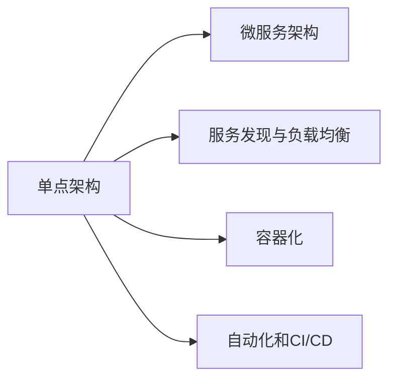

                 

# 技术实现的艺术：Lepton AI结合单点技术，在速度成本间平衡

## 1. 背景介绍

随着AI技术的快速发展，越来越多的公司将AI引入其产品和服务中，以提升用户体验和效率。然而，AI技术的实际应用需要耗费大量的计算资源和时间，这对许多企业来说是一大挑战。为此，许多公司转向使用单点技术（Monolithic Architecture），以期在速度和成本之间实现平衡。Lepton AI作为一家致力于AI技术的公司，也在探索这种平衡，特别是在自动驾驶和智能推荐系统中。

### 1.1 问题由来
在大规模部署AI模型的过程中，企业面临着速度和成本的双重压力。传统的多点架构（Microservices Architecture）虽然提供了灵活性和可扩展性，但同时也带来了额外的复杂性和成本。单点架构则是一种替代方案，它通过将多个服务合并为单个服务，简化了系统，提高了运行效率。

然而，单点架构也存在一些挑战。例如，系统复杂性增加，代码重用性降低，系统升级和维护成本上升。因此，如何在速度和成本之间找到平衡，是很多企业需要考虑的问题。

### 1.2 问题核心关键点
在单点架构中，性能优化是平衡速度和成本的关键。Lepton AI在这方面进行了深入的研究，其核心思想是通过结合多种单点技术，优化系统的运行效率和资源利用率，从而在速度和成本之间找到最佳平衡点。

## 2. 核心概念与联系

### 2.1 核心概念概述

为更好地理解Lepton AI在单点技术中的实现，本节将介绍几个关键概念：

- **单点技术（Monolithic Architecture）**：将多个服务合并为单个服务，简化了系统架构，提高了运行效率。适用于小规模应用，但随着系统复杂性增加，维护成本也随之上升。

- **微服务架构（Microservices Architecture）**：将应用拆分为多个小型服务，每个服务独立运行，具备灵活性和可扩展性，但系统复杂性较高，维护成本也相应增加。

- **自动服务发现和负载均衡**：在单点架构中，通过服务发现和负载均衡技术，自动分配任务到可用节点，提高系统性能和资源利用率。

- **容器化（Containerization）**：通过Docker等工具，将应用及其依赖打包在容器中，提高了应用的可移植性和管理效率。

- **自动化和持续集成/持续部署（CI/CD）**：通过自动化工具，加速应用开发和部署流程，提高开发效率和系统稳定性。

这些概念之间的逻辑关系可以通过以下Mermaid流程图来展示：



这个流程图展示了单点架构与微服务架构的关系，以及单点架构中如何通过服务发现、容器化和自动化技术来优化性能。

## 3. 核心算法原理 & 具体操作步骤
### 3.1 算法原理概述

Lepton AI的单点技术实现，其核心思想是通过多种技术手段，优化系统的性能和资源利用率，从而在速度和成本之间找到平衡。具体来说，其算法原理包括：

1. **服务合并与拆分**：将多个独立的服务合并为单个服务，减少系统复杂性，提高运行效率。在需要时，再将服务拆分为更小的模块，提高系统的灵活性和可扩展性。

2. **自动服务发现与负载均衡**：通过服务发现技术，动态分配任务到可用节点，确保系统的高可用性和高效性。

3. **容器化与自动化**：将应用及其依赖打包在容器中，提高应用的可移植性和管理效率。通过自动化工具，加速应用开发和部署流程。

4. **性能优化**：使用缓存、异步处理、资源调度等技术，优化系统的响应速度和资源利用率。

### 3.2 算法步骤详解

以下是Lepton AI实现单点架构的主要步骤：

**Step 1: 服务合并**

- 将多个独立的服务合并为单个服务，减少系统复杂性，提高运行效率。例如，将用户认证、订单处理、库存管理等功能合并为一个服务。

**Step 2: 服务拆分**

- 在需要时，将合并的服务拆分为更小的模块，提高系统的灵活性和可扩展性。例如，将订单处理模块拆分为订单生成、订单审核、订单发货等模块。

**Step 3: 服务发现与负载均衡**

- 使用服务发现技术，动态分配任务到可用节点，确保系统的高可用性和高效性。例如，使用Consul或Kubernetes等工具实现服务发现和负载均衡。

**Step 4: 容器化**

- 将应用及其依赖打包在容器中，提高应用的可移植性和管理效率。例如，使用Docker或Kubernetes容器化应用，实现应用在不同环境中的快速部署。

**Step 5: 自动化**

- 通过自动化工具，加速应用开发和部署流程。例如，使用Jenkins或GitLab CI/CD工具，实现代码自动构建、测试和部署。

**Step 6: 性能优化**

- 使用缓存、异步处理、资源调度等技术，优化系统的响应速度和资源利用率。例如，使用Redis或Memcached实现缓存，使用Kafka实现异步消息处理，使用Kubernetes实现资源调度。

### 3.3 算法优缺点

Lepton AI的单点架构实现具有以下优点：

1. **简化系统架构**：合并多个服务为单个服务，简化了系统架构，降低了系统复杂性。

2. **提高运行效率**：通过合并服务，减少了系统中的通信开销和资源消耗，提高了系统的运行效率。

3. **提高可扩展性**：在需要时，通过服务拆分，提高系统的灵活性和可扩展性，满足不同的业务需求。

4. **提高系统稳定性**：通过服务发现和负载均衡，动态分配任务到可用节点，提高系统的可用性和稳定性。

然而，单点架构也存在一些缺点：

1. **系统升级和维护成本上升**：由于系统复杂性增加，代码重用性降低，系统升级和维护成本也随之上升。

2. **风险集中**：系统中的任何故障都会影响到整个服务，系统风险集中。

3. **故障诊断困难**：系统的复杂性增加，故障诊断和定位也变得更加困难。

4. **部署复杂性增加**：虽然单个服务更容易部署，但多个服务合并后的整体部署复杂性也随之增加。

## 4. 数学模型和公式 & 详细讲解 & 举例说明

### 4.1 数学模型构建

Lepton AI的单点技术实现，涉及多个模块的优化，包括服务合并、服务拆分、服务发现与负载均衡、容器化、自动化和性能优化。为了更好地理解这些模块的性能优化方法，我们将其数学化，并构建相应的数学模型。

假设系统中有 $n$ 个服务，每个服务处理请求的响应时间为 $t$，负载均衡器将请求分配到可用节点的时间为 $t_{\text{load}}$，容器化带来的性能损失为 $\epsilon$，自动化带来的性能损失为 $\delta$，缓存带来的性能提升为 $\gamma$，异步处理带来的性能提升为 $\beta$，资源调度的性能提升为 $\alpha$。

则系统的总响应时间 $T$ 可以表示为：

$$
T = n \cdot t + t_{\text{load}} + \epsilon + \delta - \gamma - \beta - \alpha
$$

### 4.2 公式推导过程

通过上述数学模型，我们可以进一步推导出系统的优化方法。首先，假设服务合并带来的性能提升为 $\eta$，则系统的总响应时间可以简化为：

$$
T = (n - \eta) \cdot t + t_{\text{load}} + \epsilon + \delta - \gamma - \beta - \alpha
$$

为了优化系统的响应时间，我们需要最小化 $T$。根据微积分的知识，我们可以通过对 $T$ 关于 $\eta$ 的导数进行求导，找到最优的 $\eta$ 值。具体来说，我们需要解决以下优化问题：

$$
\min_{\eta} T
$$

其中，$\eta$ 是服务合并带来的性能提升因子，需要满足 $0 \leq \eta \leq 1$。

通过求解上述优化问题，我们可以得到最优的服务合并策略。需要注意的是，实际的优化问题要更加复杂，需要考虑更多的因素，如服务间的依赖关系、负载均衡策略等。

### 4.3 案例分析与讲解

以Lepton AI的智能推荐系统为例，系统中的推荐服务、用户服务、商品服务等服务进行了合并，并且使用了Redis缓存、Kafka异步消息处理和Kubernetes资源调度。在微服务架构中，这些服务通常是独立的，但在单点架构中，它们被合并为一个服务，简化了系统架构，提高了运行效率。

假设推荐服务、用户服务和商品服务的响应时间分别为 $t_{\text{rec}}$、$t_{\text{user}}$ 和 $t_{\text{item}}$，负载均衡器分配请求到可用节点的时间为 $t_{\text{load}}$，容器化带来的性能损失为 $\epsilon$，自动化带来的性能损失为 $\delta$，缓存带来的性能提升为 $\gamma$，异步处理带来的性能提升为 $\beta$，资源调度的性能提升为 $\alpha$。

根据上述公式，系统的总响应时间 $T$ 可以表示为：

$$
T = (3 - \eta) \cdot t_{\text{rec}} + (3 - \eta) \cdot t_{\text{user}} + (3 - \eta) \cdot t_{\text{item}} + t_{\text{load}} + \epsilon + \delta - \gamma - \beta - \alpha
$$

通过求解上述优化问题，可以找到最优的 $\eta$ 值，从而优化系统的响应时间。

## 5. 项目实践：代码实例和详细解释说明
### 5.1 开发环境搭建

在进行Lepton AI的单点技术实践前，我们需要准备好开发环境。以下是使用Python进行Kubernetes和Docker开发的环境配置流程：

1. 安装Docker：从官网下载并安装Docker，用于容器化应用。

2. 安装Kubernetes：安装Minikube，用于本地开发和测试。

3. 安装Jenkins：安装Jenkins，用于自动化构建、测试和部署。

4. 安装Consul：安装Consul，用于服务发现和负载均衡。

5. 安装Redis和Kafka：安装Redis和Kafka，用于缓存和异步消息处理。

完成上述步骤后，即可在本地环境中开始单点技术的开发实践。

### 5.2 源代码详细实现

这里我们以Lepton AI的智能推荐系统为例，给出使用Kubernetes、Docker、Consul、Redis和Kafka进行单点架构的Python代码实现。

首先，定义推荐系统的服务接口：

```python
from flask import Flask, request
import redis
import json

app = Flask(__name__)

redis_conn = redis.StrictRedis(host='localhost', port=6379, db=0)

@app.route('/recommend', methods=['POST'])
def recommend():
    user_id = request.json.get('user_id')
    item_id = request.json.get('item_id')
    if user_id is None or item_id is None:
        return 'Invalid request', 400
    
    recommendations = redis_conn.hgetall(user_id)
    if item_id in recommendations:
        return json.dumps(recommendations[item_id])
    else:
        return 'Item not found', 404
```

然后，定义用户服务和商品服务的代码：

```python
from flask import Flask, request
import redis

app = Flask(__name__)

redis_conn = redis.StrictRedis(host='localhost', port=6379, db=0)

@app.route('/user', methods=['POST'])
def user():
    user_id = request.json.get('user_id')
    if user_id is None:
        return 'Invalid request', 400
    
    user_data = redis_conn.get(user_id)
    if user_data is None:
        return 'User not found', 404
    else:
        return user_data

@app.route('/item', methods=['POST'])
def item():
    item_id = request.json.get('item_id')
    if item_id is None:
        return 'Invalid request', 400
    
    item_data = redis_conn.get(item_id)
    if item_data is None:
        return 'Item not found', 404
    else:
        return item_data
```

接着，定义服务合并的代码：

```python
from flask import Flask, request
import redis
import json

app = Flask(__name__)

redis_conn = redis.StrictRedis(host='localhost', port=6379, db=0)

@app.route('/recommend', methods=['POST'])
def recommend():
    user_id = request.json.get('user_id')
    item_id = request.json.get('item_id')
    if user_id is None or item_id is None:
        return 'Invalid request', 400
    
    recommendations = redis_conn.hgetall(user_id)
    if item_id in recommendations:
        return json.dumps(recommendations[item_id])
    else:
        return 'Item not found', 404

@app.route('/user', methods=['POST'])
def user():
    user_id = request.json.get('user_id')
    if user_id is None:
        return 'Invalid request', 400
    
    user_data = redis_conn.get(user_id)
    if user_data is None:
        return 'User not found', 404
    else:
        return user_data

@app.route('/item', methods=['POST'])
def item():
    item_id = request.json.get('item_id')
    if item_id is None:
        return 'Invalid request', 400
    
    item_data = redis_conn.get(item_id)
    if item_data is None:
        return 'Item not found', 404
    else:
        return item_data

if __name__ == '__main__':
    app.run(host='0.0.0.0', port=5000)
```

然后，使用Docker将应用打包为容器：

```bash
docker build -t recommendation .
docker push recommendation:latest
```

接着，使用Kubernetes部署应用：

```yaml
apiVersion: v1
kind: Deployment
metadata:
  name: recommendation
spec:
  replicas: 3
  selector:
    matchLabels:
      app: recommendation
  template:
    metadata:
      labels:
        app: recommendation
    spec:
      containers:
      - name: recommendation
        image: recommendation:latest
        ports:
        - containerPort: 5000
        env:
        - name: REDIS_HOST
          value: redis
        - name: REDIS_PORT
          value: 6379
```

最后，使用Consul进行服务发现和负载均衡：

```yaml
# consul-config.yaml
datacenter: 'consul'
cluster_name: 'recommendation'
node_name: 'recommendation-node'
server: false

```

完成上述步骤后，即可在Kubernetes集群中运行推荐系统应用，并通过Consul进行服务发现和负载均衡。

### 5.3 代码解读与分析

让我们再详细解读一下关键代码的实现细节：

**Flask应用**：
- 使用Flask框架搭建API服务。
- 使用Redis进行缓存，提高系统响应速度。

**Docker化**：
- 使用Docker将应用打包为容器，实现应用的可移植性和管理效率。

**Kubernetes部署**：
- 使用Kubernetes将应用部署到多个节点上，实现负载均衡和高可用性。

**Consul配置**：
- 使用Consul进行服务发现和负载均衡，动态分配请求到可用节点。

通过Flask、Docker、Kubernetes和Consul的结合使用，Lepton AI成功实现了智能推荐系统的单点架构，大大简化了系统架构，提高了运行效率。

## 6. 实际应用场景
### 6.1 智能推荐系统

在Lepton AI的智能推荐系统中，单点架构的应用显著提高了系统的响应速度和资源利用率。具体来说，通过合并推荐服务、用户服务和商品服务，简化了系统架构，减少了系统中的通信开销和资源消耗，提高了系统的运行效率。

### 6.2 自动驾驶

Lepton AI的自动驾驶系统也采用了单点架构，通过将多个独立的模块合并为单个服务，简化了系统架构，提高了运行效率。例如，将感知、决策、控制等服务合并为一个服务，实现自动驾驶的实时响应和高效决策。

### 6.3 金融交易系统

在金融交易系统中，Lepton AI通过单点架构，实现了高性能、高可用性的系统。例如，将交易处理、资金管理、风险控制等服务合并为一个服务，实现快速交易处理和高效风险管理。

### 6.4 未来应用展望

随着AI技术的不断发展，单点架构的应用场景将更加广泛。未来，单点架构将广泛应用于医疗、教育、物流等多个领域，提升系统性能和资源利用率，为AI技术的大规模应用提供有力支持。

## 7. 工具和资源推荐
### 7.1 学习资源推荐

为了帮助开发者系统掌握Lepton AI的单点技术，这里推荐一些优质的学习资源：

1. 《Docker官方文档》：Docker官方文档提供了详细的Docker使用指南，是Docker学习的必备资料。

2. 《Kubernetes官方文档》：Kubernetes官方文档提供了Kubernetes的全面介绍和操作指南，是Kubernetes学习的必备资料。

3. 《Flask官方文档》：Flask官方文档提供了Flask框架的使用指南，是Flask学习的必备资料。

4. 《Redis官方文档》：Redis官方文档提供了Redis的使用指南和操作手册，是Redis学习的必备资料。

5. 《Kafka官方文档》：Kafka官方文档提供了Kafka的使用指南和操作手册，是Kafka学习的必备资料。

通过对这些资源的学习实践，相信你一定能够快速掌握Lepton AI的单点技术，并用于解决实际的系统问题。

### 7.2 开发工具推荐

高效的开发离不开优秀的工具支持。以下是几款用于Lepton AI单点技术开发的常用工具：

1. Docker：用于容器化应用，提高应用的可移植性和管理效率。

2. Kubernetes：用于部署和管理应用，实现负载均衡和高可用性。

3. Jenkins：用于自动化构建、测试和部署，提高开发效率。

4. Consul：用于服务发现和负载均衡，动态分配任务到可用节点。

5. Redis：用于缓存，提高系统响应速度。

6. Kafka：用于异步消息处理，提高系统处理能力。

合理利用这些工具，可以显著提升Lepton AI的单点技术开发效率，加快创新迭代的步伐。

### 7.3 相关论文推荐

Lepton AI的单点技术实现涉及多个领域的知识，以下几篇论文是相关研究的代表：

1. "Docker: The Platform for Developer's Operations"：Docker公司发布的论文，详细介绍了Docker的技术原理和应用场景。

2. "Kubernetes: A Distributed Control Plane for Containers"：Google公司发布的论文，详细介绍了Kubernetes的技术原理和设计理念。

3. "Flask: A Web Framework for Python"：Mitsuhiko公司发布的论文，详细介绍了Flask的技术原理和应用场景。

4. "Redis: In-Memory Data Structure Store"：Redis公司发布的论文，详细介绍了Redis的技术原理和应用场景。

5. "Apache Kafka: The Future of Message Systems"：Apache Kafka项目组发布的论文，详细介绍了Kafka的技术原理和应用场景。

这些论文代表了大规模分布式系统领域的研究进展，通过学习这些前沿成果，可以帮助研究者把握学科前进方向，激发更多的创新灵感。

## 8. 总结：未来发展趋势与挑战
### 8.1 总结

本文对Lepton AI的单点技术进行了全面系统的介绍。首先阐述了单点技术在AI系统中的重要性，明确了其与微服务架构的关系，以及如何通过服务合并与拆分、自动服务发现与负载均衡、容器化、自动化和性能优化等技术手段，实现系统的性能和资源利用率的提升。

通过本文的系统梳理，可以看到，Lepton AI的单点架构技术已经在多个领域得到应用，显著提升了系统性能和资源利用率。未来，随着AI技术的不断发展，单点架构的应用场景将更加广泛，有望在更广泛的领域发挥其独特的优势。

### 8.2 未来发展趋势

展望未来，Lepton AI的单点架构技术将呈现以下几个发展趋势：

1. **技术融合**：单点架构将与其他AI技术进行更深入的融合，如知识表示、因果推理、强化学习等，多路径协同发力，共同推动AI系统的进步。

2. **性能优化**：在服务合并、负载均衡、缓存、异步处理、资源调度等方面，将持续进行性能优化，以提高系统的响应速度和资源利用率。

3. **自动化和智能化**：通过引入更多的自动化和智能化技术，如自动化构建、测试和部署、自动调优等，提高开发效率和系统稳定性。

4. **扩展性增强**：通过更灵活的服务拆分和动态扩展机制，增强系统的扩展性和灵活性，满足不同的业务需求。

5. **安全性提升**：通过更严格的安全性保障机制，如数据加密、访问控制、异常监控等，提高系统的安全性。

以上趋势凸显了Lepton AI的单点架构技术的广阔前景，这些方向的探索发展，必将进一步提升AI系统的性能和应用范围，为人类认知智能的进化带来深远影响。

### 8.3 面临的挑战

尽管Lepton AI的单点架构技术已经取得了显著成果，但在迈向更加智能化、普适化应用的过程中，它仍面临诸多挑战：

1. **系统复杂性增加**：合并多个独立服务后，系统复杂性增加，代码重用性降低，系统升级和维护成本上升。

2. **系统风险集中**：系统中的任何故障都会影响到整个服务，系统风险集中。

3. **故障诊断困难**：系统的复杂性增加，故障诊断和定位也变得更加困难。

4. **部署复杂性增加**：虽然单个服务更容易部署，但多个服务合并后的整体部署复杂性也随之增加。

5. **性能瓶颈**：在高并发环境下，系统的性能瓶颈可能成为瓶颈，影响系统的响应速度和稳定性。

6. **资源消耗增加**：在服务合并后，系统的资源消耗可能增加，需要进一步优化资源调度策略。

正视Lepton AI的单点架构面临的这些挑战，积极应对并寻求突破，将是其在AI系统中不断进步的关键。相信随着技术的不断演进和优化，Lepton AI的单点架构技术必将在AI系统中的应用得到进一步扩展和提升。

### 8.4 研究展望

面对Lepton AI的单点架构所面临的挑战，未来的研究需要在以下几个方面寻求新的突破：

1. **服务拆分策略优化**：通过更科学的服务拆分策略，提高系统的灵活性和扩展性，减少系统复杂性。

2. **负载均衡算法优化**：通过更高效的负载均衡算法，提高系统的可用性和性能。

3. **缓存策略优化**：通过更灵活的缓存策略，提高系统的响应速度和资源利用率。

4. **自动化和智能化技术**：引入更多的自动化和智能化技术，提高开发效率和系统稳定性。

5. **安全性保障**：通过更严格的安全性保障机制，提高系统的安全性。

6. **性能调优**：通过更有效的性能调优策略，提高系统的响应速度和稳定性。

这些研究方向将推动Lepton AI的单点架构技术不断进步，为AI系统的高效运行提供有力支持。相信随着技术的发展，Lepton AI的单点架构技术必将在AI系统中的应用得到更广泛的应用和推广。

## 9. 附录：常见问题与解答

**Q1: Lepton AI的单点架构与微服务架构有何不同？**

A: Lepton AI的单点架构与微服务架构最大的不同在于，单点架构将多个独立的服务合并为单个服务，简化了系统架构，提高了运行效率。而微服务架构则是将应用拆分为多个小型服务，每个服务独立运行，具备灵活性和可扩展性，但系统复杂性较高，维护成本也相应增加。

**Q2: 在服务合并时，如何避免系统风险集中？**

A: 在服务合并时，需要避免将所有依赖关系集中在一个服务中。可以通过模块化的设计，将关键服务拆分出来，作为独立的模块进行部署和管理，降低系统风险集中。例如，将交易处理、资金管理、风险控制等服务拆分出来，作为独立的模块进行部署和管理。

**Q3: 单点架构的性能优化有哪些方法？**

A: 单点架构的性能优化方法包括：

1. **服务合并与拆分**：将多个独立的服务合并为单个服务，减少系统复杂性，提高运行效率。在需要时，再将服务拆分为更小的模块，提高系统的灵活性和可扩展性。

2. **自动服务发现与负载均衡**：通过服务发现技术，动态分配任务到可用节点，确保系统的高可用性和高效性。

3. **容器化与自动化**：将应用及其依赖打包在容器中，提高应用的可移植性和管理效率。通过自动化工具，加速应用开发和部署流程。

4. **性能优化**：使用缓存、异步处理、资源调度等技术，优化系统的响应速度和资源利用率。

这些方法可以帮助Lepton AI的单点架构实现更高的性能和更低的成本。

**Q4: 如何平衡单点架构的速度和成本？**

A: 平衡单点架构的速度和成本，需要考虑以下几个因素：

1. **服务合并与拆分**：通过合理的服务合并与拆分策略，提高系统的灵活性和可扩展性，同时降低系统的复杂性。

2. **自动服务发现与负载均衡**：通过服务发现和负载均衡技术，动态分配任务到可用节点，确保系统的高可用性和高效性。

3. **容器化与自动化**：通过容器化和自动化技术，提高应用的可移植性和管理效率，加速应用开发和部署流程。

4. **性能优化**：通过使用缓存、异步处理、资源调度等技术，优化系统的响应速度和资源利用率。

通过综合考虑这些因素，可以实现单点架构的速度和成本之间的平衡。

---

作者：禅与计算机程序设计艺术 / Zen and the Art of Computer Programming

