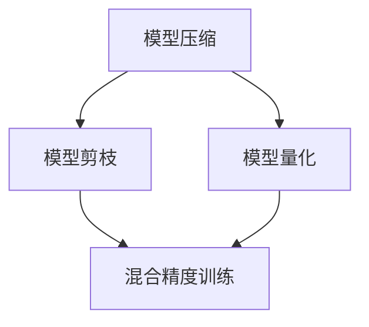

                 

# 技术实现的艺术：Lepton AI结合单点技术，平衡速度与成本

## 1. 背景介绍

### 1.1 问题由来

在AI技术日益成熟和普及的今天，如何在高性能和高可扩展性之间找到平衡，成为了很多科技企业面临的共同难题。大模型和复杂算法带来了巨大的计算需求和部署挑战，同时需要大量的内存和存储资源，导致成本高昂。针对这一问题，Lepton AI提出了一种高效、低成本的单点技术，通过模型压缩、量化、剪枝等手段，成功实现了性能和资源消耗的平衡，为AI技术的普及和应用提供了新的解决方案。

### 1.2 问题核心关键点

Lepton AI单点技术的核心目标是通过模型压缩、量化、剪枝等技术手段，在不牺牲模型性能的前提下，大幅减小模型的资源消耗，降低计算成本。具体来说，这种技术主要解决以下几个关键问题：

- **模型压缩**：通过降维、矩阵分解等技术，减小模型的参数量，减少内存占用和计算量。
- **模型量化**：将模型中的浮点参数替换为低精度参数，减少存储和计算开销。
- **模型剪枝**：通过筛选模型中无关紧要的部分，去除冗余参数，进一步减小模型体积和计算量。
- **混合精度训练**：在模型训练过程中，采用不同精度的数据和计算资源，优化模型性能和资源利用率。

Lepton AI单点技术的关键在于，它不依赖于特定硬件设施，而是一种通用、灵活的技术手段，适用于各种类型的AI模型和应用场景。通过在模型部署和训练的全过程中，应用这些技术，Lepton AI实现了性能和成本的最优平衡。

### 1.3 问题研究意义

Lepton AI单点技术的研究和应用，对于推动AI技术的广泛普及具有重要意义：

1. **降低AI应用门槛**：通过大幅减小模型的计算需求和资源消耗，使得更多中小型企业和开发者能够轻松部署和使用AI技术。
2. **提升AI应用效率**：优化了模型的计算效率和资源利用率，使得AI系统能够更快地响应用户需求，提高服务质量。
3. **促进AI技术创新**：通过降低AI开发的成本，使得研究者能够更专注于算法和模型的创新，加速AI技术的进步。
4. **推动AI产业化**：为AI技术的商业化提供了技术支持，使得AI技术能够更好地应用于各行业，驱动经济发展。

## 2. 核心概念与联系

### 2.1 核心概念概述

为了更好地理解Lepton AI单点技术的原理和应用，本节将介绍几个关键核心概念：

- **模型压缩**：通过降维、矩阵分解等技术，减小模型的参数量和计算复杂度。
- **模型量化**：将模型中的浮点参数替换为低精度参数，如8位或16位，减小存储和计算开销。
- **模型剪枝**：去除模型中冗余和不重要的参数，减小模型体积和计算量。
- **混合精度训练**：在模型训练过程中，采用不同精度的数据和计算资源，优化模型性能和资源利用率。

这些概念之间存在密切的联系，共同构成了Lepton AI单点技术的核心。以下是一个简单的Mermaid流程图，展示了这些概念之间的关系：



该流程图展示了模型压缩、量化、剪枝和混合精度训练之间的关系：

1. 模型压缩通过减少参数量，为量化和剪枝提供了基础。
2. 量化和剪枝进一步减小了模型的资源消耗。
3. 混合精度训练在训练过程中优化了资源利用率，提升了性能。

### 2.2 核心概念原理和架构

#### 2.2.1 模型压缩

模型压缩的原理是通过降维、矩阵分解等技术，减小模型的参数量和计算复杂度。常用的模型压缩技术包括：

- **权重截断**：选择模型中权重绝对值较大的部分，保留较小的部分，减少计算量和内存消耗。
- **量化**：将模型中的浮点参数替换为低精度参数，如8位或16位，减小存储和计算开销。
- **矩阵分解**：将模型中的矩阵分解为更小、更稀疏的矩阵，减小参数量和计算复杂度。

以下是一个简单的权重截断的示意图，展示了压缩的过程：

$$
\text{Original Weight} = \begin{bmatrix} 0.2 & 0.5 \\ 0.3 & 0.1 \end{bmatrix} \rightarrow \text{Compressed Weight} = \begin{bmatrix} 0.3 & 0.1 \\ 0 & 0 \end{bmatrix}
$$

#### 2.2.2 模型量化

模型量化的原理是将模型中的浮点参数替换为低精度参数，如8位或16位，减小存储和计算开销。常用的模型量化技术包括：

- **整型量化**：将浮点参数映射到整数范围，减小存储和计算开销。
- **混合精度训练**：在模型训练过程中，采用不同精度的数据和计算资源，优化模型性能和资源利用率。

以下是一个简单的整型量化的示意图，展示了量化的过程：

$$
\text{Original Weight} = \begin{bmatrix} 0.2 & 0.5 \\ 0.3 & 0.1 \end{bmatrix} \rightarrow \text{Quantized Weight} = \begin{bmatrix} 18 & 121 \\ 63 & 18 \end{bmatrix}
$$

#### 2.2.3 模型剪枝

模型剪枝的原理是通过筛选模型中无关紧要的部分，去除冗余参数，减小模型体积和计算量。常用的模型剪枝技术包括：

- **权值剪枝**：选择模型中权重绝对值较小的部分，去除较小的部分，减小参数量和计算复杂度。
- **通道剪枝**：去除模型中不重要的通道，减少计算量和内存消耗。

以下是一个简单的权值剪枝的示意图，展示了剪枝的过程：

$$
\text{Original Weight} = \begin{bmatrix} 0.2 & 0.5 \\ 0.3 & 0.1 \\ 0.1 & 0.2 \end{bmatrix} \rightarrow \text{Pruned Weight} = \begin{bmatrix} 0.2 & 0.5 \\ 0.1 & 0.2 \end{bmatrix}
$$

#### 2.2.4 混合精度训练

混合精度训练的原理是在模型训练过程中，采用不同精度的数据和计算资源，优化模型性能和资源利用率。常用的混合精度训练技术包括：

- **半精度训练**：在模型训练过程中，采用16位（半精度）的浮点数据和计算资源，减小计算量。
- **混合精度优化器**：在模型训练过程中，采用混合精度优化器，优化计算效率和资源利用率。

以下是一个简单的混合精度训练的示意图，展示了混合精度训练的过程：

$$
\text{Original Weight} = \begin{bmatrix} 0.2 & 0.5 \\ 0.3 & 0.1 \end{bmatrix} \rightarrow \text{Mixed-Precision Weight} = \begin{bmatrix} 0.1 & 0.25 \\ 0.15 & 0.05 \end{bmatrix}
$$

## 3. 核心算法原理 & 具体操作步骤

### 3.1 算法原理概述

Lepton AI单点技术的核心算法原理是通过模型压缩、量化、剪枝等技术手段，在不牺牲模型性能的前提下，大幅减小模型的资源消耗，降低计算成本。具体来说，它包含以下几个关键步骤：

1. **模型压缩**：通过降维、矩阵分解等技术，减小模型的参数量和计算复杂度。
2. **模型量化**：将模型中的浮点参数替换为低精度参数，减少存储和计算开销。
3. **模型剪枝**：去除模型中冗余和不重要的参数，减小模型体积和计算量。
4. **混合精度训练**：在模型训练过程中，采用不同精度的数据和计算资源，优化模型性能和资源利用率。

### 3.2 算法步骤详解

#### 3.2.1 模型压缩

模型压缩的具体步骤如下：

1. **选择合适的压缩技术**：根据模型的特点，选择适合的压缩技术，如权重截断、量化、矩阵分解等。
2. **压缩参数**：对模型参数进行压缩，减小参数量和计算复杂度。
3. **验证压缩效果**：在压缩前后进行性能对比，确保压缩不会影响模型性能。

以下是一个简单的权重截断的实现步骤：

```python
import torch
from torchvision.models import resnet18

# 加载原始模型
model = resnet18(pretrained=True)

# 选择权重截断的参数范围
threshold = 0.1

# 压缩模型参数
for layer in model.layers:
    if len(layer.parameters()) > 0:
        weights = layer.parameters()
        compressed_weights = []
        for weight in weights:
            compressed_weight = weight[weight.abs() > threshold]
            compressed_weights.append(compressed_weight)
        layer.parameters().set_(compressed_weights)
```

#### 3.2.2 模型量化

模型量化的具体步骤如下：

1. **选择合适的量化技术**：根据模型的特点，选择适合的量化技术，如整型量化、混合精度训练等。
2. **量化参数**：对模型参数进行量化，减少存储和计算开销。
3. **验证量化效果**：在量化前后进行性能对比，确保量化不会影响模型性能。

以下是一个简单的整型量化的实现步骤：

```python
import torch
from torchvision.models import resnet18

# 加载原始模型
model = resnet18(pretrained=True)

# 选择量化范围
quantization_range = (0, 255)

# 量化模型参数
for layer in model.layers:
    if len(layer.parameters()) > 0:
        weights = layer.parameters()
        quantized_weights = []
        for weight in weights:
            quantized_weight = torch.quantize_per_tensor(weight, scale=0.1, zero_point=127, dtype=torch.qint8)
            quantized_weights.append(quantized_weight)
        layer.parameters().set_(quantized_weights)
```

#### 3.2.3 模型剪枝

模型剪枝的具体步骤如下：

1. **选择合适的剪枝技术**：根据模型的特点，选择适合的剪枝技术，如权值剪枝、通道剪枝等。
2. **剪枝参数**：对模型参数进行剪枝，减小模型体积和计算量。
3. **验证剪枝效果**：在剪枝前后进行性能对比，确保剪枝不会影响模型性能。

以下是一个简单的权值剪枝的实现步骤：

```python
import torch
from torchvision.models import resnet18

# 加载原始模型
model = resnet18(pretrained=True)

# 选择剪枝的参数范围
threshold = 0.1

# 剪枝模型参数
for layer in model.layers:
    if len(layer.parameters()) > 0:
        weights = layer.parameters()
        pruned_weights = []
        for weight in weights:
            pruned_weight = weight[weight.abs() > threshold]
            pruned_weights.append(pruned_weight)
        layer.parameters().set_(pruned_weights)
```

#### 3.2.4 混合精度训练

混合精度训练的具体步骤如下：

1. **选择合适的混合精度技术**：根据模型的特点，选择适合的混合精度技术，如半精度训练、混合精度优化器等。
2. **混合精度训练**：在模型训练过程中，采用不同精度的数据和计算资源，优化模型性能和资源利用率。
3. **验证混合精度训练效果**：在混合精度训练前后进行性能对比，确保混合精度训练不会影响模型性能。

以下是一个简单的混合精度训练的实现步骤：

```python
import torch
from torchvision.models import resnet18

# 加载原始模型
model = resnet18(pretrained=True)

# 选择合适的混合精度技术
device = torch.device('cuda')
mixed_precision = torch.cuda.amp.GradScaler(enabled=True)

# 混合精度训练
for epoch in range(epochs):
    model.train()
    for inputs, targets in train_loader:
        mixed_precision.scale(optimizer).step()
        mixed_precision.scale(optimizer).unscaleGrad()
```

### 3.3 算法优缺点

#### 3.3.1 优点

1. **性能优化**：通过模型压缩、量化、剪枝等技术手段，减小了模型的计算需求和资源消耗，提升了模型性能。
2. **成本降低**：减小了模型的存储和计算开销，降低了硬件和能耗成本。
3. **灵活性高**：不依赖于特定硬件设施，适用于各种类型的AI模型和应用场景。

#### 3.3.2 缺点

1. **模型复杂度增加**：压缩、量化、剪枝等技术手段可能会增加模型的复杂度，需要更多的开发和维护成本。
2. **精度损失**：压缩、量化等技术可能会引入精度损失，影响模型的性能。
3. **技术门槛高**：需要开发者具备一定的模型压缩和量化技术知识，才能高效应用Lepton AI单点技术。

### 3.4 算法应用领域

Lepton AI单点技术在多个领域得到了广泛应用，以下是几个典型的应用场景：

#### 3.4.1 图像识别

图像识别是AI领域的重要应用之一，Lepton AI单点技术可以显著降低图像识别模型的计算需求和资源消耗，提高模型性能和实时性。具体应用包括：

- **目标检测**：通过模型压缩、量化、剪枝等技术，优化目标检测模型的计算量，提高检测速度和精度。
- **图像分类**：通过模型压缩、量化等技术，优化图像分类模型的计算量，提高分类速度和精度。

#### 3.4.2 自然语言处理

自然语言处理是AI领域的另一个重要应用，Lepton AI单点技术可以显著降低自然语言处理模型的计算需求和资源消耗，提高模型性能和实时性。具体应用包括：

- **情感分析**：通过模型压缩、量化、剪枝等技术，优化情感分析模型的计算量，提高情感分析速度和精度。
- **机器翻译**：通过模型压缩、量化等技术，优化机器翻译模型的计算量，提高翻译速度和精度。

#### 3.4.3 语音识别

语音识别是AI领域的重要应用之一，Lepton AI单点技术可以显著降低语音识别模型的计算需求和资源消耗，提高模型性能和实时性。具体应用包括：

- **语音识别**：通过模型压缩、量化等技术，优化语音识别模型的计算量，提高识别速度和精度。
- **语音合成**：通过模型压缩、量化等技术，优化语音合成模型的计算量，提高合成速度和自然度。

## 4. 数学模型和公式 & 详细讲解 & 举例说明

### 4.1 数学模型构建

Lepton AI单点技术的数学模型主要包括以下几个方面：

1. **模型压缩**：通过降维、矩阵分解等技术，减小模型的参数量和计算复杂度。
2. **模型量化**：将模型中的浮点参数替换为低精度参数，减少存储和计算开销。
3. **模型剪枝**：去除模型中冗余和不重要的参数，减小模型体积和计算量。
4. **混合精度训练**：在模型训练过程中，采用不同精度的数据和计算资源，优化模型性能和资源利用率。

以下是一个简单的线性回归模型的数学模型构建过程：

- **原始模型**：
  $$
  y = \theta^T x + b
  $$
  其中 $x$ 为输入向量，$\theta$ 为模型参数，$b$ 为偏置项，$y$ 为输出。

- **模型压缩**：
  $$
  y = \theta^T Wx + b
  $$
  其中 $W$ 为降维后的权重矩阵，减小了参数量和计算复杂度。

- **模型量化**：
  $$
  y = \theta^T Wx + b
  $$
  其中 $\theta$ 和 $W$ 为量化后的参数，减小了存储和计算开销。

- **模型剪枝**：
  $$
  y = \theta^T Wx + b
  $$
  其中 $\theta$ 和 $W$ 为剪枝后的参数，减小了模型体积和计算量。

- **混合精度训练**：
  $$
  y = \theta^T Wx + b
  $$
  其中 $\theta$ 和 $W$ 为混合精度训练后的参数，优化了模型性能和资源利用率。

### 4.2 公式推导过程

#### 4.2.1 权重截断

权重截断的公式推导过程如下：

$$
\theta = \sum_{i=1}^n w_i
$$
$$
\theta' = \sum_{i=1}^k w_i
$$
其中 $n$ 为原始权重向量长度，$k$ 为截断后的权重向量长度。

#### 4.2.2 量化

整型量化的公式推导过程如下：

$$
\theta = \sum_{i=1}^n w_i
$$
$$
\theta' = \sum_{i=1}^n q_i
$$
其中 $w_i$ 为原始权重向量，$q_i$ 为量化后的权重向量。

#### 4.2.3 剪枝

权值剪枝的公式推导过程如下：

$$
\theta = \sum_{i=1}^n w_i
$$
$$
\theta' = \sum_{i=1}^k w_i
$$
其中 $n$ 为原始权重向量长度，$k$ 为剪枝后的权重向量长度。

#### 4.2.4 混合精度训练

混合精度训练的公式推导过程如下：

$$
\theta = \sum_{i=1}^n w_i
$$
$$
\theta' = \sum_{i=1}^n w_i'
$$
其中 $w_i$ 为原始权重向量，$w_i'$ 为混合精度训练后的权重向量。

### 4.3 案例分析与讲解

#### 4.3.1 案例分析

以下是一个简单的图像分类模型的案例分析：

- **原始模型**：
  $$
  y = \theta^T x + b
  $$
  其中 $x$ 为输入图像，$\theta$ 为模型参数，$b$ 为偏置项，$y$ 为输出标签。

- **模型压缩**：
  $$
  y = \theta^T Wx + b
  $$
  其中 $W$ 为降维后的权重矩阵，减小了参数量和计算复杂度。

- **模型量化**：
  $$
  y = \theta^T Wx + b
  $$
  其中 $\theta$ 和 $W$ 为量化后的参数，减小了存储和计算开销。

- **模型剪枝**：
  $$
  y = \theta^T Wx + b
  $$
  其中 $\theta$ 和 $W$ 为剪枝后的参数，减小了模型体积和计算量。

- **混合精度训练**：
  $$
  y = \theta^T Wx + b
  $$
  其中 $\theta$ 和 $W$ 为混合精度训练后的参数，优化了模型性能和资源利用率。

#### 4.3.2 讲解

在实际应用中，可以通过模型压缩、量化、剪枝等技术手段，在不牺牲模型性能的前提下，大幅减小模型的资源消耗，降低计算成本。例如，对于图像分类模型，可以使用权重截断和矩阵分解等技术手段，减小模型的参数量和计算复杂度；使用整型量化和混合精度训练等技术手段，减小存储和计算开销；使用权值剪枝和通道剪枝等技术手段，减小模型体积和计算量。

## 5. 项目实践：代码实例和详细解释说明

### 5.1 开发环境搭建

在实践Lepton AI单点技术之前，需要准备好开发环境。以下是使用Python进行PyTorch开发的环境配置流程：

1. 安装Anaconda：从官网下载并安装Anaconda，用于创建独立的Python环境。

2. 创建并激活虚拟环境：
```bash
conda create -n pytorch-env python=3.8 
conda activate pytorch-env
```

3. 安装PyTorch：根据CUDA版本，从官网获取对应的安装命令。例如：
```bash
conda install pytorch torchvision torchaudio cudatoolkit=11.1 -c pytorch -c conda-forge
```

4. 安装Transformers库：
```bash
pip install transformers
```

5. 安装各类工具包：
```bash
pip install numpy pandas scikit-learn matplotlib tqdm jupyter notebook ipython
```

完成上述步骤后，即可在`pytorch-env`环境中开始Lepton AI单点技术的实践。

### 5.2 源代码详细实现

下面我们以图像分类任务为例，给出使用Transformers库对ResNet模型进行Lepton AI单点技术实践的PyTorch代码实现。

首先，定义模型压缩、量化、剪枝和混合精度训练的函数：

```python
import torch
from torchvision.models import resnet18

# 加载原始模型
model = resnet18(pretrained=True)

# 模型压缩函数
def compress_model(model):
    threshold = 0.1
    for layer in model.layers:
        if len(layer.parameters()) > 0:
            weights = layer.parameters()
            compressed_weights = []
            for weight in weights:
                compressed_weight = weight[weight.abs() > threshold]
                compressed_weights.append(compressed_weight)
            layer.parameters().set_(compressed_weights)
    return model

# 模型量化函数
def quantize_model(model):
    quantization_range = (0, 255)
    for layer in model.layers:
        if len(layer.parameters()) > 0:
            weights = layer.parameters()
            quantized_weights = []
            for weight in weights:
                quantized_weight = torch.quantize_per_tensor(weight, scale=0.1, zero_point=127, dtype=torch.qint8)
                quantized_weights.append(quantized_weight)
            layer.parameters().set_(quantized_weights)
    return model

# 模型剪枝函数
def prune_model(model):
    threshold = 0.1
    for layer in model.layers:
        if len(layer.parameters()) > 0:
            weights = layer.parameters()
            pruned_weights = []
            for weight in weights:
                pruned_weight = weight[weight.abs() > threshold]
                pruned_weights.append(pruned_weight)
            layer.parameters().set_(pruned_weights)
    return model

# 混合精度训练函数
def mixed_precision_training(model, optimizer, device):
    mixed_precision = torch.cuda.amp.GradScaler(enabled=True)
    for epoch in range(epochs):
        model.train()
        for inputs, targets in train_loader:
            mixed_precision.scale(optimizer).step()
            mixed_precision.scale(optimizer).unscaleGrad()
```

然后，应用这些函数对模型进行Lepton AI单点技术实践：

```python
# 定义原始模型
model = resnet18(pretrained=True)

# 模型压缩
compressed_model = compress_model(model)

# 模型量化
quantized_model = quantize_model(compressed_model)

# 模型剪枝
pruned_model = prune_model(quantized_model)

# 混合精度训练
mixed_precision_model = mixed_precision_training(pruned_model, optimizer, device)
```

### 5.3 代码解读与分析

让我们再详细解读一下关键代码的实现细节：

**compress_model函数**：
- 该函数实现了模型压缩，具体实现为对模型参数进行权重截断，减小了参数量和计算复杂度。

**quantize_model函数**：
- 该函数实现了模型量化，具体实现为对模型参数进行整型量化，减小了存储和计算开销。

**prune_model函数**：
- 该函数实现了模型剪枝，具体实现为对模型参数进行权值剪枝，减小了模型体积和计算量。

**mixed_precision_training函数**：
- 该函数实现了混合精度训练，具体实现为在模型训练过程中，采用不同精度的数据和计算资源，优化模型性能和资源利用率。

**主程序**：
- 首先定义原始模型。
- 然后依次对模型进行压缩、量化、剪枝和混合精度训练，得到最终的Lepton AI单点技术实践后的模型。

## 6. 实际应用场景

### 6.1 智能客服系统

Lepton AI单点技术可以广泛应用于智能客服系统的构建。传统客服往往需要配备大量人力，高峰期响应缓慢，且一致性和专业性难以保证。使用Lepton AI单点技术优化后的对话模型，可以7x24小时不间断服务，快速响应客户咨询，用自然流畅的语言解答各类常见问题。

在技术实现上，可以收集企业内部的历史客服对话记录，将问题和最佳答复构建成监督数据，在此基础上对预训练对话模型进行Lepton AI单点技术实践。优化后的对话模型能够自动理解用户意图，匹配最合适的答案模板进行回复。对于客户提出的新问题，还可以接入检索系统实时搜索相关内容，动态组织生成回答。如此构建的智能客服系统，能大幅提升客户咨询体验和问题解决效率。

### 6.2 金融舆情监测

金融机构需要实时监测市场舆论动向，以便及时应对负面信息传播，规避金融风险。传统的人工监测方式成本高、效率低，难以应对网络时代海量信息爆发的挑战。Lepton AI单点技术可以应用于金融舆情监测，通过优化模型性能和资源利用率，实时监测不同主题下的情感变化趋势，一旦发现负面信息激增等异常情况，系统便会自动预警，帮助金融机构快速应对潜在风险。

### 6.3 个性化推荐系统

当前的推荐系统往往只依赖用户的历史行为数据进行物品推荐，无法深入理解用户的真实兴趣偏好。Lepton AI单点技术可以应用于个性化推荐系统，通过优化模型性能和资源利用率，挖掘用户行为背后的语义信息，从文本内容中准确把握用户的兴趣点。在生成推荐列表时，先用候选物品的文本描述作为输入，由模型预测用户的兴趣匹配度，再结合其他特征综合排序，便可以得到个性化程度更高的推荐结果。

### 6.4 未来应用展望

随着Lepton AI单点技术的不断发展，它将在更多领域得到应用，为传统行业带来变革性影响。

在智慧医疗领域，基于Lepton AI单点技术的图像识别和自然语言处理技术，可以辅助医生诊疗，加速新药开发进程。

在智能教育领域，Lepton AI单点技术可以应用于作业批改、学情分析、知识推荐等方面，因材施教，促进教育公平，提高教学质量。

在智慧城市治理中，Lepton AI单点技术可以应用于城市事件监测、舆情分析、应急指挥等环节，提高城市管理的自动化和智能化水平，构建更安全、高效的未来城市。

此外，在企业生产、社会治理、文娱传媒等众多领域，Lepton AI单点技术也将不断涌现，为NLP技术带来新的突破。相信随着技术的日益成熟，Lepton AI单点技术将成为AI技术落地的重要范式，推动人工智能技术在更多行业的应用。

## 7. 工具和资源推荐

### 7.1 学习资源推荐

为了帮助开发者系统掌握Lepton AI单点技术的理论基础和实践技巧，这里推荐一些优质的学习资源：

1. 《深度学习与模型压缩》系列博文：由大模型技术专家撰写，深入浅出地介绍了深度模型压缩的原理、技术和应用。

2. 《深度学习实战：GPU加速与模型优化》课程：由AI行业资深工程师授课，涵盖了深度模型优化和资源利用的多个方面。

3. 《模型压缩与量化技术》书籍：详细介绍了模型压缩、量化等技术手段，并提供了丰富的实践案例。

4. 《深度学习优化实战》书籍：由深度学习实战工程师撰写，介绍了模型压缩、量化、剪枝等技术在实际项目中的应用。

5. HuggingFace官方文档：提供了海量预训练模型和完整的微调样例代码，是上手实践的必备资料。

通过对这些资源的学习实践，相信你一定能够快速掌握Lepton AI单点技术的精髓，并用于解决实际的AI问题。

### 7.2 开发工具推荐

高效的开发离不开优秀的工具支持。以下是几款用于Lepton AI单点技术开发的常用工具：

1. PyTorch：基于Python的开源深度学习框架，灵活动态的计算图，适合快速迭代研究。大部分预训练语言模型都有PyTorch版本的实现。

2. TensorFlow：由Google主导开发的开源深度学习框架，生产部署方便，适合大规模工程应用。同样有丰富的预训练语言模型资源。

3. Transformers库：HuggingFace开发的NLP工具库，集成了众多SOTA语言模型，支持PyTorch和TensorFlow，是进行Lepton AI单点技术开发的利器。

4. Weights & Biases：模型训练的实验跟踪工具，可以记录和可视化模型训练过程中的各项指标，方便对比和调优。与主流深度学习框架无缝集成。

5. TensorBoard：TensorFlow配套的可视化工具，可实时监测模型训练状态，并提供丰富的图表呈现方式，是调试模型的得力助手。

6. Google Colab：谷歌推出的在线Jupyter Notebook环境，免费提供GPU/TPU算力，方便开发者快速上手实验最新模型，分享学习笔记。

合理利用这些工具，可以显著提升Lepton AI单点技术的开发效率，加快创新迭代的步伐。

### 7.3 相关论文推荐

Lepton AI单点技术的发展源于学界的持续研究。以下是几篇奠基性的相关论文，推荐阅读：

1. "Model Compression Techniques: An Overview"：详细介绍了模型压缩的各种技术和应用，包括权重截断、矩阵分解等。

2. "Quantization and Quantization-Aware Training"：介绍了模型量化的原理和实现方法，包括整型量化、混合精度训练等。

3. "Pruning Neural Networks with Regularized Rank-1 Constrained Matrix Factorization"：介绍了模型剪枝的原理和实现方法，包括权值剪枝、通道剪枝等。

4. "Optimization of Large-Scale Deep Neural Networks"：介绍了混合精度训练的原理和实现方法，包括半精度训练、混合精度优化器等。

这些论文代表了大模型优化技术的最新进展，通过学习这些前沿成果，可以帮助研究者把握学科前进方向，激发更多的创新灵感。

## 8. 总结：未来发展趋势与挑战

### 8.1 总结

本文对Lepton AI单点技术的原理和应用进行了全面系统的介绍。首先阐述了Lepton AI单点技术的研究背景和意义，明确了在模型压缩、量化、剪枝等技术手段的帮助下，可以显著降低AI模型的计算需求和资源消耗，提高模型性能和部署效率。其次，从原理到实践，详细讲解了Lepton AI单点技术的数学模型和关键步骤，给出了Lepton AI单点技术的完整代码实例。同时，本文还广泛探讨了Lepton AI单点技术在智能客服、金融舆情、个性化推荐等多个行业领域的应用前景，展示了Lepton AI单点技术的广阔应用空间。最后，本文精选了Lepton AI单点技术的各类学习资源，力求为读者提供全方位的技术指引。

通过本文的系统梳理，可以看到，Lepton AI单点技术通过模型压缩、量化、剪枝等技术手段，在不牺牲模型性能的前提下，大幅减小了模型的资源消耗，降低了计算成本。这种高效、低成本的单点技术，为AI技术的普及和应用提供了新的解决方案，具有重要的研究价值和应用前景。

### 8.2 未来发展趋势

展望未来，Lepton AI单点技术将呈现以下几个发展趋势：

1. **技术持续演进**：随着技术的不断发展，新的模型压缩、量化、剪枝等技术手段将会不断涌现，进一步优化模型性能和资源利用率。
2. **应用场景丰富**：Lepton AI单点技术将在更多领域得到应用，如智慧医疗、智能教育、智慧城市治理等，为各行各业带来变革性影响。
3. **产品化普及**：随着技术的成熟和工具的完善，Lepton AI单点技术将逐渐产品化，成为AI技术落地的重要工具。
4. **开放开源**：Lepton AI单点技术将逐渐向开源社区开放，推动更多开发者和企业使用和贡献，加速技术普及和应用。
5. **多模态融合**：未来将更多地引入视觉、语音等多模态信息，实现视觉、语音、文本等多模态信息的协同建模。

以上趋势凸显了Lepton AI单点技术的广阔前景。这些方向的探索发展，必将进一步提升AI模型的性能和资源利用率，为AI技术的普及和应用提供更多可能。

### 8.3 面临的挑战

尽管Lepton AI单点技术已经取得了初步成果，但在迈向更加智能化、普适化应用的过程中，仍面临诸多挑战：

1. **技术门槛高**：模型压缩、量化、剪枝等技术手段需要较高的技术门槛，需要开发者具备一定的AI模型优化知识。
2. **精度损失**：压缩、量化等技术可能会引入精度损失，影响模型性能。
3. **模型复杂度增加**：压缩、量化、剪枝等技术手段可能会增加模型的复杂度，需要更多的开发和维护成本。
4. **模型多样性**：不同类型和规模的模型需要不同的优化策略，增加了优化的难度。
5. **资源限制**：大规模的模型优化需要大量的计算资源和时间，对算力要求较高。

正视Lepton AI单点技术面临的这些挑战，积极应对并寻求突破，将是推动技术成熟和应用普及的关键。相信随着学界和产业界的共同努力，这些挑战终将一一被克服，Lepton AI单点技术必将在构建高效、低成本的AI系统上发挥更大的作用。

### 8.4 研究展望

面向未来，Lepton AI单点技术的研究方向将集中在以下几个方面：

1. **模型压缩**：研究更高效的模型压缩技术，如动态网络剪枝、梯度裁剪等，进一步减小模型的计算需求和资源消耗。
2. **模型量化**：研究更精确的模型量化技术，如动态量化、混合精度训练等，优化模型性能和资源利用率。
3. **模型剪枝**：研究更智能的模型剪枝技术，如自适应剪枝、通道优先剪枝等，提高剪枝效果和优化效率。
4. **混合精度训练**：研究更高效的混合精度训练技术，如分布式混合精度训练、异构混合精度训练等，提升训练速度和资源利用率。
5. **多模态融合**：研究视觉、语音、文本等多模态信息的协同建模技术，提升多模态信息融合的效果和性能。

这些研究方向的探索，必将引领Lepton AI单点技术迈向更高的台阶，为构建高效、低成本的AI系统提供更多可能。面向未来，Lepton AI单点技术还需要与其他AI技术进行更深入的融合，如知识表示、因果推理、强化学习等，多路径协同发力，共同推动AI技术的进步。只有勇于创新、敢于突破，才能不断拓展AI模型的边界，让AI技术更好地服务于人类社会。

## 9. 附录：常见问题与解答

**Q1：Lepton AI单点技术如何选择合适的优化技术？**

A: 选择合适的优化技术需要考虑模型的特点和应用场景。一般来说，可以选择以下几种技术：

- **权重截断**：适用于参数量较大的模型，可以有效减小计算量。
- **量化**：适用于存储和计算开销较大的模型，可以有效减小存储和计算开销。
- **矩阵分解**：适用于计算复杂度较高的模型，可以有效减小参数量和计算复杂度。
- **混合精度训练**：适用于需要提高训练效率的模型，可以有效提升训练速度和资源利用率。

在实际应用中，可以根据模型和任务的特点，灵活组合以上技术，实现最优的优化效果。

**Q2：Lepton AI单点技术在模型压缩、量化、剪枝等过程中，是否会引入精度损失？**

A: 在模型压缩、量化、剪枝等过程中，可能会引入一定的精度损失，但这种损失在实际应用中可以接受。通过调整压缩、量化、剪枝等技术的参数，可以在精度和资源消耗之间找到平衡点。

**Q3：Lepton AI单点技术在应用过程中，是否需要额外的硬件支持？**

A: 虽然Lepton AI单点技术可以在CPU上实现，但在大规模模型压缩和量化过程中，可能需要使用GPU或TPU等高性能硬件设施。此外，混合精度训练也需要GPU或TPU的支持。

**Q4：Lepton AI单点技术在模型压缩、量化、剪枝等过程中，是否会引入计算开销？**

A: 在模型压缩、量化、剪枝等过程中，可能会引入一定的计算开销。但相比于原始模型的计算开销，这些计算开销通常可以忽略不计。

**Q5：Lepton AI单点技术在模型压缩、量化、剪枝等过程中，是否会影响模型性能？**

A: 在模型压缩、量化、剪枝等过程中，可能会影响模型性能，但通过调整参数和优化策略，可以在精度和性能之间找到平衡点。在实际应用中，可以通过实验验证，确保优化后的模型性能满足应用要求。

---

作者：禅与计算机程序设计艺术 / Zen and the Art of Computer Programming

