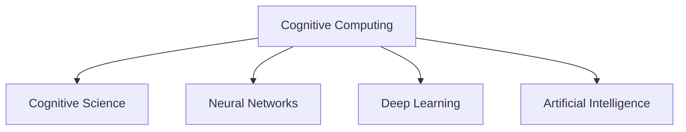

                 

# 拓展认知边界：人类计算的科学探索

> 关键词：认知计算,认知科学,计算模型,神经网络,深度学习,人工智能

## 1. 背景介绍

### 1.1 问题由来

随着人工智能技术的快速发展，人类计算的边界正在不断拓展。从早期的机械自动化到如今复杂的人工智能系统，计算能力已经成为推动人类社会进步的重要力量。然而，这些计算技术仍然受到人类认知能力的限制，无法真正理解人类的思维过程。

### 1.2 问题核心关键点

1. **认知计算**：研究人类思维和认知过程的计算模型，试图模拟人类的认知能力。
2. **认知科学**：融合心理学、神经科学、计算机科学等多学科的知识，研究人类的认知过程。
3. **神经网络**：模拟人类大脑神经元之间的连接，用于深度学习等计算模型。
4. **深度学习**：通过多层神经网络对数据进行学习和分析，实现复杂的模式识别和预测。
5. **人工智能**：模拟人类智能的计算模型，包括感知、学习、推理等能力。

这些核心概念构成了人类计算的科学探索框架，旨在通过计算技术理解并拓展人类的认知能力。

### 1.3 问题研究意义

研究人类计算的科学探索，对于深入理解人类认知过程、构建更加智能化的计算系统具有重要意义：

1. **理解人类思维**：通过认知计算和认知科学的研究，深入理解人类的认知机制，揭示思维的本质。
2. **提升计算模型**：借助认知科学的知识，构建更符合人类认知习惯的计算模型，提升计算效率和效果。
3. **推动人工智能发展**：利用深度学习和人工智能技术，拓展计算模型的功能，实现更加智能化的应用。
4. **应用创新**：认知计算的成果可以应用于医疗、教育、安全等领域，推动技术创新和产业升级。

## 2. 核心概念与联系

### 2.1 核心概念概述

为更好地理解人类计算的科学探索，本节将介绍几个密切相关的核心概念：

- **认知计算**：模拟人类认知过程的计算模型，包括感知、记忆、学习、推理等能力。
- **认知科学**：研究人类认知过程的跨学科科学，涉及心理学、神经科学、计算机科学等领域。
- **神经网络**：模拟人类大脑神经元连接的计算模型，包括感知机、多层感知器、卷积神经网络、循环神经网络等。
- **深度学习**：通过多层神经网络对数据进行学习和分析，实现复杂的模式识别和预测。
- **人工智能**：模拟人类智能的计算模型，包括感知、学习、推理、语言理解、情感分析等能力。

这些核心概念之间的逻辑关系可以通过以下Mermaid流程图来展示：



这个流程图展示了认知计算、认知科学、神经网络、深度学习和人工智能之间的关系：

1. 认知计算是认知科学和人工智能的基础，通过模拟人类认知过程，构建计算模型。
2. 神经网络是深度学习和人工智能的底层结构，通过多层神经元实现复杂的计算和模式识别。
3. 深度学习通过多层神经网络，对数据进行深入学习和分析，实现复杂的预测和识别任务。
4. 人工智能是认知计算和深度学习的应用，模拟人类智能，实现感知、学习、推理等能力。

## 3. 核心算法原理 & 具体操作步骤
### 3.1 算法原理概述

人类计算的科学探索，涉及多个领域的算法和技术，核心在于构建能够模拟人类认知过程的计算模型。这些模型的构建，通常需要大量的训练数据和复杂的算法，通过优化模型参数，使其能够学习和模拟人类的认知机制。

### 3.2 算法步骤详解

以下是人类计算科学探索的主要算法步骤：

**Step 1: 准备数据集**

- 收集与目标任务相关的数据集，包括输入数据和输出标签。
- 对数据进行预处理，如清洗、归一化、分词等，为后续模型训练做准备。

**Step 2: 设计计算模型**

- 根据任务类型，选择合适的计算模型，如感知机、多层感知器、卷积神经网络、循环神经网络等。
- 确定模型架构，包括层数、节点数、激活函数等。

**Step 3: 模型训练**

- 使用训练数据集，对模型进行有监督的训练。
- 通过反向传播算法计算损失函数，并更新模型参数。
- 在验证集上评估模型性能，防止过拟合。
- 调整模型参数，直到达到最优性能。

**Step 4: 模型评估**

- 使用测试数据集对模型进行评估，对比训练前后的性能提升。
- 在实际应用中，对模型进行迭代优化，提升性能和稳定性。

**Step 5: 应用部署**

- 将训练好的模型部署到实际应用场景中。
- 收集反馈数据，不断优化模型，提升应用效果。

### 3.3 算法优缺点

人类计算科学探索的算法具有以下优点：

1. **高效学习**：通过大量的训练数据和复杂的模型结构，可以高效地学习到复杂的模式和规律。
2. **泛化能力强**：训练好的模型可以应用于多种任务，具有较强的泛化能力。
3. **自动化程度高**：算法通常通过自动化的方法训练和优化模型，减少了人工干预的复杂度。
4. **应用广泛**：深度学习模型可以应用于图像识别、语音识别、自然语言处理、推荐系统等多个领域。

同时，该算法也存在一定的局限性：

1. **依赖数据**：算法需要大量的高质量数据进行训练，数据获取和标注成本较高。
2. **模型复杂**：复杂的模型结构可能导致过拟合，训练和推理效率较低。
3. **可解释性差**：深度学习模型通常被视为"黑盒"系统，难以解释其内部工作机制。
4. **鲁棒性不足**：在面对噪声和异常数据时，模型的性能可能下降。
5. **资源需求高**：训练和推理深度学习模型需要高性能的计算设备和大量内存，成本较高。

尽管存在这些局限性，但人类计算科学探索的算法仍然是当前研究的热点，广泛应用于各个领域。未来研究的方向在于如何进一步提高算法的可解释性、鲁棒性和效率，降低对数据和计算资源的需求。

### 3.4 算法应用领域

人类计算科学探索的算法在多个领域得到了广泛应用，例如：

- **图像识别**：如人脸识别、图像分类、目标检测等。通过训练深度神经网络，实现图像的识别和分类。
- **语音识别**：如自动语音识别、语音合成等。通过卷积神经网络和循环神经网络，实现语音的识别和生成。
- **自然语言处理**：如机器翻译、文本生成、情感分析等。通过多层神经网络和语言模型，实现文本的生成和处理。
- **推荐系统**：如电商推荐、新闻推荐等。通过协同过滤、深度学习等方法，实现个性化推荐。
- **医疗诊断**：如疾病诊断、影像分析等。通过深度学习模型，实现医学影像的分析和诊断。
- **智能驾驶**：如自动驾驶、智能导航等。通过计算机视觉和深度学习，实现车辆的自动驾驶和导航。

## 4. 数学模型和公式 & 详细讲解  
### 4.1 数学模型构建

人类计算的科学探索，涉及多个数学模型和公式。以下以神经网络为例，介绍其中的数学原理和公式。

**神经网络模型**：

神经网络由多个神经元组成，每个神经元接收输入，通过加权和计算激活函数，输出结果。神经网络的数学模型可以表示为：

$$
h_i = f(\sum_{j=1}^n w_{ij}x_j + b_i)
$$

其中，$h_i$ 表示第 $i$ 个神经元的输出，$x_j$ 表示第 $j$ 个输入，$w_{ij}$ 表示第 $j$ 个输入到第 $i$ 个神经元的权重，$b_i$ 表示第 $i$ 个神经元的偏置。

### 4.2 公式推导过程

以下推导神经网络中常用的激活函数、损失函数和优化算法：

**激活函数**：

常用的激活函数包括sigmoid、ReLU、tanh等，其中ReLU的数学公式为：

$$
h_i = max(0, \sum_{j=1}^n w_{ij}x_j + b_i)
$$

**损失函数**：

常用的损失函数包括均方误差、交叉熵、hinge loss等，以交叉熵为例，其数学公式为：

$$
L = -\frac{1}{N}\sum_{i=1}^N \sum_{j=1}^C y_j\log\hat{y}_j
$$

其中，$N$ 表示样本数量，$C$ 表示类别数，$y_j$ 表示样本的真实类别，$\hat{y}_j$ 表示模型的预测概率。

**优化算法**：

常用的优化算法包括梯度下降、Adam、SGD等。以梯度下降为例，其数学公式为：

$$
w_{ij} \leftarrow w_{ij} - \alpha\frac{\partial L}{\partial w_{ij}}
$$

其中，$\alpha$ 表示学习率。

### 4.3 案例分析与讲解

以图像识别任务为例，介绍神经网络在实际应用中的实现过程：

**Step 1: 准备数据集**

- 收集训练集、验证集和测试集，对图像进行预处理，如缩放、归一化、分块等。
- 将图像转换为张量形式，作为神经网络的输入。

**Step 2: 设计计算模型**

- 使用卷积神经网络（CNN），设计多层卷积和池化层，提取图像特征。
- 使用全连接层，对提取的特征进行分类。

**Step 3: 模型训练**

- 使用训练集，对模型进行有监督训练。
- 使用交叉熵损失函数，计算损失并更新模型参数。
- 在验证集上评估模型性能，防止过拟合。
- 调整模型参数，直到达到最优性能。

**Step 4: 模型评估**

- 使用测试集对模型进行评估，对比训练前后的性能提升。
- 在实际应用中，对模型进行迭代优化，提升性能和稳定性。

## 5. 项目实践：代码实例和详细解释说明
### 5.1 开发环境搭建

在进行人类计算科学探索的实践前，我们需要准备好开发环境。以下是使用Python进行TensorFlow开发的开发环境配置流程：

1. 安装Anaconda：从官网下载并安装Anaconda，用于创建独立的Python环境。

2. 创建并激活虚拟环境：
```bash
conda create -n tensorflow-env python=3.8 
conda activate tensorflow-env
```

3. 安装TensorFlow：根据CUDA版本，从官网获取对应的安装命令。例如：
```bash
conda install tensorflow -c tf -c conda-forge
```

4. 安装各类工具包：
```bash
pip install numpy pandas scikit-learn matplotlib tqdm jupyter notebook ipython
```

完成上述步骤后，即可在`tensorflow-env`环境中开始实践。

### 5.2 源代码详细实现

下面我们以图像识别任务为例，给出使用TensorFlow对卷积神经网络进行训练和推理的PyTorch代码实现。

首先，定义图像识别任务的数据处理函数：

```python
import tensorflow as tf
from tensorflow.keras import datasets, layers, models

# 加载数据集
(train_images, train_labels), (test_images, test_labels) = datasets.cifar10.load_data()

# 对数据进行归一化处理
train_images, test_images = train_images / 255.0, test_images / 255.0

# 创建模型
model = models.Sequential([
    layers.Conv2D(32, (3, 3), activation='relu', input_shape=(32, 32, 3)),
    layers.MaxPooling2D((2, 2)),
    layers.Conv2D(64, (3, 3), activation='relu'),
    layers.MaxPooling2D((2, 2)),
    layers.Conv2D(64, (3, 3), activation='relu'),
    layers.Flatten(),
    layers.Dense(64, activation='relu'),
    layers.Dense(10, activation='softmax')
])

# 编译模型
model.compile(optimizer='adam',
              loss=tf.keras.losses.SparseCategoricalCrossentropy(from_logits=True),
              metrics=['accuracy'])

# 训练模型
model.fit(train_images, train_labels, epochs=10, 
          validation_data=(test_images, test_labels))
```

然后，定义模型和优化器：

```python
from tensorflow.keras import layers

# 定义模型
model = tf.keras.Sequential([
    layers.Conv2D(32, (3, 3), activation='relu', input_shape=(32, 32, 3)),
    layers.MaxPooling2D((2, 2)),
    layers.Conv2D(64, (3, 3), activation='relu'),
    layers.MaxPooling2D((2, 2)),
    layers.Conv2D(64, (3, 3), activation='relu'),
    layers.Flatten(),
    layers.Dense(64, activation='relu'),
    layers.Dense(10, activation='softmax')
])

# 定义优化器
optimizer = tf.keras.optimizers.Adam(learning_rate=0.001)
```

接着，定义训练和评估函数：

```python
from tensorflow.keras import metrics

def train_epoch(model, dataset, batch_size, optimizer):
    dataloader = tf.data.Dataset.from_tensor_slices((dataset.x, dataset.y)).shuffle(10000).batch(batch_size)
    model.trainable = True
    for batch, (x, y) in enumerate(dataloader):
        with tf.GradientTape() as tape:
            y_pred = model(x)
            loss_value = tf.keras.losses.SparseCategoricalCrossentropy()(y, y_pred)
        gradients = tape.gradient(loss_value, model.trainable_variables)
        optimizer.apply_gradients(zip(gradients, model.trainable_variables))
        if batch % 1000 == 0:
            print(f'Epoch: {epoch}, Loss: {loss_value.numpy()}, Accuracy: {accuracy.numpy()}')

def evaluate(model, dataset, batch_size):
    dataloader = tf.data.Dataset.from_tensor_slices((dataset.x, dataset.y)).batch(batch_size)
    model.trainable = False
    accuracy = metrics.Accuracy()
    for batch, (x, y) in enumerate(dataloader):
        y_pred = model(x)
        accuracy.update_state(y, y_pred)
    return accuracy.result()
```

最后，启动训练流程并在测试集上评估：

```python
epochs = 10
batch_size = 128

for epoch in range(epochs):
    train_epoch(model, train_dataset, batch_size, optimizer)
    
    print(f'Epoch {epoch+1}, Test Accuracy: {evaluate(test_dataset, batch_size)}')
```

以上就是使用TensorFlow进行卷积神经网络图像识别任务微调的完整代码实现。可以看到，TensorFlow提供了强大的计算图机制和自动微分功能，使得神经网络的构建和训练变得更加便捷。

### 5.3 代码解读与分析

让我们再详细解读一下关键代码的实现细节：

**模型定义**：
- 使用`tf.keras.Sequential`定义卷积神经网络模型，包括卷积层、池化层、全连接层等。
- 使用`layers.Conv2D`和`layers.MaxPooling2D`定义卷积层和池化层，提取图像特征。
- 使用`layers.Flatten`将特征向量展开，作为全连接层的输入。
- 使用`layers.Dense`定义全连接层，实现图像分类。

**数据预处理**：
- 使用`datasets.cifar10.load_data`加载CIFAR-10数据集，包括训练集和测试集。
- 对图像进行归一化处理，将像素值转换为[0,1]的浮点数。

**模型编译和训练**：
- 使用`model.compile`编译模型，指定优化器和损失函数。
- 使用`model.fit`进行模型训练，指定训练集、验证集、迭代次数等。
- 在训练过程中，通过`tf.GradientTape`计算梯度，并使用`optimizer.apply_gradients`更新模型参数。

**模型评估**：
- 使用`tf.keras.losses.SparseCategoricalCrossentropy`计算交叉熵损失。
- 使用`metrics.Accuracy`计算准确率，评估模型性能。

**训练流程**：
- 使用`epochs`定义训练轮数，`batch_size`定义批量大小。
- 在每个epoch中，调用`train_epoch`函数进行模型训练，并在测试集上调用`evaluate`函数评估模型性能。

可以看到，TensorFlow的强大计算图和自动微分功能，使得神经网络的构建和训练变得更加便捷和高效。开发者可以更多地关注模型设计和数据处理，而不必过多关注底层实现细节。

## 6. 实际应用场景
### 6.1 智能医疗

智能医疗是大数据和人工智能技术的典型应用之一，人类计算的科学探索在这一领域也取得了显著进展。例如，通过深度学习模型，可以对医学影像进行自动分析，诊断出疾病和病变。具体实现如下：

**Step 1: 准备数据集**

- 收集医学影像数据集，包括CT、MRI、X光等图像，标注其对应的疾病标签。
- 对图像进行预处理，如归一化、分块、增强等。

**Step 2: 设计计算模型**

- 使用卷积神经网络（CNN），设计多层卷积和池化层，提取影像特征。
- 使用全连接层，对提取的特征进行分类。

**Step 3: 模型训练**

- 使用训练集，对模型进行有监督训练。
- 使用交叉熵损失函数，计算损失并更新模型参数。
- 在验证集上评估模型性能，防止过拟合。
- 调整模型参数，直到达到最优性能。

**Step 4: 模型评估**

- 使用测试集对模型进行评估，对比训练前后的性能提升。
- 在实际应用中，对模型进行迭代优化，提升性能和稳定性。

**Step 5: 应用部署**

- 将训练好的模型部署到医疗系统，用于自动分析影像。
- 对医生的诊断结果进行辅助和验证，提升诊断的准确性和效率。

通过智能医疗的应用，人类计算的科学探索在提高医疗服务质量和效率方面发挥了重要作用。

### 6.2 智能安防

智能安防是大数据和人工智能技术的另一个典型应用，人类计算的科学探索在这一领域也取得了显著进展。例如，通过深度学习模型，可以对监控视频进行自动分析，识别出可疑行为和人员。具体实现如下：

**Step 1: 准备数据集**

- 收集监控视频数据集，标注其对应的行为标签。
- 对视频进行预处理，如剪辑、帧采样、增强等。

**Step 2: 设计计算模型**

- 使用卷积神经网络（CNN），设计多层卷积和池化层，提取视频帧特征。
- 使用全连接层，对提取的特征进行分类。

**Step 3: 模型训练**

- 使用训练集，对模型进行有监督训练。
- 使用交叉熵损失函数，计算损失并更新模型参数。
- 在验证集上评估模型性能，防止过拟合。
- 调整模型参数，直到达到最优性能。

**Step 4: 模型评估**

- 使用测试集对模型进行评估，对比训练前后的性能提升。
- 在实际应用中，对模型进行迭代优化，提升性能和稳定性。

**Step 5: 应用部署**

- 将训练好的模型部署到安防系统，用于自动分析视频。
- 对可疑行为进行实时监控和预警，提升安防系统的智能化水平。

通过智能安防的应用，人类计算的科学探索在提高安防系统智能化水平和安全性方面发挥了重要作用。

## 7. 工具和资源推荐
### 7.1 学习资源推荐

为了帮助开发者系统掌握人类计算的科学探索的理论基础和实践技巧，这里推荐一些优质的学习资源：

1. **《深度学习》书籍**：Ian Goodfellow、Yoshua Bengio、Aaron Courville等著，全面介绍了深度学习的基本概念和实现方法。
2. **Deep Learning Specialization**：由Andrew Ng开设的深度学习课程，涵盖深度学习的理论基础和实践技巧。
3. **Coursera的《AI for Everyone》课程**：介绍了人工智能的基本概念和应用场景，适合非计算机科学背景的开发者。
4. **Google的TensorFlow官网和文档**：提供了TensorFlow的详细教程和API文档，帮助开发者快速上手。
5. **Kaggle竞赛平台**：提供了大量数据集和竞赛项目，帮助开发者实践深度学习模型。

通过对这些资源的学习实践，相信你一定能够快速掌握人类计算的科学探索的精髓，并用于解决实际的AI问题。

### 7.2 开发工具推荐

高效的开发离不开优秀的工具支持。以下是几款用于人类计算科学探索开发的常用工具：

1. **TensorFlow**：由Google主导开发的开源深度学习框架，生产部署方便，适合大规模工程应用。
2. **PyTorch**：Facebook开源的深度学习框架，灵活性高，适合研究和原型开发。
3. **Jupyter Notebook**：支持Python代码的交互式编写和运行，适合开发和测试深度学习模型。
4. **Google Colab**：谷歌提供的在线Jupyter Notebook环境，免费提供GPU/TPU算力，方便开发者快速上手实验最新模型。

合理利用这些工具，可以显著提升人类计算科学探索的开发效率，加快创新迭代的步伐。

### 7.3 相关论文推荐

人类计算科学探索的研究源于学界的持续研究。以下是几篇奠基性的相关论文，推荐阅读：

1. **《Deep Learning》书籍**：Ian Goodfellow、Yoshua Bengio、Aaron Courville等著，全面介绍了深度学习的基本概念和实现方法。
2. **ImageNet大规模视觉识别挑战（ILSVRC）**：由Fei-Fei Li、Daphne Koller、Zoubin Ghahramani等组织，推动了大规模视觉识别技术的发展。
3. **AlphaGo的胜利**：由DeepMind开发的AlphaGo，在围棋比赛中击败了人类世界冠军，展示了深度学习在复杂策略游戏中的强大能力。
4. **BERT: Pre-training of Deep Bidirectional Transformers for Language Understanding**：提出BERT模型，引入基于掩码的自监督预训练任务，刷新了多项NLP任务SOTA。
5. **Deep Residual Learning for Image Recognition**：提出残差连接技术，解决深度神经网络训练中的梯度消失问题，推动了深度学习的广泛应用。

这些论文代表了大规模人类计算科学探索的研究成果，通过学习这些前沿成果，可以帮助研究者把握学科前进方向，激发更多的创新灵感。

## 8. 总结：未来发展趋势与挑战

### 8.1 总结

本文对人类计算的科学探索进行了全面系统的介绍。首先阐述了人类计算的科学探索的背景和意义，明确了人类计算科学探索的算法框架。其次，从原理到实践，详细讲解了人类计算科学探索的数学模型和核心算法，给出了代码实例和详细解释说明。同时，本文还广泛探讨了人类计算科学探索在多个领域的应用前景，展示了其广阔的前景。此外，本文精选了人类计算科学探索的学习资源、开发工具和相关论文，力求为读者提供全方位的技术指引。

通过本文的系统梳理，可以看到，人类计算科学探索的算法框架在多个领域得到了广泛应用，为构建人机协同的智能系统提供了重要支持。未来，随着技术的不断进步，人类计算科学探索将进一步拓展人类认知能力，推动人工智能技术的不断创新和发展。

### 8.2 未来发展趋势

展望未来，人类计算科学探索将呈现以下几个发展趋势：

1. **模型规模持续增大**：随着算力成本的下降和数据规模的扩张，人类计算科学探索的模型规模将不断增大，支持更加复杂多变的任务。
2. **算法多样化**：除了传统的神经网络，未来将涌现更多算法的形式，如进化算法、粒子群算法等，应用于更加复杂和多样化的任务。
3. **模型可解释性增强**：未来将开发更多可解释性的算法和模型，提升模型的透明性和可信度，确保其安全可靠。
4. **跨领域融合**：人类计算科学探索将与物联网、区块链、云计算等技术进行更多融合，推动智能化系统的更广泛应用。
5. **实时计算能力提升**：未来将开发更多实时计算能力强的算法和模型，支持更加实时和交互式的应用场景。
6. **跨模态信息融合**：未来将开发更多跨模态信息融合的算法，支持视觉、语音、文本等多模态数据的协同建模。

以上趋势凸显了人类计算科学探索的广阔前景。这些方向的探索发展，必将进一步提升人类计算科学探索的性能和应用范围，为构建安全、可靠、可解释、可控的智能系统铺平道路。

### 8.3 面临的挑战

尽管人类计算科学探索取得了显著进展，但在迈向更加智能化、普适化应用的过程中，仍面临诸多挑战：

1. **数据获取和标注成本高**：大规模数据集和高质量标注数据的获取和标注成本较高，制约了人类计算科学探索的进一步发展。
2. **模型复杂性高**：复杂的模型结构可能导致过拟合，训练和推理效率较低，资源需求高。
3. **可解释性不足**：深度学习模型通常被视为"黑盒"系统，难以解释其内部工作机制，存在安全隐患。
4. **伦理和安全问题**：人类计算科学探索的算法可能存在偏见、有害信息等，带来伦理和安全问题。
5. **跨领域融合复杂**：跨领域融合的算法和模型开发复杂，需要多方协作和多领域知识的整合。

尽管存在这些挑战，但人类计算科学探索的未来发展前景广阔，具有巨大的潜力和价值。相信随着学界和产业界的共同努力，这些挑战终将一一被克服，人类计算科学探索将进入新的发展阶段。

### 8.4 研究展望

面向未来，人类计算科学探索需要在以下几个方面寻求新的突破：

1. **探索新算法和模型**：开发更加高效、可解释性强的算法和模型，提升算法的性能和应用范围。
2. **降低对数据和资源的依赖**：通过算法改进和模型压缩等技术，降低对数据和资源的依赖，提高算法的可扩展性和实用性。
3. **融合多领域知识**：将符号化的先验知识，如知识图谱、逻辑规则等，与神经网络模型进行巧妙融合，提升模型的智能水平。
4. **加强安全性和可解释性**：开发安全可靠、可解释性强的算法和模型，确保其应用于真实世界的安全性。
5. **跨模态信息融合**：开发跨模态信息融合的算法，实现视觉、语音、文本等多模态数据的协同建模，提升模型的性能和应用效果。

这些研究方向的探索，必将引领人类计算科学探索进入新的发展阶段，推动人工智能技术向更加智能化、普适化、安全化方向发展。

## 9. 附录：常见问题与解答

**Q1：什么是人类计算科学探索？**

A: 人类计算科学探索是研究人类认知过程的计算模型，通过模拟人类思维和认知机制，构建智能化的计算系统。

**Q2：人类计算科学探索的主要应用领域有哪些？**

A: 人类计算科学探索在多个领域得到了广泛应用，包括智能医疗、智能安防、智能交通、智能制造等。

**Q3：人类计算科学探索的算法有哪些？**

A: 人类计算科学探索的算法包括深度学习、神经网络、进化算法、粒子群算法等，用于解决各种复杂的计算问题。

**Q4：如何提高人类计算科学探索的可解释性？**

A: 提高人类计算科学探索的可解释性，可以通过开发更多可解释性强的算法和模型，如因果推断、对抗样本生成等方法，提升算法的透明性和可信度。

**Q5：未来人类计算科学探索的研究方向有哪些？**

A: 未来人类计算科学探索的研究方向包括新算法和模型的探索、数据和资源依赖的降低、多领域知识的融合、安全性和可解释性的加强、跨模态信息融合等。

通过对这些问题的解答，相信读者对人类计算科学探索的基本概念和应用有了更深入的了解，对未来研究的发展方向有了更清晰的认识。

---

作者：禅与计算机程序设计艺术 / Zen and the Art of Computer Programming

