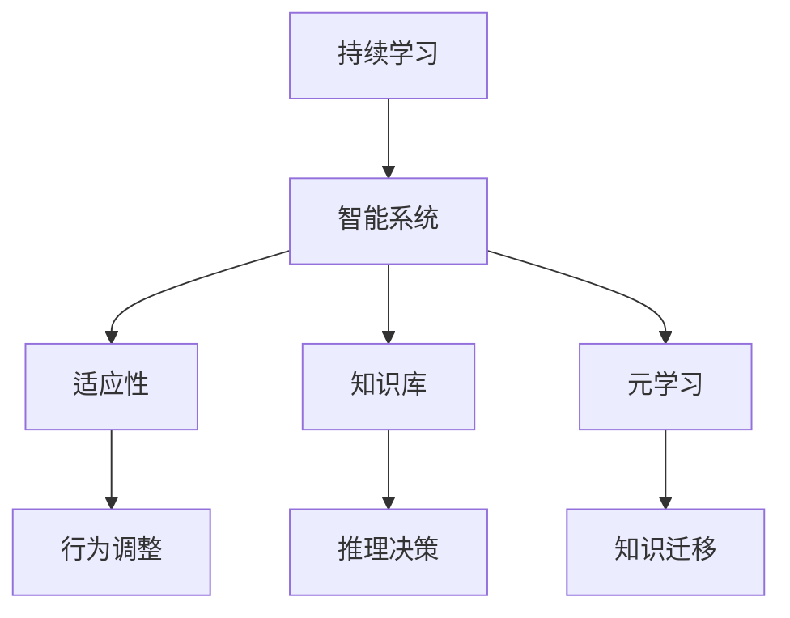

                 

# 持续学习：保持竞争力的秘诀

> 关键词：持续学习, 竞争优势, 终身学习, 适应性, 智能系统, 人工智能, 机器学习

## 1. 背景介绍

### 1.1 问题由来
在当今快速变化的商业环境中，企业需要在不断变化的市场需求和技术变革中保持竞争力。然而，技术日新月异，知识更新速度加快，传统的教育和工作培训方式已难以跟上这一节奏。面对这样的挑战，持续学习成为了企业竞争力的关键。

### 1.2 问题核心关键点
持续学习的关键在于建立一个能够快速适应新技术、新知识，并能不断自我更新、优化的智能系统。该系统能够利用现有知识和经验，不断吸收新信息，提升自身的预测和决策能力。

### 1.3 问题研究意义
持续学习不仅能够帮助企业快速响应市场变化，还能提升员工的职业素养和技能水平，推动组织创新和转型。持续学习理念在技术、教育、企业管理等多个领域均有广泛应用，成为现代企业和个人保持竞争力的重要策略。

## 2. 核心概念与联系

### 2.1 核心概念概述

为更好地理解持续学习机制，本节将介绍几个密切相关的核心概念：

- 持续学习（Continual Learning）：指系统能够在不遗忘已学习知识的前提下，适应新环境、新知识，并在此基础上进行学习的过程。
- 智能系统（Intelligent System）：指能够自主进行推理、决策、学习的自动化系统，通常基于机器学习、深度学习等技术实现。
- 适应性（Adaptability）：指系统能够根据外部环境变化快速调整内部行为和决策能力。
- 知识库（Knowledge Base）：指系统内部存储和组织知识的数据库，包括事实、规则、模型等。
- 元学习（Meta-Learning）：指学习如何学习，即通过学习过程的优化，提升新任务的适应能力。

这些概念之间的逻辑关系可以通过以下Mermaid流程图来展示：



这个流程图展示了一个智能系统的核心组件及其相互关系：

1. 持续学习驱动智能系统，使其能够适应新环境。
2. 适应性使系统能够根据外部变化调整内部行为。
3. 知识库存储系统内外部知识，供推理决策使用。
4. 元学习通过优化学习过程，提升新任务的学习效率。
5. 知识迁移实现新旧知识之间的迁移，避免遗忘旧知识。

## 3. 核心算法原理 & 具体操作步骤
### 3.1 算法原理概述

持续学习的核心思想是构建一个能够不断更新知识的智能系统，使其在面对新的任务或数据时，能够快速适应该环境，同时保持对已有知识的记忆。这一过程通常包含以下关键步骤：

1. **模型初始化**：选择合适的初始模型，如深度神经网络、知识图谱等。
2. **数据获取**：获取新任务或环境的数据，并将其划分为训练集、验证集和测试集。
3. **知识迁移**：通过微调、权重共享等方法，将已有知识迁移到新任务上。
4. **模型训练**：在新数据集上训练模型，优化参数以提升性能。
5. **适应性调整**：根据新任务的需求，调整模型结构和参数，提升系统适应性。
6. **知识更新**：在新知识被吸收后，更新知识库，供后续任务使用。

### 3.2 算法步骤详解

以下详细介绍持续学习的具体操作步骤：

**Step 1: 模型初始化**
- 选择合适的初始模型，如深度神经网络、知识图谱等。
- 加载并配置模型，如设置超参数、初始化权重等。

**Step 2: 数据获取**
- 收集新任务或环境的数据，并将其划分为训练集、验证集和测试集。
- 处理数据，包括预处理、特征提取、划分等。

**Step 3: 知识迁移**
- 通过微调、权重共享等方法，将已有知识迁移到新任务上。
- 例如，在迁移学习中，可以使用源任务和目标任务的相似性度量，选择最接近的预训练模型进行微调。

**Step 4: 模型训练**
- 在新数据集上训练模型，优化参数以提升性能。
- 可以使用基于梯度的优化算法（如SGD、Adam等）进行参数更新。

**Step 5: 适应性调整**
- 根据新任务的需求，调整模型结构和参数，提升系统适应性。
- 例如，对于大规模数据集，可以增加模型深度和宽度；对于实时性要求高的任务，可以选择轻量级模型。

**Step 6: 知识更新**
- 在新知识被吸收后，更新知识库，供后续任务使用。
- 例如，将新任务的模型参数和输出结果存储到知识库中，以便后续任务检索和使用。

### 3.3 算法优缺点

持续学习算法具有以下优点：
1. 适应性强：系统能够快速适应新任务和新环境，提升决策和推理能力。
2. 效率高：在已有知识基础上进行学习，通常需要较少的标注数据。
3. 可扩展性好：新任务或新环境可以不断加入到系统中，不断扩展其知识库。

同时，该算法也存在一些局限性：
1. 复杂度高：系统需要存储和管理大量的知识和模型，维护成本较高。
2. 鲁棒性差：系统在面临极端变化时，可能无法完全适应。
3. 数据依赖性强：新任务的性能很大程度上取决于数据质量。
4. 知识冲突风险：新旧知识可能存在冲突，需要进行谨慎处理。

尽管存在这些局限性，但就目前而言，持续学习仍然是实现智能系统长期稳定运行的重要手段。未来相关研究的重点在于如何进一步降低系统复杂度，提高鲁棒性和适应性。

### 3.4 算法应用领域

持续学习技术已经在多个领域得到了广泛应用，例如：

- 自动驾驶：车载智能系统需要不断学习新的驾驶环境和交通规则，提升驾驶决策的准确性。
- 医疗诊断：医疗系统需要不断更新知识库，根据新病例和研究进展调整诊断模型。
- 金融交易：金融模型需要实时更新市场数据和策略，以适应市场波动和变化。
- 教育培训：个性化学习系统需要根据学生反馈和成绩调整教学内容和方法，提升学习效果。
- 推荐系统：电商平台需要实时分析用户行为数据，动态调整推荐策略。

除了这些应用外，持续学习还被用于军事决策、智能制造、社会治理等诸多领域，推动了相关行业向智能化、自动化转型。

## 4. 数学模型和公式 & 详细讲解  
### 4.1 数学模型构建

为了更好地理解持续学习机制，本节将使用数学语言对持续学习过程进行更加严格的刻画。

假设当前任务的知识表示为 $K$，新任务的知识表示为 $K'$，系统的推理决策能力由模型 $M_{\theta}$ 表示，其中 $\theta$ 为模型参数。持续学习的过程可以表示为以下公式：

$$
M_{\theta} \leftarrow M_{\theta} + \alpha (K' - K)
$$

其中 $\alpha$ 为知识迁移的强度系数，控制已有知识和新知识的融合程度。持续学习的目标是最大化模型的预测能力 $P$，即：

$$
\max_{\theta} P(M_{\theta}, K')
$$

在实践中，我们可以通过优化损失函数来求解上述最优化问题。常见的损失函数包括交叉熵损失、均方误差损失等。

### 4.2 公式推导过程

以下我们以二分类任务为例，推导交叉熵损失函数及其梯度的计算公式。

假设模型 $M_{\theta}$ 在输入 $x$ 上的输出为 $\hat{y}=M_{\theta}(x) \in [0,1]$，表示样本属于正类的概率。真实标签 $y \in \{0,1\}$。则二分类交叉熵损失函数定义为：

$$
\ell(M_{\theta}(x),y) = -[y\log \hat{y} + (1-y)\log (1-\hat{y})]
$$

将其代入持续学习目标函数中，得：

$$
\max_{\theta} \sum_{i=1}^N \ell(M_{\theta}(x_i),y_i)
$$

在得到损失函数的梯度后，即可带入参数更新公式，完成模型的迭代优化。重复上述过程直至收敛，最终得到适应新任务的最优模型参数 $\theta^*$。

### 4.3 案例分析与讲解

以医疗诊断为例，分析持续学习在其中的应用。

**Step 1: 模型初始化**
- 选择适合医疗诊断的深度神经网络模型，如卷积神经网络（CNN）或循环神经网络（RNN）。
- 加载并配置模型，如设置超参数、初始化权重等。

**Step 2: 数据获取**
- 收集历史病人的临床数据和诊断结果，分为训练集、验证集和测试集。
- 处理数据，包括预处理、特征提取、划分等。

**Step 3: 知识迁移**
- 通过微调、权重共享等方法，将已有知识迁移到新任务上。
- 例如，在新任务上微调已有模型，使其适应新的数据分布和临床特征。

**Step 4: 模型训练**
- 在新数据集上训练模型，优化参数以提升性能。
- 可以使用基于梯度的优化算法（如SGD、Adam等）进行参数更新。

**Step 5: 适应性调整**
- 根据新任务的需求，调整模型结构和参数，提升系统适应性。
- 例如，增加模型深度和宽度，以适应更大规模的数据集。

**Step 6: 知识更新**
- 在新知识被吸收后，更新知识库，供后续任务使用。
- 例如，将新病人的诊断结果和特征存储到知识库中，供后续诊断任务检索和使用。

## 5. 项目实践：代码实例和详细解释说明
### 5.1 开发环境搭建

在进行持续学习实践前，我们需要准备好开发环境。以下是使用Python进行PyTorch开发的环境配置流程：

1. 安装Anaconda：从官网下载并安装Anaconda，用于创建独立的Python环境。

2. 创建并激活虚拟环境：
```bash
conda create -n pytorch-env python=3.8 
conda activate pytorch-env
```

3. 安装PyTorch：根据CUDA版本，从官网获取对应的安装命令。例如：
```bash
conda install pytorch torchvision torchaudio cudatoolkit=11.1 -c pytorch -c conda-forge
```

4. 安装PyTorch Lightning：用于加速模型训练和部署。
```bash
pip install pytorch-lightning
```

5. 安装各类工具包：
```bash
pip install numpy pandas scikit-learn matplotlib tqdm jupyter notebook ipython
```

完成上述步骤后，即可在`pytorch-env`环境中开始持续学习实践。

### 5.2 源代码详细实现

下面我们以医疗诊断任务为例，给出使用PyTorch Lightning对深度神经网络进行持续学习的PyTorch代码实现。

首先，定义医疗诊断任务的数据处理函数：

```python
from torch.utils.data import Dataset
from torch.utils.data import DataLoader

class MedicalDataset(Dataset):
    def __init__(self, data, labels):
        self.data = data
        self.labels = labels
        
    def __len__(self):
        return len(self.data)
    
    def __getitem__(self, item):
        return self.data[item], self.labels[item]
```

然后，定义模型和优化器：

```python
import torch.nn as nn
from torch.nn import Sequential

class MedicalModel(nn.Module):
    def __init__(self):
        super().__init__()
        self.layers = Sequential(
            nn.Conv2d(1, 64, 3), 
            nn.ReLU(),
            nn.MaxPool2d(2),
            nn.Conv2d(64, 128, 3),
            nn.ReLU(),
            nn.MaxPool2d(2),
            nn.Conv2d(128, 256, 3),
            nn.ReLU(),
            nn.MaxPool2d(2),
            nn.Conv2d(256, 1, 3),
            nn.Sigmoid()
        )
        
    def forward(self, x):
        return self.layers(x)

model = MedicalModel()

optimizer = torch.optim.Adam(model.parameters(), lr=0.001)
```

接着，定义训练和评估函数：

```python
from torch.utils.data import DataLoader
from tqdm import tqdm
from sklearn.metrics import accuracy_score

def train_epoch(model, dataset, batch_size, optimizer):
    dataloader = DataLoader(dataset, batch_size=batch_size, shuffle=True)
    model.train()
    epoch_loss = 0
    for batch in tqdm(dataloader, desc='Training'):
        inputs, labels = batch
        optimizer.zero_grad()
        outputs = model(inputs)
        loss = nn.BCELoss()(outputs, labels)
        epoch_loss += loss.item()
        loss.backward()
        optimizer.step()
    return epoch_loss / len(dataloader)

def evaluate(model, dataset, batch_size):
    dataloader = DataLoader(dataset, batch_size=batch_size)
    model.eval()
    preds, labels = [], []
    with torch.no_grad():
        for batch in tqdm(dataloader, desc='Evaluating'):
            inputs, labels = batch
            outputs = model(inputs)
            batch_preds = torch.sigmoid(outputs).to('cpu').tolist()
            batch_labels = labels.to('cpu').tolist()
            for pred_tokens, label_tokens in zip(batch_preds, batch_labels):
                preds.append(pred_tokens[:len(label_tokens)])
                labels.append(label_tokens)
    return accuracy_score(labels, preds)

# 训练循环
epochs = 10
batch_size = 32

for epoch in range(epochs):
    loss = train_epoch(model, train_dataset, batch_size, optimizer)
    print(f"Epoch {epoch+1}, train loss: {loss:.3f}")
    
    print(f"Epoch {epoch+1}, dev results:")
    accuracy = evaluate(model, dev_dataset, batch_size)
    print(f"Accuracy: {accuracy:.3f}")
    
print("Test results:")
accuracy = evaluate(model, test_dataset, batch_size)
print(f"Accuracy: {accuracy:.3f}")
```

以上就是使用PyTorch Lightning对深度神经网络进行医疗诊断任务持续学习的完整代码实现。可以看到，得益于PyTorch Lightning的强大封装，我们能够快速迭代优化模型、数据和算法，加速研究进程。

### 5.3 代码解读与分析

让我们再详细解读一下关键代码的实现细节：

**MedicalDataset类**：
- `__init__`方法：初始化数据和标签，为后续的批处理提供支持。
- `__len__`方法：返回数据集大小，用于循环遍历。
- `__getitem__`方法：返回单个数据点的输入和标签。

**MedicalModel类**：
- 定义了医疗诊断任务的深度神经网络模型，包含多个卷积层和激活函数。
- 在前向传播过程中，将输入数据经过多层卷积和池化操作，最终输出二分类结果。

**train_epoch和evaluate函数**：
- 定义训练和评估过程，分别在前向传播和反向传播中计算损失和梯度，优化模型参数。
- 使用tqdm库进行训练和评估过程中的进度条显示，增强用户体验。
- 使用sklearn库中的accuracy_score函数计算准确率，评估模型性能。

**训练循环**：
- 循环遍历多个epoch，在每个epoch内训练模型并评估其性能。
- 根据训练和验证集的性能，动态调整学习率、批次大小等超参数。
- 在测试集上测试最终模型，输出准确率作为最终的性能指标。

通过这些代码的实现，我们能够清晰地理解持续学习的基本流程和算法细节。进一步，通过调整模型结构、优化超参数、引入新数据集等策略，可以进一步提升模型的适应性和性能。

## 6. 实际应用场景
### 6.1 智能制造

在智能制造领域，持续学习技术能够显著提升生产线的智能化水平，提高生产效率和产品质量。

例如，通过对历史生产数据进行持续学习，智能制造系统能够实时调整生产参数，优化生产流程，降低生产成本。同时，系统还能根据新出现的生产问题，迅速调整故障处理策略，提高系统可靠性。

### 6.2 金融风险管理

金融风险管理需要实时处理大量的市场数据和交易记录，持续学习技术能够帮助系统快速适应市场变化，降低风险。

通过持续学习，金融模型能够不断更新市场数据和策略，提升风险预测的准确性。例如，在市场波动剧烈时，系统能够迅速调整投资组合，避免损失。同时，系统还能根据新交易记录，实时更新交易策略，降低操作风险。

### 6.3 智慧城市管理

智慧城市管理涉及大量传感器数据和实时交通流量的监测，持续学习技术能够帮助系统实时响应城市事件，优化城市管理。

通过持续学习，城市管理系统能够实时分析交通数据，动态调整交通信号灯，缓解交通拥堵。同时，系统还能根据天气变化，调整城市资源配置，提高城市运行效率。

### 6.4 未来应用展望

随着持续学习技术的不断发展，其在更多领域的应用前景将愈发广阔。未来，持续学习技术有望在以下领域实现更大突破：

- 自适应学习：开发能够自动调整学习策略的自适应学习算法，提升学习效率和效果。
- 跨领域迁移：实现跨领域知识的迁移，提升系统的通用性和泛化能力。
- 零样本学习：通过少样本和无样本学习，实现系统对新任务的快速适应。
- 知识图谱：利用知识图谱技术，提升系统的推理和决策能力，增强其适应性和可靠性。

## 7. 工具和资源推荐
### 7.1 学习资源推荐

为了帮助开发者系统掌握持续学习理论基础和实践技巧，这里推荐一些优质的学习资源：

1. Coursera《机器学习基础》课程：由斯坦福大学教授Andrew Ng主讲，系统介绍机器学习和深度学习的基本概念和算法。
2. DeepLearning.AI《深度学习与神经网络》课程：由吴恩达教授联合DeepLearning.AI推出，涵盖深度学习和持续学习的多个方面。
3. CS231n《卷积神经网络》课程：斯坦福大学开设的计算机视觉经典课程，深入讲解卷积神经网络及其在图像识别等任务中的应用。
4. 《深度学习》书籍：Ian Goodfellow等著，系统介绍深度学习的基本原理和应用。
5. 《强化学习》书籍：Richard S. Sutton等著，详细介绍强化学习和持续学习的理论基础和算法实现。

通过这些资源的学习实践，相信你一定能够掌握持续学习的精髓，并将其应用于实际项目中。

### 7.2 开发工具推荐

高效的开发离不开优秀的工具支持。以下是几款用于持续学习开发的常用工具：

1. PyTorch：基于Python的开源深度学习框架，灵活的动态计算图，适合快速迭代研究。
2. TensorFlow：由Google主导开发的开源深度学习框架，生产部署方便，适合大规模工程应用。
3. PyTorch Lightning：加速模型训练和部署，支持多种优化算法和自定义回调，是持续学习任务开发的利器。
4. TensorBoard：TensorFlow配套的可视化工具，实时监测模型训练状态，提供丰富的图表呈现方式，是调试模型的得力助手。
5. MLflow：用于追踪和记录机器学习实验，管理模型和数据，是持续学习实验跟踪的好帮手。
6. Amazon SageMaker：AWS推出的机器学习平台，支持持续学习和模型部署，适合企业级应用。

合理利用这些工具，可以显著提升持续学习任务的开发效率，加快创新迭代的步伐。

### 7.3 相关论文推荐

持续学习技术的发展源于学界的持续研究。以下是几篇奠基性的相关论文，推荐阅读：

1. A Survey on Continual Learning：Andriy Mnih等著，综述了持续学习的各个研究方向和算法。
2. Neural Network Adaptation in Partially Identified Regimes：Rashkin Bai等著，研究了在部分可识别情况下神经网络的适应性学习问题。
3. Continual Learning via Mixture-of-Experts：Mirco Ravanelli等著，通过专家混合模型提升持续学习的适应性。
4. Learning to Learn by Gradient Descent by Backpropagation：Ian Goodfellow等著，提出梯度下降的元学习算法。
5. Lifelong Learning with Vanishing Forward and Backward Gradients：Razvan Pascanu等著，研究了在持续学习中梯度消失的问题。

这些论文代表了大规模机器学习技术的发展脉络。通过学习这些前沿成果，可以帮助研究者把握学科前进方向，激发更多的创新灵感。

## 8. 总结：未来发展趋势与挑战

### 8.1 总结

本文对持续学习机制进行了全面系统的介绍。首先阐述了持续学习的核心思想和其在智能系统中的重要应用，明确了持续学习在提升系统适应性和保持竞争力的关键作用。其次，从原理到实践，详细讲解了持续学习的基本步骤和算法细节，给出了持续学习任务开发的完整代码实例。同时，本文还广泛探讨了持续学习在多个行业领域的应用前景，展示了其广阔的应用前景。

通过本文的系统梳理，可以看到，持续学习技术已经在多个领域实现了显著成效，推动了相关行业向智能化、自动化转型。未来，伴随持续学习技术的不断进步，其在更广泛的应用场景中必将继续发挥重要作用，推动人类社会向智能时代迈进。

### 8.2 未来发展趋势

展望未来，持续学习技术将呈现以下几个发展趋势：

1. 算法优化：开发更加高效、稳健的持续学习算法，提升学习效率和效果。
2. 跨领域知识迁移：实现跨领域知识的迁移，提升系统的通用性和泛化能力。
3. 自适应学习：开发能够自动调整学习策略的自适应学习算法，提高学习效率和效果。
4. 零样本学习：通过少样本和无样本学习，实现系统对新任务的快速适应。
5. 知识图谱：利用知识图谱技术，提升系统的推理和决策能力，增强其适应性和可靠性。

以上趋势凸显了持续学习技术的广阔前景。这些方向的探索发展，必将进一步提升智能系统的性能和应用范围，为人类社会带来深远影响。

### 8.3 面临的挑战

尽管持续学习技术已经取得了瞩目成就，但在迈向更加智能化、普适化应用的过程中，它仍面临诸多挑战：

1. 数据质量瓶颈：持续学习的效果很大程度上取决于数据质量，数据不完整、不准确等问题难以避免。
2. 计算资源限制：持续学习需要大量的计算资源，大模型和高精度计算设备的成本较高。
3. 模型复杂性：持续学习系统的复杂性较高，模型参数和知识库的管理维护难度较大。
4. 泛化能力不足：系统在面临极端变化时，可能无法完全适应，泛化能力有限。
5. 伦理和安全问题：持续学习系统的决策过程复杂，难以解释和审计，存在潜在的伦理和安全风险。

尽管存在这些挑战，但随着学界和产业界的共同努力，持续学习技术的局限性正在逐步被克服。相信在未来，持续学习技术必将在更广泛的领域得到应用，推动智能系统的创新和普及。

### 8.4 研究展望

面对持续学习所面临的种种挑战，未来的研究需要在以下几个方面寻求新的突破：

1. 数据增强和数据清洗：开发数据增强和清洗算法，提升数据质量，减少噪声和缺失值。
2. 模型压缩和优化：通过模型压缩和优化，降低计算资源需求，提升持续学习系统的效率。
3. 自适应学习算法：开发更加自适应的学习算法，自动调整学习策略，提升学习效率和效果。
4. 跨领域知识融合：将跨领域知识与持续学习技术结合，提升系统的通用性和泛化能力。
5. 可解释性和安全性：开发可解释性和安全性强的持续学习系统，确保决策过程透明、可审计。

这些研究方向的探索，必将引领持续学习技术迈向更高的台阶，为智能系统带来更大的竞争优势和发展空间。

## 9. 附录：常见问题与解答

**Q1：持续学习是否适用于所有任务？**

A: 持续学习技术在大多数任务上都能取得一定的效果，但对于一些特别复杂的任务，如深度神经网络、大规模知识图谱等，持续学习的效果可能有限。此时可以考虑其他机器学习范式，如半监督学习、强化学习等。

**Q2：如何选择合适的持续学习算法？**

A: 选择合适的持续学习算法需要根据具体任务和数据特点进行选择。例如，对于数据分布变化较少的任务，可以选择基于重加权的方法；对于数据分布变化较大的任务，可以选择基于动态网络结构的方法。

**Q3：持续学习系统如何保持高效性？**

A: 持续学习系统的效率很大程度上取决于数据质量、模型复杂度和计算资源。可以通过数据增强、模型压缩、优化算法等方法，提升持续学习系统的效率。

**Q4：持续学习系统的安全性如何保障？**

A: 持续学习系统的安全性保障主要依赖于模型可解释性、数据隐私保护和决策透明性。可以通过引入伦理导向的评估指标、数据脱敏等措施，增强系统的安全性。

**Q5：持续学习系统如何应对数据分布变化？**

A: 持续学习系统需要根据新数据的分布特征，动态调整模型结构和参数。例如，可以通过迁移学习、多任务学习等方法，提升系统对新数据分布的适应能力。

通过这些问题的解答，相信你对持续学习的核心概念和实践技巧有了更深入的理解。未来，持续学习技术将带来更多的创新和突破，推动智能系统的不断发展。

---

作者：禅与计算机程序设计艺术 / Zen and the Art of Computer Programming

