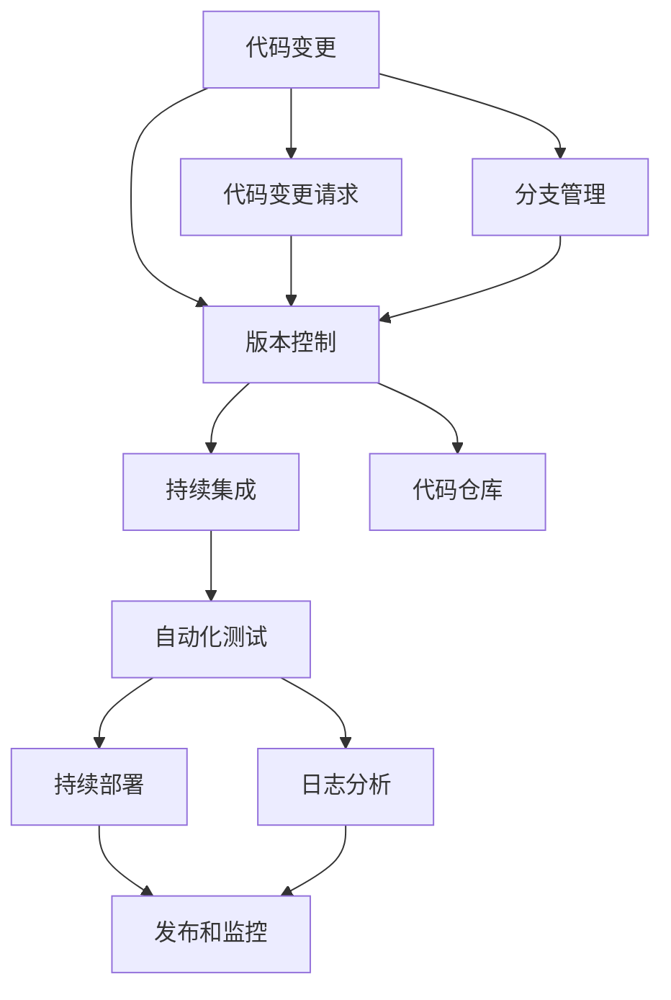

                 

# 持续集成和持续部署：自动化软件发布

> 关键词：持续集成(CI), 持续部署(CD), 自动化, 软件发布, DevOps, Jenkins, GitLab, Kubernetes

## 1. 背景介绍

### 1.1 问题由来

随着软件开发规模的日益增大，软件发布和部署的复杂性不断提升。传统的手工部署方式容易出错，且效率低下。而持续集成(CI)和持续部署(CD)方法，则能够自动化地进行代码编译、测试和发布，极大地提高了软件交付的稳定性和效率。

在过去十年中，DevOps（Development & Operations）理念和实践得到了快速普及和应用。DevOps旨在通过自动化和优化软件开发的全生命周期，提升团队协作效率，缩短发布周期，从而加速产品上市速度和用户反馈迭代。

然而，尽管CI/CD方法已经广泛应用，但其实施效果和落地场景仍存在诸多差异。如何在不同的应用场景中，高效部署和维护CI/CD流程，仍然需要持续的探索和实践。本文将详细探讨CI/CD的核心概念和实践流程，帮助读者理解其原理和应用，提高软件开发和发布效率。

## 2. 核心概念与联系

### 2.1 核心概念概述

持续集成和持续部署（CI/CD）是一套自动化软件发布的方法，通过在代码变更过程中，自动执行代码构建、测试和部署，加速产品上市速度，提升交付质量。

- **持续集成（CI）**：指在代码变更后，自动执行代码构建、测试，将变更后的代码合并到主分支，保证软件的稳定性和可集成性。
- **持续部署（CD）**：指在通过CI测试后，自动将代码部署到目标服务器，实现快速发布和回滚。

CI/CD的实施依赖于一系列工具和技术的支持，主要包括：

- **版本控制系统（如Git）**：管理代码变更历史和分支。
- **持续集成工具（如Jenkins、GitLab CI）**：自动化执行构建和测试任务。
- **容器化技术（如Docker、Kubernetes）**：实现代码和环境的隔离与复用。
- **自动化测试工具（如JUnit、Selenium）**：确保软件质量。
- **部署工具（如Ansible、Puppet）**：自动化配置和部署环境。

通过这些工具的协同工作，CI/CD能够实现代码变更的自动化管理和快速交付。

### 2.2 核心概念原理和架构的 Mermaid 流程图(Mermaid 流程节点中不要有括号、逗号等特殊字符)



这个流程图展示了CI/CD的基本流程：

1. 代码变更：开发人员在代码库中进行变更，提交变更请求。
2. 版本控制：通过版本控制系统管理代码变更和分支。
3. 持续集成：在代码提交后，自动执行构建和测试，确保代码变更符合项目标准。
4. 自动化测试：执行测试用例，验证代码质量。
5. 持续部署：通过自动化工具部署变更后的代码到目标服务器。
6. 发布和监控：将部署后的代码发布到生产环境，并进行监控和日志分析。

CI/CD的实现依赖于有效的工具链和良好的实践规范，以确保其高效运行。

## 3. 核心算法原理 & 具体操作步骤

### 3.1 算法原理概述

CI/CD的实现基于以下几个关键算法原理：

1. **流水线（Pipeline）**：通过定义一系列任务（如构建、测试、部署）的执行顺序，实现自动化工作流程。
2. **依赖管理**：通过依赖管理工具（如Maven、npm），确保项目依赖的准确性和一致性。
3. **版本控制**：通过版本控制系统（如Git）管理代码变更和分支，支持快速回滚和合并。
4. **容器化**：通过容器技术（如Docker）实现代码和环境的隔离和复用，简化部署过程。
5. **自动化测试**：通过自动化测试工具（如JUnit、Selenium）确保软件质量，提升发布可靠性。

通过这些算法原理，CI/CD能够自动化地进行代码变更的各个环节，提升软件交付的速度和质量。

### 3.2 算法步骤详解

1. **配置持续集成流程**：
   - 定义代码仓库，并配置持续集成工具（如Jenkins、GitLab CI）。
   - 定义构建任务，自动执行编译和测试。
   - 配置版本控制系统，支持代码变更管理和分支合并。

2. **编写自动化测试脚本**：
   - 编写自动化测试脚本（如JUnit、Selenium），确保代码质量。
   - 配置测试用例，自动执行测试并生成报告。

3. **实现持续部署流程**：
   - 配置自动化部署工具（如Ansible、Puppet），自动部署变更后的代码。
   - 使用容器化技术（如Docker），实现代码和环境的隔离和复用。

4. **监控和日志分析**：
   - 配置日志分析工具（如ELK Stack、Grafana），监控部署过程和系统运行状态。
   - 使用自动化监控工具（如Nagios、Prometheus），及时发现和解决故障。

### 3.3 算法优缺点

持续集成和持续部署具有以下优点：

1. **提高交付速度**：通过自动化流程，快速集成和部署代码变更，缩短发布周期。
2. **提升软件质量**：自动化测试确保代码质量，减少人为错误。
3. **支持持续反馈**：实时监控系统运行状态，快速响应故障和需求变更。

但同时，CI/CD也存在一些缺点：

1. **依赖于工具链**：CI/CD的实现依赖于各种工具和插件，工具链的稳定性和兼容性问题可能影响流程的运行。
2. **配置复杂**：需要配置和维护多个工具和插件，增加了管理成本。
3. **成本较高**：高水平配置和管理成本，可能不适合小型项目。

### 3.4 算法应用领域

CI/CD方法广泛应用于软件开发、测试和部署的各个环节，尤其在以下领域效果显著：

1. **云计算平台**：如AWS、Azure等云服务提供商，支持基于CI/CD的自动化部署和运维。
2. **DevOps团队**：通过CI/CD自动化，提升团队协作效率和发布速度。
3. **企业级应用**：大型企业应用复杂多样，通过CI/CD进行高效管理和发布。
4. **开源项目**：开源社区广泛采用CI/CD，确保代码质量和社区贡献。
5. **移动应用**：通过CI/CD进行快速迭代和发布，提升移动应用的开发效率。

## 4. 数学模型和公式 & 详细讲解 & 举例说明

### 4.1 数学模型构建

CI/CD的实现主要依赖于自动化流程和配置管理，因此数学模型构建涉及的主要是流程管理和配置优化。

定义一个典型的CI/CD流水线，包含以下几个关键阶段：

1. **构建阶段**：执行代码编译和依赖下载。
2. **测试阶段**：执行自动化测试用例，验证代码质量。
3. **部署阶段**：将代码部署到目标服务器。
4. **发布阶段**：将部署后的代码发布到生产环境。
5. **监控阶段**：监控部署过程和系统运行状态。

### 4.2 公式推导过程

设$n$为代码变更的总数，$k$为CI流水线的阶段数，每个阶段的执行时间分别为$t_1, t_2, ..., t_k$。假设每个阶段的执行时间是独立的，且每个阶段的成功概率为$p_i$，则总的时间期望为：

$$
E = \sum_{i=1}^k p_i t_i + (1 - p_i) \sum_{i=1}^k t_i
$$

其中，$p_i$代表第$i$阶段的成功概率，$t_i$代表第$i$阶段的执行时间。通过优化$p_i$和$t_i$，可以提升总的时间期望，加速软件交付。

### 4.3 案例分析与讲解

假设一个Web应用项目，包含如下阶段：

1. 构建阶段：编译代码，时间期望为10分钟。
2. 测试阶段：执行Selenium自动化测试，时间期望为20分钟，成功概率为90%。
3. 部署阶段：使用Ansible部署代码，时间期望为5分钟，成功概率为95%。
4. 发布阶段：将部署后的代码发布到生产环境，时间期望为10分钟，成功概率为98%。
5. 监控阶段：监控部署过程和系统运行状态，时间期望为5分钟，成功概率为100%。

根据上述数据，计算总的时间期望：

$$
E = 10 + (1-0.9) \times (10 + 20 + 5 + 10) + 5 = 20 + 0.1 \times 45 + 5 = 34.5 \text{分钟}
$$

通过优化测试阶段和部署阶段的成功概率，可以进一步缩短总的时间期望，提高交付速度。

## 5. 项目实践：代码实例和详细解释说明

### 5.1 开发环境搭建

在开始CI/CD实践前，我们需要准备好开发环境。以下是使用Jenkins和Docker搭建CI/CD环境的流程：

1. 安装Jenkins：从官网下载并安装Jenkins，配置Jenkins系统。
2. 安装Docker：从官网下载并安装Docker，配置Docker主机。
3. 安装Kubernetes：从官网下载并安装Kubernetes，配置Kubernetes集群。
4. 安装Ansible：从官网下载并安装Ansible，配置Ansible主机。

完成上述步骤后，即可在Jenkins上配置CI/CD流程，并使用Docker、Kubernetes和Ansible实现自动化部署和运维。

### 5.2 源代码详细实现

以下是一个典型的CI/CD配置文件，展示如何在Jenkins上配置构建、测试和部署流程：

```yaml
# Jenkinsfile

pipeline {
    agent any
    stages {
        stage('构建') {
            steps {
                withDocker() {
                    sh 'docker build -t myapp .'
                }
            }
        }
        stage('测试') {
            steps {
                withDocker() {
                    sh 'docker run -it myapp /bin/bash -c "pytest tests/"'
                }
            }
        }
        stage('部署') {
            steps {
                withAnsible() {
                    withContainer('myapp') {
                        sh 'ansible-playbook deploy.yml'
                    }
                }
            }
        }
    }
}
```

上述配置文件定义了三个阶段：构建、测试和部署。在每个阶段中，使用Docker容器进行代码构建和测试，使用Ansible进行自动化部署。

### 5.3 代码解读与分析

让我们再详细解读一下关键代码的实现细节：

**Jenkinsfile**：
- `pipeline`：定义Jenkins流水线。
- `agent any`：指定任意节点作为执行环境。
- `stage`：定义流水线的阶段。
- `steps`：在每个阶段中定义执行步骤。
- `withDocker()`和`withAnsible()`：使用插件配置Docker和Ansible环境。
- `sh`：执行Shell命令。

**部署脚本**：
- `docker build -t myapp .`：构建Docker镜像。
- `docker run -it myapp /bin/bash -c "pytest tests/"`：运行测试脚本。
- `ansible-playbook deploy.yml`：执行部署脚本。

这些代码展示了如何利用Jenkins、Docker和Ansible实现CI/CD流程，使用插件和脚本进行任务配置和执行。

### 5.4 运行结果展示

在Jenkins上配置完CI/CD流程后，运行以下命令触发构建流程：

```bash
$ jenkins start
$ curl -X POST "http://jenkins-url/job/myapp/build" -u "username:password"
```

Jenkins将自动执行构建、测试和部署流程，并在控制台输出每个阶段的执行结果。在成功部署后，可以在生产环境监控系统查看部署结果和系统运行状态。

## 6. 实际应用场景

### 6.1 云计算平台

云计算平台广泛采用CI/CD方法，支持自动化部署和运维。AWS、Azure等云服务提供商，提供了丰富的CI/CD工具和插件，支持自动化流水线配置和运行。

### 6.2 DevOps团队

DevOps团队通过CI/CD方法，实现了代码变更的自动化管理和快速交付。通过配置Jenkins、GitLab CI等工具，DevOps团队能够高效集成和部署代码变更，提升团队协作效率。

### 6.3 企业级应用

大型企业应用复杂多样，通过CI/CD方法，实现高效管理和发布。使用Jenkins、GitLab、Docker等工具，构建企业级的CI/CD流水线，提升软件交付的速度和质量。

### 6.4 开源项目

开源社区广泛采用CI/CD方法，确保代码质量和社区贡献。通过配置GitLab CI和Jenkins，自动化集成和测试开源代码，提升项目的活跃度和质量。

## 7. 工具和资源推荐

### 7.1 学习资源推荐

为了帮助开发者系统掌握CI/CD的理论基础和实践技巧，这里推荐一些优质的学习资源：

1. **《持续集成和持续部署》**：这本书详细介绍了CI/CD的理论基础和实践方法，适合深入学习。
2. **《DevOps实践指南》**：该书总结了DevOps的最佳实践，适合了解DevOps理念和方法。
3. **《Jenkins用户指南》**：Jenkins的官方用户指南，详细介绍了Jenkins的使用和配置。
4. **《Docker实战》**：Docker的实战指南，适合了解Docker的部署和管理。
5. **《Kubernetes实战》**：Kubernetes的实战指南，适合了解Kubernetes的部署和管理。
6. **《Ansible实战》**：Ansible的实战指南，适合了解Ansible的自动化配置和部署。

通过对这些资源的学习实践，相信你一定能够快速掌握CI/CD的精髓，并用于解决实际的开发问题。

### 7.2 开发工具推荐

高效的开发离不开优秀的工具支持。以下是几款用于CI/CD开发的常用工具：

1. **Jenkins**：基于Java的开源持续集成工具，支持丰富的插件和插件。
2. **GitLab CI**：GitLab提供的CI/CD工具，支持代码变更管理和自动化测试。
3. **GitHub Actions**：GitHub提供的CI/CD工具，支持基于GitHub的代码变更管理。
4. **GitLab Pipelines**：GitLab提供的CI/CD工具，支持代码变更管理和自动化测试。
5. **Docker**：基于Linux容器的开源平台，支持容器化和自动化部署。
6. **Kubernetes**：基于容器的开源平台，支持容器编排和管理。
7. **Ansible**：基于Python的自动化配置工具，支持自动化部署和管理。
8. **Prometheus**：开源监控系统，支持监控和告警配置。
9. **Grafana**：开源数据可视化平台，支持监控和数据分析。

合理利用这些工具，可以显著提升CI/CD任务的开发效率，加快创新迭代的步伐。

### 7.3 相关论文推荐

CI/CD方法的发展源于学界的持续研究。以下是几篇奠基性的相关论文，推荐阅读：

1. **《Pipelines: Build, Test, and Deploy Your Software》**：介绍持续集成和持续部署的基本原理和方法。
2. **《CI/CD: A Practical Approach》**：总结CI/CD的实践经验和方法，适合了解实际应用。
3. **《Jenkins: The Definitive Guide》**：Jenkins的官方指南，详细介绍了Jenkins的使用和配置。
4. **《Docker: The Definitive Guide》**：Docker的官方指南，适合了解Docker的部署和管理。
5. **《Kubernetes: The Definitive Guide》**：Kubernetes的官方指南，适合了解Kubernetes的部署和管理。

这些论文代表了大规模自动化部署技术的发展脉络，通过学习这些前沿成果，可以帮助研究者把握学科前进方向，激发更多的创新灵感。

## 8. 总结：未来发展趋势与挑战

### 8.1 总结

本文对持续集成和持续部署（CI/CD）的核心概念和实践流程进行了全面系统的介绍。首先阐述了CI/CD的背景和意义，明确了自动化软件发布在提升软件开发效率和质量方面的重要作用。其次，从原理到实践，详细讲解了CI/CD的数学模型和具体操作步骤，给出了CI/CD任务开发的完整代码实例。同时，本文还广泛探讨了CI/CD方法在云计算、DevOps团队、企业级应用和开源项目等多个行业领域的应用前景，展示了CI/CD范式的巨大潜力。

通过本文的系统梳理，可以看到，CI/CD方法通过自动化流程和工具链支持，实现了代码变更的快速集成和部署，提升了软件交付的速度和质量。未来，伴随DevOps理念的持续推广和实践优化，CI/CD方法必将在更广泛的场景下发挥作用，加速软件开发和交付的自动化进程。

### 8.2 未来发展趋势

展望未来，CI/CD技术将呈现以下几个发展趋势：

1. **自动化水平提升**：自动化流程和工具链将进一步优化，支持更复杂和灵活的配置管理。
2. **云计算集成增强**：云计算平台将提供更丰富的CI/CD工具和插件，支持更高效的软件交付。
3. **DevOps文化普及**：DevOps文化将得到更广泛的应用，提升团队协作效率和软件质量。
4. **容器化和微服务流行**：容器化和微服务架构将得到更广泛的应用，支持更灵活的软件部署和管理。
5. **安全性和合规性重视**：CI/CD方法将更注重安全性和合规性，保障软件交付的安全性和合规性。
6. **持续反馈和优化**：持续反馈和优化机制将得到更广泛的应用，提升软件交付的稳定性和可靠性。

以上趋势凸显了CI/CD技术的广阔前景，这些方向的探索发展，必将进一步提升软件开发和交付的自动化水平，为软件开发和运维带来更多的创新和突破。

### 8.3 面临的挑战

尽管CI/CD方法已经取得了瞩目成就，但在迈向更加智能化、普适化应用的过程中，它仍面临诸多挑战：

1. **工具链复杂性**：CI/CD流程依赖于各种工具和插件，工具链的稳定性和兼容性问题可能影响流程的运行。
2. **配置管理难度**：配置管理复杂，增加了管理成本，可能导致配置冲突和错误。
3. **成本问题**：高水平配置和管理成本，可能不适合小型项目。
4. **安全和合规性**：CI/CD方法的安全性和合规性问题，可能导致敏感信息泄露和违规风险。
5. **持续反馈和优化**：持续反馈和优化机制需要持续维护，可能增加工作量和复杂性。

### 8.4 研究展望

未来，CI/CD方法的研究需要在以下几个方面寻求新的突破：

1. **提高自动化水平**：提升自动化流程和工具链的自动化水平，支持更复杂和灵活的配置管理。
2. **增强工具链兼容性**：优化工具链的兼容性和稳定性，提升工具链的易用性和可扩展性。
3. **简化配置管理**：简化配置管理流程，减少配置冲突和错误。
4. **增强安全性和合规性**：增强CI/CD方法的安全性和合规性，保障软件交付的安全性和合规性。
5. **支持持续反馈和优化**：优化持续反馈和优化机制，提升软件交付的稳定性和可靠性。

这些研究方向的探索，必将引领CI/CD技术迈向更高的台阶，为软件开发和运维带来更多的创新和突破。总之，CI/CD方法需要结合实际应用场景，不断优化和创新，才能真正实现软件开发和交付的自动化进程。

## 9. 附录：常见问题与解答

**Q1：持续集成和持续部署（CI/CD）如何与DevOps结合？**

A: CI/CD是DevOps方法的核心组成部分，通过自动化流程和工具链支持，实现了代码变更的快速集成和部署。DevOps强调团队协作、持续反馈和持续交付，通过CI/CD方法，可以实现代码变更的自动化管理和快速交付，提升团队协作效率和软件质量。CI/CD和DevOps的结合，可以加速软件开发和交付，缩短发布周期，提升用户体验。

**Q2：如何在CI/CD流程中避免配置冲突和错误？**

A: 避免配置冲突和错误，可以从以下几个方面入手：
1. 定义清晰的配置标准和规范，避免随意更改配置。
2. 使用版本控制系统，记录配置变更历史，便于追踪和回滚。
3. 自动化测试和验证配置，确保配置的一致性和正确性。
4. 使用配置管理工具，如Ansible、Puppet等，自动化配置管理。
5. 定期审查和优化配置，减少配置冲突和错误。

**Q3：CI/CD方法在小型项目中的应用效果如何？**

A: CI/CD方法在小型项目中的应用效果取决于具体场景。对于简单的开发和部署任务，使用CI/CD方法可以快速集成和部署代码变更，提升交付速度和质量。但对于代码规模小、变更频次低的小型项目，使用CI/CD方法可能会增加管理成本，反而降低开发效率。因此，需要根据项目特点，权衡使用CI/CD方法的利弊。

**Q4：CI/CD方法在云计算平台中的应用效果如何？**

A: CI/CD方法在云计算平台中得到了广泛应用，并取得了良好的效果。云计算平台提供了丰富的CI/CD工具和插件，支持自动化流水线配置和运行。通过使用CI/CD方法，云服务提供商可以实现高效的软件交付和运维，提升用户体验和服务质量。

**Q5：CI/CD方法在企业级应用中的应用效果如何？**

A: CI/CD方法在企业级应用中得到了广泛应用，并取得了显著的效果。大型企业应用复杂多样，通过CI/CD方法，实现高效管理和发布，提升了软件交付的速度和质量。通过使用CI/CD方法，企业可以快速响应市场需求，缩短发布周期，提升用户满意度。

总之，CI/CD方法通过自动化流程和工具链支持，实现了代码变更的快速集成和部署，提升了软件交付的速度和质量。未来，伴随DevOps理念的持续推广和实践优化，CI/CD方法必将在更广泛的场景下发挥作用，加速软件开发和交付的自动化进程。

