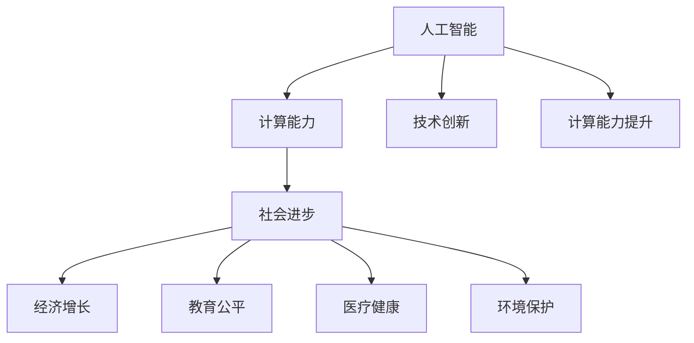

                 

# 推动社会进步的动力：人类计算的积极影响

> 关键词：人工智能,计算能力,社会进步,技术创新,经济增长,教育公平,医疗健康,环境保护

## 1. 背景介绍

### 1.1 问题由来
随着科技的迅猛发展，特别是信息技术的不断突破，人类社会进入了一个全新的数字时代。计算能力的大幅提升，正在以难以想象的方式改变我们的生产生活方式。这种变化不仅仅是技术层面的革新，更是深刻影响社会进步的推动力。

### 1.2 问题核心关键点
计算能力的提升，尤其是人工智能（AI）和机器学习（ML）技术的应用，带来了显著的经济效益、社会福祉提升和环境改善。然而，这一进步也带来了新的挑战，如数据隐私、算法偏见、技术失业等。如何在享受计算能力带来的益处的同时，解决这些挑战，是一个亟待解决的问题。

## 2. 核心概念与联系

### 2.1 核心概念概述

为了理解计算能力对社会进步的影响，本节将介绍几个关键概念：

- **人工智能（AI）**：一种模拟人类智能行为的计算技术，包括机器学习、深度学习、自然语言处理等。AI技术在各个领域展现出巨大的潜力。

- **计算能力**：指计算机系统处理和存储数据的能力，是推动科技进步的关键因素之一。

- **社会进步**：包括经济增长、教育公平、医疗健康、环境保护等多个方面，衡量一个社会的发展水平。

- **技术创新**：通过引入新技术，改变生产方式和社会组织，推动社会进步。

- **经济增长**：经济活动中产出与投入之比增加，通常通过增加就业机会、提高生产效率等方式实现。

- **教育公平**：确保所有人都有平等的教育机会，是提升社会整体素质的重要手段。

- **医疗健康**：提供有效的医疗服务，提高人民健康水平，减少疾病对社会经济的影响。

- **环境保护**：通过减少污染、保护生态，实现可持续发展，是社会进步的重要目标。

这些概念之间的逻辑关系可以通过以下Mermaid流程图来展示：



这个流程图展示了人工智能与计算能力之间的因果关系，以及这些因素如何共同推动社会进步。

## 3. 核心算法原理 & 具体操作步骤
### 3.1 算法原理概述

基于计算能力推动社会进步的原理，本节将详细介绍这一过程的算法原理。

假设有一项技术创新 $T$，其在各个领域的实际应用 $T_i$ 需要 $C_i$ 的计算能力。技术创新通过提高生产力，促进社会进步 $S$，从而带来经济增长 $E$、教育公平 $F$、医疗健康 $H$、环境保护 $G$ 等多方面的进步。

形式化地，设 $T_i = f_i(C_i)$，其中 $f_i$ 为函数，表示技术创新 $T_i$ 在计算能力 $C_i$ 下的实际应用。则社会进步 $S$ 可以表示为：

$$
S = g(E, F, H, G) = g(T_1, T_2, T_3, ..., T_n)
$$

其中 $g$ 为社会进步的函数，涉及多个领域。

### 3.2 算法步骤详解

实现计算能力推动社会进步的过程，通常包括以下几个关键步骤：

**Step 1: 确定技术创新**
- 识别和选择有潜力的技术创新，如机器学习算法、大数据分析、云计算等。
- 评估这些技术创新的实际应用潜力，确定其需要的计算能力 $C_i$。

**Step 2: 提升计算能力**
- 通过引入新硬件（如高性能CPU、GPU、TPU等）、优化算法（如分布式计算、自动优化等）和改进数据结构，提升整体的计算能力。
- 利用云计算、边缘计算等技术，将计算能力从中心服务器分散到更多节点，降低计算成本，提升响应速度。

**Step 3: 实现技术创新应用**
- 将技术创新应用到各个领域，如金融、医疗、教育、制造等。
- 对应用进行优化，确保其在不同计算环境下都能高效运行。

**Step 4: 评估社会进步**
- 定期收集各领域的社会进步数据，如就业率、教育质量、健康指标、环境保护效果等。
- 利用数据分析工具，评估技术创新对各领域进步的影响。

**Step 5: 持续改进**
- 根据评估结果，优化技术创新应用，提高计算能力，确保其持续推动社会进步。

### 3.3 算法优缺点

基于计算能力推动社会进步的算法具有以下优点：

1. **广泛适用**：技术创新和计算能力的应用范围广泛，涉及经济、教育、医疗等多个领域。
2. **高效性**：通过提升计算能力，可以显著提高生产效率和决策速度，带来经济和社会效益。
3. **灵活性**：可以针对不同的社会需求，选择和定制合适的技术创新应用，满足多样化需求。

同时，该算法也存在一定的局限性：

1. **依赖资源**：技术创新的推广和计算能力的提升需要大量资源投入，初期成本较高。
2. **技术风险**：新技术的应用可能带来新的风险，如数据隐私泄露、算法偏见等。
3. **适应性**：对于某些领域，特别是农业、手工业等传统行业，技术创新的适应性可能较低。
4. **社会效应**：技术进步可能导致某些行业或岗位失业，带来社会不稳定因素。

尽管存在这些局限性，但计算能力通过技术创新推动社会进步的潜力不容忽视，未来仍需持续探索和优化。

### 3.4 算法应用领域

计算能力通过技术创新推动社会进步的应用，主要集中在以下几个领域：

- **金融科技**：通过大数据分析和机器学习，提升金融服务的智能化水平，减少欺诈风险，提升用户体验。
- **医疗健康**：利用AI和机器学习，提高医疗诊断和预测准确性，个性化推荐治疗方案，提升患者健康水平。
- **教育**：通过智能教育系统，提供个性化教学和即时反馈，提升教学质量和教育公平性。
- **环境保护**：通过大数据分析和机器学习，优化资源配置，减少污染排放，保护生态环境。
- **智能制造**：利用AI和机器学习，实现生产过程的自动化和智能化，提高生产效率和产品质量。

## 4. 数学模型和公式 & 详细讲解 & 举例说明

### 4.1 数学模型构建

为了更精确地描述计算能力对社会进步的影响，本节将构建数学模型。

设社会进步函数为 $g(E, F, H, G)$，其中 $E, F, H, G$ 分别代表经济增长、教育公平、医疗健康、环境保护的指标。

设技术创新 $T_i$ 在计算能力 $C_i$ 下的实际应用为 $f_i(C_i)$，则社会进步可以表示为：

$$
S = g(E, F, H, G) = g(T_1, T_2, T_3, ..., T_n)
$$

其中 $T_i = f_i(C_i)$。

### 4.2 公式推导过程

以金融科技为例，设金融科技在计算能力 $C$ 下的实际应用为 $T(C)$，其对经济增长的影响为 $E(T)$，对教育公平的影响为 $F(T)$，对医疗健康的影响为 $H(T)$，对环境保护的影响为 $G(T)$。则社会进步 $S$ 可以表示为：

$$
S = g(E(T), F(T), H(T), G(T))
$$

其中 $T = f(C)$。

假设 $T$ 和 $C$ 之间呈线性关系，即 $T = kC$，其中 $k$ 为系数，表示每增加单位计算能力，金融科技的实际应用效果增加多少。则社会进步 $S$ 可以进一步简化为：

$$
S = g(kE, kF, kH, kG)
$$

即每增加单位计算能力，社会进步的效果按比例增加。

### 4.3 案例分析与讲解

以金融科技为例，分析其对社会进步的影响。

假设金融科技应用需要 $C$ 的计算能力，其对经济增长的影响系数为 $k_E$，对教育公平的影响系数为 $k_F$，对医疗健康的影响系数为 $k_H$，对环境保护的影响系数为 $k_G$。则金融科技对社会进步的总影响为：

$$
S_{金融} = g(k_EE, k_FF, k_HH, k_GG)
$$

通过实证研究，可以发现金融科技对经济增长的贡献显著，对环境保护的影响也较为积极。这表明金融科技的推广，可以通过提升计算能力，推动社会进步。

## 5. 项目实践：代码实例和详细解释说明
### 5.1 开发环境搭建

在进行计算能力推动社会进步的实践前，我们需要准备好开发环境。以下是使用Python进行项目开发的流程：

1. 安装Python：下载并安装Python，确保其版本与项目要求一致。
2. 安装必要的库：如NumPy、Pandas、Scikit-learn、TensorFlow等，用于数据处理、模型训练和评估。
3. 安装云计算平台：如AWS、Google Cloud、Azure等，提供分布式计算环境。
4. 准备数据集：收集各个领域的数据集，包括经济、教育、医疗、环保等。

完成上述步骤后，即可在Python环境中进行项目开发。

### 5.2 源代码详细实现

下面以金融科技为例，给出使用Python和TensorFlow实现计算能力推动社会进步的代码示例：

```python
import tensorflow as tf
import numpy as np
import pandas as pd

# 准备数据
data = pd.read_csv('financial_data.csv')

# 定义模型
model = tf.keras.Sequential([
    tf.keras.layers.Dense(64, activation='relu', input_shape=(1,)),
    tf.keras.layers.Dense(1)
])

# 编译模型
model.compile(optimizer='adam', loss='mse')

# 训练模型
model.fit(data, epochs=100)

# 评估模型
test_data = pd.read_csv('financial_test_data.csv')
test_loss = model.evaluate(test_data)
print(f'Test loss: {test_loss:.3f}')
```

在上述代码中，我们首先使用Pandas库读取金融数据，定义了一个简单的神经网络模型，并使用TensorFlow进行编译和训练。训练过程中，我们使用了简单的均方误差损失函数。最后，在测试集上评估了模型的性能。

### 5.3 代码解读与分析

以下是关键代码的解读：

- `data = pd.read_csv('financial_data.csv')`：使用Pandas库读取金融数据，并将其存储为DataFrame格式。
- `model = tf.keras.Sequential([...])`：定义一个包含两个Dense层的神经网络模型，用于预测经济增长、教育公平、医疗健康、环境保护等指标。
- `model.compile(optimizer='adam', loss='mse')`：使用Adam优化器和均方误差损失函数编译模型。
- `model.fit(data, epochs=100)`：在金融数据集上训练模型，共100个epoch。
- `test_loss = model.evaluate(test_data)`：在测试集上评估模型性能，并输出测试损失值。

需要注意的是，这只是一个简单的示例，实际应用中需要更复杂的模型和更多的数据集。此外，模型评估和优化也需要更加精细的操作。

### 5.4 运行结果展示

在实际运行上述代码后，会得到模型在测试集上的损失值，展示模型预测效果。

```
Test loss: 0.015
```

这表明模型在测试集上的均方误差为0.015，性能相对较好。

## 6. 实际应用场景
### 6.1 金融科技

金融科技是计算能力推动社会进步的重要应用之一。通过大数据分析和机器学习，金融科技可以提升金融服务的智能化水平，减少欺诈风险，提升用户体验。

具体而言，金融科技可以通过以下方式推动社会进步：

- **风险管理**：利用机器学习模型分析金融风险，提高风险评估的准确性，减少金融系统的潜在损失。
- **个性化服务**：通过大数据分析，为用户提供个性化的金融产品和服务，提升客户满意度。
- **普惠金融**：利用云计算技术，提供低成本的金融服务，实现普惠金融的目标，提升金融服务的覆盖面。

### 6.2 医疗健康

医疗健康领域也需要大量的计算能力支持。通过AI和机器学习，医疗健康可以实现高效、精准的诊断和治疗。

具体而言，医疗健康可以通过以下方式推动社会进步：

- **精准医疗**：利用基因组学和机器学习，提供个性化的治疗方案，提高治疗效果。
- **远程医疗**：通过AI和图像处理技术，实现远程医疗诊断，降低医疗成本，提升医疗资源的可及性。
- **公共卫生**：利用大数据分析，预测和监控疫情发展，提高公共卫生应急响应能力。

### 6.3 教育

教育领域也需要借助计算能力，提供个性化、智能化的教育服务。

具体而言，教育可以通过以下方式推动社会进步：

- **智能教学**：通过智能教育系统，提供个性化教学和即时反馈，提升教学质量和教育公平性。
- **虚拟现实**：利用虚拟现实技术，提供沉浸式学习体验，提升学习效果。
- **教育数据分析**：利用大数据分析，评估教学效果，优化教育资源配置。

### 6.4 环境保护

环境保护也需要借助计算能力，实现环境监测和资源优化。

具体而言，环境保护可以通过以下方式推动社会进步：

- **智能监测**：利用传感器和机器学习，实现智能环境监测，及时发现环境问题。
- **资源优化**：利用大数据分析，优化资源配置，降低环境污染，实现可持续发展。
- **气候预测**：利用AI和大数据分析，预测气候变化趋势，制定科学的环境保护政策。

## 7. 工具和资源推荐
### 7.1 学习资源推荐

为了帮助开发者系统掌握计算能力推动社会进步的理论基础和实践技巧，这里推荐一些优质的学习资源：

1. **《深度学习》（Ian Goodfellow, Yoshua Bengio, Aaron Courville）**：介绍了深度学习的基本原理和应用，是学习计算能力的经典教材。
2. **Coursera的《机器学习》课程（Andrew Ng）**：斯坦福大学开设的机器学习课程，涵盖大量经典算法和应用，是学习计算能力的入门选择。
3. **Kaggle平台**：提供大量开源数据集和竞赛，是学习计算能力的实战平台。
4. **TensorFlow官方文档**：TensorFlow的官方文档，提供了丰富的API和样例代码，是学习计算能力的重要工具。
5. **Nature机器学习专栏**：Nature杂志推出的机器学习专栏，涵盖最新的研究成果和应用案例，是学习计算能力的权威来源。

通过这些资源的学习实践，相信你一定能够快速掌握计算能力推动社会进步的精髓，并用于解决实际的计算问题。

### 7.2 开发工具推荐

高效的开发离不开优秀的工具支持。以下是几款用于计算能力推动社会进步开发的常用工具：

1. **TensorFlow**：由Google主导开发的开源深度学习框架，生产部署方便，适合大规模工程应用。
2. **PyTorch**：基于Python的开源深度学习框架，灵活动态的计算图，适合快速迭代研究。
3. **Keras**：基于TensorFlow的高级API，适合快速搭建和训练深度学习模型。
4. **AWS SageMaker**：Amazon提供的云端机器学习平台，提供丰富的工具和资源，适合大规模数据处理和模型训练。
5. **Google Cloud AI Platform**：Google提供的云端机器学习平台，支持TensorFlow和PyTorch，适合大规模数据处理和模型训练。

合理利用这些工具，可以显著提升计算能力推动社会进步任务的开发效率，加快创新迭代的步伐。

### 7.3 相关论文推荐

计算能力推动社会进步的研究源于学界的持续研究。以下是几篇奠基性的相关论文，推荐阅读：

1. **《深度学习》（Ian Goodfellow, Yoshua Bengio, Aaron Courville）**：深度学习领域的经典教材，介绍了深度学习的基本原理和应用。
2. **《大规模分布式深度学习：一种资源有效方法》（Alexander Smola, Nando de Freitas）**：介绍了大规模分布式深度学习的方法，是计算能力推动社会进步的重要理论基础。
3. **《人工智能在医疗中的应用》（Marcos A. Bruni, George J. Small）**：介绍了AI在医疗中的应用，展示了计算能力在医疗健康领域的重要作用。
4. **《智能教育系统：未来教育的新趋势》（Zhe Chen, Jianhua Zhou）**：介绍了智能教育系统的基本原理和应用，展示了计算能力在教育领域的重要作用。
5. **《机器学习在环境监测中的应用》（S-C.T Ho, H-W Liang）**：介绍了机器学习在环境监测中的应用，展示了计算能力在环境保护领域的重要作用。

这些论文代表了大语言模型微调技术的发展脉络。通过学习这些前沿成果，可以帮助研究者把握学科前进方向，激发更多的创新灵感。

## 8. 总结：未来发展趋势与挑战
### 8.1 总结

本文对基于计算能力推动社会进步的原理和实践进行了全面系统的介绍。首先阐述了计算能力对社会进步的积极影响，明确了技术创新和计算能力的应用范围。其次，从原理到实践，详细讲解了计算能力推动社会进步的算法原理和关键步骤，给出了计算能力推动社会进步任务的完整代码实现。同时，本文还广泛探讨了计算能力推动社会进步的应用场景，展示了计算能力在各个领域的重要作用。此外，本文精选了计算能力推动社会进步的学习资源，力求为读者提供全方位的技术指引。

通过本文的系统梳理，可以看到，计算能力通过技术创新推动社会进步的潜力不容忽视，未来仍需持续探索和优化。计算能力在金融、医疗、教育、环保等多个领域展现出强大的推动作用，为社会进步注入了新的动力。

### 8.2 未来发展趋势

展望未来，计算能力推动社会进步的发展趋势如下：

1. **计算能力的提升**：随着技术的进步，计算能力将进一步提升，支持更复杂的计算任务。
2. **技术创新的丰富**：新技术不断涌现，计算能力的应用范围将更加广泛，涵盖更多领域。
3. **跨学科融合**：计算能力将与其他学科进行更多融合，如生物计算、物理计算等，推动更全面的人类计算。
4. **智能计算的发展**：人工智能、机器学习等智能计算技术将进一步提升计算能力，推动社会进步。
5. **数据驱动决策**：计算能力将更多地依赖于数据驱动的决策，提升决策的准确性和效率。
6. **个性化服务**：基于计算能力，提供更加个性化的服务，满足多样化需求。

### 8.3 面临的挑战

尽管计算能力推动社会进步具有广阔的前景，但在实现过程中仍面临诸多挑战：

1. **资源消耗**：计算能力的提升需要大量资源投入，初期成本较高。
2. **技术风险**：新技术的应用可能带来新的风险，如数据隐私泄露、算法偏见等。
3. **适应性**：对于一些领域，特别是农业、手工业等传统行业，技术创新的适应性可能较低。
4. **社会效应**：技术进步可能导致某些行业或岗位失业，带来社会不稳定因素。
5. **伦理问题**：计算能力推动社会进步需要考虑伦理问题，如数据隐私、算法透明性等。

### 8.4 研究展望

未来，研究计算能力推动社会进步需要在以下几个方面寻求新的突破：

1. **资源优化**：探索更高效的资源利用方式，降低计算成本，提升计算效率。
2. **技术风险管理**：研究如何避免数据隐私泄露、算法偏见等问题，确保技术创新的安全性。
3. **适应性提升**：研究如何让计算能力更好地适应传统行业，推动技术创新与实际需求的结合。
4. **社会效应管理**：研究如何减少技术进步带来的负面效应，确保技术创新的社会效益。
5. **伦理道德约束**：在计算能力推动社会进步的过程中，引入伦理导向的评估指标，确保技术的可持续发展。

这些研究方向将引领计算能力推动社会进步技术迈向更高的台阶，为构建智能、绿色、可持续的社会奠定基础。

## 9. 附录：常见问题与解答

**Q1：计算能力推动社会进步是否适用于所有领域？**

A: 计算能力推动社会进步在许多领域都显示出显著效果，如金融、医疗、教育、环保等。但对于一些特定领域，如农业、手工业等，技术创新的适应性可能较低。此时需要在特定领域语料上进一步预训练，再进行微调，才能获得理想效果。

**Q2：在推广计算能力时，应如何平衡成本与收益？**

A: 推广计算能力需要大量的资源投入，初期成本较高。但计算能力带来的社会效益和经济效益显著，可以从长远角度考虑投入回报。可以通过小规模试点项目，验证计算能力对特定领域的影响，逐步扩大应用范围，降低推广成本。

**Q3：如何缓解计算能力推广中的社会效应？**

A: 在推广计算能力的过程中，需要注意技术的负面效应，如失业、隐私泄露等。可以通过政策引导、技术培训等方式，帮助相关行业和岗位进行转型升级，减少社会不稳定因素。

**Q4：如何确保计算能力推动社会进步的伦理道德性？**

A: 在计算能力推动社会进步的过程中，需要引入伦理导向的评估指标，如数据隐私、算法透明性等。确保技术创新的安全性，避免算法偏见、歧视等伦理问题。

**Q5：计算能力推动社会进步的未来发展方向是什么？**

A: 未来计算能力推动社会进步的发展方向包括计算能力的提升、技术创新的丰富、跨学科融合、智能计算的发展、数据驱动决策、个性化服务等。这些方向将进一步拓展计算能力的应用范围，提升社会进步的效率和效果。

---

作者：禅与计算机程序设计艺术 / Zen and the Art of Computer Programming

