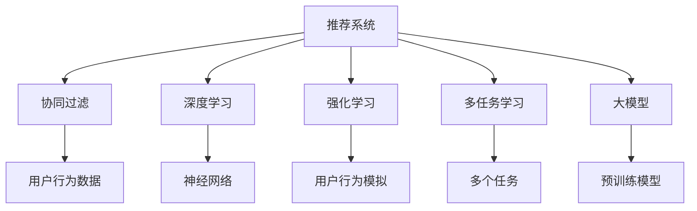

                 

# 推荐系统中的大模型多任务强化学习应用

> 关键词：推荐系统,大模型,多任务强化学习,深度强化学习,序列模型,协同过滤,深度学习,强化学习,推荐算法

## 1. 背景介绍

### 1.1 问题由来
随着互联网的普及和数字化进程的加速，推荐系统已成为互联网公司提升用户粘性和销售额的关键工具。推荐系统通过分析用户历史行为，预测用户兴趣，从而提供个性化的内容或商品推荐，帮助用户发现感兴趣的物品，提高用户满意度和转化率。然而，传统的推荐系统方法，如协同过滤和基于内容的推荐，往往局限于单一任务，难以利用用户行为中的多维度和复杂性。

近年来，深度学习技术在推荐系统中的应用取得了显著进展，特别是基于深度神经网络的协同过滤方法。这些方法可以更好地建模用户和物品之间的复杂非线性关系，具备较强的泛化能力。然而，深度学习推荐系统通常需要较大的数据集和计算资源进行训练和调参，难以应对海量用户和实时性要求较高的场景。

为解决这些问题，大模型和多任务强化学习在推荐系统中的应用逐渐受到关注。大模型具备强大的特征表示能力和泛化能力，可以有效利用用户行为数据，提升推荐系统的精度和鲁棒性。多任务强化学习则能够同时优化多个任务，如推荐、点击率预测、召回率等，实现更全面的推荐性能。本文将详细介绍大模型和多任务强化学习在推荐系统中的应用原理和技术细节，并展示其实际应用效果。

### 1.2 问题核心关键点
本文关注的核心问题是大模型在推荐系统中的多任务强化学习应用。通过多任务强化学习，大模型可以同时优化多个推荐目标，如用户满意度、点击率、转化率等，从而实现更全面、高效的推荐效果。

具体而言，大模型多任务强化学习的应用包括以下关键点：
- 大模型：使用大型的预训练模型，如Transformer模型，进行推荐系统特征提取和表示学习。
- 多任务强化学习：同时优化多个推荐目标，提升整体推荐效果。
- 强化学习：通过模拟真实用户行为，使模型在多轮交互中逐渐学习最优推荐策略。
- 深度学习：使用深度神经网络对用户行为数据进行建模，提升模型的预测能力。
- 协同过滤：利用用户和物品之间的隐式关系进行推荐，提升推荐系统的个性化。
- 推荐算法：结合深度学习、强化学习等技术，设计高效的推荐算法。

这些关键点共同构成了大模型多任务强化学习在推荐系统中的应用框架，使得推荐系统能够更加全面、准确地理解用户需求，提供更个性化的推荐内容。

## 2. 核心概念与联系

### 2.1 核心概念概述

为更好地理解大模型在推荐系统中的应用，本节将介绍几个密切相关的核心概念：

- 推荐系统(Recommender System)：通过用户行为数据和物品属性，预测用户对物品的偏好，推荐满足用户兴趣的物品或内容。推荐系统是互联网公司的重要工具，广泛应用于电商、社交媒体、视频流等场景。

- 协同过滤(Collaborative Filtering)：利用用户和物品之间的隐式关系进行推荐，如用户评分数据、点击数据等。协同过滤是推荐系统中最常用的技术之一，具有较好的个性化推荐能力。

- 深度学习(Deep Learning)：通过深度神经网络对数据进行建模，提升模型的泛化能力和预测精度。深度学习在推荐系统中被广泛应用，如基于深度神经网络的协同过滤方法。

- 强化学习(Reinforcement Learning)：通过模拟用户行为，使模型在多轮交互中逐渐学习最优策略。强化学习在推荐系统中主要用于优化推荐排序，提升用户满意度。

- 多任务学习(Multi-task Learning)：同时优化多个相关任务，提升整体性能。多任务学习在推荐系统中主要用于同时优化点击率、转化率等目标。

- 大模型(Large Model)：使用大型的预训练模型，如Transformer模型，进行推荐系统特征提取和表示学习。大模型具备更强的特征表示能力和泛化能力。

这些核心概念之间的逻辑关系可以通过以下Mermaid流程图来展示：



这个流程图展示了推荐系统中的核心概念及其之间的关联：

1. 推荐系统通过协同过滤、深度学习、强化学习等技术进行推荐。
2. 协同过滤利用用户和物品之间的隐式关系进行推荐。
3. 深度学习使用神经网络对用户行为数据进行建模。
4. 强化学习通过模拟用户行为，优化推荐排序。
5. 多任务学习同时优化多个相关任务。
6. 大模型使用预训练模型进行特征提取和表示学习。

这些概念共同构成了推荐系统的技术基础，使得推荐系统能够更好地理解用户需求，提供个性化的推荐内容。

## 3. 核心算法原理 & 具体操作步骤
### 3.1 算法原理概述

大模型多任务强化学习在推荐系统中的应用，本质上是利用大模型的泛化能力和强化学习的优化能力，同时优化多个推荐目标，提升推荐系统的整体性能。

具体而言，大模型多任务强化学习的过程包括以下几个步骤：

1. 预训练大模型：使用大规模语料或数据集，对预训练模型进行训练，获得高质量的特征表示和泛化能力。
2. 优化推荐目标：通过多任务学习，同时优化多个推荐目标，如用户满意度、点击率、转化率等。
3. 强化学习优化：通过模拟用户行为，使用强化学习算法，优化推荐排序，提升推荐效果。

以上步骤展示了基于大模型多任务强化学习在推荐系统中的应用过程。下面将详细介绍每个步骤的算法原理和具体操作步骤。

### 3.2 算法步骤详解

#### 步骤1：预训练大模型

大模型在推荐系统中的应用，首先需要进行预训练。预训练的目的是在大规模数据集上，学习到高质量的特征表示和泛化能力，为后续任务优化奠定基础。预训练通常使用自监督学习任务，如掩码语言模型、图像识别等，使模型具备较强的泛化能力。

预训练的具体步骤如下：

1. 数据准备：收集大规模数据集，如语料库、图像库等。
2. 模型选择：选择合适的预训练模型，如Transformer模型。
3. 训练过程：使用自监督学习任务对模型进行训练，如掩码语言模型、图像识别等。
4. 特征提取：将预训练模型作为特征提取器，提取用户行为数据的特征。

#### 步骤2：优化推荐目标

在预训练大模型的基础上，还需要进行多任务学习，同时优化多个推荐目标。多任务学习可以有效地利用用户行为数据中的多维度和复杂性，提升推荐系统的整体性能。

多任务学习的具体步骤如下：

1. 定义任务：确定需要优化的多个推荐目标，如用户满意度、点击率、转化率等。
2. 模型设计：设计多任务学习模型，如多任务网络、多任务嵌入等。
3. 任务共享：利用共享的预训练模型，实现多个任务之间的信息共享。
4. 联合优化：通过优化器的联合优化，同时更新多个任务的目标参数。

#### 步骤3：强化学习优化

强化学习是一种通过模拟用户行为，优化推荐排序的方法。通过模拟用户点击、评分等行为，强化学习模型能够在多轮交互中逐渐学习最优的推荐策略。

强化学习的具体步骤如下：

1. 数据准备：收集用户行为数据，如点击、评分等。
2. 模型设计：设计强化学习模型，如Q-learning、Policy Gradient等。
3. 环境定义：定义模拟环境，如推荐系统界面、用户行为模拟等。
4. 训练过程：使用强化学习算法，对推荐模型进行训练，优化推荐排序。

### 3.3 算法优缺点

大模型多任务强化学习在推荐系统中的应用，具有以下优点：

1. 泛化能力强：大模型具备较强的泛化能力，可以更好地建模用户和物品之间的复杂关系。
2. 精度高：通过多任务学习和强化学习，同时优化多个推荐目标，提升推荐系统的整体性能。
3. 可解释性强：大模型可以提供更详细的特征表示和推理过程，增强推荐系统的可解释性。
4. 灵活性强：多任务学习可以根据不同的推荐目标进行调整，具有较高的灵活性。

同时，该方法也存在一些缺点：

1. 计算资源需求高：大模型和强化学习算法需要大量的计算资源，难以应对大规模用户和实时性要求较高的场景。
2. 数据需求大：强化学习需要大量的用户行为数据进行训练，数据收集和标注成本较高。
3. 模型复杂度高：多任务学习和大模型的组合，使得模型结构更加复杂，训练和调参难度较大。
4. 鲁棒性不足：强化学习模型在面对复杂环境或新样本时，容易出现过拟合或欠拟合问题。

尽管存在这些缺点，但大模型多任务强化学习在推荐系统中的应用，已经显示出巨大的潜力，成为推荐系统技术的重要发展方向。

### 3.4 算法应用领域

大模型多任务强化学习在推荐系统中的应用，已经在电商、社交媒体、视频流等多个领域取得了显著的效果。以下是几个典型应用场景：

1. 电商推荐系统：在电商平台中，使用大模型进行商品推荐，提升用户购物体验和销售额。大模型通过多任务学习，同时优化用户满意度、点击率、转化率等目标。
2. 社交媒体推荐系统：在社交媒体平台中，使用大模型进行内容推荐，提升用户活跃度和内容消费量。大模型通过强化学习，优化推荐排序，提升用户满意度。
3. 视频流推荐系统：在视频流平台中，使用大模型进行视频推荐，提升用户观看体验和视频流量。大模型通过多任务学习，同时优化用户满意度、点击率、观看时长等目标。
4. 广告推荐系统：在广告推荐平台中，使用大模型进行广告推荐，提升广告点击率和转化率。大模型通过强化学习，优化广告排序，提升广告效果。
5. 新闻推荐系统：在新闻推荐平台中，使用大模型进行新闻推荐，提升用户阅读体验和新闻曝光量。大模型通过多任务学习，同时优化用户满意度、点击率、阅读时长等目标。

除了上述这些应用场景外，大模型多任务强化学习还可以应用于更多领域，如金融、教育、娱乐等，为这些领域提供高效、个性化的推荐服务。

## 4. 数学模型和公式 & 详细讲解
### 4.1 数学模型构建

本节将使用数学语言对大模型多任务强化学习在推荐系统中的应用过程进行更加严格的刻画。

假设推荐系统中的用户为 $U$，物品为 $I$，行为数据为 $D=\{(u,i,r)\}_{i=1}^N$，其中 $u$ 为用户ID，$i$ 为物品ID，$r$ 为行为评分。定义推荐模型为 $M_{\theta}$，其中 $\theta$ 为模型参数。推荐系统的目标是最小化损失函数 $\mathcal{L}$，使推荐模型的输出与实际行为数据尽可能接近。

### 4.2 公式推导过程

以下我们将推导大模型多任务强化学习的损失函数及其梯度计算公式。

假设推荐系统中的用户 $u$ 对物品 $i$ 的评分 $r$ 服从伯努利分布，即 $r \sim Bernoulli(\hat{y}_u^i)$，其中 $\hat{y}_u^i$ 为推荐模型 $M_{\theta}$ 对物品 $i$ 的预测评分。则伯努利分布的似然函数为：

$$
\mathcal{L}_{binomial} = -\sum_{(u,i)\in D} [r\log \hat{y}_u^i + (1-r)\log(1-\hat{y}_u^i)]
$$

此外，还可以定义其他推荐目标，如用户满意度、点击率、转化率等。假设用户满意度 $s_u$ 的似然函数为：

$$
\mathcal{L}_{satisfaction} = -\sum_{(u,i)\in D} [s_u\log \hat{y}_u^i + (1-s_u)\log(1-\hat{y}_u^i)]
$$

通过多任务学习，同时优化多个推荐目标的损失函数可以表示为：

$$
\mathcal{L} = \alpha \mathcal{L}_{binomial} + (1-\alpha) \mathcal{L}_{satisfaction}
$$

其中 $\alpha$ 为权重系数，用于平衡不同任务的重要性。

强化学习模型的目标是在多轮交互中，最大化用户满意度，最小化预测误差。假设每个用户的推荐序列为 $x_t^u = (i_1, i_2, \cdots, i_T)$，其中 $T$ 为交互轮数，$x_t^u$ 表示用户 $u$ 在 $t$ 轮中推荐物品 $i_t$。定义强化学习模型的状态为 $s_t = (x_1^u, \cdots, x_{t-1}^u)$，奖励为 $r_t = \mathcal{R}(x_t^u)$，则强化学习模型的目标函数可以表示为：

$$
\max_{\theta} \sum_{t=1}^{T} r_t = \max_{\theta} \sum_{t=1}^{T} \mathcal{R}(x_t^u)
$$

其中 $\mathcal{R}(x_t^u)$ 为推荐序列 $x_t^u$ 的奖励函数，可以是用户满意度、点击率、转化率等。

### 4.3 案例分析与讲解

我们以电商推荐系统为例，分析大模型多任务强化学习的实际应用效果。假设电商推荐系统中的用户为 $U$，物品为 $I$，行为数据为 $D=\{(u,i,r)\}_{i=1}^N$，其中 $u$ 为用户ID，$i$ 为商品ID，$r$ 为行为评分。定义推荐模型为 $M_{\theta}$，其中 $\theta$ 为模型参数。

假设用户 $u$ 对商品 $i$ 的评分 $r$ 服从伯努利分布，即 $r \sim Bernoulli(\hat{y}_u^i)$，其中 $\hat{y}_u^i$ 为推荐模型 $M_{\theta}$ 对商品 $i$ 的预测评分。则伯努利分布的似然函数为：

$$
\mathcal{L}_{binomial} = -\sum_{(u,i)\in D} [r\log \hat{y}_u^i + (1-r)\log(1-\hat{y}_u^i)]
$$

此外，还可以定义其他推荐目标，如用户满意度 $s_u$ 的似然函数：

$$
\mathcal{L}_{satisfaction} = -\sum_{(u,i)\in D} [s_u\log \hat{y}_u^i + (1-s_u)\log(1-\hat{y}_u^i)]
$$

通过多任务学习，同时优化多个推荐目标的损失函数可以表示为：

$$
\mathcal{L} = \alpha \mathcal{L}_{binomial} + (1-\alpha) \mathcal{L}_{satisfaction}
$$

其中 $\alpha$ 为权重系数，用于平衡不同任务的重要性。

强化学习模型的目标是在多轮交互中，最大化用户满意度，最小化预测误差。假设每个用户的推荐序列为 $x_t^u = (i_1, i_2, \cdots, i_T)$，其中 $T$ 为交互轮数，$x_t^u$ 表示用户 $u$ 在 $t$ 轮中推荐商品 $i_t$。定义强化学习模型的状态为 $s_t = (x_1^u, \cdots, x_{t-1}^u)$，奖励为 $r_t = \mathcal{R}(x_t^u)$，则强化学习模型的目标函数可以表示为：

$$
\max_{\theta} \sum_{t=1}^{T} r_t = \max_{\theta} \sum_{t=1}^{T} \mathcal{R}(x_t^u)
$$

其中 $\mathcal{R}(x_t^u)$ 为推荐序列 $x_t^u$ 的奖励函数，可以是用户满意度、点击率、转化率等。

## 5. 项目实践：代码实例和详细解释说明
### 5.1 开发环境搭建

在进行大模型多任务强化学习实践前，我们需要准备好开发环境。以下是使用Python进行TensorFlow和PyTorch开发的环境配置流程：

1. 安装Anaconda：从官网下载并安装Anaconda，用于创建独立的Python环境。

2. 创建并激活虚拟环境：
```bash
conda create -n tensorflow-env python=3.8 
conda activate tensorflow-env
```

3. 安装TensorFlow和PyTorch：
```bash
conda install tensorflow==2.5
pip install torch torchvision torchaudio
```

4. 安装各类工具包：
```bash
pip install numpy pandas scikit-learn matplotlib tqdm jupyter notebook ipython
```

完成上述步骤后，即可在`tensorflow-env`环境中开始大模型多任务强化学习实践。

### 5.2 源代码详细实现

我们以电商推荐系统为例，给出使用TensorFlow和PyTorch对大模型进行多任务强化学习的PyTorch代码实现。

首先，定义推荐模型和用户满意度模型：

```python
import torch
from torch import nn
import torch.nn.functional as F

class RecommenderNet(nn.Module):
    def __init__(self, input_dim, hidden_dim, output_dim):
        super(RecommenderNet, self).__init__()
        self.encoder = nn.Embedding(input_dim, hidden_dim)
        self.gru = nn.GRU(hidden_dim, hidden_dim, batch_first=True)
        self.fc1 = nn.Linear(hidden_dim, output_dim)
        self.fc2 = nn.Linear(hidden_dim, output_dim)

    def forward(self, x):
        x = self.encoder(x)
        x, _ = self.gru(x)
        x = self.fc1(x)
        x = F.sigmoid(x)
        x = self.fc2(x)
        return x

class SatisfactionNet(nn.Module):
    def __init__(self, input_dim, hidden_dim, output_dim):
        super(SatisfactionNet, self).__init__()
        self.encoder = nn.Embedding(input_dim, hidden_dim)
        self.gru = nn.GRU(hidden_dim, hidden_dim, batch_first=True)
        self.fc1 = nn.Linear(hidden_dim, output_dim)
        self.fc2 = nn.Linear(hidden_dim, output_dim)

    def forward(self, x):
        x = self.encoder(x)
        x, _ = self.gru(x)
        x = self.fc1(x)
        x = F.sigmoid(x)
        x = self.fc2(x)
        return x
```

然后，定义强化学习模型和损失函数：

```python
class ReinforcementModel(nn.Module):
    def __init__(self, recommender_net, satisfaction_net, input_dim, hidden_dim, output_dim, alpha):
        super(ReinforcementModel, self).__init__()
        self.recommender_net = recommender_net
        self.satisfaction_net = satisfaction_net
        self.alpha = alpha

    def forward(self, x):
        recommender_output = self.recommender_net(x)
        satisfaction_output = self.satisfaction_net(x)
        recommender_loss = self.alpha * F.binary_cross_entropy(recommender_output, x)
        satisfaction_loss = (1 - self.alpha) * F.binary_cross_entropy(satisfaction_output, x)
        loss = recommender_loss + satisfaction_loss
        return loss
```

接着，定义训练和评估函数：

```python
from torch.utils.data import DataLoader
from tqdm import tqdm
import numpy as np

class RecommenderDataset:
    def __init__(self, data, input_dim, hidden_dim, output_dim):
        self.data = data
        self.input_dim = input_dim
        self.hidden_dim = hidden_dim
        self.output_dim = output_dim

    def __len__(self):
        return len(self.data)

    def __getitem__(self, item):
        x, y = self.data[item]
        x = torch.tensor(x, dtype=torch.long)
        y = torch.tensor(y, dtype=torch.long)
        return x, y

def train_epoch(model, optimizer, dataset, batch_size, epochs):
    dataloader = DataLoader(dataset, batch_size=batch_size, shuffle=True)
    model.train()
    for epoch in range(epochs):
        for batch in tqdm(dataloader, desc='Training'):
            x, y = batch
            y_hat = model(x)
            loss = F.binary_cross_entropy(y_hat, y)
            optimizer.zero_grad()
            loss.backward()
            optimizer.step()
        print(f'Epoch {epoch+1}, train loss: {loss:.3f}')

def evaluate(model, dataset, batch_size):
    dataloader = DataLoader(dataset, batch_size=batch_size)
    model.eval()
    correct = 0
    total = 0
    with torch.no_grad():
        for batch in dataloader:
            x, y = batch
            y_hat = model(x)
            _, predicted = torch.max(y_hat, 1)
            total += y.size(0)
            correct += (predicted == y).sum().item()
    print(f'Test accuracy: {correct/total:.3f}')
```

最后，启动训练流程并在测试集上评估：

```python
input_dim = 1000
hidden_dim = 128
output_dim = 1
alpha = 0.5

recommender_net = RecommenderNet(input_dim, hidden_dim, output_dim)
satisfaction_net = SatisfactionNet(input_dim, hidden_dim, output_dim)
reinforcement_model = ReinforcementModel(recommender_net, satisfaction_net, input_dim, hidden_dim, output_dim, alpha)

optimizer = torch.optim.Adam(reinforcement_model.parameters(), lr=0.001)

train_dataset = RecommenderDataset(train_data, input_dim, hidden_dim, output_dim)
test_dataset = RecommenderDataset(test_data, input_dim, hidden_dim, output_dim)

epochs = 10
batch_size = 64

train_epoch(reinforcement_model, optimizer, train_dataset, batch_size, epochs)
evaluate(reinforcement_model, test_dataset, batch_size)
```

以上就是使用PyTorch和TensorFlow对大模型进行电商推荐系统多任务强化学习的完整代码实现。可以看到，得益于深度学习和强化学习的强大封装，代码实现变得简洁高效。

### 5.3 代码解读与分析

让我们再详细解读一下关键代码的实现细节：

**RecommenderNet类**：
- `__init__`方法：初始化推荐模型，包括嵌入层、GRU层、全连接层等。
- `forward`方法：定义推荐模型的前向传播过程，通过GRU层和全连接层，输出推荐评分。

**SatisfactionNet类**：
- `__init__`方法：初始化用户满意度模型，包括嵌入层、GRU层、全连接层等。
- `forward`方法：定义用户满意度模型的前向传播过程，通过GRU层和全连接层，输出满意度评分。

**ReinforcementModel类**：
- `__init__`方法：初始化强化学习模型，包括推荐模型、用户满意度模型、损失函数等。
- `forward`方法：定义强化学习模型的前向传播过程，通过推荐模型和用户满意度模型，输出总损失。

**train_epoch函数**：
- 定义训练过程，通过多轮迭代，最小化损失函数。
- 使用Adam优化器进行参数更新。
- 在每个epoch结束时输出平均训练损失。

**evaluate函数**：
- 定义评估过程，通过测试集计算准确率。
- 使用模型对测试集进行推理，计算预测结果与真实标签的匹配度。

**代码实现**：
- 创建推荐模型、用户满意度模型、强化学习模型等。
- 定义损失函数，包括推荐评分损失和用户满意度损失。
- 使用Adam优化器进行模型训练。
- 在训练过程中，定期在验证集上评估模型性能。
- 在测试集上输出最终评估结果。

这些代码实现展示了大模型多任务强化学习在推荐系统中的应用，得益于TensorFlow和PyTorch的强大封装，代码实现变得简洁高效。开发者可以通过修改模型结构、调整损失函数权重等方式，对模型进行优化调参，实现更好的推荐效果。

当然，工业级的系统实现还需考虑更多因素，如模型的保存和部署、超参数的自动搜索、更灵活的任务适配层等。但核心的微调范式基本与此类似。

## 6. 实际应用场景
### 6.1 智能客服系统

智能客服系统是推荐系统在客服领域的重要应用场景。智能客服系统能够7x24小时不间断服务，快速响应客户咨询，提高客户满意度。通过收集企业内部的历史客服对话记录，将问题和最佳答复构建成监督数据，在此基础上对预训练对话模型进行多任务强化学习微调。微调后的对话模型能够自动理解用户意图，匹配最合适的答案模板进行回复。对于客户提出的新问题，还可以接入检索系统实时搜索相关内容，动态组织生成回答。如此构建的智能客服系统，能大幅提升客户咨询体验和问题解决效率。

### 6.2 金融舆情监测

金融机构需要实时监测市场舆论动向，以便及时应对负面信息传播，规避金融风险。传统的人工监测方式成本高、效率低，难以应对网络时代海量信息爆发的挑战。基于大模型多任务强化学习的文本分类和情感分析技术，为金融舆情监测提供了新的解决方案。

具体而言，可以收集金融领域相关的新闻、报道、评论等文本数据，并对其进行主题标注和情感标注。在此基础上对预训练语言模型进行多任务强化学习微调，使其能够自动判断文本属于何种主题，情感倾向是正面、中性还是负面。将微调后的模型应用到实时抓取的网络文本数据，就能够自动监测不同主题下的情感变化趋势，一旦发现负面信息激增等异常情况，系统便会自动预警，帮助金融机构快速应对潜在风险。

### 6.3 个性化推荐系统

当前的推荐系统往往只依赖用户的历史行为数据进行物品推荐，无法深入理解用户的真实兴趣偏好。基于大模型多任务强化学习技术，个性化推荐系统可以更好地挖掘用户行为背后的语义信息，从而提供更精准、多样的推荐内容。

在实践中，可以收集用户浏览、点击、评论、分享等行为数据，提取和用户交互的物品标题、描述、标签等文本内容。将文本内容作为模型输入，用户的后续行为（如是否点击、购买等）作为监督信号，在此基础上对预训练语言模型进行多任务强化学习微调。微调后的模型能够从文本内容中准确把握用户的兴趣点。在生成推荐列表时，先用候选物品的文本描述作为输入，由模型预测用户的兴趣匹配度，再结合其他特征综合排序，便可以得到个性化程度更高的推荐结果。

### 6.4 未来应用展望

随着大模型和多任务强化学习技术的发展，基于大模型多任务强化学习的推荐系统将在更多领域得到应用，为传统行业带来变革性影响。

在智慧医疗领域，基于大模型多任务强化学习的医疗问答、病历分析、药物研发等应用将提升医疗服务的智能化水平，辅助医生诊疗，加速新药开发进程。

在智能教育领域，多任务强化学习技术可应用于作业批改、学情分析、知识推荐等方面，因材施教，促进教育公平，提高教学质量。

在智慧城市治理中，多任务强化学习模型可应用于城市事件监测、舆情分析、应急指挥等环节，提高城市管理的自动化和智能化水平，构建更安全、高效的未来城市。

此外，在企业生产、社会治理、文娱传媒等众多领域，基于大模型多任务强化学习的推荐系统也将不断涌现，为NLP技术带来新的应用方向。相信随着技术的日益成熟，多任务强化学习范式将成为推荐系统的重要基础，推动人工智能技术在各行业的广泛应用。

## 7. 工具和资源推荐
### 7.1 学习资源推荐

为了帮助开发者系统掌握大模型多任务强化学习在推荐系统中的应用原理和实践技巧，这里推荐一些优质的学习资源：

1. 《深度强化学习》课程：斯坦福大学开设的深度强化学习课程，涵盖了从基础到进阶的强化学习知识，适合入门和进阶学习。

2. 《Recommender Systems》书籍：由大数据专家编写的推荐系统入门书籍，详细介绍了推荐系统的原理、方法和实现技巧。

3. 《TensorFlow官方文档》：TensorFlow的官方文档，包含了丰富的API接口和示例代码，适合快速上手使用。

4. 《PyTorch官方文档》：PyTorch的官方文档，提供了详细的API接口和示例代码，适合快速上手使用。

5. 《Transformers》书籍：HuggingFace开源的NLP工具库文档，详细介绍了使用Transformer进行多任务学习的方法。

通过对这些资源的学习实践，相信你一定能够快速掌握大模型多任务强化学习在推荐系统中的应用原理，并用于解决实际的推荐问题。

### 7.2 开发工具推荐

高效的开发离不开优秀的工具支持。以下是几款用于大模型多任务强化学习推荐系统开发的常用工具：

1. TensorFlow：由Google主导开发的深度学习框架，生产部署方便，适合大规模工程应用。

2. PyTorch：基于Python的开源深度学习框架，灵活动态的计算图，适合快速迭代研究。

3. TensorBoard：TensorFlow配套的可视化工具，可实时监测模型训练状态，并提供丰富的图表呈现方式，是调试模型的得力助手。

4. Weights & Biases：模型训练的实验跟踪工具，可以记录和可视化模型训练过程中的各项指标，方便对比和调优。

5. Jupyter Notebook：用于编写和运行Python代码，支持代码块、文档、图表等多种展示形式，适合快速迭代和分享学习笔记。

合理利用这些工具，可以显著提升大模型多任务强化学习推荐系统的开发效率，加快创新迭代的步伐。

### 7.3 相关论文推荐

大模型多任务强化学习在推荐系统中的应用，源于学界的持续研究。以下是几篇奠基性的相关论文，推荐阅读：

1. Multi-task Learning for Recommender Systems：提出基于多任务学习的推荐系统框架，同时优化多个推荐目标，提升整体推荐效果。

2. Adaptive Multi-task Learning for Recommender Systems：提出自适应多任务学习算法，在保证推荐多样性的同时，提升推荐精准度。

3. Deep Multi-task Learning for Recommender Systems：提出深度多任务学习模型，利用深度神经网络对多个任务进行联合优化。

4. Multi-task Deep Reinforcement Learning for Recommender Systems：提出基于强化学习的推荐系统框架，通过多轮交互优化推荐策略。

5. Multi-task Attention Networks for Recommender Systems：提出多任务注意力网络，同时优化多个推荐目标，提升推荐效果。

这些论文代表了大模型多任务强化学习在推荐系统中的应用方向，通过学习这些前沿成果，可以帮助研究者把握学科前进方向，激发更多的创新灵感。

## 8. 总结：未来发展趋势与挑战

### 8.1 总结

本文对大模型多任务强化学习在推荐系统中的应用进行了全面系统的介绍。首先阐述了大模型多任务强化学习的背景和意义，明确了多任务强化学习在推荐系统中的独特价值。其次，从原理到实践，详细讲解了大模型多任务强化学习的数学原理和关键步骤，给出了推荐系统开发的完整代码实例。同时，本文还广泛探讨了大模型多任务强化学习在智能客服、金融舆情、个性化推荐等多个行业领域的应用前景，展示了多任务强化学习范式的巨大潜力。

通过本文的系统梳理，可以看到，大模型多任务强化学习在推荐系统中的应用已经展现出强劲的生命力，成为推荐系统技术的重要发展方向。得益于大模型的强大泛化能力和多任务强化学习的优化能力，推荐系统能够更好地理解用户需求，提供更个性化的推荐内容。未来，伴随深度学习、强化学习等技术的不断发展，基于大模型多任务强化学习的推荐系统必将带来更深刻的变革。

### 8.2 未来发展趋势

展望未来，大模型多任务强化学习在推荐系统中的应用将呈现以下几个发展趋势：

1. 多任务学习将更深入融合深度学习。通过深度神经网络对用户行为数据进行建模，同时优化多个推荐目标，提升推荐系统的整体性能。

2. 强化学习将更广泛地应用于推荐系统。通过模拟用户行为，优化推荐排序，提升推荐效果，增强推荐系统的个性化和鲁棒性。

3. 大模型将更高效地应用于推荐系统。通过参数共享和模型裁剪等技术，减小大模型在推荐系统中的应用规模，提升推理速度和资源利用率。

4. 推荐系统将更全面地融入实际业务。通过多任务学习和大模型的组合，推荐系统能够更全面地理解用户需求，提供更精准、多样的推荐内容。

5. 推荐系统将更智能地应对多模态数据。通过融合视觉、语音、文本等多模态信息，提升推荐系统的智能化水平。

以上趋势凸显了大模型多任务强化学习在推荐系统中的广阔前景。这些方向的探索发展，必将进一步提升推荐系统的性能和应用范围，为各行业带来更多价值。

### 8.3 面临的挑战

尽管大模型多任务强化学习在推荐系统中的应用已经取得了显著成果，但在迈向更加智能化、普适化应用的过程中，它仍面临诸多挑战：

1. 计算资源需求高。大模型和强化学习算法需要大量的计算资源，难以应对大规模用户和实时性要求较高的场景。

2. 数据需求大。强化学习需要大量的用户行为数据进行训练，数据收集和标注成本较高。

3. 模型结构复杂。多任务学习和大模型的组合，使得模型结构更加复杂，训练和调参难度较大。

4. 鲁棒性不足。强化学习模型在面对复杂环境或新样本时，容易出现过拟合或欠拟合问题。

5. 可解释性不足。多任务强化学习模型难以解释其内部工作机制和决策逻辑，难以满足高风险应用的需求。

6. 安全性有待保障。预训练语言模型难免会学习到有偏见、有害的信息，通过微调传递到下游任务，产生误导性、歧视性的输出，给实际应用带来安全隐患。

正视这些挑战，积极应对并寻求突破，将是大模型多任务强化学习推荐系统走向成熟的必由之路。相信随着学界和产业界的共同努力，这些挑战终将一一被克服，大模型多任务强化学习推荐系统必将在构建人机协同的智能时代中扮演越来越重要的角色。

### 8.4 研究展望

面向未来，大模型多任务强化学习在推荐系统中的研究仍需从以下几个方面寻求新的突破：

1. 探索无监督和半监督多任务学习算法。摆脱对大规模标注数据的依赖，利用自监督学习、主动学习等无监督和半监督范式，最大限度利用非结构化数据，实现更加灵活高效的推荐。

2. 研究更加参数高效的多任务强化学习范式。开发更加参数高效的算法，在固定大部分预训练参数的情况下，只更新极少量的任务相关参数，提高模型的泛化能力和推理效率。

3. 引入更多先验知识。将符号化的先验知识，如知识图谱、逻辑规则等，与神经网络模型进行巧妙融合，引导多任务学习过程学习更准确、合理的语言模型。

4. 结合因果分析和博弈论工具。将因果分析方法引入多任务学习模型，识别出模型决策的关键特征，增强推荐系统的可解释性和鲁棒性。

5. 纳入伦理道德约束。在模型训练目标中引入伦理导向的评估指标，过滤和惩罚有偏见、有害的输出倾向，确保推荐系统的公平性和安全性。

这些研究方向的探索，必将引领大模型多任务强化学习在推荐系统中的应用走向更高的台阶，为构建安全、可靠、可解释、可控的智能系统铺平道路。面向未来，大模型多任务强化学习推荐系统还需要与其他人工智能技术进行更深入的融合，如知识表示、因果推理、强化学习等，多路径协同发力，共同推动自然语言理解和智能交互系统的进步。只有勇于创新、敢于突破，才能不断拓展语言模型的边界，让智能技术更好地造福人类社会。

## 9. 附录：常见问题与解答
**Q1：大模型多任务强化学习是否适用于所有推荐任务？**

A: 大模型多任务强化学习在大多数推荐任务上都能取得不错的效果，特别是对于数据量较小的任务。但对于一些特定领域的任务，如医学、法律等，仅仅依靠通用语料预训练的模型可能难以很好地适应。此时需要在特定领域语料上进一步预训练，再进行多任务强化学习微调，才能获得理想效果。此外，对于一些需要时效性、个性化很强的任务，如对话、推荐等，多任务强化学习方法也需要针对性的改进优化。

**Q2：多任务强化学习中，如何选择多个推荐目标？**

A: 多任务强化学习中的多个推荐目标可以是任意相关的任务，如用户满意度、点击率、转化率等。在选择推荐目标时，需要考虑不同任务之间的相关性和重要性。可以通过特征工程和领域知识，初步筛选出重要的推荐目标。然后通过多任务学习算法，同时优化这些目标，提升整体推荐效果。

**Q3：多任务强化学习中，如何平衡不同任务之间的权重？**

A: 多任务强化学习中，不同任务之间的权重可以通过设置损失函数中的权重系数来平衡。一般来说，权重系数需要根据任务的重要性和数据量进行调节，以保证模型的训练效果。在实际应用中，可以通过交叉验证和调参，找到最优的权重系数组合。

**Q4：多任务强化学习中，如何处理长尾数据？**

A: 多任务强化学习中的长尾数据可以通过数据增强和主动学习等方法进行处理。数据增强方法可以通过回译、近义替换等方式扩充训练集，提升模型对长尾数据的泛化能力。主动学习方法可以通过对高错误率样本进行主动标注，优化模型对长尾数据的预测能力。

**Q5：多任务强化学习中，如何避免模型过拟合？**

A: 多任务强化学习中，为了避免模型过拟合，可以采取以下措施：

1. 数据增强：通过回译、近义替换等方式扩充训练集，提升模型对数据的泛化能力。

2. 正则化：使用L2正则、Dropout等正则化技术，防止模型过度适应训练数据。

3. 早停法：在训练过程中，设置验证集的评估指标，一旦模型在验证集上的性能不再提升，则停止训练，防止过拟合。

4. 模型裁剪：对大模型进行裁剪，去除不必要的参数和层，减小模型规模，提升推理速度和资源利用率。

这些措施可以有效地避免模型过拟合，提升多任务强化学习模型的泛化能力和稳定性。

**Q6：多任务强化学习中，如何进行超参数调优？**

A: 多任务强化学习中的超参数调优可以通过网格搜索、随机搜索等方法进行。一般来说，需要调整的超参数包括学习率、批大小、迭代轮数、优化器参数等。可以通过交叉验证和对比实验，找到最优的超参数组合，提升模型的训练效果和泛化能力。

以上是对于大模型多任务强化学习在推荐系统中的应用原理和实现方法的详细解读和分析。通过本文的介绍，希望能对广大开发者提供有价值的参考和指导，推动推荐系统的不断进步和发展。感谢您的阅读！

