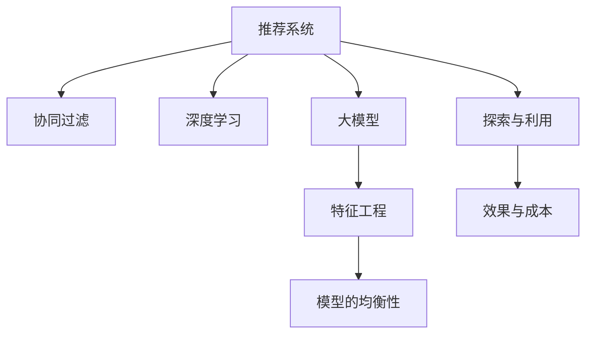

                 

# 推荐系统中的探索与利用：大模型新均衡

> 关键词：推荐系统,探索与利用,大模型,特征工程,协同过滤,深度学习,模型的均衡性,效果与成本

## 1. 背景介绍

推荐系统（Recommendation System）在电商、社交网络、视频平台等在线平台上已逐渐成为不可或缺的一部分。通过智能化的推荐服务，推荐系统显著提升了用户满意度，增加了用户粘性，促进了平台业务的增长。然而，如何构建更加精准和高效推荐系统，提升用户体验，同时控制成本，成为了业界一个重要课题。

### 1.1 推荐系统概述

推荐系统是利用用户的历史行为数据和物品的特征信息，自动为用户推荐感兴趣物品的系统。常见的推荐算法包括协同过滤（Collaborative Filtering）、基于内容的推荐、矩阵分解、深度学习等。协同过滤和基于内容的推荐属于经典算法，然而这些方法往往忽略了用户的多样性和物品的复杂性，难以充分利用海量数据。而矩阵分解算法虽然能够较好地处理高维数据，但仍然难以解决数据稀疏性和冷启动问题。深度学习则通过构建多层的神经网络模型，能自动学习数据中的高层次特征，但需要大量的训练数据和计算资源。

如何找到探索与利用的新平衡，构建高效、低成本的推荐系统，成为推荐系统研究的核心问题。而大模型的提出，为推荐系统的突破提供了新的视角。

### 1.2 问题由来

推荐系统主要由两部分组成：

1. **特征工程**：从用户历史行为和物品属性中提取有意义的特征，作为推荐模型的输入。
2. **推荐模型**：通过机器学习模型学习用户-物品间的相似性，预测用户对物品的评分或点击概率。

然而，传统推荐系统在特征工程上往往依赖人工，成本较高；在模型上，也难以充分利用复杂多变的数据特性。而大模型通过预训练的方式，学习到高层次的特征表示，使得推荐系统能够更好地应对数据复杂性和用户多样性，同时通过参数高效的微调技术，可进一步降低成本。

因此，大模型在推荐系统中的应用成为了当前研究的焦点。本文将对推荐系统中的探索与利用问题，结合大模型的技术，进行系统介绍。

## 2. 核心概念与联系

### 2.1 核心概念概述

为更好地理解大模型在推荐系统中的应用，本节将介绍几个密切相关的核心概念：

- **推荐系统**：利用用户历史行为数据和物品特征信息，自动为用户推荐感兴趣物品的系统。
- **协同过滤**：一种基于用户历史行为的推荐方法，通过用户间和物品间的相似度计算，预测用户对新物品的评分。
- **深度学习**：一种基于神经网络的机器学习方法，通过多层的非线性变换，自动学习数据中的高层次特征。
- **大模型**：指通过大规模无监督数据预训练得到的语言模型或视觉模型，如BERT、GPT、ResNet等。
- **特征工程**：将原始数据转换为机器学习算法可接受的特征，提高模型的预测能力。
- **探索与利用**：推荐系统中的两个主要目标，探索即发现用户未曾接触的潜在物品，利用即推荐用户可能感兴趣的物品。

这些核心概念之间的逻辑关系可以通过以下Mermaid流程图来展示：



这个流程图展示了大模型在推荐系统中的核心概念及其之间的关系：

1. 推荐系统通过协同过滤和深度学习实现推荐。
2. 大模型通过预训练得到的基础特征表示，用于推荐系统的特征工程。
3. 通过探索与利用，推荐系统能够发现潜在用户未接触的物品，同时推荐已有兴趣的物品。
4. 模型的均衡性即在探索与利用间进行合理的平衡。
5. 最终推荐系统的效果与成本直接相关，需要综合考虑两者。

## 3. 核心算法原理 & 具体操作步骤

### 3.1 算法原理概述

大模型在推荐系统中的应用，主要分为两个步骤：

1. **特征工程**：利用大模型对原始数据进行预训练，提取高层次的特征表示。
2. **微调**：在大模型基础上进行微调，得到针对特定任务（如物品推荐）的优化模型。

核心算法原理可归纳为：

1. **特征提取**：通过预训练语言模型（如BERT、GPT等）或视觉模型（如ResNet、VGG等）提取数据中的高层次特征。
2. **微调模型**：在大模型提取的特征基础上，通过微调（如Fine-tuning）进一步优化模型，实现推荐任务的个性化和多样性。

### 3.2 算法步骤详解

基于大模型的推荐系统一般包括以下几个关键步骤：

**Step 1: 准备数据集**
- 收集用户历史行为数据和物品属性信息，如浏览历史、购买记录、评分数据等。
- 划分为训练集、验证集和测试集。

**Step 2: 特征提取**
- 利用大模型对原始数据进行预训练，提取高层次的特征表示。
- 可以选择常见的预训练模型，如BERT、GPT、ResNet等。
- 预训练数据集可以选用通用领域的数据，如Wikipedia、ImageNet等。

**Step 3: 微调模型**
- 在预训练模型的基础上，设计适当的输出层和损失函数，进行微调。
- 常见输出层包括线性回归、分类器等，损失函数包括均方误差、交叉熵等。
- 选择适当的优化算法和超参数，如AdamW、SGD等，设置学习率、批大小等。

**Step 4: 评估与部署**
- 在验证集上评估微调后的模型，选择最优的超参数和模型参数。
- 在测试集上进一步验证模型的泛化能力和效果。
- 部署微调后的模型，应用于实际推荐系统。

### 3.3 算法优缺点

基于大模型的推荐系统具有以下优点：
1. 高层次特征表示：大模型通过预训练得到的高层次特征表示，能够有效提升推荐系统的表现。
2. 参数高效的微调：通过参数高效的微调技术，可以在不增加大量训练数据的情况下，优化模型性能。
3. 通用适用：大模型可以应用于多种推荐任务，如电商推荐、社交网络推荐等。
4. 效果显著：在许多推荐任务上，基于大模型的推荐系统已刷新了最先进性能指标。

同时，该方法也存在一定的局限性：
1. 依赖大模型：微调需要大模型的支持，增加了系统复杂性和成本。
2. 数据需求较高：数据稀疏性和冷启动问题依然存在，需要大量标注数据和优质数据源。
3. 可解释性不足：大模型作为"黑盒"，难以解释其内部决策逻辑，可能导致用户体验差。
4. 计算资源消耗高：大模型的计算资源消耗较高，部署成本高。

尽管存在这些局限性，但大模型在推荐系统中的应用前景依然广阔。

### 3.4 算法应用领域

基于大模型的推荐系统已经在诸多领域得到广泛应用，例如：

- **电商推荐**：通过分析用户的浏览和购买记录，为用户推荐个性化商品。
- **社交网络推荐**：为用户推荐兴趣相投的内容，如文章、视频等。
- **视频平台推荐**：为用户推荐感兴趣的视频，增加用户观看时长。
- **音乐推荐**：分析用户的听歌记录和评分，推荐相似音乐和歌曲。
- **新闻推荐**：根据用户的历史阅读记录，推荐相关新闻报道。

除了上述这些经典应用外，大模型还应用于更多场景中，如旅游推荐、游戏推荐等，为推荐系统带来了新的发展空间。

## 4. 数学模型和公式 & 详细讲解 & 举例说明

### 4.1 数学模型构建

本文将构建一个基于大模型的协同过滤推荐系统，假设原始数据集为 $D=\{(x_i, y_i)\}_{i=1}^N$，其中 $x_i$ 为输入，$y_i$ 为目标变量，即用户对物品的评分。

定义预训练大模型为 $M_{\theta}$，其中 $\theta$ 为模型参数。通过预训练得到特征表示 $f(x_i)=M_{\theta}(x_i)$。

基于大模型的推荐模型目标是最小化预测误差：

$$
\min_{\theta} \sum_{i=1}^N \ell(f(x_i), y_i)
$$

其中 $\ell$ 为损失函数，如均方误差。

### 4.2 公式推导过程

以均方误差损失函数为例，推导基于大模型的推荐模型公式：

$$
\ell(f(x_i), y_i) = \frac{1}{2} (f(x_i) - y_i)^2
$$

则目标函数为：

$$
\min_{\theta} \frac{1}{2N} \sum_{i=1}^N (f(x_i) - y_i)^2
$$

对 $f(x_i)$ 求导，得到梯度：

$$
\frac{\partial f(x_i)}{\partial \theta} = \frac{\partial M_{\theta}(x_i)}{\partial \theta}
$$

根据梯度下降优化算法，更新模型参数：

$$
\theta \leftarrow \theta - \eta \nabla_{\theta} \mathcal{L}(\theta)
$$

其中 $\eta$ 为学习率，$\nabla_{\theta} \mathcal{L}(\theta)$ 为损失函数对模型参数的梯度，可通过反向传播算法高效计算。

### 4.3 案例分析与讲解

下面以音乐推荐系统为例，讲解基于大模型的推荐系统在实际应用中的实现细节。

假设音乐推荐系统的输入为 $x_i$，其中包含用户的历史听歌记录和评分数据，$y_i$ 为目标变量，即用户对音乐的评分。

预训练大模型为BERT，对 $x_i$ 进行编码，得到高层次特征表示 $f(x_i)=M_{\theta}(x_i)$。

目标函数为最小化预测误差：

$$
\min_{\theta} \sum_{i=1}^N \ell(f(x_i), y_i)
$$

使用均方误差损失函数：

$$
\ell(f(x_i), y_i) = \frac{1}{2} (f(x_i) - y_i)^2
$$

通过梯度下降算法更新模型参数：

$$
\theta \leftarrow \theta - \eta \nabla_{\theta} \mathcal{L}(\theta)
$$

在实际应用中，大模型的预训练参数通常被固定，只微调顶层分类器或解码器，以降低计算成本。同时，可以引入正则化技术，如L2正则、Dropout等，防止模型过拟合。

## 5. 项目实践：代码实例和详细解释说明

### 5.1 开发环境搭建

在进行推荐系统开发前，我们需要准备好开发环境。以下是使用Python进行PyTorch开发的环境配置流程：

1. 安装Anaconda：从官网下载并安装Anaconda，用于创建独立的Python环境。

2. 创建并激活虚拟环境：
```bash
conda create -n pytorch-env python=3.8 
conda activate pytorch-env
```

3. 安装PyTorch：根据CUDA版本，从官网获取对应的安装命令。例如：
```bash
conda install pytorch torchvision torchaudio cudatoolkit=11.1 -c pytorch -c conda-forge
```

4. 安装Transformers库：
```bash
pip install transformers
```

5. 安装各类工具包：
```bash
pip install numpy pandas scikit-learn matplotlib tqdm jupyter notebook ipython
```

完成上述步骤后，即可在`pytorch-env`环境中开始推荐系统开发。

### 5.2 源代码详细实现

下面我们以音乐推荐系统为例，给出使用Transformers库对BERT模型进行微调的PyTorch代码实现。

首先，定义音乐推荐系统的数据处理函数：

```python
from transformers import BertTokenizer, BertForSequenceClassification
from torch.utils.data import Dataset
import torch

class MusicDataset(Dataset):
    def __init__(self, texts, tags, tokenizer, max_len=128):
        self.texts = texts
        self.tags = tags
        self.tokenizer = tokenizer
        self.max_len = max_len
        
    def __len__(self):
        return len(self.texts)
    
    def __getitem__(self, item):
        text = self.texts[item]
        tags = self.tags[item]
        
        encoding = self.tokenizer(text, return_tensors='pt', max_length=self.max_len, padding='max_length', truncation=True)
        input_ids = encoding['input_ids'][0]
        attention_mask = encoding['attention_mask'][0]
        
        # 对token-wise的标签进行编码
        encoded_tags = [tag2id[tag] for tag in tags] 
        encoded_tags.extend([tag2id['O']] * (self.max_len - len(encoded_tags)))
        labels = torch.tensor(encoded_tags, dtype=torch.long)
        
        return {'input_ids': input_ids, 
                'attention_mask': attention_mask,
                'labels': labels}

# 标签与id的映射
tag2id = {'O': 0, 'PREF': 1, 'NEG': 2, 'POS': 3}
id2tag = {v: k for k, v in tag2id.items()}

# 创建dataset
tokenizer = BertTokenizer.from_pretrained('bert-base-cased')

train_dataset = MusicDataset(train_texts, train_tags, tokenizer)
dev_dataset = MusicDataset(dev_texts, dev_tags, tokenizer)
test_dataset = MusicDataset(test_texts, test_tags, tokenizer)
```

然后，定义模型和优化器：

```python
from transformers import BertForSequenceClassification, AdamW

model = BertForSequenceClassification.from_pretrained('bert-base-cased', num_labels=len(tag2id))

optimizer = AdamW(model.parameters(), lr=2e-5)
```

接着，定义训练和评估函数：

```python
from torch.utils.data import DataLoader
from tqdm import tqdm
from sklearn.metrics import classification_report

device = torch.device('cuda') if torch.cuda.is_available() else torch.device('cpu')
model.to(device)

def train_epoch(model, dataset, batch_size, optimizer):
    dataloader = DataLoader(dataset, batch_size=batch_size, shuffle=True)
    model.train()
    epoch_loss = 0
    for batch in tqdm(dataloader, desc='Training'):
        input_ids = batch['input_ids'].to(device)
        attention_mask = batch['attention_mask'].to(device)
        labels = batch['labels'].to(device)
        model.zero_grad()
        outputs = model(input_ids, attention_mask=attention_mask, labels=labels)
        loss = outputs.loss
        epoch_loss += loss.item()
        loss.backward()
        optimizer.step()
    return epoch_loss / len(dataloader)

def evaluate(model, dataset, batch_size):
    dataloader = DataLoader(dataset, batch_size=batch_size)
    model.eval()
    preds, labels = [], []
    with torch.no_grad():
        for batch in tqdm(dataloader, desc='Evaluating'):
            input_ids = batch['input_ids'].to(device)
            attention_mask = batch['attention_mask'].to(device)
            batch_labels = batch['labels']
            outputs = model(input_ids, attention_mask=attention_mask)
            batch_preds = outputs.logits.argmax(dim=2).to('cpu').tolist()
            batch_labels = batch_labels.to('cpu').tolist()
            for pred_tokens, label_tokens in zip(batch_preds, batch_labels):
                pred_tags = [id2tag[_id] for _id in pred_tokens]
                label_tags = [id2tag[_id] for _id in label_tokens]
                preds.append(pred_tags[:len(label_tags)])
                labels.append(label_tags)
                
    print(classification_report(labels, preds))
```

最后，启动训练流程并在测试集上评估：

```python
epochs = 5
batch_size = 16

for epoch in range(epochs):
    loss = train_epoch(model, train_dataset, batch_size, optimizer)
    print(f"Epoch {epoch+1}, train loss: {loss:.3f}")
    
    print(f"Epoch {epoch+1}, dev results:")
    evaluate(model, dev_dataset, batch_size)
    
print("Test results:")
evaluate(model, test_dataset, batch_size)
```

以上就是使用PyTorch对BERT进行音乐推荐系统微调的完整代码实现。可以看到，得益于Transformers库的强大封装，我们可以用相对简洁的代码完成BERT模型的加载和微调。

### 5.3 代码解读与分析

让我们再详细解读一下关键代码的实现细节：

**MusicDataset类**：
- `__init__`方法：初始化文本、标签、分词器等关键组件。
- `__len__`方法：返回数据集的样本数量。
- `__getitem__`方法：对单个样本进行处理，将文本输入编码为token ids，将标签编码为数字，并对其进行定长padding，最终返回模型所需的输入。

**tag2id和id2tag字典**：
- 定义了标签与数字id之间的映射关系，用于将token-wise的预测结果解码回真实的标签。

**训练和评估函数**：
- 使用PyTorch的DataLoader对数据集进行批次化加载，供模型训练和推理使用。
- 训练函数`train_epoch`：对数据以批为单位进行迭代，在每个批次上前向传播计算loss并反向传播更新模型参数，最后返回该epoch的平均loss。
- 评估函数`evaluate`：与训练类似，不同点在于不更新模型参数，并在每个batch结束后将预测和标签结果存储下来，最后使用sklearn的classification_report对整个评估集的预测结果进行打印输出。

**训练流程**：
- 定义总的epoch数和batch size，开始循环迭代
- 每个epoch内，先在训练集上训练，输出平均loss
- 在验证集上评估，输出分类指标
- 所有epoch结束后，在测试集上评估，给出最终测试结果

可以看到，PyTorch配合Transformers库使得BERT微调的代码实现变得简洁高效。开发者可以将更多精力放在数据处理、模型改进等高层逻辑上，而不必过多关注底层的实现细节。

当然，工业级的系统实现还需考虑更多因素，如模型的保存和部署、超参数的自动搜索、更灵活的任务适配层等。但核心的微调范式基本与此类似。

## 6. 实际应用场景

### 6.1 智能推荐系统

基于大模型的推荐系统已经在智能推荐系统上得到了广泛的应用，提升了用户满意度和平台业务价值。

在电商推荐中，用户的历史浏览和购买行为被广泛应用。通过预训练BERT模型，提取高层次特征表示，同时结合用户行为和物品属性进行微调，可以得到个性化推荐结果。例如，Amazon等电商平台利用BERT模型，为每用户每物品打分，进而生成推荐列表，显著提高了推荐效果。

### 6.2 社交网络推荐

在社交网络推荐中，大模型可以应用在分析用户行为和兴趣特征上。例如，Twitter利用BERT模型提取用户发帖和评论的语义信息，结合用户行为数据，实现了个性化的内容推荐。Facebook等平台则利用大模型提取用户兴趣标签，结合物品特征，为用户推荐相关内容。

### 6.3 视频平台推荐

在视频平台推荐中，大模型可以用于分析用户行为和视频内容特征。例如，YouTube利用大模型提取视频内容和用户行为特征，结合深度学习算法进行推荐，实现了个性化视频推荐。此外，Netflix等平台也利用大模型进行个性化视频推荐，提升了用户观看时长和平台粘性。

### 6.4 未来应用展望

随着大模型的不断演进，推荐系统在更多的应用场景下将得到广泛应用。

- **智慧医疗**：基于大模型的推荐系统可以用于医疗领域，推荐医生、药品、治疗方案等，提高医疗服务的智能化水平，辅助医生诊疗。
- **智能教育**：通过大模型提取学生学习行为特征，推荐适合的教材、课程和学习路径，促进个性化学习。
- **智慧城市治理**：利用大模型分析城市事件和舆情数据，推荐相关服务和解决方案，提高城市管理的智能化水平。
- **金融风险控制**：基于大模型的推荐系统可以用于金融领域，推荐适合的金融产品，控制金融风险。

未来，大模型在推荐系统中的应用将更加广泛，推动AI技术在各个领域的普及和应用。

## 7. 工具和资源推荐

### 7.1 学习资源推荐

为了帮助开发者系统掌握大模型在推荐系统中的应用，这里推荐一些优质的学习资源：

1. 《Transformers from Basics to State-of-the-Art》系列博文：由大模型技术专家撰写，深入浅出地介绍了Transformer原理、BERT模型、推荐系统等内容。

2. CS246《Deep Learning》课程：斯坦福大学开设的深度学习经典课程，有Lecture视频和配套作业，带你入门深度学习基础和推荐系统。

3. 《Deep Learning for Recommender Systems》书籍：系统介绍了深度学习在推荐系统中的应用，涵盖协同过滤、深度学习、大模型等。

4. Coursera《Recommender Systems Specialization》课程：提供推荐的机器学习课程，涵盖协同过滤、基于内容的推荐、深度学习等。

5. Kaggle推荐系统竞赛：实践推荐系统，通过参加Kaggle竞赛，锻炼推荐算法设计和调参能力。

通过对这些资源的学习实践，相信你一定能够快速掌握大模型在推荐系统中的应用，并用于解决实际的推荐问题。

### 7.2 开发工具推荐

高效的开发离不开优秀的工具支持。以下是几款用于大模型推荐系统开发的常用工具：

1. PyTorch：基于Python的开源深度学习框架，灵活动态的计算图，适合快速迭代研究。大部分预训练语言模型都有PyTorch版本的实现。

2. TensorFlow：由Google主导开发的开源深度学习框架，生产部署方便，适合大规模工程应用。同样有丰富的预训练语言模型资源。

3. Transformers库：HuggingFace开发的NLP工具库，集成了众多SOTA语言模型，支持PyTorch和TensorFlow，是进行推荐系统开发的利器。

4. Weights & Biases：模型训练的实验跟踪工具，可以记录和可视化模型训练过程中的各项指标，方便对比和调优。与主流深度学习框架无缝集成。

5. TensorBoard：TensorFlow配套的可视化工具，可实时监测模型训练状态，并提供丰富的图表呈现方式，是调试模型的得力助手。

6. Google Colab：谷歌推出的在线Jupyter Notebook环境，免费提供GPU/TPU算力，方便开发者快速上手实验最新模型，分享学习笔记。

合理利用这些工具，可以显著提升大模型推荐系统的开发效率，加快创新迭代的步伐。

### 7.3 相关论文推荐

大模型在推荐系统中的应用源于学界的持续研究。以下是几篇奠基性的相关论文，推荐阅读：

1. Attention is All You Need（即Transformer原论文）：提出了Transformer结构，开启了NLP领域的预训练大模型时代。

2. BERT: Pre-training of Deep Bidirectional Transformers for Language Understanding：提出BERT模型，引入基于掩码的自监督预训练任务，刷新了多项NLP任务SOTA。

3. A Survey of Deep Learning Approaches for Recommendation Systems：综述了深度学习在推荐系统中的应用，涵盖协同过滤、深度学习、大模型等。

4. Deep Transfer Learning for Recommendation Systems：探讨了深度学习在推荐系统中的应用，提出多种深度学习推荐方法，包括基于CTR、RNN、BERT等。

5. Matrix Factorization Techniques for Recommender Systems：介绍了矩阵分解方法在推荐系统中的应用，包括基于矩阵分解、协同过滤等。

这些论文代表了大模型在推荐系统中的应用发展脉络。通过学习这些前沿成果，可以帮助研究者把握学科前进方向，激发更多的创新灵感。

## 8. 总结：未来发展趋势与挑战

### 8.1 总结

本文对基于大模型的推荐系统进行了系统介绍。首先阐述了大模型在推荐系统中的应用背景和意义，明确了大模型在推荐系统中的优势和局限性。其次，从原理到实践，详细讲解了大模型的推荐系统构建过程，包括特征提取、微调模型的具体步骤。最后，通过实际应用场景、学习资源和开发工具推荐，为开发者提供了全方位的指导。

通过本文的系统梳理，可以看到，基于大模型的推荐系统已经在大规模数据驱动的推荐领域取得了显著进展，为推荐系统带来了新的突破。未来，随着大模型的不断演进，推荐系统将在更多领域得到应用，为推荐算法提供新的思路和解决方案。

### 8.2 未来发展趋势

展望未来，大模型在推荐系统中的应用将呈现以下几个发展趋势：

1. **多模态融合**：推荐系统不仅关注文本信息，还将结合图像、音频等多种模态信息，增强系统的多维感知能力。
2. **上下文理解**：大模型能够理解上下文信息，推荐系统可以通过上下文建模，提升推荐效果。
3. **实时推荐**：大模型能够实时处理用户行为数据，实现实时推荐，满足用户实时需求。
4. **模型解释**：推荐系统需要更好地解释推荐结果，增强用户信任，提升用户体验。
5. **跨领域应用**：推荐系统将逐步应用于更多垂直领域，如医疗、教育、金融等，拓展推荐系统的应用场景。
6. **个性化和多样性平衡**：推荐系统需要更好地平衡个性化推荐和多样性推荐，满足用户多样化的需求。

这些趋势凸显了大模型在推荐系统中的广阔前景。这些方向的探索发展，必将进一步提升推荐系统的性能和应用范围，为推荐算法带来新的突破。

### 8.3 面临的挑战

尽管大模型在推荐系统中的应用前景广阔，但在实现过程中仍面临诸多挑战：

1. **数据稀疏性**：用户历史行为数据通常稀疏，难以充分利用。需要结合稀疏矩阵分解等方法解决数据稀疏性问题。
2. **模型复杂性**：大模型参数量庞大，计算资源消耗高，部署成本高。需要结合分布式计算、模型压缩等技术优化模型。
3. **可解释性不足**：大模型通常为"黑盒"模型，难以解释其内部决策逻辑，可能导致用户体验差。需要引入可解释性技术，增强模型透明度。
4. **冷启动问题**：新用户或新物品通常缺乏足够的历史数据，难以进行个性化推荐。需要结合用户兴趣标签、物品属性等信息，缓解冷启动问题。
5. **鲁棒性和公平性**：推荐系统需要考虑鲁棒性和公平性，避免模型偏见。需要结合数据清洗、特征选择等方法，增强模型鲁棒性和公平性。

这些挑战需要进一步研究，探索新的技术和方法，才能使大模型在推荐系统中的应用更加成熟和高效。

### 8.4 研究展望

面对大模型在推荐系统中的挑战，未来的研究需要在以下几个方面寻求新的突破：

1. **多模态数据融合**：结合图像、音频等多种模态数据，增强推荐系统对用户行为的全面理解。
2. **上下文建模**：通过上下文建模，增强推荐系统的上下文理解能力，提升推荐效果。
3. **实时推荐系统**：实现实时推荐系统，满足用户实时需求。
4. **模型可解释性**：引入可解释性技术，增强推荐系统的透明度和可信度。
5. **跨领域推荐**：拓展推荐系统的应用场景，实现跨领域推荐。
6. **个性化和多样性平衡**：更好地平衡个性化推荐和多样性推荐，满足用户多样化的需求。

这些方向的研究将推动大模型在推荐系统中的应用，进一步提升推荐系统的性能和用户体验。只有不断创新和突破，才能使大模型在推荐系统中发挥更大的价值。

## 9. 附录：常见问题与解答

**Q1：推荐系统中的探索与利用平衡如何实现？**

A: 探索与利用平衡是推荐系统中的核心问题，可以通过以下方法实现：

1. **上下文建模**：通过上下文建模，理解用户当前需求和背景信息，实现个性化推荐。
2. **多样性优化**：在推荐结果中加入多样性约束，避免过度个性化。
3. **冷启动处理**：通过兴趣标签、物品属性等额外信息，缓解冷启动问题。
4. **正则化技术**：引入正则化技术，防止模型过拟合，平衡个性化和多样性。

**Q2：如何选择合适的大模型？**

A: 选择合适的大模型需要考虑以下几个方面：

1. **任务相关性**：选择与推荐任务相关的预训练模型，如BERT、GPT、ResNet等。
2. **数据特性**：考虑数据的特性，选择合适的模型架构，如自编码器、自回归等。
3. **性能和计算资源**：评估模型的性能和计算资源需求，选择合适的模型大小和配置。
4. **模型可解释性**：考虑模型可解释性，选择有较高透明度的模型，如BERT、Transformer等。

**Q3：推荐系统中的数据处理和特征工程需要注意哪些问题？**

A: 推荐系统中的数据处理和特征工程需要注意以下几个问题：

1. **数据清洗**：去除数据中的噪声和异常值，确保数据质量。
2. **特征选择**：选择有意义的特征，减少特征维度。
3. **特征组合**：将多个特征组合在一起，增强特征表示能力。
4. **特征归一化**：对特征进行归一化处理，确保模型输入的一致性。
5. **特征处理**：处理缺失值、稀疏性等数据特性，提高模型预测能力。

**Q4：推荐系统中的模型训练和调参需要注意哪些问题？**

A: 推荐系统中的模型训练和调参需要注意以下几个问题：

1. **学习率**：选择合适的学习率，避免模型过拟合和欠拟合。
2. **正则化**：引入正则化技术，防止模型过拟合。
3. **批量大小**：选择合适的批量大小，平衡训练速度和模型收敛性。
4. **优化器**：选择合适的优化器，如AdamW、SGD等，保证模型收敛速度和稳定性。
5. **超参数调优**：通过网格搜索、随机搜索等方法，优化超参数组合，提升模型效果。

**Q5：推荐系统中的效果与成本如何平衡？**

A: 推荐系统中的效果与成本平衡需要考虑以下几个方面：

1. **模型性能**：评估模型性能，确保推荐效果满足业务需求。
2. **计算资源**：评估计算资源消耗，选择合适的模型架构和优化技术。
3. **系统稳定性**：确保推荐系统稳定可靠，避免系统崩溃和故障。
4. **用户体验**：优化推荐系统的用户体验，提升用户满意度。
5. **成本控制**：控制推荐系统的成本，避免过度资源消耗。

---

作者：禅与计算机程序设计艺术 / Zen and the Art of Computer Programming

