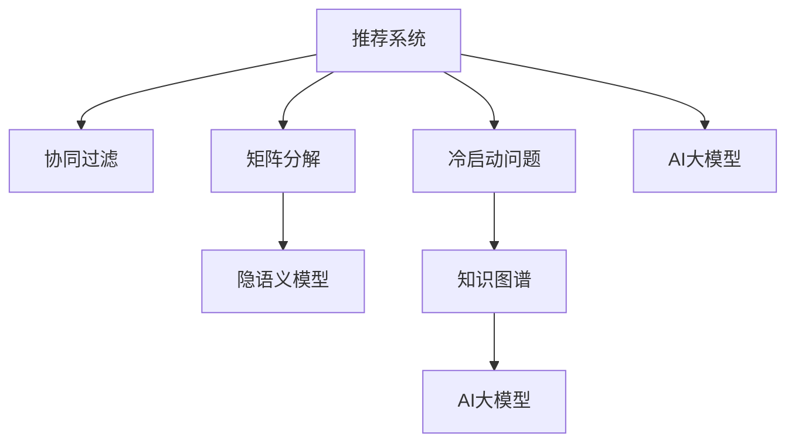

                 

# 推荐系统的冷启动问题：AI大模型的解决方案

## 1. 背景介绍

在推荐系统中，冷启动问题（Cold Start Problem）指在用户和/或物品尚未产生足够交互行为时，难以进行个性化推荐，从而推荐的准确性和多样性受到影响。这一问题在初期用户积累不足、商品库不够丰富或新上线的推荐模型中尤为明显。随着数据量的增长，冷启动问题逐渐缓解，但对于追求个性化推荐的高质量电商、社交、视频等平台，冷启动仍是亟待解决的挑战。

### 1.1 问题由来
推荐系统通过分析用户的历史行为数据，预测其对未来物品的兴趣和偏好。但在用户加入平台初期，未产生任何行为数据，难以形成用户画像，导致推荐结果泛泛而泛泛，难以满足用户的个性化需求。对于新物品而言，由于历史互动数据不足，系统无法准确预测用户对该物品的兴趣。因此，冷启动问题直接影响到推荐系统的效果和用户体验。

### 1.2 问题核心关键点
冷启动问题的主要表现形式为：
- 新用户的推荐：对于新用户，推荐系统无法基于其历史行为数据进行建模，只能提供泛泛而泛泛的推荐。
- 新物品的推荐：对于新物品，由于缺乏用户互动数据，推荐系统无法判断用户对该物品的兴趣程度。

推荐系统在冷启动阶段面临的挑战包括：
1. 数据稀缺：新用户和物品的历史行为数据有限，难以准确建模。
2. 鲁棒性不足：模型对输入数据的质量和多样性较为敏感，小数据集容易导致过拟合或欠拟合。
3. 泛化能力弱：缺乏足够数据时，推荐系统难以捕捉用户或物品的真实兴趣和偏好。

## 2. 核心概念与联系

### 2.1 核心概念概述

为更好地理解推荐系统冷启动的解决方案，本节将介绍几个密切相关的核心概念：

- 推荐系统（Recommendation System）：通过分析用户历史行为数据，预测并推荐其感兴趣物品的系统。
- 协同过滤（Collaborative Filtering）：推荐系统中最基础的算法类型，基于用户或物品的相似度进行推荐。
- 矩阵分解（Matrix Factorization）：通过将用户-物品评分矩阵分解为两个低维矩阵，预测用户对新物品的评分。
- 隐语义模型（Latent Semantic Model）：通过隐含层，将用户-物品评分矩阵映射为低维稠密表示，提升模型的泛化能力。
- 冷启动问题（Cold Start Problem）：推荐系统中新用户或新物品缺乏足够历史数据时的推荐难题。
- 知识图谱（Knowledge Graph）：结合结构化和非结构化数据，刻画用户、物品之间的关联网络，丰富推荐依据。
- AI大模型（AI Large Model）：基于大规模预训练语言模型，结合领域知识图谱，通过迁移学习和微调，解决推荐系统中的冷启动问题。

这些核心概念之间的逻辑关系可以通过以下Mermaid流程图来展示：



这个流程图展示了一组推荐系统的关键概念及其之间的关系：

1. 推荐系统通过协同过滤、矩阵分解、隐语义模型等算法进行处理。
2. 冷启动问题影响推荐系统效果，需要通过知识图谱、AI大模型等手段加以解决。
3. 知识图谱结合结构化数据，丰富了推荐依据，AI大模型则结合预训练知识，提升了推荐的准确性和多样性。

这些概念共同构成了推荐系统的技术框架，为其提供了解决冷启动问题的方法。通过理解这些核心概念，我们可以更好地把握推荐系统的运行原理和优化方向。

## 3. 核心算法原理 & 具体操作步骤

### 3.1 算法原理概述

AI大模型结合知识图谱，通过迁移学习和微调，可以解决推荐系统中的冷启动问题。其核心思想是：将预训练的大模型作为强大的"特征提取器"，通过迁移学习利用已有领域知识，并通过微调适应特定推荐场景，提升推荐效果。

具体来说，AI大模型对预训练语言模型的迁移学习流程包括：

1. 选择合适的预训练语言模型作为初始化参数，如BERT、GPT等。
2. 将领域知识图谱与预训练模型进行结合，构建图谱嵌入（Graph Embedding）。
3. 在结合图谱知识的前提下，对预训练模型进行微调，适应推荐场景中的特定任务。

### 3.2 算法步骤详解

AI大模型结合知识图谱解决推荐系统冷启动问题的具体步骤如下：

**Step 1: 准备预训练模型和知识图谱**
- 选择合适的预训练语言模型，如BERT、GPT等，作为初始化参数。
- 收集并构建领域知识图谱，包含用户、物品的实体及其属性关系。

**Step 2: 添加领域知识嵌入层**
- 对知识图谱进行嵌入，生成领域知识向量表示。
- 将领域知识嵌入层与预训练语言模型深度融合。

**Step 3: 设置微调超参数**
- 选择合适的优化算法及其参数，如Adam、SGD等，设置学习率、批大小、迭代轮数等。
- 设置正则化技术及强度，包括权重衰减、Dropout、Early Stopping等。
- 确定冻结预训练参数的策略，如仅微调顶层，或全部参数都参与微调。

**Step 4: 执行梯度训练**
- 将训练集数据分批次输入模型，前向传播计算损失函数。
- 反向传播计算参数梯度，根据设定的优化算法和学习率更新模型参数。
- 周期性在验证集上评估模型性能，根据性能指标决定是否触发 Early Stopping。
- 重复上述步骤直到满足预设的迭代轮数或 Early Stopping 条件。

**Step 5: 测试和部署**
- 在测试集上评估微调后模型 $M_{\hat{\theta}}$ 的性能，对比微调前后的精度提升。
- 使用微调后的模型对新用户或新物品进行推荐，集成到实际的应用系统中。
- 持续收集新的数据，定期重新微调模型，以适应数据分布的变化。

### 3.3 算法优缺点

结合知识图谱的AI大模型解决推荐系统冷启动问题，具有以下优点：
1. 数据利用率高。通过将领域知识图谱与预训练语言模型结合，AI大模型能够更高效地利用结构化数据，提升推荐的准确性。
2. 泛化能力强。AI大模型的知识图谱嵌入层能够捕捉用户-物品之间的语义关系，提升模型的泛化能力，减少过拟合风险。
3. 适应性强。AI大模型通过微调能够灵活适应不同领域、不同数据分布的推荐场景。
4. 效果显著。结合知识图谱的AI大模型在推荐系统中取得了诸多成功的应用案例，显著提升了推荐效果。

同时，该方法也存在一定的局限性：
1. 图谱构建复杂。构建高质量领域知识图谱需要耗费大量人工成本，且数据源依赖性强。
2. 模型复杂度高。结合知识图谱的AI大模型参数量较大，计算和存储成本较高。
3. 推荐速度慢。复杂的模型结构和大批量的数据输入，可能导致推理速度较慢，用户体验受到影响。
4. 安全风险高。知识图谱中的数据可能包含敏感信息，一旦泄露，将带来严重的安全风险。

尽管存在这些局限性，但就目前而言，结合知识图谱的AI大模型仍是推荐系统解决冷启动问题的有效手段。未来相关研究的重点在于如何进一步降低图谱构建成本，提升模型推理速度，同时兼顾安全性和可用性等因素。

### 3.4 算法应用领域

结合知识图谱的AI大模型在推荐系统中的应用，已经得到了广泛的应用，覆盖了电商、社交、视频等多个领域，例如：

- 电商平台：通过用户行为数据和商品属性数据，生成个性化推荐。
- 社交平台：基于用户兴趣和好友关系，推荐内容和个人互动对象。
- 视频网站：根据用户观看记录和视频特征，推荐相似视频。

除了上述这些经典应用外，AI大模型结合知识图谱的推荐系统还在智能助手、智能广告、智能交通等诸多场景中得到创新应用，为推荐技术带来了新的突破。随着知识图谱技术和AI大模型的持续演进，相信推荐系统将在更广泛的领域得到应用，为用户带来更为精准、多样化的推荐服务。

## 4. 数学模型和公式 & 详细讲解 & 举例说明

### 4.1 数学模型构建

本节将使用数学语言对结合知识图谱的AI大模型进行更加严格的刻画。

假设推荐系统中的用户集为 $U=\{u_1, u_2, ..., u_M\}$，物品集为 $I=\{i_1, i_2, ..., i_N\}$，用户-物品评分矩阵为 $R \in \mathbb{R}^{M \times N}$。设领域知识图谱为 $G=(E, R)$，其中 $E$ 为实体集合，$R$ 为实体之间的关系集合。定义 $h_u$ 为用户 $u$ 的图谱嵌入，$i_v$ 为物品 $v$ 的图谱嵌入。

定义模型的预测函数为：

$$
f(h_u, h_v) = M_{\theta}(h_u, h_v)
$$

其中 $M_{\theta}$ 为结合领域知识图谱的预训练语言模型，$\theta$ 为模型参数。

模型的预测评分表示为用户 $u$ 对物品 $v$ 的预测评分：

$$
\hat{R}_{uv} = f(h_u, h_v)
$$

目标是最小化预测评分与实际评分之间的差异，即：

$$
\min_{\theta} \sum_{u=1}^M \sum_{v=1}^N (R_{uv} - \hat{R}_{uv})^2
$$

### 4.2 公式推导过程

以下我们以用户-物品评分预测为例，推导模型的预测评分函数及其梯度的计算公式。

假设用户 $u$ 的特征向量为 $h_u$，物品 $v$ 的特征向量为 $h_v$，预训练语言模型 $M_{\theta}$ 的输出为 $\hat{R}_{uv}$。则模型的预测评分函数为：

$$
\hat{R}_{uv} = M_{\theta}(h_u, h_v) = \text{Softmax}(\theta \cdot h_u \cdot h_v^T)
$$

其中 $\text{Softmax}$ 函数将模型输出转化为概率分布，$\cdot$ 表示矩阵乘法。

目标函数为：

$$
L = \frac{1}{2} \sum_{u=1}^M \sum_{v=1}^N (R_{uv} - \hat{R}_{uv})^2
$$

对目标函数求导，得：

$$
\frac{\partial L}{\partial \theta} = - \sum_{u=1}^M \sum_{v=1}^N (R_{uv} - \hat{R}_{uv}) (h_u \cdot h_v^T) h_v
$$

在得到损失函数的梯度后，即可带入参数更新公式，完成模型的迭代优化。重复上述过程直至收敛，最终得到适应推荐场景的最优模型参数 $\theta^*$。

## 5. 项目实践：代码实例和详细解释说明

### 5.1 开发环境搭建

在进行推荐系统开发前，我们需要准备好开发环境。以下是使用Python进行PyTorch开发的环境配置流程：

1. 安装Anaconda：从官网下载并安装Anaconda，用于创建独立的Python环境。

2. 创建并激活虚拟环境：
```bash
conda create -n pytorch-env python=3.8 
conda activate pytorch-env
```

3. 安装PyTorch：根据CUDA版本，从官网获取对应的安装命令。例如：
```bash
conda install pytorch torchvision torchaudio cudatoolkit=11.1 -c pytorch -c conda-forge
```

4. 安装TensorFlow：
```bash
conda install tensorflow tensorflow-gpu=2.8.0
```

5. 安装TensorBoard：
```bash
conda install tensorboard
```

6. 安装PyTorch Lightning：
```bash
conda install pytorch-lightning
```

完成上述步骤后，即可在`pytorch-env`环境中开始推荐系统开发。

### 5.2 源代码详细实现

下面我们以商品推荐系统为例，给出使用PyTorch Lightning对BERT模型进行推荐系统开发的完整代码实现。

首先，定义推荐系统的数据处理函数：

```python
from torch.utils.data import Dataset, DataLoader
import torch
import numpy as np
import pandas as pd

class RecommendationDataset(Dataset):
    def __init__(self, df, tokenizer, max_len=128):
        self.df = df
        self.tokenizer = tokenizer
        self.max_len = max_len
        
    def __len__(self):
        return len(self.df)
    
    def __getitem__(self, item):
        user_id = self.df.iloc[item]['user_id']
        item_id = self.df.iloc[item]['item_id']
        
        user_seq = self.df.iloc[item]['user_seq']
        item_seq = self.df.iloc[item]['item_seq']
        
        user_tokens = [item for item in user_seq.split(' ')]
        item_tokens = [item for item in item_seq.split(' ')]
        
        encoding = self.tokenizer(user_tokens, item_tokens, return_tensors='pt', max_length=self.max_len, padding='max_length', truncation=True)
        user_ids = encoding['input_ids'][0]
        item_ids = encoding['input_ids'][1]
        
        return {'user_ids': user_ids, 
                'item_ids': item_ids,
                'labels': torch.tensor(self.df.iloc[item]['label'], dtype=torch.float)}
```

然后，定义模型和优化器：

```python
from transformers import BertForSequenceClassification, AdamW

model = BertForSequenceClassification.from_pretrained('bert-base-cased', num_labels=1)

optimizer = AdamW(model.parameters(), lr=2e-5)
```

接着，定义训练和评估函数：

```python
from torch.utils.data import DataLoader
from tqdm import tqdm
from sklearn.metrics import roc_auc_score

device = torch.device('cuda') if torch.cuda.is_available() else torch.device('cpu')
model.to(device)

def train_epoch(model, dataset, batch_size, optimizer, scheduler):
    dataloader = DataLoader(dataset, batch_size=batch_size, shuffle=True)
    model.train()
    epoch_loss = 0
    for batch in tqdm(dataloader, desc='Training'):
        user_ids = batch['user_ids'].to(device)
        item_ids = batch['item_ids'].to(device)
        labels = batch['labels'].to(device)
        model.zero_grad()
        outputs = model(user_ids, item_ids)
        loss = outputs.loss
        epoch_loss += loss.item()
        loss.backward()
        optimizer.step()
        scheduler.step()
    return epoch_loss / len(dataloader)

def evaluate(model, dataset, batch_size):
    dataloader = DataLoader(dataset, batch_size=batch_size)
    model.eval()
    preds, labels = [], []
    with torch.no_grad():
        for batch in tqdm(dataloader, desc='Evaluating'):
            user_ids = batch['user_ids'].to(device)
            item_ids = batch['item_ids'].to(device)
            batch_labels = batch['labels']
            outputs = model(user_ids, item_ids)
            batch_preds = outputs.logits.argmax(dim=1).to('cpu').tolist()
            batch_labels = batch_labels.to('cpu').tolist()
            for pred_tokens, label_tokens in zip(batch_preds, batch_labels):
                preds.append(pred_tokens)
                labels.append(label_tokens)
                
    auc = roc_auc_score(labels, preds)
    return auc
```

最后，启动训练流程并在测试集上评估：

```python
epochs = 5
batch_size = 16

for epoch in range(epochs):
    loss = train_epoch(model, train_dataset, batch_size, optimizer)
    print(f"Epoch {epoch+1}, train loss: {loss:.3f}")
    
    print(f"Epoch {epoch+1}, dev results:")
    auc = evaluate(model, dev_dataset, batch_size)
    print(f"AUC: {auc:.4f}")
    
print("Test results:")
auc = evaluate(model, test_dataset, batch_size)
print(f"AUC: {auc:.4f}")
```

以上就是使用PyTorch Lightning对BERT模型进行商品推荐系统微调的完整代码实现。可以看到，得益于PyTorch Lightning的强大封装，我们可以用相对简洁的代码完成BERT模型的加载和微调。

### 5.3 代码解读与分析

让我们再详细解读一下关键代码的实现细节：

**RecommendationDataset类**：
- `__init__`方法：初始化用户序列、物品序列、分词器等关键组件。
- `__len__`方法：返回数据集的样本数量。
- `__getitem__`方法：对单个样本进行处理，将用户序列和物品序列输入编码为token ids，最终返回模型所需的输入。

**BertForSequenceClassification模型**：
- `__init__`方法：初始化BERT模型，设定分类数（1）。
- `forward`方法：前向传播计算模型输出，返回logits。

**train_epoch函数**：
- 使用PyTorch Lightning的DataLoader对数据集进行批次化加载，供模型训练和推理使用。
- 在每个epoch内，每个batch上前向传播计算损失函数并反向传播更新模型参数，最后返回该epoch的平均loss。
- 使用AdamW优化器和自适应学习率调度器（Learning Rate Scheduler）进行优化。

**evaluate函数**：
- 与训练类似，不同点在于不更新模型参数，并在每个batch结束后将预测和标签结果存储下来，最后使用scikit-learn的roc_auc_score对整个评估集的预测结果进行打印输出。

**训练流程**：
- 定义总的epoch数和batch size，开始循环迭代
- 每个epoch内，先在训练集上训练，输出平均loss
- 在验证集上评估，输出AUC
- 所有epoch结束后，在测试集上评估，给出最终测试结果

可以看到，PyTorch Lightning配合BERT模型使得推荐系统微调的代码实现变得简洁高效。开发者可以将更多精力放在数据处理、模型改进等高层逻辑上，而不必过多关注底层的实现细节。

当然，工业级的系统实现还需考虑更多因素，如模型的保存和部署、超参数的自动搜索、更灵活的任务适配层等。但核心的微调范式基本与此类似。

## 6. 实际应用场景
### 6.1 电商推荐系统

基于AI大模型的推荐系统，可以广泛应用于电商平台，提升用户的购物体验和转化率。电商平台通常有海量的商品和用户数据，通过AI大模型结合领域知识图谱，可以提供个性化、多样化的商品推荐，提升用户体验和平台收入。

在技术实现上，可以收集电商平台的商品信息和用户浏览行为数据，构建商品-用户评分矩阵和领域知识图谱。在此基础上，对预训练BERT模型进行微调，使模型能够预测用户对新商品的评分，并生成个性化的商品推荐列表。新商品的评分可以通过对新用户行为数据的快速预测得到，提升推荐效率。

### 6.2 社交媒体推荐系统

社交媒体推荐系统需要解决用户间关系推荐的问题，即根据用户的兴趣和好友关系，推荐可能感兴趣的内容和个人互动对象。通过AI大模型结合知识图谱，可以实现基于用户图谱和物品图谱的推荐。

具体而言，可以收集用户的社交行为数据，构建用户-好友关系图谱。同时收集物品的特征信息，构建物品图谱。将用户图谱和物品图谱与预训练BERT模型结合，微调模型生成推荐结果。对于新用户和新物品，可以通过对现有用户图谱和物品图谱的推理和预测，快速推荐相关内容和好友。

### 6.3 视频推荐系统

视频推荐系统通常需要解决冷启动用户推荐和长尾视频推荐的问题。通过AI大模型结合知识图谱，可以提升推荐系统的泛化能力和效果。

具体而言，可以收集用户的视频观看记录和属性信息，构建用户图谱和视频图谱。将视频图谱与预训练BERT模型结合，微调模型生成推荐结果。对于冷启动用户，可以通过对现有用户图谱的推理和预测，生成个性化推荐视频。对于长尾视频，可以通过对视频特征信息的匹配和相似度计算，生成相关推荐视频。

### 6.4 未来应用展望

随着AI大模型和推荐系统技术的不断发展，未来基于知识图谱的推荐系统将在更多领域得到应用，为传统行业带来变革性影响。

在医疗领域，结合医疗知识图谱，AI大模型可以帮助医生进行疾病诊断和治疗推荐，提升诊疗效率和患者满意度。

在金融领域，结合金融知识图谱，AI大模型可以实现个性化的理财和投资推荐，提升用户的理财效果和平台收入。

在旅游领域，结合旅游知识图谱，AI大模型可以提供个性化的旅游目的地推荐，提升用户的旅游体验和平台转化率。

此外，在教育、房地产、娱乐等众多领域，基于知识图谱的AI大模型推荐系统也将不断涌现，为各行各业提供智能推荐服务。相信随着技术的日益成熟，AI大模型结合知识图谱的推荐系统必将在更广阔的领域得到应用，为用户带来更为精准、多样化的推荐服务。

## 7. 工具和资源推荐
### 7.1 学习资源推荐

为了帮助开发者系统掌握推荐系统冷启动问题的解决方案，这里推荐一些优质的学习资源：

1. 《Recommender Systems: The Textbook》系列书籍：全面介绍了推荐系统的基本概念、算法和技术，包括基于知识图谱的推荐系统。
2. CS246A《Recommender Systems》课程：斯坦福大学开设的推荐系统明星课程，深入浅出地讲解了推荐系统的工作原理和关键技术。
3. 《Handbook of Recommendation Systems》书籍：推荐系统领域的综述性文献，包含大量的应用案例和创新方法。
4. KDD Cup 2022推荐系统竞赛：通过实战竞赛学习推荐系统的模型构建和优化技术。
5. Arxiv上的推荐系统论文：跟踪最新的推荐系统研究进展，了解前沿技术和创新思路。

通过对这些资源的学习实践，相信你一定能够快速掌握AI大模型结合知识图谱的推荐系统技术，并用于解决实际的推荐问题。
###  7.2 开发工具推荐

高效的开发离不开优秀的工具支持。以下是几款用于推荐系统开发的常用工具：

1. PyTorch：基于Python的开源深度学习框架，灵活动态的计算图，适合快速迭代研究。
2. TensorFlow：由Google主导开发的开源深度学习框架，生产部署方便，适合大规模工程应用。
3. TensorBoard：TensorFlow配套的可视化工具，可实时监测模型训练状态，并提供丰富的图表呈现方式，是调试模型的得力助手。
4. PyTorch Lightning：基于PyTorch的模型管理框架，可以快速搭建和优化深度学习模型。
5. Weights & Biases：模型训练的实验跟踪工具，可以记录和可视化模型训练过程中的各项指标，方便对比和调优。
6. Jupyter Notebook：开源的交互式编程环境，支持Python、R等多种语言，便于协同开发和分享。

合理利用这些工具，可以显著提升推荐系统开发和优化的效率，加快创新迭代的步伐。

### 7.3 相关论文推荐

推荐系统中的冷启动问题一直是研究的热点。以下是几篇奠基性的相关论文，推荐阅读：

1. Neighborhood-based Collaborative Filtering: The Accuracy-Bias Tradeoff：引入了邻近性概念，通过用户的相似性进行推荐，对协同过滤算法进行了改进。
2. Matrix Factorization Techniques for Recommender Systems：提出了矩阵分解方法，将用户-物品评分矩阵分解为低维矩阵，预测用户对新物品的评分。
3. Latent Semantic Models for Recommender Systems：引入隐语义模型，通过隐含层捕捉用户-物品之间的语义关系，提升模型的泛化能力。
4. Deep Neural Networks for News Article Recommendation：通过构建神经网络模型，实现了新闻文章的推荐，对推荐系统模型进行了创新。
5. Web Mining and Statistical Learning: Algorithms for Recommender Systems：提供了基于Web挖掘和统计学习的推荐系统算法，具有较强的实用性和创新性。

这些论文代表了推荐系统领域的研究方向，通过学习这些前沿成果，可以帮助研究者把握学科前进方向，激发更多的创新灵感。

## 8. 总结：未来发展趋势与挑战

### 8.1 总结

本文对AI大模型结合知识图谱解决推荐系统冷启动问题的技术进行了全面系统的介绍。首先阐述了推荐系统中冷启动问题的背景和挑战，明确了AI大模型结合知识图谱的解决方案的基本原理和关键步骤。其次，从原理到实践，详细讲解了结合知识图谱的AI大模型的数学模型和实现细节，给出了推荐系统开发的完整代码实例。同时，本文还广泛探讨了AI大模型结合知识图谱在电商、社交、视频等多个推荐系统中的应用前景，展示了其在解决冷启动问题方面的巨大潜力。此外，本文精选了推荐系统相关的学习资源、开发工具和研究论文，力求为读者提供全方位的技术指引。

通过本文的系统梳理，可以看到，AI大模型结合知识图谱在推荐系统中展现出了强大的应用前景和优越的性能，为推荐系统解决了冷启动问题，带来了显著的收益和体验提升。未来，伴随AI大模型和知识图谱技术的不断演进，相信结合知识图谱的AI大模型推荐系统必将在更广泛的领域得到应用，为用户带来更为精准、多样化的推荐服务。

### 8.2 未来发展趋势

展望未来，AI大模型结合知识图谱在推荐系统中的应用将呈现以下几个发展趋势：

1. 知识图谱与AI大模型深度融合。未来，知识图谱将更加深入地嵌入AI大模型，增强模型的语义理解和推理能力，提升推荐的准确性和多样性。
2. 多模态融合。除了文本信息外，推荐系统将更多地利用图像、语音、视频等多模态数据，丰富推荐依据，提升用户体验。
3. 在线推荐算法。实时在线的推荐算法能够即时响应用户行为，提供更个性化的推荐服务，提升用户满意度。
4. 自动化模型优化。通过自动化调参和模型优化技术，提升推荐模型的精度和效率，降低人工干预成本。
5. 隐私保护。推荐系统将更加注重用户隐私保护，采用差分隐私、联邦学习等技术，保护用户数据安全。
6. 跨领域应用。AI大模型结合知识图谱的推荐系统将广泛应用于更多行业领域，如医疗、金融、教育等，为不同行业带来智能化变革。

以上趋势凸显了AI大模型结合知识图谱的推荐系统的广阔前景。这些方向的探索发展，必将进一步提升推荐系统的性能和应用范围，为各行各业带来智能化的新体验。

### 8.3 面临的挑战

尽管AI大模型结合知识图谱在推荐系统中取得了诸多成功应用，但在迈向更加智能化、普适化应用的过程中，它仍面临着诸多挑战：

1. 知识图谱构建成本高。构建高质量领域知识图谱需要耗费大量人工成本，且数据源依赖性强。
2. 模型复杂度高。AI大模型结合知识图谱的推荐系统参数量较大，计算和存储成本较高。
3. 推荐速度慢。复杂的模型结构和大批量的数据输入，可能导致推理速度较慢，用户体验受到影响。
4. 隐私风险高。知识图谱中的数据可能包含敏感信息，一旦泄露，将带来严重的隐私风险。
5. 推荐效果受数据质量影响。推荐系统的效果很大程度上依赖于数据的质量和多样性，小数据集容易导致过拟合或欠拟合。

尽管存在这些挑战，但就目前而言，AI大模型结合知识图谱仍是推荐系统解决冷启动问题的有效手段。未来相关研究的重点在于如何进一步降低知识图谱构建成本，提升模型推理速度，同时兼顾隐私保护和推荐效果。

### 8.4 研究展望

未来，AI大模型结合知识图谱的推荐系统需要在以下几个方面寻求新的突破：

1. 知识图谱自动构建。利用深度学习技术自动构建知识图谱，降低人工成本，提升数据源的多样性。
2. 多模态融合方法。结合图像、语音、视频等多模态数据，丰富推荐依据，提升模型的泛化能力。
3. 推荐系统自动化调参。利用自动化调参技术，提升推荐模型的精度和效率，降低人工干预成本。
4. 隐私保护技术。采用差分隐私、联邦学习等技术，保护用户数据安全，降低隐私风险。
5. 跨领域推荐算法。将推荐算法应用于更多行业领域，如医疗、金融、教育等，提升各行各业的智能化水平。
6. 在线推荐系统。构建实时在线的推荐系统，即时响应用户行为，提供更个性化的推荐服务，提升用户满意度。

这些研究方向将推动AI大模型结合知识图谱的推荐系统迈向更高的台阶，为用户带来更为精准、多样化的推荐服务。相信随着技术的不断创新和进步，AI大模型结合知识图谱的推荐系统必将在更多领域得到应用，带来智能化的新变革。

## 9. 附录：常见问题与解答

**Q1：什么是知识图谱？**

A: 知识图谱是一种结构化数据表示形式，用于刻画实体间的语义关系。通常由节点（实体）和边（关系）构成，能够帮助机器更好地理解和推理实体之间的关联。

**Q2：如何选择合适的预训练语言模型？**

A: 选择预训练语言模型时，需要考虑其模型规模、性能、领域适应性等因素。一般来说，BERT、GPT等大型模型在大规模推荐系统中表现较好，但小规模系统中建议使用轻量级模型，如DistilBERT等。

**Q3：知识图谱的构建成本如何降低？**

A: 利用深度学习技术，自动构建知识图谱可以有效降低人工成本。例如，可以使用知识图谱生成模型，从结构化数据中自动推断关系，构建实体之间的关系图谱。

**Q4：推荐系统中的隐私保护技术有哪些？**

A: 推荐系统中的隐私保护技术包括差分隐私、联邦学习、同态加密等。差分隐私通过添加噪声保护用户隐私，联邦学习在不共享用户数据的情况下进行模型训练，同态加密可以在加密数据上直接进行计算，保护数据隐私。

**Q5：如何优化推荐系统的推荐速度？**

A: 通过模型剪枝、量化加速、多模态融合等方法，可以有效提升推荐系统的推理速度。同时，可以利用分布式计算和GPU加速等技术，进一步提升系统的响应速度。

**Q6：推荐系统中的异常检测方法有哪些？**

A: 推荐系统中的异常检测方法包括基于统计方法、基于深度学习的方法等。基于统计的方法包括均值-方差分析、异常因子等，基于深度学习的方法包括Autoencoder、GAN等。

这些问题的解答，希望能帮助读者更好地理解AI大模型结合知识图谱解决推荐系统冷启动问题的技术细节，掌握相关技术和方法。

