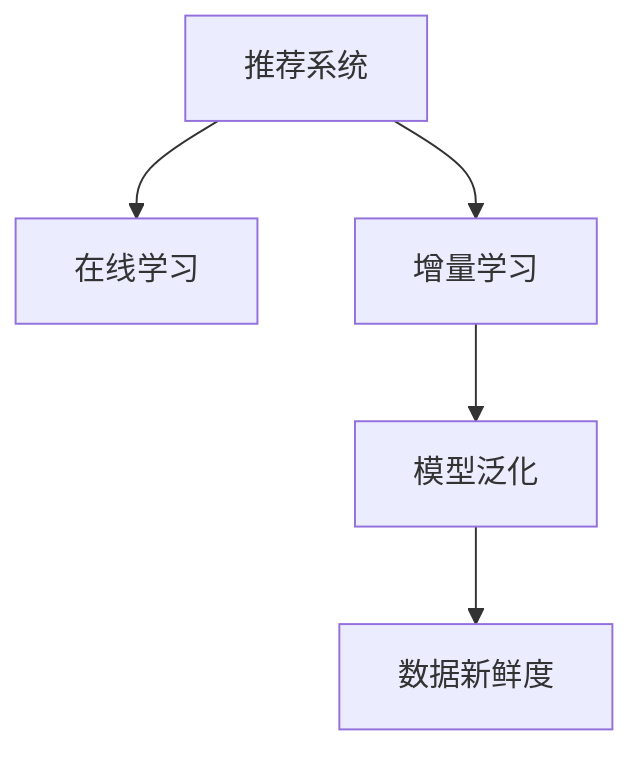

                 

# 推荐系统的时效性：AI大模型的实时更新机制

> 关键词：推荐系统, 实时更新, 数据新鲜度, 模型泛化, 在线学习, 增量学习

## 1. 背景介绍

### 1.1 问题由来

推荐系统作为互联网产品中的核心功能之一，已经渗透到了我们生活的方方面面。从电商购物到内容娱乐，从社交互动到出行服务，推荐系统通过精准地推荐符合用户兴趣的内容，极大地提升了用户体验和满意度。

然而，推荐系统面临着数据新鲜度不足、模型泛化能力有限等诸多挑战。以电商推荐为例，用户兴趣随时间推移会发生变化，而推荐系统仅依靠静态模型，无法捕捉到这一动态变化，导致推荐结果老旧、不匹配用户当前需求。此外，模型泛化能力不足还会导致过拟合问题，使得推荐结果存在偏差，降低用户体验。

为了解决这些问题，近年来研究人员提出了实时更新机制。实时更新机制能够动态地根据新数据更新模型参数，保持模型和用户兴趣的一致性。本文将详细探讨基于AI大模型的实时更新机制，介绍其原理、算法和应用。

### 1.2 问题核心关键点

实时更新机制的核心在于利用最新的用户行为数据，实时调整推荐模型，从而提升推荐效果和用户满意度。其主要关注点包括：

1. **数据新鲜度**：新数据能够及时反映用户当前兴趣。
2. **模型泛化能力**：模型能够快速适应新数据的分布。
3. **在线学习**：模型能够在线进行参数更新，无需每次都重新训练。
4. **增量学习**：模型能够逐步累积新数据，实现持续学习。
5. **模型稳定性**：模型更新过程中保持现有知识不受破坏。

这些问题关键点将贯穿于实时更新机制的各个环节，共同决定其性能和应用效果。

## 2. 核心概念与联系

### 2.1 核心概念概述

为更好地理解实时更新机制，本节将介绍几个密切相关的核心概念：

- **推荐系统**：通过收集用户历史行为数据，推荐符合用户兴趣的物品（如商品、视频、新闻等）的系统。
- **在线学习(Online Learning)**：指在模型在线运行过程中，利用新数据实时更新模型参数，以提高模型性能的学习范式。
- **增量学习(Incremental Learning)**：指模型能够逐步累积新数据，进行持续学习的过程。
- **模型泛化能力**：指模型在新数据上的表现，能够避免过拟合，泛化能力强意味着模型对新数据的适应能力强。
- **数据新鲜度**：指新数据的时效性，越新的数据越能反映用户当前的兴趣和行为。

这些核心概念之间的逻辑关系可以通过以下Mermaid流程图来展示：



这个流程图展示推荐系统的核心概念及其之间的关系：

1. 推荐系统通过在线学习和增量学习，实时更新模型参数。
2. 模型泛化能力确保新数据上模型表现良好。
3. 数据新鲜度直接影响模型的准确性和稳定性。

这些概念共同构成了推荐系统的学习框架，使其能够动态地适应用户需求，提升推荐效果。

## 3. 核心算法原理 & 具体操作步骤
### 3.1 算法原理概述

基于AI大模型的实时更新机制，本质上是利用在线学习和增量学习技术，动态调整模型参数，以保持模型的时效性和适应性。其核心思想是：在推荐系统中，新数据不断到来，将新数据嵌入到模型训练过程中，逐步更新模型参数，使得模型能够快速响应用户兴趣的变化，从而提升推荐效果。

形式化地，假设推荐系统中的用户物品互动矩阵为 $X_{N \times M}$，其中 $N$ 为用户数，$M$ 为物品数，$X_{ij}$ 表示用户 $i$ 对物品 $j$ 的互动评分（如购买次数、点击次数等）。模型的目标是最大化用户满意度，即最大化用户行为数据的似然函数。

设推荐模型为 $M_{\theta}$，其中 $\theta$ 为模型参数。推荐目标为最大化用户行为数据的对数似然函数 $\mathcal{L}(\theta)$：

$$
\mathcal{L}(\theta) = \log \prod_{i,j} p_{\theta}(X_{ij})
$$

其中 $p_{\theta}(X_{ij})$ 表示模型在参数 $\theta$ 下，对用户 $i$ 对物品 $j$ 的互动评分 $X_{ij}$ 的预测概率。

实时更新机制的核心在于，对于每次新数据的到来，通过在线学习和增量学习，更新模型参数 $\theta$，使得模型在新的数据分布上也能保持高泛化性能。

### 3.2 算法步骤详解

基于AI大模型的实时更新机制，一般包括以下几个关键步骤：

**Step 1: 准备数据和模型**

- 收集用户行为数据，并划分为训练集、验证集和测试集。
- 选择合适的预训练语言模型或深度神经网络作为初始化参数。
- 设置在线学习的超参数，如学习率、批量大小等。

**Step 2: 在线学习模型**

- 对每次新数据，计算预测值 $p_{\theta}(X_{ij})$。
- 计算损失函数 $\mathcal{L}_{new}(\theta)$，用于衡量新数据预测值与实际值之间的差异。
- 使用梯度下降等优化算法，更新模型参数 $\theta$。

**Step 3: 增量学习模型**

- 对累积的旧数据和新数据，计算预测值 $p_{\theta}(X_{ij})$。
- 计算累积损失函数 $\mathcal{L}_{cum}(\theta)$，用于衡量累积数据预测值与实际值之间的差异。
- 使用增量优化算法，如ADAM、SGD等，更新模型参数 $\theta$。

**Step 4: 模型评估与部署**

- 在验证集上评估更新后模型的性能，确保模型泛化能力不受影响。
- 部署更新后的模型到推荐系统中，进行实时推荐。
- 持续收集新数据，定期重新更新模型，保持模型时效性。

以上是基于AI大模型的实时更新机制的一般流程。在实际应用中，还需要针对具体场景和数据特点，对实时更新过程的各个环节进行优化设计，如改进损失函数、选择合适的优化算法、优化超参数等，以进一步提升推荐效果。

### 3.3 算法优缺点

基于AI大模型的实时更新机制具有以下优点：

1. **高效动态更新**：利用新数据实时更新模型，避免过拟合，提升推荐效果。
2. **保持数据新鲜度**：实时更新模型能够及时反映用户兴趣的变化，保持推荐结果的时效性。
3. **降低计算成本**：通过增量学习，模型无需每次都重新训练，节省计算资源。
4. **提高泛化能力**：模型通过在线学习逐步积累新数据，泛化能力更强。

同时，该机制也存在一定的局限性：

1. **模型稳定性**：频繁更新可能导致模型性能波动，影响推荐结果的稳定性。
2. **计算资源要求高**：模型实时更新需要较高的计算和内存资源，尤其是在大模型情况下。
3. **数据质量影响**：新数据的准确性和代表性对模型更新效果有较大影响。
4. **模型收敛困难**：在某些极端情况下，模型可能难以收敛到最优解。

尽管存在这些局限性，但就目前而言，基于AI大模型的实时更新机制仍是在线推荐系统中应用最为广泛的方法之一。未来相关研究的重点在于如何进一步提高模型更新效率，增强模型稳定性，降低计算成本等。

### 3.4 算法应用领域

基于AI大模型的实时更新机制，已经在推荐系统、广告投放、金融风控等多个领域得到了广泛应用，具体包括：

- **电商推荐系统**：根据用户浏览、点击、购买等行为数据，实时更新推荐模型，提升商品推荐精度。
- **视频推荐系统**：利用用户观看视频的行为数据，动态调整推荐内容，提升用户体验。
- **新闻推荐系统**：基于用户阅读新闻的行为数据，实时更新推荐算法，推荐最新、最相关的新闻内容。
- **广告投放系统**：根据用户点击、浏览行为数据，实时调整广告投放策略，提高广告投放效果。
- **金融风控系统**：利用用户交易、贷款行为数据，实时更新风控模型，防范金融风险。

除了上述这些典型应用外，实时更新机制还被创新性地应用到更多场景中，如智能客服、智能家居、智慧城市等，为推荐系统带来了全新的突破。随着AI大模型和实时更新方法的不断进步，相信推荐系统将在更广阔的应用领域大放异彩。

## 4. 数学模型和公式 & 详细讲解  
### 4.1 数学模型构建

本节将使用数学语言对基于AI大模型的实时更新机制进行更加严格的刻画。

假设推荐系统中的用户物品互动矩阵为 $X_{N \times M}$，其中 $N$ 为用户数，$M$ 为物品数，$X_{ij}$ 表示用户 $i$ 对物品 $j$ 的互动评分。

设推荐模型为 $M_{\theta}$，其中 $\theta$ 为模型参数。推荐目标为最大化用户行为数据的对数似然函数 $\mathcal{L}(\theta)$：

$$
\mathcal{L}(\theta) = \log \prod_{i,j} p_{\theta}(X_{ij})
$$

其中 $p_{\theta}(X_{ij})$ 表示模型在参数 $\theta$ 下，对用户 $i$ 对物品 $j$ 的互动评分 $X_{ij}$ 的预测概率。

在线学习时，设每次新数据为 $(x_{new},y_{new})$，则新数据的损失函数为：

$$
\mathcal{L}_{new}(\theta) = \log p_{\theta}(x_{new},y_{new})
$$

增量学习时，设累积数据为 $(x_{cum},y_{cum})$，则累积数据的损失函数为：

$$
\mathcal{L}_{cum}(\theta) = \log p_{\theta}(x_{cum},y_{cum})
$$

在得到损失函数后，即可通过梯度下降等优化算法，更新模型参数 $\theta$，最小化损失函数。

### 4.2 公式推导过程

以下我们以电商推荐系统为例，推导在线学习和增量学习过程的数学公式。

设电商推荐系统中的用户物品互动矩阵为 $X_{N \times M}$，其中 $N$ 为用户数，$M$ 为商品数，$X_{ij}$ 表示用户 $i$ 对商品 $j$ 的购买次数（0或1）。

假设推荐模型为线性回归模型，即 $p_{\theta}(x,y) = \sigma(\theta^T x)$，其中 $\theta$ 为模型参数，$\sigma$ 为激活函数（如sigmoid）。

在线学习时，设每次新数据为 $(x_{new},y_{new})$，则新数据的损失函数为：

$$
\mathcal{L}_{new}(\theta) = \log p_{\theta}(x_{new},y_{new}) = \log \sigma(\theta^T x_{new}) - y_{new} \cdot \log(1 - \sigma(\theta^T x_{new}))
$$

增量学习时，设累积数据为 $(x_{cum},y_{cum})$，则累积数据的损失函数为：

$$
\mathcal{L}_{cum}(\theta) = \log p_{\theta}(x_{cum},y_{cum}) = \sum_{i=1}^{N}\sum_{j=1}^{M}(x_{cum,ij} - p_{\theta}(x_{cum,ij}))^2
$$

通过上述公式，我们可以将在线学习和增量学习的数学推导进行严格的表述。

### 4.3 案例分析与讲解

下面以电商推荐系统为例，分析在线学习和增量学习过程的具体实现。

假设电商平台每天有 $k$ 次新增购买数据，每次新增数据为一个用户 $i$ 对商品 $j$ 的购买行为。

- **在线学习**：对于每次新增数据，计算预测值 $p_{\theta}(x_{new},y_{new})$，计算新数据的损失函数 $\mathcal{L}_{new}(\theta)$，使用梯度下降等优化算法更新模型参数 $\theta$。
- **增量学习**：对于每 $k$ 次新增数据，计算累积数据的预测值 $p_{\theta}(x_{cum},y_{cum})$，计算累积数据的损失函数 $\mathcal{L}_{cum}(\theta)$，使用增量优化算法更新模型参数 $\theta$。

在实际应用中，为了提高在线学习和增量学习的效率，我们通常采用以下优化策略：

1. **梯度累积与计算图优化**：将每次新增数据的梯度进行累积，仅在累积到一定数量时才更新模型参数，减少计算开销。
2. **模型剪枝与参数共享**：通过剪枝和参数共享等技术，减少模型参数数量，提高计算效率。
3. **增量模型训练**：使用增量训练算法，如Stochastic Gradient MCE（SGMC）、Stochastic Dual Coordinate Ascent（SDCA）等，提升增量学习效率。

这些优化策略能够显著提高在线学习和增量学习的效率，使得实时更新机制在实际推荐系统中得以广泛应用。

## 5. 项目实践：代码实例和详细解释说明
### 5.1 开发环境搭建

在进行实时更新实践前，我们需要准备好开发环境。以下是使用Python进行TensorFlow开发的环境配置流程：

1. 安装Anaconda：从官网下载并安装Anaconda，用于创建独立的Python环境。

2. 创建并激活虚拟环境：
```bash
conda create -n tf-env python=3.8 
conda activate tf-env
```

3. 安装TensorFlow：从官网获取对应的安装命令。例如：
```bash
conda install tensorflow -c tf
```

4. 安装TensorBoard：
```bash
pip install tensorboard
```

5. 安装TensorFlow Addons：
```bash
pip install tensorflow-addons
```

完成上述步骤后，即可在`tf-env`环境中开始实时更新实践。

### 5.2 源代码详细实现

这里我们以电商推荐系统为例，给出使用TensorFlow实现实时更新过程的代码。

首先，定义电商推荐系统中的用户物品互动矩阵：

```python
import numpy as np

# 假设有50个用户和100个商品
N = 50
M = 100
X = np.random.randint(2, size=(N, M))  # 生成随机购买矩阵
```

然后，定义模型和优化器：

```python
import tensorflow as tf
from tensorflow.keras.layers import Input, Dense, Activation
from tensorflow.keras.models import Model

# 定义输入层和隐藏层
input_layer = Input(shape=(M,))
hidden_layer = Dense(128, activation='relu')(input_layer)
output_layer = Dense(1, activation='sigmoid')(hidden_layer)

# 定义模型
model = Model(inputs=input_layer, outputs=output_layer)
```

接着，定义在线学习过程：

```python
# 定义在线学习函数
def online_learning(model, X_new, y_new, batch_size, learning_rate):
    with tf.GradientTape() as tape:
        prediction = model(X_new)
        loss = tf.reduce_mean(tf.losses.sigmoid_cross_entropy(y_new, prediction))
    gradients = tape.gradient(loss, model.trainable_variables)
    optimizer.apply_gradients(zip(gradients, model.trainable_variables))
```

最后，启动在线学习流程：

```python
# 定义在线学习过程
batch_size = 10
learning_rate = 0.01

for i in range(100):
    # 每次取10个新数据
    X_new = X[np.random.choice(N, batch_size)]
    y_new = np.random.randint(2, size=batch_size)
    online_learning(model, X_new, y_new, batch_size, learning_rate)
```

以上就是使用TensorFlow实现电商推荐系统实时更新的完整代码实现。可以看到，通过TensorFlow的强大工具包，我们可以用相对简洁的代码实现在线学习过程。

### 5.3 代码解读与分析

让我们再详细解读一下关键代码的实现细节：

**电商推荐系统代码**：
- `X`变量：定义电商推荐系统中的用户物品互动矩阵，这里用随机矩阵模拟。
- `model`变量：定义线性回归模型，包含输入层、隐藏层和输出层。
- `online_learning`函数：定义在线学习过程，每次取新数据计算损失并更新模型参数。

**在线学习过程**：
- 每次从 $X$ 中随机取 $batch\_size$ 个新数据，分别作为 $X_{new}$ 和 $y_{new}$。
- 通过 `online_learning` 函数，计算新数据的损失函数，并使用梯度下降算法更新模型参数。
- 循环100次，完成在线学习过程。

可以看到，TensorFlow的自动微分和优化算法使得在线学习过程的实现变得非常简单。开发者可以专注于数据处理、模型改进等高层逻辑，而不必过多关注底层的实现细节。

当然，工业级的系统实现还需考虑更多因素，如模型的保存和部署、超参数的自动搜索、更灵活的任务适配层等。但核心的实时更新范式基本与此类似。

## 6. 实际应用场景
### 6.1 实时广告投放

在实时广告投放领域，广告系统需要实时根据用户的浏览、点击行为，动态调整广告投放策略，提升广告投放效果。实时更新机制能够及时反映用户兴趣的变化，实时调整广告内容，提升广告点击率和转化率。

在技术实现上，可以收集用户的浏览、点击行为数据，将行为数据作为监督信号，实时更新广告推荐模型。实时更新后的模型能够快速适应新数据，推荐符合用户当前兴趣的广告内容，实现广告投放的精准化和智能化。

### 6.2 实时视频推荐

视频推荐系统需要根据用户的观看行为数据，动态调整推荐内容，提升用户体验。实时更新机制能够及时捕捉用户兴趣的变化，实时调整推荐算法，推荐最新、最相关的内容。

在技术实现上，可以收集用户的观看行为数据，将观看数据作为监督信号，实时更新推荐模型。实时更新后的模型能够快速适应新数据，推荐符合用户当前兴趣的视频内容，提高用户的观看率和满意度。

### 6.3 实时金融风控

金融风控系统需要实时监控用户的交易行为，防范金融风险。实时更新机制能够及时捕捉用户行为的变化，实时调整风控模型，提升系统的准确性和及时性。

在技术实现上，可以收集用户的交易行为数据，将交易数据作为监督信号，实时更新风控模型。实时更新后的模型能够快速适应新数据，及时识别并防范异常交易行为，保障系统的稳定性和安全性。

### 6.4 未来应用展望

随着实时更新机制的不断发展，基于AI大模型的实时推荐系统将在更多领域得到应用，为各行各业带来变革性影响。

在智慧医疗领域，实时推荐系统可以实时推荐符合患者当前健康状况的治疗方案，提升医疗服务的精准度和智能化水平。

在智能教育领域，实时推荐系统可以根据学生的学习情况，实时调整教学内容，提升学习效果。

在智能交通领域，实时推荐系统可以根据用户出行需求，实时推荐最优的出行方案，提升用户体验。

此外，在更多领域，实时推荐系统将发挥重要作用，推动人工智能技术的广泛应用和落地。

## 7. 工具和资源推荐
### 7.1 学习资源推荐

为了帮助开发者系统掌握实时更新机制的理论基础和实践技巧，这里推荐一些优质的学习资源：

1. 《在线学习与增量学习》系列博文：由大模型技术专家撰写，深入浅出地介绍了在线学习、增量学习的原理和应用。

2. CS231n《卷积神经网络》课程：斯坦福大学开设的经典深度学习课程，涵盖在线学习、增量学习等内容，适合深度学习入门。

3. 《在线机器学习》书籍：详细介绍了在线学习、增量学习等前沿技术，是学习推荐系统实时更新机制的必备资料。

4. TensorFlow官方文档：TensorFlow的官方文档，提供了海量API和样例代码，是实现实时更新过程的重要参考资料。

5. Weights & Biases：模型训练的实验跟踪工具，可以记录和可视化模型训练过程中的各项指标，方便对比和调优。

6. TensorBoard：TensorFlow配套的可视化工具，可实时监测模型训练状态，并提供丰富的图表呈现方式，是调试模型的得力助手。

通过对这些资源的学习实践，相信你一定能够快速掌握实时更新机制的理论基础和实践技巧，并用于解决实际的推荐系统问题。

### 7.2 开发工具推荐

高效的开发离不开优秀的工具支持。以下是几款用于推荐系统实时更新开发的常用工具：

1. TensorFlow：由Google主导开发的开源深度学习框架，生产部署方便，适合大规模工程应用。
2. TensorFlow Addons：TensorFlow的扩展库，提供了许多高效的在线学习算法，如Stochastic Gradient MCE（SGMC）、Stochastic Dual Coordinate Ascent（SDCA）等。
3. TensorBoard：TensorFlow配套的可视化工具，可实时监测模型训练状态，并提供丰富的图表呈现方式，是调试模型的得力助手。
4. Weights & Biases：模型训练的实验跟踪工具，可以记录和可视化模型训练过程中的各项指标，方便对比和调优。
5. Jupyter Notebook：支持Python代码的交互式编程环境，非常适合快速迭代和实验研究。
6. PyTorch：基于Python的开源深度学习框架，灵活动态的计算图，适合快速迭代研究。

合理利用这些工具，可以显著提升推荐系统实时更新的开发效率，加快创新迭代的步伐。

### 7.3 相关论文推荐

实时更新机制的发展源于学界的持续研究。以下是几篇奠基性的相关论文，推荐阅读：

1. Online Learning with Momentum: Aided Stochastic Coordinate Descent（2007）：提出了在线学习中的动量策略，提升了在线学习效率。
2. Incremental Learning for Deep Neural Networks: Curvature, Convergence and Robustness（2018）：探讨了增量学习中曲率、收敛性和鲁棒性等问题，提供了增量学习的重要理论基础。
3. An Algorithm for Online Optimization（1960）：首次提出在线算法，为在线学习奠定了理论基础。
4. The TensorFlow Addons: A Library of Extra Official TensorFlow Components（2019）：介绍了TensorFlow Addons库中的在线学习算法和优化器，是推荐系统实时更新机制的重要工具。

这些论文代表了大模型实时更新技术的发展脉络。通过学习这些前沿成果，可以帮助研究者把握学科前进方向，激发更多的创新灵感。

## 8. 总结：未来发展趋势与挑战

### 8.1 总结

本文对基于AI大模型的实时更新机制进行了全面系统的介绍。首先阐述了实时更新机制的研究背景和意义，明确了其对于提升推荐效果和用户体验的重要价值。其次，从原理到实践，详细讲解了在线学习和增量学习的数学原理和关键步骤，给出了实时更新任务开发的完整代码实例。同时，本文还广泛探讨了实时更新机制在推荐系统、广告投放、金融风控等多个领域的应用前景，展示了实时更新范式的巨大潜力。此外，本文精选了实时更新技术的各类学习资源，力求为读者提供全方位的技术指引。

通过本文的系统梳理，可以看到，基于AI大模型的实时更新机制正在成为推荐系统的重要范式，极大地提升了推荐系统的动态响应能力和用户满意度。实时更新机制能够及时捕捉用户兴趣的变化，动态调整推荐算法，提升推荐效果和用户体验。未来，伴随实时更新方法的不断演进，推荐系统将在更广阔的应用领域发挥更加重要的作用。

### 8.2 未来发展趋势

展望未来，AI大模型的实时更新机制将呈现以下几个发展趋势：

1. **计算效率提升**：随着硬件性能的提升和算法优化，实时更新机制的计算效率将不断提升，支持更大规模数据集的处理。
2. **模型复杂度降低**：随着模型压缩、剪枝等技术的发展，实时更新机制的模型复杂度将逐步降低，减轻计算资源的负担。
3. **增量学习算法创新**：未来的增量学习算法将更加高效、鲁棒，能够更好地处理新数据和老数据之间的平衡。
4. **联邦学习应用**：实时更新机制将与联邦学习技术结合，实现跨设备和跨系统的协同训练，提高数据新鲜度和模型泛化能力。
5. **多模态融合**：实时更新机制将与多模态融合技术结合，综合利用文本、图像、音频等多模态数据，提升推荐系统的精准度。

这些趋势将进一步推动实时更新机制的发展，使其在更多领域和更多场景中发挥重要作用。

### 8.3 面临的挑战

尽管实时更新机制已经取得了显著成效，但在向更大规模、更高效、更精准的推荐系统演进过程中，它仍面临诸多挑战：

1. **计算资源瓶颈**：实时更新机制需要处理大量的数据，对计算和内存资源的要求较高，尤其在大模型情况下。
2. **模型稳定性**：频繁更新可能导致模型性能波动，影响推荐结果的稳定性。
3. **数据质量问题**：新数据的准确性和代表性对模型更新效果有较大影响。
4. **模型收敛困难**：在某些极端情况下，模型可能难以收敛到最优解。
5. **隐私保护问题**：实时更新机制需要频繁获取用户行为数据，如何保障用户隐私是一个重要问题。

尽管存在这些挑战，但随着技术不断进步，相信实时更新机制将逐步克服这些困难，实现更好的性能和更广泛的应用。

### 8.4 研究展望

未来，实时更新机制的研究方向将集中在以下几个方面：

1. **优化算法创新**：研究更加高效、鲁棒的在线学习算法，提升实时更新机制的性能。
2. **多模态融合**：研究多模态数据与实时更新机制的融合方法，提升推荐系统的精准度和泛化能力。
3. **联邦学习应用**：研究跨设备和跨系统的协同训练方法，提升数据新鲜度和模型泛化能力。
4. **隐私保护技术**：研究隐私保护技术，保障用户行为数据的安全性和隐私性。
5. **实时监控和预警**：研究实时监控和预警机制，及时发现和解决推荐系统中的问题。

这些研究方向将推动实时更新机制的不断进步，为推荐系统提供更加智能、高效、可控的解决方案。

## 9. 附录：常见问题与解答

**Q1：实时更新机制是否适用于所有推荐系统？**

A: 实时更新机制适用于大多数推荐系统，特别是对于数据量较小的系统。但对于一些特定领域的推荐系统，如医学、法律等，仅仅依靠通用语料预训练的模型可能难以很好地适应。此时需要在特定领域语料上进一步预训练，再进行微调，才能获得理想效果。

**Q2：实时更新机制如何处理大规模数据集？**

A: 实时更新机制需要处理大量的数据，对计算和内存资源的要求较高。为了提升效率，通常采用梯度累积、计算图优化等技术，减少计算开销。同时，模型剪枝、参数共享等技术也能有效降低计算复杂度。

**Q3：实时更新机制如何避免过拟合？**

A: 实时更新机制容易面临过拟合问题，尤其是新数据量较少的情况下。为了避免过拟合，可以采用正则化技术，如L2正则、Dropout等，限制模型复杂度。此外，增量学习策略也可以帮助模型逐步适应新数据，避免一次性训练过大模型导致的过拟合。

**Q4：实时更新机制如何提升模型泛化能力？**

A: 实时更新机制的模型泛化能力主要取决于增量学习算法的优化和数据质量。选择合适的增量学习算法，如SGMC、SDCA等，能够提高模型在新数据上的泛化能力。同时，需要确保新数据的质量和代表性，避免模型泛化能力降低。

**Q5：实时更新机制如何在多模态数据中应用？**

A: 实时更新机制在多模态数据中的应用，需要对不同模态数据的特征进行融合和协同训练。可以通过将不同模态数据的特征向量拼接，或使用多任务学习等方法，综合利用文本、图像、音频等多模态数据，提升推荐系统的精准度和泛化能力。

这些问题关键点将贯穿于实时更新机制的各个环节，共同决定其性能和应用效果。通过不断优化和改进实时更新机制，相信未来推荐系统将在更广阔的应用领域大放异彩，为各行各业带来更多的智能价值。

---

作者：禅与计算机程序设计艺术 / Zen and the Art of Computer Programming

