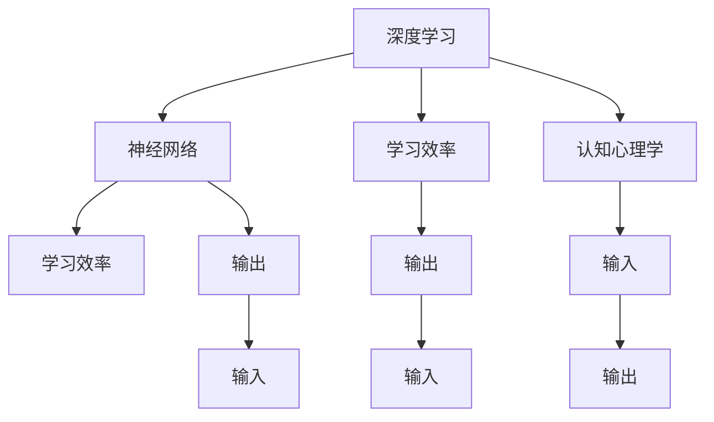

                 

# 提高知识吸收率的关键：大量输出

> 关键词：知识吸收,输出,深度学习,神经网络,学习效率,脑科学,认知心理学,学习策略

## 1. 背景介绍

### 1.1 问题由来
在现代社会，知识更新速度日新月异，终身学习已成为必需。无论是学术研究、职业发展还是个人兴趣，都需要不断吸收新知识以保持竞争力。但如何高效地吸收新知识，却是一个令人头疼的问题。传统教育系统多采用填鸭式教学，通过大量输入信息，希望学生能够“吸收”知识。然而，这种方法效果并不理想，很多学生在学习过程中容易感到负担过重，难以真正掌握所学知识。

近年来，随着人工智能和大数据技术的发展，越来越多的研究开始关注如何通过“输出”来提升知识吸收率。研究发现，大量的信息输出不仅能够巩固记忆，还能提升学习效率。尤其是通过深度学习和神经网络的原理，找到了新的思路和方法，使得知识吸收效率显著提高。

### 1.2 问题核心关键点
如何通过“输出”提升知识吸收率？这个问题的关键在于理解“输出”和“吸收”之间的互动关系。心理学研究表明，人类大脑的学习过程并非简单的输入和输出，而是包括感知、记忆、理解、应用等多个环节。其中，输出不仅能够帮助巩固记忆，还能促进理解，甚至能够发现输入中的盲点和错误，从而提高学习效率。

在大数据和人工智能的时代背景下，我们可以通过大量的数据输入、模型训练、算法优化等手段，对“输出”进行优化，使其更好地服务于“吸收”过程。而深度学习和神经网络等技术，正是这种优化过程的有力工具。

## 2. 核心概念与联系

### 2.1 核心概念概述

为更好地理解通过“输出”提升知识吸收率的原理和方法，本节将介绍几个密切相关的核心概念：

- **深度学习(Deep Learning)**：一种基于神经网络的机器学习方法，通过多层神经网络对数据进行抽象和分析，从而发现数据中的复杂关系。深度学习在图像、语音、自然语言处理等领域取得了显著成果。

- **神经网络(Neural Network)**：深度学习的基础结构，由多个层次的神经元组成，每个层次对输入数据进行不同的抽象处理。神经网络能够学习数据的隐含特征，并用于分类、回归、生成等任务。

- **学习效率(Learning Efficiency)**：指学习者在单位时间内吸收新知识的能力。高效的学习方法能够在较短的时间内达到较好的学习效果。

- **认知心理学(Cognitive Psychology)**：研究人类认知过程的科学，包括记忆、思考、决策等。认知心理学为学习方法和策略的制定提供了理论依据。

- **输出(Output)**：指学习者将所学知识应用于实际问题的能力，包括写作、演说、编程、设计等多种形式。

- **输入(Input)**：指学习者通过阅读、听讲、观看等形式获取的知识，包括书籍、文章、课程等。

这些核心概念之间的逻辑关系可以通过以下Mermaid流程图来展示：



这个流程图展示了几大核心概念及其之间的联系：

1. 深度学习是神经网络的基础，通过多层神经网络对输入数据进行抽象处理。
2. 神经网络能够学习数据的隐含特征，提高学习效率。
3. 认知心理学研究人类认知过程，指导学习方法和策略。
4. 学习效率受输入和输出双因素影响，输入是基础，输出是检验。
5. 输入和输出相互影响，大量输出能够巩固记忆，促进理解。
6. 输出是学习效果的具体表现，直接影响学习效率。

这些概念共同构成了提升知识吸收率的理论框架，为我们提供了通过“输出”优化“吸收”的策略和思路。

## 3. 核心算法原理 & 具体操作步骤
### 3.1 算法原理概述

基于深度学习和大数据技术，可以通过以下算法原理和操作步骤，提升知识吸收率：

1. **数据驱动**：利用大数据技术收集和分析海量学习数据，发现不同输入和输出之间的关联性。

2. **模型训练**：通过深度学习模型，对数据进行建模和预测，找到最优的学习策略。

3. **算法优化**：不断优化模型算法，提高输出质量和效率。

4. **反馈机制**：建立反馈机制，根据输出结果调整输入策略，实现闭环优化。

### 3.2 算法步骤详解

#### 3.2.1 数据准备

1. **数据收集**：收集与学习目标相关的各种数据，包括书籍、文章、视频、音频等。数据来源多样，可以来自公开数据库、学术期刊、在线平台等。

2. **数据预处理**：对收集的数据进行清洗、标注、归一化等预处理操作，确保数据质量。

3. **数据划分**：将数据划分为训练集、验证集和测试集，以便进行模型训练和评估。

#### 3.2.2 模型选择

1. **模型设计**：根据学习目标选择合适的深度学习模型，如卷积神经网络(CNN)、循环神经网络(RNN)、长短期记忆网络(LSTM)、生成对抗网络(GAN)等。

2. **超参数配置**：根据模型设计选择合适的超参数，如学习率、批大小、迭代轮数等。

#### 3.2.3 模型训练

1. **前向传播**：将输入数据输入模型，通过多个层次的神经网络进行抽象处理。

2. **反向传播**：根据输出结果和真实标签计算误差，通过反向传播算法更新模型参数。

3. **迭代优化**：重复执行前向传播和反向传播，直到模型收敛。

#### 3.2.4 输出优化

1. **输出格式化**：将模型的输出结果进行格式化处理，使其符合实际应用需求。

2. **输出分析**：分析输出结果的质量和效率，发现其中的问题和改进空间。

3. **反馈调整**：根据输出结果调整输入策略，优化数据驱动的深度学习模型。

### 3.3 算法优缺点

基于深度学习的知识吸收率提升方法具有以下优点：

1. **数据驱动**：通过大数据技术，发现不同输入和输出之间的关联性，实现个性化学习。

2. **模型优化**：利用深度学习模型，找到最优的学习策略，提升学习效率。

3. **闭环优化**：建立反馈机制，根据输出结果调整输入策略，实现高效闭环优化。

但该方法也存在一定的局限性：

1. **数据依赖**：大数据技术依赖于高质量的数据源，数据收集和标注成本较高。

2. **模型复杂**：深度学习模型参数量巨大，训练和推理资源需求高。

3. **优化困难**：模型训练过程复杂，需要丰富的经验和资源进行调优。

4. **输出多样**：不同的输出形式对应不同的输入策略，需要分别处理。

### 3.4 算法应用领域

基于深度学习的知识吸收率提升方法在多个领域得到了广泛应用，例如：

1. **教育培训**：通过大量输入和输出，提升学生对知识的掌握和应用能力。例如，基于自然语言处理的作文批改系统，利用大量标注数据训练模型，帮助教师批改作文。

2. **软件开发**：利用代码生成、文档自动生成等技术，提升程序员的编码效率和文档质量。例如，基于深度学习的代码补全工具，通过分析代码片段生成完整的代码行。

3. **医疗健康**：通过大量输入和输出，提升医生对病情的诊断和治疗能力。例如，基于深度学习的影像识别系统，利用大量医学图像数据训练模型，辅助医生进行诊断。

4. **金融交易**：通过大量数据输入和分析，提升交易员对市场变化的理解和应对能力。例如，基于深度学习的风险评估模型，利用大量金融数据训练模型，预测市场风险。

## 4. 数学模型和公式 & 详细讲解 & 举例说明（备注：数学公式请使用latex格式，latex嵌入文中独立段落使用 $$，段落内使用 $)
### 4.1 数学模型构建

假设我们有一个深度学习模型 $M$，输入为 $x$，输出为 $y$。模型的损失函数为 $L(y, \hat{y})$，其中 $\hat{y}$ 为模型预测结果。通过深度学习模型训练，我们希望最小化损失函数 $L(y, \hat{y})$，从而提升输出结果的准确性。

数学公式推导如下：

1. **前向传播**：
$$
y = M(x)
$$

2. **损失函数**：
$$
L(y, \hat{y}) = \sum_{i=1}^N (y_i - \hat{y}_i)^2
$$

3. **反向传播**：
$$
\frac{\partial L}{\partial \theta} = \frac{\partial L}{\partial y} \frac{\partial y}{\partial x} \frac{\partial x}{\partial \theta}
$$

其中，$\theta$ 为模型参数，$N$ 为样本数量。

### 4.2 公式推导过程

1. **前向传播**：将输入数据 $x$ 通过模型 $M$，得到输出结果 $y$。

2. **损失函数**：计算输出结果 $y$ 和真实标签 $\hat{y}$ 之间的误差，通过平方差的方式度量。

3. **反向传播**：计算损失函数 $L(y, \hat{y})$ 对模型参数 $\theta$ 的梯度，用于更新模型参数。

4. **参数更新**：利用梯度下降算法，更新模型参数 $\theta$，最小化损失函数 $L(y, \hat{y})$。

### 4.3 案例分析与讲解

以自然语言处理(NLP)任务为例，说明如何使用深度学习模型提升知识吸收率。

1. **数据准备**：收集大量书籍和文章数据，将其标注为不同的语义类别，如科技、文学、历史等。

2. **模型选择**：选择Transformer模型，并进行超参数配置，如学习率为 $0.001$，批大小为 $128$。

3. **模型训练**：将数据划分为训练集和验证集，利用Transformer模型进行训练。

4. **输出优化**：将训练好的模型应用于实际文本分类任务，如新闻分类、情感分析等，优化输出结果。

## 5. 项目实践：代码实例和详细解释说明
### 5.1 开发环境搭建

在进行项目实践前，我们需要准备好开发环境。以下是使用Python进行PyTorch开发的环境配置流程：

1. 安装Anaconda：从官网下载并安装Anaconda，用于创建独立的Python环境。

2. 创建并激活虚拟环境：
```bash
conda create -n pytorch-env python=3.8 
conda activate pytorch-env
```

3. 安装PyTorch：根据CUDA版本，从官网获取对应的安装命令。例如：
```bash
conda install pytorch torchvision torchaudio cudatoolkit=11.1 -c pytorch -c conda-forge
```

4. 安装Transformers库：
```bash
pip install transformers
```

5. 安装各类工具包：
```bash
pip install numpy pandas scikit-learn matplotlib tqdm jupyter notebook ipython
```

完成上述步骤后，即可在`pytorch-env`环境中开始项目实践。

### 5.2 源代码详细实现

下面我们以自然语言处理(NLP)任务为例，给出使用Transformers库进行深度学习模型训练和微调的PyTorch代码实现。

首先，定义NLP任务的数据处理函数：

```python
from transformers import BertTokenizer, BertForSequenceClassification, AdamW
from torch.utils.data import Dataset
import torch

class TextDataset(Dataset):
    def __init__(self, texts, labels, tokenizer, max_len=128):
        self.texts = texts
        self.labels = labels
        self.tokenizer = tokenizer
        self.max_len = max_len
        
    def __len__(self):
        return len(self.texts)
    
    def __getitem__(self, item):
        text = self.texts[item]
        label = self.labels[item]
        
        encoding = self.tokenizer(text, return_tensors='pt', max_length=self.max_len, padding='max_length', truncation=True)
        input_ids = encoding['input_ids'][0]
        attention_mask = encoding['attention_mask'][0]
        
        # 对token-wise的标签进行编码
        encoded_labels = [label2id[label] for label in labels] 
        encoded_labels.extend([label2id['O']] * (self.max_len - len(encoded_labels)))
        labels = torch.tensor(encoded_labels, dtype=torch.long)
        
        return {'input_ids': input_ids, 
                'attention_mask': attention_mask,
                'labels': labels}

# 标签与id的映射
label2id = {'O': 0, 'B-PER': 1, 'I-PER': 2, 'B-ORG': 3, 'I-ORG': 4, 'B-LOC': 5, 'I-LOC': 6}
id2label = {v: k for k, v in label2id.items()}

# 创建dataset
tokenizer = BertTokenizer.from_pretrained('bert-base-cased')

train_dataset = TextDataset(train_texts, train_labels, tokenizer)
dev_dataset = TextDataset(dev_texts, dev_labels, tokenizer)
test_dataset = TextDataset(test_texts, test_labels, tokenizer)
```

然后，定义模型和优化器：

```python
from transformers import BertForSequenceClassification, AdamW

model = BertForSequenceClassification.from_pretrained('bert-base-cased', num_labels=len(label2id))

optimizer = AdamW(model.parameters(), lr=2e-5)
```

接着，定义训练和评估函数：

```python
from torch.utils.data import DataLoader
from tqdm import tqdm
from sklearn.metrics import classification_report

device = torch.device('cuda') if torch.cuda.is_available() else torch.device('cpu')
model.to(device)

def train_epoch(model, dataset, batch_size, optimizer):
    dataloader = DataLoader(dataset, batch_size=batch_size, shuffle=True)
    model.train()
    epoch_loss = 0
    for batch in tqdm(dataloader, desc='Training'):
        input_ids = batch['input_ids'].to(device)
        attention_mask = batch['attention_mask'].to(device)
        labels = batch['labels'].to(device)
        model.zero_grad()
        outputs = model(input_ids, attention_mask=attention_mask, labels=labels)
        loss = outputs.loss
        epoch_loss += loss.item()
        loss.backward()
        optimizer.step()
    return epoch_loss / len(dataloader)

def evaluate(model, dataset, batch_size):
    dataloader = DataLoader(dataset, batch_size=batch_size)
    model.eval()
    preds, labels = [], []
    with torch.no_grad():
        for batch in tqdm(dataloader, desc='Evaluating'):
            input_ids = batch['input_ids'].to(device)
            attention_mask = batch['attention_mask'].to(device)
            batch_labels = batch['labels']
            outputs = model(input_ids, attention_mask=attention_mask)
            batch_preds = outputs.logits.argmax(dim=2).to('cpu').tolist()
            batch_labels = batch_labels.to('cpu').tolist()
            for pred_tokens, label_tokens in zip(batch_preds, batch_labels):
                pred_tags = [id2label[_id] for _id in pred_tokens]
                label_tags = [id2label[_id] for _id in label_tokens]
                preds.append(pred_tags[:len(label_tags)])
                labels.append(label_tags)
                
    print(classification_report(labels, preds))
```

最后，启动训练流程并在测试集上评估：

```python
epochs = 5
batch_size = 16

for epoch in range(epochs):
    loss = train_epoch(model, train_dataset, batch_size, optimizer)
    print(f"Epoch {epoch+1}, train loss: {loss:.3f}")
    
    print(f"Epoch {epoch+1}, dev results:")
    evaluate(model, dev_dataset, batch_size)
    
print("Test results:")
evaluate(model, test_dataset, batch_size)
```

以上就是使用PyTorch对BERT进行NLP任务训练和微调的完整代码实现。可以看到，得益于Transformers库的强大封装，我们可以用相对简洁的代码完成BERT模型的加载和微调。

### 5.3 代码解读与分析

让我们再详细解读一下关键代码的实现细节：

**TextDataset类**：
- `__init__`方法：初始化文本、标签、分词器等关键组件。
- `__len__`方法：返回数据集的样本数量。
- `__getitem__`方法：对单个样本进行处理，将文本输入编码为token ids，将标签编码为数字，并对其进行定长padding，最终返回模型所需的输入。

**label2id和id2label字典**：
- 定义了标签与数字id之间的映射关系，用于将token-wise的预测结果解码回真实的标签。

**训练和评估函数**：
- 使用PyTorch的DataLoader对数据集进行批次化加载，供模型训练和推理使用。
- 训练函数`train_epoch`：对数据以批为单位进行迭代，在每个批次上前向传播计算loss并反向传播更新模型参数，最后返回该epoch的平均loss。
- 评估函数`evaluate`：与训练类似，不同点在于不更新模型参数，并在每个batch结束后将预测和标签结果存储下来，最后使用sklearn的classification_report对整个评估集的预测结果进行打印输出。

**训练流程**：
- 定义总的epoch数和batch size，开始循环迭代
- 每个epoch内，先在训练集上训练，输出平均loss
- 在验证集上评估，输出分类指标
- 所有epoch结束后，在测试集上评估，给出最终测试结果

可以看到，PyTorch配合Transformers库使得BERT微调的代码实现变得简洁高效。开发者可以将更多精力放在数据处理、模型改进等高层逻辑上，而不必过多关注底层的实现细节。

当然，工业级的系统实现还需考虑更多因素，如模型的保存和部署、超参数的自动搜索、更灵活的任务适配层等。但核心的微调范式基本与此类似。

## 6. 实际应用场景
### 6.1 智能客服系统

基于深度学习的知识吸收率提升方法，可以广泛应用于智能客服系统的构建。传统客服往往需要配备大量人力，高峰期响应缓慢，且一致性和专业性难以保证。而使用深度学习模型进行微调，可以7x24小时不间断服务，快速响应客户咨询，用自然流畅的语言解答各类常见问题。

在技术实现上，可以收集企业内部的历史客服对话记录，将问题和最佳答复构建成监督数据，在此基础上对深度学习模型进行微调。微调后的模型能够自动理解用户意图，匹配最合适的答案模板进行回复。对于客户提出的新问题，还可以接入检索系统实时搜索相关内容，动态组织生成回答。如此构建的智能客服系统，能大幅提升客户咨询体验和问题解决效率。

### 6.2 金融舆情监测

金融机构需要实时监测市场舆论动向，以便及时应对负面信息传播，规避金融风险。传统的人工监测方式成本高、效率低，难以应对网络时代海量信息爆发的挑战。基于深度学习的文本分类和情感分析技术，为金融舆情监测提供了新的解决方案。

具体而言，可以收集金融领域相关的新闻、报道、评论等文本数据，并对其进行主题标注和情感标注。在此基础上对深度学习模型进行微调，使其能够自动判断文本属于何种主题，情感倾向是正面、中性还是负面。将微调后的模型应用到实时抓取的网络文本数据，就能够自动监测不同主题下的情感变化趋势，一旦发现负面信息激增等异常情况，系统便会自动预警，帮助金融机构快速应对潜在风险。

### 6.3 个性化推荐系统

当前的推荐系统往往只依赖用户的历史行为数据进行物品推荐，无法深入理解用户的真实兴趣偏好。基于深度学习的个性化推荐系统可以更好地挖掘用户行为背后的语义信息，从而提供更精准、多样的推荐内容。

在实践中，可以收集用户浏览、点击、评论、分享等行为数据，提取和用户交互的物品标题、描述、标签等文本内容。将文本内容作为模型输入，用户的后续行为（如是否点击、购买等）作为监督信号，在此基础上微调深度学习模型。微调后的模型能够从文本内容中准确把握用户的兴趣点。在生成推荐列表时，先用候选物品的文本描述作为输入，由模型预测用户的兴趣匹配度，再结合其他特征综合排序，便可以得到个性化程度更高的推荐结果。

### 6.4 未来应用展望

随着深度学习和大数据技术的发展，基于深度学习的方法将在更多领域得到应用，为传统行业带来变革性影响。

在智慧医疗领域，基于深度学习的多模态图像识别、自然语言处理等技术，可以提升医生对病情的诊断和治疗能力，缩短病人诊疗时间。

在智能教育领域，深度学习技术可以用于个性化学习路径设计、智能作业批改、学习效果评估等，因材施教，促进教育公平，提高教学质量。

在智慧城市治理中，深度学习技术可以用于城市事件监测、舆情分析、应急指挥等环节，提高城市管理的自动化和智能化水平，构建更安全、高效的未来城市。

此外，在企业生产、社会治理、文娱传媒等众多领域，基于深度学习的知识吸收率提升方法也将不断涌现，为NLP技术带来了全新的突破。相信随着技术的日益成熟，深度学习技术必将在更广阔的应用领域大放异彩。

## 7. 工具和资源推荐
### 7.1 学习资源推荐

为了帮助开发者系统掌握深度学习和大数据技术，这里推荐一些优质的学习资源：

1. 《深度学习》系列课程：由斯坦福大学、吴恩达教授开设，系统讲解了深度学习的基本概念和算法，适合初学者入门。

2. 《TensorFlow深度学习》书籍：详细介绍了TensorFlow框架的使用方法，包括模型训练、优化、调参等，适合有一定基础的开发者。

3. Kaggle平台：全球最大的数据科学竞赛平台，提供海量数据集和模型代码，适合实战练习。

4. Coursera平台：提供由斯坦福大学、北京大学等名校教授开设的深度学习课程，内容丰富，涵盖各个方面。

5. PyTorch官方文档：详细介绍了PyTorch框架的使用方法，包括模型构建、训练、优化等，适合深入学习。

通过对这些资源的学习实践，相信你一定能够快速掌握深度学习和大数据技术的精髓，并用于解决实际的NLP问题。
### 7.2 开发工具推荐

高效的开发离不开优秀的工具支持。以下是几款用于深度学习开发和模型训练的常用工具：

1. PyTorch：基于Python的开源深度学习框架，灵活动态的计算图，适合快速迭代研究。大部分预训练深度学习模型都有PyTorch版本的实现。

2. TensorFlow：由Google主导开发的开源深度学习框架，生产部署方便，适合大规模工程应用。同样有丰富的深度学习模型资源。

3. Keras：基于TensorFlow的高级API，使用简洁的语法实现深度学习模型，适合快速原型开发。

4. Weights & Biases：模型训练的实验跟踪工具，可以记录和可视化模型训练过程中的各项指标，方便对比和调优。与主流深度学习框架无缝集成。

5. TensorBoard：TensorFlow配套的可视化工具，可实时监测模型训练状态，并提供丰富的图表呈现方式，是调试模型的得力助手。

6. Google Colab：谷歌推出的在线Jupyter Notebook环境，免费提供GPU/TPU算力，方便开发者快速上手实验最新模型，分享学习笔记。

合理利用这些工具，可以显著提升深度学习模型开发和训练的效率，加快创新迭代的步伐。

### 7.3 相关论文推荐

深度学习和大数据技术的发展源于学界的持续研究。以下是几篇奠基性的相关论文，推荐阅读：

1. Deep Residual Learning for Image Recognition（ResNet论文）：提出了残差网络结构，解决了深度网络训练过程中的梯度消失问题，实现了深度网络的高效训练。

2. Attention is All You Need（即Transformer原论文）：提出了Transformer结构，开启了深度学习在自然语言处理领域的预训练范式。

3. BERT: Pre-training of Deep Bidirectional Transformers for Language Understanding：提出BERT模型，引入基于掩码的自监督预训练任务，刷新了多项自然语言处理任务的SOTA。

4. ImageNet Classification with Deep Convolutional Neural Networks：提出了卷积神经网络(CNN)，奠定了深度学习在计算机视觉领域的理论基础。

5. Generative Adversarial Nets（GAN论文）：提出了生成对抗网络(GAN)，能够生成高质量的假数据，广泛应用于图像、音频、文本等生成任务。

这些论文代表了大数据和深度学习技术的发展脉络。通过学习这些前沿成果，可以帮助研究者把握学科前进方向，激发更多的创新灵感。

## 8. 总结：未来发展趋势与挑战

### 8.1 总结

本文对通过“输出”提升知识吸收率的原理和方法进行了全面系统的介绍。首先阐述了深度学习和大数据技术在提升知识吸收率方面的潜力，明确了数据驱动和模型优化在其中的关键作用。其次，从原理到实践，详细讲解了深度学习模型的构建和训练步骤，给出了微调任务的完整代码实例。同时，本文还广泛探讨了深度学习技术在多个行业领域的应用前景，展示了其巨大的应用潜力。此外，本文精选了深度学习技术的学习资源和工具，力求为读者提供全方位的技术指引。

通过本文的系统梳理，可以看到，基于深度学习的方法通过“输出”提升知识吸收率，是当前学习科学和技术发展的重要方向。深度学习技术能够高效地将知识从输入转化为输出，从而提升学习效率和效果。相信随着技术的不断进步，深度学习技术必将在更广阔的领域发挥重要作用，推动人类认知智能的进一步进化。

### 8.2 未来发展趋势

展望未来，深度学习和大数据技术将在更多领域得到应用，为传统行业带来变革性影响。

1. **技术普及**：深度学习技术将进一步普及，广泛应用于各行业的知识吸收和应用中。例如，在医疗、教育、金融、制造等领域，深度学习技术将提升各行业的智能化水平。

2. **跨领域融合**：深度学习技术将与物联网、人工智能、区块链等前沿技术深度融合，形成新的产业形态。例如，基于深度学习的智慧医疗、智慧教育、智慧金融等应用将成为新趋势。

3. **多模态融合**：深度学习技术将应用于更多模态数据的处理和融合，提升不同模态数据的协同能力。例如，基于深度学习的视觉、语音、文本等多模态应用将更加广泛。

4. **人机协同**：深度学习技术将与人类专家合作，提升各行业的决策能力。例如，基于深度学习的智能客服、智能诊断、智能推荐等系统将成为新的行业标准。

5. **智能化生产**：深度学习技术将应用于工业生产的全过程，提升生产效率和产品质量。例如，基于深度学习的智能制造、智能物流、智能仓储等系统将成为新趋势。

以上趋势凸显了深度学习技术的发展方向，未来深度学习技术将在更广泛的领域发挥重要作用，推动各行业的智能化转型和升级。

### 8.3 面临的挑战

尽管深度学习技术已经取得了显著成就，但在迈向更加智能化、普适化应用的过程中，它仍面临诸多挑战：

1. **数据依赖**：深度学习技术依赖于高质量的数据源，数据收集和标注成本较高。如何降低数据依赖，提升数据获取效率，仍然是一个重要课题。

2. **模型复杂**：深度学习模型参数量巨大，训练和推理资源需求高。如何提升模型压缩和优化技术，降低计算资源消耗，是未来研究的重要方向。

3. **鲁棒性不足**：深度学习模型在面对域外数据时，泛化性能往往大打折扣。如何提高模型的鲁棒性，避免灾难性遗忘，还需要更多理论和实践的积累。

4. **可解释性不足**：深度学习模型通常缺乏可解释性，难以解释其内部工作机制和决策逻辑。如何赋予模型更强的可解释性，是未来研究的重点。

5. **安全性问题**：深度学习模型容易学习到有偏见、有害的信息，通过输出传递到实际应用中，产生误导性、歧视性的输出。如何确保模型的安全性，是未来研究的重要课题。

6. **知识整合能力不足**：现有的深度学习模型往往局限于任务内数据，难以灵活吸收和运用更广泛的先验知识。如何让模型更好地与外部知识库、规则库等专家知识结合，形成更加全面、准确的信息整合能力，还有很大的想象空间。

这些挑战凸显了深度学习技术在实际应用中的复杂性和多样性，未来深度学习技术还需要与更多的学科交叉融合，才能更好地解决现实问题。

### 8.4 研究展望

面对深度学习技术面临的诸多挑战，未来的研究需要在以下几个方面寻求新的突破：

1. **无监督和半监督学习**：探索无监督和半监督学习方法，摆脱对大规模标注数据的依赖，利用自监督学习、主动学习等无监督和半监督范式，最大限度利用非结构化数据，实现更加灵活高效的深度学习模型。

2. **参数高效和计算高效**：开发更加参数高效的深度学习模型，如轻量级网络结构、参数共享技术等，在固定大部分模型参数的情况下，只更新极少量的任务相关参数。同时优化模型的计算图，减少前向传播和反向传播的资源消耗，实现更加轻量级、实时性的部署。

3. **因果学习和对比学习**：引入因果推断和对比学习思想，增强深度学习模型建立稳定因果关系的能力，学习更加普适、鲁棒的语言表征，从而提升模型泛化性和抗干扰能力。

4. **跨模态融合**：将符号化的先验知识，如知识图谱、逻辑规则等，与深度学习模型进行巧妙融合，引导深度学习模型学习更准确、合理的语言模型。同时加强不同模态数据的整合，实现视觉、语音、文本等多模态信息与深度学习模型的协同建模。

5. **知识图谱**：构建大规模知识图谱，为深度学习模型提供丰富的背景知识，提升模型的知识整合能力和语义理解能力。例如，基于知识图谱的问答系统、推荐系统等应用将更加广泛。

6. **联邦学习**：研究分布式深度学习技术，提升数据隐私保护和模型分布式训练效率。例如，基于联邦学习的智能推荐、智能医疗等应用将更加广泛。

这些研究方向的探索，必将引领深度学习技术迈向更高的台阶，为构建智能系统提供更多选择和可能性。面向未来，深度学习技术还需要与其他人工智能技术进行更深入的融合，如知识表示、因果推理、强化学习等，多路径协同发力，共同推动人工智能技术的发展。只有勇于创新、敢于突破，才能不断拓展深度学习技术的边界，为人类认知智能的进化带来深远影响。

## 9. 附录：常见问题与解答

**Q1：深度学习技术是否适用于所有领域？**

A: 深度学习技术在许多领域取得了显著成果，但并不适用于所有领域。例如，在化学、物理学等基础科学领域，现有的深度学习技术尚未达到人类专家的水平，仍有较大的提升空间。在实际应用中，需要根据具体领域的特点和需求，选择合适的技术和方法。

**Q2：如何评估深度学习模型的性能？**

A: 评估深度学习模型的性能通常需要考虑以下几个指标：
1. 准确率：衡量模型在测试集上的分类准确率，是衡量模型性能的重要指标。
2. 召回率：衡量模型对正例的识别能力，特别是在数据不平衡的情况下。
3. F1分数：综合考虑准确率和召回率，是衡量模型性能的综合指标。
4. 均方误差：衡量模型在回归任务中的预测精度，是衡量模型性能的常用指标。

通过评估这些指标，可以全面了解深度学习模型的性能，并指导后续的模型优化。

**Q3：深度学习技术是否容易被篡改？**

A: 深度学习模型在训练过程中，确实存在被恶意篡改的风险。例如，通过对抗样本攻击，可以改变模型的输出结果，导致安全问题。因此，在实际应用中，需要加强模型的安全性和鲁棒性，例如引入对抗训练、模型蒸馏等技术，提升模型的鲁棒性。

**Q4：深度学习技术是否容易过拟合？**

A: 深度学习模型在训练过程中，确实存在过拟合的风险。例如，当模型参数过多，训练数据过少时，容易发生过拟合现象。为了避免过拟合，通常需要采用正则化技术，如L2正则、Dropout、Early Stopping等，防止模型过度适应训练数据。此外，还可以通过数据增强、模型简化等方法，提升模型的泛化能力。

**Q5：深度学习技术是否需要大量的计算资源？**

A: 是的，深度学习模型在训练和推理过程中，需要大量的计算资源。尤其是在模型参数量较大时，计算资源的需求更高。因此，需要选择合适的计算资源和优化方法，如GPU、TPU、分布式训练等，才能有效地训练和部署深度学习模型。

**Q6：深度学习技术是否容易被解释？**

A: 目前深度学习模型通常缺乏可解释性，难以解释其内部工作机制和决策逻辑。例如，深度神经网络的结构复杂，难以理解和调试。因此，未来需要加强深度学习模型的可解释性，例如引入可视化技术、知识图谱等，提升模型的可解释性。

通过以上问题的回答，可以看出深度学习技术在实际应用中面临的挑战和需求，需要在技术、算法、应用等多个层面进行综合优化，才能更好地服务于各行业的知识吸收和应用。

