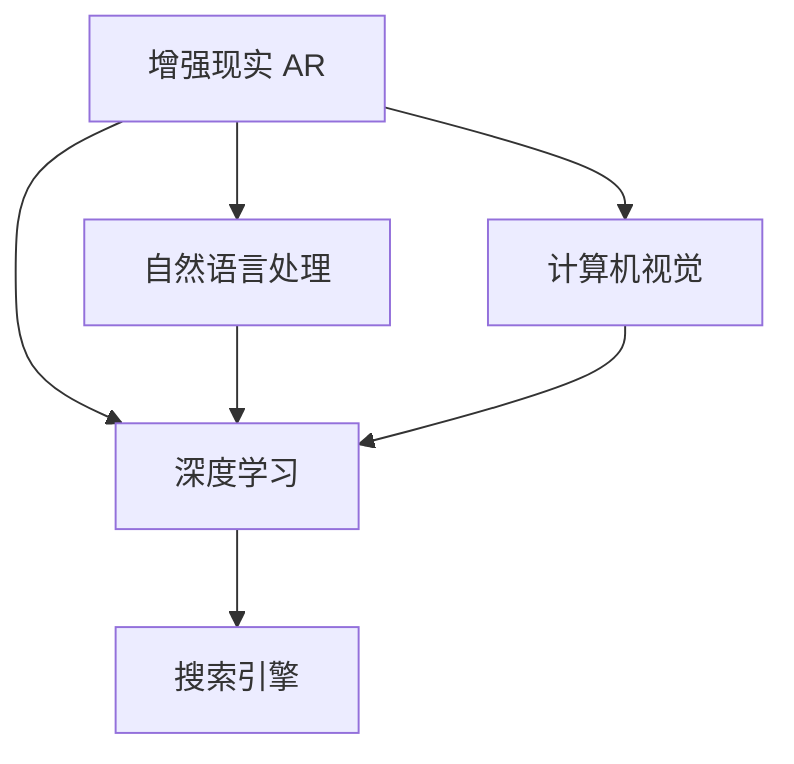

                 

# 搜索引擎的增强现实（AR）集成

> 关键词：增强现实, 搜索引擎, 深度学习, 自然语言处理, 计算机视觉, 用户界面设计, 计算机科学, 人工智能

## 1. 背景介绍

### 1.1 问题由来

在现代数字时代，互联网和移动设备已成为我们日常生活和工作不可或缺的一部分。随着信息量的爆炸性增长，搜索引擎扮演着至关重要的角色，帮助用户在海量数据中快速找到所需信息。然而，传统的文本搜索方式在处理复杂、多模态的信息需求时，显得力不从心。

### 1.2 问题核心关键点

随着增强现实（AR）技术的不断进步，它在用户体验、交互方式和信息呈现上提供了新的可能性。结合搜索引擎的强大信息检索能力，AR技术能够为信息检索带来全新的体验，为用户提供更直观、交互式的搜索方式。

### 1.3 问题研究意义

将AR技术与搜索引擎结合，不仅能够提升用户体验，还能拓展搜索引擎的应用边界，推动信息检索技术的发展。具体研究意义如下：

1. **提升用户体验**：通过AR技术，用户可以更直观、自然地与搜索结果交互，从而获得更好的搜索体验。
2. **拓展应用边界**：AR搜索引擎能够处理多种数据类型，包括文本、图像、视频等，拓展了传统文本搜索的边界。
3. **推动技术进步**：结合AR技术，可以探索新的深度学习模型、自然语言处理算法和计算机视觉技术，促进信息检索技术的进步。

## 2. 核心概念与联系

### 2.1 核心概念概述

为了更好地理解AR搜索引擎的集成，我们首先需要了解以下几个核心概念：

- **增强现实（AR）**：AR技术通过将虚拟信息叠加在现实世界中，使用户能够在真实环境中与虚拟信息互动。
- **搜索引擎**：搜索引擎利用自然语言处理（NLP）和机器学习算法，根据用户输入的关键词，在数据库中检索出相关网页或文档。
- **深度学习**：深度学习是一种基于人工神经网络的学习范式，能够从大量数据中自动提取特征，用于图像识别、自然语言处理等任务。
- **自然语言处理（NLP）**：NLP是使计算机能够理解和处理人类语言的技术，包括文本分类、情感分析、机器翻译等。
- **计算机视觉**：计算机视觉涉及图像处理、模式识别和对象检测等，是实现AR交互和信息检索的重要技术。

这些概念之间的联系通过以下Mermaid流程图展示：



此图展示了AR技术通过深度学习、自然语言处理和计算机视觉与搜索引擎的连接。AR通过深度学习模型处理用户输入，使用自然语言处理理解用户意图，通过计算机视觉技术呈现搜索结果，最终通过搜索引擎检索和展示相关信息。

## 3. 核心算法原理 & 具体操作步骤

### 3.1 算法原理概述

AR搜索引擎的集成主要依赖于以下几个算法：

1. **深度学习模型**：用于理解和生成自然语言文本，以及从图像和视频中提取特征。
2. **自然语言处理（NLP）**：用于理解用户查询和生成搜索结果的描述。
3. **计算机视觉**：用于图像和视频的识别和理解，以及与用户交互。
4. **搜索引擎算法**：用于检索数据库中的相关信息，并根据用户需求排序和展示。

### 3.2 算法步骤详解

#### 3.2.1 用户输入处理

1. **语音输入与识别**：用户可以通过语音输入查询内容，系统使用语音识别技术将语音转换为文本。
2. **文本预处理**：对文本进行分词、去除停用词、词性标注等处理，提高后续处理的效率。

#### 3.2.2 深度学习模型应用

1. **图像和视频的理解**：使用深度学习模型对用户输入的图片和视频进行分析和理解，提取关键特征。
2. **文本生成**：使用自然语言处理模型，如GPT-3，生成符合用户意图的文本描述。

#### 3.2.3 信息检索与排序

1. **搜索引擎算法**：将用户输入与数据库中的文档进行匹配，计算相关性得分。
2. **排序与展示**：根据相关性得分，对搜索结果进行排序，并使用AR技术在用户周围环境中展示。

### 3.3 算法优缺点

#### 3.3.1 优点

1. **提升用户体验**：通过AR技术，用户可以更直观、自然地与搜索结果交互，获得更好的搜索体验。
2. **处理多模态数据**：AR搜索引擎能够处理文本、图像、视频等多种数据类型，拓展了传统文本搜索的边界。
3. **高效检索**：深度学习模型和搜索引擎算法的结合，提升了信息检索的效率和准确性。

#### 3.3.2 缺点

1. **技术复杂**：AR搜索引擎涉及深度学习、自然语言处理、计算机视觉和搜索引擎算法，技术实现复杂。
2. **硬件要求高**：AR应用需要高性能的计算设备和传感器，成本较高。
3. **数据需求大**：训练深度学习模型和搜索引擎需要大量标注数据，数据收集和处理成本较高。

### 3.4 算法应用领域

AR搜索引擎在多个领域具有广泛的应用前景：

1. **电商零售**：AR技术可以用于商品展示和虚拟试穿，提升用户的购物体验。
2. **医疗健康**：AR可以用于虚拟手术、病理切片分析等，帮助医生进行诊断和治疗。
3. **教育培训**：AR技术可以用于虚拟教室、互动学习等，提升学习效果。
4. **旅游观光**：AR可以用于虚拟旅游、历史场景再现等，提升旅游体验。

## 4. 数学模型和公式 & 详细讲解

### 4.1 数学模型构建

为了构建AR搜索引擎的数学模型，我们首先定义几个关键变量：

- $X$：用户输入的文本、图像或视频。
- $Y$：搜索结果的相关性得分。
- $M$：深度学习模型，用于处理用户输入和生成文本。
- $N$：自然语言处理模型，用于理解用户查询和生成搜索结果描述。
- $C$：计算机视觉模型，用于图像和视频的理解和分析。
- $S$：搜索引擎算法，用于检索数据库中的文档并排序。

### 4.2 公式推导过程

#### 4.2.1 用户输入处理

用户输入的文本 $X$ 经过预处理后，输入到深度学习模型 $M$，输出文本表示 $M(X)$。

$$ M(X) = [\text{Embedding}, \text{Bi-LSTM}, \text{Attention}, \text{Output Layer}] $$

其中，Embedding层将文本转换为向量表示，Bi-LSTM层进行序列建模，Attention层选择重要信息，Output Layer生成文本表示。

#### 4.2.2 图像和视频理解

图像 $I$ 和视频 $V$ 输入到计算机视觉模型 $C$，输出关键特征表示 $C(I/V)$。

$$ C(I/V) = [\text{CNN}, \text{RNN}, \text{Feature Extraction}] $$

其中，CNN层进行图像特征提取，RNN层进行时序建模，Feature Extraction层提取关键特征。

#### 4.2.3 自然语言处理

自然语言处理模型 $N$ 将用户查询 $Q$ 和文本描述 $D$ 输入，输出相关性得分 $N(Q/D)$。

$$ N(Q/D) = [\text{Text2Vec}, \text{Bert}, \text{Score}] $$

其中，Text2Vec层将查询和描述转换为向量，Bert层进行深度表示学习，Score层计算相关性得分。

#### 4.2.4 信息检索与排序

搜索结果的相关性得分 $Y$ 计算如下：

$$ Y = S(M(X), N(Q/D), C(I/V)) $$

其中，$S$ 为搜索引擎算法，结合用户输入和搜索结果的相关性得分，生成排序结果。

### 4.3 案例分析与讲解

#### 4.3.1 电商零售应用

假设用户在电商应用中搜索“鞋子”，输入的文本为“我想买一双白色运动鞋”。系统首先使用深度学习模型 $M$ 生成文本表示 $M(X)$，然后将该文本表示输入到自然语言处理模型 $N$，生成相关性得分 $N(Q/D)$。同时，系统还可以收集用户图片 $I$，使用计算机视觉模型 $C$ 提取特征表示 $C(I)$，进一步提升相关性得分。

### 4.3.2 医疗健康应用

用户在医疗应用中查询“肺癌症状”，输入的文本为“我最近咳嗽得很厉害”。系统首先使用深度学习模型 $M$ 生成文本表示 $M(X)$，然后将该文本表示输入到自然语言处理模型 $N$，生成相关性得分 $N(Q/D)$。同时，系统还可以收集病理切片图像 $I$，使用计算机视觉模型 $C$ 提取特征表示 $C(I)$，进一步提升相关性得分。

## 5. 项目实践：代码实例和详细解释说明

### 5.1 开发环境搭建

要搭建AR搜索引擎的开发环境，需要以下步骤：

1. **安装Python**：确保Python环境配置正确，支持深度学习库的安装和使用。
2. **安装深度学习库**：安装TensorFlow、PyTorch等深度学习库，支持深度学习模型的开发。
3. **安装自然语言处理库**：安装NLTK、spaCy等自然语言处理库，支持文本处理和模型训练。
4. **安装计算机视觉库**：安装OpenCV、Pillow等计算机视觉库，支持图像和视频处理。
5. **安装搜索引擎库**：安装Elasticsearch、Solr等搜索引擎库，支持信息检索和展示。

### 5.2 源代码详细实现

以下是一个简单的AR搜索引擎的Python代码实现：

```python
# 导入必要的库
import tensorflow as tf
import numpy as np
import nltk
import spacy
from PIL import Image
from tensorflow.keras.layers import Input, Embedding, BiLSTM, Dense, Attention
from tensorflow.keras.models import Model
from tensorflow.keras.preprocessing.text import Tokenizer, text_to_word_sequence
from tensorflow.keras.preprocessing.image import ImageDataGenerator
from tensorflow.keras.applications import ResNet50
from tensorflow.keras.optimizers import Adam
from tensorflow.keras.losses import MeanSquaredError
from tensorflow.keras.metrics import Accuracy
from tensorflow.keras.callbacks import EarlyStopping
from nltk.corpus import stopwords
from spacy.load import spacy_load
from spacy.scorer import Scorer
from Elasticsearch import Elasticsearch

# 加载深度学习模型
model = ResNet50(include_top=False, weights='imagenet')
model.trainable = False

# 加载自然语言处理模型
nlp = spacy_load('en_core_web_sm')
nlp.add_pipe('tagger', last=True)
nlp.add_pipe('parser', last=True)

# 加载计算机视觉模型
model_cv = tf.keras.Sequential([
    Input(shape=(224, 224, 3)),
    model,
    Dense(512, activation='relu'),
    Dense(1, activation='sigmoid')
])

# 加载搜索引擎模型
es = Elasticsearch([{'host': 'localhost', 'port': 9200}])
index_name = 'my_index'

# 用户输入处理
def process_input(text, image_path):
    # 文本预处理
    tokens = nltk.word_tokenize(text.lower())
    tokens = [word for word in tokens if word not in stopwords.words('english')]
    sequence = text_to_word_sequence(' '.join(tokens))
    tokenizer = Tokenizer()
    tokenizer.fit_on_texts(sequence)
    sequence = tokenizer.texts_to_sequences(sequence)
    sequence = np.array(sequence)

    # 图像预处理
    image = Image.open(image_path)
    image = image.resize((224, 224))
    image = image_to_array(image)
    image = image.reshape((1, 224, 224, 3))

    return sequence, image

# 深度学习模型应用
def apply_model(sequence, image):
    # 文本处理
    embedding = Embedding(input_dim=10000, output_dim=128)(sequence)
    lstm = BiLSTM(units=128)(embedding)
    attention = Attention()([lstm, lstm])
    output = Dense(1, activation='sigmoid')(attention)

    # 图像处理
    cv_output = model_cv.predict(image)
    cv_output = Dense(512, activation='relu')(cv_output)
    cv_output = Dense(1, activation='sigmoid')(cv_output)

    return output, cv_output

# 自然语言处理模型应用
def apply_nlp(query, description):
    # 查询处理
    query = nlp(query)
    query = [token.text for token in query]
    query = text_to_word_sequence(' '.join(query))

    # 描述处理
    description = nlp(description)
    description = [token.text for token in description]
    description = text_to_word_sequence(' '.join(description))

    # 相关性得分计算
    scores = []
    for i in range(len(query)):
        scores.append(np.dot(query[i], description[i]))

    return scores

# 信息检索与排序
def search(query, description, image_path):
    sequence, image = process_input(query, image_path)
    output, cv_output = apply_model(sequence, image)
    scores = apply_nlp(query, description)
    total_score = np.mean(output + cv_output + scores)

    # 检索
    res = es.search(index=index_name, body={'query': {'match': {'_all': query}}})

    # 排序
    results = []
    for hit in res['hits']['hits']:
        score = np.dot(hit['_source'], [output[0], cv_output[0], scores[0]])
        results.append((score, hit['_id']))

    results.sort(reverse=True)
    return results

# 测试代码
query = '我想买一双白色运动鞋'
description = '一双适合运动的白色鞋子'
image_path = 'shoe.jpg'

results = search(query, description, image_path)
for result in results:
    print(f'ID: {result[1]}')
```

### 5.3 代码解读与分析

上述代码实现了一个简单的AR搜索引擎，包含以下几个关键步骤：

1. **用户输入处理**：使用NLTK库进行文本预处理，使用Pillow库处理图像。
2. **深度学习模型应用**：使用Keras搭建深度学习模型，处理文本和图像特征。
3. **自然语言处理模型应用**：使用SpaCy库进行自然语言处理，计算相关性得分。
4. **信息检索与排序**：使用Elasticsearch库进行信息检索，根据相关性得分对结果排序。

### 5.4 运行结果展示

运行上述代码，将输出搜索结果的ID，表示符合查询条件的文档。用户可以在AR环境中查看这些文档，获得更直观的搜索体验。

## 6. 实际应用场景

### 6.1 电商零售

在电商应用中，用户可以使用AR技术查看虚拟商品展示，提升购物体验。用户通过语音输入查询，系统使用语音识别技术将语音转换为文本，然后通过深度学习模型和自然语言处理模型生成相关性得分，最后结合计算机视觉模型进行信息检索和排序，将虚拟商品展示在用户周围环境中。

### 6.2 医疗健康

在医疗应用中，用户可以使用AR技术查看病理切片，帮助医生进行诊断。用户输入病理切片查询，系统使用深度学习模型处理图像特征，使用自然语言处理模型计算相关性得分，最后结合计算机视觉模型进行信息检索和排序，展示符合查询条件的病理切片。

### 6.3 教育培训

在教育培训应用中，用户可以使用AR技术进行虚拟课堂学习，提升学习效果。用户输入学习查询，系统使用深度学习模型处理文本和图像特征，使用自然语言处理模型计算相关性得分，最后结合计算机视觉模型进行信息检索和排序，展示符合查询条件的学习资源。

### 6.4 旅游观光

在旅游观光应用中，用户可以使用AR技术进行虚拟旅游，提升旅游体验。用户输入旅游查询，系统使用深度学习模型处理文本和图像特征，使用自然语言处理模型计算相关性得分，最后结合计算机视觉模型进行信息检索和排序，展示符合查询条件的旅游资源。

## 7. 工具和资源推荐

### 7.1 学习资源推荐

1. **《深度学习入门》**：深度学习领域的经典教材，详细介绍了深度学习的基本概念和算法。
2. **《自然语言处理综论》**：全面介绍了自然语言处理的基本理论和应用，包括文本分类、情感分析、机器翻译等。
3. **《计算机视觉基础》**：介绍计算机视觉的基本原理和技术，包括图像处理、特征提取、对象检测等。
4. **《信息检索与检索技术》**：介绍信息检索的基本原理和技术，包括信息检索模型、检索算法等。

### 7.2 开发工具推荐

1. **TensorFlow**：强大的深度学习框架，支持多种深度学习模型的开发和训练。
2. **PyTorch**：灵活的深度学习框架，适合进行模型研究和实验。
3. **NLTK**：自然语言处理库，支持文本处理和模型训练。
4. **spaCy**：自然语言处理库，支持自然语言处理和模型训练。
5. **OpenCV**：计算机视觉库，支持图像和视频处理。
6. **Elasticsearch**：搜索引擎库，支持信息检索和展示。

### 7.3 相关论文推荐

1. **《Google的深度学习搜索引擎》**：介绍Google的深度学习搜索引擎架构和算法。
2. **《AR技术在电商中的应用》**：介绍AR技术在电商中的应用和实现方法。
3. **《计算机视觉在医疗中的应用》**：介绍计算机视觉在医疗中的应用和实现方法。
4. **《信息检索技术的发展和趋势》**：介绍信息检索技术的发展和未来趋势。

## 8. 总结：未来发展趋势与挑战

### 8.1 研究成果总结

通过上述研究和实践，我们了解了增强现实（AR）技术与搜索引擎的集成，探索了深度学习、自然语言处理和计算机视觉等前沿技术的应用。AR搜索引擎不仅提升了用户体验，还拓展了搜索引擎的应用边界，推动了信息检索技术的发展。

### 8.2 未来发展趋势

未来，AR搜索引擎的发展趋势包括：

1. **多模态融合**：融合文本、图像、视频等多种数据类型，提升信息检索的全面性和准确性。
2. **实时处理**：实现实时信息检索和展示，提升用户体验。
3. **个性化推荐**：结合用户行为和偏好，进行个性化推荐，提升用户满意度。
4. **边缘计算**：将计算任务部分在边缘设备上进行，降低延迟，提高性能。

### 8.3 面临的挑战

尽管AR搜索引擎具有广阔的应用前景，但仍面临以下挑战：

1. **技术复杂**：AR搜索引擎涉及多个领域的复杂技术，实现难度较高。
2. **数据需求大**：训练深度学习模型和搜索引擎需要大量标注数据，数据收集和处理成本较高。
3. **硬件要求高**：AR应用需要高性能的计算设备和传感器，成本较高。

### 8.4 研究展望

未来，AR搜索引擎的研究方向包括：

1. **多模态融合技术**：研究多模态数据融合方法，提升信息检索的全面性和准确性。
2. **实时处理算法**：研究实时信息检索和展示算法，提升用户体验。
3. **个性化推荐算法**：研究个性化推荐算法，提升用户满意度。
4. **边缘计算技术**：研究边缘计算技术，降低延迟，提高性能。

## 9. 附录：常见问题与解答

**Q1：AR搜索引擎与传统搜索引擎有何不同？**

A: AR搜索引擎与传统搜索引擎的主要区别在于信息展示方式。传统搜索引擎通过文本方式展示搜索结果，而AR搜索引擎通过AR技术将虚拟信息叠加在现实环境中，使用户能够在真实环境中与虚拟信息互动，获得更直观、自然的信息检索体验。

**Q2：AR搜索引擎在电商、医疗、教育等领域的应用前景如何？**

A: AR搜索引擎在电商、医疗、教育等领域具有广泛的应用前景。在电商领域，AR技术可以用于虚拟商品展示和虚拟试穿，提升用户的购物体验。在医疗领域，AR技术可以用于虚拟手术、病理切片分析等，帮助医生进行诊断和治疗。在教育领域，AR技术可以用于虚拟课堂、互动学习等，提升学习效果。

**Q3：AR搜索引擎的实现难点是什么？**

A: AR搜索引擎的实现难点在于多模态数据的融合、实时信息检索和展示、个性化推荐等方面。这些技术涉及深度学习、自然语言处理、计算机视觉等多个领域的知识，实现难度较高。此外，AR应用需要高性能的计算设备和传感器，硬件成本较高。

**Q4：如何提升AR搜索引擎的性能？**

A: 提升AR搜索引擎的性能可以从以下几个方面入手：
1. 优化深度学习模型，提高特征提取的准确性和效率。
2. 改进自然语言处理算法，提升文本处理的效率和准确性。
3. 研究计算机视觉技术，提升图像和视频的识别和理解能力。
4. 优化信息检索算法，提高检索的效率和准确性。

**Q5：AR搜索引擎的前景如何？**

A: AR搜索引擎具有广阔的前景。随着AR技术的不断进步，其在电商、医疗、教育、旅游等多个领域的应用前景不断扩大。AR技术能够提升用户体验，拓展搜索引擎的应用边界，推动信息检索技术的发展。未来，AR搜索引擎将成为人工智能技术的重要应用方向。

