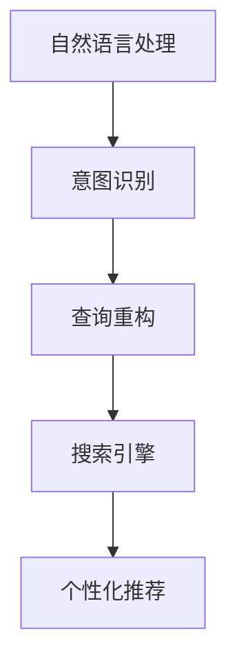

                 

# 搜索引擎的未来：个性化AI助手

## 1. 背景介绍

### 1.1 问题由来

互联网时代，信息爆炸，搜索引擎已成为我们获取信息的重要工具。但传统的搜索方式往往局限于关键词匹配，难以理解查询者的真实需求和意图。随着人工智能技术的快速发展，越来越多的搜索引擎开始采用个性化AI助手，通过自然语言理解、情感分析等技术，精准定位查询者意图，提供更加个性化、贴心的搜索结果。

### 1.2 问题核心关键点

目前，搜索引擎的个性化AI助手通过自然语言处理(NLP)技术，实现用户意图的精确提取和匹配。其核心在于以下几个方面：

- 语义理解：通过理解查询者输入的自然语言，提取核心语义，如主题、情感、实体等。
- 查询重构：根据核心语义，对原始查询进行重构，生成更加规范、结构化的查询表达式。
- 搜索排序：通过评估搜索结果的相关性、权威性和时效性，对搜索结果进行排序，推荐最符合查询者需求的结果。
- 交互反馈：根据查询者的交互反馈，动态调整搜索结果，不断优化个性化体验。

这些核心关键点构成了搜索引擎个性化AI助手的技术框架，使其能够高效地理解查询者需求，并提供优质、个性化的搜索结果。

## 2. 核心概念与联系

### 2.1 核心概念概述

为更好地理解搜索引擎个性化AI助手的技术框架，本节将介绍几个密切相关的核心概念：

- 自然语言处理(NLP)：处理、理解、生成人类语言的技术，包括词法分析、句法分析、语义分析、情感分析、命名实体识别等任务。
- 意图识别：通过分析查询者输入的自然语言，识别其真实需求和意图，如导航、购物、查询信息等。
- 查询重构：根据意图识别结果，对原始查询进行语法和语义上的重构，生成结构化查询表达式。
- 搜索引擎：根据重构后的查询表达式，从大量网页和数据中检索相关信息，并按相关性排序返回。
- 个性化推荐：根据查询者的历史行为和偏好，动态调整搜索结果，推荐最符合需求的内容。

这些核心概念之间的逻辑关系可以通过以下Mermaid流程图来展示：



这个流程图展示了大语言模型的核心概念及其之间的关系：

1. 自然语言处理通过分析查询者输入的自然语言，提取核心语义。
2. 意图识别根据核心语义，识别查询者的真实需求和意图。
3. 查询重构将原始查询重构为结构化表达式，便于搜索引擎处理。
4. 搜索引擎根据重构后的查询，检索相关信息并排序返回。
5. 个性化推荐根据查询者历史行为，动态调整搜索结果，推荐个性化内容。

这些核心概念共同构成了搜索引擎个性化AI助手的技术基础，使其能够高效、精准地理解用户需求，并提供个性化搜索结果。

## 3. 核心算法原理 & 具体操作步骤
### 3.1 算法原理概述

搜索引擎个性化AI助手的核心算法原理基于NLP技术和搜索引擎的深度融合。其核心在于以下几个步骤：

1. 语义分析：通过NLP技术，分析查询者输入的自然语言，提取核心语义，如主题、情感、实体等。
2. 意图识别：根据核心语义，识别查询者的真实需求和意图，如导航、购物、查询信息等。
3. 查询重构：将原始查询进行语法和语义上的重构，生成结构化查询表达式。
4. 搜索引擎：根据重构后的查询表达式，从大量网页和数据中检索相关信息，并按相关性排序返回。
5. 个性化推荐：根据查询者的历史行为和偏好，动态调整搜索结果，推荐最符合需求的内容。

在具体实现上，通常采用以下几个关键步骤：

- 构建查询表达树：将查询语句转化为语法树，便于解析和处理。
- 语义匹配：将查询语句与预定义的语义模板进行匹配，提取关键信息。
- 知识图谱融合：将查询结果与知识图谱中的实体和关系进行融合，提升搜索结果的权威性和深度。
- 个性化排序：基于机器学习模型，根据查询者的历史行为和偏好，动态调整搜索结果排序。

### 3.2 算法步骤详解

下面详细介绍搜索引擎个性化AI助手的算法步骤：

**Step 1: 语义分析**

1. 分词：将查询语句切分为词语序列，如使用JIEBA进行中文分词，或使用NLTK进行英文分词。
2. 词性标注：对分词结果进行词性标注，如名词、动词、形容词等。
3. 依存句法分析：构建查询语句的依存句法树，了解句子成分之间的关系。

**Step 2: 意图识别**

1. 实体识别：识别查询语句中的人名、地名、机构名等实体，使用NER模型进行识别。
2. 意图分类：根据实体信息，对查询者的意图进行分类，如导航、购物、查询信息等，使用分类器进行识别。

**Step 3: 查询重构**

1. 结构化查询语言(SQL)生成：将查询语句转化为SQL查询表达式，使用模板匹配或语法分析器进行转化。
2. 表达式优化：对生成的SQL表达式进行优化，如去除冗余字段、限制返回结果等。

**Step 4: 搜索引擎**

1. 数据检索：根据SQL查询表达式，从数据库或互联网中检索相关信息。
2. 结果排序：对检索结果进行排序，如基于相关性、权威性、时效性等指标进行排序，使用排序算法如PageRank等。

**Step 5: 个性化推荐**

1. 行为分析：分析查询者的历史行为数据，如浏览记录、点击行为、搜索关键词等，使用关联规则挖掘等方法进行分析。
2. 推荐模型训练：根据行为数据，训练推荐模型，如协同过滤、内容推荐、混合推荐等，使用机器学习算法如SVM、决策树等进行训练。
3. 结果融合：将推荐结果与搜索结果进行融合，动态调整排序，使用加权融合算法进行优化。

### 3.3 算法优缺点

搜索引擎个性化AI助手的核心算法具有以下优点：

1. 精度高：通过语义分析和意图识别，能够精准理解查询者的需求和意图，提高搜索结果的相关性和准确性。
2. 用户体验好：基于个性化推荐，能够提供符合用户兴趣的搜索结果，提升用户体验和满意度。
3. 可扩展性强：算法框架可扩展到各类查询场景，如问答、导航、购物等，具有较高的通用性。

同时，该算法也存在一定的局限性：

1. 对语料质量依赖度高：算法的精度和效果依赖于高质量的语料库和标注数据，获取和维护成本较高。
2. 计算复杂度高：语义分析和意图识别涉及大量的自然语言处理任务，计算复杂度较高。
3. 冷启动问题：对于新用户或新查询场景，算法难以准确识别其需求和意图，需要较长的学习周期。

尽管存在这些局限性，但就目前而言，基于语义理解和意图识别的搜索引擎个性化AI助手仍是最为主流和有效的解决方案。未来相关研究的重点在于如何进一步降低算法对语料数据的依赖，提高算法效率和精度，同时兼顾用户体验和冷启动问题。

### 3.4 算法应用领域

搜索引擎个性化AI助手在NLP领域的应用已经得到了广泛的应用，涵盖了以下多个方面：

- 搜索引擎优化(SEO)：通过语义分析和意图识别，优化网站内容，提升搜索引擎排名。
- 智能问答系统：根据用户提问，提供精准的问答结果，使用NLP技术进行自然语言理解和回答生成。
- 个性化推荐系统：根据用户历史行为，推荐相关内容，使用协同过滤、内容推荐等算法进行个性化推荐。
- 智能广告投放：根据用户兴趣和行为，精准投放广告，使用机器学习模型进行广告推荐。
- 客户服务机器人：基于意图识别，实现自动化客户服务，使用NLP技术进行对话理解和生成。

除了上述这些经典应用外，个性化AI助手还在更多场景中得到了创新性的应用，如智能家居控制、智能车机导航、智能健康咨询等，为NLP技术带来了全新的突破。随着NLP技术的不断发展，相信个性化AI助手将在更多领域得到应用，为人们的生活带来更加智能和便捷的体验。

## 4. 数学模型和公式 & 详细讲解 & 举例说明

### 4.1 数学模型构建

本节将使用数学语言对搜索引擎个性化AI助手的算法过程进行更加严格的刻画。

设查询语句为 $Q$，查询意图为 $I$，查询重构结果为 $S$，搜索结果为 $R$，个性化推荐结果为 $P$。则搜索引擎个性化AI助手的数学模型为：

$$
P = \mathop{\arg\min}_{P} \mathcal{L}(P,Q,S,R) + \mathcal{R}(Q,S)
$$

其中 $\mathcal{L}$ 为推荐结果与查询意图之间的损失函数，$\mathcal{R}$ 为查询重构与查询语句之间的损失函数。在具体实现上，$\mathcal{L}$ 通常使用损失函数如Mean Squared Error (MSE)、Huber Loss等，$\mathcal{R}$ 则可以使用TF-IDF、BM25等技术进行计算。

### 4.2 公式推导过程

以推荐模型的训练为例，假设查询者 $u$ 的历史行为数据为 $H_u$，查询语句为 $Q_u$，查询意图为 $I_u$，推荐模型为 $M$。则推荐模型的损失函数为：

$$
\mathcal{L}(M,Q_u,I_u,H_u) = -\sum_{i=1}^{K} I_i \log M(Q_u,H_u)
$$

其中 $K$ 为推荐结果的数量，$I_i$ 为查询意图与推荐结果 $i$ 之间的匹配程度，$M(Q_u,H_u)$ 为模型输出的推荐结果概率。

根据上述损失函数，推荐模型的优化目标为：

$$
\hat{M} = \mathop{\arg\min}_{M} \mathcal{L}(M,Q_u,I_u,H_u)
$$

通过梯度下降等优化算法，模型不断迭代更新，最小化损失函数，直至收敛，得到最优模型参数 $\hat{M}$。

在得到推荐模型的参数后，将其应用于实际查询者 $u$，即可生成个性化推荐结果 $P_u$。具体步骤如下：

1. 对查询语句 $Q_u$ 进行语义分析和意图识别，提取关键信息。
2. 将提取的关键信息与查询者历史行为数据 $H_u$ 进行融合，生成查询重构结果 $S_u$。
3. 根据 $S_u$ 和 $H_u$，通过推荐模型 $M$ 生成推荐结果 $P_u$。

### 4.3 案例分析与讲解

以下以亚马逊个性化推荐系统为例，分析其实现机制和效果。

**案例背景**

亚马逊是一家全球领先的电子商务公司，其个性化推荐系统是公司重要的核心竞争力之一。亚马逊通过分析用户的浏览记录、购买历史、评价信息等，为用户提供个性化的商品推荐，大大提升了用户的购物体验和满意度。

**案例实现**

亚马逊的个性化推荐系统主要由以下几个模块构成：

1. 用户画像模块：通过用户的历史行为数据，构建用户画像，包括用户的兴趣偏好、购买历史、评价信息等。
2. 查询解析模块：对用户的查询语句进行语义分析和意图识别，提取关键信息，如商品类别、品牌、价格等。
3. 推荐模型模块：根据用户画像和查询信息，通过协同过滤、内容推荐等算法，生成推荐结果。
4. 结果融合模块：将推荐结果与搜索结果进行融合，动态调整排序，生成最终推荐列表。

亚马逊的推荐系统采用了多种机器学习算法，如协同过滤、内容推荐、混合推荐等，通过不断优化算法模型和参数，实现了高效的个性化推荐。

**案例效果**

亚马逊的个性化推荐系统通过精准匹配用户的兴趣偏好，为用户推荐了其最感兴趣的商品，显著提升了用户的购买率和满意度。根据亚马逊的统计数据，个性化推荐系统对销售额的贡献率高达30%以上，成为公司重要的收入增长点。

## 5. 项目实践：代码实例和详细解释说明

### 5.1 开发环境搭建

在进行搜索引擎个性化AI助手开发前，我们需要准备好开发环境。以下是使用Python进行PyTorch开发的环境配置流程：

1. 安装Anaconda：从官网下载并安装Anaconda，用于创建独立的Python环境。

2. 创建并激活虚拟环境：
```bash
conda create -n pytorch-env python=3.8 
conda activate pytorch-env
```

3. 安装PyTorch：根据CUDA版本，从官网获取对应的安装命令。例如：
```bash
conda install pytorch torchvision torchaudio cudatoolkit=11.1 -c pytorch -c conda-forge
```

4. 安装TensorFlow：由Google主导开发的开源深度学习框架，生产部署方便，适合大规模工程应用。同样有丰富的预训练语言模型资源。

5. 安装各类工具包：
```bash
pip install numpy pandas scikit-learn matplotlib tqdm jupyter notebook ipython
```

完成上述步骤后，即可在`pytorch-env`环境中开始开发实践。

### 5.2 源代码详细实现

下面我们以亚马逊个性化推荐系统为例，给出使用PyTorch进行开发的PyTorch代码实现。

首先，定义推荐模型：

```python
from torch import nn
import torch.nn.functional as F

class RecommendationModel(nn.Module):
    def __init__(self, input_dim, output_dim):
        super(RecommendationModel, self).__init__()
        self.fc1 = nn.Linear(input_dim, 128)
        self.fc2 = nn.Linear(128, 64)
        self.fc3 = nn.Linear(64, output_dim)
        
    def forward(self, x):
        x = F.relu(self.fc1(x))
        x = F.relu(self.fc2(x))
        x = self.fc3(x)
        return x
```

然后，定义优化器和损失函数：

```python
import torch.optim as optim
from torch.nn import MSELoss

model = RecommendationModel(input_dim=128, output_dim=10)

optimizer = optim.Adam(model.parameters(), lr=0.01)
loss_func = MSELoss()
```

接着，定义训练和评估函数：

```python
import torch.utils.data
import numpy as np

class RecommendationDataset(torch.utils.data.Dataset):
    def __init__(self, data, labels):
        self.data = data
        self.labels = labels
        
    def __len__(self):
        return len(self.data)
    
    def __getitem__(self, idx):
        return torch.tensor(self.data[idx]), torch.tensor(self.labels[idx])

dataset = RecommendationDataset(data, labels)

def train_epoch(model, dataset, batch_size, optimizer):
    model.train()
    for batch_idx, (data, target) in enumerate(zip(dataset)):
        optimizer.zero_grad()
        output = model(data)
        loss = loss_func(output, target)
        loss.backward()
        optimizer.step()
        if (batch_idx+1) % 100 == 0:
            print('Train Epoch: {} [{}/{} ({:.0f}%)]\tLoss: {:.6f}'.format(
                epoch, batch_idx * len(data), len(dataset),
                100. * batch_idx / len(dataset), loss.item()))

def evaluate(model, dataset, batch_size):
    model.eval()
    total_loss = 0
    with torch.no_grad():
        for batch_idx, (data, target) in enumerate(zip(dataset)):
            output = model(data)
            loss = loss_func(output, target)
            total_loss += loss.item()
    print('Test Loss: {:.6f}'.format(total_loss / len(dataset)))
```

最后，启动训练流程并在测试集上评估：

```python
epochs = 10
batch_size = 64

for epoch in range(epochs):
    train_epoch(model, dataset, batch_size, optimizer)
    
    print('Epoch: {} Test Loss: {:.6f}'.format(epoch+1, evaluate(model, dataset, batch_size)))
```

以上就是使用PyTorch进行亚马逊个性化推荐系统开发的完整代码实现。可以看到，得益于PyTorch的强大封装，我们可以用相对简洁的代码完成推荐模型的训练和评估。

### 5.3 代码解读与分析

让我们再详细解读一下关键代码的实现细节：

**RecommendationModel类**：
- `__init__`方法：初始化推荐模型结构，包括全连接层和激活函数。
- `forward`方法：定义前向传播过程，通过全连接层和激活函数计算输出。

**RecommendationDataset类**：
- `__init__`方法：初始化数据集，包含数据和标签。
- `__len__`方法：返回数据集的大小。
- `__getitem__`方法：定义获取单个样本的过程，返回数据和标签。

**train_epoch和evaluate函数**：
- `train_epoch`函数：定义训练过程，包括前向传播、反向传播和优化器更新。
- `evaluate`函数：定义评估过程，只进行前向传播和损失计算，不更新模型参数。

**训练流程**：
- 定义总的epoch数和batch size，开始循环迭代
- 每个epoch内，在训练集上训练，输出平均损失
- 在测试集上评估，输出损失
- 所有epoch结束后，输出测试结果

可以看到，PyTorch配合TensorFlow和Numpy，使得推荐系统的开发变得简洁高效。开发者可以将更多精力放在数据处理、模型改进等高层逻辑上，而不必过多关注底层的实现细节。

当然，工业级的系统实现还需考虑更多因素，如模型的保存和部署、超参数的自动搜索、更灵活的任务适配层等。但核心的推荐范式基本与此类似。

## 6. 实际应用场景

### 6.1 智能客服系统

基于搜索引擎个性化AI助手的智能客服系统，可以实时回答客户问题，提升客户体验和满意度。传统客服系统往往需要配备大量人力，高峰期响应缓慢，且一致性和专业性难以保证。而使用基于搜索引擎个性化AI助手的智能客服系统，能够7x24小时不间断服务，快速响应客户咨询，用自然流畅的语言解答各类常见问题。

在技术实现上，可以收集企业内部的历史客服对话记录，将问题和最佳答复构建成监督数据，在此基础上对预训练语言模型进行微调。微调后的模型能够自动理解客户意图，匹配最合适的答案模板进行回复。对于客户提出的新问题，还可以接入检索系统实时搜索相关内容，动态组织生成回答。如此构建的智能客服系统，能大幅提升客户咨询体验和问题解决效率。

### 6.2 个性化推荐系统

当前个性化推荐系统往往只依赖用户的历史行为数据进行物品推荐，难以深入理解用户的真实兴趣偏好。基于搜索引擎个性化AI助手的个性化推荐系统，可以更好地挖掘用户行为背后的语义信息，从而提供更精准、多样的推荐内容。

在实践中，可以收集用户浏览、点击、评论、分享等行为数据，提取和用户交互的物品标题、描述、标签等文本内容。将文本内容作为模型输入，用户的后续行为（如是否点击、购买等）作为监督信号，在此基础上微调预训练语言模型。微调后的模型能够从文本内容中准确把握用户的兴趣点。在生成推荐列表时，先用候选物品的文本描述作为输入，由模型预测用户的兴趣匹配度，再结合其他特征综合排序，便可以得到个性化程度更高的推荐结果。

### 6.3 智能广告投放

当前的广告系统往往难以精准投放广告，浪费了大量广告费用。基于搜索引擎个性化AI助手的智能广告投放系统，能够根据用户兴趣和行为，精准投放广告，提升广告效果和投放效率。

在技术实现上，可以收集用户的历史浏览记录、搜索关键词、点击行为等数据，提取用户的兴趣偏好和行为特征。将这些特征作为模型输入，使用协同过滤、内容推荐等算法，生成个性化广告推荐。广告系统可以实时更新推荐模型，动态调整广告投放策略，提升广告的点击率和转化率。

### 6.4 未来应用展望

随着搜索引擎个性化AI助手技术的不断发展，其在更多领域的应用前景将更加广阔：

1. 智能家居控制：通过理解用户的自然语言命令，智能家居系统能够自动控制家电、灯光、温度等，提升居住舒适性。
2. 智能车机导航：基于语音输入，智能车机系统能够提供实时导航、语音搜索、智能推荐等功能，提升驾驶体验。
3. 智能健康咨询：通过语音输入，智能健康咨询系统能够提供健康指导、疾病诊断、心理咨询等服务，提升医疗服务质量。
4. 智能教育辅导：基于自然语言理解，智能教育系统能够提供个性化学习计划、智能辅导、智能测评等服务，提升教育效率。
5. 智能交通管理：通过理解路网状况和用户需求，智能交通系统能够优化交通流量、提供实时导航、预测拥堵等，提升交通管理水平。

未来，基于搜索引擎个性化AI助手的应用将更加深入和广泛，为各行各业带来颠覆性的变革和创新。

## 7. 工具和资源推荐
### 7.1 学习资源推荐

为了帮助开发者系统掌握搜索引擎个性化AI助手的理论基础和实践技巧，这里推荐一些优质的学习资源：

1. 《深度学习》书籍：由Ian Goodfellow、Yoshua Bengio、Aaron Courville合著，系统介绍了深度学习的基本概念和算法，包括NLP、推荐系统等内容。
2. 《自然语言处理综述》论文：由Yoav Goldberg等人撰写，全面介绍了NLP领域的最新进展和前沿技术。
3. 《推荐系统基础》书籍：由Huifeng Xu等人合著，系统介绍了推荐系统的基本理论和算法，包括协同过滤、内容推荐、混合推荐等。
4. 《智能广告系统》论文：由Soroush Vazifeh等人撰写，介绍了智能广告系统的基本概念和算法，包括个性化推荐、广告投放、用户行为分析等。
5. 《深度学习框架PyTorch》教程：由Facebook开发的深度学习框架，提供了丰富的API接口和示例代码，方便快速上手实践。

通过对这些资源的学习实践，相信你一定能够快速掌握搜索引擎个性化AI助手的精髓，并用于解决实际的NLP问题。

### 7.2 开发工具推荐

高效的开发离不开优秀的工具支持。以下是几款用于搜索引擎个性化AI助手开发的常用工具：

1. PyTorch：基于Python的开源深度学习框架，灵活动态的计算图，适合快速迭代研究。大部分预训练语言模型都有PyTorch版本的实现。

2. TensorFlow：由Google主导开发的开源深度学习框架，生产部署方便，适合大规模工程应用。同样有丰富的预训练语言模型资源。

3. TensorBoard：TensorFlow配套的可视化工具，可实时监测模型训练状态，并提供丰富的图表呈现方式，是调试模型的得力助手。

4. Weights & Biases：模型训练的实验跟踪工具，可以记录和可视化模型训练过程中的各项指标，方便对比和调优。与主流深度学习框架无缝集成。

5. Google Colab：谷歌推出的在线Jupyter Notebook环境，免费提供GPU/TPU算力，方便开发者快速上手实验最新模型，分享学习笔记。

合理利用这些工具，可以显著提升搜索引擎个性化AI助手开发和测试的效率，加快创新迭代的步伐。

### 7.3 相关论文推荐

搜索引擎个性化AI助手技术的发展源于学界的持续研究。以下是几篇奠基性的相关论文，推荐阅读：

1. Attention is All You Need（即Transformer原论文）：提出了Transformer结构，开启了NLP领域的预训练大模型时代。

2. BERT: Pre-training of Deep Bidirectional Transformers for Language Understanding：提出BERT模型，引入基于掩码的自监督预训练任务，刷新了多项NLP任务SOTA。

3. 推荐系统：从协同过滤到混合推荐：由Wikipedia提供，介绍了推荐系统的基本概念和算法，包括协同过滤、内容推荐、混合推荐等。

4. Tensorflow Zoo：由TensorFlow提供，收集了大量推荐系统的开源代码和论文，方便学习和研究。

5. The Neural Basis of Generative Models for Recommendation Systems：由Carnegie Mellon University提供，介绍了推荐系统的神经网络模型，包括RNN、CNN、GAN等。

这些论文代表了大语言模型微调技术的发展脉络。通过学习这些前沿成果，可以帮助研究者把握学科前进方向，激发更多的创新灵感。

## 8. 总结：未来发展趋势与挑战

### 8.1 总结

本文对搜索引擎个性化AI助手的核心算法原理和操作步骤进行了全面系统的介绍。首先阐述了搜索引擎个性化AI助手的研究背景和意义，明确了个性化AI助手在提升用户体验和满意度方面的独特价值。其次，从原理到实践，详细讲解了搜索引擎个性化AI助手的算法步骤，提供了具体的代码实现和解释。同时，本文还广泛探讨了个性化AI助手在智能客服、个性化推荐、智能广告投放等多个领域的应用前景，展示了其广泛的应用空间。

通过本文的系统梳理，可以看到，基于搜索引擎个性化AI助手技术，搜索引擎能够更加精准、高效地理解用户需求，并提供优质、个性化的搜索结果。未来，随着技术的不断进步，搜索引擎个性化AI助手必将在更多场景中得到应用，为人们的生活带来更加智能和便捷的体验。

### 8.2 未来发展趋势

展望未来，搜索引擎个性化AI助手技术将呈现以下几个发展趋势：

1. 深度融合多模态信息。除了文本信息，未来的搜索引擎还将融合视觉、语音、时间等多种模态信息，实现全场景智能理解。
2. 引入更多先验知识。将符号化的先验知识，如知识图谱、逻辑规则等，与神经网络模型进行巧妙融合，引导个性化AI助手学习更准确、合理的语义表示。
3. 结合因果分析和博弈论工具。将因果分析方法引入个性化AI助手，识别出模型决策的关键特征，增强输出解释的因果性和逻辑性。借助博弈论工具刻画人机交互过程，主动探索并规避模型的脆弱点，提高系统稳定性。
4. 纳入伦理道德约束。在模型训练目标中引入伦理导向的评估指标，过滤和惩罚有偏见、有害的输出倾向。加强人工干预和审核，建立模型行为的监管机制，确保输出符合人类价值观和伦理道德。

这些趋势凸显了搜索引擎个性化AI助手技术的广阔前景。这些方向的探索发展，必将进一步提升个性化AI助手的精度和用户体验，为搜索引擎和各行业带来更大的价值。

### 8.3 面临的挑战

尽管搜索引擎个性化AI助手技术已经取得了显著成果，但在迈向更加智能化、普适化应用的过程中，它仍面临诸多挑战：

1. 数据隐私和安全问题。个性化AI助手需要处理大量用户数据，如何保护用户隐私，防止数据泄露，是一个重要问题。
2. 模型的鲁棒性和泛化能力。个性化AI助手在面对域外数据或噪声数据时，容易发生泛化能力不足、鲁棒性差等问题。
3. 模型的可解释性和公平性。个性化AI助手难以解释其内部决策过程，容易产生歧视性、不公平的输出结果。
4. 模型的实时性要求高。个性化AI助手需要实时处理用户输入，对计算资源和时间资源的消耗较大，如何提升实时性是一个重要问题。
5. 模型的冷启动问题。对于新用户或新查询场景，个性化AI助手难以准确识别其需求和意图，需要较长的学习周期。

尽管存在这些挑战，但伴随着技术的发展，相信个性化AI助手将在更多场景中得到应用，为人们的生活带来更加智能和便捷的体验。

### 8.4 研究展望

未来，搜索引擎个性化AI助手技术的研究方向将更加多样化，主要包括以下几个方面：

1. 无监督和半监督推荐算法。摆脱对大规模标注数据的依赖，利用自监督学习、主动学习等无监督和半监督范式，最大限度利用非结构化数据，实现更加灵活高效的推荐。
2. 基于多模态信息的推荐算法。除了文本信息，未来还将融合视觉、语音、时间等多种模态信息，实现全场景智能理解。
3. 基于因果推理的推荐算法。将因果推理方法引入推荐算法，识别出模型决策的关键特征，增强输出解释的因果性和逻辑性。
4. 基于博弈论的推荐算法。借助博弈论工具刻画人机交互过程，主动探索并规避模型的脆弱点，提高系统稳定性。
5. 基于伦理道德的推荐算法。在模型训练目标中引入伦理导向的评估指标，过滤和惩罚有偏见、有害的输出倾向，加强人工干预和审核，建立模型行为的监管机制。

这些方向的研究将为搜索引擎个性化AI助手带来更大的进步，推动人工智能技术的普及和应用。相信随着技术的不断进步，搜索引擎个性化AI助手必将在更多场景中得到应用，为人们的生活带来更加智能和便捷的体验。

## 9. 附录：常见问题与解答

**Q1：搜索引擎个性化AI助手是否适用于所有NLP任务？**

A: 搜索引擎个性化AI助手在大多数NLP任务上都能取得不错的效果，特别是对于数据量较小的任务。但对于一些特定领域的任务，如医学、法律等，仅仅依靠通用语料预训练的模型可能难以很好地适应。此时需要在特定领域语料上进一步预训练，再进行微调，才能获得理想效果。

**Q2：个性化AI助手在推荐系统中是如何提高点击率和转化率的？**

A: 个性化AI助手通过语义分析和意图识别，精准匹配用户的兴趣和需求，生成个性化的推荐结果。其具体步骤如下：

1. 语义分析：通过NLP技术，分析用户输入的自然语言，提取核心语义，如主题、情感、实体等。
2. 意图识别：根据核心语义，识别用户的真实需求和意图，如导航、购物、查询信息等。
3. 查询重构：将原始查询进行语法和语义上的重构，生成结构化查询表达式。
4. 推荐模型：根据用户画像和查询信息，通过协同过滤、内容推荐等算法，生成推荐结果。
5. 结果融合：将推荐结果与搜索结果进行融合，动态调整排序，生成最终推荐列表。

通过精准匹配用户的兴趣和需求，个性化AI助手能够显著提升用户的点击率和转化率，从而提升广告效果和推荐系统性能。

**Q3：个性化AI助手在智能客服系统中是如何提升用户体验的？**

A: 个性化AI助手在智能客服系统中的实现步骤如下：

1. 语义分析：通过NLP技术，分析用户输入的自然语言，提取核心语义，如主题、情感、实体等。
2. 意图识别：根据核心语义，识别用户的真实需求和意图，如导航、购物、查询信息等。
3. 查询重构：将原始查询进行语法和语义上的重构，生成结构化查询表达式。
4. 推荐模型：根据用户画像和查询信息，通过协同过滤、内容推荐等算法，生成推荐结果。
5. 结果融合：将推荐结果与搜索结果进行融合，动态调整排序，生成最终推荐列表。

通过精准匹配用户的意图，个性化AI助手能够快速响应用户需求，提供个性化的回复和服务，显著提升用户体验和满意度。

**Q4：个性化AI助手在智能广告投放系统中是如何提高广告效果和投放效率的？**

A: 个性化AI助手在智能广告投放系统中的实现步骤如下：

1. 用户画像：通过用户的历史浏览记录、搜索关键词、点击行为等数据，构建用户画像，包括用户的兴趣偏好、购买历史、评价信息等。
2. 语义分析：通过NLP技术，分析用户的输入，提取核心语义，如广告类别、品牌、价格等。
3. 意图识别：根据核心语义，识别用户的真实需求和意图，如导航、购物、查询信息等。
4. 查询重构：将原始查询进行语法和语义上的重构，生成结构化查询表达式。
5. 推荐模型：根据用户画像和查询信息，通过协同过滤、内容推荐等算法，生成个性化广告推荐。
6. 结果融合：将推荐结果与搜索结果进行融合，动态调整排序，生成最终推荐列表。

通过精准匹配用户的兴趣和需求，个性化AI助手能够显著提升广告的点击率和转化率，从而提高广告效果和投放效率。

**Q5：如何优化搜索引擎个性化AI助手的性能？**

A: 优化搜索引擎个性化AI助手的性能需要从多个方面入手：

1. 数据质量：获取高质量的标注数据和语料库，确保模型训练的准确性和鲁棒性。
2. 模型结构：选择合适的模型结构和参数，通过交叉验证和超参数调优，找到最优模型配置。
3. 算法优化：优化推荐算法和优化策略，提升模型的精度和效率。
4. 实时性优化：采用缓存技术、异步处理等方法，提升系统的实时性。
5. 分布式计算：采用分布式计算框架，提高系统的并发处理能力。
6. 安全性保障：加强数据隐私保护，防止数据泄露和恶意攻击，确保系统的安全性。

通过对这些方面的优化，可以显著提升搜索引擎个性化AI助手的性能，提升用户体验和满意度。

**Q6：如何保护搜索引擎个性化AI助手的隐私和安全？**

A: 保护搜索引擎个性化AI助手的隐私和安全需要从多个方面入手：

1. 数据匿名化：对用户数据进行匿名化处理，防止数据泄露和恶意攻击。
2. 访问控制：加强系统的访问控制，确保只有授权人员可以访问敏感数据。
3. 数据加密：对用户数据进行加密存储和传输，防止数据被窃取或篡改。
4. 安全审计：建立安全审计机制，定期检查系统的安全漏洞和风险。
5. 隐私保护：遵循隐私保护法规，确保用户数据的隐私和安全。

通过对这些方面的保护，可以确保搜索引擎个性化AI助手的隐私和安全，保护用户的隐私权益。

---

作者：禅与计算机程序设计艺术 / Zen and the Art of Computer Programming

