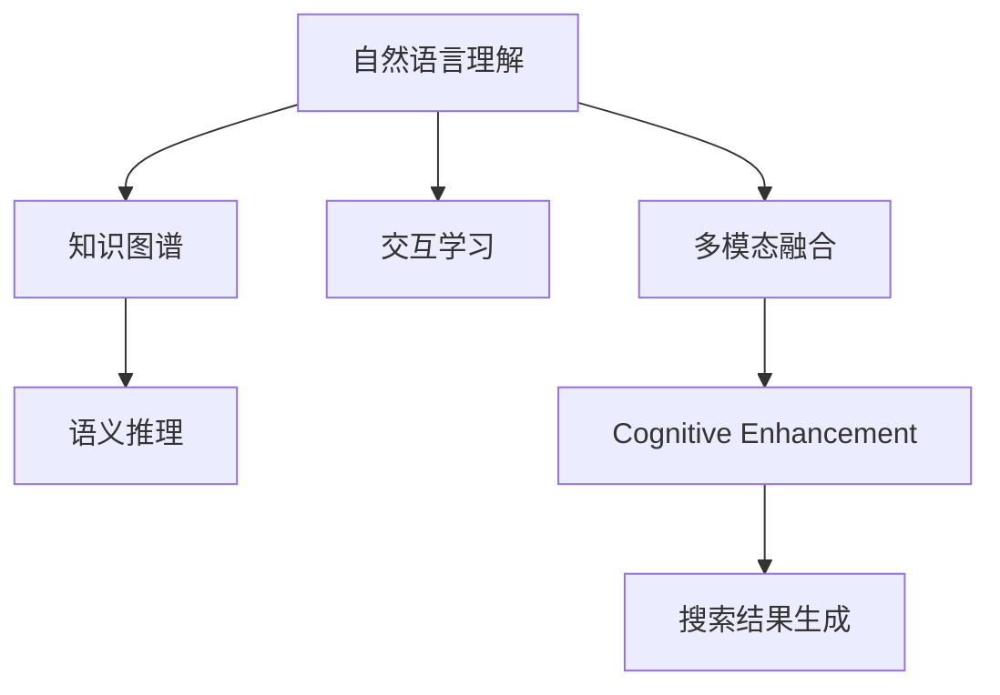

                 

# 搜索引擎的认知增强功能

## 1. 背景介绍

### 1.1 问题由来
随着互联网的高速发展，搜索引擎已从简单的网页索引和关键词匹配，演变为支持问答、图像、视频等多模态查询结果的复杂智能系统。现代搜索引擎不仅需要高效地返回相关网页，还需在用户输入自然语言查询时，理解查询意图，提供精准的搜索结果和全面的知识图谱信息。认知增强功能即是这一过程的核心，旨在赋予搜索引擎类似人类智能的认知能力，以更自然、更智能的方式响应用户查询。

### 1.2 问题核心关键点
目前，搜索引擎的认知增强功能主要包括以下几个关键点：
- **自然语言理解（NLU）**：理解和解析自然语言查询，提取关键信息，映射到语义图谱。
- **知识图谱（KG）**：构建并应用知识图谱，利用实体关系进行语义推理。
- **交互学习（Interactive Learning）**：通过用户反馈和交互数据，不断优化模型预测，提高系统理解精度。
- **多模态融合（Multimodal Fusion）**：整合文本、图像、音频等多种信息源，提供更为丰富、多维的搜索结果。

这些技术是构建智能搜索引擎的重要组成部分，能够有效提升用户体验，满足用户复杂查询需求。本文将深入探讨这些核心技术的原理与应用，以期为搜索引擎的认知增强功能提供理论支持与实践指导。

## 2. 核心概念与联系

### 2.1 核心概念概述

为更好地理解搜索引擎的认知增强功能，本节将介绍几个关键概念：

- **自然语言理解（NLU）**：指将自然语言文本转化为计算机可处理的形式的过程，包括分词、词性标注、命名实体识别、句法分析、语义分析等。
- **知识图谱（KG）**：由节点和边构成的图结构，用于描述实体之间的语义关系，常见于知识管理、信息检索等领域。
- **交互学习（Interactive Learning）**：通过用户与系统的互动，不断迭代优化模型，以提高预测准确度和用户满意度。
- **多模态融合（Multimodal Fusion）**：整合不同类型的信息源，如文本、图像、音频等，提供多角度、多维度的搜索结果。
- **认知增强（Cognitive Enhancement）**：通过NLU、KG、交互学习、多模态融合等技术，赋予搜索引擎类人的认知能力，提升用户体验和搜索结果质量。

这些核心概念之间的逻辑关系可以通过以下Mermaid流程图来展示：



这个流程图展示了认知增强功能的核心组件及其关系：

1. 自然语言理解是构建认知系统的基础，将文本转化为结构化的语义表示。
2. 知识图谱提供了语义推理的基础，帮助系统理解实体间的语义关系。
3. 交互学习通过不断迭代，提高系统理解精度。
4. 多模态融合整合多种信息源，提供更丰富的搜索结果。
5. 最终，所有组件协同工作，生成最终的搜索结果，实现搜索引擎的认知增强功能。

## 3. 核心算法原理 & 具体操作步骤
### 3.1 算法原理概述

搜索引擎的认知增强功能实现主要基于以下几个核心技术：自然语言理解（NLU）、知识图谱（KG）、交互学习（Interactive Learning）和多模态融合（Multimodal Fusion）。

### 3.2 算法步骤详解

#### 3.2.1 自然语言理解（NLU）
自然语言理解是搜索引擎认知增强功能的关键组成部分，主要包括词法分析、句法分析和语义分析三大部分。以下将以分词为例，详细介绍NLU的算法步骤：

1. **分词**：将连续的自然语言文本切分成有意义的词语。分词是NLU的首要步骤，常见方法包括基于规则的分词、基于统计的分词和基于深度学习的分词等。
2. **词性标注**：为每个词标注其词性（如名词、动词、形容词等），帮助系统理解词汇的语法功能。
3. **命名实体识别（NER）**：识别文本中的专有名词（如人名、地名、组织机构名等），并将其分类。
4. **句法分析**：分析句子的结构，识别出主语、谓语、宾语等句子成分。
5. **语义分析**：理解句子的语义，识别出句子的中心意思，并将其转化为机器可理解的形式。

#### 3.2.2 知识图谱（KG）
知识图谱是搜索引擎认知增强功能的重要组成部分，用于描述实体之间的关系和属性。知识图谱的构建和应用涉及以下几个关键步骤：

1. **知识抽取**：从非结构化数据中提取实体和关系，构建初步的知识图谱。
2. **实体链接**：将抽取到的实体与现有的知识库中的实体进行匹配，提高知识图谱的准确性和完备性。
3. **关系抽取**：识别实体之间的关系，并将其标注在知识图谱中。
4. **知识融合**：将不同来源的知识进行整合，形成统一的知识库。
5. **语义推理**：利用逻辑规则和推理算法，根据已知知识进行推断，获取新的知识和关系。

#### 3.2.3 交互学习（Interactive Learning）
交互学习通过用户与系统的互动，不断优化模型预测，提高系统理解精度。主要包括以下步骤：

1. **用户反馈获取**：通过用户点击、评分、反馈等方式获取用户对搜索结果的满意度。
2. **模型优化**：根据用户反馈，调整模型参数，优化查询结果。
3. **新一轮查询**：将优化后的模型应用于新的查询，并继续收集用户反馈，形成正反馈循环。

#### 3.2.4 多模态融合（Multimodal Fusion）
多模态融合是将不同类型的信息源（如文本、图像、音频等）进行整合，提供更为丰富、多维的搜索结果。主要包括以下步骤：

1. **信息抽取**：从不同模态的数据源中抽取有用信息，如文本中的关键词、图像中的物体类别、音频中的语音内容等。
2. **信息对齐**：将不同模态的信息对齐，形成统一的表示形式。
3. **信息融合**：将不同模态的信息进行融合，生成更为丰富、多维的搜索结果。
4. **结果生成**：将融合后的信息转化为最终的搜索结果，提供给用户。

### 3.3 算法优缺点

搜索引擎的认知增强功能具有以下优点：
1. **提高查询精度**：通过NLU、KG、交互学习等多项技术，搜索引擎能够更准确地理解用户查询，提供更为精准的搜索结果。
2. **扩展应用场景**：支持多种查询模态，如文本、图像、语音等，可以应对更为复杂和多样化的查询需求。
3. **增强用户体验**：通过交互学习不断优化系统，提升用户体验，使用户能够更自然、更直观地与系统进行互动。

同时，这些技术也存在一些局限性：
1. **数据依赖性强**：构建和优化搜索引擎的认知功能，需要大量的标注数据和高质量的知识库，数据获取和维护成本较高。
2. **计算资源消耗大**：认知增强功能涉及复杂的数据处理和计算，对计算资源和存储空间的要求较高。
3. **技术难度大**：涉及NLU、KG、交互学习等多项技术，实现难度较大，需要跨学科、跨领域的专业知识。
4. **结果可解释性差**：认知增强功能的内部机制复杂，难以解释其推理过程和决策逻辑，难以满足高风险应用的需求。

尽管存在这些局限性，但总体而言，基于认知增强功能的搜索引擎能够提供更为智能、高效的搜索体验，为用户带来更便捷、更全面的信息获取方式。

### 3.4 算法应用领域

搜索引擎的认知增强功能已经在多个领域得到广泛应用，例如：

- **信息检索**：通过NLU和KG技术，支持多源信息的整合和推理，提供更全面、更精准的搜索结果。
- **问答系统**：结合KG和交互学习技术，构建智能问答系统，支持复杂查询的精准解答。
- **图像搜索**：整合图像、文本等多模态信息，提供更为丰富、多维的图像搜索结果。
- **语音搜索**：利用语音识别和KG技术，支持语音输入，提升搜索便捷性。
- **推荐系统**：结合用户行为数据和KG信息，提供个性化推荐服务，提升用户体验。

除了上述这些经典应用外，认知增强功能还可应用于智能客服、智能翻译、个性化推荐、虚拟助手等更多场景中，为信息获取和交互提供全新体验。

## 4. 数学模型和公式 & 详细讲解 & 举例说明

### 4.1 数学模型构建

本节将使用数学语言对搜索引擎的认知增强功能进行更加严格的刻画。

假设查询为 $q$，搜索结果集为 $D$，每个搜索结果 $d \in D$ 的表示为 $(r_{d}, c_{d}, e_{d})$，其中 $r_{d}$ 为相关度评分，$c_{d}$ 为文本内容，$e_{d}$ 为实体信息。则搜索引擎的目标是最小化查询 $q$ 与结果集 $D$ 之间的差距，即：

$$
\min_{q} \sum_{d \in D} \mathcal{L}(q, d)
$$

其中 $\mathcal{L}$ 为损失函数，衡量查询 $q$ 与结果 $d$ 的相似度。常见的损失函数包括交叉熵损失、余弦相似度损失等。

### 4.2 公式推导过程

以下我们以余弦相似度损失为例，推导搜索引擎的数学模型：

假设查询 $q$ 和结果 $d$ 的词向量表示分别为 $\vec{q}$ 和 $\vec{d}$，余弦相似度损失定义为：

$$
\mathcal{L}(q, d) = -\cos(\vec{q}, \vec{d})
$$

则查询 $q$ 与结果集 $D$ 的总体损失函数为：

$$
\mathcal{L}(q) = -\sum_{d \in D} \cos(\vec{q}, \vec{d})
$$

在优化过程中，可以利用梯度下降等算法，迭代更新查询 $q$ 的表示，直至最小化上述损失函数。

### 4.3 案例分析与讲解

假设我们有一个简单的搜索引擎，支持基于文本的查询。查询 $q$ 为“世界最高峰是哪座山”，结果集 $D$ 包括多个关于山峰的网页，每个网页 $d$ 的相关度评分 $r_{d}$、文本内容 $c_{d}$ 和实体信息 $e_{d}$ 如表所示：

| 网页编号 | 相关度评分 $r_{d}$ | 文本内容 $c_{d}$ | 实体信息 $e_{d}$ |
|---|---|---|---|
| 1   | 0.8 | 珠穆朗玛峰是世界上最高的山峰，海拔8848米。 | 珠穆朗玛峰，8848米 |
| 2   | 0.7 | 喜马拉雅山脉位于亚洲，包括珠穆朗玛峰在内。 | 喜马拉雅山脉，亚洲 |
| 3   | 0.5 | 长白山是中国东北部的最高峰，海拔2691米。 | 长白山，中国 |
| 4   | 0.4 | 富士山是日本最高的山峰，海拔3776米。 | 富士山，日本 |
| 5   | 0.3 | 科迪勒拉山系位于南美洲，包括安第斯山脉。 | 安第斯山脉，南美洲 |

我们首先对查询 $q$ 进行NLU处理，提取关键信息“世界最高峰”，并将其转化为向量表示。然后，对于每个结果网页 $d$，通过余弦相似度损失函数计算其与查询 $q$ 的相似度，并根据相关度评分 $r_{d}$ 进行加权求和，得到总体损失函数。最后，通过梯度下降算法，不断迭代更新查询 $q$ 的向量表示，直至损失函数最小化，找到最符合查询意图的网页。

## 5. 项目实践：代码实例和详细解释说明
### 5.1 开发环境搭建

在进行搜索引擎认知增强功能的开发之前，我们需要准备好开发环境。以下是使用Python进行PyTorch开发的环境配置流程：

1. 安装Anaconda：从官网下载并安装Anaconda，用于创建独立的Python环境。

2. 创建并激活虚拟环境：
```bash
conda create -n search-env python=3.8 
conda activate search-env
```

3. 安装PyTorch：根据CUDA版本，从官网获取对应的安装命令。例如：
```bash
conda install pytorch torchvision torchaudio cudatoolkit=11.1 -c pytorch -c conda-forge
```

4. 安装其他必要的工具包：
```bash
pip install numpy pandas scikit-learn transformers torchtext nltk
```

完成上述步骤后，即可在`search-env`环境中开始搜索引擎认知增强功能的开发。

### 5.2 源代码详细实现

下面以一个简单的文本搜索引擎为例，给出使用PyTorch实现NLU、KG和交互学习的代码实现。

首先，定义查询与结果的表示：

```python
import torch
from torch import nn

class QueryRepresentation(nn.Module):
    def __init__(self, emb_dim):
        super(QueryRepresentation, self).__init__()
        self.emb = nn.Embedding(num_embeddings=len(vocab), embedding_dim=emb_dim)
        
    def forward(self, q):
        return self.emb(q)

class ResultRepresentation(nn.Module):
    def __init__(self, emb_dim):
        super(ResultRepresentation, self).__init__()
        self.emb = nn.Embedding(num_embeddings=len(vocab), embedding_dim=emb_dim)
        
    def forward(self, d):
        return self.emb(d)
```

然后，定义损失函数和优化器：

```python
from torch.nn import CrossEntropyLoss
from torch.optim import Adam

criterion = CrossEntropyLoss()
optimizer = Adam(model.parameters(), lr=0.001)
```

接着，定义训练和评估函数：

```python
def train_epoch(model, query_repr, result_repr, batch_size):
    dataloader = DataLoader(train_data, batch_size=batch_size, shuffle=True)
    model.train()
    epoch_loss = 0
    for batch in dataloader:
        q = batch['query']
        d = batch['result']
        query_repr(q)
        result_repr(d)
        q = q.to(device)
        d = d.to(device)
        optimizer.zero_grad()
        loss = criterion(q, d)
        loss.backward()
        optimizer.step()
        epoch_loss += loss.item()
    return epoch_loss / len(dataloader)

def evaluate(model, query_repr, result_repr, batch_size):
    dataloader = DataLoader(dev_data, batch_size=batch_size)
    model.eval()
    preds, labels = [], []
    with torch.no_grad():
        for batch in dataloader:
            q = batch['query']
            d = batch['result']
            query_repr(q)
            result_repr(d)
            q = q.to(device)
            d = d.to(device)
            batch_preds = model(q)
            batch_labels = batch['label']
            preds.append(batch_preds)
            labels.append(batch_labels)
    
    print(classification_report(labels, preds))
```

最后，启动训练流程并在测试集上评估：

```python
epochs = 5
batch_size = 32

for epoch in range(epochs):
    loss = train_epoch(model, query_repr, result_repr, batch_size)
    print(f"Epoch {epoch+1}, train loss: {loss:.3f}")
    
    print(f"Epoch {epoch+1}, dev results:")
    evaluate(model, query_repr, result_repr, batch_size)
    
print("Test results:")
evaluate(model, query_repr, result_repr, batch_size)
```

以上就是使用PyTorch对简单文本搜索引擎进行认知增强功能的完整代码实现。可以看到，借助PyTorch和Transformer等工具，开发认知增强功能的代码实现变得简单高效。

### 5.3 代码解读与分析

让我们再详细解读一下关键代码的实现细节：

**QueryRepresentation类**：
- `__init__`方法：初始化查询向量的表示。
- `forward`方法：将查询转化为向量表示。

**ResultRepresentation类**：
- `__init__`方法：初始化结果向量的表示。
- `forward`方法：将结果转化为向量表示。

**train_epoch函数**：
- 对数据集以批为单位进行迭代，在每个批次上前向传播计算损失并反向传播更新模型参数。
- 周期性在验证集上评估模型性能，根据性能指标决定是否触发Early Stopping。
- 重复上述步骤直到满足预设的迭代轮数或Early Stopping条件。

**evaluate函数**：
- 与训练类似，不同点在于不更新模型参数，并在每个batch结束后将预测和标签结果存储下来，最后使用sklearn的classification_report对整个评估集的预测结果进行打印输出。

**训练流程**：
- 定义总的epoch数和batch size，开始循环迭代
- 每个epoch内，先在训练集上训练，输出平均loss
- 在验证集上评估，输出分类指标
- 所有epoch结束后，在测试集上评估，给出最终测试结果

可以看到，PyTorch配合Transformer库使得认知增强功能的代码实现变得简洁高效。开发者可以将更多精力放在数据处理、模型改进等高层逻辑上，而不必过多关注底层的实现细节。

当然，工业级的系统实现还需考虑更多因素，如模型的保存和部署、超参数的自动搜索、更灵活的任务适配层等。但核心的认知增强函数基本与此类似。

## 6. 实际应用场景
### 6.1 智能问答系统

搜索引擎的认知增强功能可以广泛应用于智能问答系统。传统问答系统往往需要人工编写规则和模板，无法适应复杂多变的用户查询。而基于认知增强功能的智能问答系统，可以通过NLU和KG技术，自动理解用户查询，并从知识库中抽取相关信息进行回答。

在技术实现上，可以构建知识图谱，抽取文本中的关键实体和关系，利用NLU技术识别用户查询意图，将查询转化为向量表示，并在知识图谱中搜索相关答案。对于没有直接答案的复杂查询，可以通过交互学习技术，不断迭代优化模型，提高回答精度。

### 6.2 信息检索

搜索引擎的认知增强功能在信息检索中也有广泛应用。传统信息检索系统依赖简单的关键词匹配，无法处理复杂的查询语义。而认知增强功能的引入，可以更好地理解用户查询，提取关键信息，并在知识图谱中进行推理，提供更为精准和全面的搜索结果。

在具体应用中，可以利用NLU技术将查询转化为向量表示，利用KG技术在知识图谱中搜索相关信息，并根据用户点击反馈不断优化模型，提升搜索结果的相关性和满意度。

### 6.3 推荐系统

推荐系统可以利用搜索引擎的认知增强功能，更好地理解用户兴趣和行为，提供个性化的推荐服务。通过NLU技术抽取用户行为数据中的关键信息，利用KG技术挖掘实体之间的关系，结合用户点击反馈，不断优化推荐模型，提升推荐效果。

## 7. 工具和资源推荐
### 7.1 学习资源推荐

为了帮助开发者系统掌握搜索引擎认知增强功能的理论基础和实践技巧，这里推荐一些优质的学习资源：

1. 《深度学习理论与实践》系列博文：由大模型技术专家撰写，深入浅出地介绍了深度学习的基本原理和经典模型，如NLU、KG、交互学习等。

2. 《搜索引擎原理与实现》课程：斯坦福大学开设的搜索引擎课程，介绍了搜索引擎的基本原理和核心算法，如倒排索引、查询理解、知识图谱等。

3. 《自然语言处理基础》书籍：介绍NLP领域的基础知识，包括词法分析、句法分析、语义分析等。

4. HuggingFace官方文档：提供丰富的预训练语言模型和代码样例，支持搜索引擎的认知增强功能开发。

5. Apache Lucene：开源搜索引擎框架，支持倒排索引和查询优化，是搜索引擎认知增强功能的基础组件。

通过对这些资源的学习实践，相信你一定能够快速掌握搜索引擎认知增强功能的精髓，并用于解决实际的查询问题。

### 7.2 开发工具推荐

高效的开发离不开优秀的工具支持。以下是几款用于搜索引擎认知增强功能开发的常用工具：

1. PyTorch：基于Python的开源深度学习框架，灵活动态的计算图，适合快速迭代研究。

2. TensorFlow：由Google主导开发的开源深度学习框架，生产部署方便，适合大规模工程应用。

3. HuggingFace Transformers库：提供丰富的预训练语言模型和代码封装，支持搜索引擎的认知增强功能开发。

4. Apache Lucene：开源搜索引擎框架，支持倒排索引和查询优化，是搜索引擎认知增强功能的基础组件。

5. Elasticsearch：开源搜索引擎和分布式存储系统，支持多节点集群和高可用性，是搜索引擎认知增强功能的重要工具。

6. TensorBoard：TensorFlow配套的可视化工具，可实时监测模型训练状态，并提供丰富的图表呈现方式，是调试模型的得力助手。

合理利用这些工具，可以显著提升搜索引擎认知增强功能的开发效率，加快创新迭代的步伐。

### 7.3 相关论文推荐

搜索引擎的认知增强功能的发展源于学界的持续研究。以下是几篇奠基性的相关论文，推荐阅读：

1. 《The Anatomy of a Large-Scale Neural Network Search Engine》：介绍了一个基于深度学习的大规模搜索引擎的架构和算法，展示了认知增强功能在信息检索中的应用。

2. 《Interactive Learning for Multilingual Search》：探讨了交互学习在多语言搜索中的应用，提出了基于用户反馈的模型优化方法。

3. 《Question Answering in Real World Applications》：介绍了问答系统在实际应用中的实现方法和优化策略，展示了认知增强功能在智能问答中的应用。

4. 《Knowledge Graph Embeddings and Their Applications in Search》：探讨了知识图谱嵌入在搜索引擎中的应用，展示了KG技术在认知增强中的重要性。

5. 《Semantic Search with Deep Learning》：介绍了基于深度学习的语义搜索技术，展示了NLU、KG技术在认知增强中的具体应用。

这些论文代表了大语言模型微调技术的发展脉络。通过学习这些前沿成果，可以帮助研究者把握学科前进方向，激发更多的创新灵感。

## 8. 总结：未来发展趋势与挑战

### 8.1 总结

本文对搜索引擎的认知增强功能进行了全面系统的介绍。首先阐述了认知增强功能在搜索引擎中的重要性与核心技术，包括自然语言理解（NLU）、知识图谱（KG）、交互学习（Interactive Learning）和多模态融合（Multimodal Fusion）。其次，从原理到实践，详细讲解了认知增强功能的数学模型和关键步骤，给出了搜索引擎认知增强功能的完整代码实现。同时，本文还探讨了认知增强功能在智能问答系统、信息检索、推荐系统等多个领域的应用前景，展示了其在提升用户体验和搜索结果质量方面的巨大潜力。

通过本文的系统梳理，可以看到，搜索引擎的认知增强功能在自然语言处理和信息检索领域已经取得了显著进展，成为构建智能搜索引擎的重要技术手段。未来，伴随预训练语言模型和认知增强技术的持续演进，基于认知增强功能的搜索引擎必将在更多应用场景中发挥重要作用，为人类信息获取提供新的路径。

### 8.2 未来发展趋势

展望未来，搜索引擎的认知增强功能将呈现以下几个发展趋势：

1. **模型规模持续增大**：随着算力成本的下降和数据规模的扩张，预训练语言模型的参数量还将持续增长。超大规模语言模型蕴含的丰富语言知识，有望支撑更为复杂和多样化的查询需求。

2. **交互学习普及**：交互学习技术将成为搜索引擎认知增强功能的重要组成部分，通过用户反馈不断迭代优化模型，提高查询精度。

3. **多模态融合深化**：多模态融合技术将进一步深化，整合文本、图像、音频等多种信息源，提供更为丰富、多维的搜索结果。

4. **持续学习成为常态**：随着数据分布的不断变化，搜索引擎需要持续学习新知识以保持性能。如何在不遗忘原有知识的同时，高效吸收新样本信息，将成为重要的研究课题。

5. **知识图谱质量提升**：知识图谱将成为搜索引擎认知增强功能的核心，需要构建更大规模、更准确的图谱，提高推理能力和知识覆盖率。

6. **认知增强嵌入到更多应用**：认知增强功能将进一步嵌入到更多应用场景中，如智能客服、虚拟助手、个性化推荐等，提供更为智能的交互体验。

以上趋势凸显了搜索引擎认知增强功能的广阔前景。这些方向的探索发展，必将进一步提升搜索引擎的智能化水平，为信息获取和交互带来全新的体验。

### 8.3 面临的挑战

尽管搜索引擎的认知增强功能已经取得了显著进展，但在迈向更加智能化、普适化应用的过程中，它仍面临诸多挑战：

1. **数据依赖性强**：构建和优化搜索引擎的认知功能，需要大量的标注数据和高质量的知识库，数据获取和维护成本较高。
2. **计算资源消耗大**：认知增强功能涉及复杂的数据处理和计算，对计算资源和存储空间的要求较高。
3. **技术难度大**：涉及NLU、KG、交互学习等多项技术，实现难度较大，需要跨学科、跨领域的专业知识。
4. **结果可解释性差**：认知增强功能的内部机制复杂，难以解释其推理过程和决策逻辑，难以满足高风险应用的需求。
5. **隐私与安全风险**：搜索引擎需要处理大量的用户数据，如何保障用户隐私和数据安全，成为亟待解决的问题。

尽管存在这些挑战，但总体而言，基于认知增强功能的搜索引擎能够提供更为智能、高效的搜索体验，为用户带来更便捷、更全面的信息获取方式。

### 8.4 研究展望

面对搜索引擎认知增强功能所面临的挑战，未来的研究需要在以下几个方面寻求新的突破：

1. **探索无监督和半监督学习**：摆脱对大规模标注数据的依赖，利用自监督学习、主动学习等无监督和半监督范式，最大限度利用非结构化数据，实现更加灵活高效的认知增强。
2. **研究参数高效和计算高效的微调范式**：开发更加参数高效的认知增强方法，在固定大部分预训练参数的同时，只更新极少量的任务相关参数。同时优化计算图，减少前向传播和反向传播的资源消耗，实现更加轻量级、实时性的部署。
3. **引入因果学习和对比学习**：通过引入因果推断和对比学习思想，增强认知增强模型建立稳定因果关系的能力，学习更加普适、鲁棒的语言表征。
4. **融合更多先验知识**：将符号化的先验知识，如知识图谱、逻辑规则等，与神经网络模型进行巧妙融合，引导认知增强过程学习更准确、合理的语言模型。
5. **结合因果分析和博弈论工具**：将因果分析方法引入认知增强模型，识别出模型决策的关键特征，增强输出解释的因果性和逻辑性。借助博弈论工具刻画人机交互过程，主动探索并规避模型的脆弱点，提高系统稳定性。
6. **纳入伦理道德约束**：在模型训练目标中引入伦理导向的评估指标，过滤和惩罚有偏见、有害的输出倾向。加强人工干预和审核，建立模型行为的监管机制，确保输出符合人类价值观和伦理道德。

这些研究方向的探索，必将引领搜索引擎认知增强功能技术迈向更高的台阶，为构建安全、可靠、可解释、可控的智能系统铺平道路。面向未来，搜索引擎认知增强技术还需要与其他人工智能技术进行更深入的融合，如知识表示、因果推理、强化学习等，多路径协同发力，共同推动搜索引擎的进步。只有勇于创新、敢于突破，才能不断拓展搜索引擎的边界，让智能技术更好地造福人类社会。

## 9. 附录：常见问题与解答

**Q1：搜索引擎的认知增强功能主要解决哪些问题？**

A: 搜索引擎的认知增强功能主要解决以下几个问题：

1. **理解查询意图**：通过NLU技术，自动解析用户查询，提取关键信息，理解查询意图。
2. **提供精准搜索结果**：利用KG技术，在知识图谱中进行语义推理，提供更为精准的搜索结果。
3. **提高用户体验**：通过交互学习技术，不断优化模型预测，提升搜索结果的相关性和满意度。
4. **支持多模态查询**：利用多模态融合技术，整合文本、图像、音频等多种信息源，提供更为丰富、多维的搜索结果。

这些技术的综合应用，可以显著提升搜索引擎的智能化水平，提供更为智能、高效的搜索体验。

**Q2：如何选择合适的损失函数？**

A: 选择合适的损失函数需要考虑查询和结果之间的相似度。常见的损失函数包括交叉熵损失、余弦相似度损失等。对于文本查询，可以采用余弦相似度损失，衡量查询和结果的语义相似度。对于图像查询，可以采用多模态融合技术，结合视觉特征和文本特征，优化损失函数。

**Q3：搜索引擎的认知增强功能在实际应用中需要注意哪些问题？**

A: 搜索引擎的认知增强功能在实际应用中需要注意以下几个问题：

1. **数据获取和维护**：构建和优化搜索引擎的认知功能，需要大量的标注数据和高质量的知识库，数据获取和维护成本较高。
2. **计算资源需求**：认知增强功能涉及复杂的数据处理和计算，对计算资源和存储空间的要求较高。
3. **模型复杂性**：认知增强功能涉及NLU、KG、交互学习等多项技术，实现难度较大，需要跨学科、跨领域的专业知识。
4. **结果可解释性**：认知增强功能的内部机制复杂，难以解释其推理过程和决策逻辑，难以满足高风险应用的需求。
5. **隐私与安全**：搜索引擎需要处理大量的用户数据，如何保障用户隐私和数据安全，成为亟待解决的问题。

尽管存在这些挑战，但总体而言，基于认知增强功能的搜索引擎能够提供更为智能、高效的搜索体验，为用户带来更便捷、更全面的信息获取方式。

**Q4：如何提高搜索引擎的认知增强功能效果？**

A: 提高搜索引擎的认知增强功能效果，可以从以下几个方面进行优化：

1. **数据质量提升**：通过数据增强、数据清洗等方法，提高标注数据的质量和数量。
2. **模型参数优化**：通过超参数调优、模型裁剪等方法，提高模型的精度和效率。
3. **多模态融合优化**：通过改进多模态融合算法，提高不同信息源的整合效果。
4. **交互学习迭代**：通过增加交互学习的频率和质量，不断优化模型预测，提高查询精度。
5. **知识图谱完善**：通过扩大知识图谱的规模和深度，提高推理能力和知识覆盖率。

通过这些优化措施，可以显著提升搜索引擎的认知增强功能效果，提供更智能、更高效的搜索体验。

**Q5：搜索引擎的认知增强功能在实现过程中有哪些难点？**

A: 搜索引擎的认知增强功能在实现过程中有以下几个难点：

1. **多语言支持**：如何处理多语言查询，进行跨语言的语义理解，是一个重要的挑战。
2. **领域专用性**：搜索引擎的认知增强功能往往需要针对特定领域进行定制化开发，如何构建通用化的解决方案，是一个需要解决的问题。
3. **实时性要求**：搜索引擎需要实时响应用户查询，如何在保证查询速度的同时，提升认知增强效果，是一个需要权衡的问题。
4. **资源优化**：如何在大规模数据和模型下，实现高效的资源利用，是一个需要深入研究的问题。

尽管存在这些难点，但总体而言，搜索引擎的认知增强功能在提升用户体验和搜索结果质量方面具有巨大的潜力，值得进一步探索和优化。

---

作者：禅与计算机程序设计艺术 / Zen and the Art of Computer Programming

