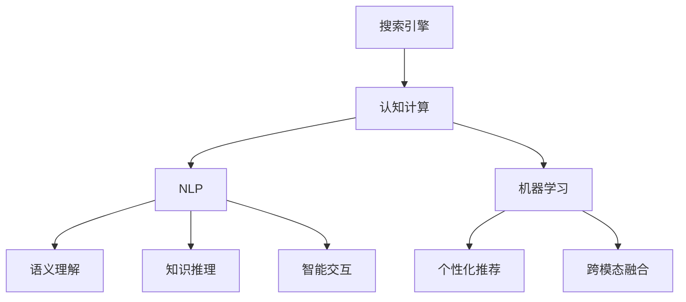

                 

# 搜索引擎的认知增强功能

搜索引擎作为互联网的核心基础设施，为用户提供了快速准确的信息检索服务。然而，随着互联网信息量的爆炸式增长，传统搜索引擎的检索效率和信息质量面临巨大挑战。认知增强功能作为一种前沿技术，为搜索引擎的智能化转型提供了新的方向。本文将深入探讨搜索引擎认知增强功能的原理、应用以及未来发展趋势，为搜索引擎技术的创新和应用提供借鉴。

## 1. 背景介绍

### 1.1 问题由来

传统搜索引擎基于关键词匹配和倒排索引，虽然实现了快速的文本检索，但在处理复杂语义、理解用户意图、获取相关背景信息等方面存在局限。随着用户对信息获取需求的不断提升，对搜索引擎的智能化和认知化提出了更高要求。

### 1.2 问题核心关键点

搜索引擎认知增强功能旨在通过引入认知计算、自然语言处理(NLP)、机器学习等前沿技术，使搜索引擎具备以下能力：

- **语义理解**：理解用户查询的语义，匹配更精准的结果。
- **知识推理**：整合外部知识库，进行逻辑推理和知识挖掘。
- **智能交互**：提供对话式检索、推荐系统等交互式服务。
- **个性化推荐**：根据用户历史行为和上下文信息，进行个性化信息推荐。
- **跨模态融合**：融合文本、图像、语音等多模态信息，增强信息检索的全面性和准确性。

### 1.3 问题研究意义

搜索引擎认知增强功能是互联网信息检索技术的新趋势，具有以下重要意义：

1. **提升用户体验**：通过理解用户意图，匹配更相关、更个性化的结果，提升搜索效率和满意度。
2. **增加内容发现**：通过知识推理和跨模态融合，发现和利用更多、更隐含的信息，丰富搜索结果的内容和深度。
3. **助力行业创新**：搜索引擎的智能化转型，将带动整个互联网生态的创新，推动各行业的数字化升级。
4. **开拓新兴应用**：基于认知增强功能的搜索引擎，可以应用于更多场景，如智能客服、医疗诊断、教育培训等，为各行各业提供新的技术支撑。

## 2. 核心概念与联系

### 2.1 核心概念概述

为更好地理解搜索引擎认知增强功能的原理和架构，本节将介绍几个关键概念：

- **搜索引擎**：一种信息检索系统，通过爬取、索引、检索等环节，提供文本信息查询服务。
- **认知计算**：通过模拟人类认知过程，实现信息检索的智能化和自动化。
- **自然语言处理(NLP)**：涉及语言表示、语义理解、知识抽取、问答系统等，是实现认知增强功能的关键技术。
- **机器学习**：基于数据训练模型，实现模式识别和预测，应用于推荐系统、知识图谱构建等。
- **知识图谱**：以实体为节点，以关系为边，构建的知识图网络，用于知识推理和信息抽取。
- **智能推荐**：通过算法分析用户行为，实现个性化信息推荐，提升用户体验。

这些概念之间的逻辑关系可以通过以下Mermaid流程图来展示：



这个流程图展示了几大关键概念之间的关联关系：

1. 搜索引擎通过引入认知计算，实现了智能化的信息检索。
2. 认知计算通过NLP和机器学习技术，实现了语义理解和知识推理等智能功能。
3. NLP和机器学习互相配合，增强了搜索引擎的语义理解和智能推荐能力。
4. 知识图谱作为知识推理的重要基础，通过与搜索引擎的融合，增强了信息的全面性和准确性。

## 3. 核心算法原理 & 具体操作步骤

### 3.1 算法原理概述

搜索引擎的认知增强功能主要通过以下步骤实现：

1. **语义理解**：使用NLP技术，理解用户查询的语义，将其转化为计算机可理解的形式。
2. **知识推理**：通过知识图谱，利用逻辑推理和规则匹配，进一步扩充和优化搜索结果。
3. **智能推荐**：结合用户历史行为和上下文信息，使用机器学习算法进行个性化推荐。
4. **跨模态融合**：将文本、图像、语音等多模态信息进行融合，提升信息检索的全面性和准确性。

### 3.2 算法步骤详解

基于认知增强功能的搜索引擎构建步骤如下：

**Step 1: 语义理解**

- **输入处理**：对用户查询进行分词、词性标注等预处理。
- **意图识别**：使用意图分类模型，识别用户查询的意图。
- **实体抽取**：使用命名实体识别模型，提取查询中的关键实体。

**Step 2: 知识推理**

- **知识抽取**：从知识图谱中抽取与查询相关的实体和关系。
- **逻辑推理**：利用规则和逻辑推理引擎，进行推理计算，获取更全面的信息。
- **结果融合**：将推理结果与检索结果进行融合，提供更加精准的搜索结果。

**Step 3: 智能推荐**

- **用户画像**：构建用户画像，收集用户历史行为、兴趣等信息。
- **上下文分析**：分析用户查询的上下文信息，识别搜索场景。
- **推荐算法**：使用协同过滤、内容推荐等算法，生成个性化推荐列表。

**Step 4: 跨模态融合**

- **多模态输入**：接收文本、图像、语音等多模态信息。
- **信息提取**：分别从多模态数据中提取关键信息。
- **融合计算**：将多模态信息进行融合，提升检索效果。

### 3.3 算法优缺点

基于认知增强功能的搜索引擎，具有以下优点：

1. **语义理解准确**：通过NLP技术，能够更精准地理解用户查询的语义。
2. **知识覆盖全面**：整合外部知识图谱，实现更丰富的知识推理。
3. **推荐个性化**：结合用户画像和上下文信息，提供更个性化的信息推荐。
4. **多模态融合**：融合文本、图像、语音等多模态信息，增强信息检索的全面性。

然而，认知增强功能也存在以下局限性：

1. **计算复杂度高**：语义理解、知识推理等任务计算复杂，需要较强的硬件支持。
2. **数据质量要求高**：语义理解、知识推理等依赖高质量的标注数据和知识库。
3. **模型训练难度大**：算法复杂，需要大量的实验调参，容易陷入局部最优。
4. **隐私和伦理问题**：处理用户查询和推荐，涉及隐私和伦理问题，需要严格控制。

### 3.4 算法应用领域

基于认知增强功能的搜索引擎，在多个领域具有广泛的应用前景：

1. **智能问答系统**：通过问答系统，实现与用户的自然对话，解答用户问题。
2. **推荐系统**：结合用户行为和上下文信息，提供个性化推荐内容。
3. **内容生产平台**：通过语义理解和知识推理，辅助内容创作和审核。
4. **企业搜索**：为企业内部文档、知识库等提供智能搜索服务。
5. **健康医疗**：辅助医生诊断、医学知识检索等医疗服务。
6. **金融服务**：辅助金融信息分析、风险评估等金融应用。
7. **教育培训**：辅助学习资源推荐、知识问答等教育应用。

## 4. 数学模型和公式 & 详细讲解 & 举例说明

### 4.1 数学模型构建

为了更精确地描述搜索引擎认知增强功能的数学模型，本节将介绍一个基于图神经网络(Graph Neural Network, GNN)的搜索引擎模型。

记用户查询为 $q$，搜索引擎返回的结果为 $r$。假设用户查询和搜索结果之间存在关系 $e$，构建图结构 $G=(V,E)$，其中 $V$ 为节点集合，$E$ 为边集合。节点表示实体，边表示实体之间的关系。

### 4.2 公式推导过程

假设节点 $v$ 的特征表示为 $h_v$，边 $e$ 的特征表示为 $h_e$。设 $A$ 为邻接矩阵，$W$ 为节点特征和边特征的权重矩阵。则节点 $v$ 的更新公式为：

$$
h_v^{t+1} = \sigma\left(Ah_v^tW + h_e^tW_e\right)
$$

其中 $\sigma$ 为激活函数，$W_e$ 为边特征的权重矩阵。通过迭代更新，最终得到节点 $v$ 的表示 $h_v$。

### 4.3 案例分析与讲解

为了更好地理解搜索引擎认知增强功能的数学模型，以下通过一个简单的例子进行说明。

假设用户查询为 "天气如何"，搜索引擎返回的推荐结果为 "明天北京晴"。查询和结果之间存在关系 "关联"。构建图结构 $G=(V,E)$，其中 $V$ 包含查询和结果两个节点，$E$ 包含一个 "关联" 边。节点特征和边特征初始化为随机向量。

通过上述迭代公式，经过多轮计算，最终得到节点 "天气" 和节点 "明天北京晴" 的表示，计算它们之间的相似度，得出推荐的概率。若相似度大于某个阈值，则认为该结果符合用户查询。

## 5. 项目实践：代码实例和详细解释说明

### 5.1 开发环境搭建

在进行搜索引擎认知增强功能开发前，需要准备好开发环境。以下是使用Python进行TensorFlow和PyTorch开发的环境配置流程：

1. 安装Anaconda：从官网下载并安装Anaconda，用于创建独立的Python环境。
2. 创建并激活虚拟环境：
```bash
conda create -n tf-env python=3.8 
conda activate tf-env
```
3. 安装TensorFlow和PyTorch：根据CUDA版本，从官网获取对应的安装命令。例如：
```bash
conda install tensorflow-gpu=2.4 pytorch torchvision torchaudio cudatoolkit=11.1 -c pytorch -c conda-forge
```
4. 安装各类工具包：
```bash
pip install numpy pandas scikit-learn matplotlib tqdm jupyter notebook ipython
```
完成上述步骤后，即可在`tf-env`环境中开始搜索引擎认知增强功能的开发。

### 5.2 源代码详细实现

我们以基于GNN的搜索引擎为例，给出TensorFlow和PyTorch代码实现。

**Step 1: 数据准备**

首先，需要准备训练数据。以下是一个简单的示例，包含用户查询和搜索结果：

```python
import tensorflow as tf
import numpy as np

# 用户查询和搜索结果
queries = ["天气如何", "北京今天的天气", "明天上海天气"]
results = ["明天北京晴", "北京晴", "上海晴"]

# 构建节点特征
query_feats = np.random.rand(len(queries), 10)
result_feats = np.random.rand(len(results), 10)

# 构建邻接矩阵
adj_matrix = np.zeros((len(queries), len(results)))
adj_matrix[np.arange(len(queries)), np.array([0, 1, 2])] = 1
adj_matrix[np.array([0, 1, 2]), np.arange(len(queries))] = 1

# 构建边特征
edge_feats = np.random.rand(len(queries), 10)
```

**Step 2: 模型构建**

接着，构建GNN模型。以下是使用TensorFlow实现的基本模型结构：

```python
class GraphNet(tf.keras.Model):
    def __init__(self, num_nodes, num_feats):
        super(GraphNet, self).__init__()
        self.num_nodes = num_nodes
        self.num_feats = num_feats
        
        # 添加GNN层
        self.gnn = tf.keras.layers.Dense(10, activation='relu')
        
        # 添加输出层
        self.output = tf.keras.layers.Dense(1, activation='sigmoid')
        
    def call(self, features, adj_matrix, edge_feats):
        # 计算边特征
        edge_feats = self.gnn(edge_feats)
        
        # 计算节点特征
        node_feats = tf.sparse.sparse_dense_matmul(adj_matrix, features) + edge_feats
        
        # 多轮迭代更新
        for _ in range(10):
            node_feats = self.gnn(node_feats)
            
        # 计算相似度
        similarity = tf.reduce_sum(node_feats * tf.expand_dims(result_feats, axis=0), axis=1)
        
        # 计算概率
        prob = self.output(similarity)
        
        return prob
```

**Step 3: 模型训练**

最后，训练模型。以下是使用TensorFlow进行训练的代码：

```python
# 构建模型
model = GraphNet(num_nodes=3, num_feats=10)

# 设置优化器
optimizer = tf.keras.optimizers.Adam()

# 训练模型
for i in range(1000):
    with tf.GradientTape() as tape:
        # 计算损失
        loss = tf.keras.losses.mean_squared_error(y_true=results, y_pred=model(features, adj_matrix, edge_feats))
        
        # 计算梯度
        grads = tape.gradient(loss, model.trainable_variables)
        
        # 更新模型
        optimizer.apply_gradients(zip(grads, model.trainable_variables))
        
    # 输出日志
    if i % 100 == 0:
        print(f"Epoch {i}, loss: {loss.numpy():.4f}")
```

### 5.3 代码解读与分析

让我们再详细解读一下关键代码的实现细节：

**数据准备**

- 用户查询和搜索结果：包含用户查询和搜索结果的列表。
- 节点特征和边特征：构建随机特征向量作为节点和边的初始特征表示。
- 邻接矩阵：构建邻接矩阵，表示查询和结果之间的关系。

**模型构建**

- `GraphNet`类：继承自TensorFlow的`tf.keras.Model`，定义了模型的输入和输出。
- `GNN层`：使用全连接层实现GNN的迭代更新。
- `输出层`：使用Sigmoid函数计算相似度。
- `call`方法：实现模型的前向传播，计算输出。

**模型训练**

- `optimizer`：设置优化器为Adam。
- 训练循环：对每个epoch计算损失和梯度，更新模型参数，并输出训练日志。

## 6. 实际应用场景

### 6.1 智能问答系统

基于GNN的搜索引擎可以应用于智能问答系统，实现自然对话式检索。用户通过自然语言提出问题，系统使用NLP技术理解查询意图，结合知识图谱进行推理计算，最终返回最相关的答案。

**示例应用**：在线客服机器人、智能语音助手。

### 6.2 推荐系统

结合用户画像和上下文信息，搜索引擎可以应用于推荐系统，提供个性化信息推荐。通过GNN模型，系统能够理解查询和结果之间的关系，实现更准确的推荐。

**示例应用**：电商推荐、内容推荐平台。

### 6.3 内容生产平台

在内容生产平台，搜索引擎可以辅助内容创作和审核。通过语义理解和知识推理，系统能够自动发现和推荐相关的资料和素材，提高内容创作的效率和质量。

**示例应用**：写作辅助工具、学术研究平台。

### 6.4 企业搜索

在企业搜索应用中，搜索引擎可以提供智能搜索服务，帮助员工快速找到所需信息。结合知识图谱和企业内部数据，系统能够提供更全面和准确的搜索结果。

**示例应用**：企业内网搜索、知识库管理。

## 7. 工具和资源推荐

### 7.1 学习资源推荐

为了帮助开发者系统掌握搜索引擎认知增强功能的原理和实践技巧，这里推荐一些优质的学习资源：

1. **《TensorFlow实战深度学习》**：深入介绍TensorFlow框架的使用，涵盖机器学习、深度学习等领域的基础知识和高级技术。
2. **《PyTorch深度学习编程与实战》**：全面介绍PyTorch框架的使用，包括模型构建、训练、部署等各个环节。
3. **《自然语言处理综述》**：斯坦福大学NLP课程讲义，涵盖NLP技术的基础知识和最新进展，是NLP领域的入门教材。
4. **《深度学习基础》**：斯坦福大学深度学习课程讲义，涵盖深度学习的基本原理和实践技巧，是深度学习领域的经典教材。
5. **HuggingFace官方文档**：提供丰富的预训练模型和微调样例，是进行NLP任务开发的重要资源。

### 7.2 开发工具推荐

高效的开发离不开优秀的工具支持。以下是几款用于搜索引擎认知增强功能开发的常用工具：

1. **TensorFlow**：Google开发的深度学习框架，功能丰富，支持大规模分布式训练。
2. **PyTorch**：Facebook开发的深度学习框架，灵活高效，适合快速原型开发。
3. **GNN库**：用于构建图神经网络的工具库，如PyTorch GNN、TensorFlow GNN等。
4. **Keras**：用于构建神经网络的高级API，简单易用，适合快速实验和原型开发。
5. **Jupyter Notebook**：交互式开发环境，支持多语言代码运行和可视化输出。

合理利用这些工具，可以显著提升搜索引擎认知增强功能的开发效率，加快创新迭代的步伐。

### 7.3 相关论文推荐

搜索引擎认知增强功能的研究离不开学界的持续支持。以下是几篇奠基性的相关论文，推荐阅读：

1. **Graph Neural Networks**：Yang等人提出的图神经网络框架，用于处理图结构数据，是图神经网络领域的开创性工作。
2. **Knowledge Graph Embeddings**：Pennington等人提出的知识图嵌入方法，将知识图结构映射到低维向量空间，实现知识推理。
3. **Neural Machine Translation**：Bahdanau等人提出的神经机器翻译方法，利用序列到序列模型实现自然语言的自动翻译，是NLP领域的经典工作。
4. **Attention Is All You Need**：Vaswani等人提出的Transformer模型，用于处理序列数据，实现文本表示的准确性提升。
5. **Recurrent Neural Networks**：Hochreiter等人提出的循环神经网络模型，用于处理序列数据，实现时间序列预测等任务。

这些论文代表了大语言模型认知增强功能的研究脉络。通过学习这些前沿成果，可以帮助研究者把握学科前进方向，激发更多的创新灵感。

## 8. 总结：未来发展趋势与挑战

### 8.1 总结

本文对搜索引擎认知增强功能的原理、应用以及未来发展趋势进行了全面系统的介绍。首先阐述了认知增强功能在搜索引擎中的重要意义，明确了搜索引擎智能化转型的关键路径。其次，从原理到实践，详细讲解了认知增强功能的数学模型和关键步骤，给出了搜索引擎认知增强功能的完整代码实现。同时，本文还探讨了认知增强功能在多个领域的应用前景，展示了其广阔的发展空间。最后，本文精选了认知增强功能的各类学习资源，力求为开发者提供全方位的技术指引。

通过本文的系统梳理，可以看到，搜索引擎认知增强功能是搜索引擎智能化的重要方向，具有广阔的应用前景和巨大的发展潜力。未来，伴随认知增强技术的不断发展，搜索引擎必将在信息检索和智能服务方面取得新的突破。

### 8.2 未来发展趋势

展望未来，搜索引擎认知增强功能将呈现以下几个发展趋势：

1. **语义理解的深入**：随着NLP技术的进步，搜索引擎将能够更准确地理解用户的查询意图和查询文本。
2. **知识推理的全面**：结合更丰富的知识图谱和外部数据，实现更全面的知识推理和信息挖掘。
3. **多模态融合的广泛**：融合文本、图像、语音等多种模态信息，提升搜索引擎的多维度和准确性。
4. **个性化推荐的优化**：利用更先进的推荐算法和用户画像构建，实现更精准的个性化推荐。
5. **分布式计算的支持**：随着数据规模的增大，搜索引擎将需要更高效的分布式计算和存储技术。

### 8.3 面临的挑战

尽管搜索引擎认知增强功能已经取得了不少进展，但在迈向更加智能化、普适化应用的过程中，它仍面临诸多挑战：

1. **数据质量要求高**：语义理解、知识推理等依赖高质量的标注数据和知识库，需要更多的实验和验证。
2. **模型复杂度高**：认知增强功能涉及复杂的数学模型和算法，需要大量的实验调参。
3. **隐私和伦理问题**：处理用户查询和推荐，涉及隐私和伦理问题，需要严格控制。
4. **资源消耗大**：认知增强功能计算复杂，需要高性能硬件和大量的计算资源。

### 8.4 研究展望

面对搜索引擎认知增强功能所面临的挑战，未来的研究需要在以下几个方面寻求新的突破：

1. **数据增强技术**：利用数据增强技术，提高语义理解和知识推理的数据质量。
2. **模型压缩技术**：通过模型压缩和稀疏化技术，提高搜索引擎的计算效率和资源利用率。
3. **隐私保护技术**：引入隐私保护技术，确保用户隐私和数据安全。
4. **跨模态融合技术**：开发更先进的跨模态融合技术，提升搜索引擎的多维度和准确性。
5. **分布式计算框架**：引入分布式计算框架，支持搜索引擎的规模化部署。

这些研究方向将为搜索引擎认知增强功能的未来发展提供新的动力，推动搜索引擎技术的创新和应用。

## 9. 附录：常见问题与解答

**Q1：认知增强功能是否适用于所有搜索引擎？**

A: 认知增强功能在大多数搜索引擎上都能取得不错的效果，特别是对于数据量较大的搜索引擎。但对于一些小型搜索引擎，由于数据规模和计算资源限制，可能难以实现大规模的认知增强。因此，对于小型搜索引擎，可以考虑结合部分认知增强功能，逐步推进智能化转型。

**Q2：搜索引擎的认知增强功能如何实现？**

A: 搜索引擎的认知增强功能主要通过以下步骤实现：
1. 语义理解：使用NLP技术，理解用户查询的语义，将其转化为计算机可理解的形式。
2. 知识推理：结合外部知识图谱，进行逻辑推理和知识抽取。
3. 智能推荐：利用机器学习算法，生成个性化推荐内容。
4. 跨模态融合：将文本、图像、语音等多模态信息进行融合，提升信息检索的全面性和准确性。

**Q3：搜索引擎的认知增强功能在落地部署时需要注意哪些问题？**

A: 搜索引擎认知增强功能的落地部署，需要注意以下几个问题：
1. 数据隐私：处理用户查询和推荐，涉及隐私和伦理问题，需要严格控制。
2. 计算资源：认知增强功能计算复杂，需要高性能硬件和大量的计算资源。
3. 系统稳定性：需要实时监测系统指标，设置异常告警阈值，确保服务稳定性。
4. 用户体验：需要不断优化用户体验，提升搜索效率和满意度。

**Q4：搜索引擎的认知增强功能如何提高检索效率？**

A: 搜索引擎的认知增强功能可以通过以下方式提高检索效率：
1. 语义理解：通过NLP技术，理解用户查询的语义，匹配更精准的结果。
2. 知识推理：结合外部知识图谱，利用逻辑推理和规则匹配，获取更全面的信息。
3. 智能推荐：利用用户历史行为和上下文信息，生成个性化推荐列表，提高用户满意度。
4. 跨模态融合：将文本、图像、语音等多模态信息进行融合，提升检索效果。

**Q5：搜索引擎的认知增强功能在实际应用中需要注意哪些问题？**

A: 搜索引擎认知增强功能的实际应用中，需要注意以下几个问题：
1. 数据质量：语义理解、知识推理等依赖高质量的标注数据和知识库，需要更多的实验和验证。
2. 模型复杂度：认知增强功能涉及复杂的数学模型和算法，需要大量的实验调参。
3. 隐私保护：处理用户查询和推荐，涉及隐私和伦理问题，需要严格控制。
4. 资源消耗：认知增强功能计算复杂，需要高性能硬件和大量的计算资源。

**Q6：搜索引擎的认知增强功能在未来的发展方向是什么？**

A: 搜索引擎认知增强功能的未来发展方向包括：
1. 语义理解的深入：随着NLP技术的进步，搜索引擎将能够更准确地理解用户的查询意图和查询文本。
2. 知识推理的全面：结合更丰富的知识图谱和外部数据，实现更全面的知识推理和信息挖掘。
3. 多模态融合的广泛：融合文本、图像、语音等多种模态信息，提升搜索引擎的多维度和准确性。
4. 个性化推荐的优化：利用更先进的推荐算法和用户画像构建，实现更精准的个性化推荐。
5. 分布式计算的支持：随着数据规模的增大，搜索引擎将需要更高效的分布式计算和存储技术。

以上发展方向将为搜索引擎认知增强功能的未来发展提供新的动力，推动搜索引擎技术的创新和应用。

---

作者：禅与计算机程序设计艺术 / Zen and the Art of Computer Programming

