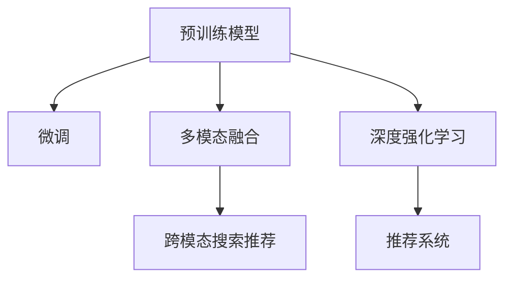

                 

# 搜索推荐系统中的AI大模型算法创新

## 1. 背景介绍

### 1.1 问题由来
在互联网高速发展的今天，搜索引擎和推荐系统已成为人们获取信息、发现内容的重要工具。传统的搜索结果排序、商品推荐算法大多基于浅层机器学习技术，如逻辑回归、支持向量机等。这些算法依赖于手动设计的特征和规则，难以捕捉复杂的用户行为和需求。随着深度学习技术的兴起，大模型（Large Models）特别是预训练语言模型（Pre-trained Language Models, PLMs）在搜索引擎和推荐系统中逐步成为主流，为搜索推荐带来了新的希望。

### 1.2 问题核心关键点
大模型在搜索推荐中的应用，主要体现在以下几个方面：

1. **预训练模型**：通过在海量无标签数据上进行自监督学习，大模型可以学习到丰富的语义知识，提升对文本的理解和生成能力。
2. **微调**：将预训练模型应用于特定任务（如搜索相关性排序、推荐内容生成等），通过有监督学习进一步优化模型性能。
3. **多模态融合**：结合图像、视频、文本等多种模态数据，构建跨模态搜索推荐系统。
4. **深度强化学习**：利用强化学习算法优化搜索策略，提高推荐的精准度和用户满意度。

这些技术的发展，使得搜索推荐系统能够更好地理解用户需求，提供个性化、精准的内容推荐，极大地提升了用户体验和信息获取效率。

### 1.3 问题研究意义
研究搜索推荐系统中的AI大模型算法创新，对于提升搜索推荐系统的智能化水平、个性化程度和用户体验具有重要意义：

1. **提升精准度**：大模型能够学习到更丰富的语义知识，提升搜索结果的相关性和推荐内容的个性化程度，减少用户获取信息的成本。
2. **提高效率**：大模型的高效计算能力，可以显著缩短搜索和推荐的响应时间，提升用户体验。
3. **增强灵活性**：大模型的可微调性，使其能够根据不同应用场景进行定制，灵活适应各种业务需求。
4. **促进创新**：大模型的涌现，为搜索推荐技术的创新提供了新的工具和平台，推动搜索推荐领域的快速发展。

## 2. 核心概念与联系

### 2.1 核心概念概述

为更好地理解搜索推荐系统中的AI大模型算法创新，本节将介绍几个密切相关的核心概念：

- **预训练模型(Pre-trained Models)**：在大规模无标签数据上训练的深度神经网络模型，如BERT、GPT、ALBERT等，具备强大的语义理解和生成能力。
- **微调(Fine-tuning)**：在预训练模型的基础上，针对特定任务进行微调，优化模型在该任务上的性能。
- **多模态融合(Multi-modal Fusion)**：结合文本、图像、视频等多种模态数据，构建跨模态搜索推荐系统，提升系统的智能化和适应性。
- **深度强化学习(Deep Reinforcement Learning, DRL)**：利用强化学习算法优化搜索推荐策略，提高推荐的精准度和用户满意度。
- **召回率(Recall)**：指检索出的相关文档或推荐内容中，实际相关文档或内容的比例。
- **精准度(Precision)**：指检索出的相关文档或推荐内容中，真正符合用户需求的文档或内容的比例。

这些核心概念之间的逻辑关系可以通过以下Mermaid流程图来展示：



这个流程图展示了大模型的核心概念及其之间的关系：

1. 预训练模型通过大规模无标签数据进行自监督学习，获得强大的语义表示能力。
2. 微调技术将预训练模型应用于特定任务，进一步优化模型性能。
3. 多模态融合结合多种数据模态，构建更全面的搜索推荐系统。
4. 深度强化学习优化推荐策略，提高推荐的精准度和用户体验。

这些概念共同构成了搜索推荐系统中的AI大模型应用框架，为其智能化和个性化提供了强大的技术支撑。

## 3. 核心算法原理 & 具体操作步骤
### 3.1 算法原理概述

基于大模型的搜索推荐系统，其核心思想是：利用预训练模型的强大语义表示能力，通过微调技术优化模型针对特定任务的性能，同时结合多模态数据和多模态融合技术，构建跨模态搜索推荐系统，最后利用深度强化学习算法进一步优化推荐策略，提升系统精准度和用户体验。

### 3.2 算法步骤详解

#### 3.2.1 预训练模型选择
- 选择合适的预训练模型，如BERT、GPT、ALBERT等，作为初始化参数。
- 确定模型的输入输出格式，如文本、图像、视频等。

#### 3.2.2 数据准备
- 收集大量的无标签数据，用于预训练模型的训练。
- 准备目标任务的数据集，如用户行为数据、产品信息数据等，用于模型的微调。

#### 3.2.3 微调模型
- 对预训练模型进行微调，优化模型在特定任务上的性能。
- 选择合适的损失函数和优化算法，如交叉熵损失、AdamW等。
- 设置微调的超参数，如学习率、批大小、迭代轮数等。

#### 3.2.4 多模态融合
- 收集和整合多种模态的数据，如文本、图像、视频等。
- 设计合适的融合模型，如文本-图像、图像-视频融合模型。
- 训练融合模型，优化融合后的数据表示。

#### 3.2.5 深度强化学习
- 设计奖励函数和策略网络，优化推荐策略。
- 利用强化学习算法（如DQN、SAC等）训练策略网络。
- 在真实环境中测试策略网络的性能，迭代优化策略。

#### 3.2.6 部署与评估
- 将训练好的模型部署到生产环境。
- 定期评估模型的性能，如召回率、精准度、用户体验等指标。
- 根据评估结果，进一步优化模型和算法。

### 3.3 算法优缺点

基于大模型的搜索推荐系统具有以下优点：
1. **强大的语义表示能力**：预训练模型能够学习到丰富的语义知识，提升对文本的理解和生成能力。
2. **灵活的微调**：通过微调技术，模型可以根据不同任务进行优化，提升模型性能。
3. **跨模态融合**：结合多种数据模态，构建更全面的搜索推荐系统，提升系统的智能化和适应性。
4. **高效的强化学习**：利用强化学习算法优化推荐策略，提高推荐的精准度和用户满意度。

同时，该方法也存在一定的局限性：
1. **数据依赖**：预训练模型和大模型微调需要大量的数据，数据获取成本高。
2. **计算资源需求高**：大模型训练和推理需要大量的计算资源，对硬件设备要求高。
3. **可解释性不足**：大模型往往像"黑盒"，难以解释其内部工作机制和决策逻辑。
4. **泛化能力有限**：大模型在不同领域和场景上的泛化能力有待进一步提升。

尽管存在这些局限性，但就目前而言，基于大模型的搜索推荐系统仍是最主流的技术范式，能够显著提升搜索推荐系统的智能化水平和用户体验。未来相关研究的重点在于如何进一步降低数据依赖，提高模型的跨领域泛化能力，同时兼顾可解释性和效率等因素。

### 3.4 算法应用领域

基于大模型的搜索推荐系统已经在多个领域得到广泛应用，包括：

- **电商推荐**：通过用户行为数据和产品信息数据，推荐商品，提升电商平台的销售和用户满意度。
- **内容推荐**：利用用户评论、点赞、浏览等行为数据，推荐文章、视频、音乐等内容，提升内容平台的活跃度和用户粘性。
- **搜索引擎**：通过用户搜索查询，推荐相关的网页和文档，提升搜索结果的相关性和用户体验。
- **智能广告**：根据用户行为数据，推荐个性化的广告，提升广告的点击率和转化率。
- **金融投资**：利用市场数据和用户行为数据，推荐股票、基金等投资产品，提升用户的投资回报。

除了上述这些经典应用外，大模型在智能问答、虚拟助手、智能客服等诸多场景中，也有广泛的应用前景，为搜索推荐技术带来了新的突破。

## 4. 数学模型和公式 & 详细讲解
### 4.1 数学模型构建

本节将使用数学语言对基于大模型的搜索推荐系统进行更加严格的刻画。

假设预训练模型为 $M_{\theta}$，其中 $\theta$ 为模型参数。给定搜索引擎推荐任务 $T$，假设用户输入的查询 $q$ 和相关的文本数据 $x$，任务的目标是预测 $q$ 与 $x$ 的相关性 $y$，如1表示相关，0表示不相关。

定义模型 $M_{\theta}$ 在输入 $(x, q)$ 上的损失函数为 $\ell(M_{\theta}(x), q, y)$，则在数据集 $D=\{(x_i, q_i, y_i)\}_{i=1}^N$ 上的经验风险为：

$$
\mathcal{L}(\theta) = \frac{1}{N} \sum_{i=1}^N \ell(M_{\theta}(x_i), q_i, y_i)
$$

其中 $\ell$ 为交叉熵损失函数，用于衡量模型预测与真实标签之间的差异。

微调的优化目标是最小化经验风险，即找到最优参数：

$$
\theta^* = \mathop{\arg\min}_{\theta} \mathcal{L}(\theta)
$$

在实践中，我们通常使用基于梯度的优化算法（如Adam、SGD等）来近似求解上述最优化问题。设 $\eta$ 为学习率，$\lambda$ 为正则化系数，则参数的更新公式为：

$$
\theta \leftarrow \theta - \eta \nabla_{\theta}\mathcal{L}(\theta) - \eta\lambda\theta
$$

其中 $\nabla_{\theta}\mathcal{L}(\theta)$ 为损失函数对参数 $\theta$ 的梯度，可通过反向传播算法高效计算。

### 4.2 公式推导过程

以下我们以电商推荐任务为例，推导交叉熵损失函数及其梯度的计算公式。

假设模型 $M_{\theta}$ 在输入 $(x_i, q_i)$ 上的输出为 $\hat{y}=M_{\theta}(x_i, q_i) \in [0,1]$，表示查询 $q_i$ 与文本 $x_i$ 的相关性预测。真实标签 $y_i \in \{0,1\}$。则二分类交叉熵损失函数定义为：

$$
\ell(M_{\theta}(x_i, q_i), q_i, y_i) = -[y_i\log \hat{y} + (1-y_i)\log(1-\hat{y})]
$$

将其代入经验风险公式，得：

$$
\mathcal{L}(\theta) = -\frac{1}{N}\sum_{i=1}^N [y_i\log M_{\theta}(x_i, q_i)+(1-y_i)\log(1-M_{\theta}(x_i, q_i))]
$$

根据链式法则，损失函数对参数 $\theta_k$ 的梯度为：

$$
\frac{\partial \mathcal{L}(\theta)}{\partial \theta_k} = -\frac{1}{N}\sum_{i=1}^N (\frac{y_i}{M_{\theta}(x_i, q_i)}-\frac{1-y_i}{1-M_{\theta}(x_i, q_i)}) \frac{\partial M_{\theta}(x_i, q_i)}{\partial \theta_k}
$$

其中 $\frac{\partial M_{\theta}(x_i, q_i)}{\partial \theta_k}$ 可进一步递归展开，利用自动微分技术完成计算。

在得到损失函数的梯度后，即可带入参数更新公式，完成模型的迭代优化。重复上述过程直至收敛，最终得到适应电商推荐任务的最优模型参数 $\theta^*$。

## 5. 项目实践：代码实例和详细解释说明
### 5.1 开发环境搭建

在进行搜索推荐系统的大模型微调实践前，我们需要准备好开发环境。以下是使用Python进行PyTorch开发的环境配置流程：

1. 安装Anaconda：从官网下载并安装Anaconda，用于创建独立的Python环境。

2. 创建并激活虚拟环境：
```bash
conda create -n pytorch-env python=3.8 
conda activate pytorch-env
```

3. 安装PyTorch：根据CUDA版本，从官网获取对应的安装命令。例如：
```bash
conda install pytorch torchvision torchaudio cudatoolkit=11.1 -c pytorch -c conda-forge
```

4. 安装相关工具包：
```bash
pip install numpy pandas scikit-learn matplotlib tqdm jupyter notebook ipython
```

完成上述步骤后，即可在`pytorch-env`环境中开始搜索推荐系统的大模型微调实践。

### 5.2 源代码详细实现

下面我们以电商推荐任务为例，给出使用Transformers库对BERT模型进行微调的PyTorch代码实现。

首先，定义电商推荐任务的数据处理函数：

```python
from transformers import BertTokenizer
from torch.utils.data import Dataset
import torch

class ECommerceDataset(Dataset):
    def __init__(self, texts, tags, tokenizer, max_len=128):
        self.texts = texts
        self.tags = tags
        self.tokenizer = tokenizer
        self.max_len = max_len
        
    def __len__(self):
        return len(self.texts)
    
    def __getitem__(self, item):
        text = self.texts[item]
        tags = self.tags[item]
        
        encoding = self.tokenizer(text, return_tensors='pt', max_length=self.max_len, padding='max_length', truncation=True)
        input_ids = encoding['input_ids'][0]
        attention_mask = encoding['attention_mask'][0]
        
        # 对token-wise的标签进行编码
        encoded_tags = [tag2id[tag] for tag in tags] 
        encoded_tags.extend([tag2id['O']] * (self.max_len - len(encoded_tags)))
        labels = torch.tensor(encoded_tags, dtype=torch.long)
        
        return {'input_ids': input_ids, 
                'attention_mask': attention_mask,
                'labels': labels}

# 标签与id的映射
tag2id = {'O': 0, 'B': 1, 'I': 2}
id2tag = {v: k for k, v in tag2id.items()}

# 创建dataset
tokenizer = BertTokenizer.from_pretrained('bert-base-cased')

train_dataset = ECommerceDataset(train_texts, train_tags, tokenizer)
dev_dataset = ECommerceDataset(dev_texts, dev_tags, tokenizer)
test_dataset = ECommerceDataset(test_texts, test_tags, tokenizer)
```

然后，定义模型和优化器：

```python
from transformers import BertForTokenClassification, AdamW

model = BertForTokenClassification.from_pretrained('bert-base-cased', num_labels=len(tag2id))

optimizer = AdamW(model.parameters(), lr=2e-5)
```

接着，定义训练和评估函数：

```python
from torch.utils.data import DataLoader
from tqdm import tqdm
from sklearn.metrics import classification_report

device = torch.device('cuda') if torch.cuda.is_available() else torch.device('cpu')
model.to(device)

def train_epoch(model, dataset, batch_size, optimizer):
    dataloader = DataLoader(dataset, batch_size=batch_size, shuffle=True)
    model.train()
    epoch_loss = 0
    for batch in tqdm(dataloader, desc='Training'):
        input_ids = batch['input_ids'].to(device)
        attention_mask = batch['attention_mask'].to(device)
        labels = batch['labels'].to(device)
        model.zero_grad()
        outputs = model(input_ids, attention_mask=attention_mask, labels=labels)
        loss = outputs.loss
        epoch_loss += loss.item()
        loss.backward()
        optimizer.step()
    return epoch_loss / len(dataloader)

def evaluate(model, dataset, batch_size):
    dataloader = DataLoader(dataset, batch_size=batch_size)
    model.eval()
    preds, labels = [], []
    with torch.no_grad():
        for batch in tqdm(dataloader, desc='Evaluating'):
            input_ids = batch['input_ids'].to(device)
            attention_mask = batch['attention_mask'].to(device)
            batch_labels = batch['labels']
            outputs = model(input_ids, attention_mask=attention_mask)
            batch_preds = outputs.logits.argmax(dim=2).to('cpu').tolist()
            batch_labels = batch_labels.to('cpu').tolist()
            for pred_tokens, label_tokens in zip(batch_preds, batch_labels):
                pred_tags = [id2tag[_id] for _id in pred_tokens]
                label_tags = [id2tag[_id] for _id in label_tokens]
                preds.append(pred_tags[:len(label_tags)])
                labels.append(label_tags)
                
    print(classification_report(labels, preds))
```

最后，启动训练流程并在测试集上评估：

```python
epochs = 5
batch_size = 16

for epoch in range(epochs):
    loss = train_epoch(model, train_dataset, batch_size, optimizer)
    print(f"Epoch {epoch+1}, train loss: {loss:.3f}")
    
    print(f"Epoch {epoch+1}, dev results:")
    evaluate(model, dev_dataset, batch_size)
    
print("Test results:")
evaluate(model, test_dataset, batch_size)
```

以上就是使用PyTorch对BERT进行电商推荐任务微调的完整代码实现。可以看到，得益于Transformers库的强大封装，我们可以用相对简洁的代码完成BERT模型的加载和微调。

### 5.3 代码解读与分析

让我们再详细解读一下关键代码的实现细节：

**ECommerceDataset类**：
- `__init__`方法：初始化文本、标签、分词器等关键组件。
- `__len__`方法：返回数据集的样本数量。
- `__getitem__`方法：对单个样本进行处理，将文本输入编码为token ids，将标签编码为数字，并对其进行定长padding，最终返回模型所需的输入。

**tag2id和id2tag字典**：
- 定义了标签与数字id之间的映射关系，用于将token-wise的预测结果解码回真实的标签。

**训练和评估函数**：
- 使用PyTorch的DataLoader对数据集进行批次化加载，供模型训练和推理使用。
- 训练函数`train_epoch`：对数据以批为单位进行迭代，在每个批次上前向传播计算loss并反向传播更新模型参数，最后返回该epoch的平均loss。
- 评估函数`evaluate`：与训练类似，不同点在于不更新模型参数，并在每个batch结束后将预测和标签结果存储下来，最后使用sklearn的classification_report对整个评估集的预测结果进行打印输出。

**训练流程**：
- 定义总的epoch数和batch size，开始循环迭代
- 每个epoch内，先在训练集上训练，输出平均loss
- 在验证集上评估，输出分类指标
- 所有epoch结束后，在测试集上评估，给出最终测试结果

可以看到，PyTorch配合Transformers库使得BERT微调的代码实现变得简洁高效。开发者可以将更多精力放在数据处理、模型改进等高层逻辑上，而不必过多关注底层的实现细节。

当然，工业级的系统实现还需考虑更多因素，如模型的保存和部署、超参数的自动搜索、更灵活的任务适配层等。但核心的微调范式基本与此类似。

## 6. 实际应用场景
### 6.1 智能广告推荐

基于大模型搜索推荐系统的智能广告推荐，通过用户行为数据和产品信息数据，推荐个性化的广告，提升广告的点击率和转化率。广告主可以根据广告效果进行实时调整，优化广告投放策略。

在技术实现上，可以收集用户浏览、点击、评论、分享等行为数据，将广告和商品数据作为输入，构建广告推荐模型。利用微调技术优化广告相关性和用户体验，同时在广告投放中引入强化学习算法，动态调整投放策略，提升广告效果。

### 6.2 内容推荐系统

内容推荐系统通过用户评论、点赞、浏览等行为数据，推荐文章、视频、音乐等内容，提升内容平台的活跃度和用户粘性。大模型可以通过对文本、图片、音频等多模态数据的理解，实现跨模态推荐。

具体而言，可以收集用户的历史行为数据，结合多模态数据构建推荐模型。利用微调技术优化模型，提升推荐相关性。同时在推荐过程中引入强化学习算法，动态调整推荐策略，实现个性化推荐。

### 6.3 金融投资推荐

金融投资推荐系统利用市场数据和用户行为数据，推荐股票、基金等投资产品，提升用户的投资回报。大模型可以通过对金融市场数据的理解，预测市场趋势，优化投资组合。

在技术实现上，可以收集用户的历史投资行为数据，结合市场数据构建投资推荐模型。利用微调技术优化模型，提升投资推荐的准确性和用户满意度。同时引入强化学习算法，动态调整投资策略，实现个性化推荐。

### 6.4 未来应用展望

随着大模型和微调技术的不断发展，搜索推荐系统将在更多领域得到应用，为各行各业带来变革性影响。

在智慧医疗领域，基于大模型的搜索推荐系统可以辅助医生诊疗，推荐相关医学文献和知识库，提升医疗服务的智能化水平。

在智能教育领域，大模型可以推荐个性化学习内容，辅助学生学习，提升教育公平和教学质量。

在智慧城市治理中，大模型可以推荐智慧城市管理策略，优化城市资源配置，提升城市管理智能化水平。

此外，在企业生产、社会治理、文娱传媒等众多领域，基于大模型的搜索推荐技术也将不断涌现，为传统行业数字化转型升级提供新的技术路径。

## 7. 工具和资源推荐
### 7.1 学习资源推荐

为了帮助开发者系统掌握大模型搜索推荐技术的理论基础和实践技巧，这里推荐一些优质的学习资源：

1. 《Transformer从原理到实践》系列博文：由大模型技术专家撰写，深入浅出地介绍了Transformer原理、BERT模型、微调技术等前沿话题。

2. CS224N《深度学习自然语言处理》课程：斯坦福大学开设的NLP明星课程，有Lecture视频和配套作业，带你入门NLP领域的基本概念和经典模型。

3. 《Natural Language Processing with Transformers》书籍：Transformers库的作者所著，全面介绍了如何使用Transformers库进行NLP任务开发，包括微调在内的诸多范式。

4. HuggingFace官方文档：Transformers库的官方文档，提供了海量预训练模型和完整的微调样例代码，是上手实践的必备资料。

5. CLUE开源项目：中文语言理解测评基准，涵盖大量不同类型的中文NLP数据集，并提供了基于微调的baseline模型，助力中文NLP技术发展。

通过对这些资源的学习实践，相信你一定能够快速掌握大模型搜索推荐技术的精髓，并用于解决实际的NLP问题。
###  7.2 开发工具推荐

高效的开发离不开优秀的工具支持。以下是几款用于大模型搜索推荐开发的常用工具：

1. PyTorch：基于Python的开源深度学习框架，灵活动态的计算图，适合快速迭代研究。大部分预训练语言模型都有PyTorch版本的实现。

2. TensorFlow：由Google主导开发的开源深度学习框架，生产部署方便，适合大规模工程应用。同样有丰富的预训练语言模型资源。

3. Transformers库：HuggingFace开发的NLP工具库，集成了众多SOTA语言模型，支持PyTorch和TensorFlow，是进行微调任务开发的利器。

4. Weights & Biases：模型训练的实验跟踪工具，可以记录和可视化模型训练过程中的各项指标，方便对比和调优。与主流深度学习框架无缝集成。

5. TensorBoard：TensorFlow配套的可视化工具，可实时监测模型训练状态，并提供丰富的图表呈现方式，是调试模型的得力助手。

6. Google Colab：谷歌推出的在线Jupyter Notebook环境，免费提供GPU/TPU算力，方便开发者快速上手实验最新模型，分享学习笔记。

合理利用这些工具，可以显著提升大模型搜索推荐任务的开发效率，加快创新迭代的步伐。

### 7.3 相关论文推荐

大模型和搜索推荐技术的发展源于学界的持续研究。以下是几篇奠基性的相关论文，推荐阅读：

1. Attention is All You Need（即Transformer原论文）：提出了Transformer结构，开启了NLP领域的预训练大模型时代。

2. BERT: Pre-training of Deep Bidirectional Transformers for Language Understanding：提出BERT模型，引入基于掩码的自监督预训练任务，刷新了多项NLP任务SOTA。

3. Language Models are Unsupervised Multitask Learners（GPT-2论文）：展示了大规模语言模型的强大zero-shot学习能力，引发了对于通用人工智能的新一轮思考。

4. Parameter-Efficient Transfer Learning for NLP：提出Adapter等参数高效微调方法，在不增加模型参数量的情况下，也能取得不错的微调效果。

5. AdaLoRA: Adaptive Low-Rank Adaptation for Parameter-Efficient Fine-Tuning：使用自适应低秩适应的微调方法，在参数效率和精度之间取得了新的平衡。

6. Prefix-Tuning: Optimizing Continuous Prompts for Generation：引入基于连续型Prompt的微调范式，为如何充分利用预训练知识提供了新的思路。

这些论文代表了大模型搜索推荐技术的发展脉络。通过学习这些前沿成果，可以帮助研究者把握学科前进方向，激发更多的创新灵感。

## 8. 总结：未来发展趋势与挑战
### 8.1 总结

本文对基于大模型的搜索推荐系统进行了全面系统的介绍。首先阐述了大模型和微调技术的研究背景和意义，明确了搜索推荐系统中的AI大模型应用方向。其次，从原理到实践，详细讲解了搜索推荐系统的数学模型构建和核心算法步骤，给出了微调任务开发的完整代码实例。同时，本文还广泛探讨了搜索推荐系统在电商推荐、智能广告、内容推荐等诸多领域的应用前景，展示了AI大模型在搜索推荐领域的巨大潜力。

通过本文的系统梳理，可以看到，基于大模型的搜索推荐系统正在成为互联网领域的重要技术范式，极大地提升了搜索推荐系统的智能化水平和用户体验。未来相关研究的重点在于如何进一步降低数据依赖，提高模型的跨领域泛化能力，同时兼顾可解释性和效率等因素。

### 8.2 未来发展趋势

展望未来，大模型的搜索推荐系统将呈现以下几个发展趋势：

1. **规模持续增大**：随着算力成本的下降和数据规模的扩张，预训练语言模型的参数量还将持续增长。超大规模语言模型蕴含的丰富语义知识，有望支撑更加复杂多变的搜索推荐任务。

2. **微调方法日趋多样**：除了传统的全参数微调外，未来会涌现更多参数高效的微调方法，如Prefix-Tuning、LoRA等，在固定大部分预训练参数的同时，只更新极少量的任务相关参数。同时优化微调模型的计算图，减少前向传播和反向传播的资源消耗，实现更加轻量级、实时性的部署。

3. **持续学习成为常态**：随着数据分布的不断变化，微调模型也需要持续学习新知识以保持性能。如何在不遗忘原有知识的同时，高效吸收新样本信息，将是重要的研究课题。

4. **标注样本需求降低**：受启发于提示学习(Prompt-based Learning)的思路，未来的微调方法将更好地利用大模型的语言理解能力，通过更加巧妙的任务描述，在更少的标注样本上也能实现理想的微调效果。

5. **多模态融合更加广泛**：当前的搜索推荐系统大多聚焦于文本数据，未来会进一步拓展到图像、视频、音频等多种模态数据微调。多模态信息的融合，将显著提升搜索推荐系统对现实世界的理解和建模能力。

6. **深度强化学习不断优化**：利用强化学习算法优化搜索推荐策略，提高推荐的精准度和用户满意度。

以上趋势凸显了大模型搜索推荐系统的广阔前景。这些方向的探索发展，必将进一步提升搜索推荐系统的智能化水平和用户体验。

### 8.3 面临的挑战

尽管大模型的搜索推荐系统已经取得了瞩目成就，但在迈向更加智能化、普适化应用的过程中，它仍面临着诸多挑战：

1. **数据依赖**：预训练模型和大模型微调需要大量的数据，数据获取成本高。

2. **计算资源需求高**：大模型训练和推理需要大量的计算资源，对硬件设备要求高。

3. **可解释性不足**：大模型往往像"黑盒"，难以解释其内部工作机制和决策逻辑。

4. **泛化能力有限**：大模型在不同领域和场景上的泛化能力有待进一步提升。

尽管存在这些局限性，但就目前而言，基于大模型的搜索推荐系统仍是最主流的技术范式，能够显著提升搜索推荐系统的智能化水平和用户体验。未来相关研究的重点在于如何进一步降低数据依赖，提高模型的跨领域泛化能力，同时兼顾可解释性和效率等因素。

### 8.4 研究展望

面对大模型搜索推荐系统所面临的种种挑战，未来的研究需要在以下几个方面寻求新的突破：

1. **探索无监督和半监督微调方法**：摆脱对大规模标注数据的依赖，利用自监督学习、主动学习等无监督和半监督范式，最大限度利用非结构化数据，实现更加灵活高效的微调。

2. **研究参数高效和计算高效的微调范式**：开发更加参数高效的微调方法，在固定大部分预训练参数的同时，只更新极少量的任务相关参数。同时优化微调模型的计算图，减少前向传播和反向传播的资源消耗，实现更加轻量级、实时性的部署。

3. **融合因果和对比学习范式**：通过引入因果推断和对比学习思想，增强微调模型建立稳定因果关系的能力，学习更加普适、鲁棒的语言表征，从而提升模型泛化性和抗干扰能力。

4. **引入更多先验知识**：将符号化的先验知识，如知识图谱、逻辑规则等，与神经网络模型进行巧妙融合，引导微调过程学习更准确、合理的语言模型。同时加强不同模态数据的整合，实现视觉、语音等多模态信息与文本信息的协同建模。

5. **结合因果分析和博弈论工具**：将因果分析方法引入微调模型，识别出模型决策的关键特征，增强输出解释的因果性和逻辑性。借助博弈论工具刻画人机交互过程，主动探索并规避模型的脆弱点，提高系统稳定性。

6. **纳入伦理道德约束**：在模型训练目标中引入伦理导向的评估指标，过滤和惩罚有偏见、有害的输出倾向。同时加强人工干预和审核，建立模型行为的监管机制，确保输出符合人类价值观和伦理道德。

这些研究方向的探索，必将引领大模型搜索推荐系统走向更高的台阶，为构建安全、可靠、可解释、可控的智能系统铺平道路。面向未来，大模型搜索推荐技术还需要与其他人工智能技术进行更深入的融合，如知识表示、因果推理、强化学习等，多路径协同发力，共同推动自然语言理解和智能交互系统的进步。只有勇于创新、敢于突破，才能不断拓展语言模型的边界，让智能技术更好地造福人类社会。

## 9. 附录：常见问题与解答

**Q1：大模型在搜索推荐中的优势是什么？**

A: 大模型在搜索推荐中的优势主要体现在以下几个方面：

1. **强大的语义表示能力**：预训练模型能够学习到丰富的语义知识，提升对文本的理解和生成能力。

2. **灵活的微调**：通过微调技术，模型可以根据不同任务进行优化，提升模型性能。

3. **跨模态融合**：结合多种数据模态，构建跨模态搜索推荐系统，提升系统的智能化和适应性。

4. **高效的强化学习**：利用强化学习算法优化推荐策略，提高推荐的精准度和用户满意度。

**Q2：如何选择合适的预训练模型？**

A: 选择合适的预训练模型，需考虑以下因素：

1. **任务匹配度**：选择与推荐任务最匹配的模型，如BERT适用于语义理解，GPT适用于文本生成。

2. **数据规模**：大模型需要大规模数据进行预训练，选择数据量充足的模型，如GPT-3、BERT等。

3. **计算资源**：大模型需要大量计算资源，选择合适的硬件设备，如GPU、TPU等。

**Q3：如何提高模型的泛化能力？**

A: 提高模型的泛化能力，可以从以下几个方面入手：

1. **增加数据多样性**：收集更多样化的数据，涵盖不同领域和场景，提升模型泛化能力。

2. **引入先验知识**：结合知识图谱、逻辑规则等专家知识，引导微调过程学习更准确、合理的语言模型。

3. **优化模型结构**：引入跨模态融合、因果推理等技术，增强模型的泛化性和鲁棒性。

**Q4：如何优化模型的计算效率？**

A: 优化模型的计算效率，可以从以下几个方面入手：

1. **参数剪枝**：去除不必要的层和参数，减小模型尺寸，加快推理速度。

2. **量化加速**：将浮点模型转为定点模型，压缩存储空间，提高计算效率。

3. **模型并行**：采用模型并行、梯度积累等技术，提升模型的并行计算能力。

4. **代码优化**：优化模型的计算图，减少前向传播和反向传播的资源消耗，实现更加轻量级、实时性的部署。

**Q5：如何评估模型的效果？**

A: 评估模型的效果，可以使用以下指标：

1. **召回率(Recall)**：指检索出的相关文档或推荐内容中，实际相关文档或内容的比例。

2. **精准度(Precision)**：指检索出的相关文档或推荐内容中，真正符合用户需求的文档或内容的比例。

3. **F1分数**：综合召回率和精准度，衡量模型的综合表现。

4. **用户满意度**：通过用户反馈和行为数据，评估模型的实际效果。

5. **AB测试**：在真实场景中进行AB测试，对比不同模型的性能表现。

---

作者：禅与计算机程序设计艺术 / Zen and the Art of Computer Programming

