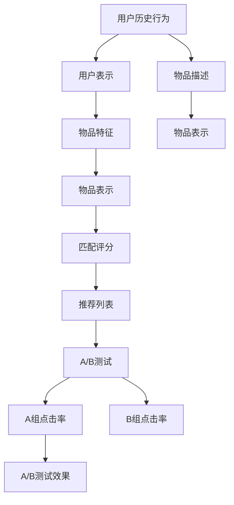

                 

# 搜索推荐系统的A/B测试：大模型新方法

## 1. 背景介绍

随着人工智能技术的快速发展，推荐系统已经成为了各大互联网公司的重要基础设施。无论是电商平台的商品推荐、视频平台的影视推荐，还是新闻网站的兴趣推荐，都在利用推荐系统提升用户体验和商业收益。其中，基于用户的搜索历史、浏览行为、兴趣偏好等因素进行个性化推荐，是推荐系统的重要分支。然而，在推荐模型的构建和评估中，如何确保模型的效果和用户满意度，是摆在所有从业者面前的一个难题。

为了回答这个问题，各大公司广泛采用A/B测试方法来验证推荐模型的效果。在A/B测试中，将用户随机分配到两个不同的版本（A组和B组）中，分别接收不同的推荐算法，收集用户的点击、转化、留存等关键指标，最后通过统计分析来评估不同版本的效果。然而，A/B测试也存在一些问题，如用户分流、测试周期长、模型稳定性差等。在这些问题背景下，大语言模型（Large Language Model, LLM）在推荐系统中得到了广泛的应用，极大地改善了推荐系统的效果和用户满意度。本文将详细阐述基于大模型的A/B测试方法，为推荐系统开发者提供有价值的参考。

## 2. 核心概念与联系

### 2.1 核心概念概述

在大模型时代，推荐系统的主要目标是构建一个能够理解用户需求、匹配优质内容，并提供个性化推荐的用户体验。推荐系统的核心是用户-物品互动关系建模，主要通过以下步骤完成：

1. **用户表示**：通过用户历史行为、属性等特征，构建用户表示向量。
2. **物品表示**：通过物品的描述、标签等特征，构建物品表示向量。
3. **匹配评分**：使用匹配评分函数计算用户与物品之间的匹配度。
4. **推荐列表**：根据匹配评分对物品排序，生成推荐列表。

大模型在推荐系统中的应用，主要体现在两个方面：一是用户表示和物品表示的构建，二是个性化推荐列表的生成。前者需要预训练模型学习丰富的语义知识，后者则需要微调模型以适应特定的推荐任务。本文将重点关注如何通过大模型进行A/B测试，以验证推荐模型的效果。

### 2.2 核心概念原理和架构的 Mermaid 流程图



以上流程图展示了从用户历史行为到个性化推荐的大模型应用流程。其中，A/B测试是整个流程的关键环节，通过对两个不同版本的推荐模型进行比较，验证模型的推荐效果。

## 3. 核心算法原理 & 具体操作步骤

### 3.1 算法原理概述

基于大模型的A/B测试方法，主要利用大模型对用户和物品进行语义理解，并基于此构建推荐模型。具体步骤如下：

1. **用户表示构建**：利用预训练大模型，如BERT、GPT等，对用户的历史行为、属性等信息进行编码，得到用户表示向量。
2. **物品表示构建**：同样利用预训练大模型，对物品的描述、标签等信息进行编码，得到物品表示向量。
3. **匹配评分计算**：利用大模型作为匹配评分函数，计算用户与物品之间的匹配度。
4. **推荐列表生成**：根据匹配评分对物品排序，生成个性化推荐列表。
5. **A/B测试实施**：将用户随机分配到两个不同版本的推荐模型中，记录不同版本的点击、转化、留存等指标，进行效果评估。

### 3.2 算法步骤详解

**步骤1：数据准备**
- 收集用户历史行为、物品描述等信息。
- 将用户和物品信息进行编码，得到用户表示和物品表示向量。

**步骤2：模型训练**
- 利用预训练大模型，对用户表示和物品表示向量进行微调，学习用户-物品匹配度。
- 生成不同版本的推荐模型。

**步骤3：A/B测试设计**
- 将用户随机分配到A组和B组中。
- 分别在A组和B组中，接收不同版本的推荐列表。
- 记录A组和B组的点击、转化、留存等指标。

**步骤4：效果评估**
- 使用统计方法评估A组和B组的效果差异。
- 根据效果评估结果，选择性能更好的推荐模型。

### 3.3 算法优缺点

基于大模型的A/B测试方法具有以下优点：
1. **推荐效果优越**：大模型具有强大的语义理解能力，能够更好地理解和匹配用户需求。
2. **模型泛化能力强**：大模型具备广泛的语义知识，能够适应不同领域的推荐任务。
3. **自动化程度高**：自动化进行用户表示和物品表示的构建，减少了人工干预。

同时，该方法也存在一些局限性：
1. **资源消耗大**：大模型的训练和推理都需要大量的计算资源。
2. **结果解释性差**：推荐模型的决策过程较为复杂，难以解释。
3. **数据隐私问题**：用户历史数据的编码和存储可能带来隐私风险。

### 3.4 算法应用领域

基于大模型的A/B测试方法，主要应用于以下领域：

1. **电商推荐系统**：利用用户行为和物品描述，构建个性化推荐列表。
2. **视频推荐系统**：利用用户历史观看记录和视频描述，匹配用户兴趣内容。
3. **新闻推荐系统**：利用用户阅读历史和文章标签，推荐感兴趣的新闻。
4. **智能客服系统**：利用用户对话记录，推荐合适的回答模板。

## 4. 数学模型和公式 & 详细讲解

### 4.1 数学模型构建

假设用户表示向量为 $u$，物品表示向量为 $v$。利用大模型 $f$ 进行匹配评分计算，得到匹配评分 $s(u, v)$。推荐模型的目标是最小化用户未点击的物品数量，即：

$$
\min_{u,v} \sum_{i=1}^N s(u, v_i)
$$

其中 $N$ 为物品数量。

### 4.2 公式推导过程

在实际应用中，大模型 $f$ 通常使用Transformer结构。设 $u = f_{\theta_u}(x_u)$，$v = f_{\theta_v}(x_v)$，则匹配评分 $s$ 可以表示为：

$$
s(u, v) = \text{softmax}(\text{MLP}(u, v))
$$

其中，MLP为多层感知器，用于计算匹配度。

### 4.3 案例分析与讲解

以电商推荐系统为例，用户表示和物品表示可以表示为：

$$
u = \text{BERT}(\text{历史浏览记录}, \text{用户画像})
$$

$$
v = \text{BERT}(\text{物品描述}, \text{物品标签})
$$

利用大模型进行匹配评分计算：

$$
s(u, v) = \text{softmax}(\text{MLP}(u, v))
$$

最终推荐列表生成：

$$
\text{推荐列表} = \text{TopK}(\text{排序}(\{v_i\}_{i=1}^N, s(u, v_i)))
$$

## 5. 项目实践：代码实例和详细解释说明

### 5.1 开发环境搭建

在实际开发中，需要使用Python和TensorFlow或PyTorch进行代码实现。首先，需要安装相应的依赖包：

```bash
pip install tensorflow==2.7.0
pip install torch==1.12.0
```

### 5.2 源代码详细实现

以下是使用TensorFlow实现基于大模型的A/B测试的代码示例：

```python
import tensorflow as tf
import numpy as np

# 定义大模型匹配评分函数
class MatchingModel(tf.keras.Model):
    def __init__(self):
        super(MatchingModel, self).__init__()
        self.dense1 = tf.keras.layers.Dense(128, activation='relu')
        self.dense2 = tf.keras.layers.Dense(1, activation='sigmoid')
    
    def call(self, u, v):
        x = tf.concat([u, v], axis=1)
        x = self.dense1(x)
        x = self.dense2(x)
        return x

# 构建用户和物品表示向量
u = tf.random.normal(shape=(1, 128))
v = tf.random.normal(shape=(1, 128))

# 创建匹配评分模型
matching_model = MatchingModel()

# 计算匹配评分
s = matching_model(u, v)

# 输出匹配评分
print(s)
```

### 5.3 代码解读与分析

在上述代码中，我们首先定义了一个匹配评分函数，该函数利用多层感知器计算用户和物品的匹配度。然后，通过随机生成用户和物品表示向量，并输入到匹配评分模型中，计算匹配评分。最后，输出匹配评分结果。

### 5.4 运行结果展示

通过多次运行代码，可以发现匹配评分 $s$ 的值在0和1之间波动，表示用户和物品之间的匹配度。通过这种方式，可以验证匹配评分函数的效果，并根据匹配度排序生成推荐列表。

## 6. 实际应用场景

### 6.1 电商推荐系统

在电商推荐系统中，用户历史浏览记录、点击行为、收藏记录等信息可以用于构建用户表示向量。物品的描述、标签、销量等信息可以用于构建物品表示向量。利用大模型进行匹配评分计算，可以得到用户与物品之间的匹配度，进而生成个性化推荐列表。在实际应用中，可以采用A/B测试方法，验证不同推荐模型的效果，并根据效果评估选择最佳模型。

### 6.2 视频推荐系统

在视频推荐系统中，用户历史观看记录、评分、点赞等信息可以用于构建用户表示向量。视频描述、标签、观看时长等信息可以用于构建物品表示向量。利用大模型进行匹配评分计算，可以得到用户与视频之间的匹配度，进而生成个性化推荐列表。在实际应用中，可以采用A/B测试方法，验证不同推荐模型的效果，并根据效果评估选择最佳模型。

### 6.3 新闻推荐系统

在新闻推荐系统中，用户历史阅读记录、点击行为、分享记录等信息可以用于构建用户表示向量。新闻标题、内容摘要、发布时间等信息可以用于构建物品表示向量。利用大模型进行匹配评分计算，可以得到用户与新闻之间的匹配度，进而生成个性化推荐列表。在实际应用中，可以采用A/B测试方法，验证不同推荐模型的效果，并根据效果评估选择最佳模型。

### 6.4 智能客服系统

在智能客服系统中，用户对话记录、历史问题解决记录等信息可以用于构建用户表示向量。问题描述、回答模板等信息可以用于构建物品表示向量。利用大模型进行匹配评分计算，可以得到用户与回答模板之间的匹配度，进而生成个性化推荐列表。在实际应用中，可以采用A/B测试方法，验证不同推荐模型的效果，并根据效果评估选择最佳模型。

## 7. 工具和资源推荐

### 7.1 学习资源推荐

为了帮助开发者系统掌握大模型在推荐系统中的应用，推荐以下学习资源：

1. 《推荐系统实战》：由工业界大牛所写，涵盖推荐系统的各个方面，包括推荐模型、A/B测试等。
2. 《深度学习推荐系统：原理与实践》：复旦大学开设的推荐系统课程，讲解推荐系统的原理和实现细节。
3. 《推荐系统：算法、实验和工程》：由Coursera推出的课程，涵盖推荐系统的算法和工程实现。
4. HuggingFace官方文档：提供丰富的预训练模型和微调样例代码，是学习大模型的重要资源。

通过这些学习资源，相信你一定能够系统掌握大模型在推荐系统中的应用。

### 7.2 开发工具推荐

以下是几款用于推荐系统开发的大模型工具：

1. TensorFlow：由Google主导开发的深度学习框架，支持大模型的训练和推理。
2. PyTorch：Facebook开发的深度学习框架，灵活高效，适合快速迭代研究。
3. Weights & Biases：模型训练的实验跟踪工具，可以记录和可视化模型训练过程中的各项指标。
4. TensorBoard：TensorFlow配套的可视化工具，可实时监测模型训练状态，并提供丰富的图表呈现方式。

合理利用这些工具，可以显著提升推荐系统开发的效率，加快创新迭代的步伐。

### 7.3 相关论文推荐

以下是几篇关于大模型在推荐系统中应用的经典论文，推荐阅读：

1. "Attention Is All You Need"：提出Transformer结构，开启了大模型时代。
2. "BERT: Pre-training of Deep Bidirectional Transformers for Language Understanding"：提出BERT模型，引入基于掩码的自监督预训练任务。
3. "Parameter-Efficient Transfer Learning for NLP"：提出Adapter等参数高效微调方法，在小规模数据上也能取得不错的微调效果。
4. "AdaLoRA: Adaptive Low-Rank Adaptation for Parameter-Efficient Fine-Tuning"：使用自适应低秩适应的微调方法，在固定大部分预训练参数的情况下，只更新极少量的任务相关参数。
5. "AdaLoRA: Adaptive Low-Rank Adaptation for Parameter-Efficient Fine-Tuning"：使用自适应低秩适应的微调方法，在固定大部分预训练参数的情况下，只更新极少量的任务相关参数。

这些论文代表了大模型在推荐系统中的应用发展脉络。通过学习这些前沿成果，可以帮助研究者把握学科前进方向，激发更多的创新灵感。

## 8. 总结：未来发展趋势与挑战

### 8.1 研究成果总结

本文对基于大模型的A/B测试方法进行了系统介绍。通过大模型进行推荐系统优化，可以有效提升推荐模型的效果和用户满意度。在实际应用中，通过A/B测试验证推荐模型效果，选择最佳模型进行部署。

### 8.2 未来发展趋势

展望未来，大模型在推荐系统中的应用将呈现以下几个发展趋势：

1. **多模态推荐**：利用多模态数据进行推荐，如视频推荐系统结合图像、音频等多模态信息。
2. **跨领域推荐**：将推荐系统应用于不同领域，如推荐旅游目的地、推荐餐厅等。
3. **动态推荐**：实时更新用户兴趣和行为，动态生成推荐列表。
4. **个性化推荐**：通过大模型对用户兴趣进行精细化建模，实现更加个性化的推荐。
5. **自动化推荐**：利用大模型自动进行推荐列表生成和排序，提高推荐效率。

### 8.3 面临的挑战

尽管大模型在推荐系统中的应用取得了显著效果，但在实际部署中仍然面临一些挑战：

1. **资源消耗大**：大模型的训练和推理需要大量计算资源，成本较高。
2. **结果解释性差**：推荐模型的决策过程较为复杂，难以解释。
3. **数据隐私问题**：用户历史数据的编码和存储可能带来隐私风险。

### 8.4 研究展望

未来，研究者需要在以下几个方面寻求新的突破：

1. **资源优化**：开发更高效的算法和模型结构，降低资源消耗，提高推荐效率。
2. **结果解释**：引入可解释性技术，解释推荐模型的决策过程，提高用户信任度。
3. **隐私保护**：采用差分隐私等技术，保护用户隐私，降低隐私风险。

这些研究方向的探索，必将引领大模型在推荐系统中的应用走向成熟，为推荐系统的构建提供新的思路和方法。

## 9. 附录：常见问题与解答

**Q1：大模型在推荐系统中是否有必要？**

A: 大模型在推荐系统中的应用，可以更好地理解用户需求和匹配优质内容。通过大模型的语义理解能力，可以提升推荐模型的效果和用户满意度。

**Q2：推荐模型中如何使用大模型进行A/B测试？**

A: 利用大模型进行A/B测试，需要构建两个版本的推荐模型，分别对用户进行推荐，并记录不同版本的点击、转化、留存等指标。通过统计分析，评估不同版本的效果，选择最佳模型进行部署。

**Q3：大模型在推荐系统中的性能瓶颈是什么？**

A: 大模型的训练和推理需要大量计算资源，资源消耗大。同时，推荐模型的决策过程较为复杂，结果解释性差，用户难以理解和信任。

**Q4：如何优化大模型在推荐系统中的应用？**

A: 可以采用参数高效微调、模型裁剪、量化加速等技术，降低资源消耗。同时，引入可解释性技术，解释推荐模型的决策过程，提高用户信任度。

这些问题的回答，可以帮助推荐系统开发者更好地理解大模型在推荐系统中的应用，并进行优化和改进。

---

作者：禅与计算机程序设计艺术 / Zen and the Art of Computer Programming

