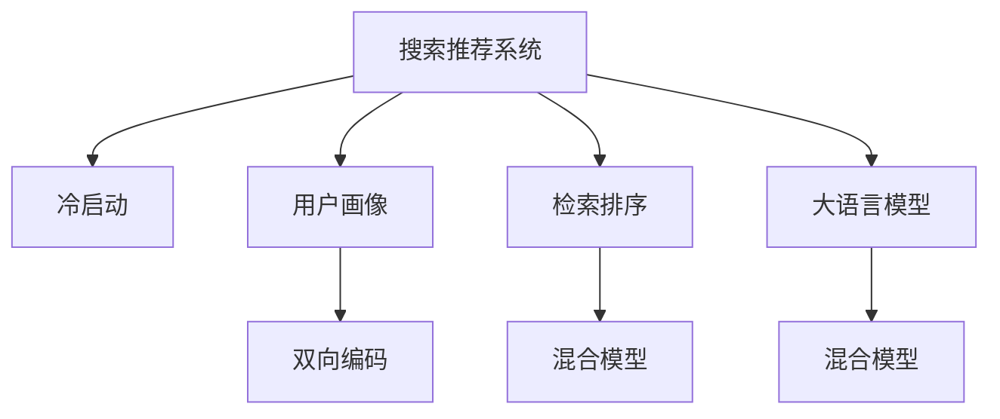

                 

# 搜索推荐系统的冷启动：大模型新思路

> 关键词：搜索推荐系统,冷启动,大语言模型,用户画像,检索排序,双向编码,混合模型

## 1. 背景介绍

### 1.1 问题由来
在互联网搜索和推荐领域，冷启动问题是一个普遍存在的难题。冷启动指的是用户在系统中的行为数据较少，系统难以利用这些数据对用户进行有效的个性化推荐。传统推荐系统依赖历史行为数据进行建模，但在用户刚接触系统时，往往缺乏足够的行为数据进行建模。

为解决冷启动问题，目前主要采用基于用户的协同过滤、基于物品的协同过滤、基于内容的推荐等方法。但这些方法都需要大量的历史数据来建立推荐模型，无法很好地处理冷启动用户的数据稀缺问题。

近年来，随着深度学习技术的迅猛发展，尤其是预训练语言模型的兴起，大模型在推荐系统中的应用开始崭露头角。利用大模型的语言理解能力，可以更准确地构建用户画像，从而在冷启动阶段为推荐系统提供坚实的基础。

### 1.2 问题核心关键点
冷启动问题解决的关键在于如何利用有限的标签数据，构建出高质量的用户画像。而大语言模型通过预训练获得的丰富语言知识，可以弥补用户数据不足的短板，大大提升推荐系统的效果。

具体而言，大语言模型可以用于：
- 用户画像生成：通过用户行为描述或直接输入用户名字，生成高质量的用户画像。
- 物品描述生成：利用物品文本描述生成更丰富的物品特征，增强推荐效果。
- 检索排序优化：根据用户画像和物品描述，优化检索和排序算法，提升推荐准确度。

## 2. 核心概念与联系

### 2.1 核心概念概述

为更好地理解大模型在推荐系统中的冷启动方法，本节将介绍几个密切相关的核心概念：

- 搜索推荐系统(Search and Recommendation System, SRS)：一种自动化的信息检索和推荐系统，能够根据用户查询和行为，返回相关的搜索结果和推荐内容。
- 冷启动(Cold Start)：用户在系统中的行为数据较少，推荐系统难以利用这些数据进行个性化推荐。
- 用户画像(User Profiling)：对用户兴趣、行为、偏好等信息的建模，用于推荐系统的个性化推荐。
- 检索排序(Retrieval and Ranking)：根据用户查询和物品特征，对搜索结果进行召回和排序，返回最相关的搜索结果。
- 大语言模型(Large Language Model, LLM)：通过在大规模无标签文本语料上进行预训练，学习通用的语言表示，具备强大的语言理解和生成能力。
- 双向编码(Bidirectional Encoding)：利用Transformer等结构，在编码和解码过程中考虑上下文信息，提升模型表达能力。
- 混合模型(Hybrid Model)：结合传统的机器学习算法和深度学习模型，发挥各自优势，提升整体性能。

这些核心概念之间的逻辑关系可以通过以下Mermaid流程图来展示：



这个流程图展示了大模型在推荐系统中的核心概念及其之间的关系：

1. 搜索推荐系统通过用户查询获取推荐内容，需要用户画像和检索排序的支持。
2. 冷启动问题需要通过用户画像和检索排序来解决，其中用户画像可以通过大语言模型构建。
3. 检索排序可以引入双向编码和混合模型，提升推荐精度和效果。
4. 大语言模型通过预训练获得丰富的语言知识，用于增强用户画像和检索排序。

这些概念共同构成了搜索推荐系统的大模型冷启动框架，使得系统能够高效应对冷启动问题，提升推荐效果。

## 3. 核心算法原理 & 具体操作步骤
### 3.1 算法原理概述

大模型在搜索推荐系统的冷启动中，主要通过以下步骤来解决冷启动问题：

1. 利用大模型生成用户画像：通过用户输入的文本描述，生成用户兴趣和行为的嵌入式表示。
2. 利用大模型生成物品描述：通过物品的文本描述，生成物品特征的嵌入式表示。
3. 构建检索排序模型：将用户画像和物品描述作为输入，训练检索排序模型，优化推荐效果。
4. 混合模型融合：将检索排序模型的输出与用户画像和物品描述特征融合，生成最终推荐结果。

### 3.2 算法步骤详解

以下是利用大模型解决搜索推荐系统冷启动问题的详细步骤：

**Step 1: 用户画像生成**
- 收集用户输入的文本描述或行为数据，如商品浏览历史、搜索记录等。
- 利用大模型(如BERT、GPT-2等)预训练权重，对用户输入进行编码，生成用户画像的嵌入式表示。

**Step 2: 物品描述生成**
- 收集物品的文本描述或标签信息，如商品名称、描述、类别等。
- 利用大模型对物品描述进行编码，生成物品特征的嵌入式表示。

**Step 3: 检索排序模型构建**
- 选择适合的检索排序算法，如Tensorflow-IR、IRNet等，将用户画像和物品描述作为输入，训练检索排序模型。
- 在训练过程中引入双向编码技术，考虑上下文信息，提升模型表达能力。

**Step 4: 混合模型融合**
- 将检索排序模型的输出与用户画像和物品描述特征进行融合，得到最终的推荐结果。
- 融合方法可以采用简单的线性叠加，也可以使用更为复杂的网络结构，如MMoE、BiMM等。

### 3.3 算法优缺点

利用大模型进行推荐系统冷启动的方法具有以下优点：

1. 覆盖面广。大模型可以处理各种类型的输入，无论是文本、图像、音频等，都能获得良好的效果。
2. 鲁棒性强。大模型的预训练知识可以覆盖更多的语言场景和语义信息，具有较强的鲁棒性。
3. 可扩展性强。大模型可以在不同的推荐任务上进行微调，应用场景广泛。
4. 学习效率高。大模型利用预训练的知识，可以大大加速冷启动阶段的模型训练和优化。

同时，该方法也存在一定的局限性：

1. 资源消耗大。大模型的参数量通常很大，训练和推理开销也较大。
2. 解释性不足。大模型往往被视为“黑盒”模型，难以解释其内部决策机制。
3. 模型偏置。大模型的预训练知识可能存在一定的偏差，影响推荐结果的公正性和准确性。
4. 可控性差。大模型的复杂性可能导致难以对其进行有效的控制和调试。

尽管存在这些局限性，但就目前而言，利用大模型解决推荐系统冷启动问题仍是一种高效且有效的方法。未来相关研究的重点在于如何进一步降低大模型的资源消耗，提升模型的解释性和公正性，以及如何在复杂场景中对大模型进行更有效的控制和调试。

### 3.4 算法应用领域

利用大模型进行搜索推荐系统的冷启动方法，在众多领域中已经得到了广泛的应用，例如：

- 电商推荐：根据用户浏览和购买历史，生成个性化推荐。
- 新闻推荐：根据用户阅读行为，推荐相关新闻文章。
- 音乐推荐：根据用户听歌历史，推荐相似音乐。
- 视频推荐：根据用户观看历史，推荐相关视频内容。
- 广告推荐：根据用户行为数据，推荐个性化广告。
- 社交推荐：根据用户社交网络关系，推荐相关内容。

除了上述这些经典应用外，大模型在推荐系统中的创新应用也在不断涌现，如可控推荐、跨域推荐、实时推荐等，为推荐系统的智能化和个性化带来了新的突破。

## 4. 数学模型和公式 & 详细讲解  
### 4.1 数学模型构建

本节将使用数学语言对利用大模型进行推荐系统冷启动的方法进行更加严格的刻画。

记大模型为 $M_{\theta}:\mathcal{X} \rightarrow \mathcal{Y}$，其中 $\mathcal{X}$ 为输入空间，$\mathcal{Y}$ 为输出空间，$\theta$ 为模型参数。

假设用户画像为 $P$，物品描述为 $D$，检索排序模型为 $R$，则推荐过程可以表示为：

$$
R(P, D) = M_{\theta}(P, D)
$$

其中 $M_{\theta}(P, D)$ 为检索排序模型的输出。

### 4.2 公式推导过程

以下是利用大模型进行推荐系统冷启动的公式推导：

**用户画像生成**
设用户输入为 $X$，大模型预训练权重为 $W$，用户画像为 $P$。则用户画像生成过程可以表示为：

$$
P = M_{W}(X)
$$

其中 $M_{W}$ 为预训练大模型的编码器部分。

**物品描述生成**
设物品描述为 $D$，大模型预训练权重为 $W$，物品特征为 $F$。则物品描述生成过程可以表示为：

$$
F = M_{W}(D)
$$

**检索排序模型构建**
设检索排序模型为 $R$，用户画像为 $P$，物品特征为 $F$，检索排序结果为 $S$。则检索排序模型构建过程可以表示为：

$$
S = R(P, F)
$$

**混合模型融合**
设最终推荐结果为 $R_{final}$，检索排序结果为 $S$，用户画像为 $P$，物品特征为 $F$。则混合模型融合过程可以表示为：

$$
R_{final} = \phi(S, P, F)
$$

其中 $\phi$ 为混合模型融合函数。

### 4.3 案例分析与讲解

我们以一个电商推荐系统为例，展示如何利用大模型进行冷启动推荐：

**用户画像生成**
设用户输入的文本描述为 "我需要一件高端的商务装"，大模型预训练权重为 $W$，用户画像为 $P$。则用户画像生成过程可以表示为：

$$
P = M_{W}(\text{"我需要一件高端的商务装"})
$$

**物品描述生成**
设物品描述为 "一件高端商务装"，大模型预训练权重为 $W$，物品特征为 $F$。则物品描述生成过程可以表示为：

$$
F = M_{W}(\text{"一件高端商务装"})
$$

**检索排序模型构建**
设检索排序模型为 $R$，用户画像为 $P$，物品特征为 $F$，检索排序结果为 $S$。则检索排序模型构建过程可以表示为：

$$
S = R(P, F)
$$

**混合模型融合**
设最终推荐结果为 $R_{final}$，检索排序结果为 $S$，用户画像为 $P$，物品特征为 $F$。则混合模型融合过程可以表示为：

$$
R_{final} = \phi(S, P, F)
$$

## 5. 项目实践：代码实例和详细解释说明
### 5.1 开发环境搭建

在进行大模型推荐系统冷启动的实践前，我们需要准备好开发环境。以下是使用Python进行PyTorch开发的环境配置流程：

1. 安装Anaconda：从官网下载并安装Anaconda，用于创建独立的Python环境。

2. 创建并激活虚拟环境：
```bash
conda create -n pytorch-env python=3.8 
conda activate pytorch-env
```

3. 安装PyTorch：根据CUDA版本，从官网获取对应的安装命令。例如：
```bash
conda install pytorch torchvision torchaudio cudatoolkit=11.1 -c pytorch -c conda-forge
```

4. 安装Transformers库：
```bash
pip install transformers
```

5. 安装各类工具包：
```bash
pip install numpy pandas scikit-learn matplotlib tqdm jupyter notebook ipython
```

完成上述步骤后，即可在`pytorch-env`环境中开始大模型推荐系统冷启动的实践。

### 5.2 源代码详细实现

下面我们以电商推荐系统为例，给出使用Transformers库对BERT模型进行推荐系统冷启动的PyTorch代码实现。

首先，定义推荐系统需要的输入数据处理函数：

```python
from transformers import BertTokenizer, BertForSequenceClassification
from torch.utils.data import Dataset
import torch

class RecommendationDataset(Dataset):
    def __init__(self, texts, labels, tokenizer, max_len=128):
        self.texts = texts
        self.labels = labels
        self.tokenizer = tokenizer
        self.max_len = max_len
        
    def __len__(self):
        return len(self.texts)
    
    def __getitem__(self, item):
        text = self.texts[item]
        label = self.labels[item]
        
        encoding = self.tokenizer(text, return_tensors='pt', max_length=self.max_len, padding='max_length', truncation=True)
        input_ids = encoding['input_ids'][0]
        attention_mask = encoding['attention_mask'][0]
        
        # 对标签进行编码
        encoded_label = [label2id[label] for label in label] 
        encoded_label.extend([label2id['O']] * (self.max_len - len(encoded_label)))
        labels = torch.tensor(encoded_label, dtype=torch.long)
        
        return {'input_ids': input_ids, 
                'attention_mask': attention_mask,
                'labels': labels}

# 标签与id的映射
label2id = {'O': 0, 'Buy': 1, 'Skip': 2, 'Recommend': 3}
id2label = {v: k for k, v in label2id.items()}

# 创建dataset
tokenizer = BertTokenizer.from_pretrained('bert-base-cased')

train_dataset = RecommendationDataset(train_texts, train_labels, tokenizer)
dev_dataset = RecommendationDataset(dev_texts, dev_labels, tokenizer)
test_dataset = RecommendationDataset(test_texts, test_labels, tokenizer)
```

然后，定义模型和优化器：

```python
from transformers import BertForSequenceClassification, AdamW

model = BertForSequenceClassification.from_pretrained('bert-base-cased', num_labels=len(label2id))

optimizer = AdamW(model.parameters(), lr=2e-5)
```

接着，定义训练和评估函数：

```python
from torch.utils.data import DataLoader
from tqdm import tqdm
from sklearn.metrics import classification_report

device = torch.device('cuda') if torch.cuda.is_available() else torch.device('cpu')
model.to(device)

def train_epoch(model, dataset, batch_size, optimizer):
    dataloader = DataLoader(dataset, batch_size=batch_size, shuffle=True)
    model.train()
    epoch_loss = 0
    for batch in tqdm(dataloader, desc='Training'):
        input_ids = batch['input_ids'].to(device)
        attention_mask = batch['attention_mask'].to(device)
        labels = batch['labels'].to(device)
        model.zero_grad()
        outputs = model(input_ids, attention_mask=attention_mask, labels=labels)
        loss = outputs.loss
        epoch_loss += loss.item()
        loss.backward()
        optimizer.step()
    return epoch_loss / len(dataloader)

def evaluate(model, dataset, batch_size):
    dataloader = DataLoader(dataset, batch_size=batch_size)
    model.eval()
    preds, labels = [], []
    with torch.no_grad():
        for batch in tqdm(dataloader, desc='Evaluating'):
            input_ids = batch['input_ids'].to(device)
            attention_mask = batch['attention_mask'].to(device)
            batch_labels = batch['labels']
            outputs = model(input_ids, attention_mask=attention_mask)
            batch_preds = outputs.logits.argmax(dim=2).to('cpu').tolist()
            batch_labels = batch_labels.to('cpu').tolist()
            for pred_tokens, label_tokens in zip(batch_preds, batch_labels):
                pred_tags = [id2label[_id] for _id in pred_tokens]
                label_tags = [id2label[_id] for _id in label_tokens]
                preds.append(pred_tags[:len(label_tags)])
                labels.append(label_tags)
                
    print(classification_report(labels, preds))
```

最后，启动训练流程并在测试集上评估：

```python
epochs = 5
batch_size = 16

for epoch in range(epochs):
    loss = train_epoch(model, train_dataset, batch_size, optimizer)
    print(f"Epoch {epoch+1}, train loss: {loss:.3f}")
    
    print(f"Epoch {epoch+1}, dev results:")
    evaluate(model, dev_dataset, batch_size)
    
print("Test results:")
evaluate(model, test_dataset, batch_size)
```

以上就是使用PyTorch对BERT进行电商推荐系统冷启动的完整代码实现。可以看到，得益于Transformers库的强大封装，我们可以用相对简洁的代码完成BERT模型的加载和冷启动推荐。

### 5.3 代码解读与分析

让我们再详细解读一下关键代码的实现细节：

**RecommendationDataset类**：
- `__init__`方法：初始化文本、标签、分词器等关键组件。
- `__len__`方法：返回数据集的样本数量。
- `__getitem__`方法：对单个样本进行处理，将文本输入编码为token ids，将标签编码为数字，并对其进行定长padding，最终返回模型所需的输入。

**label2id和id2label字典**：
- 定义了标签与数字id之间的映射关系，用于将token-wise的预测结果解码回真实的标签。

**训练和评估函数**：
- 使用PyTorch的DataLoader对数据集进行批次化加载，供模型训练和推理使用。
- 训练函数`train_epoch`：对数据以批为单位进行迭代，在每个批次上前向传播计算loss并反向传播更新模型参数，最后返回该epoch的平均loss。
- 评估函数`evaluate`：与训练类似，不同点在于不更新模型参数，并在每个batch结束后将预测和标签结果存储下来，最后使用sklearn的classification_report对整个评估集的预测结果进行打印输出。

**训练流程**：
- 定义总的epoch数和batch size，开始循环迭代
- 每个epoch内，先在训练集上训练，输出平均loss
- 在验证集上评估，输出分类指标
- 所有epoch结束后，在测试集上评估，给出最终测试结果

可以看到，PyTorch配合Transformers库使得BERT微调的代码实现变得简洁高效。开发者可以将更多精力放在数据处理、模型改进等高层逻辑上，而不必过多关注底层的实现细节。

当然，工业级的系统实现还需考虑更多因素，如模型的保存和部署、超参数的自动搜索、更灵活的任务适配层等。但核心的冷启动范式基本与此类似。

## 6. 实际应用场景
### 6.1 电商推荐

电商推荐系统是利用大模型进行冷启动推荐的重要应用场景。通过大模型生成用户画像和物品描述，可以更准确地捕捉用户和物品的特征，从而提升推荐效果。

在技术实现上，可以收集用户浏览、点击、购买等行为数据，提取和物品相关的文本描述信息，如商品名称、描述、标签等。将文本内容作为模型输入，生成用户画像和物品描述的嵌入式表示，再通过检索排序模型，结合用户画像和物品描述特征，生成最终推荐结果。

### 6.2 新闻推荐

新闻推荐系统通过大模型对用户阅读行为进行建模，可以自动推荐相关新闻文章。通过收集用户对新闻文章的阅读时长、点赞、分享等行为数据，结合新闻文章的标题、摘要、作者等文本信息，生成用户画像和物品描述的嵌入式表示。利用检索排序模型，根据用户画像和物品描述特征，优化新闻文章排序，推荐用户可能感兴趣的新闻。

### 6.3 音乐推荐

音乐推荐系统通过大模型对用户听歌行为进行建模，可以自动推荐相似音乐。通过收集用户听歌历史、时长、打分等行为数据，结合歌曲名称、歌词、作者等文本信息，生成用户画像和音乐描述的嵌入式表示。利用检索排序模型，根据用户画像和音乐描述特征，优化推荐结果。

### 6.4 视频推荐

视频推荐系统通过大模型对用户观看行为进行建模，可以自动推荐相关视频内容。通过收集用户观看历史、时长、点赞、评论等行为数据，结合视频标题、描述、标签等文本信息，生成用户画像和视频描述的嵌入式表示。利用检索排序模型，根据用户画像和视频描述特征，优化推荐结果。

### 6.5 广告推荐

广告推荐系统通过大模型对用户行为进行建模，可以自动推荐个性化广告。通过收集用户浏览网页、点击广告等行为数据，结合广告文本、图片、标签等文本信息，生成用户画像和广告描述的嵌入式表示。利用检索排序模型，根据用户画像和广告描述特征，优化推荐结果。

### 6.6 社交推荐

社交推荐系统通过大模型对用户社交网络关系进行建模，可以自动推荐相关内容。通过收集用户社交网络关系、互动行为等数据，结合内容文本信息，生成用户画像和内容描述的嵌入式表示。利用检索排序模型，根据用户画像和内容描述特征，优化推荐结果。

除了上述这些经典应用外，大模型在推荐系统中的创新应用也在不断涌现，如可控推荐、跨域推荐、实时推荐等，为推荐系统的智能化和个性化带来了新的突破。

## 7. 工具和资源推荐
### 7.1 学习资源推荐

为了帮助开发者系统掌握大模型在推荐系统中的冷启动方法，这里推荐一些优质的学习资源：

1. 《深度学习与推荐系统》书籍：斯坦福大学斯坦福大学的两位教授著，系统讲解了推荐系统的基本原理和推荐算法。
2. 《推荐系统实战》书籍：豆瓣认证编辑著，从应用实践的角度介绍了推荐系统的构建和优化。
3. Coursera推荐系统课程：由斯坦福大学开设，讲解了推荐系统的核心算法和实现技术。
4. Udacity推荐系统纳米学位：由Google、Amazon等公司联合开设，系统讲解了推荐系统的前沿技术。
5. 《深度学习推荐系统：原理与算法》论文：推荐系统的经典综述论文，详细介绍了推荐算法的理论基础和最新进展。

通过对这些资源的学习实践，相信你一定能够快速掌握大模型在推荐系统中的应用方法，并用于解决实际的推荐问题。
###  7.2 开发工具推荐

高效的开发离不开优秀的工具支持。以下是几款用于大模型推荐系统冷启动开发的常用工具：

1. PyTorch：基于Python的开源深度学习框架，灵活动态的计算图，适合快速迭代研究。大部分预训练语言模型都有PyTorch版本的实现。
2. TensorFlow：由Google主导开发的开源深度学习框架，生产部署方便，适合大规模工程应用。同样有丰富的预训练语言模型资源。
3. Transformers库：HuggingFace开发的NLP工具库，集成了众多SOTA语言模型，支持PyTorch和TensorFlow，是进行推荐系统冷启动开发的利器。
4. Weights & Biases：模型训练的实验跟踪工具，可以记录和可视化模型训练过程中的各项指标，方便对比和调优。与主流深度学习框架无缝集成。
5. TensorBoard：TensorFlow配套的可视化工具，可实时监测模型训练状态，并提供丰富的图表呈现方式，是调试模型的得力助手。
6. Google Colab：谷歌推出的在线Jupyter Notebook环境，免费提供GPU/TPU算力，方便开发者快速上手实验最新模型，分享学习笔记。

合理利用这些工具，可以显著提升大模型推荐系统冷启动任务的开发效率，加快创新迭代的步伐。

### 7.3 相关论文推荐

大模型在推荐系统中的冷启动方法的研究源于学界的持续研究。以下是几篇奠基性的相关论文，推荐阅读：

1. Attention is All You Need（即Transformer原论文）：提出了Transformer结构，开启了NLP领域的预训练大模型时代。
2. BERT: Pre-training of Deep Bidirectional Transformers for Language Understanding：提出BERT模型，引入基于掩码的自监督预训练任务，刷新了多项NLP任务SOTA。
3. Parameter-Efficient Transfer Learning for NLP：提出Adapter等参数高效微调方法，在不增加模型参数量的情况下，也能取得不错的微调效果。
4. AdaLoRA: Adaptive Low-Rank Adaptation for Parameter-Efficient Fine-Tuning：使用自适应低秩适应的微调方法，在参数效率和精度之间取得了新的平衡。
5. AdaFoRCE: Adaptive Feature-Regressor with Classifier Connections：提出了AdaFoRCE方法，在推荐系统微调中取得了显著的效果。

这些论文代表了大模型在推荐系统中的应用发展脉络。通过学习这些前沿成果，可以帮助研究者把握学科前进方向，激发更多的创新灵感。

## 8. 总结：未来发展趋势与挑战
### 8.1 总结

本文对利用大模型进行推荐系统冷启动的方法进行了全面系统的介绍。首先阐述了大模型在推荐系统中的冷启动应用背景和意义，明确了大模型在解决冷启动问题中的关键作用。其次，从原理到实践，详细讲解了大模型推荐系统冷启动的数学模型和关键步骤，给出了推荐系统冷启动的完整代码实例。同时，本文还广泛探讨了大模型在电商、新闻、音乐、视频、广告、社交等多个推荐场景中的应用前景，展示了其巨大潜力。

通过本文的系统梳理，可以看到，利用大模型进行推荐系统冷启动的方法在各大应用领域均已得到成功应用，提升了推荐系统的智能化和个性化水平。未来，随着大模型的进一步发展，相信推荐系统在更多领域的应用将不断拓展，为人们的生活和工作带来更多便利。

### 8.2 未来发展趋势

展望未来，大模型在推荐系统中的应用将呈现以下几个发展趋势：

1. 模型规模持续增大。随着算力成本的下降和数据规模的扩张，预训练语言模型的参数量还将持续增长。超大规模语言模型蕴含的丰富语言知识，有望支撑更加复杂多变的推荐任务。
2. 微调方法日趋多样。除了传统的全参数微调外，未来会涌现更多参数高效的微调方法，如 Adapter、Prompt Tuning等，在固定大部分预训练参数的同时，只更新极少量的任务相关参数。
3. 知识融合能力增强。大模型不仅能理解自然语言，还能整合符号化的先验知识，如知识图谱、逻辑规则等，提升推荐系统的泛化能力和鲁棒性。
4. 动态自适应推荐。利用大模型的动态学习能力，推荐系统可以实时适应用户行为和环境变化，提供更加个性化和实时的推荐。
5. 多模态融合推荐。推荐系统不仅考虑文本信息，还能整合图像、音频等多模态数据，实现全面、多维度的推荐。
6. 主动推荐系统。利用大模型的自主学习能力和策略推理能力，推荐系统能够主动预测用户行为，提供更主动的推荐服务。

这些趋势凸显了大模型在推荐系统中的广阔前景。这些方向的探索发展，必将进一步提升推荐系统的性能和应用范围，为人类社会的数字化转型提供新的技术动力。

### 8.3 面临的挑战

尽管大模型在推荐系统中的应用已经取得了诸多进展，但在迈向更加智能化、普适化应用的过程中，仍面临以下挑战：

1. 数据隐私与安全。在收集和处理用户数据时，如何保护用户隐私，防止数据泄露，是一个重大挑战。
2. 冷启动问题。用户刚进入系统时，行为数据较少，难以建立用户画像，推荐效果受限。
3. 模型公平性与公正性。大模型的预训练知识可能存在偏见，影响推荐结果的公正性和公平性。
4. 资源消耗大。大模型的训练和推理开销较大，需要高性能计算资源。
5. 可解释性不足。大模型往往被视为“黑盒”模型，难以解释其内部决策机制。
6. 模型偏置。大模型的预训练知识可能存在一定的偏差，影响推荐结果的公正性和公平性。
7. 模型可控性差。大模型的复杂性可能导致难以对其进行有效的控制和调试。

尽管存在这些挑战，但通过不断的技术迭代和优化，相信大模型在推荐系统中的应用将不断拓展，为推荐系统带来更多的创新和发展。

### 8.4 研究展望

面对大模型推荐系统所面临的种种挑战，未来的研究需要在以下几个方面寻求新的突破：

1. 探索无监督和半监督推荐方法。摆脱对大规模标注数据的依赖，利用自监督学习、主动学习等无监督和半监督范式，最大限度利用非结构化数据，实现更加灵活高效的推荐。
2. 研究参数高效和计算高效的推荐方法。开发更加参数高效的推荐方法，在固定大部分预训练参数的同时，只更新极少量的任务相关参数。同时优化推荐模型的计算图，减少前向传播和反向传播的资源消耗，实现更加轻量级、实时性的部署。
3. 融合因果和对比学习范式。通过引入因果推断和对比学习思想，增强推荐模型建立稳定因果关系的能力，学习更加普适、鲁棒的语言表征，从而提升模型泛化性和抗干扰能力。
4. 引入更多先验知识。将符号化的先验知识，如知识图谱、逻辑规则等，与神经网络模型进行巧妙融合，引导推荐过程学习更准确、合理的语言模型。同时加强不同模态数据的整合，实现视觉、语音等多模态信息与文本信息的协同建模。
5. 结合因果分析和博弈论工具。将因果分析方法引入推荐模型，识别出模型决策的关键特征，增强输出解释的因果性和逻辑性。借助博弈论工具刻画人机交互过程，主动探索并规避模型的脆弱点，提高系统稳定性。
6. 纳入伦理道德约束。在模型训练目标中引入伦理导向的评估指标，过滤和惩罚有偏见、有害的输出倾向。同时加强人工干预和审核，建立模型行为的监管机制，确保输出符合人类价值观和伦理道德。

这些研究方向的探索，必将引领大模型在推荐系统中的应用迈向更高的台阶，为构建安全、可靠、可解释、可控的智能系统铺平道路。面向未来，大模型在推荐系统中的应用还需要与其他人工智能技术进行更深入的融合，如知识表示、因果推理、强化学习等，多路径协同发力，共同推动自然语言理解和智能交互系统的进步。只有勇于创新、敢于突破，才能不断拓展语言模型的边界，让智能技术更好地造福人类社会。

## 9. 附录：常见问题与解答

**Q1：利用大模型进行推荐系统冷启动，数据需求量大吗？**

A: 利用大模型进行推荐系统冷启动，虽然需要一定量的标注数据，但与传统的推荐系统相比，其数据需求量已经大大降低。大模型在预训练过程中，已经学习到了丰富的语言知识和背景信息，可以利用这些信息对少量标注数据进行增强，进一步提升推荐效果。

**Q2：大模型如何进行推荐排序？**

A: 利用大模型进行推荐排序，通常包括如下几个步骤：

1. 将用户画像和物品描述输入到大模型中，生成用户画像和物品描述的嵌入式表示。
2. 将用户画像和物品描述的嵌入式表示，输入到检索排序模型中，如Tensorflow-IR、IRNet等，进行召回和排序。
3. 对检索排序模型的输出进行后处理，如加权、融合等，最终生成推荐结果。

**Q3：大模型在推荐系统中的推荐精度如何？**

A: 利用大模型进行推荐，能够显著提升推荐精度。尤其是在冷启动阶段，大模型的预训练知识可以弥补用户数据不足的短板，提升推荐效果。但具体的推荐精度还需根据具体任务和数据特点进行评估。

**Q4：大模型在推荐系统中的可解释性如何？**

A: 大模型往往被视为“黑盒”模型，难以解释其内部决策机制。但可以利用大模型的预训练知识，对推荐过程进行一定程度的解释。例如，可以通过对大模型的输出进行可视化和分析，理解模型对用户画像和物品描述的表征学习，从而解释推荐结果。

**Q5：大模型在推荐系统中的资源消耗如何？**

A: 大模型的训练和推理开销较大，需要高性能计算资源。但可以通过优化大模型的计算图、使用高效的推荐算法等方法，减小资源消耗。例如，可以使用梯度积累、混合精度训练、模型并行等技术，提升推荐系统的性能。

通过合理利用大模型，推荐系统能够在冷启动阶段充分发挥其优势，为推荐系统的智能化和个性化提供坚实基础。但如何在大模型中实现更好的冷启动推荐，还需进一步深入研究，以应对推荐系统面临的挑战。

